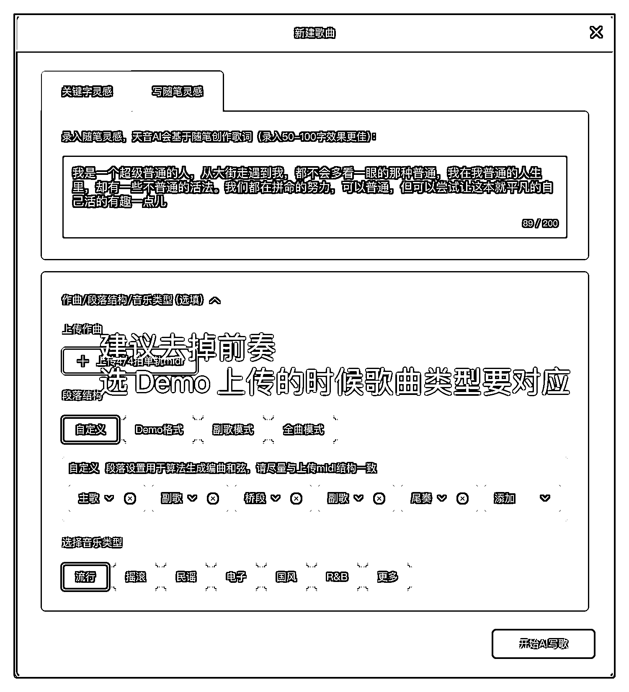

# 网易云-腾讯音乐人认证项目分享（详细流程）

> 原文：[`www.yuque.com/for_lazy/zhoubao/zm2y5rrlzet31rfr`](https://www.yuque.com/for_lazy/zhoubao/zm2y5rrlzet31rfr)

## (16 赞)网易云-腾讯音乐人认证项目分享（详细流程）

作者： 睡不着的阿凯

日期：2024-05-08

**写在前面**

各位圈友大家好，我是***睡不着的阿凯***。

翻了一下自己发贴的记录，上一次还是 2020 年底，之前发的内容包括外卖 CPS 和红包封面，在发布以后都在生财有术变得比较热门，希望这次贴子也能给圈友一些项目灵感。

这次带来的项目我在生财里搜索了一下，没有相关分享，在网上搜索了一下也没有看到比较详细的教程，应该算得上全网首发了。

之所以写这篇文章，是因为在风向标里看到有几个圈友分享关于认证音乐人以后领取网易云黑胶会员，还有参与网易云梯计划获取平台奖励收益的动态。

其实腾讯音乐人也有这个收益奖励，而音乐人认证是想要做这个项目必须操作的一步。

做云梯计划都是去网上找音乐人代认证，恰好因为这个云梯计划的项目最近热度比较高，所以有认证音乐人需求的网赚群体非常多，上面是闲鱼的数据。

如果不想做代认证，也可以通过这个方式自己发布作品后通过播放歌曲获得云梯计划的收益。

相信各位看完这个贴子都能够实操上手，通过做音乐人代认证获得副业收入。

废话不多说，接下来开始正文，文章比较长，尽可能写的详细完善。

## **音乐人身份的概念**

比如网易云，在认证音乐人的时候，有几个身份可以选择，包括歌手、作曲、作词、编曲。

有些人管认证的身份叫做“标”，比如两个标，指的是网易云音乐人+歌手/作曲/作词/编曲（其中一种身份），全标指的是网易云音乐人+歌手+作词+作曲+编曲（五标，全身份）

腾讯音乐人身份类似，但是不同的是腾讯音乐人的歌曲会同时分发在 QQ 音乐、酷狗音乐、酷我音乐三个平台，播放数据也是三个平台加起来。

腾讯音乐人的作品可以通过身份绑定显示在视频号主页，不知道视频号的播放算不算在里面，也许腾讯音乐人的收益数据更好。

## **音乐人身份认证定价**

有些店铺是有音乐功底能力的工作室或者个人，他们更加专业一些，但是我们普通人肯定不具备这样的技能，所以下边讲的操作背景都是不具备音乐技能的操作方式。

右边店铺有提到露脸清唱，之所以有这个是因为在音乐人认证的时候审核会因为疑似搬运或者账号问题被审核拒绝，清唱是为了证明确实是自己唱的。

因为这个导致了收费标准有区别，一般能露脸的收费就是 29，只有一个歌手的标，这个其实就是翻唱别人的歌曲。

不露脸的收费贵一些，全身份收费 69 甚至更高。因为认证音乐人有概率不过，所以基本都会说明不过退款，无法通过的原因和账号关系比较大。

这个定价可以根据自己的实际情况进行调整。

## **音乐人身份认证步骤**

无论是网易云音乐还是 QQ 音乐，都可以在手机上进行操作认证，但是因为我们还要制作音乐，所以全部以电脑端操作举例，腾讯音乐人操作步骤流程和网易云几乎相同。

#### **第一步，音乐人入驻申请。**

打开网易云创作者中心，[`music.163.com/#/creatorcenter?module=creatorcenter`](https://music.163.com/#/creatorcenter?module=creatorcenter)，选择网易音乐人入口，填写个人信息。

腾讯音乐人入驻网址为[`y.tencentmusic.com/`](https://y.tencentmusic.com/)，顶部有音乐人开放平台。

圈出来的是在入驻的时候需要注意的地方。

1.  艺人名就是歌手名，可以不用姓名也可以和网易云昵称不同，建议使用中文艺人名，包含英文容易在审核身份的时候被拒绝。

2.  用中文网名或者姓名就会好很多，注意艺人名不要出现不文明或者明星相关的名字，艺人名是可以和其他普通不知名艺人重名的。

3.  流派风格建议选择流行，这个比较通用，如果选择摇滚说唱等风格，那么上传的作品就需要是相关的，这个对专业要求比较高。

4.  艺人介绍相当于自我介绍，可以去一些小歌手下面复制修改，尽可能写的文艺有特色一些，（毕竟我们是玩音乐的 hhhhh），不要随便乱写，也不要用英文，避免审核的时候被拒绝。

5.  入驻资料最下边的其他站外平台信息不需要填写。

然后把其他信息都补充完整以后，就可以提交了。

#### **第二步，上传作品审核。**

这个页面有三种身份可以选择，我们主要用到的是左边两个，也就是歌手和作词作曲。

根据客户的情况选择不同的入驻类型。

##### **第一种类型：客户可以露脸清唱。**

如果客户选择了可以露脸清唱的认证方式，那就用翻唱的方式来认证，认证以后会显示网易云音乐人+歌手的身份。

为了提高审核通过率，建议用最省事儿的办法来操作，我们不提供歌曲，也不帮助翻唱，让客户去下载全民 K 歌唱一首歌，唱好以后，再用手机自拍清唱一段，并且介绍自己入驻网易云音乐人，艺名是 xxx。

**有人会问，既然客户自己去唱了，我们提供什么服务呢？**

话术就是我们提供调音和音质优化转码以及辅助邀请入驻，可以大大提高通过率。调音下边会单独讲，辅助邀请入驻就是个噱头，懂得都懂。

**翻唱选歌的技巧**

先问一下客户会唱的歌，或者拿手的歌，根据客户擅长的歌去网易云搜索这首歌看有没有翻唱。

比如搜索林宥嘉的《说谎》这首歌有翻唱的歌曲，那就说明这首歌的版权网易云允许翻唱上架。然后让客户去全民 K 歌唱这首歌，唱好以后拿到作品链接。

用解析工具把视频或者 mp3 音频下载下来（比如[`kg.iiilab.com/`](http://kg.iiilab.com/)或[`tool.fyovo.cn/`](https://tool.fyovo.cn/)）。

关于全民 K 歌唱歌的技巧，可以参考[`www.bilibili.com/video/BV1m54y1X7mU/`](https://www.bilibili.com/video/BV1m54y1X7mU/)，引导客户调整设置升降调、混响效果和伴奏人声音量，避免出现部分高音唱不上去导致歌曲听感较差审核被拒绝。

**拿到歌曲以后就开始正式的歌手入驻操作。**

创建专辑的时候专辑名称可以是歌曲名称也可以不同。

封面可以用 AI 生成一张图片，避免出现人脸，作为专辑封面。也可以用客户自己拍的照片作为专辑封面，封面图片一定不能太难看。

因为是翻唱，所以歌曲类型需要选择翻唱。

无论是网易云还是 QQ 音乐，都会对歌曲音频参数有要求。

所以我们需要对客户发的翻唱的音频进行参数修改和格式转换。

转换以后歌曲上架就会有 SQ 音质或者 Hi-Res 音质的标示。

歌曲上传之前，我们需要用到**格式工厂**这个软件进行调整。

把音频的音质和采样率设置为 320kbps 和 48000Hz，文件格式转为 wav，选择质量最佳转换后去音乐人后台上传音频。

等待歌曲上传完成，如果是翻唱，需要选择歌曲版本是翻唱，并且输入歌曲名选择对应的原唱歌曲。

把翻唱歌曲的歌词复制到歌词输入框，点击制作滚动歌词，系统会自动给歌词添加时间轴。

然后就可以点击下一步，签约授权等待审核。

如果审核不过可以根据拒绝理由进行调整。

##### **第二种类型：客户不想露脸清唱。**

如果不能露脸清唱，有**两种方法**过网易云音乐人认证。

扫码登录客户账号以后，先看一下账号基本情况，检查是否有**天音 AI 创作工具**的权限，这个工具目前没有全量开放，有些用户会提示没在白名单，这种用户入驻音乐人非常大概率需要露脸清唱。没有天音 AI 工具的白名单，几乎都是因为账号不活跃或者账号的资料一直都不全导致的，关于天音 AI 后面会详细讲，先了解这个概念。

**1.没有天音 AI 工具权限**

如果没有在网易天音白名单，那么想不露脸入驻最简单省力的方法就是通过作词作曲身份入驻，我们选择作词，然后就可以让 GPT 出场了。

上面是我的举例，提示词不是最好用的，我都是参考 GPT 的内容修改。

群友可以根据情况自己调整。不一定要写情歌的歌词，可以关于成长、爱国等等。

歌词生成之后可以看到其实 AI 生成的歌词有些语句并不是很通顺，也没有严格按照格式，表达的意思很死板不够文艺，我们可以在这个基础上进行修改。

如何让句子更加押韵呢，可以借助微信小程序【觅词】

这个是腾讯音乐官方的给音乐人使用的小程序，点击灵感菜单，输入我们要押韵的结尾的词，在里面选词并修改 AI 给的语句。写歌词的联想功能自行探索。

歌词写完以后，返回网易音乐人平台，选择作词作曲入驻，新建词曲，选择仅歌词，上传歌词。按照要求填写内容，这里就不截图了，然后提交认证等待审核。

只要歌词写的押韵，并且寓意比较深刻，基本上都会通过，不通过的话可以点击右下角的客服反馈，联系在线客服转人工问一下原因。

当审核通过以后，就完成了网易云音乐人+作词身份的认证。审核通过以后可以追加身份，比如作曲编曲，可以去淘宝买曲子，编曲一定要有工程文件，不能只是一段音频。

没有天音 AI 权限追加歌手大概率需要露脸，因为账号没有天音 AI 的工具权限，要验证是本人演唱。

没有天音 AI 权限的账号我们可以用 SUNO 这个 AI 音乐工具来完成，这个帖子主要分享关于天音 AI 的操作，如果大家感兴趣可以多多点赞，我会再单独写一篇关于 SUNO 操作使用以及用来追加认证网易云音乐人身份的教程。

**2\.** **有天音 AI 工具权限**

如果可以使用天音 AI 工具，那接下来的操作就是重点，这里是前文提到的关于天音 AI 工具使用的详解。

这里是官方的教程[`tianyin.music.163.com/#/guide`](https://tianyin.music.163.com/#/guide)，官方教程已经很详细了，我下边主要是针对一些功能在实际操作时候的补充。

进入天音 AI 工具以后，点击中间的 AI 一键写歌。可以使用关键字灵感，也可以使用随笔灵感，比较建议使用随笔灵感，在网上找文案或者网易云热歌评论区的热门评论，都可以作为随笔灵感。

上面的随笔灵感来自于网易云歌曲的评论区，生成好以后就到了操作台界面，下图是操作台的几个常用功能。

标示出来的几个地方都很重要，不同的 AI 歌手的音色差别很大，可以根据音乐风格选择。

混响调整是让人声听起来舒服的关键，也可以调整人声音量大小。

如果默认的伴奏不合适，可以换个伴奏，在右边调整伴奏的音量，大多数情况都需要调小一些，默认的音量真的很吵。

我们用天音 AI 生成的歌曲能不能通过审核的关键有几点，歌词是否通顺连贯，歌词表达的意义明确，歌曲人声伴奏的听感是否舒服。

至于唱歌过程中 AI 生成的可能会跑调或者发音唱的很奇怪，有一点奇怪发音不影响过审，毕竟这是音乐人的艺术风格。

鼠标点击需要修改的字，光标跳动以后，就可以开始修改歌词，这里可以继续借助【觅词】小程序，使用押韵的词让歌词使用相同的韵脚。

如果使用右下角的 AI 划词辅助。可以用鼠标选中一行或者其中几个字，右边会出现推荐的句子，可以设置韵脚，选择合适的连贯能表达情感的句子。

歌词改好以后就可以点击试听，听一下现在的歌词唱出来的感觉。

有的歌在生成唱的时候会很快，可以调节拍速，数字越大越快，拍速决定了一首音乐的速度，比如，120BPM 的歌曲比 60BPM 的歌曲，听感上速度快一倍，所以可以把拍速数值调小。

如果吐字还是比较快接下来就要调整每个字在曲谱里的位置了。

调号不同的歌可以适当的调整，决定升调降调，每首歌都不一样，可以不调整使用默认。调整以后记得试听一下效果。

根据上图，横向看曲谱的格子，像图中一格里面有两个字，唱的时候速度非常快，这样我们就需要按住 ctrl 把速度比较快的前面这两句往前拖一点，然后调整每个字在曲谱里占的格子长度，比如调整到每个字都占一格，注意横向调整，不要改变上下的位置，上下位置决定了唱到这个字时候的发音。

上图指的是有时候会遇到两个主歌或者副歌，上面提到了唱到某个字的时候发音很奇怪，可以调整这个字对应的上下的位置，让这个字符合前面的发音。

或者你认为有的部分唱的声调太高太低，都可以用这个来调整。同样适用于歌词想要删字加字的情况，右击要处理的字，选择删除、复制来进行调整操作。

所有的都调整好以后，试听一遍，只要歌曲唱的不是特别离谱，人声和伴奏相对和谐，就算过关。主要还是看歌词的水平，所以歌词部分是主要花费精力的地方。

如果生成的以后旋律或者唱的节奏都不喜欢，就返回首页，重新生成一次。

天音 AI 生成歌曲目前是没有次数限制的，所以可以多生成几遍，选择合适的生成结果再进行调整，避免浪费太多精力时间。

完成歌曲的编辑制作以后，把当前编辑调整后的结果全屏截图，留着后面要用。

点击右上角导出，导出文件类型全选，等待歌曲导出成功。人声调教文件适合懂音乐会修音的朋友，可以使用网易云官方的[`xstudio.music.163.com/`](https://xstudio.music.163.com/)进行深度精细优化，调整歌手音色等等，官方有使用教程，功能很全可以自行探索，这里我们可以不用。在导出文件记录中，点击右边操作的三个点，选择导出全部文件。

下载后解压导出的歌曲包，选择“歌曲名-整曲”这个文件，使用格式工厂进行前文提到的歌曲参数的修改。

然后就是上面提到的创建专辑和上传歌曲音频，歌曲类型选择原创。

**一定要勾选网易天音辅助创作。**

粘贴导出解压包里面的歌词，制作滚动歌词，完成后点击下一步。

因为我们上传的时候选择的是原创，所以会出现这个加入会员包的选项，这个一定勾选，是音乐人云梯计划的收益来源。

在签约授权界面，不要打开全球发行，因为 AI 生成的歌曲质量没那么高，开启大概率也过不去，但是我们要用到原创证明文件这里的上传，把刚才截全屏的天音 AI 的编辑界面图片压缩后上传。

提交后等待审核，只要歌曲流畅，不是太难听，基本上都能审核通过。

上面就是关于音乐人认证的时候的全部详细操作步骤，建议各位先用自己的账号走一遍流程，看起来写的内容多，实际上操作起来是很简单的。

## **可能出现的常见问题**

查看官方的常见拒审原因和解决办法

[`y.music.163.com/m/at/656714eec446bfc99f93afd3`](https://y.music.163.com/m/at/656714eec446bfc99f93afd3)

**作品审核通过后，入驻身份审核的时候提示存在风险。**

大概率是因为账号的活跃程度低、刚注册的账号、英文艺人名。有的人认为可能是因为异地登录，我不太认可这个看法。如果异地登录有问题那么其他人的也不会审核通过。担心异地登录的话可以登录后第二天再进行操作。

**作品未通过，身份审核结果提示检查申请材料**

安全风险是和上个问题一样的情况，不是活跃账号。作品没有通过很好理解，歌词写的太简单通俗，歌词可能和网易云版权库里现有的歌词作品相似。

**使用天音 AI 的歌曲提示作品制作不符合要求**

这个就是字面意思，要么歌词和别人的有点像撞了，要么就是歌曲唱的不好听不和谐，重新调整一下或者换首歌。

**提示个人资料不完整**

这个问题很少很少出现，基本上就是信息填错了，比如生日选错。在客户入驻申请的时候一定要提醒多检查几遍不要出错。

**需要切换账号比较麻烦**

谷歌 chrome 浏览器右上角创建新的用户可以在同一台电脑多开浏览器窗口，登录多个账号操作，每个浏览器窗口的账号和状态都是独立隔离的，不需要频繁切换账号，认证成功后直接删除对应的用户新建一个新的就可以了。

**能不能入驻抖音的音乐人**

抖音的音乐人入驻现在要求比较高，不太好通过。

**云梯计划怎么获取收益**

本质上其实和流量主一样，歌曲的播放量、下载等都是收益来源，可以在后台看关于云梯计划的介绍，可以用模拟器多开播放，一般都是把自己的歌放到小号创建的歌单里面，循环播放歌单里面的歌曲，不要一直单曲循环。当然也可以用脚本刷，网上有很多卖脚本的。如果做代认证也可以去认识几个卖脚本的合作。

## **写在最后**

其实这个音乐人代认证出现很久了，只是以前认证音乐人都是为了装 x 或者去兑换网易云黑胶会员。

而最近因为云梯计划收益翻倍的活动和网赚圈子的炒作，现在音乐人代认证热度很高，同样也导致现在认证的通过率没有以前高。

suno 生成的作品质量更好，做云梯计划基本都是靠 suno 生成的音乐批量上传作品，一个账号下有 10-50 首作品，购买 suno 生成的歌曲一首纯音乐价格 2-5 元，人声演唱质量好的 5-10 元。

使用 suno 生成歌曲的成本算下来一首音乐成本非常低，***关于 suno 的音乐生成技巧和音乐人认证过审办法，如果你感兴趣的话，欢迎点赞！***

***我是睡不着的阿凯，一起生财有术！***

* * *

评论区：

木婉 : 非常细致，我以前也申请过，哈哈哈自己玩编曲来着，结果编的曲，通道太少，不给过。
木婉 : 看完感觉我的音乐梦实现了，「◦㉨◦」
人是可以通过学习改变* : 有点意思

* * *