# 新手如何做读书写作博主，一年多涨粉4.4万，变现二十多万？

> 来源：[https://ipi8vs0wf5.feishu.cn/docx/A3YxdRHANosYz0xIo6zcdgcCn6f](https://ipi8vs0wf5.feishu.cn/docx/A3YxdRHANosYz0xIo6zcdgcCn6f)

2024年3月，我在广州生财馆里问了涛哥一个比较傻的问题。

读书写作赛道可以继续做吗？

涛哥说，不要问他这个问题。

【在这里，你们可以先想想读书写作赛道，有没有市场需求？还能不能做？】

接着，涛哥问我们在场的所有人。

你们觉得什么课程，可以卖100年以上？

在场的人，你看我，我看你。

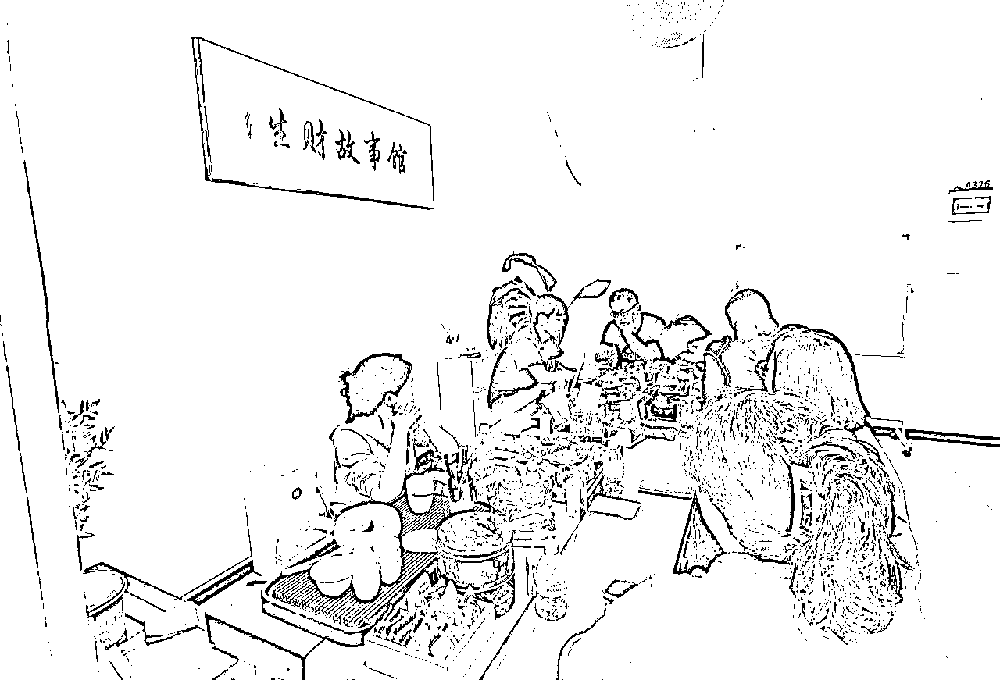

涛哥说，是音标课。

是哦！

雪梨老师的英语音标课，卖得很好，营收上千万的。

同样的，中文的，也有26个字母，汉语拼音。

从这个底层逻辑来看，读书赛道可以吗？

写作赛道又可以做吗？

肯定是可以的。

并且，这个是有着【长需求】的。

我再想想，生财圈友也有很多大佬靠读书写作出圈的啊！

粥左罗老师，Scalers等嘉宾，还有明白老师等人。

我自己似乎也是靠读书写作赚到人生中第一个10万、50万……

甚至，

我人生第一篇获得文化领域的特等奖

第一篇获得1000元青云计划奖

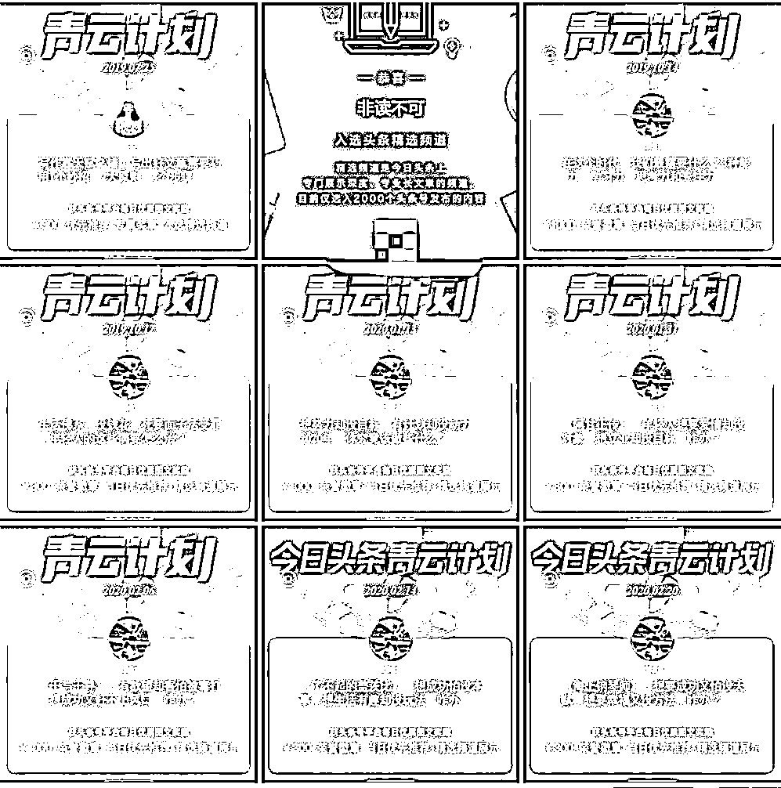

第一场收费型读书会

我还在自己的读书会中，遇见现在的投资人

……

如今，我怎么可以过河拆桥？

回过头，我还质疑读书写作这个赛道，还能不能做？

去年，我还All in做小红书中的读书写作博主赛道？

一年多时间，我涨粉4.4万，变现20多万。

所以，我在自我质疑的同时，想到我与涛哥第一次见面。

涛哥说我，不再是新手，而是“老江湖”，赶紧去写精华帖子。

好吧！我在此努力一把。

我把我所有知道的，读书写作赛道能变现的方式和具体做法，无保留地分享给在坐的各位。

希望你们有所启发。

## 一：先盘点读书博主赛道的变现方式

在这里，我先给新手特别强调一件事：

别以为你读了几本书，随手一发，就能涨粉。

有了粉丝，就能变现。

这是不可能的事情。

想通过小红书做读书博主涨粉变现，你需要根据一定的“科学”原来。

最好的方式是，你要先想清楚变现方式。

下面，我给你们盘点读书博主常规的几种变现方式。

#### 1.引流变现

我自己的4万多粉的号，就是用引流变现的方式。

因为我本身在读书写作领域摸爬滚打6年了，也写过各种拿到稿费的奖项，有分享的经验和干货可以分享。

这种变现方式【优势】在于

低粉高变现。我的账号，大概在几百粉丝时，就变现好几千了，甚至上万了。

【缺点】是引流是平台不支持的变现方式，新手容易限流和封号。

所以，我一般也不建议新手走这条铤而走险的路。

取而代之，我们可以用相对委婉的方式。

#### 2.店铺引流法

比如，董小姐在成长，这个账号。

4月新开素人号，日常就不露脸直播。

一个月涨粉1000多，店铺的1元引流干货包也买出几分。

399元的一年的共读会，也卖了48份。

日常还带货书、自拍杆等等。

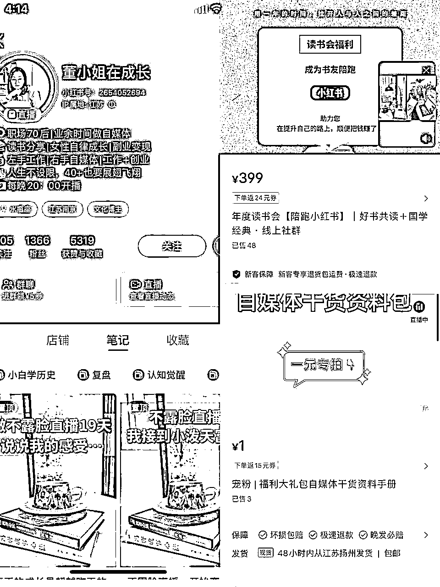

这个账号，是我随便找到的。

类似的新人，新手，快速涨粉变现的账号还有一大堆。你们去搜索一下，就可以看到。

#### 3.读书群，引流变现

这种方式，也是有手就能做。

做法如下：

*   在微信建立一个读书，群里的小伙伴分享自己喜欢的书

*   设置好温馨的聊天背景

*   截图到小红书

*   标题写：这个读书群，真的能学到很多

*   建立小红书微信群引流到微信。

*   后期，你可以在微信组织收费读书会，或者把群里的粉丝卖出去，也可以变现一笔钱。

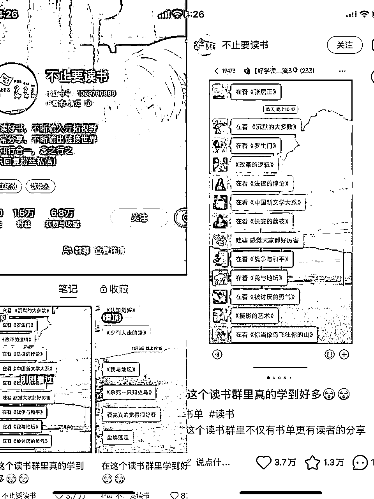

#### 4.直播带货

做法是打造家居美学。

变现方式是直播带货和店铺课程引流

这个博主的商业模式，我们也是可以学的。

变现方式多，空间大，

重点是！

操作难度也不太懂。

你稍微用心布置一下家居，修图，调暖色，加选好产品就可以。

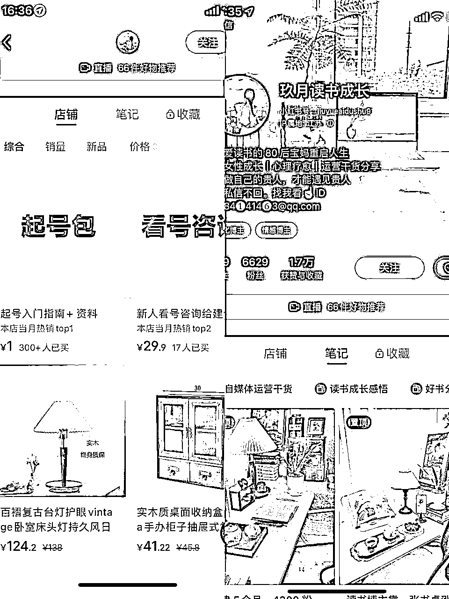

#### 5.单独接出版社广告变现

这种变现方式，有粉丝量，才更吃香。前期需要熬得住。

变现方法：直播带货，赚佣金和出版社给的推广费

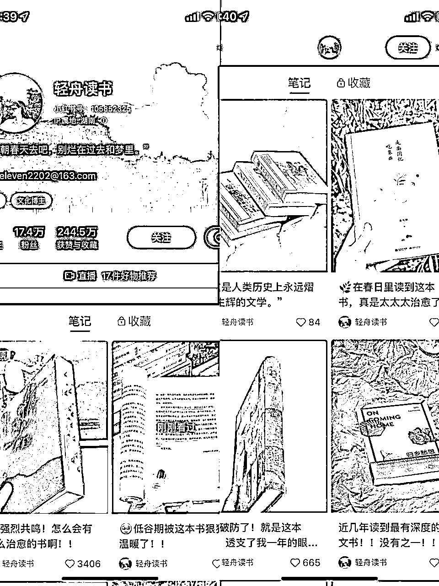

#### 6.逆向接广告，逆流做读书博主，也能出圈，一年涨粉6.8万粉

一般来说，做读书博主爆款选题都是一年靠做读书赚收入多少或者说涨粉多少。

这是小红书读书博主的爆款逻辑。

但这个博主是走在相反的方向。

他的风格是

做读书博主一年，我拒绝什么。我坚守什么

来赢得粉丝的喜欢。

所以，如果你也能特立独行，可以尝试这种做法，涨粉也可以。

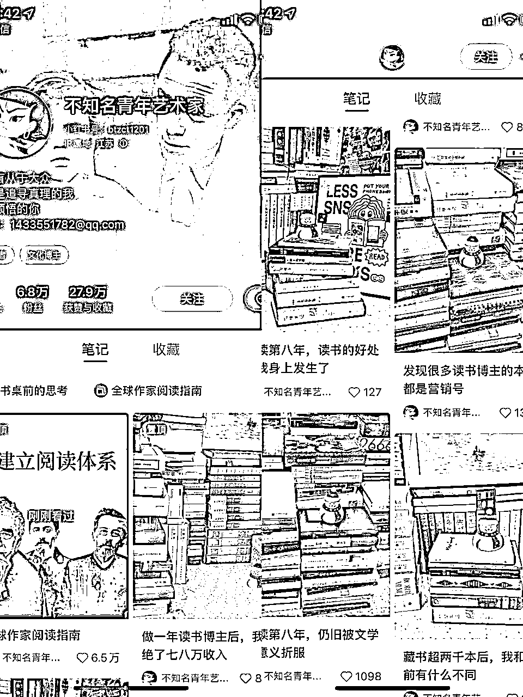

#### 7.读书+书房=接广告

这个是人设型读书博主。每条广告费几千上万的。

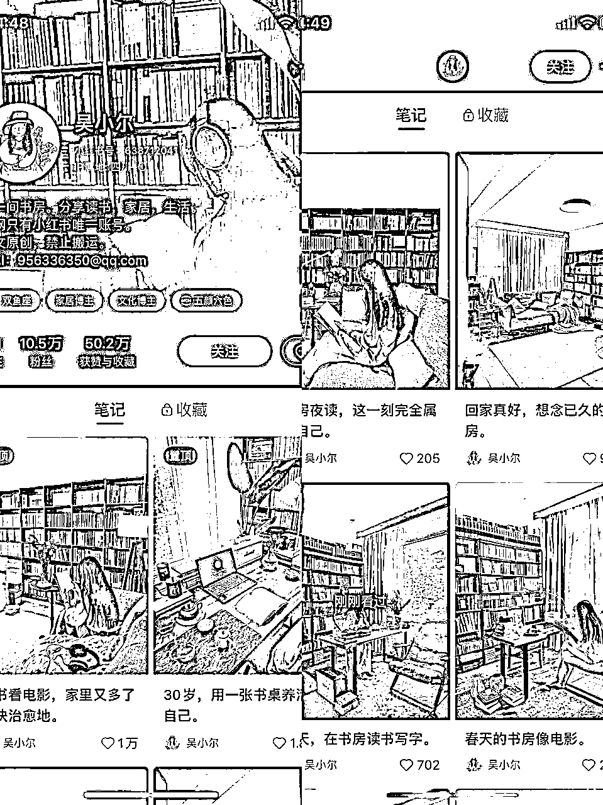

#### 8.真人出镜带货

这种形式也是很好赚钱。

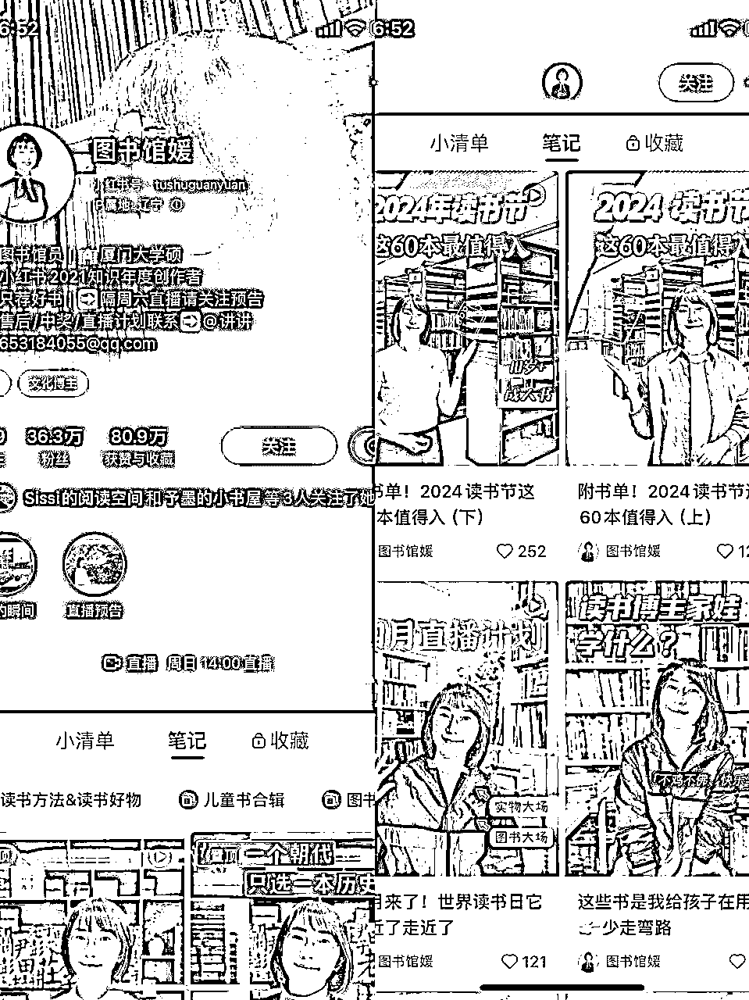

类似的读书博主变现案例，还有很多。

我无法一一盘点。

但我可以给你们总结读书博主的变现方式，逃离不出这三种。

1.内容引流，卖课程， 卖读书会，做知识付费

2.卖书（分为笔记带货和直播带货）

3.广告变现（出版社给的稿费和家居、数码产品的广告费）

读书博主的变现方式，基本就这三种。

接下来，就看你自己如何做。

1.你擅长什么

2.你手里的粉丝量有多少

### 二：新手如何从0-1搭建读书博主账号？

#### 1.账号建设

准备一个手机号，一张身份证，开始养号。

先点发现页——读书类目

你开始大量看别人写的读书笔记。

有空就刷一下，大概半小时刷一次。

反正，你当成日常没事，使用小红书，那样的刷。

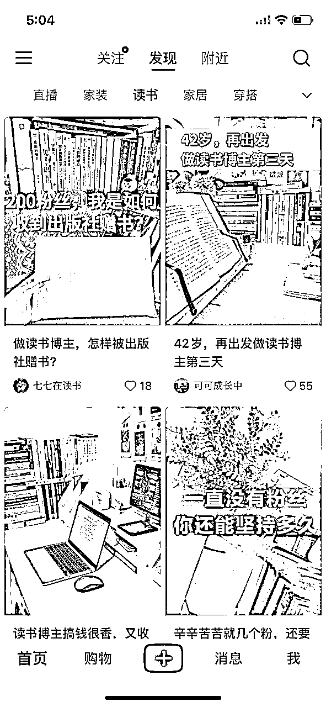

#### 2.包装账号

头像:我建议直接用真人头像，背景图也是可以

昵称：参考公式

*   昵称+读书：屋屋读书

*   昵称+个性：谈亦墨，还是我在用的【读旅世界】

*   昵称+专业：XX书房、漫读、成长

人设：

写清楚你是谁？在做什么？能给大家提供什么价值？以及你的价值主张是什么？

设置背景图和发布瞬间，并想清楚封面风格是什么。

### 三：如何做封面图？

没有人会通过你的邋遢外表，认识你的有趣灵魂。

这也是我们要把封面图拍得好看的原因。

就算你的内容写得再好。

封面做不好，点击率有限，也是功亏一溃。

如何做好封面图？

下面，我把我多个账号的做图经验无保留的分享给你们。

#### 1.看优势

我的擅长点在于写作。

所以，我把所有时间都放在写笔记内容。即我在图片花的时间，非常少。

#### 2.找差异

你至少要看同类博主10-50个账号。

然后，同类博主用黑色。你就白色调。

大家都在用简约风。你就用复杂风。

为什么我的封面会用复古风？

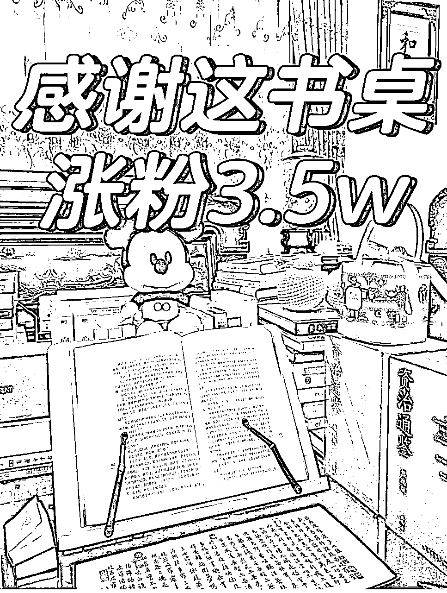

因为我去年，发现同类博主都是用奶油风。我就换个思路。

至于，我们为什么要这样做？

底层原理，我可以告诉你们。

因为小红书是两列展示在发现页。

唯有你的封面图【异军突起】。读者才会点击。

这个就是流量密码。

如果你不懂得这个原因，学再多摄影技巧都没有用

#### 3.核心拍照技巧

1）书桌拍设

【技巧】参考其他博主的摆法

适当搭配蜡烛、文具、台灯、花等等。

一次摆不好，就多次布置

2）图片布局

小红书的布置是3:4

拍摄可以斜拍，也可以用人像模式

主页，上空尽量保持1/3构图

更有空间感

也方便在封面图写标题

3）修图

滤镜：我常用的是鲜暖色。

曝光100

对比度-50

色温30

总之

你根据当下拍摄光线做调整就可以。

4）怎么拍书籍

书单对齐斜拍

俯拍书籍封面

手拿书侧面拍

拍书的内容

5）真心话

无论是在拍摄上还是做读书博主的写作过程，最重要的一步是多拍，多写。

不会拍，就先看别人如何拍。

再看不出，就找个老师，花点小钱，学一下，问一下，进步会更快。

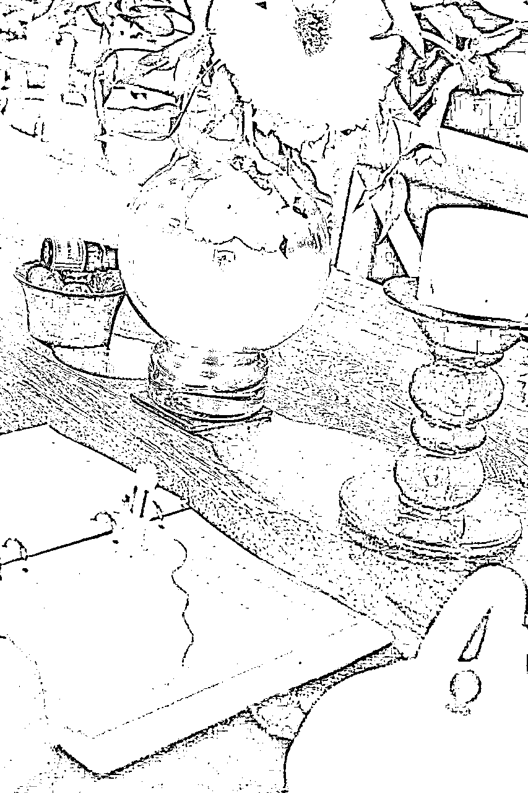

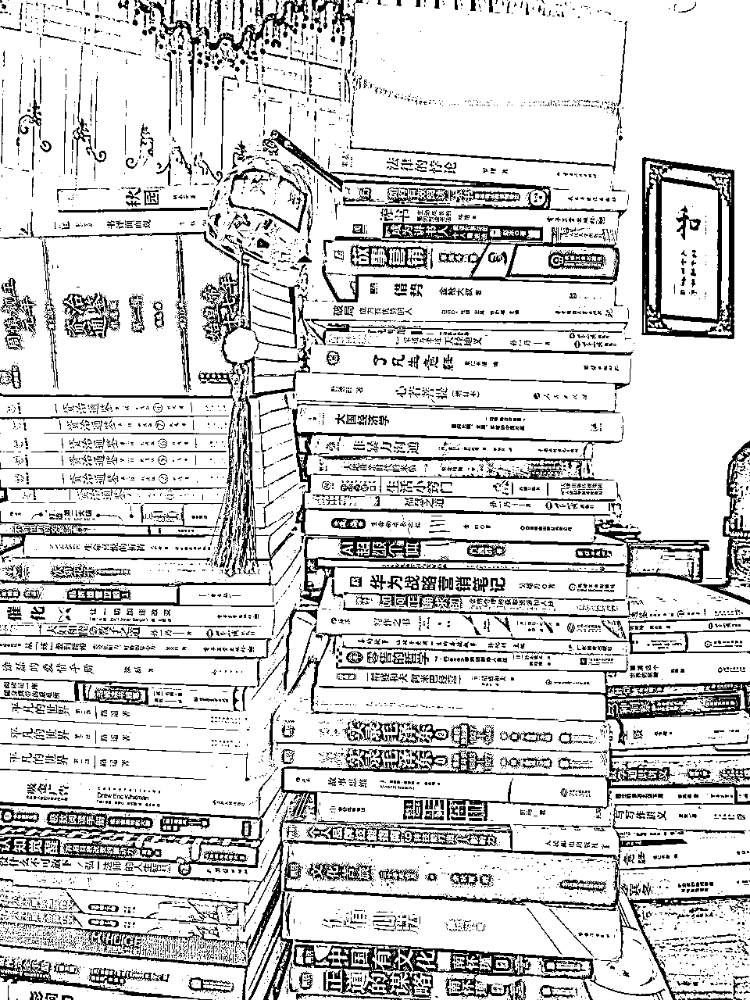

这些都是我们拍出来，验证过，相对有网感，用户喜欢的图片。

### 四：如何布置一张书桌？

做读书博主，你也许暂时无法给自己一个大书房。

但你至少要给自己布置书桌。前期，你不需要大费周章，花很多钱，去布置。

但你要因地制宜。

#### 1.物品

我是一位省钱的抠门汉。

我没花几百元去买一张书桌。

而是我从家里逛了一圈，发现客厅有一张闲置3年多的桌子。这张桌子还蛮贵的。

据说一整套下来，花了近5w。

我爸说，这是红木，可用一辈子……

我因地制宜，随便 摆放几本书和一台电脑。

刚开始，我怎么拍，怎么不好看。

你们可以去翻看我之前的笔记，早期还有这种桌子的丑照。我尝试了四个角度后，发现当前这个角度拍照蕞好看。于是，我就把拍照角度固定下来。

接下来，我修图。

#### 2.修图

基于我是特别懒的人。

我没用任何修图工具。

所以，我直接用苹果手机的原相机修图功能：

用鲜暖色——调对比度——饱和度——光线就够定了。

拍图+修图=我用不到5分钟。

#### 3.书桌工具

我也没有刻意花钱去买。

唯有一件用品，我认真选择，那就木质【阅读架】。

然后是主体部分【书】

我也没有刻意花钱去买，大部分书是出版社编辑给我免费寄送的。我前面的笔记分享过了，

2018年，我开始学写书评，做读书博主。

我不仅实现纸质书自由，而且还有稿费。

接着，就是一些小摆件。我也没买。

🍊手工钩织橘子，是老妈钩的。

🧸米奇娃娃，是家里的。

🎄圣诞树礼盒，是我准备给家里3个侄女。

以上就是我的书桌～简单、独特又有氛围感。

### 五：如何找选题

#### 1.人工搜索法

在列出自己平时的关注点

例如，我会关注读书、写作、成长、自媒体、赚钱、创业等。

接着，你可以尝试搜索对应【关键词】。以读书为例，

你在搜入框输入【读书】，就会出现。

在二级目录中，你会看到相关话题。如读书笔记怎么写等话题。

你都可以写。

接着，你可以根据最新话题，选出自己能写的选题。

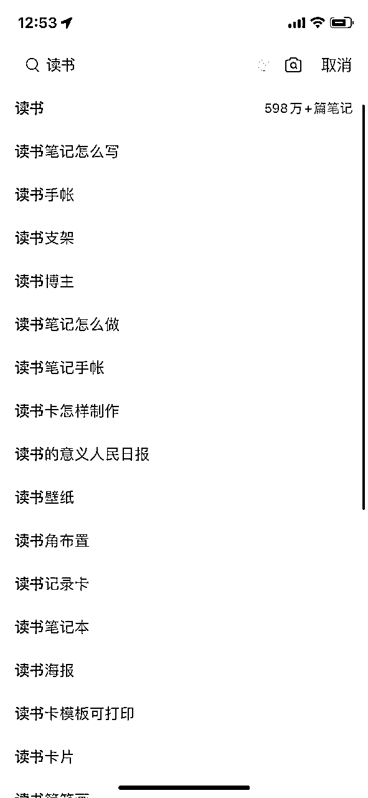

第二步：输入关键词

看搜索栏：找到更多相关的关键词

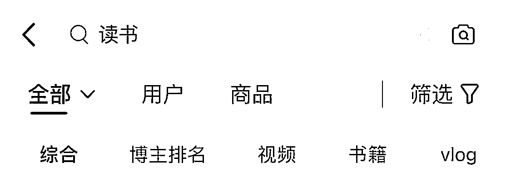

猜你搜索：展示你搜索出来的关联词

搜索发现：你可以蹭平台热点

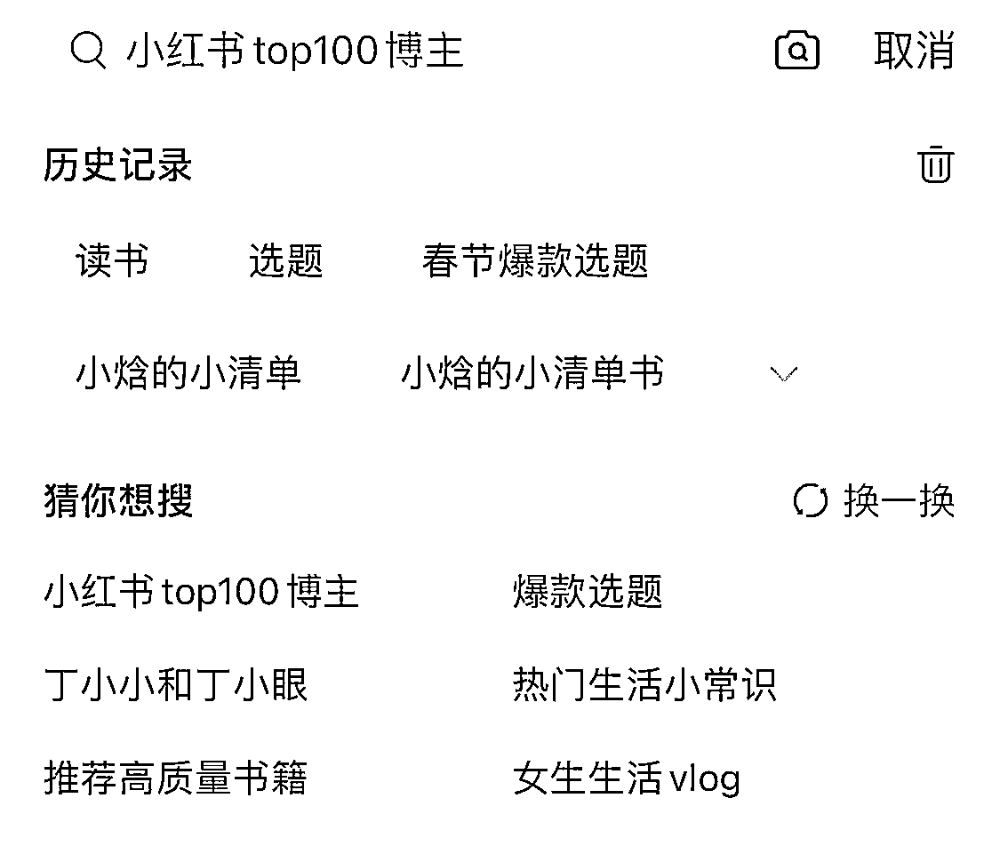

#### 2.找对标账号，看别人在写什么

做法如下：

1.找到2W内、3-5W丝、5-10W粉丝，甚至10万粉丝大博主。

2.刷对标的标准的主页，留意他们在写什么系列内容和爆款笔记是什么？

按照这个方法，你是能找到近百个爆款选题的。

在这里，我想送给你们两句话。

爆款选题是可以重复的。

因此，你最重要要找到【低粉爆款笔记】。

即粉丝量不多，但账号中突然出现几万点赞的爆款笔记。

这个选题，你就可以去写一次。

模仿低粉爆款笔记的选题，比你自己瞎写笔记，出爆款的概率高得多。

举个例子，这个账号200多粉丝，但这篇笔记2万多点赞。

我们看到这样的笔记后就是可以分析。

1.为什么这个选题爆？

2.为什么这篇笔记爆了，但无法涨粉？

3.如果我们重新写这个选题该如何优化？

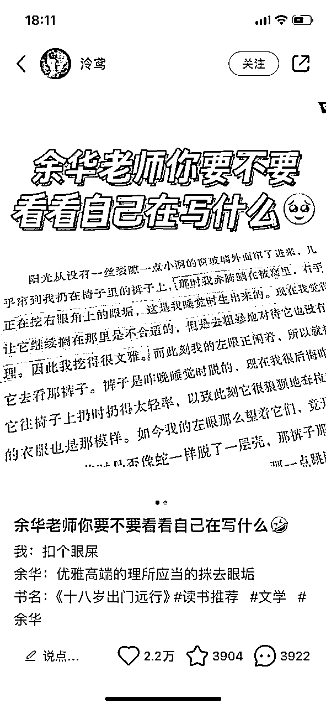

如果是我，在此写这个选题，我会这样做？

1.挂上余华老师新手《十八岁出门远行》的新手链接，赚佣金

2.用小号在评论区引导关注。

#### 3.用我整理好的爆款选题参考资料（持续更新）

1⃣️【小红书历史、传记爆款文章调研】

飞书链接： 密码：k1/3d974

2⃣️【小红书读书博主前500名】

屋屋解说：可学习，可看整个读书赛道的发展情况

飞书链接： 密码：h-8~9~+5

#### 4.最直接的方法：用我验证过，筛选过的100个爆款选题。

### 六：如何写爆款读书笔记？

### 1.常用的5个读书笔记模版

模板1⃣️心理、经管和社科类

1.描述工作或者生活中遇见的问题或者现象

2.这本书给出什么具体方法

3.作者的背景是什么？

4.你的实践心得是什么

5.从点到面，你对整本书的评价和看法分别又是什么。

模板2⃣️技能、工具和干货类书评

1.开头：你经常遇见什么问题，会怎么处理？结果如何？

2.在什么情况下，你遇见这本书？作者是谁？书中核心思想是…提炼出打动你的1-3个点

3.看完书，你的收获是

4.你的评价和为什么分享？

模板3⃣️文学、小说、散文类书评

1.这本书给人们带来什么新的人生体验。

2.作者是谁？在什么背景下，写了这本书。

3.书中的故事、人物、情节分别是什么？

4.哪些金句，打动到你？

5.读完这本书，你联想到什么？有什么感悟。

新手如果看完这三个模板，还是不知道如何写，那就直接套用这个模板

模板4⃣️出版社编辑青睐的常规书评写法

（套用模版，也是万能模版）

破题—引题—作者介绍—书籍封面—逻辑主线—亮点解读—立意升华

破题：常见的写法有痛点场景描述法、故事法、生活案例、金句、提问法等。

引题：同一句话概括全书内容

作者介绍：谁写了这本书？有什么背景？

逻辑主线：这是一个难点。很人容易写不好。

❗️分享两个我常用写作框架。

✅框架A：what why how

1.现象：分析现象是什么?

2.问题：为什么会发生这样的事情?

3方法：如何解决？

✅框架B：SCQA结构

参照：《金字塔原理》

S: situation场景、事实是什么

C: complication实际情况与我们预期的有什么冲突

Q: question怎么办

A: answer(回答)方案是什么

思路：困境—冲突—后果—方法

有了写作框架后，你就可以提炼三个亮点了。

🔚然后写立意升华。

这是一本什么书？

为什么你要推这本书？

看完这本书，能给读者带来什么好处。

这是一个通用模板。新手前期不知道如何写书评，直接套用就好。

无论你想写任何书评，都可以套用以上模版。

模版5️⃣常用的读书笔记公式

1.作者书迷类 =如果你是 xxx

这本书如何能够拉近你和他的距离 / 这本书很特别很稀有，你看这本书能够成为蕞了解他的人

2.场景类 = 对读者所在的 空间场景 做出描述 + 针对这个场景进行 荐书 + 荐书理由

3.解决类 = 对读者的困境做一个描述 +

这本书什么分析问题 + 本书的亮点 / 读完这本书读者会收获什么

4.全书知识点、案例展示

我一般用故事叙述法

人物类：写时间、地点、经历、事件和启发

故事类：常用的框架

*   起承转合

*   问题—行动—转折

*   结果—原因—问题

*   目标—障碍—行动—结果—意外—转折—结局

### 2.如果你是新号，以下这些模版，容易出爆款。新手都可以再写一次。

爆款笔记类型1️⃣

整理你喜欢的6位读书博主

写出你从这些博主身上，学到什么

【案例展示】

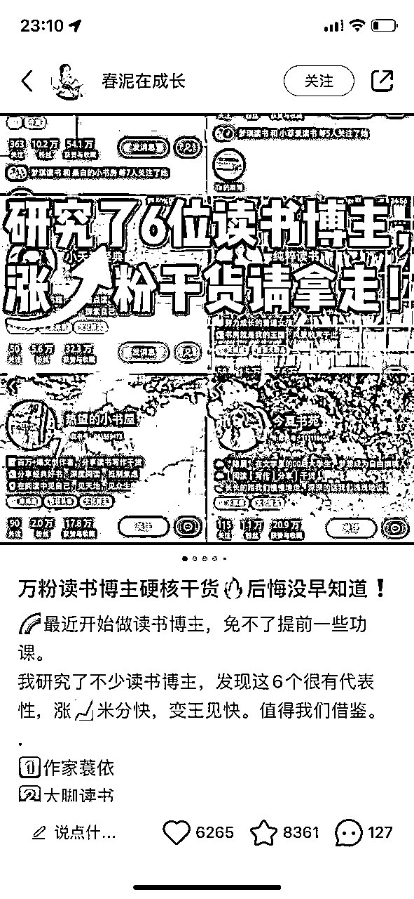

爆款笔记类型2️⃣

提炼金句，写作难度低，有还有利于自己积累素材

具体写法

🔥如果把《XX》浓缩成10句话

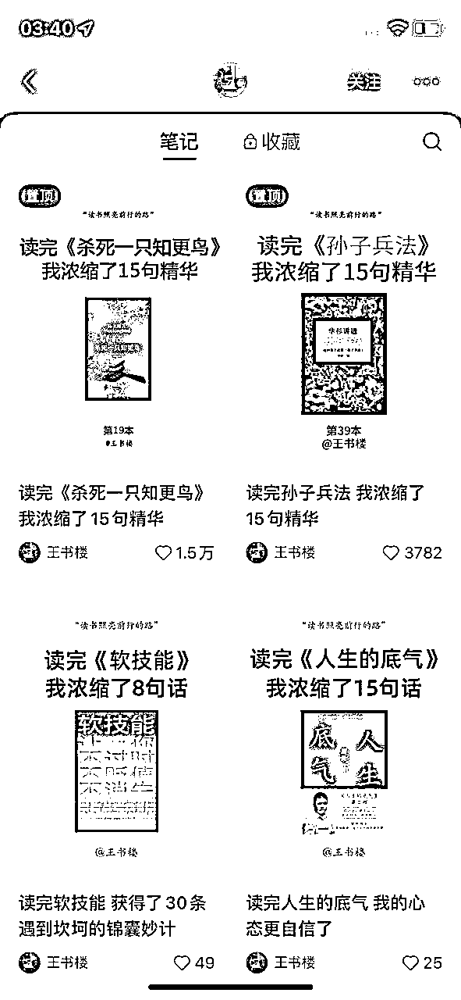

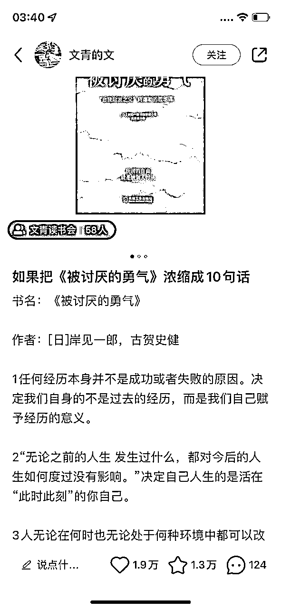

爆款笔记类型3️⃣盘点XX年，你读了多少本书

100本书也可以，20本书也可以

把书堆起来，拍照

分享书单和自己的心得

按照这套去学+记得埋爆款基因=谁写谁能爆。例如

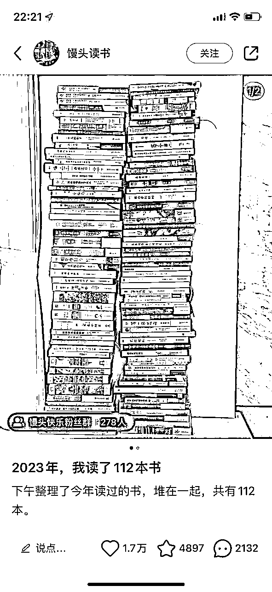

爆款笔记类型4️⃣读书笔记+PPT引流

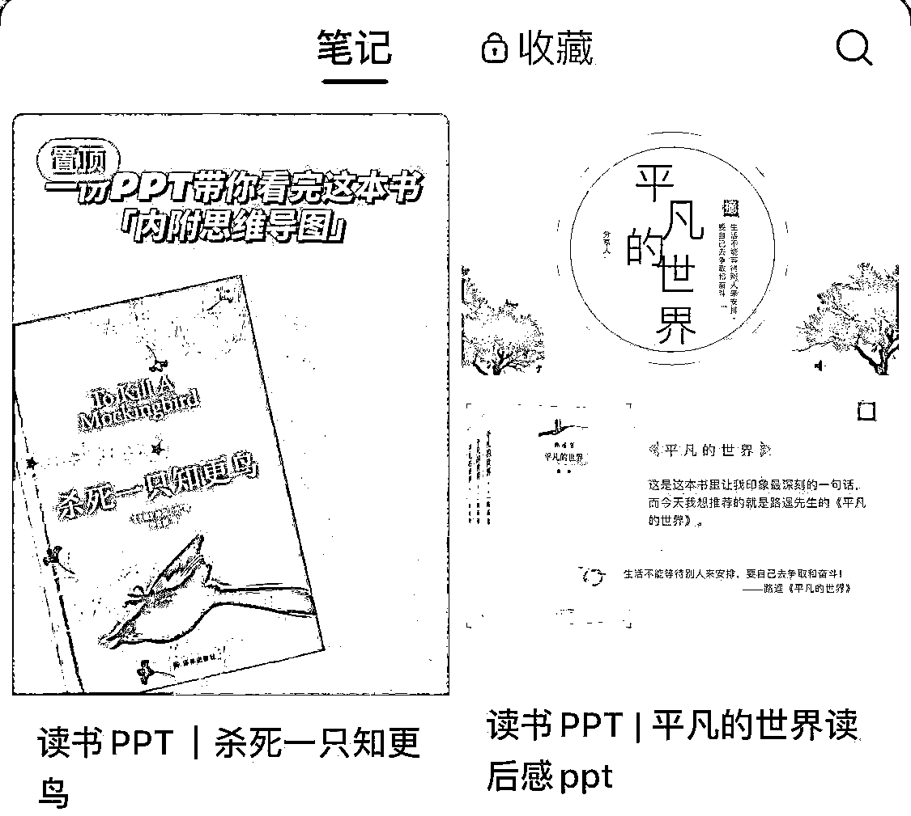

这个是我读书写作营的学员做出来的。每月也可以变现大几千。

爆款笔记类型5️⃣一个账号，专门写一本书。

这个出版社编辑很喜欢，之前有编辑花钱找我做类似的账号。

具体做法很简单，只要你有时间，就可以做。

1.仔细读一本书

2.拆解，分享笔记就可以

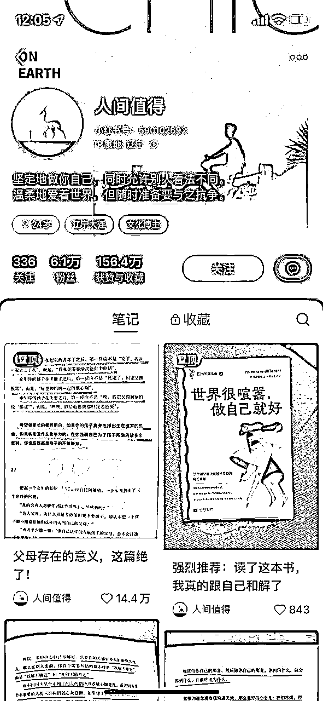

### 七：如何写好标题

### 1.我经常用的60个爆款关键词谁用谁火

1.救命!

2.一整个高级住了

3.终于下手了

4.一整个爱住了!

5.绝绝子

6.家人们!

7.yyds

8.后悔了!

9.我要向全世界安利

10.任何人不知道我都会很伤心!

11.太哇塞了吧!

12.拒绝不了!

13.xxx役骗我

14.快冲啊!

15.我不允许你不知道

16.啊啊啊啊啊

17.我敢说..

18.快问爆了的/n遍的

19.答应我

20.保姆级

21.我宣布

22.中国人不少中国人

23.吹爆

24.真香

25.我先冲啦

26.挖到宝了!

27.我赌你一定..

28.天啊撸!

29.大数据把我推给

30.震惊了!惊到了!

31.我妈说/问.

32.站出来!

33.太绝了!

34.私藏

35.不会吧!还有人不知道，

36.又被夸了!

37.简直了!

38.还是没忍住

39.吐血整理

40.真是服了!

41.别拉我!

42.我久可以了!

43.我久快乐了!

44.我沦陷了

45.谁能拒绝!

46.求求了

47.回购一辈子!

48.笑不活了.

49.太可了吧!

50.有手就会

51.沉浸式.

52.封神

53.必...

54.被赞爆了

55.what !?

56.宝藏

57.emz

58.xxx真有你的

59.新手小白

60.太爽了

### 2.标题的爆款元素

1.获得感

吓人、治愈、力量;决定做自己;可读性强

读到这觉得好吓人读书竟会是富人阶级的特权

读完这本书，我决定做自己了

没想到有这么大的力量胸口堵住的感觉没了

这部作品好像在催泪，又好像在治愈你。

感觉一翻页，血都渗出来了

2.热门话题

封神;日本核污水;

女性意识觉醒

明星姬发。。

我哭的好崩溃。。

后知后觉，女性头发是这样被男性凝视的.

赵和冯复婚:亲密关系不断成长和解决问题

3.指向群体

每个女孩子;历史佳作;INTP;医学生

医学生专属:

狂刷不腻的几本书!!!

真的，建议每个女孩子把福柯的书读烂

4.夸张表达

往烂了读，救命，文笔绝了

救命！这本书真的太有力量了!

今年看过的好书，我劝你往烂了读!

文笔绝了!为什么我到现在才读到这本书啊!

5.反差

我花3块钱买了一本只有25页的“书"

短短74页，怎么会每次翻开都想哭啊!

6.好奇

是谁把绝经写这么美啊?

哦原来是诺奖女作家

作者真敢写啊，关于小姐的田野调查

这本书越少人知道越好

### 八：变现的注意事项

想做好读书博主，我给你们的建议是

1.认真看这份本文的内容，能帮助你们少走很多弯路，甚至快速起号。

2.认真看这份社区公约

https://www.xiaohongshu.com/crown/community/agreement?fullscreen=true&isUnicomKing=false&themeType=default&xhsshare=CopyLink&appuid=631b64b5000000002303ba32&apptime=1700849291

3.发布文章时，用这个小程序检测，有没有违规词。http://ci.lingke.pro/

4.多看我的避坑案例分享。

比如，我这篇标题过于夸张，被判违规

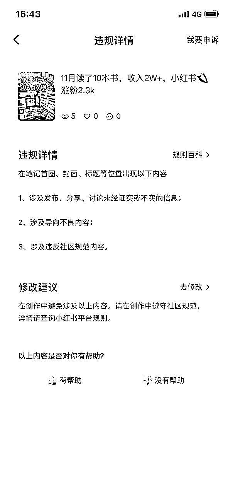

5.我看了上千个读书博主涨粉，发现80%的账号，存在共同问题是

*   把小红书当成朋友圈发。

*   只纯粹地分享读书笔记，没有个人想法

*   拍摄图片，杂乱无章

*   看的书，也不成体系

总之，这样的账号，看起来就没有关注欲望。顶多就如菜市场的小摊主，缺少点引人入目的东西。

但在互联网中，大家的注意力是有限的。

一旦你的内容，不能吸引我，又不能给我带来价值，我可能不会再“人群中多看你一眼”。

具体怎么做？

### 7.在内容上做功夫

别人只是单纯分享书，我们可以在这四个系列中输出内容。

我总结了4条爆款选题公式给诸位：

*   单本书分享：《读完XX书，我浓缩了15句精华》

*   书单类：《不愧央视推J：2023年必须书单》《想搞钱的女生，请S磕这6本书》

*   高光时刻：《哇塞，50粉丝，我竟然收到出版社送来的书》

*   经验复盘类：做读书博主一年，涨粉多少，变现多少

你们按着这四个方向去更新内容，就对了。

这四个方向，更有利于你变现。

⚠️记得千万不用只发读书笔记啊！

没有人喜欢一个冰冷，没人情味的小红书账号。

### 8.在人设中下功夫

读书博主的重点不在于【读书】，而是在于【博主】。

博主是一种身份。既然这是一种身份，那就意味着博主是一份工作。

工作的背后是意味着要养活自己和家人。

*   即做读书博主，你要有商业思维和懂人性。给别人想要的东西，你才会收获你想要的涨粉和变现。

*   即你要遵从平台的规则，也要知道读者想要什么。

*   即读书博主的正确起号方式，不是单单分享书，而是要【展示自己】。

为什么？这背后的底层逻辑是

粉丝会因为喜欢你这个人，而爱屋及乌，喜欢你分享的书。

但粉丝不会因为喜欢某本书，而喜欢你。

例如，董宇辉讲《额尔古纳河右岸》，卖了100多万册。

这是因为去年，我们喜欢董宇辉讲书。

被他的描述所感到，我们下单了。

反之，在没董宇辉讲书前，我们不会因为《额尔古纳河右岸》而喜欢董宇辉。

#### 那具体如何展现自己？

第一：从环境入手。

以环境衬托你。

你可以给自己准备好看的书桌和书房。

具体怎么做？我在前面的案例，已经给你们展示了。

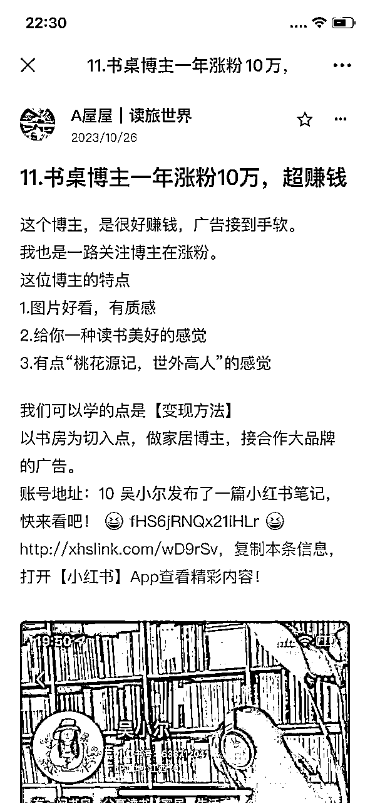

有小伙伴可能会问我；

难道没有好看的书桌和书房，无法靠读书博主赚到钱吗？

答应是的。

毕竟，这就是流量密码。

当你书桌混乱，也没好看的家，别人却拥有，并且展示美好。

人家就能有流量，就能博取商家的眼球，自然有各种品牌合作。

你眼红不了。因为人家也很用心，用心打造书角，用心拍照，认真写完文。

而你却懒得。

这就人性和赚💰的底层密码。

做别人不能做的，吃别人无法吃的苦，你才能赚到钱。

第二：写自己成长经历

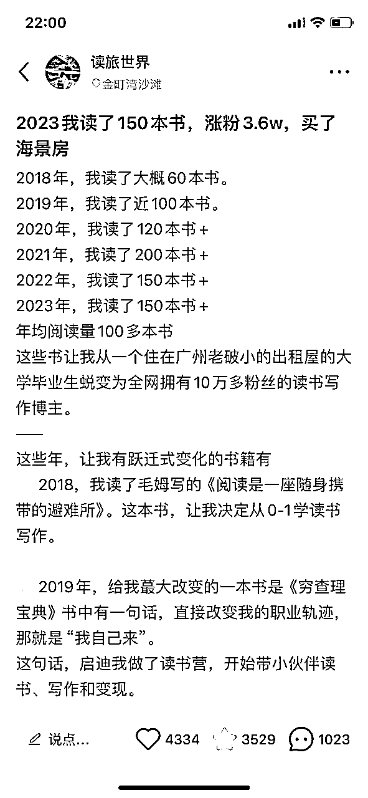

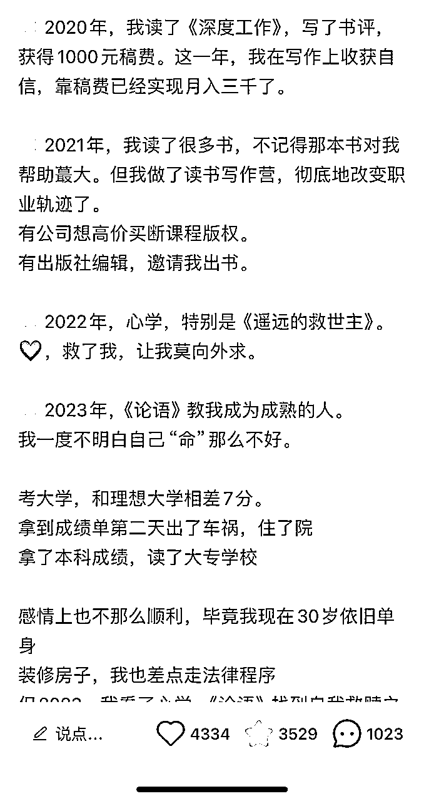

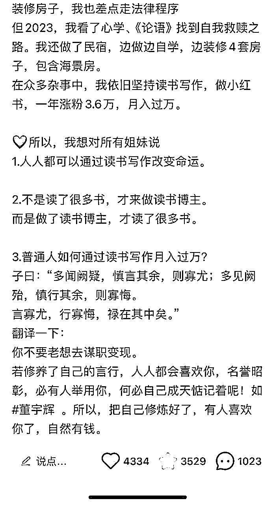

我的这篇人设笔记，复盘自己的读书写作历程，小眼睛13万，涨粉5000+。

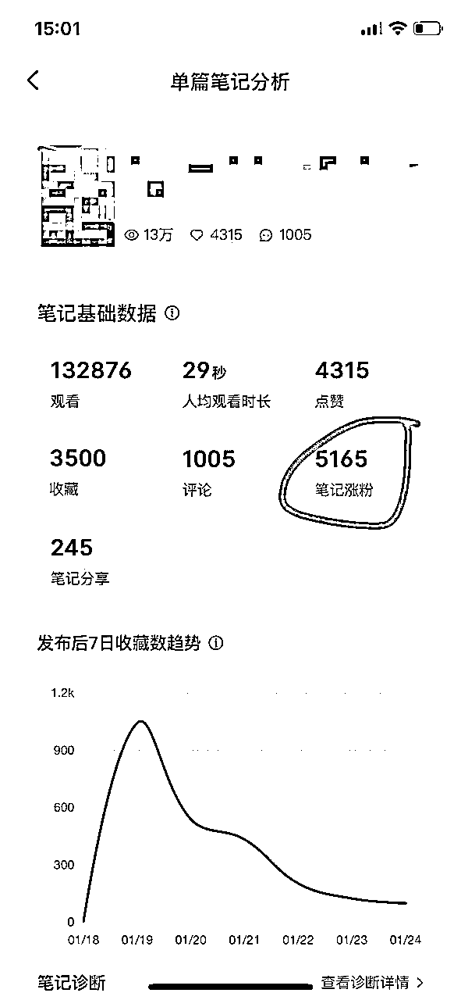

悄悄地告诉你们一个写内容的流量秘密。

写人设类的内容，容易涨粉和变现。

为什么呢？

因为读者想要的关注你这个人，与你共同成长，而不是看你干巴巴的读书笔记。

好啦！

以上就是我今天要分享的内容。

希望你看完本文，对关于如何做小红书读书博主有完全的思路。

㊗️愿你通过本文学习，能从0-1学一个能变现的读书博主账号。