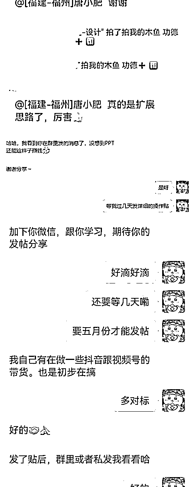
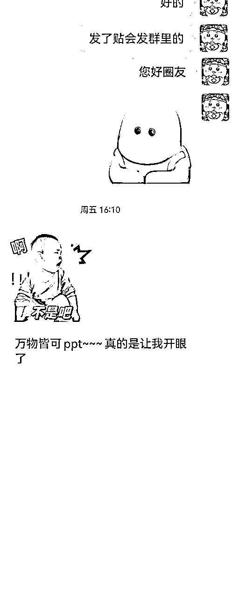
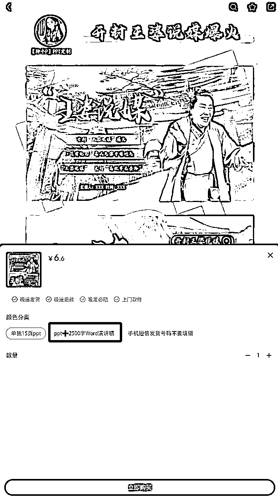
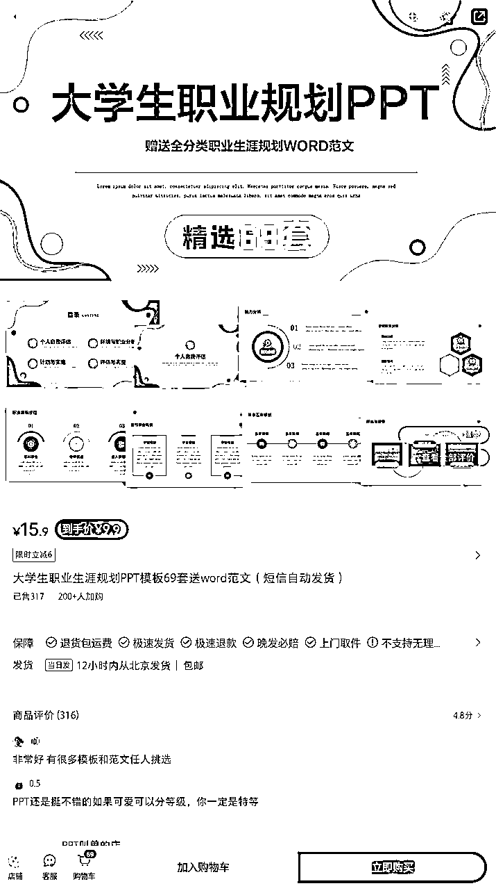

# 《持续千年的蓝海品1，超低成本副业，万物皆可ppt》

> 来源：[https://pafbirwkuk2.feishu.cn/docx/AHEOdzrDsof1S5xnkamc6oiandf](https://pafbirwkuk2.feishu.cn/docx/AHEOdzrDsof1S5xnkamc6oiandf)

# 本文红字皆为原理与实操的重点。

# 项目不难，可以说是这世界上最简单、最蓝海的项目！！！

# 项目缘由

由于自己也是新人但是之前借朋友的号看了生财小半年所以对生财还是有点了解的。所以在新人群分享了自己中标的喜悦并引发项目的探讨

1

2

3

4

5

6

7

8.帮助群友拓展思路得到认可

9

10

# 五一期间亲自带圈友实操

指导PPT商品细节

帮助圈友寻找热点

# 项目：时事热点PPT

## 地球不毁灭，时事热点永存

项目由来是自己本身就是做拼多多虚拟的每天都要选品，当时发现小红书上时事热点ppt卖的很好，一个靠热点最简单的变现方式，时事热点群体大学生，几乎每个月都会有新的热点出现。当时就直接搬运到拼多多上，那时候单店一天纯利润100+。后面同一天晚上三四个原创找上门来抓着我骂，然后就不敢搬运了，最后直接买他们的ppt闲鱼上找人进行去重二创一份就是自己的ppt了。

## 收益

现在ppt是在淘宝、拼多多、小红书上做。抖音、快手引流（引流方式也很简单，有人评论区求就回复去某宝或者某红书搜xx PPT店下单即可，根本不用怕限流），实操半年一共做了29篇PPT每月稳定收入六七千妥妥的如果想要靠ppt月入过万那么就要在微博、知乎、贴吧这些平台也发一发。

小红书

拼多多

## 成本（时间or金钱）/操作细节

我只能说项目几乎零成本

1.每周一篇PPT（最少每周一篇），目前一共做了29篇PPT，多平台发布，月收益稳定5-6千（寒暑假为淡季）。

2.找闲鱼上的人代做17-20页30-40元，20-30页40-70元

售卖价格：17-20页客单价5-10元，20-30页客单价10-20元

买一份别人做好的PPT然后找闲鱼专门做PPT的人成本一共就40-100等，根据买的PPT进行二创、去重（即换模版改排版）

3.笔记制作很容易就把做好的PPT放上去即可（这里有个细节不要只做图文笔记。要做成图片一键成片可以配乐的那种。比如《蜜雪冰城市场营销PPT》我会用图片做成一键成片加上蜜雪冰城经典的配乐BGM这样客户在观感和听感上都有很好的体验。这很细节要注意）

以下是操作细节视频演示

4.流量来源

自己做了小半年了经过测试，笔记有没流量根本不重要，客户基本都是商品搜索流量下单（所以PPT的数量越多收益越高）。这是一个长期项目只要地球不毁灭，就能一直做的蓝海项目。

5.项目优缺点

优点：·简单轻松，一直蓝海

·无需引流自动发货（阿奇所软件）

·不容易侵权

缺点：虚拟商品可复制性强，时刻关注自己做的PPT有没人倒卖，一经发现抓着他骂，带着你的粉丝骂他（粉丝的力量是很恐怖的）

## 爆款蓝海PPT类型

### 1.时事热点PPT，客户群体大学生（这里有个细节时事热点一定要带稿子）

一定要带稿子

### 2.时事热点马原PPT，客户群体大学生（这里有个细节时事热点马原PPT一定要带稿子）

马原PPT的笔记评论区很有意思的。都是哪个学校买了让哪个学校回避一下。评论区多互动也很重要

### 3.大学生职业规划PPT，客户群体大学生

### 4.品牌营销策划PPT，客户群体大学生及相关从业者

瑞幸

蜜雪冰城

星巴克

### 5.IP类的PPT（IP在小红书上的流量是非常庞大的，就是个无底洞，主打一个可爱）

线条小狗

卡皮巴拉

LOOPY

### 6.影视PPT，客户群体未知（不管客户群体是谁反正好卖就对了）

像前段时间很火的《周处除三害》请大家跟我一起戴上小猪手表，一起感谢尊者！！！

### 7.美术PPT，客户群体教师

### 8.教师课件PPT,语数英什么科目都可以（教师PPT课件不仅可以自己用，还能顺便打造个人IP）

# 项目流程提炼-思维导图

# 小红书虚拟开店流程

移步👉

# 小肥的星球《唐小肥虚拟掘金社》👇

「唐小肥虚拟掘金社」，非常高兴能与大家在这里相遇。

很多人都想做副业提升自己的睡后收入，但是看到生财有术、淘金之路亦或是别的平台里的文章，个个月入几万几十万的项目却很难下场实操一头雾水，甚至这些文章看多了反而让自己更加焦虑。

本群的初衷是以我的经验教你们如何用最低的成本、最简单的方式跑通副业并赚到第一块钱，而不是工资的第一块钱，提升自己的自信心。

本群核心：

【1】持续千年的虚拟蓝海赛道（拼多多、淘宝、小红书）

【2】蓝海虚拟项目拆解

【3】蓝海品库（海量虚拟蓝海品任你挑选）

【4】违规词库（海量侵权打假的违规虚拟商品案例。你放手做，我来踩坑）

# 总结

### 1.还有很多类型的爆款PPT模板需要自行挖掘，各行各业、各个群体都会需要PPT所以说万物皆可PPT。

### 2.这是一份非常保姆级的操作教程，对于没有副业刚进生财的新人来说是很友好的，不需要付出多少时间和金钱只要耐下心来拉长线坚持做就能看到回报的一个项目，不要想着一两篇PPT就能月入一两千，答案已经告诉你了就看你做不做了

### 3.希望可以上精华帖，谢谢大家我是唐小肥

