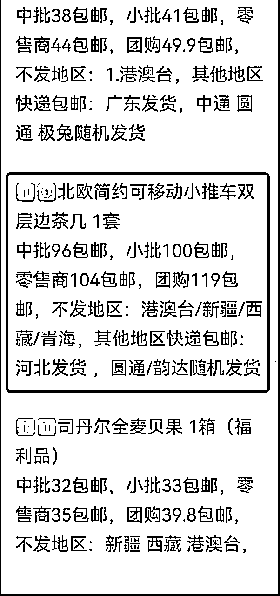
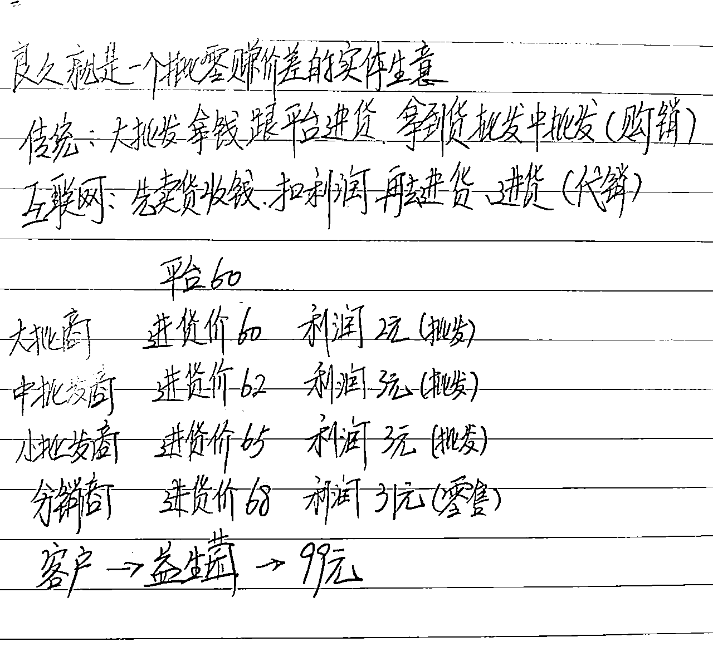

# 私域社群连锁价值，如何实现年入百万千万的底层逻辑

> 来源：[https://lglltelpuj.feishu.cn/docx/AWp9dNUivoHcb3xXImlcqtpInMe](https://lglltelpuj.feishu.cn/docx/AWp9dNUivoHcb3xXImlcqtpInMe)

# 一、自我介绍

我是干货哥，15年互联网行业经验，

2015年与13位知名站长一起出了一本书《做最成功的互联网创业者》写的是分享经济(半私域)的玩法。

然后在2016年加入某知名互联网公司做了8年市场营销的工作，于今年3月份出来自己干项目，

也是从互联网云计算的赛道直接转到了私域这个赛道，目前这个赛道是很火的。

在不需要任何投资，不伤人脉，竟然有一大批的普通人实现了年入千万、百万的收入，

我详细了解考察后，发现这是一个巨大的商机，对你我来说是一个非常难得的机会。

接下来听我慢慢道来~

# 二、私域的价值

## 1.理解私域的价值

我们知道私域这个词在目前市场上比较火，私域里的概念就是我们自己能够去直接触达的人脉资源，

所以不管咱们来自于什么样的行业或者什么年龄层次，包括是做什么样的生意，其实我们所有人最大的资产都是我们自己的一些人脉资源。而我们自己的人脉资源就是沉淀在我们微信里面或手机通讯录里面这些可以触达的人，

其实有很大一部分我们是没有办法或者没有机会去比较紧密的去链接，然后产生更多的粘性和交换价值的。

所以做私域这一块就是让我们可以跟人之间的链接变得更加紧密，大家一起共创一些更大的价值。

备注：公域与私域的区别是什么？

## 2.激活私域最好的工具

现在大部分做私域流量的变现有两种：

1.知识付费变现

2.生活刚需日用品

无论选择哪种，咱们做私域电商一定是来盘活我们的私域人脉的，所以我们今天如果说想要去跟人脉资源之间拿一个工具去进行交流和粘性的建立，刚需日用品是一个最佳工具，因为它的特性在于所有人不分年龄层次，不分家庭背景都需要用的，没有任何人不用柴米油盐酱醋茶，没有任何人不洗脸刷牙不穿拖鞋对吧。

所以一个人的日用的刚需我们是可以通过一个全品类的产品对接上去，因此它会是我们跟人脉之间一个非常完美对接的端口，因为我们自己本身也要用，然后用好的物美价廉商品分享给身边同样有需求的朋友，所以整个产品的路线它是设计成让我们可以对接中国社会，基本上就是千千万万个家庭的日常需求。

## 3.对私域社群的初步理解与偏见

我最初来了解这个生意的时候，有三个感觉

第1、 产品比较LOW

第2、 生意很琐碎

第3、 产品只卖几十块，是个小生意

不知道大家是不是跟我有一样的想法。

最初我并不打算做这件事，只是觉得从学习的角度，了解下别人是怎么赚钱的。

因为这家公司已经存在了6年，这6年还经历了草创期和3年疫情。

公司成立最初两、三年，质量不稳定，发货也特别慢；

在这样艰难的6年时间，却帮助了将近1000多位分销商，没有1分钱投资，拿到了超乎预期的收入回报，而这个收入是赶超了很多实体生意、传统行业。

所以我很好奇，在这样艰难的6年，是怎么做到了现在每年几十亿销售额的体量。

全面了解后，我抛出了原来的偏见，把这个事儿彻底看明白了。

# 三、私域社群连锁的商业逻辑

这里面指的每个社群每天卖五单的分店，每1单价差是3元，一个月收入是450💰

那么你只需要开200家，一年利润就是108万💰，开2000家，一年利润就是1080万💰

而这些分店是指的你人脉的人脉，人脉的人脉的人脉，延伸出来的分店

每一分收入，它的背后是来自于什么？来自于人人都有需要，没有太多的教育成本。

它的意义和价值不是在卖货，而是把私域渠道打通、把复购率做高，盘活每个人的人脉资源。

# 四、深度分析私域社群的商业价值

## 1.有关私域社群的误区

这是我自己的空中百货超市，很多时候，大家打开这个群，就立刻没兴趣了，这种群很多的，罗里吧嗦的全是广告，对吧。

那我专门想展现这个社群，就是要破掉大家的这样一个误区。

我们这个社群是干什么的？

首先，这个社群里基本上都是我自己的人脉资源，和人脉衍生出去的人脉资源，说白了，这是一个私域的流量池。

不管大家今天来自于什么行业，大部分人的一个共同痛点，那就是我们大量的人脉是没有用起来的，大量的人脉资源是浪费的，因为没有机会去链接，也没有任何的借口去链接，也不知道去链接什么。

这里有个很重要的点，当你没有看明白这个项目的时候，你会看成是卖货的生意。

你如果觉得我就是在群里面发发广告卖货，你就把这个生意就会想的比较小，定义成不是我来做的事。

但如果你今天真的搞明白，这个生意的本质，它不仅仅在卖货，而是在做一个全方位的人脉的整合和链接，做粘性、打造私域渠道，变成自己的资产。

如果你把这个本质看明白之后，你就不会嫌这个社群很low，你也不会对这个生意立刻会有一个偏见。

## 2.本质：链接人脉的载体，做人脉运营

我们卖的产品，涉及到生活的方方面面，全品类的日用刚需品，那为什么我们要选择这样的一个载体？

因为我们链接人脉是需要工具。这样的一个载体，它的宽度和深度是最厉害的。

首先，什么叫宽度？

就是我去链接人脉的时候，它对于人脉的承接力度是最强的。

你的圈子里面有各种各样不同的人，低端的中端的高端的，来自于各种各样不同的行业。

那有什么样的一个工具，能够让你迅速的、没有差别的去链接到他们，只有日用刚需品，高覆盖，高复购这样的产品，才能够去打进每一个家庭。他今天不管多高端或多低端，他是什么背景的，他必须要刷牙洗脸，吃柴米油盐酱醋茶。

所以它是不分人群的，因此，这个是我们选择产品的第一个特性。

私域的核心是不断与人高频的链接产生背后的复购关系

第二个，什么叫深度？

我们要去深度跟人发生链接，就要不断的触达别人(看上面我的某位经常找我复购的客户截图)。

你必须要有一个高复购的产品特点，你才可以跟他把这个关系重复不断的拉近。他找你买一次算什么？他不复购了，你只触达一次？你怎么样把这个私域真的做活？因此，我们全品类的刚需日用品，它的特点就是在于今天他要买牙刷，明天要买牙膏，后天要买拖鞋，不管怎样一个月找你复购几次，我总是会有借口和理由去跟他触达几次。那这个人脉我可以锁定。

这个就是我们卖刚需用品，看起来好像杂七杂八，看起来好像就是没有什么特点，看起来只是一个空中百货超市，事实上，他对于我们人脉的承接力是非常强的。

所以这个生意的本质，它是在做人脉运营，而不是单纯在卖货。产品只是一个工具，这个点非常的重要。是不是当我们把这个本质看懂之后，我才能够站在一个更高的高度去思考，这个生意他到底在做什么？

## 3.副业收入的市场需求

我们来看一个普通的社群，创造的价值是什么?

一个非常普通的人，普通的人脉，普通的能力，各方面都很普通，也没有干过这样的生意，只要他认真的来做运营，做分享，把自己觉得用了很好的产品，真实的分享给身边有同样需求的这些人脉。

一个社群能够创造出来的销售量，每月差不多200到400单，是平均值，这是可以做到的。每一单卖赚十块钱，一个普普通的社群，是不是可以一个月赚个2000到4000左右的一个差价？

当然这个差价看起来对于很多人来说都不高，我们为什么要花时间讨论这么低的收入，为什么要强调这个点，我们不是来探讨，怎么赚这个收入的，而是你要思考一个点，一个普通的家庭，他在不投资的情况下，在他现有工作生活不受影响的情况下，用的本来就是要用的产品，卖的本来就是别人有需求的产品，在这样的一个生意体系，里面不投资，每个月为家里面额外创收2000到4000。

请问，你认为？这个机会有没有市场需求？有没有足够的市场价值？

你判断这个市场，在当今的后疫情时代，有省钱的需求？是有多少家庭有增收的需求？2000到4000的额外月收入，在当今的时代是很有意义的，那么这个生意就可以干大。

比如说我能够赚到2000到4000，我身边有没有同样想跟我增收的人，同想去增收的朋友，有的，我们是不是可以从一个店开成全国线上的连锁沃尔玛超市？

下面是我带着部分小伙伴拿到的结果：

第一位：还在读研的小伙子，社会经验较少，起步就有1500-2000元/月的额外增收

第二位：主业做月嫂，兼职做这个项目，每个月也有1500-2000元/月的额外增收

第三位：一位宝妈主业是上班，兼职做这个项目，每个月也有500-2000元/月的额外增收

# 五、商业模式

## 1、传统零售、批发线上化

看下上面这张报价表，它就是线下的零售、批发生意，只不过我们把它线上化了。

理念跟传统事业是一模一样的，只不过不需要投资，就可以免费拿到，全中国可能每一年大几千上万款产品的代理权。从终端到这个高一点级别的批发商，中间的溢价空间非常的低，就那么二三十块钱，所以也解释了为什么产品 能卖的比较便宜。

下面这张图很好的诠释了模式。

## 2、生意特点

第一不用投资，每天赚现金流，并且非常稳定

有做传统生意的老板一定明白现金流的重要性，这个板块现金流非常的稳定，没有任何人给你发工资，你每天卖多少赚多少很公平，多劳多得。

第二、真正能做到薄利多销

这个价格表可以对外敞开，它的意义就是在于要显示出它是薄利多销的，中间的利润环节非常的低。

第三，我们要搞懂一个点，生意的规模大小，生意的价值，与卖的产品的客单价高低，它是没有任何关系的。

不是说客单价低的生意就干不大，是不是？

我们卖矿泉水的是不是可以卖成全中国的首富？

## 3、这个生意的核心，是能不能走的起来量

生意能否做大的本质，不是在于客单价和利润的高低，而是思考一个点，量能不能走起来？能走到多大？量走起来背后的原因是什么？这些是很重要的。

咱们来考察一个生意，不把这个走量背后的逻辑思考明白，这个生意没有什么意义。

接下来我们来看下这个私域社群的批发量能做多大？

小型批发商的体量，每个月平均在1000-3000单以上，月收入5000-8万元以上。

这个收益模型普遍在1-3个月就能实现。

如图所示，我自己的一个样板店的零售收入+分店批发的收入，总共一个月净利润7306.4元

中型批发商的体量，每个月平均在10000-50000单，月收入5万-20万以上

这个收益模型普遍在2-8个月就能实现。

如图所示，中批发一个样板店的零售收入+分店批发的收入，总共一个月净利润26万元

大型批发商的体量，每个月平均在100000单以上，月收入30万-100万以上

这个收益模型普遍在1-3年就能实现。

如图所示，大批发(这是Lucy露西后台收入截图)一个样板店的零售收入+分店批发的收入，总共一个月净利润446万多元，一年净利润在4000-5000千万。

这种模式为什么能做得起来量？

因为满足了三方面的需求。

第一、省钱的需求

第二、人际关系间提供情绪价值的需求，做私域

第三、增收的需求

想想以上三点，是不是大部分家庭都有需要的？

数据越来越大，数据背后它意味着什么？

我们很多大批发商一天可以做个几千单，

中批发商一天做个几百单，每一天是不是都稳定的？

就像我给大家看小批发商的体量，是不是每天稳定的几十单。

这个稳定代表着是不是在做复购？

我们的数据是复购率在做支撑的，并不是每个人必须要去天天去拓新，那做复购就意味着一定是因为产品的性价比足够高。

人愿意重复不断的购买，一是他有刚性需求，二是他觉得不错，他才会重复购买。

从大数据侧面反映出

一、产品一定是可以走得通的，它的总体的质量是很不错的。

二、代表着很多人在干，很多人在一起合作。

大部分的人可以一起来参与，能够存活。

如果说产品不够具备复购性。我们的团长能存活下来吗？顾客都不找你买，你有单吗？你怎么存活？我们很多团长能够去参与的原因，不仅仅是因为不投资。不仅仅是因为没有门槛，不仅仅是因为有人帮有人教，同时是因为你在做的这个事情本身，它就是符合大众的，它没有太多的教育成本，也不需要你费很多口舌，主要就是让你费点心思，去跟人把关系搞好。

每一分收入，它的背后是来自于什么？来自于人人都有需要，没有太多的教育成本。

它的意义和价值不是在卖货，而是把私域渠道打通、把复购率做高，盘活每个人的人脉资源。

# 六、写在最后

这个就是我今天给大家分享的私域社群连锁背后的商业价值，它就是把线下的传统零售批发行业搬到了线上，

我们这个生意模式就是为了来走量，只要今天中国还在出爆款，还在出产品，这个供应链还在不断的推陈出新，

然后只要消费者还有消费需求，那么我们这个事情就可以做比较长久，我们是建立一个非常稳定的人际网络和销售管道。

## 最后分享一个介绍私域电商的课程(25分钟)

也是我的好朋友Lucy露西讲的，她一直在英国留学，在2020年2月份加入，

然后在没有任何投资，在不伤人脉的情况下做到了头部，

实现年收入上千万的成果，你认真听听这是一个不错的事业机会。