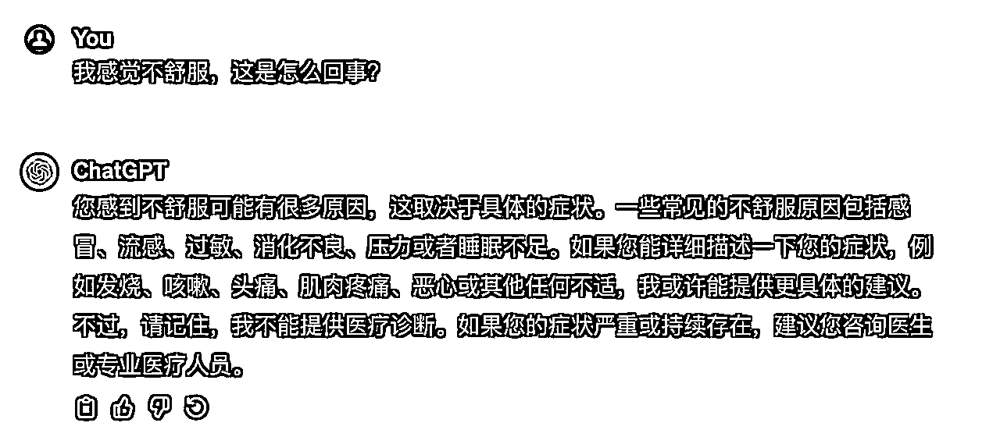
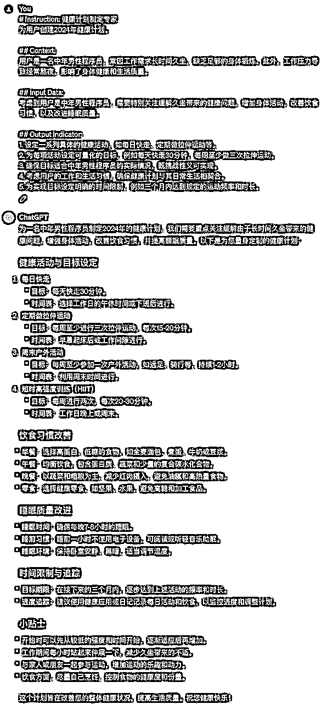

# AI 入门：AI 提示词如何入门？这篇就够了！（含提示词）

> 来源：[https://eqsdsj0h4eo.feishu.cn/docx/AcpmddI2qogOBKx57vXc6JzMnJb](https://eqsdsj0h4eo.feishu.cn/docx/AcpmddI2qogOBKx57vXc6JzMnJb)

最近很多朋友来咨询提示词如何入门，所以决定写一篇文章来说说 AI 提示词如何快速入门。

我一直有个理念，那就是“基本功”。

只有把基本功打牢才能走的更远，学习提示词是，做个人 IP 也不例外。

那么学习提示词的基本功是什么呢？

今天我们来聊一聊，如何给出清晰的提示。

# 一、Prompt 的定义

Prompt 是一种指令或信息，它引导或触发 AI 做出回应。

在与 AI 如 ChatGPT 的交互中，每当我们输入一段文字，无论是问题、命令还是陈述，这段文字就是一个 Prompt。

想象 AI 是一位知识渊博的朋友，拥有广泛的信息和技能。当你与她对话时，你提出的每个问题或评论（即“Prompt”）都是对话的一部分。

比如，你可能会问她：“你对最近的科技发展有什么看法？”或者说：“请帮我概括一下太阳能的工作原理。”

在这个情境中，每个问题或请求都是一个“Prompt”，引导你的朋友（AI）提供相关的信息、观点或执行特定的任务。

就像在与人的交谈中一样，你的“Prompt”的质量和清晰度将直接影响到对方的回应。清晰具体的问题会得到更精确和有用的答复。

如果你的问题模糊不清，你的朋友可能会需要更多的信息来提供有用的答案。

同样，当你给 AI 一个清晰、明确的“Prompt”时，它可以更有效地理解你的请求并给出更准确的回应。

关于如何给出清晰的指令，大全整理了很多资料，找到了最适合小白的 5 个技巧。

这 5 个技巧几乎是构建一个优质提示词的基石。

# 二、提示词技巧

## 一）详细询问，提供细节

### 1、原则解释

当与 ChatGPT 交流时，提供具体和详细的信息非常重要。这样做可以帮助 ChatGPT 更准确地理解你的需求和上下文，从而生成更相关和有用的回答。明确的信息可以包括具体的问题背景、相关领域的说明、你所期望的答案类型等。

### 2、如何实践

*   明确问题背景：提供足够的信息来描述你的问题背景。例如，如果你在问一个医学相关的问题，提供相关的症状或情境。

*   具体描述需求：清楚地说明你需要什么类型的信息或帮助。例如，如果你需要建议，指明是寻求专业意见还是一般性建议。

*   提供相关领域信息：如果问题涉及特定的知识领域，提供这一领域的相关信息，以便 AI 更精确地定位答案。

*   避免模糊和广泛的问题：尽量避免提出过于广泛或模糊的问题，这样的问题往往导致 AI 无法提供具体和有用的回答。

#### 1）明确问题背景

*   不佳的提问：“我感觉不舒服，这是怎么回事？”



*   改进后的提问：“我近三天出现了发热、咳嗽和疲劳的症状，没有过敏史和慢性疾病。这些症状可能是什么原因导致的？”


## 二）扮演角色

### 1、实践概述

要求 ChatGPT 采用一个特定的角色可以极大地增强交互体验和回答的相关性。当用户明确指定一个角色，如历史学家、医生、编程教师等，ChatGPT 会尝试从该角色的视角回答问题，使对话更具针对性和深度。

### 2、如何实践

1.  明确指定角色：在提问时，清楚地指出你希望 ChatGPT 扮演的角色。

1.  提供角色背景：如果可能，提供一些关于该角色的背景信息，例如专业知识领域、工作经验等。

1.  调整问题风格：根据选定的角色，调整你的提问风格，以便更好地适应这一角色的回答方式。

### 3、示例

下面我们来看看有角色和没角色的区别：

1）明确指定角色

*   提问：“请解释第一次世界大战的主要原因。”


*   提问：“作为一名专注于 20 世纪欧洲历史的历史学家，请解释第一次世界大战的主要原因。”


*   提问：“作为一名家庭医生，您如何评估和处理轻度头痛和疲劳的症状？”

*   提问：“作为一名具有 10 年临床经验的家庭医生，您如何评估和处理轻度头痛和疲劳的症状？”

*   提问：“作为一名编程教师，你能否为我推荐学习 Python 编程的资源？”

*   提问：“作为一名有 10 年经验的编程教师，你能否为初学者推荐学习 Python 编程的最佳实践和资源？”

## 三）明确输入分隔

### 1、策略概述

在与 ChatGPT 进行交互时，尤其是在处理包含多个不同部分或请求多项任务的复杂输入时，使用分隔符可以显著提高输入的清晰度和输出的质量。分隔符有助于明确界定输入中的不同部分，确保每个部分都能被准确识别和适当处理。

### 2、如何实践

1.  选择合适的分隔符：根据输入的内容和格式，选择恰当的分隔符，如三引号（```）、XML 标签、Markdown 标题等。

1.  明确标注各部分：使用分隔符前后清楚地标注各个部分的开始和结束，尤其是在文本较长或复杂时。

1.  提供说明：在使用分隔符时，如果可能的话，给出简短的说明或注释，指明每个部分的内容或目的。

### 3、普通示例

1.  多部分问题：用户希望得到两个不同主题的解答，可以使用分隔符明确区分两个问题，简单的可以直接使用冒号分割：

1.  解答下面的问题：

1.  问题 1：请解释机器学习的基本概念。

1.  问题 2：请列举健康饮食的三个基本原则。

1.  详细指令与背景信息：当用户需要提供详细的背景信息并请求具体的操作时，可以使用分隔符区分背景信息和具体请求：

##背景：

1.  公司正计划扩展其市场到亚洲，特别是日本和韩国。

##请求：

1.  基于此背景，提出一个市场进入策略的初步计划。

1.  使用 XML 标签处理多项内容：用户需要对两篇文章进行总结和比较，可以使用 Markdown 标签作为分隔符：

1.  首先总结每篇文章的论点。然后指出哪篇文章提出了更好的论点，并解释为什么。

``` 这里是第一篇文章的内容 ```

``` 这里是第二篇文章的内容 ```

## 四）提供示例

### 1、策略概述

在与 ChatGPT 的交互中，提供示例可以极大地增强清晰性和理解。当你提供一个具体的例子时，它有助于 ChatGPT 更准确地把握你的意图和上下文。这一点在解释复杂的概念、描述具体的情况或提出具体的问题时尤为重要。

通常，给出适用于所有情况的通用指导比展示各种任务示例更高效。但在某些情况下，通过提供具体示例来说明可能更直观。比如，你想让模型学习某种特定的回应方式，这种方式可能难以用语言明确描述，这就是所谓的“少样本 （Few-shot）”提示方法。

### 2、如何实践

1.  关联说明与实例：在提供说明时，紧跟一个相关的例子，这样可以帮助模型理解说明的上下文。

1.  明确示例的范围：确保你的例子足够具体，以展示你的询问或指令的具体应用。

1.  使用分隔符标明示例：如果可能，使用适当的分隔符（如引号、括号等）清晰地标识示例的开始和结束。

### 3、示例

#### 1）提示词

```
##要求：
保持一致的回答风格。

##示例：
问：问大师,什么是耐心?
答：深谷自浅泉,宏曲生寂音,繁绣始孤线。

##问题：
大师,什么是大海?
```

#### 2）使用效果


可以看出，模型严格按照我们的要求输出了内容，虽然这种回答难以用语言明确描述，这就是所谓的“少样本 （Few-shot）”提示方法。

# 三、框架

## 一）ICIO 框架

### 1、ICIO 框架结构：

指令（Instruction）

背景信息（Context）

输入数据（Input Data）

输出引导（Output Indicator）

### 2、详细含义：


### 3、示例

```
# Instruction: 健康计划制定专家
为用户创建2024年健康计划。

## Context:
用户是一名中年男性程序员，常因工作需求长时间久坐，缺乏足够的身体锻炼。此外，工作压力导致经常熬夜，影响了身体健康和生活质量。

## Input Data:
考虑到用户是中年男性程序员，需要特别关注缓解久坐带来的健康问题，增加身体活动，改善饮食习惯，以及改进睡眠质量。

## Output Indicator:
1\. 设定一系列具体的健康活动，如每日快走、定期做拉伸运动等。
2\. 为每项活动设定可量化的目标，例如每天快走30分钟，每周至少做三次拉伸运动。
3\. 确保目标适合中年男性程序员的实际情况，既挑战性又可实现。
4\. 考虑用户的工作和生活习惯，确保健康计划与其日常生活相契合。
5\. 为实现目标设定明确的时间限制，例如三个月内达到规定的运动频率和时长。
```

# 四、实操案例

## 一）案例：健康计划制定专家

初始 Prompt: "制定一份健康计划。"

这个 Prompt 相对模糊，没有提供足够的信息。接下来，我们开始逐步优化它。

1、优化步骤：

1）指令（Instruction）

思考逻辑： 我们需要明确 AI 模型需要完成的具体任务。是制定一个通用的健康计划，还是针对特定用户的个性化计划？

优化后： 为用户创建 2024 年健康计划。

Tips：这里选择“为用户创建 2024 年健康计划”作为指令，确保 AI 理解任务的个性化和长期目标

2）背景信息（Context）

思考逻辑： 提供任务的相关背景。用户的具体情况是什么？有哪些特殊的健康需求或生活习惯？

优化后： 用户是一名中年男性程序员，常因工作需求长时间久坐，缺乏足够的身体锻炼。工作压力导致经常熬夜，影响身体健康和生活质量。

Tips：这里选择“中年男性程序员，长时间久坐，缺乏锻炼，经常熬夜”作为背景，让 AI 更好地理解用户的具体情况和需求。

3）输入数据（Input Data）

思考逻辑： 是否有特定的输入数据需要 AI 考虑？比如用户的健康状况或者可行的活动类型？（这块其实也可以放到背景信息里面，输入大多时候是只用户的文件，资料之类）

优化后： 考虑到用户是中年男性程序员，需要特别关注缓解久坐带来的健康问题，增加身体活动，改善饮食习惯，以及改进睡眠质量。

Tips：这里指定“中年男性程序员的健康需求和生活习惯”作为输入数据，帮助 AI 制定更加针对性的健康计划。

4）输出引导（Output Indicator）

思考逻辑： 输出内容需要符合什么样的要求？是一个详细的健康计划，还是一般性的建议？

优化后：

1.  设定一系列具体的健康活动，如每日快走、定期做拉伸运动等。

1.  为每项活动设定可量化的目标，例如每天快走 30 分钟，每周至少做三次拉伸运动。

1.  确保目标适合中年男性程序员的实际情况，既挑战性又可实现。

1.  考虑用户的工作和生活习惯，确保健康计划与其日常生活相契合。

1.  为实现目标设定明确的时间限制，例如三个月内达到规定的运动频率和时长。

Tips：这里通过设定详细的输出引导，为 AI 模型提供了清晰的输出目标和方法。

5）最终优化后的 Prompt：

```
# Instruction: 健康计划制定专家
为用户创建2024年健康计划。

## Context:
用户是一名中年男性程序员，常因工作需求长时间久坐，缺乏足够的身体锻炼。此外，工作压力导致经常熬夜，影响了身体健康和生活质量。

## Input Data:
考虑到用户是中年男性程序员，需要特别关注缓解久坐带来的健康问题，增加身体活动，改善饮食习惯，以及改进睡眠质量。

## Output Indicator:
1\. 设定一系列具体的健康活动，如每日快走、定期做拉伸运动等。
2\. 为每项活动设定可量化的目标，例如每天快走30分钟，每周至少做三次拉伸运动。
3\. 确保目标适合中年男性程序员的实际情况，既挑战性又可实现。
4\. 考虑用户的工作和生活习惯，确保健康计划与其日常生活相契合。
5\. 为实现目标设定明确的时间限制，例如三个月内达到规定的运动频率和时长。
```



# 五、总结

以上我们通过开始介绍提示词是什么，再到提示词局限性，之后讲了提示词技巧，最后再给大家拆解了一个案例，按照这个思路来学习，我相信你应该学会了如何更好的向 ChatGPT 提问了。

我是大全，如果有知乎起号，公众号起号，以及 AI 提示词相关的问题，欢迎加我个人微信「DQ-Prompt」与我产生链接。

有收获的话记得点个赞哦～