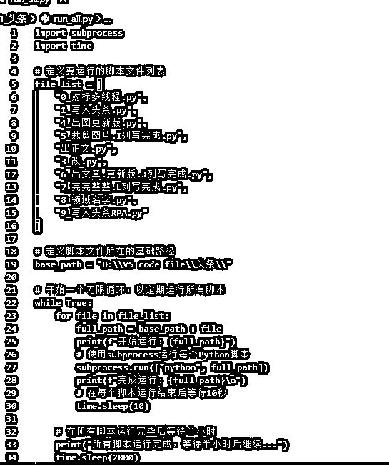
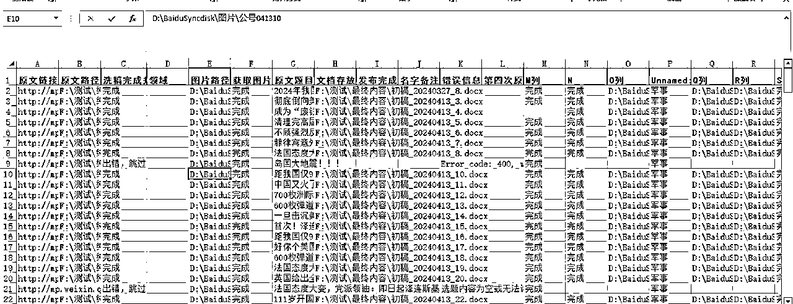

# 从项目爆雷到赚到生财百倍门票，我是如何通过公众号爆文矩阵化翻身的？

> 来源：[https://n1ntg7rfen8.feishu.cn/docx/V3HzdSWMCoE5s6xIyKocrHeOn3b](https://n1ntg7rfen8.feishu.cn/docx/V3HzdSWMCoE5s6xIyKocrHeOn3b)

大家好，我是阿泽，00后，坐标佛山，运营人。今天我要分享一下，我是如何从一名生财的小透明，一步一步通过贵人的帮助和自己的努力，赚到了百倍的生财门票。如果当初没有这么多贵人们的相助，我想我不可能会有这样的高度，如今我也希望分享我的经验，帮助更多的人，希望大家能获得一些收获。

# 适读人群：

1.对公众号爆文感兴趣的圈友；

2.上个月刚加进来的新圈友；

3.犹豫是否入局的圈友；

4.对矩阵玩法感兴趣的圈友；

这篇文章将从以下几个方面给大家剖析我眼中的公众号爆文项目：

一.为什么选择这个项目？；

二.遇到的挑战与解决方案：

三.项目复盘；

四.项目的未来方向；

五.学习与成长；

去年这个时候我正在做撸货，球鞋搬砖的项目，通过各平台的活动低价购入球鞋，在得物上转手。前期跟朋友一起合作，确实是赚到了一些钱，也正因为看到了收益，账面收益算下来一个月也能挣个1-2万，所以就麻痹大意，一直往项目投钱，越投越多，但是货买多了，出货量却跟不上，投了不少钱，压了很多货，每天醒来看着信用卡的6位数的待还款金额，我陷入了焦虑。

我有一种很强烈的直觉，手上的这个项目马上就要爆雷了，感觉天快塌下来了，难道我就只能被困在球鞋项目了吗？不行，我不能服输，我要自救，我要卷起来。

但也感谢这次球鞋项目，如果没有这次球鞋的爆雷，也许我跟生财之间的链接就不会这么深，也正是因为这次的爆雷，让我重新认真阅读闲置许久的生财帖子。

去年4月份加入的我，跟很多小白一样，怀揣着刘姥姥进大观园的心，想撸起袖子大干一场，结果却被琳琅满目的帖子吓退，实在没有办法全部看完，于是就直接摆烂，放一边不看了。

那时候我的要求不高，只要每月让我能赚 2- 3k，能帮我渡过难关，能让我在卡债中间喘口气，我就非常感恩了。此时，公众号爆文，赫然出现在了我的面前。

# 一、为什么选这个项目：

1.  拿到结果人数多：当时生财星球其实出现了不少公众号爆文拿到结果的帖子，日入几百，几千都有，而且都是用AI写作的，操作难度不高，能快速拿到结果，彼时的我正正需要这样一个能快速给我正反馈的项目。

1.  门槛低：公众号爆文不要求剪辑能力，也不要求各种图片去重的技巧，甚至还能借助 AI 的力量进行二创，确实是在我能力范围内跳一跳就够得着的事。

1.  离钱近：赚钱链路比较短；做公众号爆文，只需要写文章，赚取流量主的收益，不需要客服与人交流，不需要像电商发货，不需要处理售后等事情。但也因为这样，所以单账号的天花板不高。

1.  投入低：只需要一个购买魔法与GPT的费用，加起来也就二三百元，那个时候的我不会考虑需要大投入的项目。

1.  熟人推荐：信任的大佬也强推这个项目，我被大大地鼓励到，认准了这个方向，埋头苦干！

球鞋项目已经让我负债累累，我实在不能再接受另外一次的重击了。于是经过上述各个考虑，就这样，我带着我的卡债，开始了公众号爆文的项目了。

# 二、项目中遇到的困难

## 2.1 不会注册GPT；

万事开头难！是的，作为已经加入生财4个多月的我，居然还不认识 Chat GPT。更尴尬的是，本来想着通过生财航海来让自己掌握这门AI技能，却不曾想那时候刚好是两个航海周期的中间，被逼得没有办法的我，只好老老实实端坐在电脑前，看着密密麻麻的航海手册。一个又一个关键词在生财帖子搜索，期待出来一份完整的注册流程。

于是，我在AI风向标星球找到了GPT的注册流程word，老老实实一步一步跟着流程操作。终于，花了一整个下午，我终于成功注册了GPT。不开玩笑，那天下午的快乐心情，我至今仍然历历在目，那种靠自己摸索一步步达到目的的成就感是无与伦比的。

p.s. 为什么不直接问已经拿到结果的大佬？

我不自信，作为小白的我，并不能给大佬提供什么价值。而这个问题大佬都不屑于回答，加了几个没有回应后，与其浪费大佬的时间提问一下简单问题，还不如自己动手搜索。

说个题外话，真正做过项目的人，才知道搜商真的如涛哥说的那样，是一项非常稀缺的资源。

（关于搜商，B站的这位 UP主真的给了我超级多的启发，如果你也跟我一样，搜商有待提升，强烈推荐你去看看他的视频，如果有给你一点点启发，回来告诉我，让我们一同进步~）

https://www.bilibili.com/video/BV1yw411F7J1/?spm_id_from=333.337.search-card.all.click

## 2.2.账号定位的困惑：

公众号1.0时期；

项目一开始，我实在是没有头绪自己的账号定位是什么，当时的中老年情感文非常火，但我太了解自己了，一个纯直男，实在是无法写出那种情情爱爱的文章。于是，我试着写搞笑文，然而平时并没有什么写作训练的我，硬是要花 1-2 小时才能憋出一篇文章。更痛苦的是，找素材也非常费时间，一天下来，产出可能都没有3篇，迫于压力，我只好放弃了这个赛道。

现实让我清醒意识到，我需要换赛道了，但是换什么呢？剧评不喜欢，历史不擅长，军事没接触过，那就剩下一个法律赛道了。老实说，我跟很多小白一样，理所当然以为法律赛道的爆文，能且只能由专业人士书写。但看着法律赛道有很多人除了结果，我实在是无法抵挡住法律爆文的收益，于是，我试着去操作看看，没想到这个决定就转动了我的命运之轮。（温馨提示，AI 偶尔会写出与事实不符的内容，需要人工二次审核）

除了航海手册，我连船员的日志也不放过，我试图从大家的日志里找到点对我做项目有用的线索。皇天不负苦心人，有位船员在日志里说教练在群里发过一个法律爆文的框架，于是我开始一个个船员私信，很多私信都石沉大海。几经艰辛，我终于找到热心圈友，他一口答应了我，给我转发了。我想如果没有自己的坚持，没有圈友的热情，也就没有后来的故事了。

找准了对标之后，我的写作之路越走越顺，后来发现我的对标不仅仅可以在公众号上找到，头条同样也可以！而且两个平台的受众群体比较类似，也正因为开拓了多平台多对标账号的操作，使得我拥有了源源不断的素材。

我始终记得自己做项目的初心，我愿意给自己半个月尝试一下，实在没有结果，我再调整方向。而事实证明，我的这套打法是奏效的，在坚持日更的第二周，我就拥有了人生的第一篇20w+阅读的爆文。有了正反馈的我，更加坚定自己的选择！

教练说得对，哪有什么一蹴而就，不过就是日复一日地更新，日复一日地调整自己的方向，于是也就有了后续一篇接一篇的爆文。

（法律爆文跟热点爆文不同，只要类似的法律事件在中老年群体中热传，即便一直写，也能一直爆。说到底，能煽动中老年情感的文章，本身就自带爆的属性，不是吗？）

因为不断地写作，让我自己的网感也越来越好，所以后续也踩中了一个医疗反腐热点的文章，也是我人生中的第二篇 100w+阅读的文章。

（后来，平台对医疗反腐类的文章加大了审核，所以当时一些圈友哀嚎说自己的文章被下架了。我其实也意识到这个东西不能长久存活，所以拿够了收益就删除了。）

在写了法律文一个月期间，我已经写出了两个百万阅读文章，若干篇10w阅读后，我的公众号已经涨粉到 5000多了，也入池了。

基本每天发布的2篇文章的当天基础总阅读就能达到3w+，加上以前老文章都持续在推荐，那段时间每天的收益都在2000以上。我复盘了我能持续产出爆款文章的原因：有几个原因：

1.  只参考爆款，在头条中阅读量都是不低于5w阅读的，评论数在1000以上的。，法律赛道的爆文是没有时间限制的，所以在选择对标的时候，我其实不太关注对标账号发布文章的时间。我还关注了很多律师账号；

1.  开幕雷击，很多大佬之前就已经在星球里发布过相关开幕雷击的写法了，我就不班门弄斧了，感兴趣的圈友可以去看公众号爆文项目的航海手册，其中城管，物业，银行、农民等都是比较尖锐的话题，能刺痛到老百姓的神经。

比如我曾写过的标题：

基本上都比较符合开幕雷击的特点，再加上尖锐的话题；这些文章都是10w+的文章

1.  受众群体正确，看法律文的基本都是中老年人，他们会经常给我发私信，留言文中的内容，批判，系统就会判断我的文章写的不错，推给下个池子。对一些正能量的话题我会进行回复，这样他们会每篇都看。

1.  公众号爆文风口时期，那会还是红利期，现在已经不是野蛮生长时期了，但机会还是有。

我的大号算起来应该是有2篇百万阅读，50w以上5篇，10w以上很多篇。

（具体收益在下面）

## 2.3 如何放大收益？

经营一个公众号就已经让我单日最高收益突破10000了，潜意识告诉我，如果想要赚到更多，就应该需要上矩阵化，于是我就直接加了 5 个账号，但加完账号后，我就后悔了，我发现我一个人根本没有办法兼顾 6 个账号的文章日更任务，怎么办呢？我想一定有降本增效的办法！我要找人！误打误撞之下，知道了 RPA，知道了影刀，也认识了 Leeka 卡姐。

当你足够穷困的时候，你就能挤出时间去学习你想要的技能，于是，我花费了两周的时间看完了影刀的初级课程和中级课程，此时的我已经能做出简单的 RPA 机器人了。感谢卡姐感谢威哥，及时解决了我在设置机器人流程时的困惑。

公众号2.0时期

不得不说，在处理用 AI 二创公众号爆文的这个项目上，RPA真的大大大大解放了我的生产力，我不再需要像从前那样，只能呆坐在电脑前，等 GPT 生成完答案，复制粘贴到草稿箱。这一切我都能交给机器人，让机器人去等 GPT 给的答案，再写入草稿箱。

（这里是之前给GPT的指令词，估计已经落后了很多个版本了。）

RPA代码与AI交互的思路具体如下：

1.将对标文章链接放入Excel 中，利用 webPolit 插件（已经被封了）读取网址，GPT提取文章选题。

2.我的一组prompt分为5个部分，与GPT交互5次后才能组成一篇完整的文章；这个过程就让RPA自动检测是否写完。（识别到复制按钮即表示对话结束）

3.GPT回复完的内容复制到word里面，等prompt发完，word自动保存在电脑；

是不是很方便，把容错极致拉满，用多几个try catch语句，可以实现让电脑自己运行，报错了便重新来过，这个时候已经能实现解放双手了。

到这个时候，我公众号只有7、8个，虽然数量多了，但是大号的成功似乎并不能复制到这些小号上，并不是每一个号都能爆。后来经过同行提醒后才知道，外面的工作室都是成百上千个号，如果说成功有概率，那么加账号本身，就能产生更多成功的账号。——加号才是王道。我就想做到100个号试试看，于是矩阵之路就开始了。

## 2.4 入场人数变多，收益变低，寻求矩阵化

公众号3.0时期，

此时的我已经是坐拥100+账号的小老板了，为了保持账号能日更，也就意味着我每天需要产出 200- 300篇文章。虽然 RPA 能24小时不停歇工作，但工作效率跟代码比起来，到底还是差点意思。同是 GPT 也有对话次数的限制（3小时40次），即便我后续拥有 3 个 GPT 账号，到底还是差点意思。

感谢生财，感谢航海，在9月的公众号爆文航海中，我认识到了我的另一位贵人，毛韩教练。还有群里其他小伙伴，他们的专业度，让我对公众号爆文的玩法有了更深层次的理解。

以下思路都是我从高手中学到的，现在无私分享给大家，希望能对大家做项目有帮助：

### 2.4.1 我是如何坐拥100+账号的？

很多人会推荐让身边人用身份证实名认证。但毛韩教练真的研究很深，他提供了另外一个方法，让我醍醐灌顶。其实直接用营业执照注册，一个营业执照能注册2个公众号（大部分人注册第二个公众号会提示300的认证费用，但这里是可以绕过去的，如下图），而工商局是不限制个人办理多少张营业执照的，所以，你懂我意思吧~

至于营业执照怎么注册，其实可以通过万能的某宝，甚至还可以通过在支付宝上搜索，最低9.9就能办一个营业执照了。详细教程，星球里有太多，各位可以自行搜索，考验大家的搜商的时候到了。

注册完公众号还需要买流量主，一个流量主45元，真人粉大概1个号90-100元，我一般是刷45那档，然后等待一个星期再开流量主功能，最近平台审核比较严格，各位按照最新政策来调整自己的策略即可。

### 2.4.2 如何运营这些公众号？

因为一个微信号只能绑定5个公众号的运营者，所以如果我需要运营100 个公众号的话，也就意味着我需要至少准备20个微信号。

一个身份证可以在三大运营商办理5张电话卡，但我为了节省项目成本，选择找了注册卡来注册微信。注册卡一年只需要10元月租即可，三大运营商的卡一个月最低也要9.9，一年也就是120元。一个身份证只能实名认证 5 个微信号，所以这里就需要找亲朋好友帮帮忙了。

而我家里人比较多，微信号这个东西对我来说不是难事，就是比较麻烦，费时间而已。注册微信和绑定公众号这个事情也花费了我不少时间，不容易。

### 2.4.3 独立IP操作步骤

项目进行到后半段，很多同行都说要单号单IP，为了避免连坐，于是我也操作起来了。根据毛韩教练提供的b站教学链接，我一点点操作，反复看了好几遍视频。

至于为什么没有用指纹浏览器，因为一开始我用的就是悦互联，这个软件可以直接买IP，一个IP 40元/月，当时是一个IP下面挂着5个公众号；后面接触到了天翼云，发现单IP自己搭建的话成本低的可怕，算下来一个IP只需要3元/月。

具体的搭建流程，在B站都能找到，本应该给大家推荐我之前看的，但因为315 的原因，原来的链接已经失效了。差不多就是这样，难度倒是不难，就是比较费时间，应该早点找个小助理帮我做的。

### 2.4.4 公众号矩阵自动化流程：

#### 2.4.4.1 代码部分：

1.提前选好对标账号，提取他们主页链接；让代码自动进入他们头条主页查找有无符合我要求的文章选题，符合便抓取；（这里要感谢群里 毫末大佬 提供的爬虫抓取代码）

2.每天隔2个小时循环，自动抓取阅读量大于XXX的文章；这里我选的是12小时阅读量大于10000、24小时大于20000、72小时大于50000的文章。这一部分要比较灵活，有时候你要求太高，是采集不到符合要求的文章的，要适当降低标准。

热点文章要反应即时性：可以设置2小时大于1000，4小时大于3000，6小时大于5000的文章，这里比较灵活；

3.将符合条件的文章用代码提取正文内容HTML格式，扔给AI提取文章主题。这部分我用的是卡姐 告诉我的智谱AI（新注册的用户并实名有500w token，我白嫖了不少token）。

提取的主题大概是这样；

4.将AI提取出来的文章主题再给AI仿写；本应该用效果更好的GPT4，但是为了降低项目成本，还有要考虑到科学上网的原因。我还是选择了智谱AI，如果说 GPT4 能有90分的话，那么智谱写的能有85分，我觉得够用了。

5.仿写后第一遍往往只有700-900字，达不到1100字左右的要求，于是我会要求再次扩写到1500，这时候它就会给我写更多，字数都在1100以上，，此时我们的文章就能插入 2条广告了。

6.关于图片，一开始我用的是影刀RPA自动抓取原文章的图片，代码调不出来。一直报错。后来可以用代码抓取后，然后又自动让代码裁剪图片90%，将水印裁掉。

然后自动让代码将图片加入到最终文章的第1，3，5段后面。(附上自动下载图片操作视频，代码会自动跳到文章，并爬取这篇文章的图片)

7.管理每天生成的几百篇文章，我用了一个总的EXCEL（如下图）；

A列放置的是采集到的头条文章链接，然后依次处理；

①提取正文内容——完成；

②提取图片——完成；

③图片是否裁剪完成——完成；

④将正文内容给AI提取选题——完成；

⑤将选题给AI生成初稿——完成；

⑥将初稿扩写变成完整稿子——完成；

⑦在word中是否插入裁剪后的图片——完成；

最后最终生成的word放入百度网盘，公共盘同步到另一个电脑；有时候AI检测到一些比较敏感的文章，会拒绝回复；我这里让代码检测到后，直接在对应的excel单元格写上跳过，出错等；

至此，所有的代码运行步骤全都写完了，接下来就是轮到另一台电脑用RPA发布；

这期间用GPT写了不少代码，反反复复改了很多次了。

有一些小心得提醒大家：

1.有时候一直运行报错的代码就不要继续修改了，休息一下，重新开始，也许GPT就能写出能运行的代码了。

2.可以去b站看看一些代码的入门课，对代码能做什么有一个基本概念；

#### 2.4.4.2 RPA部分：（这里需要用第二台电脑）

1.从A电脑代码运行出来的文章，要将他们同步到第二台电脑去，这里我用的是百度网盘同步空间，同步效果可以的。需要在两台电脑同时登录同个百度云，要购买百度云VIP，十几块钱一个月。

2.将A电脑通过代码运行出来的文章写入word，在B电脑运行RPA将一个个word写入对应公众号，然后调字体，排版，把原创写上去，选封面、点击原创等元素之类的重复操作；（附上RPA运行操作）

（今天发现公众号改版了，一些控件位置需要修改，RPA的代码块也相应要改，就这样把，原理就差不多这样了）

由于RPA代码块太长，而且我写的只有我自己看的懂，这里附上圈友@马小威 的RPA操作帖子吧，有兴趣自己看看。

https://wx.zsxq.com/dweb2/index/topic_detail/211258128252451

看似一切都很美好的项目，我内心却知道在操作了半年之后，我是时候跟这个项目讲再见了。不是因为我不再喜欢这个项目了，而是我知道，我继续投入时间精力到这个项目上，已经得不到合适的反馈了，边际收益断崖下降了。

看似一切都是自动化，实际上很多时候如果代码报错，需要非程序员出身的我去手动调整，项目没有办法完全离开我，但我知道我是时候离开这个项目了。

我带着我的姐姐一起操作项目的，听说我要退出这个项目的时候，姐姐很是惋惜地说，好可惜，毕竟都为项目做了这么多，真的说放弃就放弃了吗？

我其实非常感谢这个项目，感谢它让我从泥潭中揪出来，感谢它逼着我学会了 AI、GPT、RPA 和代码等一项又一项从前我觉得我可能永远学不会的东西。但是我也清楚地意识到，天下无不散之宴席，当我对项目的投入，项目不能给我合适的反馈时，就是我该放手的时候。

多少是有惋惜，但项目终究是项目，没有这个还有其他的。但我从项目中获得的技能，却是能伴随我走过每个项目的。正如卡姐说的：“人生没有白走的路，每一步都算数。”

送给你，也送给我！

# 三、项目复盘：

1.  没有矩阵思维；没有想法设法放大，没有当机立断就增加多个账号，导致后来加了的时候已经错过了风口期。

1.  认知能力不够；信息闭塞，API是什么都不懂，更不需要谈到后来能做出自动化流程出来。

1.  单打独斗；做项目喜欢独来独往，内心惧怕和别人交流合作，公众号爆文外面也很多团队在做，收益还不错。沉浸在自己的一亩三分地，应该与别的大佬多交流，也可以是外面的工作室，他们已经领先了。

1.  没有请一个小助理；就应该请一个兼职小助理来做我80%的琐事。虽然我姐有时候会帮我，但是她也有主业，配合的不好。涛哥说超级个体都应该从一个小助理开始。

## 3.1 项目总收益：

总的来说，我的大号收益有12w，其他的号加起来也有5w收益，我在这过程也带了我姐也赚了4w左右，两个朋友，一人3w。（当然有些东西没算进去，GPT费用，流量主，营业执照等，也付费了不少圈子T-T）。感谢生财，我才有机会赚到第一桶金，同时也认识了更多的人，打开了更多的视野。

回顾一下，从生财接触到的这个项目让我挣回了百倍门票不为过。

# 四、公众号爆文未来的方向：

1.各平台都开始打击AI创作的文章了，可以从AI检测度这里下手：

AI检测器关注文本中的两个关键变量：困惑度和爆发性。（有兴趣可以搜一搜）如果想用AI提效，但不想被检测到，可以试试从这方面下手,之前研究了一段时间，发现融合方言写作能降低AI检测程度，比如上海话，北京话，东北话去改写文章，能有效降低AI写作检测。我用的5118 API检测（顺便提一下，这个5118就是网上搜出来的，搜商很重要！非官方的，仅作为参考。）比如下面我这篇就是带着北京味。

2.微信现在缺的是好内容，创作深度的内容才是王道，人写与AI写不同，人写的文章更有感情，情绪波动更加深，也体现在文字上；AI写弄几篇10w+文章难度不大，难得是持续有10w+文章，没有持续收益，也没有积累。

公众号写作最重要的是提供给读者价值。要么是干货内容价值，要么是情绪价值。只有通过认真的学习，反思，才能够写出真实的情感。读者也慢慢醒悟过来，轻易的就能分辨出孰是孰非，孰真孰假。

虽然AI创作也能写出好文章，但相比之下，用心写文章才是一件有复利的事，现阶段我更想做有积累的事，而这点也与亦仁给出的财富密码很契合。

3.好内容完全可以写付费文章，可以参考安迪周周这个博主，好文章付费文章收益比流量主多的多。他的公众号文章里经常都在盘收益。

# 五、做项目中其他方面的成长：

认识了更多志同道合的朋友，无论是上班还是撸货，朋友似乎一直都是那么些，没有变化。没有更多渠道。做了生财项目后，现在线上+线下都认识了更多各方面的牛人，交流的东西也变得深入，从项目、对某个事物/观点的见解、或者是如何培养某个技能等，受益良多。

读了更多书籍，我之前是个不怎么看书的人，但是生财的大佬们，个个都在看书，说明书籍一定是很有用的东西，8月到现在已经看了7，8本书了，比如李笑来《财富自由之路》和《与时间做朋友》，老喻的《人生算法》和《好运》，flomo创始人的《笔记的力量》，还有《福格模型》、《毛泽东选集》等，还有一个正循环，看书是与伟大的作者对话，越看越有意思，从而找更多的书来看，还帮我戒了游戏网瘾。

学习了更多技能，知道如何使用google找到我想要的资料，使用gpt和gpts，使用MJ，使用RPA，还会一小点python。“君子生非异也，善假于物也”，能够有意识的积累工具，一个好的工具能有事半功倍的效果。

变得平和与专注；以前长视频我是看不下去的，现在一个1-2小时的教学视频框框就看完了；而且现在自由职业，更多的都是在做自己的事情，从早上8点做到晚上11点，周末也不休息，丝毫没有怨言。

更有自信了；去年进生财看到大佬们的帖子总觉得遥不可及，特别是一些关于实体生意的帖子，更是直接跳过。现在我会认真分析他做的好的地方，应该怎么借鉴，记录到笔记，flomo刘少楠说过，笔记是为了——增援未来的自己。

对于大多数新加入的圈友来说，重要的不是挑选项目，而是先做起来，在做的过程中，边做边增长自己的各方面知识与能力，慢慢的就能跳出小白，升入下一个级别。

亦仁说过：“如果不知道做什么，就随便找个项目先做起来，反正最后成功的不是第一个选的项目。“

“不要成为学习高手，要成为实战高手“，祝你也祝我！

（非常感谢卡姐@Leeka 帮我审稿子！！！稿子反复打磨了几次，当然还可能会有不足之处，请圈友见谅，很幸运第一次发帖能得到卡姐的指导，感恩！）

希望这篇反复打磨好几天的文章，能给同样在做项目的你启发。如果你想了解更多关于这个项目的一切，请放心与我沟通，一定知无不言言无不尽，最后，让我们一起生财有术！