# 扬帆正当时：小白的生财之旅，一年成就月入十万的梦想

> 来源：[https://k170ac9yh31.feishu.cn/docx/AwgrdKmEAokvJ9xH2LbcTASdnug](https://k170ac9yh31.feishu.cn/docx/AwgrdKmEAokvJ9xH2LbcTASdnug)

# 一、自我介绍

各位生财的小伙伴们大家好，我是张波，一个衣着普通的男生，在大家看来应该还是一个“屌丝”的人。

2023年4月18日加入生财以来，我经历了从一名普通打工者到失业的低谷，再到现在月收入突破10W+的华丽转变。这段经历的酸甜苦辣，只有我自己最清楚。

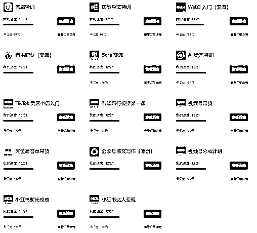

打完所有的卡后，我的心情久久不能平静，回想自己一年多经历，分享出我的这段故事，希望未来新加入的小伙伴，以及加入了星球后还在迷茫的圈友们一点启发，希望2024年大家都能够赚到钱，实现共同富裕的这一目标。

# 二、心路历程

在加入生财的这段旅程中，我经历了一系列心态上的转变和成长。我想通过时间线的梳理，将自己的心路的变化做一个拆解，与大家分享。希望我的经历能够为你们带来一些帮助，或者至少在你们阅读之后，能够有所感悟和收获。

## 1、小白心态

在加入生财之前，我通过一些非正规渠道（盗版的内容）零星接触过一些的生财信息。那时的我作为一名公司职员，每天被繁重的工作压得喘不过气来，有些帖子放在我面前，也无暇顾及。

一次偶然的机会，了解到生财还有所谓的“航海”计划，激发了我的好奇心，我想知道，这些航海的内容是否真的能够帮助我改善经济状况，是否真的能够让我实现收益的增长，怀着这样想法我进入了生财。

刚加入生财的时候，我被大量的帖子和活跃的交流所包围。在知识星球上，经常看到许多人分享着他们几个月就赚取几万、甚至几十万的故事，看得自己眼花缭乱，同时也充满了疑惑。当时鱼丸的微信群似乎并没有太多实质性的内容，除了招募新成员，似乎并无其他。

从2023年4月到6月，我几乎处于隐身状态，即便鱼丸偶尔询问我的情况，我也仅仅是敷衍了事，自己也没有当回事。那时我还在公司上班，工作上的种种烦恼让我无暇他顾，生财星球也就逐渐淡出了我的视野，我对生财的热情逐渐冷却。发现自己并没有从中获得预期的帮助，甚至开始怀疑自己是否“上当”。

## 2、心态崩溃

在公司业务未见成效，老板对我的能力产生质疑的那段时间，我感到自己的职业生涯走到了尽头。我深知若不为自己寻找新的出路，我即将会一无所有。于是我开始在BOSS直聘上更新简历，同时也为自己找一找其他的机会。

在这个时候，我想起了自己曾经加入的生财星球。我重新审视了里面的帖子，心中充满了疑虑和不安：这些项目真的能够带来收益吗？我害怕自己投入时间和精力后，最终却一无所获，那岂不是雪上加霜？

那段时期，我对自己的未来感到迷茫和焦虑。每天都在痛苦和煎熬中度过，不知道何时才能摆脱这种困境。每天上班回来，吃不下饭没有食欲，晚上8点去公园跑步，锻炼到11点多直到身体疲惫不堪，自己精疲力尽，然后回家洗漱，尽快进入梦乡，以便第二天继续面对那看似没有希望的工作。

## 3、寻找出路

那个时候在公司做项目经理，我没有助理，而工作任务却堆积如山，我渴望找到一种方法，能够让工作变得更加高效，减轻我的负担。我感到前路茫茫，迫切需要找到一条新路的时候，我选择了投资自己，通过生财付费了一个圈友的课程，主要学习RPA（说到这里估计大家也知道是谁了）。

RPA的概念让我看到了希望，我相信通过学习这项技术，我能够实现工作的自动化，从而让自己不再那么劳累。

我全身心投入到了课程的学习中。从入门课程到提高课程，再到最后的实战案例，我一步一个脚印，稳扎稳打。

入门课程我只用了几个小时就掌握了基础，提高课程我花了两周时间深入理解，而更高级的课程我投入了半个月的时间来精进。我告诉自己，必须要对得起自己投入的金钱和时间，如果学不会，那么所有的投入都将化为泡影。

群里的很多人可能不理解我为何如此拼命地学习，但我心中有一个坚定的信念：我必须要完成自己的学习目标。我坚持不懈，不畏艰难，即使过程中遇到了挑战和困难，我也咬紧牙关，硬着头皮继续前进。这种坚持不仅让我掌握了RPA技术，也为我后续的职业发展打下了坚实的基础。

## 4、航海项目

当时我错过了生财5月份的航海报名，只能等待生财下期的航海了。我并没有松懈，正好刚加入的社群也在有航海。我自己就报了几个，感觉这还挺好，能够跟着有经验的人学习，一方面操作另一方面还有人给答疑，在这个过程中，我有幸遇到了几位公众号领域的教练，他们的知识与经验对我影响深远，我开始尝试自己运营公众号项目。

后来生财的航海开始了，我也迫不及待地报名参加。作为新加入的成员，我对即将开始的航海充满了期待和激动。在一次由梁靠谱和杨涛主持的直播中，他们鼓励大家“下场干，弄脏手”，这句话深深触动了我，坚定了自己的内心，我自己一定要做出来一个项目，要让自己有收益有口饭吃。必须要亲自动手，真正投入到项目中去，只有这样才能确保自己能够获得实际的收益，确保自己能够在生财的道路上站稳脚跟。

## 5、知识付费

航海到一开始的时候，就碰到了很多人加我。有些的人自我的介绍明里暗里就是，让你付费买一些课程，说跟着这个“XXXX”就能够解决所有的问题，并声称能够实现月入数万元的目标。这种诱惑让我一度感到迷茫，我甚至考虑过是否应该付费参加这些课程，以便更快地取得成功。

那时我的公众号项目刚刚开始变现，每天的收益虽然不多，但却是我自己努力的成果。面对是否进行知识付费的选择，我感到了经济上的压力，因为我并没有多余的资金来支付这些课程费用。最终我没有进行任何付费，而是选择继续专注于自己的项目，通过实践和自我学习来提升自己。现在想来那个时候要是付费成功的话，现在估计就是另一种模样了吧。

## 6、奋发图强

在我刚开始运营公众号项目时，虽然现在看来那时的工作相对简单，但对于当时的我来说，一切都是新奇且充满挑战的。作为一个刚入门的小白，我有很多疑问和困惑，总是渴望能够得到解答。

在航海群里，当其他人提问时，教练们总是热情地回答。我便想着，也许通过在群里提问，我也能获得同样的帮助，这样自己就不会苦恼了，但是当我真正提问时，教练对我的问题似乎并不那么重视，这让我不禁开始自我怀疑：是不是我的提问方式有问题，或者我无意中影响了他人的情绪。那时我甚至觉得自己的问题是多余的，心态几近崩溃。

现在回想起来，我明白了原因。有些圈友本身已经加入了付费课程，或者通过私下发送红包、答疑的时候发了红包。那时自己“一毛不拔”抠门，不懂这些人情世故，显得有些稚嫩。有些教练不回答问题了，我只能通过观察他人的问题和教练的回答，每天进行复盘和总结，逐渐提升自己的运营能力，这期间我的公众号账号也随之逐步成长起来

航海结束后，我面临了是否继续续航的选择。那个时候自己也高傲过，认为公众号项目并不复杂，甚至考虑过放弃续航。最终我意识到了自己的错误，选择了继续坚持~~

续航期间，每次看到其他圈友的分享，感觉自己太卑微自己啥感悟都没有，深感自己的不足，每天还是把别人的复盘自己整理一遍，从中汲取知识，激励了我不断学习和进步。

记得有一次，我在群里咨询猫哥一个关于2345邮箱的问题，一个圈友故意打岔，她就想在群内找别人聊闲天，我却要知道这个问题的答案，那个时候自己也不知道私下聊，结果在群内和她发生了争执，从那时起，我决定要更加努力，倒逼自己不断输出。

自那以后，我开始在群里积极发言，不断分享和交流，逐渐成为了大家口中的“卷王”。这个称号一直伴随着我，直到航海结束，甚至延续至今。我要感谢那位曾经让我生气的船员，正是因为那次冲突，激发了我奋发图强的决心。无论遇到什么困难和挑战，相信自己，就能够不断超越自己，实现自我成长

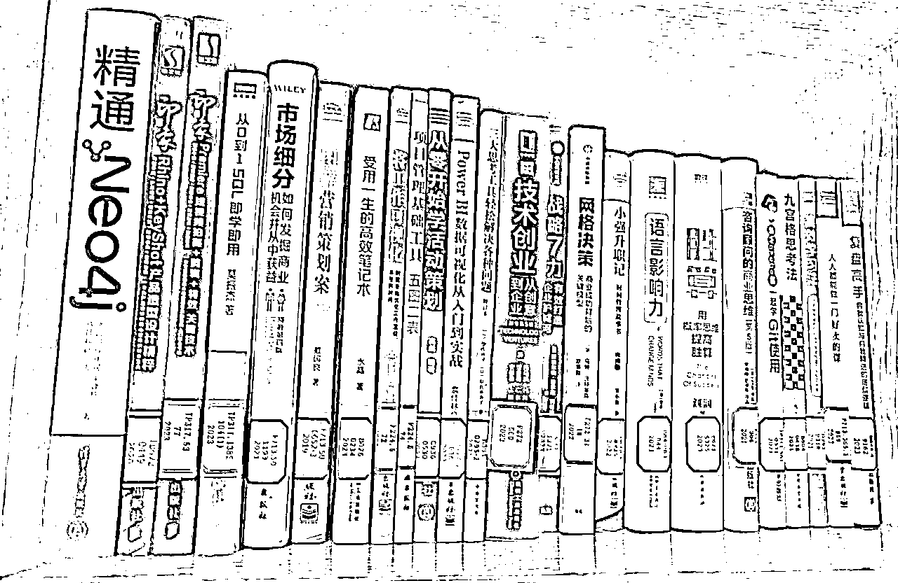

在参加航海项目的同时，除了在生财看帖自己也会到图书馆借书，找到自己需要的内容，提升自己的综合的能力。

## 7、苦尽甘来

随着时间的推移，我的公众号项目逐渐步入正轨，收益稳步增长，我的运营能力也在不断提升，越来越强。在这个阶段，我撰写了自己的第一篇精华帖，【公众号爆文进阶教程】得到了教练、领队以及志愿者们的认可。我意识到，我已经具备了担任教练的能力和素质。但是在那个时候，我更倾向于专注于自己的项目，赚取更多的收入。成为教练的想法似乎并不那么吸引我，我就想自己赚钱，做啥教练，我自己赚钱不香吗？

那个时候我也在默默地筹划一盘大棋，一个不能给任何人说的事情，我不能与任何人分享。尽管我有能力成为一名教练，但我并没有立即接受这个角色。直到12月份，我才决定担任公众号爆文的教练，今年3月份我又成为了自由职业教练。在忙完那件重要的事情之后，我现在有更多的时间和精力来帮助更多的人。

不仅因为这是一个传授知识和经验的机会，更因为这是一个与他人共同成长的过程。通过分享我的经验、技巧、闭坑，我能够与圈友们一起进步，共同探索公众号运营的无限可能。同时我也期待在未来的教练生涯中，能够遇到更多志同道合的朋友，一起创造更多的价值和成功。

# 三、项目梳理

在公众号项目逐渐稳定并取得一定成果之后，我开始担忧未来可能出现的不确定性，尤其是流量的不稳定性。我深知，如果公众号突然失去了流量，那么我的收益也会随之受到影响。为了规避这种风险，我做出了一个重要的决定：我要完整地阅读生财社区里的所有精华帖。

这个决定受到了梁靠谱大佬的启发：“生财的精华帖，只有两个人看完，一个是亦仁，一个是我。” 这句话让我深感震撼，也激发了我的斗志。我觉得自己也要努力，如果想要在生财的道路上走得更远，就必须付出更多的努力，不能让自己与大佬们的差距越拉越大，我也要看完帖子，因此做了决定就开始行动了~~~

## 1、梳理方式

在我开始深入阅读生财社区的帖子时，没有感觉，自己虽然看了很多内容，看了内容也记不住，记忆并不牢固，然后自己还容易忘，经常遇到问题自己也不知道该问谁，如何解决，也不清楚该向谁求助。尽管我曾学习过资料管理的航海课程，但似乎并没有找到合适的应用方法。那个时候遇到了一个做个人能力提升的推销自己的课程，感觉没有让自己行动。这让我感到非常苦恼。

在纠结和迷茫中，我做出了一个可能现在都让自己匪夷所思的决定，这个决定现在想来可能有些出人意料：我决定先把这些帖子浏览一遍，然后挑选出那些我认为有价值的内容打印出来。对于不理解的部分，我会做标记，之后再去查阅其他人的相关帖子以寻求答案。我统计了一下，包括航海项目和其他项目在内，大约有50多个，于是我准备了100个文件袋，并购买了便利贴，在每个文件袋上标记好项目名称，以便于后续的查找和复习。

由于我自己拥有一台打印机，我购买了几瓶墨水，开始了我的打印工作。最终，我打印的量是如此之大，以至于把我的打印机的喷头都给打印报废了1套，后来买了一个国产的又给整报废了，后面又买了一个原装的进口的。

## 2、筛选内容

面对生财社区海量的帖子和多样的栏目，我感到有些不知所措。每天新产生的帖子数量之多，让我感到即使不吃不喝也难以全部消化。作为一个刚刚跑通一个项目的新手，我感到自己无法跟上这样快速的信息流，这让我非常苦恼。当时我还未能发现看到很多大佬们分享的关于如何高效利用生财社区资源的方法，因此我迫切需要找到一种节省时间的策略。

在这种情况下，我采取了一个简单却有效的策略：就从航海手册开始看一个个的看，逐一阅读。这些肯定是精华帖中的精华帖，我决定将它们作为我的首要阅读对象，每一个航海看下来，一直看到大航海（前两期）。在这个过程中，我逐渐建立起了对生财社区内容的整体认识。

把这些内容完后，在看的过程中看到了精华共读这个航海，它让我眼前一亮，这不就是我要找的内容吗！我仿佛找到了宝藏。这正是我一直在寻找的内容！它不仅包含了社区中的精华帖子，还能够让我更高效地获取和学习这些内容。从那时起，我将重点放在了精华共读的帖子上，这让我的学习过程变得更加有针对性和高效。

## 3、梳理内容

在我深入探索生财社区的过程中，我首先专注于阅读每个航海项目的手册，并将其内容整理成文件，随后打印出来，以便我能有一个实体的参考资料。我将这些文件逐一整理，确保每个项目的相关手册都能够方便地查阅。

那个时候自己还做了一个更大胆的玩法，我注意到，能够在手册中出现帖子的大佬们无疑是具有一定能力和影响力的，这个人肯定是一个有能力的人，我就把那批大佬们点兵点将一个个不落全给学习了一遍、将这些大佬们的文章和帖子全部找出来，逐一学习并记录。我相信通过学习他们的经验和知识，我能够获得宝贵的洞察力和灵感。

接下来，我将注意力转向了精华帖。在浏览精华帖的过程中，我意外地发现鱼丸整理的一些合集。这些合集对我来说就像是宝藏一样，它们汇集了社区中的精华内容，为我提供了丰富的学习材料。我决定将这些合集全部仔细阅读一遍，以确保我能够从中吸取到尽可能多的知识和经验。

（PS：鱼丸合集该更新，该增加一些新的了~~~）

## 4、提高效率

随着我对生财社区内容的不断深入和熟悉，我的阅读效率显著提高。我开始能够快速识别帖子的内容和价值，不再像以前那样对每篇帖子都感到纠结和不确定。这种能力的提升，让我能够更加自信地筛选和吸收信息。

我注意到了许多社区中的资深成员，如七小、家蒙、轩辕等，他们分享了各种节省时间的策略和玩法。这些方法对我而言就像是滚雪球一样，随着时间的推移，我的知识库和经验不断增长和积累。

现在我阅读一篇帖子的速度和理解能力都有了显著的提升，我能够迅速抓住帖子的核心要点，并将这些信息整合到我的知识体系中。同时我也保持着整理内容的习惯，这不仅帮助我巩固所学，也使我能够在需要时快速回顾和查找信息。

## 5、目前现状

经过一段时间的深入阅读和积极互动，我在生财社群中积累了宝贵的知识和经验。我不仅通过阅读众多精彩的帖子获得了丰富的洞见，而且在与社群中的大佬们进行交流时，更加自信和深入地探讨问题。

当有些大佬们加我好友并开始对话的时候，也能聊上几句了。我们的沟通往往直接而高效，我能够清晰地指出他们分享中的核心要点，以及我个人最为关注和感兴趣的内容。

记得最深的是和轩辕大佬聊他写的一篇提到了“贝叶斯概率”的内容，我们深入讨论了他关于“贝叶斯概率”的文章，那次对话给我留下了深刻的印象。我们之间的交流避免了冗余和基础性问题的讨论，使得双方的时间都得到了充分的尊重和利用，不会问一些特别小白的问题，大大提高了沟通的效率。

如果你不知道做什么项目，你就把生财所有的项目全看一遍；

如果你不确定项目适不适合你，你就去看100篇这个项目的精华帖。

# 四、时间管理

时间管理对于任何人来说都是一项至关重要的技能，尤其是在面对众多任务和责任时。很多人好奇，我每天做那么多的事情到底是怎么协调的，自己每天怎么会有那么多时间，是不是在胡扯等等。

对于这样的疑问，我想分享一些个人的时间管理策略，这些策略帮助我更好地协调每一天的工作与生活。

## 1、初步管理

在我同时兼顾全职工作和个人项目的过程中，我逐渐意识到时间管理的重要性。一边在上班，一边自己在做项目。直到9月底，我从公司彻底离职，那时我的公众号项目已经稳定运行，这让我不再受制于老板的威胁。最终老板选择了解雇我，并给予了一定的赔偿金。

在那段时间里，很简单有效地自己学会了RPA，这项技能极大地提高了我的工作效率。无论是在公司的工作还是公众号的内容创作，我都运用RPA来自动化重复性任务，这使得我的效率得到了显著提升。而我更深刻体会到掌握一个得心应手的工具对于解决时间管理问题的重要性。

如果没有之前几个月夜以继日地学习RPA，我可能就没有足够的时间来运营公众号项目。正是因为我投入了大量的时间和精力去学习这项技能，我才能够在后来的时间里，更加高效地管理我的工作和项目。这段经历让我深刻认识到，对于个人发展和时间管理来说，投资于自我学习是多么的关键。通过不断学习新技能，我们可以为自己打开新的可能性，从而在职场和生活中获得更大的自由度和控制力。

## 2、核心玩法

当我开始整理生财社区的帖子时，我意识到自己的时间变得非常紧张，开始不够用了。虽然在项目运营中我能够利用RPA技术提高效率，但在阅读帖子和学习新知识方面，RPA却帮不上忙，学习不能用RPA呀。

起初我只能依靠自己的毅力坚持下去，那个时候还没有付费的打算，一想自己都坚持到这里了，找谁去付费呢。别人知道我在做这件事是不是影响不好，别人也和我一起卷的话，可能会加入竞争，从而削弱我的优势。

我一直坚持到了12月中旬，那时另外的社群没有新的航海项目，也没有其他重大事务，这给了我一个专注于学习的宝贵机会。我将这段时间视为上天赐予的两个月，每天只睡4个小时，其余至少18个小时都投入到阅读帖子和学习中。几个月的高强度学习最终让我取得了显著的提升和进步。

## 3、未来玩法

随着时间的推移，我发现自己已经养成了每天阅读生财社区帖子的习惯。到了2023年12月，我的日常已经变得相对轻松，不再需要像之前那样投入大量的时间来学习。现在我每天大约花费3个小时左右浏览帖子，这个习惯已经成为我日常生活的一部分，如果哪天不看，反而会觉得不适应。

对于未来，我已经完成了2024年的续费，这表明了我对自己持续学习和成长的承诺。我相信自己会在接下来的一年里继续努力，阅读更多的帖子，不断吸收新知识，提升自己的能力。同时我也期待其他更多的圈友能够创作出更多优秀的内容，这样我们所有人都能从中受益，共同进步。

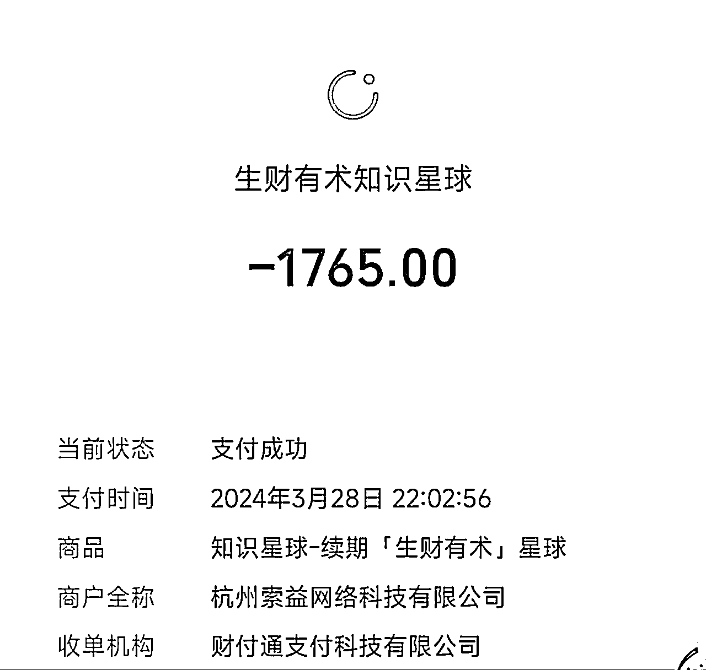

## 总结：

时间管理的核心在于如何有效地利用我们所拥有的时间资源。当我们面临时间紧张的挑战时，要想进行有效的时间管理，确实需要一些额外的策略和方法。在时间受限的情况下，关键在于如何优化和提升时间的使用效率。

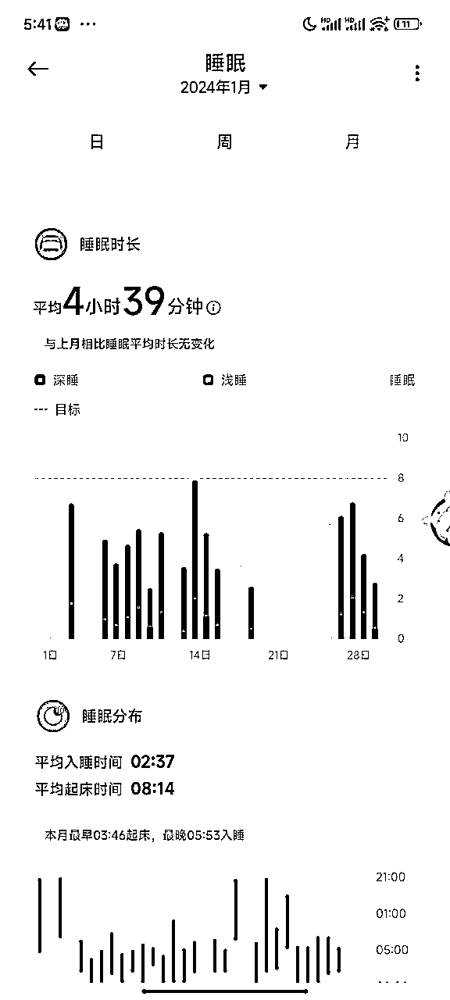

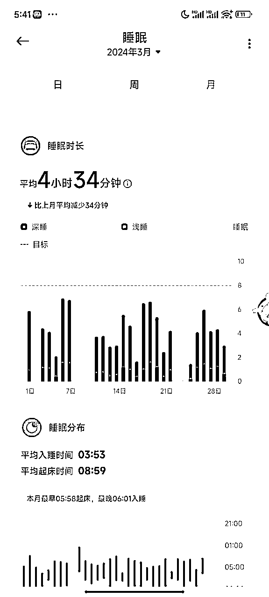

如果没有足够的时间，时间管理的难度自然会增加。

就拿我自己来举个例子，现在普遍的睡眠时间每天大概在5个小时左右。我也知道这种方式不好，但是现在除了更多时间，我还有什么其他的办法嘛，大家都在努力前行，你自己本身就比别人落后一大截自己还不奋起直追，怎么才能够追得上的别人呢。

时间管理在于找到合适的平衡点——在追求职业成功的同时，记得也要照顾到个人健康、家庭和社交生活。通过不断地实践、评估和调整，逐渐掌握如何在有限的时间内实现最大的价值，我也还在践行和调整中，大家有好的方法也欢迎互相的交流。

# 五、航海历程

自从我踏入生财的旅程以来，回顾过往，我总共参与了五次航海活动。起初由于对航海的不熟悉，我参与的次数较为有限。随着每次参加航海项目，我的能力得到了显著提升，我开始更加积极地参与到更多的航海中去。

尽管在某些航海中，我的打卡和互动表现可能不尽如人意，但我始终坚持不懈，将每一次航海的经验与星球中的精华帖子相结合。我不仅在理论上学习，更重要的是，我努力将所学知识应用于实际项目中，确保每一次的学习都能够落地。

## 1、2023年9月（第一次参加航海）

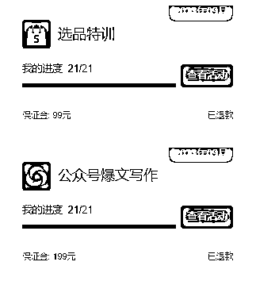

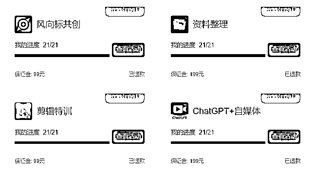

第一次参加航海的话自己没有报名太多的航海，经过深思熟虑，精心挑选了适合自己的项目。我将航海项目分为两种：一种是变现，一种是投资。

变现：公众号爆文写作+ChatGPT自媒体+资料整理；

投资：选品特训、剪辑特训、风向标共创。

变现：

都是围绕公众号展开的，完成一次打卡的话，相当于就是把所有项目都做。ChatGPT自媒体：制作提示词，生成公众号需要的文章；资料整理：整理对标的文章，学习别人的写作风格；公众号爆文写作：就是变现。

投资：

剪辑特训，那个时候就打算后期自己要做抖音、视频号这些视频平台，那个时候主要做的就是自己要了解并掌握视频剪辑的基本技能；

选品特训：视频变现的方式基本都是带货，带货的话，就要自己选品了，希望通过这个项目学习如何选择适合推广的商品，为未来的带货做好准备；

风向标：就是锻炼自己看风向标的能力，提升自己洞察市场趋势的能力，这对于把握商机和做出正确决策至关重要。

## 2、2023年11月

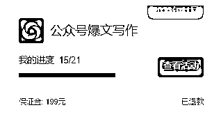

11月是9月的续航，自己在这个项目上变现能力比较多，其他的多都没有选择续航，那个时候就开始节省时间看其他项目的帖子了。

## 3、2023年12月

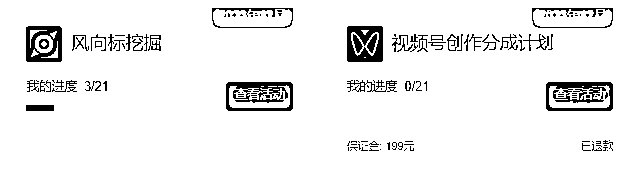

在这一次的航海中，我原本计划报名参加视频号分成计划，希望能够深入探索和实践视频内容的创作与盈利。然而，命运的安排让我获得了一个宝贵的机会——被选为风向标挖掘的志愿者。在权衡之后，我决定接受这一角色，暂时放下视频号的计划，全身心投入到志愿者工作中。

作为风向标挖掘的志愿者，我不仅有机会帮助圈友发现和挖掘有价值的信息和趋势，还能够亲身体验到志愿服务的意义和乐趣。在这个过程中，我与团队一起努力，找到了一套有效的挖掘方法，并成功地帮助大家提升了上岸率，达到了90%以上的成绩。

尽管在担任志愿者期间，我也私下里对视频号分成计划进行了一些研究和尝试，但我发现这样的自学效果并不如跟随航海计划那样系统和高效。因此在志愿者工作结束后，在接下来的航海里我没有犹豫，立即报名参加了视频号分成计划，希望能够借助航海的力量，更深入地掌握视频内容创作的技巧和策略

## 4、2024年1月

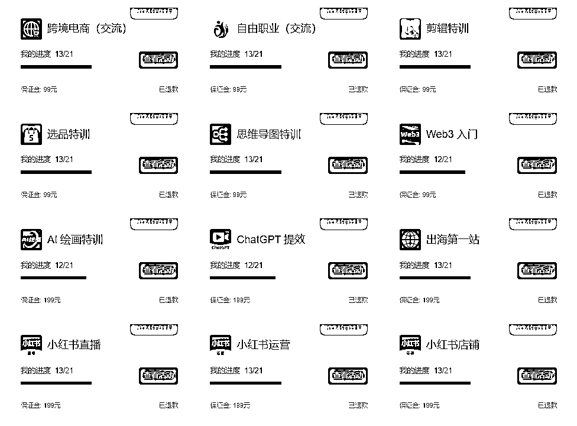

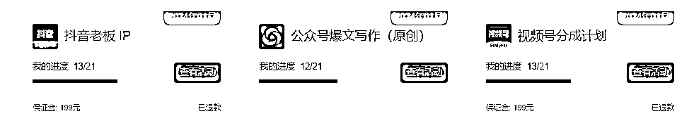

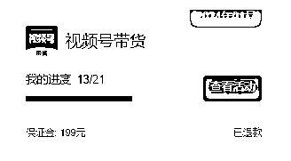

这一期航海对我来说是一个全面爆发的时刻。之前所有的积累、对各个项目的深入拆解以及不懈的努力，都在这个月得到了集中的展现。我参与了多个航海项目，尽管有些项目如闲鱼二手书、优势挖掘、运动等并未报名，但我已经在这些领域取得了显著的成果。

在这一期，我不仅作为公众号爆文的教练，带领了五次高手领航，还撰写了一篇精华帖和一篇普通帖，获得了圈友们的认可和赞赏。对于那些觉得这一切不可思议的人，他们可能不知道，我在前几个月就已经默默地付出了大量的努力。在很多项目还未正式启动之前，我已经通过自己的方式将它们跑通并完成了任务。对我来说，参加航海更像是一种仪式，一个展示自己成果的舞台。

## 5、2024年3月

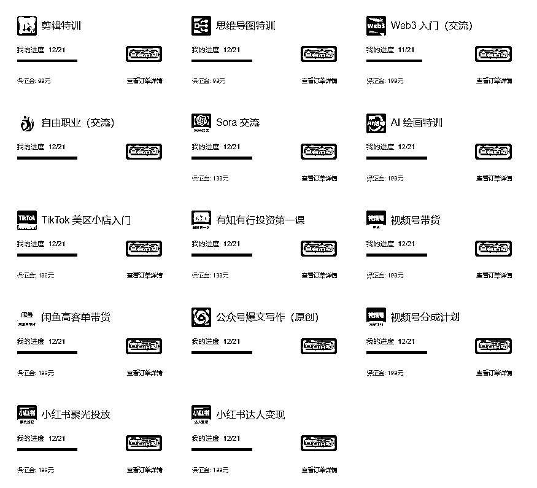

在这一期的航海中，我再次积极参与了多个项目，其中不少是我连续几次报名并深入参与的。这些项目已经成为我成长道路上的重要组成部分，我不仅在其中获得了宝贵的经验，也见证了自己的进步和变化。

我对于这些项目的持续参与，不仅源于我对它们的热爱和兴趣，更因为我看到了持续学习和实践带来的积极影响。每一次的航海都是一次新的探索，每一次的挑战都是一次自我提升的机会。我计划在未来继续报名这些项目，除非生财决定不再提供这些宝贵的学习机会。

## 总结：

回顾我的生财之旅，我自豪地说，我参与了生财90%的项目。每一个项目都有其独特的魅力和价值，它们不仅丰富了我的知识库，也锻炼了我的能力。我已经对每个项目的特色有了深刻的理解，并能够根据自己的性格和优势，选择最适合自己参与的项目。

未来的道路依然漫长而充满挑战，但我相信，真正能够阻碍我前进的不是时间的流逝，而是我自己的态度和决心。只要我保持对学习和成长的渴望，持续地挑战自我，就没有什么是不可能实现的。

# 六、项目执行

项目执行是实现目标的关键阶段，而在这一过程中，保持客观和公正地记录遇到的问题至关重要。仅仅依赖于记忆是不够的，因为随着时间的推移，细节可能会变得模糊，而且记忆可能会受到个人情绪和偏见的影响。

每天结束时，我都会对自己的航海项目进行复盘，这不仅是对当天工作的回顾，也是对未来改进的规划。我会详细记录下在项目执行过程中遇到的问题，包括技术难题、沟通障碍、时间管理上的挑战等。这样的记录有助于我在需要时快速查找信息，也使我在向他人求助时能够清晰地表述问题所在。自己遇到的问题的时候，请教别人也能够知道你遇到的问题。

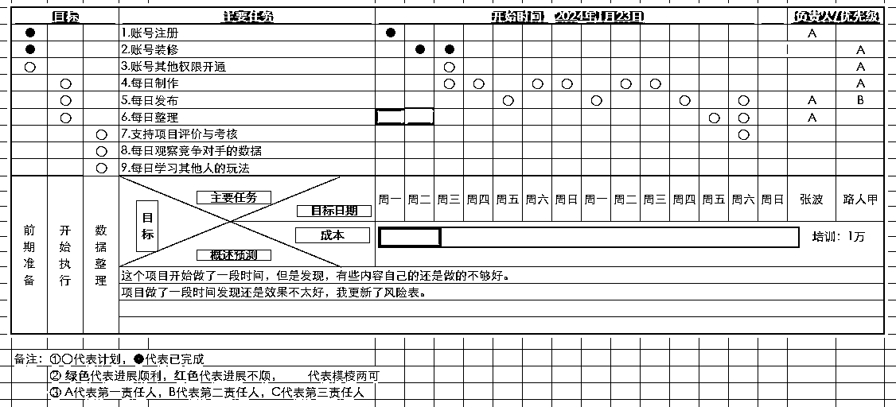

## 1.WBS拆解

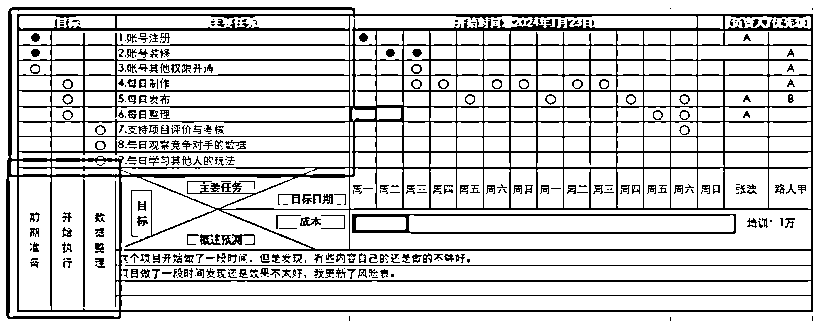

红框内容，我觉得就是在做就是WBS，直接把任务分成几个阶段，然后每个阶段要做什么事情，任务拆解的话要合理，不要把一些内容聚集到一起，尽可能按照自己的实际情况做拆解。

项目→任务→工作→日常活动，将一个大项目分解成一个个任务，将任务再分解成可以完成的工作，最后将工作分解成一次次的日常活动。

## 2.进度表

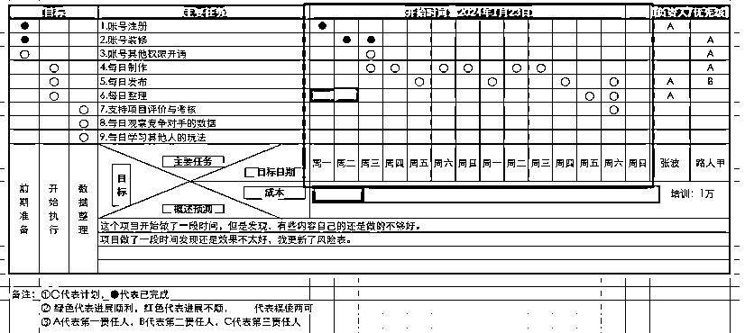

•进度跟踪和监控: 通过图示把数据填充，数据收集能够有效跟踪进度，并监控项目时间表，便于后期及时的追踪进度。

•目标日期: 目标的日期建议直接按照天为单位，每天做了什么事情，这样便于后期的一些复盘，要是有什么新的操作，直接在概述预测上进行描述。

## 3.责任分配矩阵

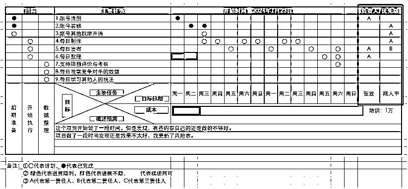

•RACI矩阵的实际案例: 每个人按照自己的职责干好自己的事情，详细的记录也便于大家找到问题。

•沟通与协作: 例如对于其他人的请教，自己做好记录，便于后期进行复盘。

## 4.风险管理更新

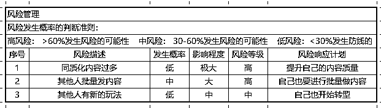

在实际做项目的时候，还得进行风险管理内容的更新，及时把握动向，找到相关的问题，而不是不撞南墙不回头的玩法，一定要及时的分析，及时的进行整理。

更多请看：《航海项目-个体/副业项目实践操作初步指南》

# 七、遇到问题

## 1、项目问题

在项目的执行过程中，遇到问题是在所难免的，而如何应对这些问题，反映了一个人的心态和解决问题的能力。以下是我遇到的一些具体问题，以及我对待这些问题的态度和解决方法：

a、公众号爆文：分类持续不久，账号不够多，原创度不够。

b、小红书：如何快速突破1000，提升用户的互动。

c、视频号、抖音：提升自己的视频播放量，提升带货能力。

这些都需要自己去解决，关键在于自己一定要能够找到问题，找到根本问题，然后定义问题，最后解决问题。这可能需要我进行市场调研、学习新的技能、或者寻求专业人士的建议。

## 2、资料问题

资料问题的话其实就比较简单，大家经常会遇到内容不太够新，别人分享的经验过于旧，有些核心的资料别人也不会轻易做分享，自己就要思考解决的方式，以及解决的办法：

因此我采用了一种办法：采用项目资料混合式玩法，在前面我已经将内容进行整理，并且打印出来。例如在公众号爆文遇到了问题，可能会尝试看一看别人在小红书上的玩法是不是能用。或者说在小红书遇到的问题，我看看抖音、视频号、公众号、IP朋友圈的玩法是不是也能够用在小红书上。

我采用了多种方式混合资料的内容的玩法，把我的知识边界进行了一个拓展，而且效果还是比较好的。

## 3、执行力

我自己有的时候执行力也是会不足，现在我所有的项目都是我一个人完成的，然后通过RPA进行操作，但是我一个人的时间毕竟还是有限，现在没有招人增加预算的想法。

现在自己一方面提升自己的效率，另一方面自己也在看看能不能够有更好的解决办法。

## 4、时间管理

时间管理现在我做到了极致，不知道再怎么提升自己的时间了，招人的话目前解决不了问题；我现在都用了RPA了，3台电脑在干活了，不知道下一步自己再怎么做下去了。

# 八、突破瓶颈

以前我遇到的最大的一个瓶颈，就是一个问题，其实困扰了我很久。

## 项目分析

1、虽然公众号项目单价越来越低，通过AI写的文章账号很容易就会被限流，提高写作方法让自己的文章越来越接近手工写的文章；

2、通过引入其他平台高质量的内容，例如播客、抖音等高质量的内容通过语音转化软件。

3、未来单价可能还会更低，我相信公众号的基础流量还在，冬天已经到了春天还会远吗？

## 未来选择

•继续持续做大量的账号，继续用AI写，然后自己发获取短暂的收益，然后账号被限流。（不建议）

•进行内容质量的提升，让自己的账号活的更长久一些，一点点的让自己的账号成为腰部账号。（长久之路）

•大量的人加入爆文项目，就看谁能够快速适应调整，快速的做出应对，谁才能笑到最后。

关于公众号项目生死的问题，如果继续劣质文章的话，公众号项目必死无疑。为了解决这个问题，向很多大佬学习了很多东西，例如：离散数学、悖论、笛卡尔坐标系等等。解决了这个问题后，现在我的这个项目依然还是有一个稳定的收益。

# 九、个人建议

作为一个小白到一路走来，下面谈一些自己的看法，希望对大家有帮助：

## 1、认清自己

自己不要过高的抬举自己，例如：“觉得自己是世界上最厉害的人，天选之子”。脚踏实地的去做自己，去分析自己的优势，劣势，自己有哪些不足，自己如何才能够做扬长避短，而不是天天自己幻想着赚大钱，而没有任何实际的行动。

找到自己的优势，然后拼的就是执行力了，没有任何借口，只有铁与血。

## 2、认清别人

为什么要认清别人，只有认清别人后，才知道给你提的建议是不是有用，能不能够帮助到你，不要被一些优美的海报，优美的话术所吸引，自己一定脚踏实地的去分析，只有这样才是唯一的出路。

## 3、认清项目

生财有很多项目，外面也有很多项目，报名航海也好操作这个项目也好，一定要认清自己，然后一步步的判断自己是不是能够有落地的可能性。自己身边的资源是不是支持你做这件事，就怕自己梦想觉得很好，但是现实又比较的残酷。

# 十、未来规划

接下来我预计自己会做三件事：

## 1、利他

利他精神是我个人成长和职业发展中非常重要的一部分。在未来，我计划每一期都报名参加航海教练，希望能够通过自己的经验和知识来指导和帮助更多的人。我相信，通过分享和传授项目经验，不仅可以促进他人的成功，也能够在这个过程中进一步提升自己的技能和认识。

我不再满足于仅仅独自研究和撰写帖子，而是希望能够将我的技术突破和创新应用到每一个船员的项目中，从而带来实际的收益和成长，让每个船员从航海的参与者成为航海的主人。

例如：在这一期公众号项目的航海，船员自己坚持了3个月没有收益，看了我的帖子后行动后开始收益，这就是让我觉得很幸福的事情。

这不仅是对自己努力的肯定，也是对利他精神的最好证明。我相信，当我们将自己的知识和技能用于帮助他人时，我们自身也会获得成长和满足。在未来的航海中，我将继续秉承这一理念，不仅作为一个学习者，更作为一个教练，与圈友们一起成长，共创辉煌。

## 2、复盘

复盘是提升个人能力和推动项目成功的重要环节。通过对自己的行动和决策进行回顾和分析，我可以更清晰地认识到自己的优势和不足，从而找到提升自己的方法。

为了确保持续的进步，我计划实施一个严格的复盘制度，包括每日、每周和每月的复盘。每日复盘将帮助我及时调整当天的行动和策略，确保每天都在朝着目标前进。每周复盘则是对一周工作的总结，让我有机会审视中期目标的实现情况，并做出相应的调整。每月复盘则是对长期目标和整体战略的评估，这将帮助我在更大的时间尺度上保持正确的方向。

通过这样的复盘机制，我将能够确保自己在每个阶段都有明确的成长目标，并且能够及时发现并解决问题。我相信，只有不断地自我反思和自我提升，才能在未来的航海中取得更大的成功，实现自己的职业和个人发展目标。

## 3、优化

在过去的一段时间里，我积累了大量的资料和帖子，这些都是我知识和经验的宝贵财富。展望未来，我计划利用这一年的时间，将自己的实践经验与这些资料相结合，进行深入的分析和总结。

我的目标是创作出几十篇高质量的帖子。

杨帆正当时，这一路，期待与你一起同行。