# 如何采集小红书APP关键词下的全量笔记

> 来源：[https://ia0969wpr2.feishu.cn/docx/C4jvd3zUsotAQPxoQXRcg6apnLe](https://ia0969wpr2.feishu.cn/docx/C4jvd3zUsotAQPxoQXRcg6apnLe)

对于想要打造爆款的我们来说，对标分析优质笔记至关重要。然而，小红书PC端搜索关键词时，笔记数量通常限制在200条以内，难以满足我们深度挖掘的需求。下面我将分享如何利用借助开源软件进行小红书APP端数据采集的过程，突破条数限制，获取更多爆款灵感。

下面是采集小红书APP端的步骤，设备使用windows+ios，当然如果使用mac+ios也可以，但是手机目前只能使用苹果，因为ANDROID7以后默认都是用自带证书了，我们需要花更多时间去进行配置或者root，直接使用苹果手机更简单直接。

不用担心看到下面教程很长很繁琐，实际只有在初次使用的时候才会进行下面配置，之后采集的时候我们只需要简单修改下手机端的网络代理为手动即可，全过程不需要30s。

本文不会提供我目前使用的完整代码，但是根据文中提到的代码使用GPT-4和Claude完全可以复现，因为我的完整代码就是完全通过Claude生成的，几乎无改动。我也会贴出与Claude的主要对话，如果你对此感兴趣,不妨自己复现一下，想必会带来更多的收获。

目前的实现仍然为半自动，需要人手动滑动才可以进行采集，下一步的目标是结合rpa自动化批量采集多个关键词。

以下为整体过程的分享

mitmproxy：APP数据采集利器

小红书APP采集我们使用的主要是 mitmproxy，它是一款开源的支持HTTP/HTTPS的抓包工具，它能够拦截、查看、修改和重放网络流量。更重要的是，mitmproxy 支持扩展Python脚本，我们可以编写脚本对抓取到的数据进行处理，例如提取笔记内容、作者信息、点赞数等等，导出为Excel文件，异步下载无水印图文/视频等，方便我们进行笔记分析。

首先，我们需要在电脑上安装mitmproxy，并在手机上设置好代理。这一步骤可以参考mitmproxy的官方文档，比较简单，在此不再赘述。

采集步骤：

1.  电脑端代理启动： 在电脑上下载并安装mitmproxy，并正确启动。

1.  手机端连接： 将手机与电脑连接至同一网络，并在手机上设置代理，指向电脑的IP地址和mitmproxy的端口号。

1.  关键词搜索： 打开小红书APP，搜索目标关键词，浏览笔记列表。

1.  数据采集： mitmproxy会自动抓取手机与小红书服务器之间传输的数据，包括笔记信息。

1.  Python脚本处理： 利用Python脚本解析抓取到的数据，提取所需信息，并导出为Excel文件或进行其他操作，例如下载无水印图片。

电脑端代理启动

Windows

点击 https://mitmproxy.org/downloads/ 进入官网

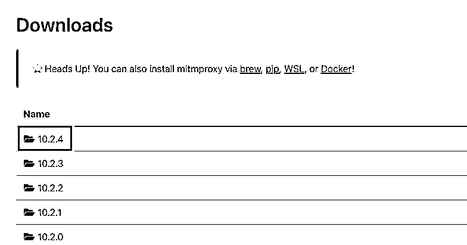

在这选择最新版点击即可，点击对应的下载链接即可进入下载界面。根据自己的操作系统选择对应的安装包,比如你的系统是64位的Windows,则选择 “mitmproxy-10.2.4-windows-x86_64-installer.exe”

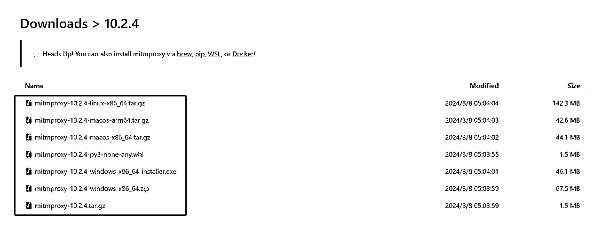

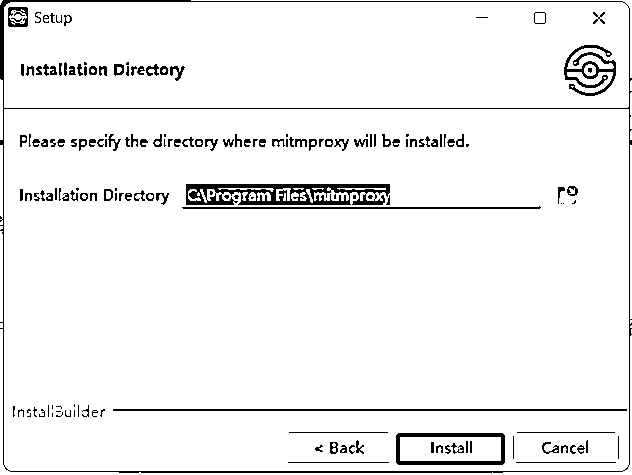

点击安装后,等待安装完成。默认情况下,mitmproxy会安装在"C:\Program Files\mitmproxy"目录下。

安装完成后我们启动mitmweb即可，启动后如下：

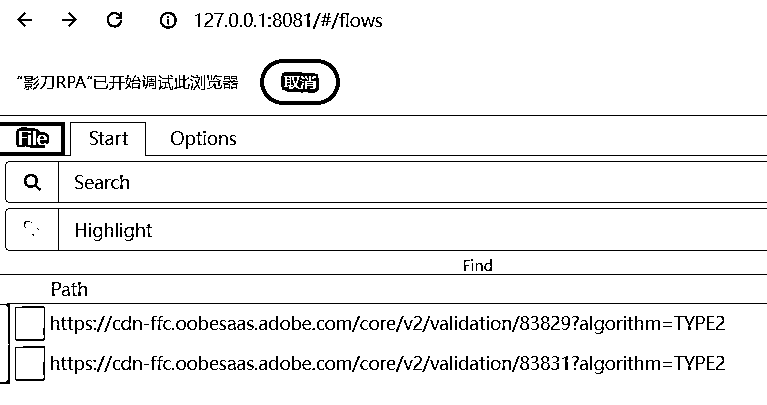

移动端配置代理

为了获取移动端应用的网络请求，我们需要将移动设备的网络请求转发到mitmproxy，所以我们需要进行手机端配置了，请确保手机和电脑连接在同一个WiFi热点下，这样它们就在同一个局域网内了。如果手机还有其他的代理类软件，都需要关闭，否则会影响 mitmproxy 的代理设置。

苹果手机

ios设备配置代理，在 iOS 设备上打开设置（Settings）应用程序。

1.  点击 Wi-Fi，并找到你所连接的 Wi-Fi 网络。点击网络名称旁边的 “i” 图标以查看网络详细信息。

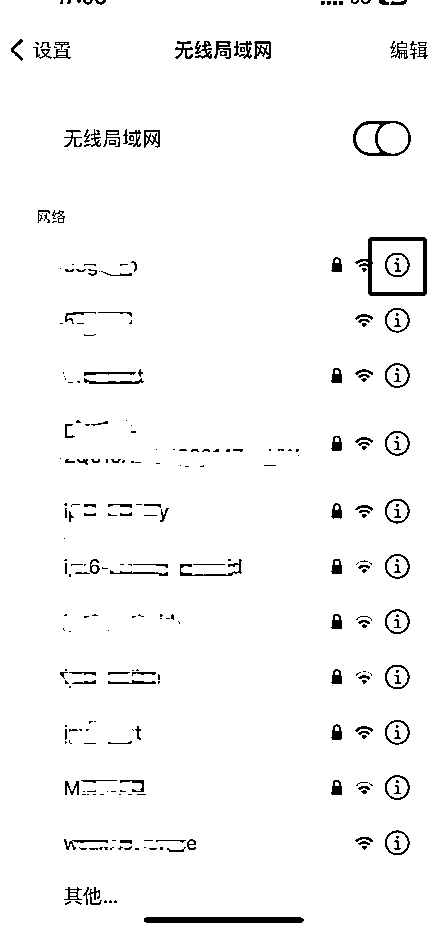

1.  在网络详细信息页面中，向下滚动并找到 “HTTP 代理”（HTTP Proxy）选项。选择 “手动”（Manual）。

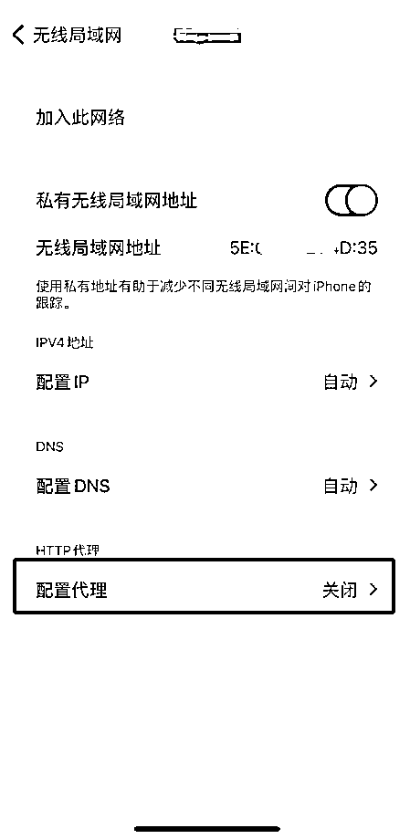

1.  在 “服务器”（Server）字段中输入第一步中显示的 IP 地址，并在 “端口”（Port）字段中输入 mitmproxy 的监听端口，默认为 8888。

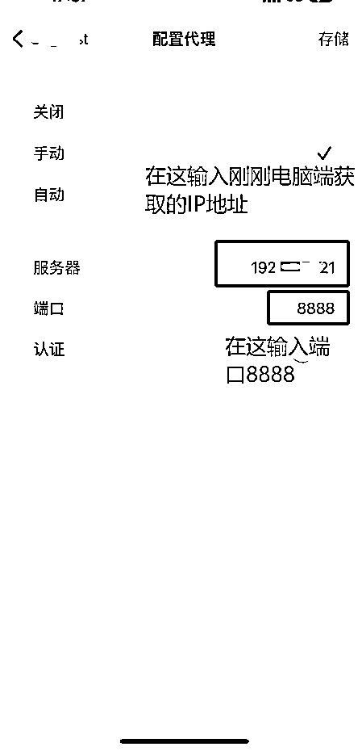

1.  保存设置，并关闭设置应用程序。

1.  使用苹果自带的safari浏览器输入http://mitm.it/进行证书的安装。

注意如果没有出现下载证书的页面，只有可能是以下原因

1.  检查第1-3步，是否设置了代理，并且确认是否和PC端为同一WIFI

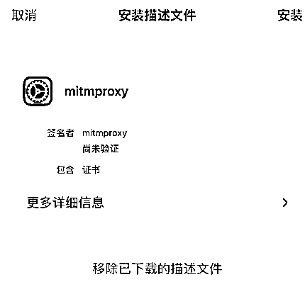

1.  关闭其他代理软件，如ss等科学网络工具

1.  前往设置 证书的信任设置： 设置 -> 通用-> VPN与设备管理 -> mitmproxy，点击进行安装

1.  安装成功后我们还需要信任证书，通用 -> 关于本机 -> 下拉到 证书信任设置 -> 找到mitmproxy点击开关信任。

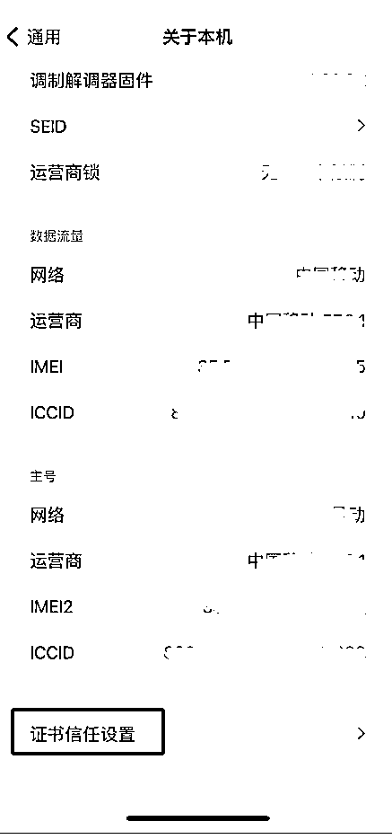

现在，你的iOS设备的网络请求将经过mitmproxy进行转发。mitmproxy会拦截并解析移动设备与服务器之间的所有网络请求和响应。你可以打开小红书应用进行笔记搜索，mitmproxy会自动抓取笔记数据。

以上步骤完成后我们打开小红书进行关键词搜索，这时候我们会注意到PC端已经可以看到小红书的笔记信息了。

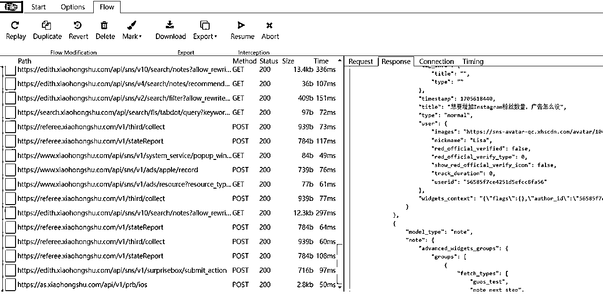

拿到了小红书的搜索笔记信息后我们发现是结构化的数据，所以我们要使用脚本把结构化数据解析后导出Excel或者飞书。我们直接把笔记内容发送给claude，让他写脚本对笔记内容进行解析即可，主要对话如下：

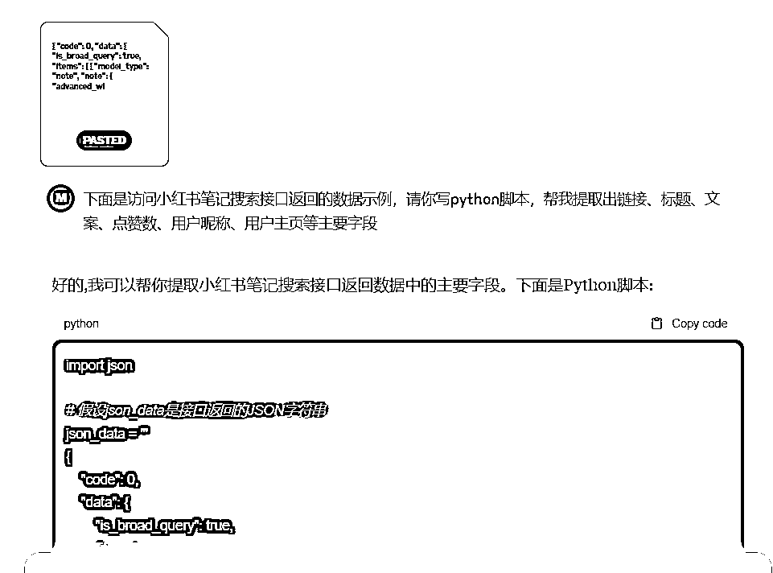

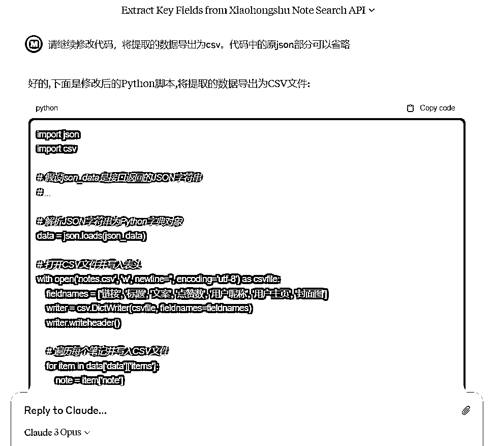

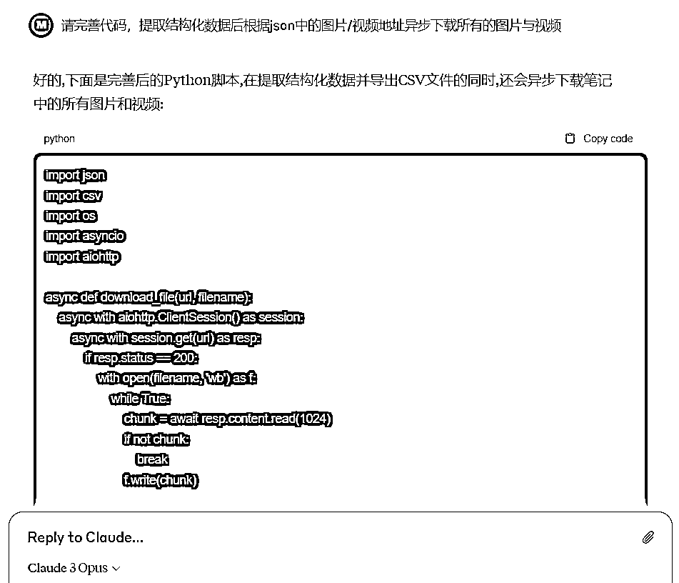

执行代码后我们验证下数据，根据对应的错误和预期进行对话调整与迭代即可，这里Claude Opus 完全可以解决所有问题。

最终所有代码实现的功能是：当mitmproxy拦截到小红书APP发送的笔记列表请求时，解析响应数据中的笔记标题、内容和点赞数等数据导出为csv，并且异步下载所有的图片与视频信息，采集后的数据如下：

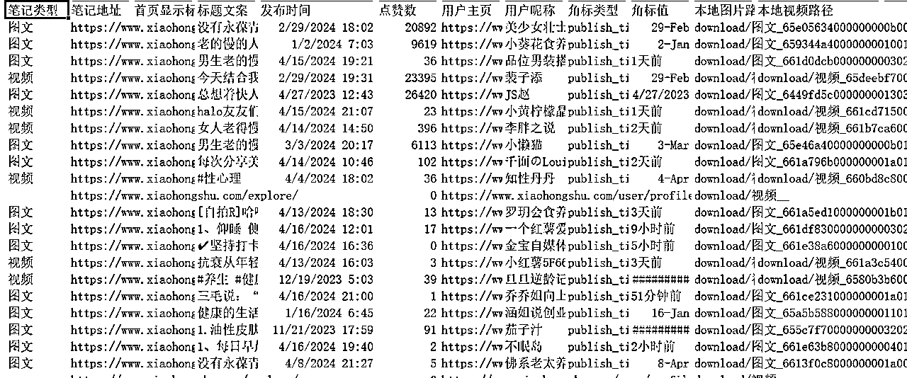

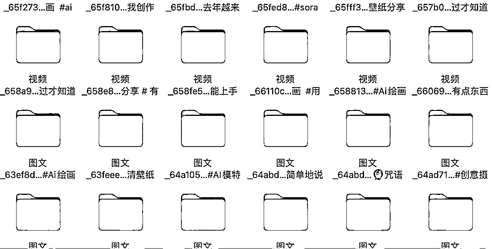

有了这个脚本，我们就可以启动mitmproxy，然后在小红书APP上搜索我们想要采集的关键词，滑动屏幕浏览笔记。这时，所有加载的笔记数据都会被脚本抓取并输出。记录了所有采集到的笔记的详细信息，包括笔记ID、发布时间、作者、标题、描述、图片/视频链接等字段，可以用于后续的数据分析。

通过这种方式，我们可以采集到大量优质笔记，为爆款对标分析提供了充足的素材。采集效率远超PC端。

通过手动滑动小红书的笔记页面，实测下来十分钟左右就可以采集到一千多条笔记数据。采集完数据后，在移动端将代理设置为自动，进行关闭即可。

注意：在配置好以上流程后如果我们更换了WIFI，需要重新进行配置，重复代理设置、下载证书信任证书等以上流程。

即使同一网络，重启电脑后IP地址也可能动态切换，IP地址变更后我们需要在手机wifi连接的代理处重新修改为新的IP地址。

当然，数据采集只是第一步，如何从海量笔记中挖掘有价值的信息才是更重要的。这就需要我们发挥创意，运用各种分析方法和工具了。相信通过不断学习和实践，我们一定能够从数据中找到属于自己的独特见解。

以上就是我在小红书APP端进行数据采集的一点心得，希望对大家有所帮助。