# 深耕私域10年，创收8位数，掌握5步3力，跑通私域闭环，业绩稳翻番！

> 来源：[https://w191e236q6t.feishu.cn/docx/CiVadxhB0ojxB7xsdxTcehPanqe](https://w191e236q6t.feishu.cn/docx/CiVadxhB0ojxB7xsdxTcehPanqe)

hey，我是清一，这是我加入生财有术的第二年，也是我跑通知识付费从0~1，转向1~100的一年。

有很多圈友看过我抖音团购、口播教程的帖子，在前几年里顺带做的副业也因为生财这个圈子翻到了10倍营收。

今天要给大家分享的是我的主赛道，也是我14年就开始做的事，即私域营销。

当然这篇文章除了带来我的成长故事，也会给大家分享我从微商创业者到私域内训师，再到独立成为一个私域教练的【私域运营心法】

看完这篇文章，你可以掌握私域的破冰技巧、理解私域成交核心、读懂私域的底层逻辑和基础模型、同时结尾也给大家分享了如何拿下5位数的B端内训合作谈判技巧，后期想发展到做B端生意的朋友必看。

在正文开始前，先做个简单的自我介绍：

•从0到1培训私域带货团队，日销100w

•带领1300+学员，跑通私域变现闭环

•创建300+高转化培训招商社群

•前TOP级私域电商平台商学院负责人

•国家中级人力资源管理师，5年内训师

这次分享，我将从以下几方面为大家详细讲解。

一、高中入局微商创收200w，解锁初级私域玩法

1、新私域：【人】是客户关系的递进

2、新私域：【货】是成交产品的递进

3、新私域：【场】是销售场景的递进

4、私域的核心是【建立信任】

二、大学2个月赚了16w，掌握成交秘法

1、私域成交黄金三步1：人设培养

2、私域成交黄金三步2：关系升级

3、私域成交黄金三步3：销售成交

三、从0~1搭建私域商学院，玩转私域运营

1、五步私域闭环1：确定私域定位和目标受众

2、五步私域闭环2：制定私域运营内容策略

3、五步私域闭环3：打造精准引流获客渠道

4、五步私域闭环4：培养朋友圈和社群运营力

5、五步私域闭环5：深化私域关系转化高价值

四、带领1300+学员，跑通放大私域业务盘

1、内容力

2、运营力

3、转化力

五、从C端陪跑教练，到TOP级品牌100w+私域内训陪跑师

1、B端合作特点，内训决策链路长

2、B端消费特点，刚性需求的理性采购

3、B端服务准则，时刻谨记“定向”

接下来，我们正式进入本次分享：

# 一、高中入局微商创收200w，解锁初级私域玩法

大家对微商兴起的那些年有印象吗？

在2012年——2015年期间，铺天盖地的广告，qq空间、微信朋友圈，全都是微商！

那时候有很多的草根创业者，通过微信或者QQ进行商品的销售，比如美即面膜、俏十岁等等，跟风入局者也很多，比如我家人，那几年就开了一家线下的美容院。

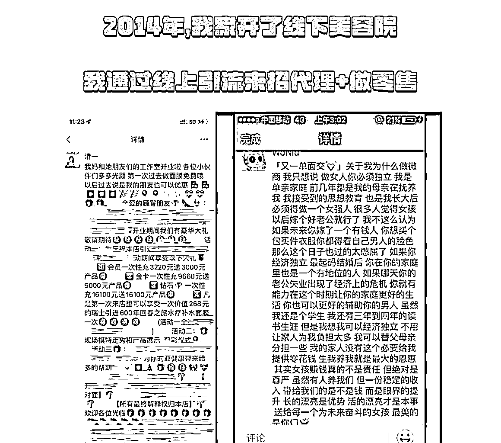

在本地，我们做朋友圈的营销裂变，把用户带入门店，通过服务来带动产品的销量。

在线上，我利用我舞蹈演员的身份，拍摄舞蹈演出日常发布在美拍微博等渠道，引流用户进我的QQ来招代理。

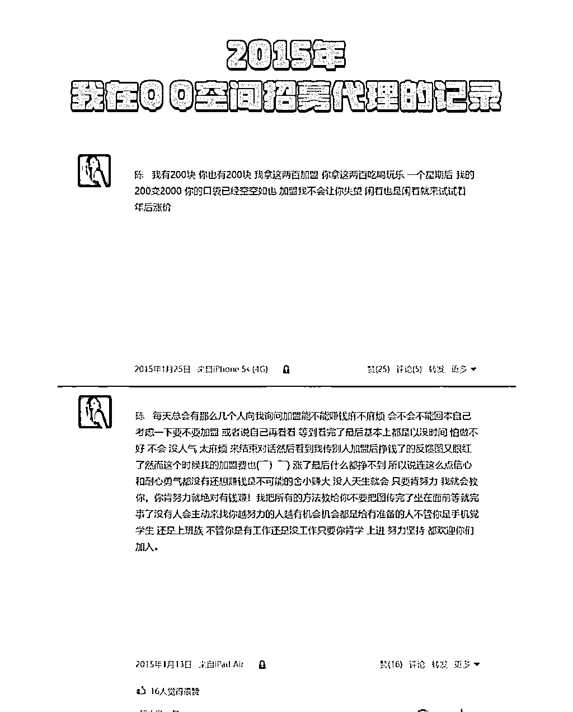

那个时候代理费是200，活动价是180。相比较很多需要囤货大几万的微商品牌来说，我家真的非常良心了，达到固定的销售额，我们还会退还这个加盟费。

所以在14年-15年期间，我给我家里的产品招到了全国200+的代理，年销量200w+。

我们可以看看早些年的微商都是什么样的？

在这里我先给大家看看我14-15年的营销朋友圈～

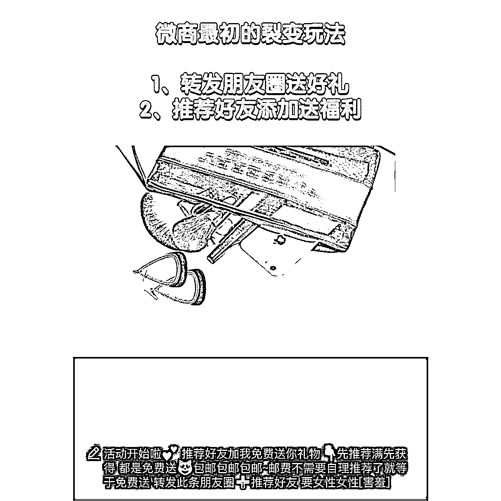

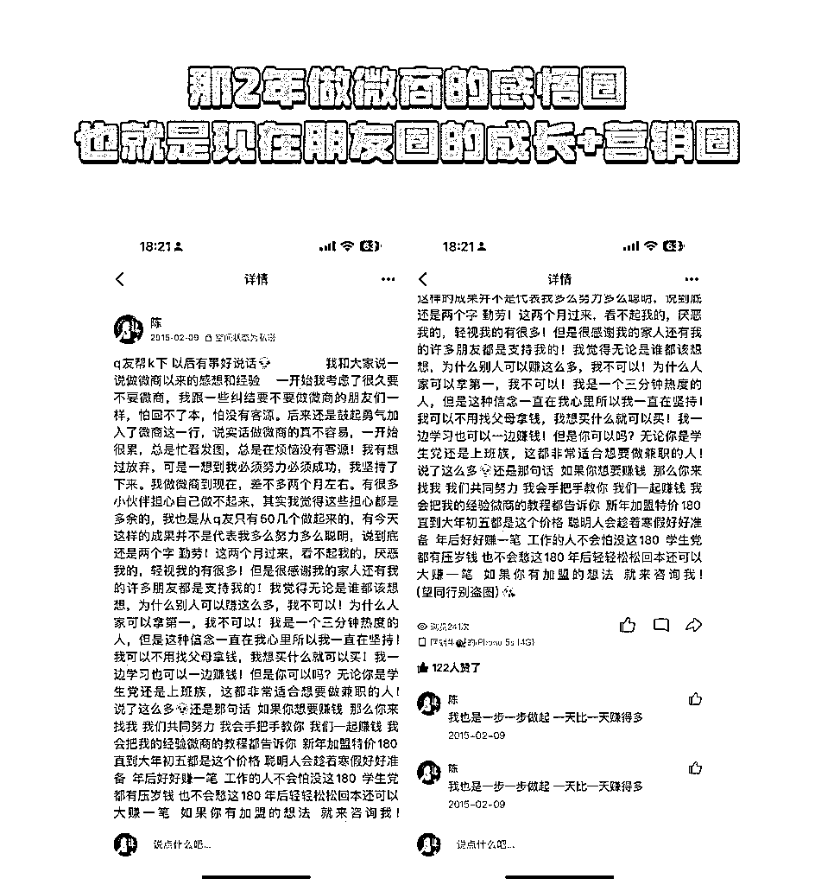

这就是私域社交电商最初的形态，朋友圈都在疯狂刷屏，很多微商也在营销做起了加盟。

在那个野蛮生长期，你想要入局微商，就要成为某个品牌的代理，进行囤货，你才能拿到一个较为优质的货源，像我那个模式，只需要200块就能拿到代理权的还是少数。

但是大家发现了吗，类似的文案，类似的营销玩法，放在2014年，很管用，效果很好，但是换到当下的私域生态，就不管用了。

为什么？因为私域进入到了，精细化运营的年代，老的那一套微商玩法，用户已经不吃这一套了。

在看2020年，疫情来临以后，又有大批的人入局微商，当年鄙视微商的，都活成了微商。

我之前在头部的社交电商行业做私域内训，我最清楚不过。

我前公司在2020年，业绩又迎来了一个新的高峰，每天注册平台代理权限的有大几十万用户。

其实大家会发现，只要微信还在，微商就不会过时，只要人和人之间需要链接，私域就会永远存在。

所以微商没有消失，只是不断优化成了人们喜欢接受的方式罢了。

如今是2024年，新私域元年，现在做私域，讲究的是“人货场”，那究竟什么是人货场？

【人】是客户关系的递进

【货】是成交产品的递进

【场】是销售场景的递进

## 1、新私域：【人】是客户关系的递进

从旁观者，到关注者，到购买者，再到使用者，传播者，销售者，这是对于“私域用户”的不同定义，不同的人在这个场域里的转化要素是不一致的。

一个路人，从跃跃欲试的围观你，到成为你的铁粉对你欲罢不能，再渐入佳境成为了你的核心用户，再到愿意为你分享，给你带来源源不断的收益。

这其中要做好的，就是客户关系，通过私域这个场景，打造独一无二的客户关系，收获客户的私心，在这里，要做好的就是朋友圈的运营和私聊的转化。

## 2、新私域：【货】是成交产品的递进

以前做微商，从零售到转化成会员再到转化成代理，和我们现在做私域的底层逻辑其实是一致的。不同的用户、不同的关系、匹配不同的产品。

比如引流品，就是用来激发用户的兴趣，拿到信任达到转化。再比如裂变品，类似于现在的很多社交电商平台，比如近期爆火的xka、去年的快团团等等。

那还有利润品，就是具有高利润高复购的特点，但一般不是首次成交的产品，是需要超强信任才会产生购买的产品，但也是主要收益来源。

到了如今这个年代，无论你是带货、知识付费、还是线下线上的定制化产品。都要设计一套合理的产品体系，让用户买一次还会买第二次第三次，只有这样，距离我们1000个铁粉才会越来越近。

## 3、新私域：【场】是销售场景的递进

再来说说销售场景的递进，在一个用户跟你第一次相识的时候，一般都是通过引流进入你的私域。

这个时候她的第一个关注点就是你的朋友圈，通过你的朋友圈来给你打一个初步印象分。

如果你的朋友圈打造的好，她就自然而然对你放下一切防备，如果你的朋友圈打造的不够优质，那可能从加到她的那一刻开始，也是你失去她的认可，这就是朋友圈的“偶然邂逅”。

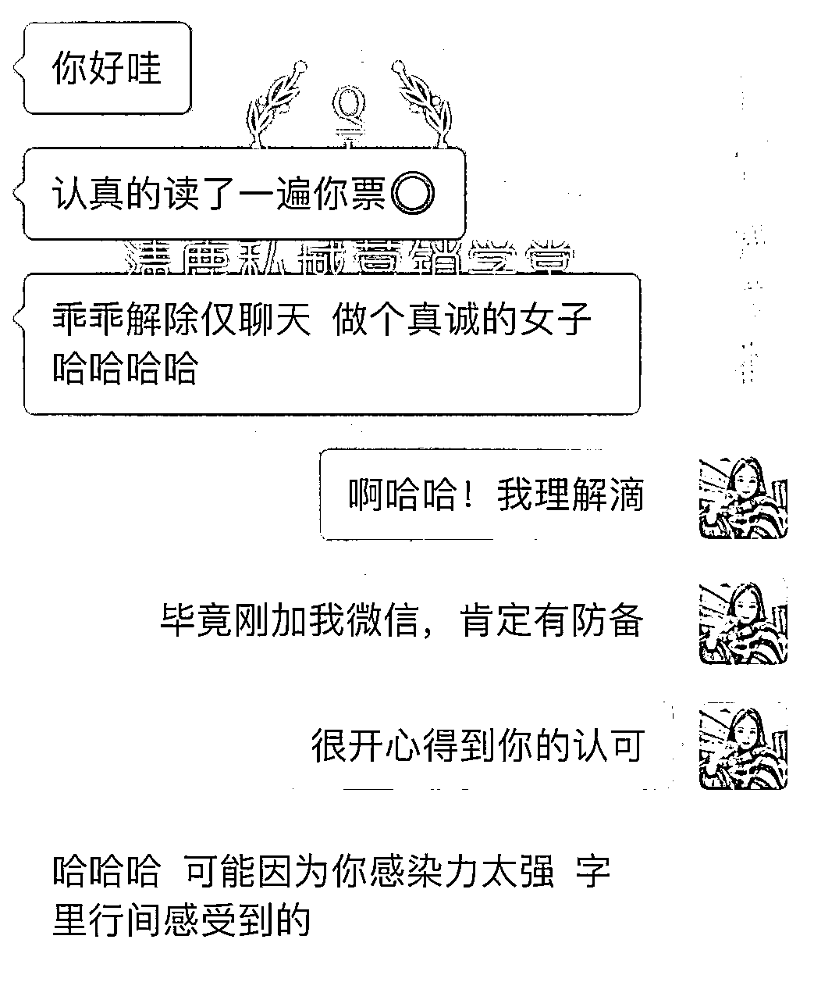

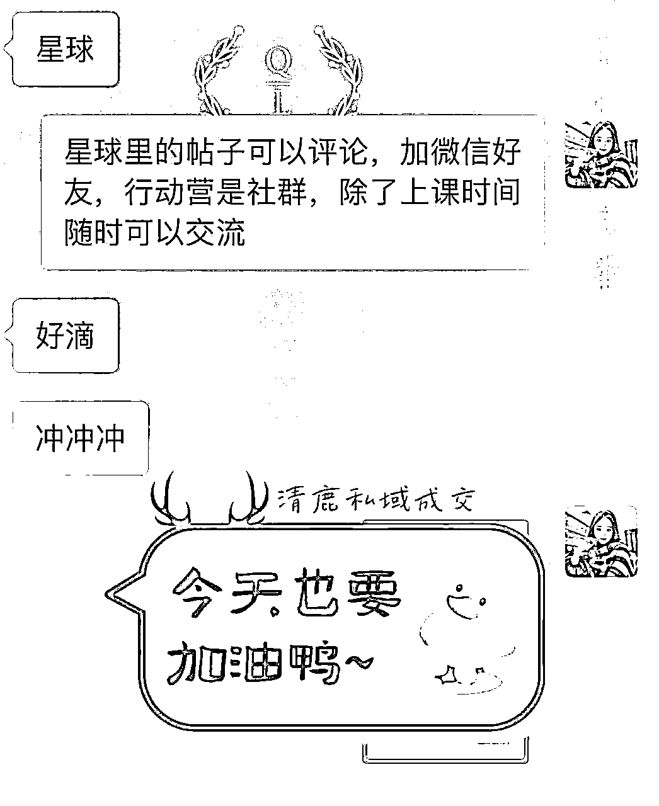

看我这个客户，从小红书加的我，看了我的朋友圈觉得我的感染力很强，马上卸下防备，最后半小时就实现了第一个引流品的成交。

那有了第一次的消费以后，就是“再次光临”，这里要做好的就是我们日常的朋友圈营业和私聊的客勤维护以及社群内的运营动作。

怎么样让这个用户产生第二次的购买，同时消费客单价更高的产品呢？一定是要给到足够的价值，把你的实力、魅力，通过这些渠道传递给用户。

再到后续的经常购买、一生相随，那就是要和客户做朋友，得到客户的“私心”。

讲完了【私域人货场】，大家能理解了吗？私域的核心是什么？

## 4、私域的核心是【建立信任】

无论你是做线上生意还是线下服务，我们的获客方式都是人找货，或者货找人，只有这两种。

那优惠券、推销、渠道、异业合作互推等等，都是我们主动的去触达消费者。

私域本身是没有流量的，通过以上货找人或者人找货的方式，你的私域会有一定的流量，那这些流量能不能通过运营手段留住并且产生多次消费呢？在众多同行里，客户为什么选择你，并且只认准你？

这一切的一切，就看你的私域有没有做到合理的温度运营，只有有温度的私域，好的内容结合对的运营模式，你才能真正的留住客户。

那具体该怎么做呢？下面的内容，我会结合自己的经历和清鹿的私域模型来给大家细细的拆解。

# 二、大学2个月赚了16w，掌握成交秘法

15年的下半年，我开始上大学了，像我这样妥妥的“事业脑”，是不可能安心读书的，看到赚钱的机会我的双眼就会发光。

那时候我去学习了设计，因为我想，如果我能设计出更加好看的图片，更加有吸引力的海报，这一定可以助力我的线上生意，可以赚到更多的钱。

但很可惜，我设计没学好，进了这家培训机构，老师常常给我留学指导，她说我设计出来的海报几乎没有美感，可以称为【丑图制造机】。

但在这几次留学的过程里，我了解到了，这家机构是有转介绍奖励的，转介绍一个学员我就可以拿到一定的佣金，这真真让我心动了。

这么好的教学质量，我不争气是我不争气，那是我没天赋不代表别人没天赋，要是我能把这样的学习机会介绍给其他人，我不仅赚到钱，也能让真正想学习设计的小伙伴少走弯路。

紧接着，我就开始行动了...

先来说一下那两个月我的成绩，转化100w+，拿到了16w的佣金。

我从杭州各大高校的贴吧引流，告知大家，添加我的微信，我会送一份设计手册，并且我这边有免费的试听课可以学习。

同时我笼络了一批同学来帮我发帖，每发一个贴我给1块钱，一天能发50几个帖子。

再通过私域的1v1私聊筛选，我带着这些用户去线下听免费的课程，同时辅助机构的老师来做转化成交。

在这2个月里，我掌握了私域的成交秘诀，这个秘诀直到现在我还在持续的使用，并且给我带来了很多高客单的转化。

今天，我也毫无保留的分享给大家，做高客单的小伙伴，这一环节，请一定要认真听。

我把它分为三部分，称为【私域成交黄金三步】

## 1、私域成交黄金三步1：人设培养

当一个新的用户粉丝添加到你，你的破冰方式是什么？发送大段自我介绍，还是直接告知对方你有什么产品可以供他消费？

在这个期间，一个陌生人，对你不够了解，并且对你的人设你的性格特点毫无所知，你发送大段的自我介绍或者发送你的产品信息，结果都是被屏蔽或者被打上一个卖货人的标签。

在这个阶段，你给用户介绍产品没用，介绍你自己只需要讲清楚你能提供什么帮助即可，同时挖掘出客户存在的问题。

比如当时这批想学设计的用户从贴吧找到我，我送了免费的学习资料以后，一定会说自己这边有免费的线下课程可以听，会讲ps的基础使用，没有隐形消费，这节课完全免费。然后我会问客户，为什么想学设计？是有就业需求？还是个人喜好？

在这里一般的用户都会给答复，然后我会从专业的角度出发，告诉他学设计这件事以后有哪些就职方向，现在的就业环境市场薪水是多少，以及什么样的企业是需要设计这个岗位的。

当然，这些我都在这之前做过详细的调查，所以能做到张口即来，在这个阶段用户也会对我产生初步的信任，这就是人设培养期。

## 2、私域成交黄金三步2：关系升级

这里就是通过一些步骤，去升级我们和用户之间的关系。

来线下听免费课，万一我是诈骗可怎么办？万一来了有隐形消费可咋整？毕竟骗子横行的年代，谁都会在心里上一层厚厚的防备墙。

所以在我的朋友圈里，我会经常发自己在哪个大学学习，我的真实生活、照片，我的日常，而且在和他们交流的这个环节，只要用户愿意，我就采用语音交流。

同时，我会给她们的朋友圈进行点赞、评论，并且给免费的咨询帮助，结果见证，让双方的关系慢慢进入到一个相互信任的稳定阶段。

## 3、私域成交黄金三步3：销售成交

最后就是我们的产品成交期，在以上的信任积累下，很容易就可以把用户邀约到线下来听课。

因为对方对我已经有了一个基本了解，并且有一定的信任度。那只要他是有这个需求的，我就是他的第一选择对象，他就迟早会被我成交。

来到线下以后，基本上来了就能成交。

在整个成交的过程里，如果没成交，对方又是明确需要的，那就是信任度不够。

千万不要在用户刚加上你的时候就去卖，这会让你在朋友圈里所做的努力全都白费，被打上一个【营销人】的标签。

私域的高客单转化其实是很丝滑的，我们从加上用户微信的那一刻里，就要做好每一个细节。

每一次的破冰，都是一次温情输出，每一次的咨询，都是耐心负责的解答，到最后交钱的时候，用户就没有多余的疑虑，一百个放心的把自己和钱交给你。

只要严格按照前面三个步骤去做私域的转化，你的产品转化率一定会大幅度提高。

听完这一段回去以后，大家可以好好检查一下自己的破冰、咨询、转化，有没有认真的做到位呢？

是不是已经发现了自己转化率低的原因？

好，我们继续往下聊，下面来说说，我是怎么成为头部社交电商平台的私域商学院负责人，又是怎么的带领1300+学员实现私域变现的。

# 三、从0~1搭建私域商学院，玩转私域运营

大学毕业后，我做了一名培训师，从就业培训做到了私域商学院总负责。

这些年，通过私域零零碎碎的赚了不少钱，比如有些小伙伴知道我给我的老东家做转化，连续两年破纪录，把转化率从65%做到了95%。

圈里很多老朋友是从我的口播作品关注到我的，从小红书口播引流到私域转化，复购率做到了80%。

我想，做私域，成为一名真正的私域培训师，是我想要发展的方向，说真的想做知识付费的这个心在我大学时候就埋下了，这些年确实也一步一步地深耕努力实现了。

刚到这家公司的时候，我就被带上了一个【百万私域社群操盘手】的称号，谁懂呀，虽然我做过微商，做过高转化的产品，但是这样的身份还是来的让我措手不及。

在那些年里，我真正做到了手把手赋能，实打实的深入一线做私域。我研究了豆瓣怎么引流、地推怎么做、小红书的壁纸头像引流玩法、小红书的带货引流玩法，微博快手的副业粉引流，还有招商项目群的成立，私域的裂变操盘。

然后从0-1的，我开始产出不同的私域课程，从定位、朋友圈、引流、私聊、转化、招商，把我积累的所有技能，通过社群图文分享、直播分享，全部赋能给前公司的代理商们。

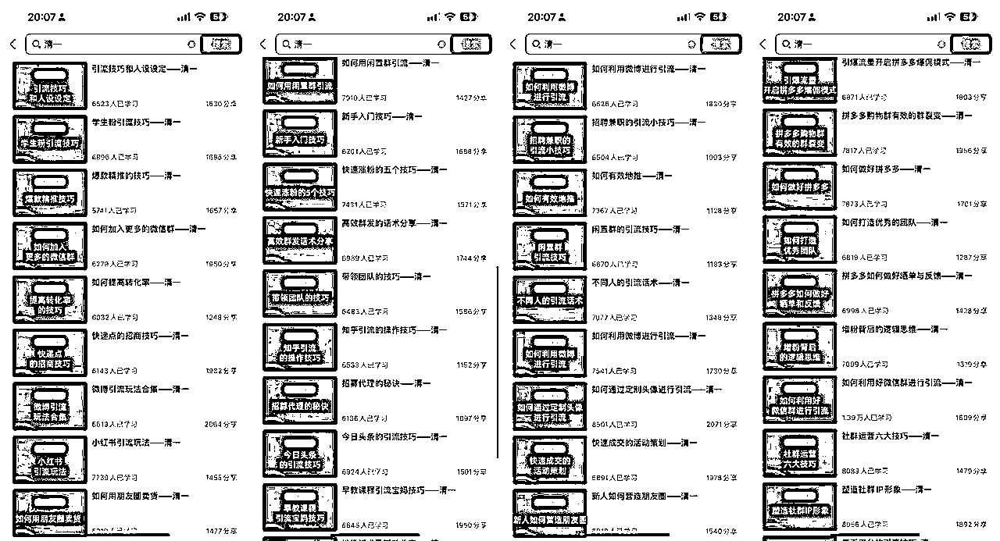

这些年做过的课程如图，这只是其中的一小部分，后来还带了两个0~1的项目培训。

通过这些年至少创收8位数的私域带教经验，我梳理并沉淀了完整的私域运营闭环，也是我们清鹿私域学堂的赋能体系，以下我要说的私域5步运营技巧，大家做好笔记。

未来在你们做私域的过程中，无论遇见什么样的卡点，都可以在这5步里，找到解决思路。

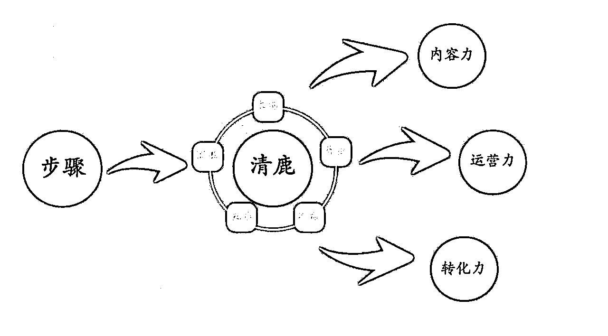

## 1、五步私域闭环1：确定私域定位和目标受众

-分析品牌特点及优势，明确私域定位

-确定目标受众群体，了解用户痛点

在清鹿私域运营体系里，最基础的原则一定是：想要放大业务，就得先做私域，再做公域。

私域都没做好，引流来大把用户也接不住。所有，一定是先在私域跑通闭环，再去公域做引流。

这个顺序不能错，一旦错了就会出现定位和内容不匹配，引流来的人和你的产品不符合，最后白白浪费流量。

那如何做好精准的定位呢？秘诀就是：找到那个“我喜欢、我擅长、能变现“的优势。

### 1）我喜欢

我喜欢，这个好理解，我们每个人都有喜欢做的事，有人喜欢养花、有人喜欢养狗、有人喜欢下棋、有人喜欢爬山，有喜欢静的，有喜欢动的。

比如我6年纪就喜欢自己给自己在QQ空间留言，特别爱说话爱表达，做这事儿我就是有源源不断的动力，且比别人做的好一些，所以我毕业后就选择从事了培训行业，做到了私域培训师。

可以想想你会乐此不疲的干，没有报酬也愿意干，比如你愿意跑步，没有人监督你，也没人给你发工资你也会一直做，别人看起来你是在坚持，非常有毅力，而自己却不是这么认为，而是认为不早起跑步就难受。

### 2）我擅长

擅长呢，就是你不用特别努力就比一般人做的好，比如出镜做口播，大多数人的镜头变现力都是不太好的，但你平日就很喜欢拍照，特别适应镜头，也特别喜欢在聚光灯下。

面对别人手里的相机也可以淡定自若的摆出一套拍照姿势，那说明这就是你擅长的领域，是你天生就要吃这碗饭的。

找到自己擅长的事，我们就可以事半功倍，做起来更容易，需要克服的阻力更小，也更容易拿到结果。

### 3）能变现

这一点就很好理解了，我们喜欢也好、擅长也好，如果不能变现，那我们做起来就少了一个重要动力。

而我们做私域的最终目的，就是要变现的。所以要想想自己选择的这个方向要通过什么方式进行变现？

可以是公域引流私域进行成交变现，也可以是直接卖货、卖课变现，当然也可以接广告变现，还可以通过打赏等多种方式变现。

无论是哪种形式，我们要进行提前规划和设计，比如你可以展示自己的技能，为粉丝提供服务进行知识变现，也可以为粉丝提供商品卖货变现，也可以教其他人做短视频自媒体技能变现。

确定明确的私域定位和目标受众后，我们才能去做具体的私域布局规划。

## 2、五步私域闭环2：制定私域运营内容策略

-确定关键主题和内容类别

-创作高质量、有价值的内容

确定好自己的定位之后，就要决定输出公域和私域的内容，也就是私域运营的内容布局。

确定内容的定位，也就是你要创作的方向。

所有的定位都是为输出准备的，你要找的肯定是适合你产品、你的目标用户感兴趣的内容，否则都是牛头不对马嘴，输出再多也没用。

比如说，你是做母婴的，全都是宝妈，宝妈会喜欢什么内容，宝妈都是什么年龄段的

比如说，你的朋友圈里都是独立女性，独立女性喜欢什么？喜欢让人成长的东西对不对

在比如说，你的圈里都是爱珠宝的爱打扮的，是不是可以分享一些变美的技巧，从杂志上去获取一些穿搭的，时尚的信息来编写。

确定你要分享的领域，是生活的，还是副业的，还是护肤的，还是养生的，还是健康管理的。

要确定你的内容风格，每个人都有适合自己的表达方式，在这里一定要找到适合自己的表达方式。有些人就是适合录视频，适合发语音，有些人就是做图功夫很好，总是可以做出让人赏心悦目的图片。

运营者在定位内容领域及内容风格时需要注意，内容领域应尽量垂直，内容风格应尽量鲜明，这样才能帮助你的用户快速建立起对你的认知。

做好基本内容布局，确定关键主题和内容类别，创作高质量、有价值的内容。

## 3、五步私域闭环3：打造精准引流获客渠道

-确定高质量引流钩子

-吸引精准用户，助力高效成交

私域的命脉还是流量，没流量再好的内容也没法有转化。

你要保证每天的内容输出，保证新的用户加入，保证和用户之间的交流。

这个问题的本质，就是如何找到精准的流量来源，或者说，如何选择我们的引流渠道？

我们经常把流量称为鱼，你要有鱼饵，你要有池塘。所以渠道，就好比是池塘，里面有小虾米，但是也有大鲤鱼，你选择什么样的工具，付出什么样的努力，都会决定你钓到的鱼的品种以及数量。

在选择渠道上，除了要考虑池塘（流量池）的大小，还要考虑鱼（受众人群）的饥饿程度，以及你的鱼饵是不是她们想吃的。

假设，一款母婴产品让我去思考我的引流路径，我会怎么做？

首先，回到产品本身。母婴产品，这一类的产品都要打动什么样的消费者？

她们大概都在什么年龄阶段？

这个产品是自用比较多还是送礼比较多？

适合多大的宝宝？是什么样的价位？

思考好这些问题，其次才是选择渠道的问题。

比如美柚app，宝妈的交流社群、或者豆瓣宝妈小组、或者小红书等等。

如果说你是从0开始，之前都没有做过引流获客等方面的工作怎么办？

最快的解决方案就是测试，用较小的成本和比=较短的周期，来对渠道进行测试，然后再根据数据来放大规模继续做，最终找到一个适合自己的，最有价值的获客渠道。

但也不是说所有的渠道都是很稳定的。比如我前几年做小红书的时候，引流确实比较容易，官方的管控也不是很严格，但是到了今年的话我感觉就比较艰难，需要用更多的数量和更高的质量去对抗平台的算法机制。

在这期间，一定要做好数据的积累，保持数据的敏感，就像之前郑韩老师分享过的，一个表格，里面记录了每一条作品的数据，引流情况。

只有这样才能应对一些平台规则的变化，保持用户的增长速度和增长数量。

## 4、五步私域闭环4：培养朋友圈和社群运营力

-落地私域全流程SOP

-精细化运营，成交毫不费力

当有一定的私域流量后，就要提升你的朋友圈运营能力和社群运营能力，好的内容必须配合好的运营动作，才有可能实现更深的用户链接，才能多角度多方位的触达你的目标用户，为转化助力。

在这里，我们要明白，朋友圈和社群几乎是私域转化的主阵地，做的好可以直接让你的私域成交翻倍增长。

就拿私域运营主场地朋友圈来说，做好基本日更是关键，但很多朋友遇到的难题都是，我知道要日更，但具体怎么更新呢？思考清楚以下3点即可。

1、为什么发？

2、发给谁看？

3、要发什么？

这个框架是不有点眼熟？没错，就是3w黄金圈法则，源于西蒙·斯涅克 《从“为什么”开始》的底层逻辑式思考法。

在《高效能人士的七个习惯》中，也有提到过类似的逻辑，名为“以终为始”。

原文中指的是，在做任何事之前，都要先认清方向。这样不但可以对目前处境了如指掌，而且能不至于在追求目标的过程中误入歧途，白费工夫。

那在朋友圈文案中的底层逻辑“以终为始”，就是在动手写文案之前，先要思考清楚，我为什么要发这条朋友圈？目的是什么？具体写给谁看？写什么内容？

我们常发的朋友圈，大概可以归结为三大类型：

产品圈，产品营销，主要是产品、业务营销相关内容，目的大多指向成交。

人设圈，成长认知，主要是思考类与成长类内容，有助于IP人设的打造。

生活圈，日常琐碎，主要是日常生活点滴分享，可以拉近与用户之间的距离。

可以将这3类内容，结合3大基础问题，沉淀为朋友圈日更SOP：

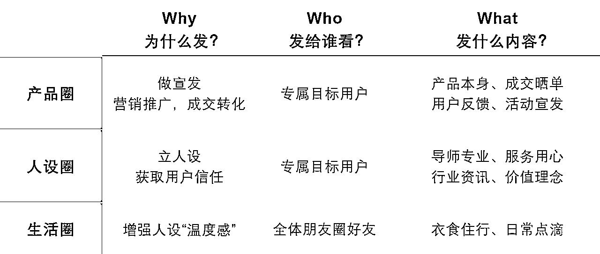

再具体到对应的时间点，比如你计划的是日更3条，那就是早中晚，如果是5条或者更多，结合具体表格，就能沉淀出一套详细的日更sop，有效避免断更。

类似的SOP也包括社群运营、私信破冰等，落地私域全流程SOP，做到精细化运营，成交才能毫不费力。

## 5、五步私域闭环5：深化私域关系转化高价值

-打造高粘性私域IP

-培养1000个铁杆粉，变现无忧

成交，仅仅是销售的开始。

做私域的目的，是为了让一个客户反复的成交，并且给我们带来持续的转介绍。

重视客户的终身价值，即客户一辈子为品牌所贡献的所有价值回报的总和。

它主要是由三部分组成：历史价值、未来价值和推广价值。

举个例子：我每天要喝一杯瑞幸，一年就是365杯，一天10块钱，一年就是3650块钱。

如果按照乔·吉拉德的“250定律”即一个顾客一生中可以影响身边250个人的消费决定。

虏获这一个顾客，就能带来250个顾客；得罪这一个顾客，也就意味着得罪了250个顾客来计算，如果我影响了250个人一起成为瑞幸爱好者，那么他的终身价值又将放大250倍，达到4500万元。

在这里我们要做的，就是把体验感做到极致。

私域就是“心域”，跑赢对手的核心在于，有没有创造超出预期的服务。

多数产品现状：产品同质化，服务一般，说不上哪里不好，也说不上哪里好。

极致的体验感。不仅要好，还要极致的好，好到让人印象深刻，好到不选择你都对不起自己。

这已逐渐成为企业“厮杀”中越来越重要的武器，也是现在知识付费越来越多的体验课、试听课、公开课兴起的根本原因。

比如公开课的本质也是引流裂变。用一场高质量的公开课，给到大家不一般的感受。

极致的体验感分为两部分：一部分是产品本身的体验感，一部分是服务的体验感。当然，很多时候两者是一起呈现给用户的。

所以，不断收集用户的反馈，不断迭代你的产品，学会用户思维去沟通.

微信不是营销工具而是获取和维护人际关系的沟通工具，对每一个用户都要做到高度重视，毕竟“好事不出门，坏事传千里”。

用极致的服务来提升用户的体验感，让他们成为忠实粉丝，以创造更多的终身商业价值。这是我们做私域的最终目标。

# 四、带领1300+学员，跑通放大私域业务盘

从去年到现在，我已经实打实带领1300+学员，通过私域高效放大业务盘。

这里直接上反馈案例，用户的证言一定是最有价值的也是最值得大家看的。

“短短1个半月，副业收入过万”

“学了清一的社群课程，单月佣金6000”

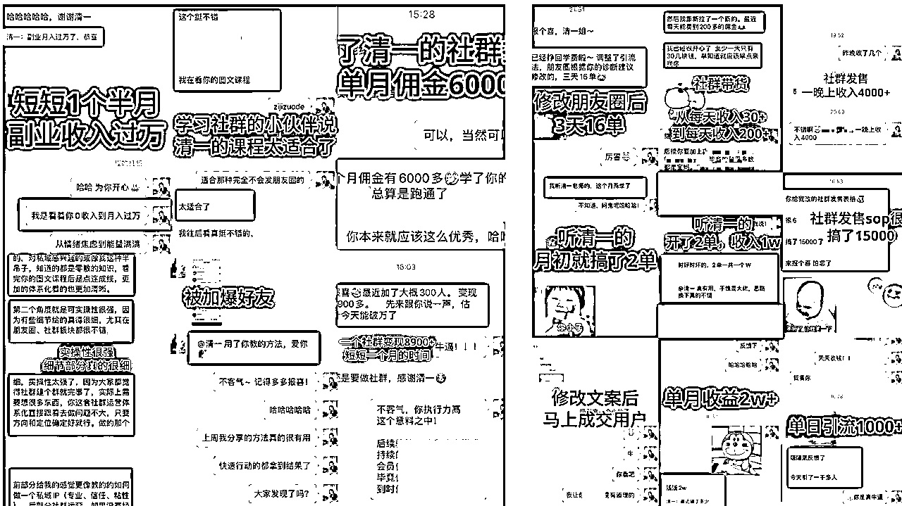

这一部分，是我去年刚开始做自己业务盘的时候第一批用户给的反馈，到现在，我们的反馈已经积累到没办法全部汇总的地步。

并且去年，我自己延伸的一个业务盘【抖音团购】也通过私域的发售玩法，3个月实现了10倍增长。

这些拿到结果的案例都在证明，清鹿私域模型的绝佳可行性。如果你的私域目前还有点模糊，就可以对照这5步自查一下。

在解决完以上的路径规划之后，所有的动作都落在哪呢？

落在了内容上，运营上，转化上。所以再来给大家讲讲，这5步都实现了以后，我们最终要持续打磨的3力是什么？

那就是【内容力】【运营力】【转化力】

前阵子我发了一条朋友圈，我说： 有什么东西可以跨越时间和空间进入一个人的大脑，并且让人印象深刻的？

这种东西大致分为两类，“刺激之物”和“启迪之物”，做私域，这两类我们都要。

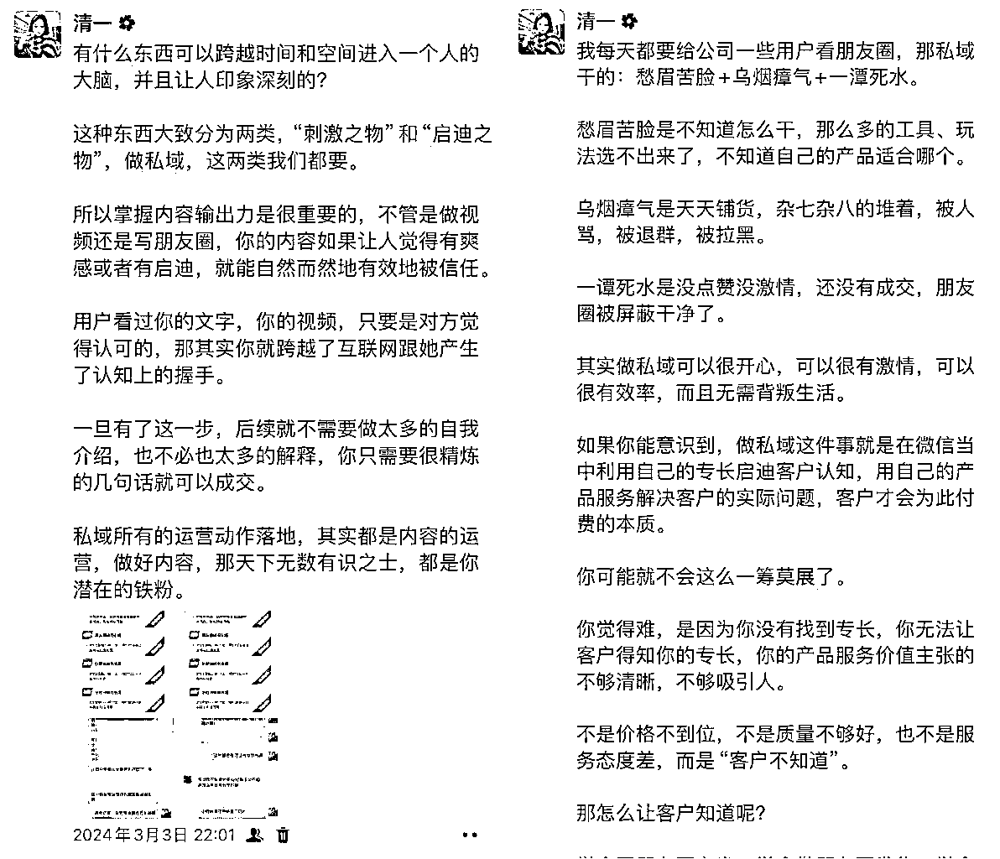

所以掌握内容输出力是很重要的，不管是做视频还是写朋友圈，你的内容如果让人觉得有爽感或者有启迪，就能自然而然地有效地被信任。

用户看过你的文字，你的视频，只要是对方觉得认可的，那其实你就跨越了互联网跟她产生了认知上的握手。

一旦有了这一步，后续就不需要做太多的自我介绍，也不必也太多的解释，你只需要很精炼的几句话就可以成交。

所以，私域所有的运营动作落地，其实都是内容的运营，做好内容，那天下无数有识之士，都是你潜在的铁粉。

那只有好的内容，结合对的运营姿势，才有可能实现高转化。

这3点做好了，我们才能牢牢抓住用户的心。好的运营，好的内容，好的转化是会培养用户的“规律”和“习惯的”。

举个例子：

我和小鹿老师打造的【清鹿私域俱乐部】，我们每个月都会进行打卡活动，引流打卡、朋友圈打卡、实战答疑等等，这个过程其实就是养成了用户的习惯。

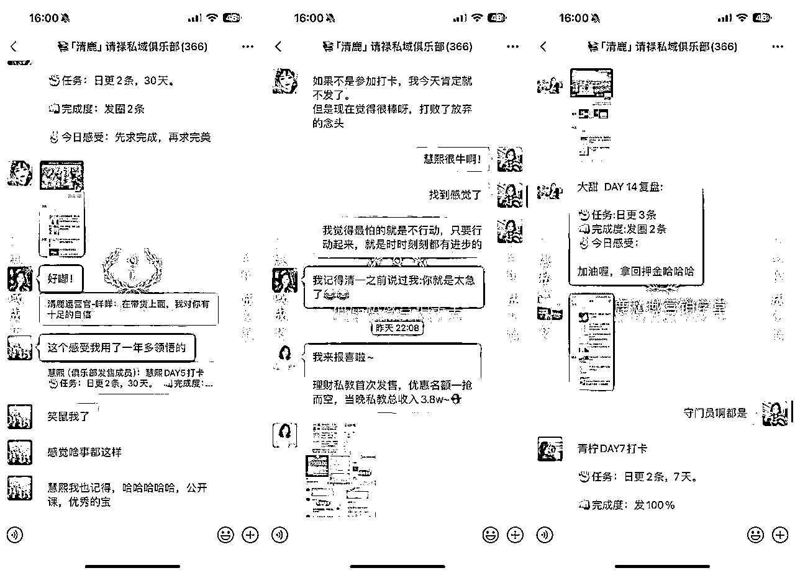

每一个参与打卡的小伙伴，都会在睡前点开我们的社群进行打卡+浏览，并且在这里她们收获了极强的正反馈，通过规律发圈赚到了更多的钱，自然而然就会留下来。

私域也是一样，人性都是如此，会对有把握且有规律的事情，产生依赖和信任，不停的满足你的用户安心、靠谱、稳定的心理需求，是成交的基础，也是核心。

而你需要思考的是，我怎么去做好这些，而不是我要不要做私域？别人会不会烦我？

这些年，各种各样的产品，各种各样的人设，包括小区超市，外卖，咖啡，知识付费，定制化服务，都在做私域，其实就证明了私域是很好的一个场所。

再比如说房地产销售的微信、中介的微信、律师的微信，本质上也就是通过私域这个场所这个杠杆去维护客户，去撬动复购率，去创造更高的收益，只是在玩法上各有不同。

所以，如果你的产品有复购，强烈建议，把私域做起来，高效放大收益，构筑品牌护城河。

# 五、从C端陪跑教练，到教育赛道TOP级品牌100w+私域内训陪跑师

23年年底，我们开始服务一些微商团队做内训，当时采取的是线上教学的模式，通过图文和语音来为辅助团队代理们做招商和转化。

到今年，我们的内训价格已经涨到了6000/天，接到了头部的品牌合作，从线上做到了线下，从内训做到了陪跑。

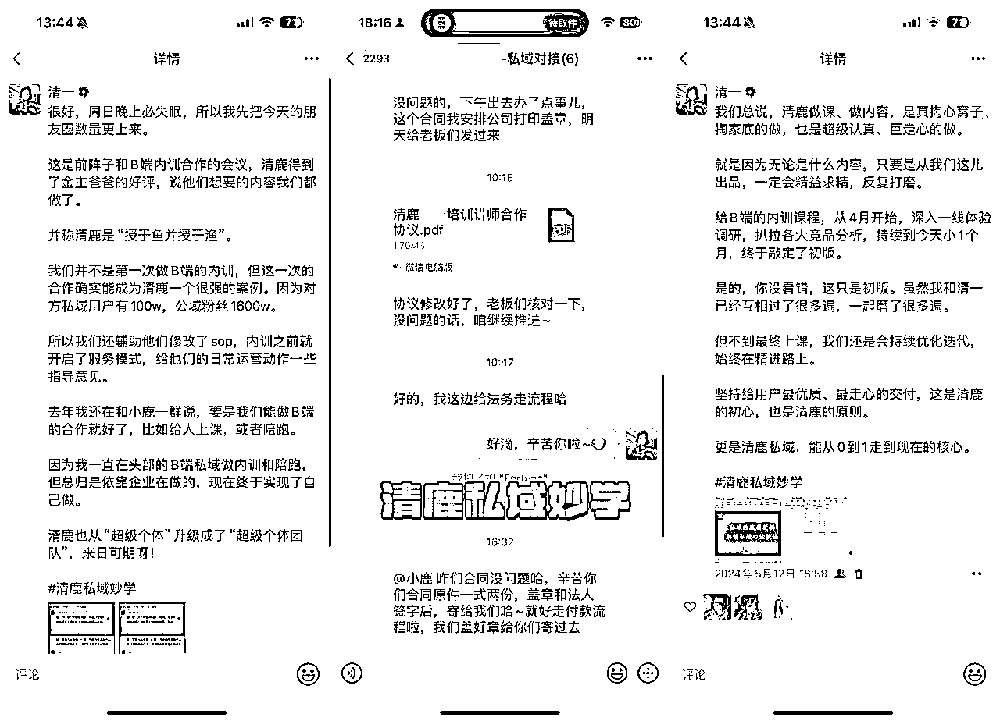

今年开始对接一些大企业有几个感受是比较深刻的，也来和大家分享一下，B端合作和C端合作的区别。

想要成交B端老板的，这次分享一定要看！

我们也总结出了很多tob和toc的区别，希望今天的分享能够助力各个知识IP们做好B端成交。

做知识IP其实大多时候我们做的都是C端的客户，特别是刚开始做这个赛道的小伙伴，想要马上跳到tob是不现实的，一定是在toc这件事上有了不错的积累，才有可能去做tob的业务。

如果咱们要去做tob的业务，就一定要把自己跟这个业务和我们的专业内容相关的所有的亮点，包括我们的优势，以及能够证明我们在这个领域是专家的点，把它都能够展示出来。

比如说你过往的履历，你做过什么样的项目，你服务过什么样的客户，你对哪一些特定的事情有特别独到的知识和认知。

那这些都是在我们拓展tob的业务的过程，会非常加分的点。

像清鹿这次拿下的这个合作，我们不仅仅是准备了过往的案例、自己的个人介绍，我们还为这家公司的赛道做了一个内训计划表，因为是一个大IP的合作，不是小订单。

那B端的这个客户到底是怎么回事儿，他们都是怎么做决策的，他们都有什么样的一些购买行为的一些特征呢？一起来看。

## 1、B端合作特点，内训决策链路长

首先B跟C真的是不一样，那B它是一种法人肌肉，那什么是法人肌肉？

就是说他不是一个真实的有些有肉的一个人法人，他是一个经济社会组织，在法律意义上人格化。

比如公司的创始人，就决定了他的这个需求的偏好，他的购买行为，他的决策思考范围，都是和C端客户不一样的。

在对应到我们的供给侧，就是供应链这一块。

我们想要拿下B端的业务，首先要对这个B端的业务特点有一个比较详细的了解，否则拿着TOC的服务模式去和TOB的老板聊，那就一定会踩坑。

把产品卖给B端老板，买单的人和服务的人是不一样的。

什么意思呢？比如你是一位老板，你买了一套企业内训的服务，你不是最终享受服务的人，你是决策人，最后享受这个服务的是你的员工。

这一次要谈的这个合作，老板明确说了预算10w。

那我们就要站在老板的角度思考，10w的预算怎么让他们的团队成功掌握私域运营的技巧，同时还能留下言一些可复制的私域sop，并且把周期缩短，让我们的服务更轻松也让他们的收益更大。

这样的谈判，就是要带着整整齐齐的方案过去，才有可能会成交。

那对公司的行政或者HR来说，就讲究人效，老板选的供应商是不是靠谱，性价比是不是足够高等等，都是HR部门要去评判的事儿。

再对员工来说，这个东西好不好，有没有帮助，我也不知道老板花了多少钱，但如果我体验好，我觉得就是好东西。

我们如果面对b端客户的时候，我们要充分理解不同的角色，他们的诉求是不一样的。

你必须把不同的这个利益相关方的诉求都找到，这单业务可能才有可能做成。

## 2、B端消费特点，刚性需求的理性采购

b端和c端的不同在于，b端它都是基于刚性需求的理性采购，他不会冲动消费，完全是一个理性驱动的。

所以和B端的合作，会特别慢，很长时间没动静，那是因为B端的决策链路特别长，决策周期也很长，试错成本也很高。

因为b端的这个采购，它是一个超理智的一个方式，所以他不会因为在这个决策链上的某一个个体的感性的认知而改变。

比如说我们可能卖一个培训课，这一个企业，那可能你要接受培训，主管经理可能还要汇报到顶头上司、人力资源部总监，然后可能他还要跟相应的业务门有一些沟通。

然后如果是比较金额大的时候，还要问问财务采购的意见，可能还有三方比价等等。

每一个策略上的每一个角色都要发表意见，而且它是一个集体决策的一个过程。

在我们C端来说，我们经常强调我们的产品可以小步迭代，边做边调整等等。

但是对于b端来说，因为他是这样一个运作和方式，其实b端的客户他真的很难接受这个试错的成本。

越是成熟的企业，他整个的决策流程就会来做这个保证，就是每一个决策可能不是最优的决策，但一定不是一个最差的决策。

越是成熟的企业，就越是这样的一个情况。

那种一天就谈成半天就服务完的B端合作，说实话我自己在B端做了这么多年的培训，还没见到过。

如果有，那只能说是很小的小型企业，大企业基本上都要走7-15天才有可能落地合作。

所以我们在跟b端打交道的时候，一个是对于他们的这个决策的方式，决策链上的不同的角色的想法，都是我们要考虑的一个事情。

## 3、B端服务准则，时刻谨记“定向”

特别是客单价越高，就得给客户做定向的计划，B端老板也特别喜欢“以客户为中心”的这种服务态度。

b端其实更加强调精准，就是在垂直领域的一个专业的影响力。

好比我们去理发店剪头发，tony老师需要根据我们的脸型、气场、气质来给我们做定制化的发型管理。

在这里，我们的导师们都给到了一些参考框架，是做了合作企业这个赛道比较详细的课程内容过去谈的。

做知识付费的小伙伴，如果未来想要赚的更多更轻松，那么B端的合作肯定是少不了的，这几点原则一定要做好把控。

现在，清鹿的这个合作已经进入到了交付期，后面交付结束了来给大家再详细的分享一下，如何做B端的内训和陪跑，尽量给到大家一些流程上的帮助。

以上就是我的全部分享，希望能在大家的私域成长之路上，给到一些启发及帮助。

感恩生财有术！也祝大家生财有术！