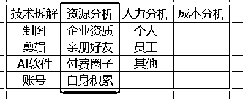
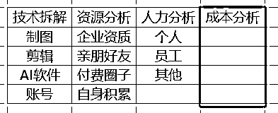
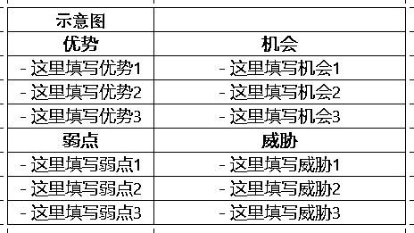
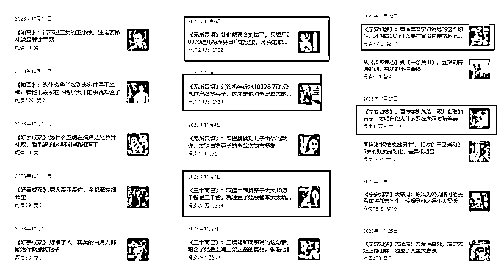
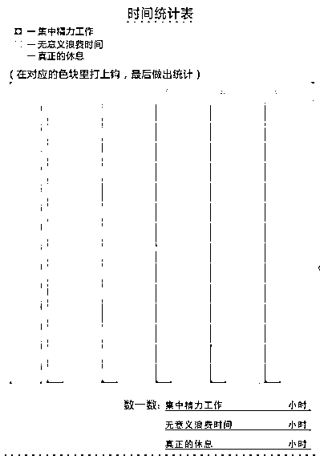
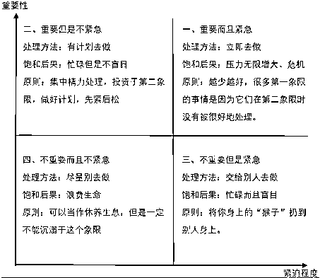
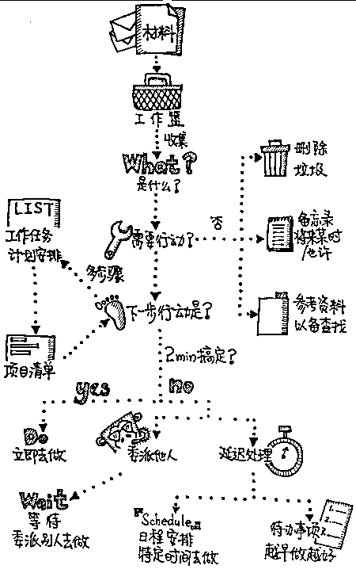
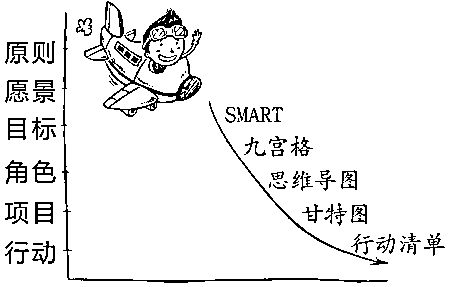
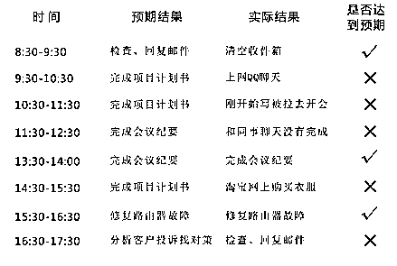

# 实践检验真理：如何通过亲自实践，实现月入10w的收益

> 来源：[https://k170ac9yh31.feishu.cn/docx/DkU9dISxWoY0y6xQHNecWK1Wnwb](https://k170ac9yh31.feishu.cn/docx/DkU9dISxWoY0y6xQHNecWK1Wnwb)

# 自我介绍

各位生财的小伙伴们大家好，我是张波，一个衣着普通的男生，在大家看来应该还是一个“屌丝”的人。

2023年4月18日加入生财以来，我经历了从一名普通打工者到失业的低谷，再到现在月收入突破10W+的华丽转变。这段经历的酸甜苦辣，只有我自己最清楚。

回想自己一年多经历，写了《扬帆正当时：小白的生财之旅，一年成就月入十万的梦想，分享了我一年多的经历，当初希望未来新加入的小伙伴，以及加入了星球后还在迷茫的圈友们一点启发，希望2024年大家都能够赚到钱，实现共同富裕的这一目标。

内容写出来后也大家有了讨论，也有了疑问，我到底该如何做项目，选择什么样的项目，如何行动，一直在读教员的《毛选》里面《实践论》给我很大的启发，因此写了这篇《实践检验真理：如何通过亲自实践，实现月入10w的收益》，希望能够帮助到大家。

# 实践的重要性

## 认识与实践

很多人都说项目收益比较难，我如何才能够赚到钱，我觉得一方面需要提升自己的认知，另一方面提升自己的实践能力。

凡是做出成绩的人：在认知方面，一定比大家高一些或者独特一些；在实践方面，一定是行动能力比较强的人。这就是常常提到的知行合一：“知而不行，只是未知”“知而不行，便不真知”“知行合一，相辅相成”。

很多人想问我做什么项目能够月入10w，关于这个问题我自己是做了很多项目，抖音、公众号、小红书、知乎等等。大概得比例我这里不方便的讲，看到生财有手册或者其他方面有资料，我就会去尝试，要做到知行合一，要不然自己把全部的道理都知道，把全部的帖子都在你手里又能够怎么样呢？

实践是认识的基础和目的，所有认知都来自实践，并通过实践进行检验、发展与完善。如果自己不去实践，怎么能够区分内容的真假，怎么才能够有收益。

## 实践的作用

实践在一个人的主业或者副业中都很重要。一个人只有通过实践，才可以将抽象的理论知识转化为具体的SOP，还需要进行大量的尝试，一点点的纠正自己的错误，找到最适合自己的方法，这种东西不是别人的给你讲或者你去看别人的帖子就能够学会的。

就拿我自己举例子：《公众号爆文进阶教程》

这一篇帖子我写的时候是在我参加完生财的一场航海，以及一次续航后写出来的，结合我自己的实践写出来的SOP，我可以把这个手册让很多人给我打工。通过实践，我可以把每一步在进行一步细化，大家只要按照我的标准做就好了，也方便我的验收。

那时候有朋友劝我开课，让我不要发出来，这个东西完全可以自己开课去了，但是我没有听朋友的劝，我还是发出来了，主要做的就是一个利他，希望大家都能够尽快有收益，而不是我自己拿着这个手册一点点的去捞钱。

从这个航海后我又潜了一个季度，这一个季度我去干啥了，我相信上一篇文章讲了，我去总结了帖子、看帖子去了，我没有开课的就是因为开课了会浪费我大量的精力，让我没有时间去做这件事，我只想静下心来成长，来沉淀自己。

每一个文件袋都是一个项目，至少40多个文件单，除了我自己的笔记，还有很多自己总结的SOP。通过实践获得的经验是任何理论学习都无法替代的，任何付费课程更无法给你讲到的。实践可以使自己能够适应不断变化的环境，通过实际操作解决问题，创新并改进已有的SOP，从而完成适合自己的SOP。

# 个人的目标

一定要有一个自己的目标，没有目标，自己就没有方向，永远走不出迷茫。学会每年、每月、每周、每天给自己制定一个切实可行的目标，并尽自己最大的努力去实现，天天坚持着做，一年后，三年后，五年后，你将会积累一个大大的、成功的目标，并自己为之骄傲。

## 实践与收益的联系

相信到现在还有人觉得实践不重要，以及我到底如何实践。我想做一个项目，但是我不知道怎么做，但是我非常想赚钱；我现在没有赚钱，是因为不知道这个项目如何做；我看了别人的帖子，觉得他的收益太低，或者操作太麻烦，我懒得做，我就希望找个能够躺着赚钱的方法，这种只想不干的思想要不得的，天上不会掉馅饼。

需要自己亲自去实践，通过一系列的操作，如学习、应用、测试和调整，用直接的经验来解决问题或改进现有的做法。实践的核心在于其动态性和目的性——不停地推动向前发展，通过不断的实验和反思来优化行动策略。

实践与个人收益目标之间的关系表现在几个方面：

1.  在现实环境中，测试自己的理论知识和技能。通过实践，发现自己能力的不足，从而进行针对性的提升，直接关系到实现更高收益的可能性。

1.  通过寻找创新来增加收入。在实践过程中，大家往往能发现新的解决方案或商机，这些通常是理论无法提供的。例如，公众号项目的一些新分类，以及一些项目的新类目，这一块可以经常看一看生财的风向标。

1.  促进了个人圈子的扩展。在实践中，大家会与同行、以及其他利益相关者进行互动，可以提供新的业务机会，以及新的方向。

实践不仅加深了对所学知识的理解和掌握，更重要的是，它为个人的收益提供了直接的推动力。在后续部分，我们将进一步探讨如何通过选择适当的副业和进行有效的市场调研，将实践活动与收益目标结合起来，实现个人收益的的最大化。

## 明确收益目标

不管做什么事情需要一个明确的目标，例如：每年、每月、每周、每天大致的目标，没有目标自己就没有动力，更不谈自己多么积极主动的进行实践了，因此制定目标的重要性可想而知。

### 设定具体、可实现的目标

设定具体的收益目标，意味着将抽象的愿望转化为明确的计划和数字。例如，如果你希望通过小红书项目提升自己的收入，一个具体的目标可能是在接下来的三个月内，通过小红书平台每月额外赚取6000元。这种具体的目标有助于确定需要采取的具体行动步骤，如选择小红书的分类，以及具体的变现方式，以及确定相关的操作。

具体目标的设定还应考虑到目标的可实现性，确保所设定的目标既有挑战性又在个人能力和资源范围内。可实现的目标能够减少挫败感，提高成功的可能性，从而保持个体的积极性和持续参与度。例如，一个小白第一个月就想实现1w副业的收入，对于这样的目标实现的可能性就很小，除非自己有强大的资源或者运气，如果有这么强大的实力，说明目标就定低了。也不排除有些人是天选之子，一下子就完成了目标。

### 目标如何驱动行动与改进

明确的目标能够有效地促进自己的行动能力。当你清楚自己为达成什么目标而进行努力的时候，你就会思考新的解决方式，有可能采取具体且有针对性的行动。此外，目标还能帮助你监控项目的进展，评估后期的效果。这一过程中，目标起到了反馈的作用，帮助大家识别并聚焦需要改进的地方。

例如，如果一个自由职业者的目标是提高其平台账号的内容满意度，他可能需要根据相关的数据，以及分析竞争对手是如何写内容的，进行具体的调整，如改进工作流程、提升交付速度或优化沟通方式。

明确设定收益目标对于确保实践的方向性和效率至关重要。它不仅指导大家采取行动，还促使在实践的过程中不断学习和调整。

# 重视前期的调研

在寻找项目的时候，要尽可能的多的收集一些数据，例如项目平台、变现周期、项目收益等方面的数据，还要自己能够确定信息是不是比较准确，如果信息不够准确的话，可能会导致误判，在项目寻找的时候，还是要先收集数据，先不要管数据是不是合理，尽可能多的进行数据的收集。

## 数据收集

通过梳理后，能够很轻松的看到这些已经变现的项目大致情况，可以做一个简单的判断这些项目是不是符合自己的心理预期，主要项目筛选的话，我觉得主要还是针对变现周期+变现金额，进行分析。如果在这里手机对比出来的收益或者时间难以符合你的心理预期，自己就要换项目了，这个项目肯定不适合你。

## 数据质量

前期自己一定要把我数据的质量，数据的质量决定了，一个项目的成败，以及项目可能的最大收益，或者说最小的收益，我认为在前期数据的收集的时候，如果自己身边有资源的话，建议询问一下已经跑通的，或者说身边的朋友。

平台+赛道: 这两个数据可能就是简单的一句话，或者说自己通过简单的观察就能够看到，这些数据很难造假，这一块的数据质量自己担心的不需要太大。

目前收益+周期+数据来源: 这三个的数据才更关键，尽可能的询问身边的朋友或者微信的圈友是不是有人能够告诉你一个相对准确的数字；或者看相关帖子的数据；付费购买其他人的课程，或者直接付费询问收益的情况。

## 数据分析

### 数据验证

一致性检查: 主要涉及到两个方向内部和外部。内部一致性：例如《聚光投放做广东公司团建业务，从0-1半年200w营收复盘分享》《小红书做新西兰旅游半年销售额260W+，我的经验分享和新人入局建议》变现方式以及项目的周期基本都差不多，我认为属于内部的一致性。外部一致性: 将自己收集到的数据，问一问在这个项目做的时间比较久的大佬，这个数据是不是符合一个预期。

连续性检查: 例如《聚光投放做广东公司团建业务，从0-1半年200w营收复盘分享》《小红书做新西兰旅游半年销售额260W+，我的经验分享和新人入局建议》这两个大佬的分享出来的时候时间相差不大，而不是一个是年初一个是年尾，如果是这样话，时间间隔太久，数据的一致性就无法保证，尽可能保持数据的连续性。

数据完整性检查: 收集的数据内容，是不是有大致的业务逻辑，大致的方法，以及大致的感悟，这些虽然都无法展现在上面的表格中，相关的内容越多，代表有些数据越准确。

综合验证: 根据自己实际的情况，进行综合的判断，这条信息是否值得可信，这个需要自己长期的进行的积累的经验。

### 数据陷阱（辛普森悖论）：

数据陷阱是因为数据收集的时候，没有找到合理的数据，在数据的收集的时候，自己也要做个判断，只有合理的数据，合理的进行分类才不会陷入辛普森悖论的陷阱。

上面的业务进行分析，发现引流成交和带货等收入的收益差别太大，如果自己做笔记的话收益预计在1-5w之间比较合理；如果是引流成交的项目，收益就可能是20w左右。

如果出现一条数据，笔记的话突然有几个一下子几十万w月收入；或者说做的时间比较久的引流项目还是几w；如果分析的时候不把这些数据区分出来，很容易就陷入了数据悖论，得出的结果就不太准确。

选择了一个项目后还要做好各种调研，各种数据的收集，这也是考验一个人能力的时候，不做调研就直接做的话只要自己能够承担住风险。

# 资源一成本分析

## 技术需求

•剪辑: 例如抖音视频、小红书视频、B站视频、视频号等，这些本身以视频为介质的平台，需要自己掌握一些技能。

•制图：图文类型的平台，需要首图比较好，可以使用PS或者创可贴、稿定设计这类的师徒软件；

•AI软件：文案创作如果自己的灵感不够，可以学习一下GPT指令调出一个比较的指令，能够批量的输出文案。

•账号：有些平台需要大量的平台账号，或者其他的账号，接码或者电话卡，这些都是技术。

## 资源分析

分析需要哪些资源，例如企业资质、亲朋好友、付费圈子、自身积累。

•企业资质：平台是否需要企业资质或者个体工商资质的，如果需要的话自己有没有能用的。

•亲朋好友：是不是需要的大量的个人账号，这个就需要身边亲戚朋友的手机号码、个人信息协助注册账号。

•付费圈子：自己的付费圈子是不是有相关的资料，能不能支撑起来这个项目。

•自身积累：自己积累的知识是不是能够支撑的起来自己做这个项目，自己是不是还要额外的进行学习。

## 人力资源

这个项目前期大概需要几个人，以及每个人大概需要每天投入多长的时间，自己心理要有个预期，这个决定了投产比，很多小项目更加考验的是人力资源，如果一个项目的话需要投入时间过多的话，就得不偿失了。

## 成本分析

成本分析就需要考虑投入的成本费用，例如：GPT账号：20美元/月，服务器成本，付费成本等。

# 理论与实践的关系

首先做一个定义，所有别人的帖子，别人的给你讲述的内容等等，都可以称呼为理论。

在主业或者副业中，理论与实践之间的相互关系，发挥着至关重要的作用。不仅涉及将理论应用于实践，还包括通过实践反过来提炼和优化成自己的理论。理解理论的发展动态，有助于大家更高效的利用知识，并在实践中不断进步。

### 从实践中提炼理论

#### 感性认识的积累

感性认识是通过直接的感觉、观察和经验而形成的知识，它是从实践中提炼出来的。在实际生活中，通过处理具体问题和参与日常任务，能够积累大量的感性认识。例如今天我看了10篇帖子，我觉得大家很厉害，这个项目很容易，我相信自己也能够赚到钱，或者说今天某某大佬在宣传一个项目，我相信了。这些都是感性认识，我通过自己的圈子，通过自己看到的内容，或者感受得到的答案。

另一种相反的例子，我觉得做这个项目没有把握，这个项目需要的东西太多，我能力不具备，或者说我没有那么多时间，一个人主观地、片面地、表面地看到问题，提出问题的人，看不到事情的本质就先埋怨。

上面的两个例子，都是非常感性的事情，一个是看到别人的成功就盲目的相信，另一种看到就是先怀疑的态度，感觉上面的路子都不是好的方法。但是大家又都是从这个过程中过来的，因此需要理性认识帮助我们做优化。

#### 理性认识的形成

理性认识则是指通过逻辑思考和系统分析，对感性认识进行提炼和升华，形成更为系统和抽象的知识体系。在实践中积累的感性认识，为理性思考提供了丰富的数据和实例，帮助个体形成更深入的理解和更广泛的视角。

继续上述例子，通过分析不同帖子的成功与失败，找到共性问题，自己就可能会形成一套关于有效SOP，进一步指导自己的实践。这种理论的形成不仅基于个人经验，也需要包含行业趋势和市场变化的影响。

这种从实践到理论，再从理论指导实践的循环过程，是个人成长和知识提升的重要机制。通过不断的实践，个人能够验证和完善理论，同时，理论的深化也能促进更高效和目标明确的实践活动。

理性认识形成的过程，证明了理论与实践不是孤立的，而是相互依存、相互促进的。

### 理论指导实践

在个人成长和职业发展的过程中，理论不仅仅是提供知识背景或解释现象，更重要的是它如何被应用于实践中，并指导实践的持续调整和优化。理解并进行实施这，更高效地实现目标并应对挑战。

#### 实践中的理论

理论在实践中的应用，涉及将别人在帖子中抽象的理论知识，转化为自己的行动指南。这一过程要求自己能够理解理论的核心要点，并根据实际情况灵活应用。

例如，你在别人的帖子中看到了一个比较好的工具，或者比较好的理论，就要考虑是不是能够用在自己的项目中，或者说能不能找到优化自己流程等等。

理论的实际应用还要求自己不断学习和更新知识库，以确保所使用的理论是最新的，并且与当前的行业标准和市场环境相符合。这种持续的学习和应用过程是实现理论最大价值的关键。

#### 理论与实践的持续优化

实践不仅是理论应用的场所，也是理论检验和优化的源泉。理论一旦在实践中应用，其效果和适用性就会得到验证。基于实践中的反馈，理论可能需要调整以更好地适应实际情况。

例如，如果你在做小红书的过程中，就要根据实际情况进行调整。例如调整内容癫疯呈现方式、者呈现的样式或者呈现的内容。

持续的理论与实践反馈循环，促进了自己的适应性和创新能力。通过不断地测试、评估和调整理论指导下的实践活动，自己不仅能提高当前策略的有效性，还能在过程中积累宝贵的经验，这些经验将支持未来更多复杂决策的制定和问题的解决。

理论的指导和实践的反馈共同构成了一个动态的学习和发展过程。通过在实践中不断应用和调整理论，个体能够保持在不断变化的环境中的竞争力和相关性。

# 实践执行与策略制定

为了确保实践的成功，制定一个有效的操作策略是至关重要的。需要自己不仅能够理解策略的理论基础，还需要能够灵活地将这些策略应用于具体的实践中。一个良好的策略应当基于深入的理论知识，同时具备足够的适应性，以应对不断变化的环境和实际挑战。

## 制定有效的操作策略

### 策略的基础与应用

制定策略首先需要依托于坚实的理论基础。这些理论为策略提供了指导原则和行动框架，帮助大家识别关键的行动点和资源配置。

例如：一个基于市场细分的营销策略理论，可以指导如何根据不同的群体特性，来制定内容的发布，以及在那个平台什么时间段上进行发布。

一家公司可能使用市场细分策略来提高其产品的市场渗透率。通过分析不同消费者的购买行为和偏好，该公司能够更精确地定位其广告，从而提高广告的回报率。

选择合适的策略，来提升自己成功的可能性，市面上这种策略比较多，需要自己做好筛选。

### 策略的适应性与灵活性

在实践中，策略需要具有高度的适应性和灵活性。市场和环境的变化往往是迅速和不可预测的，有效的策略必须能够快速适应这些变化。这要求策略制定者不仅要对现有的市场和环境有深入的理解，还需要能够预见潜在的变化并做好准备。

例如，平台突然改变了规则，或者说竞争突然变的比较激烈了，以及其他的原因的出现，需要有更加灵活的策略。需要考虑新的方式来应对，减少自己受到的影响。

通过有效的操作策略，结合理论的指导和实际的应用，使自己能够在不断变化的环境中保持竞争力和效率。这不仅提升了实践的成功率，也加强了对未来挑战的应对能力。

## 具体实践的执行

### 实施初期的小规模测试

现在做项目很多人喜欢玩矩阵，在开始做矩阵之前先跑通几个账号是比较好的。在受控环境中观察策略的实际效果，评估其潜在的成功率和可能存在的问题。

例如，做公众号矩阵的话，可以考虑2-3个账号先跑通，然后逐步提升到几个分类，这样既可以收集数据，也可以测试自己的内容，用户是不是能够认可。

小规模测试的好处在于，可以减少失败的成本和影响。先搭建一个实验平台，使团队能够快速调整策略，优化产品或服务的特点，而无需承担大规模部署的风险和成本。

### 根据反馈调整并全面推广

在小规模测试后，收集到的反馈是宝贵的资源。这些反馈应该被用来调整和改进策略。根据平台的真实反馈，团队可能需要修改内容的某些特性、调整传递的信息或改变展现的方式。这些调整是基于直接的用户反馈，更有可能提高内容在平台的适应性和用户的满意度。

一旦策略经过调整并在小规模测试中证明了其有效性，便可以开始考虑全面推广。在全面推广阶段，重要的是保持对平台反应的敏感，并准备好进行进一步的调整。全面推广也应该伴随着持续的监测和评估，确保策略在更广泛应用时依然能够达到预期的效果。

通过这种分阶段的实施方法，策略的执行不仅更为谨慎，也更具有适应性。这种方法确保了策略的有效性，在实现商业目标的同时，也最大限度地减少了风险。

## 策略分析的示例

### SWOT分析

需要分析自己是不是适合做这个项目，例如需要大量的时间，自己每天工作比较忙碌，不要自己欺骗自己，说自己的时间充足等，对自己做一个合理的SWOT。

### 贝叶斯分析

结合上面的对标库，把对标的数据进行填充，例如上面有12项数据，自己的数据越接近对方，自己成功的概率就会越大；如果要是121项数据，也就1-2项可能成功的概率就比较小了。

要么自己做创新，要么真的就是天选之子了。

### 最好/最差分析

收集的数据，例如上图中的数据，有些是10w+，有些是39,；一看就是极好或者极差，自己要做好自己的心理预期。找到比较平均的数据，这样才比较符合账号的大多数时候。

# 时间管理与资源优化

不仅需要对市场的精确洞察和有效的策略制定，也极度依赖于有效的时间管理和资源优化。对于许多人来说，副业是在主职业之外进行的，这就要求必须高效利用有限的时间和资源。因此，掌握和应用有效的时间管理策略至关重要。

## 有效的时间管理策略

### 时间管理的技巧

时间管理前我建议自己先算一算自己有多少时间，每天多少个小时，每个月多少个小时，先做一个预估，然后通过工具一步步的细化，找到最优的时间分配计划，如果说自己每天都是996的话，这样的话需要做的就不仅仅是时间规划了，就要考虑时间节省了。下图是我每个月都会做的一张表：

时间管理技巧可以帮助个体更好地规划和利用时间，确保能够在繁忙的日程中找到足够的时段来推动副业项目的进展。一些基本的时间管理技巧包括：

1.  优先级排序：将任务按照重要性和紧急性分类，优先处理重要且紧急的任务。

1.  批量处理：将相似的任务集中在一起处理，以减少任务切换的时间损失。

1.  时间管理工具：利用日历、提醒、计划软件等工具来安排和跟踪任务。

1.  设定时间限制：为每项任务设定具体的完成时间，避免过度完美主义导致的时间浪费。

这些技巧的实施可以帮助个体提升工作效率，减少无效和低效工作的时间，从而为副业留出更多的时间。

上面的时间管理图，来自《小强升职记》，对于时间管理有兴趣的朋友，可以系统的看一看。

### 时间管理策略

根据上面的时间管理的方法用在主业/副业上，还需要自己对活动进行明确的时间规划。例如，如果某人的副业是在线教育，他可以设定每周固定的时间来准备教材、录制视频和互动回复学生。通过在周末进行大部分教材的准备工作，他可以确保在工作日晚上有足够的时间进行在线互动，从而不会影响到主职业。

此外，有效地利用碎片时间也是提高副业效率的一个关键策略。例如，利用通勤时间听行业相关的播客或进行市场研究，可以在不影响主要工作和生活质量的前提下，增加对副业的投入。

通过这些具体的时间管理策略，不仅能更好地平衡主职和副业的需求，还能提高自身的工作效率，加速副业的成长和成功。

## 资源优化与最大化利用

### 分析现有的问题

资源优化首先需要对现有资源进行全面的分析，包括时间、金钱、技能和其他物理或数字资源。理解这些资源的现状和潜力是优化的第一步。接下来，可以通过以下方法来优化和最大化这些资源的利用：

1.  集中资源用于核心活动：确定哪些活动对副业收益贡献最大，并将资源优先分配到这些活动上。这可以通过分析每项活动的收益投入比来实现。

1.  外包非核心任务：对于那些必要但不是收益核心的任务，考虑通过外包来释放自身资源，聚焦于更加关键的活动。

1.  利用自动化工具：尽可能使用技术工具来自动化常规和重复性高的任务，例如使用电子邮件自动回复系统、社交媒体管理工具等。

1.  资源共享：在可能的情况下，与其他同行或业务合作共享资源，如共用办公空间、共同购买批量材料等，以降低成本。

### 优化资源提升收益

例如，你已经加入了生财有术，那么你的资源有：

1\. 生财索引贴，搜索相关的帖子，找到近期最新的帖子；

2\. 生财航海期间的教练，都是官方帮忙筛出来的当下有结果的人；

3\. 生财航海的其他同学，每一期都会出现一些刚刚拿到结果的人；

这三种的话，是大部分都有的，相信至少80%的问题可以通过这些方式解决，如果你的实践性较差的话，可能觉得困难了。

还有就是进行了二次付费，你付费了这个人是认可这个人，一定要和这个人多聊一聊，然后询问他能够给你提供的资源，根据对方能够提供的资源，来做自己的计划，来做项目的展开，这样的话让你的付费的价值更大化。

能够给你提供价值的相关方，都是你的潜在的资源。例如身边的父母、朋友能够帮你解决吃饭的问题，这也是资源。甚至说小区的宝洁、门卫可能都会是你的资源。

# 从别人的经验中学习与批判性思考

在任何职业发展和个人成长的过程中，从他人的经验中学习是不可或缺的一部分。然而，简单地模仿他人的成功模式往往不能达到同样的效果，因此批判性地分析并辩证地看待这些经验至关重要。在学习和应用他人的经验时，尤为重要的是避免陷入非实际行为，如盲目的投机主义和冒险主义。这些行为可能会带来短期的成功，但往往难以持续，并可能导致严重的负面后果。因此，识别并避免这些行为，采取实事求是的行动策略，是确保稳健发展和长期成功的关键。

## 辩证地看待别人的经验

### 筛选与吸收有价值的经验

从他人的经验中学习首先需要有效地筛选信息。在海量的信息和不同人的经验中，识别哪些是真正有价值和可靠的，是学习过程的第一步。这通常需要对信息源的可信度进行评估，并结合行业认知来筛选信息。

例如，对于想要做公众号项目的圈友来说，选择学习那些已经在此领域取得明显成功的人的策略和方法，尤其是那些能提供具体数据支持其结果的案例，会更加有益。

除了选择可靠的信息源，了解成功案例的背景和具体实施细节也至关重要。了解这些背景信息可以帮助个体更全面地理解经验的可转移性和限制条件。

### 考量经验与个人情况的适应性

辩证地看待别人的经验还包括评估这些经验与个人实际情况的适应性。不是所有成功的策略或方法都适合每个人的独特情况。个体需要考虑自己的资源、技能、兴趣以及所处的市场环境是否与所学习的经验相匹配。

例如，一个比较大的IP的公众号，随便写一篇文章就是10w+，如果你也按照他的模式去写的话，结构肯定不如人意。同样，如果某个策略需要大量的初期投资而自己的资金有限，这种策略也可能不适合。

在从别人的经验中学习时，应该结合自己的实际情况进行分析，批判性地考虑如何调整别人的成功模式以适应自己的独特环境和资源条件。这种辩证的思考不仅可以提高学习的效果，也是自己发展批判性思维能力的重要过程。

通过这样的过程，不仅学会了什么是有效的，更重要的是学会了如何使之有效，以及何时这些方法可能失效。这种能力是任何成功副业或职业生涯中不可或缺的一部分。

## 避免非实际行为

### 投机主义和冒险主义的识别与避免

投机主义和冒险主义通常表现为追求快速成功和高回报，而忽略了与之相关的高风险和不稳定因素。识别这些行为的一个关键是审视所采取策略的可持续性和风险程度。例如，投机性的行为可能依赖于未经验证的快速盈利模式，或在缺乏充分准备和研究的情况下进入高风险市场。

为了避免这些行为，自己应该进行全面的市场研究，评估所有相关风险，并寻求稳健的策略。此外，遵循最佳实践和标准的SOP，也是防止投机和冒险行为的有效方法。

### 实事求是的行动策略

实事求是的行动策略要求自己基于现实情况制定计划和决策。这涉及到准确评估自身资源和能力，设定合理的目标，并根据实际进展适时调整策略。例如，如果自己想做抖音视频项目，实事求是的做法是首先抖音对于你要做的分类的数据怎么样，以及你是不是会剪辑视频能不能达到别人的效果。

实施实事求是的策略还包括持续学习和适应环境变化，以及在决策过程中聆听来自不同来源的意见和反馈。保持开放和灵活的态度，能够帮助个体更好地应对不断变化的市场和技术趋势，从而做出更加明智和可行的决策。

通过避免投机和冒险的非实际行为，并采取基于现实的行动策略，自己可以更稳健地推进自己的副业或职业发展，实现长期的成功和成长。

# 实践检验与个人收益的评估

在实践活动中，有效地评估成果和验证所采取策略的真实性是至关重要的。这不仅有助于确保策略的正确性，还能通过持续的优化和调整，提高实践活动的效率和成效，同时调整或淘汰那些不产生预期效果的做法。

## 实践的检验标准

### 评估实践的成果

评估实践成果的首要步骤是明确评估的标准和指标。这些标准应该在实践开始之前设定，并且与实践的目标紧密相关。例如，如果实践目标是增加副业收入，那么评估指标可能包括收入增长率、新客户获取数量、客户满意度等。这些指标应该是可量化的，以便于实际测量和比较。

实施评估时，收集相关数据是关键。这可以通过各种方式进行，如调查问卷、财务报表、客户反馈、网站流量分析等。数据收集后，应用适当的分析工具和方法对数据进行解析，以确定实践是否达到了预定目标。

### 确认的具体步骤

确认实践中采用的理论和策略的真理性，即它们的正确性和有效性，是通过实践成果的评估来实现的。真理确认的步骤包括：

1.  结果分析：对比实践前的目标和实践后的结果，分析差异的原因。这涉及到评估策略执行的质量、外部环境的影响因素以及内部执行的效率等。

1.  假设验证：在实践前对可能的成果做出的假设需要在实践后进行验证。这包括验证所使用的理论假设、市场假设以及操作假设等是否准确。

1.  反馈循环：将评估结果反馈到实践过程中，对策略进行必要的调整和优化。这一步骤是持续改进的关键，确保实践在未来能够更有效地达到或超越预期目标。

1.  持续监控：实践的评估不应是一次性的，而是一个持续的过程。定期重新评估实践成果，以确保持续适应变化的环境和市场条件。

通过这些具体的评估步骤和方法，自己能够有效地检验实践的成果，确认所采取策略的真实性，并根据评估结果进行必要的调整，以提高个人收益和实践效率。这种基于证据的方法确保了实践活动的科学性和实效性，是达到持续成功的关键。

## 个人收益的持续增长

### 监测个人收益的变化

监测收益变化是评估副业成功与否的直观方法之一。这涉及定期检查和记录收入水平，以及其他关键财务指标如成本、利润率和投资回报率。这种监测可以通过多种工具实现，如使用财务软件来跟踪收入和支出，或者建立简单的电子表格来手动记录这些数据。

定期监测允许自己迅速识别收益波动的趋势，并在必要时作出响应。例如，如果某个月的收益异常下降，自己可以迅速查明原因并采取措施纠正。同样，如果某个策略特别成功，自己也可以及时发现并进一步加强这一策略。

### 分析收益增长的因素

除了监测收益的变化，深入分析推动收益增长的因素是优化策略并持续增长收益的关键。这包括识别哪些具体活动、市场策略或业务模式对收入增长贡献最大。通过数据分析和市场反馈，自己可以识别出成功的模式和趋势。

例如，如果数据显示通过社交媒体营销带来的客户转化率和订单量显著提高，那么这指明了社交媒体平台是收益增长的一个重要驱动因素。了解这一点后，个体可以决定增加在这些平台上的营销预算，或进一步优化社交媒体策略。

此外，也应考虑外部因素如市场变化、消费者行为趋势和经济环境如何影响收益。这种全面的分析帮助个体不仅对当前的业务模式做出精确的调整，也为未来的策略制定提供了依据。

通过这些监测和分析方法，个体能够更好地掌握自己的财务状况，确保收益的持续增长，并在副业和职业发展上做出更明智的决策。这种方法的应用有助于将实践活动转化为实际的经济收益，实现长期的职业和财务目标。

# 个人实践的呼吁

## 实践促进个人收益的增长

实践是理论与成果之间的桥梁。它不仅帮助自己将抽象的知识转化为具体的技能，还提供了一个平台来测试和改进这些技能。通过实践，自己能够直接影响自己的经济状况，无论是通过提高工作效率、开发新的收入渠道，还是通过优化现有的业务流程来增加利润。实践的重要性在于它允许个体在真实的市场环境中应用自己的创意和技能，通过实际操作看到自己努力的成效，从而不断调整和优化策略，实现收益增长。

## 实践的普遍价值与个案

实践的普遍价值在于其适用性广泛，几乎在任何领域都是推动成功的关键因素。通过具体的个案分析，可以看到不同行业和领域中实践的成功应用。这些案例不仅展示了实践的多样性，还证明了其在不同环境下的有效性。无论是自由职业者利用专业技能增加收入，还是企业家通过市场研究和产品创新扩展业务，实践都是自身成功不可或缺的部分。

## 基于理论与实践的行动建议

为了使这一转变尽可能有效，以下是一些基于理论与实践的行动建议，可以帮助大家开始实践之旅：

1.  设定具体目标：明确您想通过实践达到的具体目标。这些目标应是量化的，可以测量的，比如增加一定比例的收入，获取新的客户，或完成特定的项目。

1.  制定详细计划：根据您的目标，制定一个实际的行动计划。这个计划应包括步骤、时间表和所需资源。明确每一步的预期结果，以便于监测进度和进行调整。

1.  开始小规模实验：在全面投入之前，先进行小规模的实验。这可以帮助您测试理论的实际效果，并根据初步结果做出必要的调整。

1.  收集反馈并优化：在实践过程中，积极收集反馈，无论是来自客户的、同事的还是自我评估的。使用这些反馈来优化您的策略和方法，确保它们更有效地服务于您的目标。

1.  持续学习和适应：市场和环境在不断变化，持续的学习和适应是必需的。保持对最新趋势和技术的关注，确保您的方法和技能不过时。

## 以实践来验证真理的重要性

实践来验证理论的真理是非常重要的。理论提供了指导和框架，但只有通过实践，您才能真正理解其价值和限制。实践是学习和改进的过程，它不仅可以帮助您实现具体的成果，还可以促进您的个人成长和职业发展。

不要害怕挑战现有的思想和方法。勇于实践，敢于创新，让您的行动成为揭示真理、驱动变革的力量。记住，每一步实践都是向成功迈进的一步，无论其结果如何，都是向前的动力。