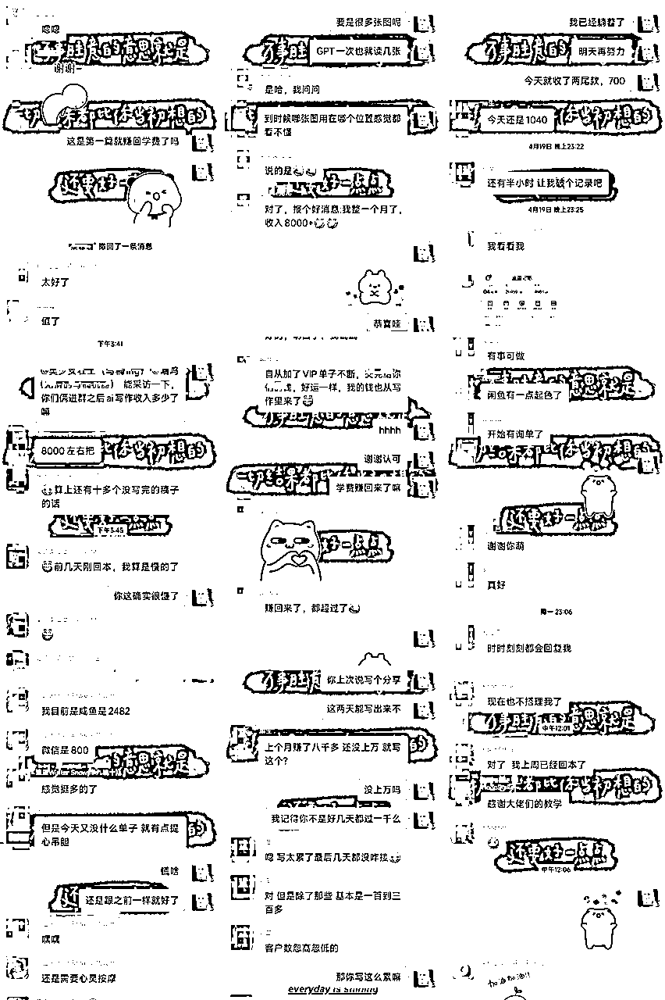
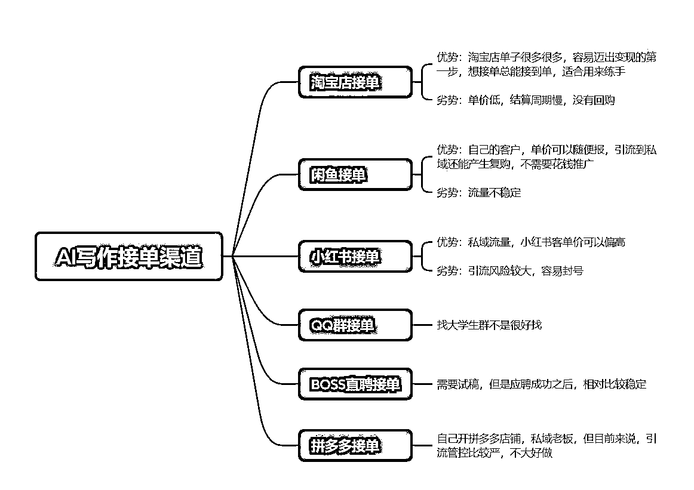

# 个人认为最适合新手小白上手的项目一定是AI写作，没有之一

> 来源：[https://riupvml5qjl.feishu.cn/docx/EWTSd2cKDoRunHxm7bGcgaIsnHd](https://riupvml5qjl.feishu.cn/docx/EWTSd2cKDoRunHxm7bGcgaIsnHd)

圈友们好呀，我是轻舟，入生财一年多了，接触过的项目也挺多，但在我个人看来，最适合新手小白跑通0-1的项目那一定是AI写作，没有之一。

这是我做AI写作的第三个月啦，汇报一下，经过这两个月的努力，20万负债已经还清了5万，目前还负债15万。感谢生财，让我找到了适合自己的路。

# 项目介绍

## 项目简介

一句话概括AI写作，就是通过AI工具帮客户写各种文章。从这里也可以看出，这个项目有两个关键要素，第一个是AI工具，第二个是客户，也就是写作和渠道两部分。

## 成果展示

按照惯例，先给大家看下成果，我是2月底开始做AI写作这行业的，目前为止不到3个月，目前AI写作接单这一块的总收入在6万左右，其中最大的单子是将近7K。

我个人成绩在之前的帖子中都有分享，感兴趣的圈友可以点进去看下。

这两个月期间，也收获了一些小伙伴，大家反馈都很不错。所以我敢说，AI写作是最适合新手小白入门的项目了，没有之一，0-1反馈也是最简单的。目前我们有全职做的小伙伴，像我自己一个月2万左右，还有兼职做的，一个月8000，也还有其他打算将这个项目发展成主业的小伙伴。

## 项目成本

可以说是0成本了，不过建议新手还是买个GPT4.0，对新手比较友好，如果不想花这个钱，用3.5及其他免费的AI也都可以做。

## 项目优缺点

优点：正反馈真的超级快！跑通0-1的门槛真的不要太低了，不要求有写作基础。

缺点：自己接单自己写的话，上限不高，一个月可能就1-2万，毕竟个人精力有限，可发展成小工作室，这样上限才高。

# 实操细节

## 写作

接单类型各种各样都有，演讲稿、征文、述职报告、简历、主持稿、自我评价、论文、开题报告等等等等，除了理科类的论文、设计类的论文，其他的基本上都可以用AI来写。

具体的写作指令这一方面星球内有很多很多相关的技术帖了，由于我自己还是个半吊子，就不献丑了，有兴趣的圈友可以去搜索一下相关的技术帖。

## 接单

这里给大家分享一下实操吧，也是我个人比较擅长的一块。接单目前来说我自己用的是闲鱼和小红书。除此之外，还有一些其他的接单渠道可以分享。

## 闲鱼基本操作

文案

同行是最好的老师，直接在闲鱼搜索代写，选择想要高的点进去，复制一个喜欢的文字即可，注意这里尽量不要直接用，变动下顺序即可，千万不要自己去自创文案，因为敏感词很多，咱也不知道哪个词就违规敏感了，所以直接抄别人现成的是最安全的，不要重复发相同的文案图片。

这里需要注意的是：

①复制的时候大概检查一下是否有违规的词（论文，实习报告，实践报告等等），数据好的链接也不代表百分百安全，有时候可能系统还没检测到，所以还是需要自己手动检查一下。

图片

图片有两种选择，最方便的方式是直接去搜索代写，截图同行的图片，注意不要直接保存，直接保存会有别人的水印，点击商品主图-截图下来就行。

审核

发布后如果遇到审核，这个是正常现成，等待审核完成即可。

发布频率

尽量保证每天都能发布商品，没时间哪怕一两个都可以，闲鱼的流量是不稳定的，说不定哪天你流量好的号就没有流量，需要多发布新商品去获取流量。

每天擦亮商品

可以选择晚上00点之后，或者早上，进行商品擦亮，商品擦亮就是点击我发布的商品-一键擦亮即可。

同行留言

这个看个人介不介意吧，我个人是很不喜欢同行在我的商品下留言的，碰到有留言的，我都是点进他们主页拉进黑名单，然后再把留言删除。如果你不喜欢同行留言，记得一定要拉黑，不然他们三天两头来留言，删都删不完，别问我为什么知道！

自动回复

自动回复一定要设置！！很重要

卖出商品及时上架

商品卖出会自动下架，所以卖出去之后一定要及时上架，因为卖出的多半是你曝光比较好的商品，不上架会影响曝光和咨询的，所以一定一定一定要及时上架。

急速卖

闲鱼主页右上角有个 签到，点进去之后有个急速卖，在这里每天可以花闲鱼币购买推广，每天可以推广一个商品。这个是每天必做的，非常非常重要！！！