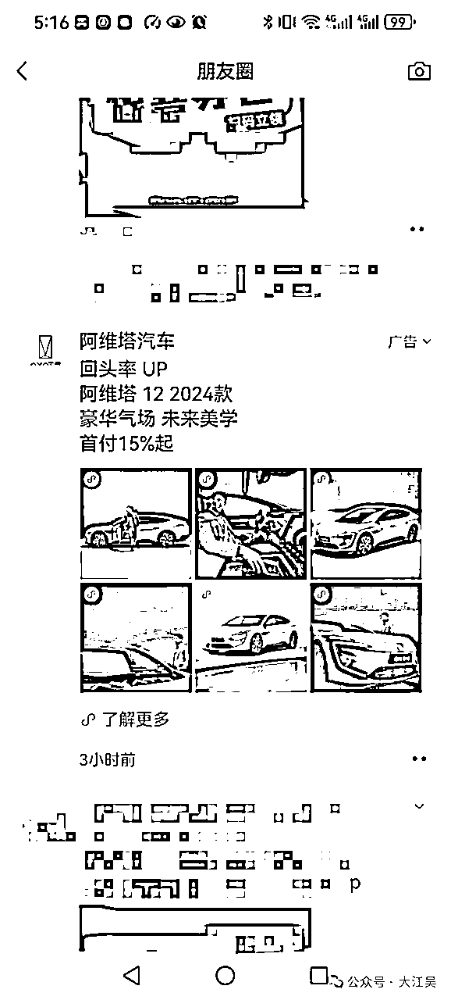

# 万字拆解：企业私域运营怎么做（附工具+表格+地图）

> 来源：[https://m3pbbos40c.feishu.cn/docx/ExKidB4WVofh6HxVdGFcpoQ2nAA](https://m3pbbos40c.feishu.cn/docx/ExKidB4WVofh6HxVdGFcpoQ2nAA)

市面上讲私域的很多，但讲明白的不多，系统性讲明白私域的更少。

所以我花了整整一个星期，把我这几年实战和学习到的经验，系统性梳理了一遍，分享出来。

本文或许是全网最详细、最落地的私域体系化运营方法论，为了便于你有一个全局的视角理解，我还准备了一张私域体系化运营地图，领取方式我放在文末。

好了，开始吧。

私域体系化运营包含4个方面，即落地4要素：策略、内容、工具、团队。

# 01策略篇

策略就是运营方法。

说到方法论，有两点要注意：

首先，方法不存在绝对好与坏，行或不行，黑猫白猫能抓到老鼠的就是好猫。

其次，没有哪一种方法适合所有业务。不同的行业、产品、客单价、业务模式、私域规模等，适合的运营方法可能完全不同。

当然最关键的是，你的私域目标决定了你的私域选择。

你是把微信当做一个营销或销售工具，还是要好好经营私域。

这是完全不同的目标。

如果你只是把微信当做一个营销或销售工具，最简单的方法就是运营好一个触点，比如朋友圈、社群、私聊，公众号，都可以。

比如你可以搞一场私域发售，业内叫“浪潮式发售”，顾名思义，像浪潮一样迅猛。的确，私域发售做的好，营收是很可观的，因为私域发售的本质就是“会销”，把以前会销的模式搬到了线上（微信上）。

但这种发售，一年最多只能做个两三次。

所以，你权衡下，你是否可以依赖私域一年搞成功两三次活动就够了。

通常，单个实体门店，像美容店、理发店、社区儿童兴趣培训，搞搞这种活动，是可以的，尤其是开业的时候。

还有像社区型超市，可以借助微信群，做些特卖，微信群就是一个信息宣发的地方。

这种就不叫经营私域，微信只是个工具，比原来纯靠线下和电话等方式，要高效。

如果你是要体系化经营私域，就得有体系化的方法论，而不是解决某一个点的问题。

如果是企业，我建议把私域作为企业经营里很重要的一个战略，因为私域需要很多资源的投入，也值得长期经营。

好，不管你私域的目标是什么，策略都是那些策略，包括了人设策略、引流策略、留存策略、转化策略、客户关系管理策略等。

无非策略是否齐全。

## 1、人设策略

就是以什么身份对外，老板、顾问、店长、客服还是啥，身份越高，势能越高，但要注意，人设不是你昵称叫什么，你就是谁，人设是通过你的行为表现出来的，比如你自称是老板，但你行为变现得就像一个客服，别人就认为你是个客服。

人设也不是身份越高越好，而是要能更好与你的用户打交道以及成交。

做私域是不是一定要打造人设呢？

不一定，但有无人设区别很大，有人设比没有人设势能要高，信任感要强，尤其是老板、顾问等IP人设，运营、销售工作都会好做，如果没有人设，通常非常吃流量和运营，即便如此，销售还不那么好做。

像很多公司都会去投放买流量，这样买来的流量，如果没有私域IP人设承接，很可能就是一锤子买卖。说白了流量接不住。

## 2、引流策略

就是你的人怎么进到私域。

很多人说引流是做私域第一步，这话绝壁害了不少人。

在引流前，很多事情就要想好，比如引流进来怎么留存，怎么转化，而不是走一步看一步。

这跟做生意一样，人都进店来了，你不想好怎么接待，怎么销售，那搞个锤子。

不同的渠道，引流路径不同。

常见的引流渠道有：

1.公域买量

买量就是做公域的付费投放：百度SEM、腾讯广点通（视频号、朋友圈、公众号）、字节系（今日头条、抖音等）还有其他搜索引擎和新媒体平台的付费投放等。

微信朋友圈信息流投放

有预算的可以选择这种，只要ROI大于1（战略性亏损业务，不用考虑），这种花钱买量的方式可以规模化，如果目标市场大，也可以持续很久，但成本会越来越高。

记住，在有钱赚的时候，使劲投。

2.短视频平台

抖音、快手、B站、视频号

短视频的流量目前是相对便宜的，免费的也容易薅到，但平台的规则会越来越严，引流门槛会变高。

以抖音为例：

可以引流的触点有很多，比如：主页简介栏，抖音号可以设置成微信号。

背景里引导私信（流量小没事，流量大有一定风险）

咨询挂件直接加微（这种仅限抖音企业号）

还有一种类似的是引导填表，这种我个人不建议，行动门槛太高了，引流路径太长（都引流了为啥不引流到微信）。

3.新媒体平台

新媒体平台很多。

百度系：百度知道、百度贴吧、百度文库、百家号...

字节系：今日头条、西瓜视频

还有微博、小红书、知乎、B站、搜狐号等。

关于新媒体平台的引流，我想跟你分享3点：

首先，每个平台用户属性不同，比如知乎的用户认知较高，男性偏多，今日头条是老年人看的比较多，小红书是年轻女性和宝妈群体多，B站的Z时代人群比较多。

所以，引流首先要看自己目标客户群体是哪些人，目标客户在哪里，就去哪里引流。

教你一个找客户的办法，你把自己当做一个客户，在各平台去搜下你所在行业的信息，看哪个平台信息最多（尤其是广告），你就知道你的客户在哪。

其次，每个平台的规则不同，比如很多平台不允许出现微信号，但知乎可以。

所以，引流前需要熟悉平台规则，否则很容易封号。

最后，不要贪多，选择最适合的一两个平台运营。

4.电商平台

像淘宝、京东、拼多多...

老实说电商平台不大好引流，引流转化率一般都不高。

引流方式分为站内引流和站外。

站内引流就是通过电商平台内的聊天工具，像淘宝的旺旺，但这种仅限小打小闹，效率低、风险高。

站外引流有包裹卡、AI电话+短信。

转化率一般都不高，百分之个位数，能做到10%以上都算高手。像我们服务的客户里面，有的可以做到30%多。

这里着重说下短信。

很多人觉得短信没人看了，其实不是，短信用得好，仍旧是一种非常好的引流方式，尤其是现在短信里可以直接放短链，短链可以直接跳转企业微信。

有一个小绝招，也是我们一直在用的，就是短信SOP。

你别指望一条短信效果能有多好，一条不行，可以来多条，每一条都是精心设计的，总有一条能打动你。

假如一条短信的转化率是5%，短信SOP的转化率则可以做到2倍,甚至几倍。

分享一份短信SOP模板。

5.垂直行业平台

互联网发展到现在，基本各行业都形成了垂直平台。

像运营有人人都是产品经理，副业赚钱有生财有术。

垂直行业平台只要你认真去找，循着蛛丝马迹，一定可以找到。

6.实体店

有实体店，引流就不要太香了。

人都来到你店里了，你还没法搞定别人，说不过去。

但我发现很多实体店的引流，基本形同虚设，搞个二维码放那里，不管不问，这种态度，不是老板问题，就是执行层问题。

实体店引流加微率但凡低于90%，都有提升空间。

引流有这么多渠道，怎么做好引流呢？

引流有5要素：

渠道、利益点、内容、时机、路径

渠道就是从哪里引流，前面说了目标客户在哪就去哪引；

利益点就是利用什么吸引别人加你，最好是客户无法拒绝的东西；

内容就是引流的文案，要让客户一看就懂；

时机就是引流的时间，要是客户最容易看到且行动的时间；

路径就是用户操作的路径要尽可能短。

关于利益点，这里给大家分享一份《100个加粉利益点》

关于引流，最后我想说的是

引流不是越多越好，也不是越快越好，多不代表精准，快不代表安全，引流最重要的是安全、稳定、精准、成本合适。

引流不是一蹴而就的，一个好的引流方案往往是不断测试出来的，不同的利益点、内容、时机进行测试（AB测试），取转化率最好的。

## 3、留存策略

私域的第一步，是留存。

啥是留存？

留就是留下来，不删你，存就是把客户数据存下来。

私域的魅力在于，你只要能让客户留（沉淀）下来，不删你，你总有机会能成交他。

至于留下来，就要思考：把客户留在哪里？如何更有效的触达的和激活？

我们知道私域的触点很多，各触点的性质、特征各不相同：

私域各触点优劣势对比表

把客户留在哪个地方（触点）并不是唯一的，可以多个触点组合，但是留的先后顺序很重要。你不妨思考一下：先加微信再到社群，和先到社群再加微信有什么区别？

关于留存，有一个很重要的触点——朋友圈，为什么朋友圈很重要，你想想你加了别人微信第一件事会干什么？是不是看别人的朋友圈？看什么？看别人是个怎样的人对吧。

所以，朋友圈是要提前铺垫的。

这里分享个小技巧，朋友圈置顶，可以置顶至少3条圈，你是谁，你是干什么的，凭什么是你？

我的朋友圈置顶

没有置顶的，赶紧去顶起来吧。

另外，朋友圈还有一种更高级更生猛的玩法，朋友圈剧本，正常我们发朋友圈是不是都是全员可见的，想到什么发什么，朋友圈剧本不是，不同类型的客户加进来，看到的圈都是不一样的，并且都是提前为他们“量身定做”的。

这种玩法目前知道的人，在用的人极少，算是我们的杀手锏。

如何留，运营可以根据自己实际业务情况来设计，这也是运营的基本功。

说完留，再说存。

存哪些数据呢？

标签、订单、积分、行为、手机号码等数据。

为什么要存这些数据，存这些数据有什么用呢？

别着急，在下面的数据分析策略有介绍。

说完留存，再来看转化。

## 4、转化策略

私域要找到好的转化模型。

不同业务类型，适合的转化模型不同。

常见的转化模型有流量模型、社群销转、社群发售、1v1剧本营销、私域返公域成交、3+1组合模型

流量模型

流量模型做的是流量的生意，绝大多数品牌的私域不适用。像KFC、瑞幸咖啡，他们发券就可以，因为他们流量大、品牌大、利润足。

-社群销转模型

低转高销转模式，就是低价先成交你，然后通过超值交付、超曝体验、羊群效应等高价成交你。K12就是典型的这种玩法。

社群销转适合“低转高”的业务，短期在于算账，账算得过来，长期要看留存，不建议做一锤子买卖。

-社群发售

社群发售，就是通过精心设计一场社群发售活动，形成高势能，来集中成交的转化模型。

这种转化模型用在实体店和知识付费比较多。

社群发售玩法存在效果递减规律建议一年不超过3次。

-1v1私聊剧本营销

剧本营销就是根据不同的客户，设计好不同的营销剧本（短信SOP就是这一种）。剧本营销的重点在于业务流程拆解和内容

-私域返公域成交

私域返公域成交，就是把私域的客户引导到公域成交。

你可能会好奇，为什么又要回到公域去成交呢？原因很多。

有的是因为私域没法卖，有的是因为公域更好集中成交，有的是因为公域要刷数据。

典型的像一些卖服装的，通过私域返淘宝或抖音直播间去成交。

-3+1组合

朋友圈+微信群+视频号直播+私聊

朋友圈打造人设和势能，建立信任，微信群形成一个封闭的“洗脑”场域，私聊解决疑难杂症和促成交，直播间信任升华，制造稀缺感和紧迫感，是最高效的销售场景。

微信私域的触点很多，每一个触点都能形成一种转化模型，不同的触点之间，又可以组合，形成新的转化模型，这就是私域的魅力。

没有哪一种模型最好，适合的就是最好的。

你还知道什么样的私域转化模型，也欢迎和我聊聊。

## 5、数据策略

在私域里，普遍存在两种情况：一种是没有数据意识，当然微信本来也没有提供多维度的数据，另一种是有数据，但不会用。

干过运营的同学都知道，运营要是没有数据，就像汽车没有仪表盘，全靠感觉。

数据是指导运营的，并且数据越详细，运营可以越精细化。

私域人效多少，员工盈亏平衡点多少，私域是否盈利，单粉平均产值多少，转化策略的切入点在哪，全靠数据。

很多公司做私域，根本不知道私域做的怎么样，有没有盈利，盈利多少，就是因为缺乏数据。

在实际私域运营中，数据的用法是从数据中规律，做分析，找到相应策略。

比如，我们服务一家舞台剧客户时，通过数据发现，消费过2次（二销率）的客户占比不到10%，意味着提高二销率是重中之重，从原来的产品体系分析，他们产品过于单一，只有单次票，所以我们针对性推出了次卡，次卡的销售能显著带动二销率、复购率的提升。

还有，关于推送时间的问题，我们通过小程序打开时间，发现中午时间段和下午下班前的时间段打开率时最高的，分析原因中午午休会刷手机，下班前则是摸鱼时间，所以推送的时间就选定在这两个时间去推送。

懂运营的伙伴应该看出来了，这些数据及分析意味着什么。

没有这些数据分析，就无法制定有效的策略。这也是为什么很多人做私域，策略极其简单粗暴（全员群发）的原因，一方面不知道有数据分析，一方面知道但不会用。

还有一种情况就是公司没有数据支持。

所以，还没有数据的企业，尽快搭建自己的数据吧，不然缺这缺那的，私域还怎么做。

## 6、客户关系管理

啥是客户关系管理？

是客户和你关系的演变过程，从刚开始的一个流量，变成你的用户，再成为活跃用户，购买后成了你的客户，继续购买变成复购客户，不断购买成为忠实客户，然后帮你转介绍。

还记得开头私域的概念吗？

企业和用户建立长期、忠实的客户关系。

本质就是建立关系。

从运营上，私域流量运营表面是数据，深层逻辑是关系的转变。

好了，策略就讲到这里，策略就是运营方法，没有想好策略，就不要盲目开始私域。

* * *

# 02内容篇

## 1、内容的重要性

内容有多重要？

如果不是这篇文章有干货，你肯定也不会能看到这里。

这就是内容的价值。

在私域里，内容无处不在。

*   当好友加过来那一刻，需要一条给用户留下美好印象的「欢迎语」；

*   当你培育、激活客户时，需要能展示产品服务价值主张、激发客户兴趣的「营销话术」；

*   当你需要邀请人入群，需要一条能吸引人的「群邀请话术」；

*   当你要在直播间留人、转化用户时，需要留人话术、成交话术；

*   当你要接待咨询、客服回复，无论人工或chatgpt，需要标准且有效的回复话术；

*   当你每一次触达用户，都需要一条保证命中目标人群需求的群发话术；

看吧，所有的策略最后落到实处都是内容。

而支撑这些运营动作的内容的好坏，会让效果千差万别。

## 2、如何持续生产内容

但摆在所有私域人面前的难题是——如何持续生产内容。

这就需要建立一套内容生产体系。

我们知道内容创作方式常见有2种，专业生产内容（PGC）和用户生产内容（UGC）。

前者可以理解为品牌方自己创作内容，后者是用户共创内容。

现在又有了一种新的内容创作方式AIGC，由AI大模型参与创作。

不管是哪种创作方式，为了解决持续创作的问题，运营团队需要建立【素材库】，包括文案库、话术库、图文库、视频库等，以及内容生产机制。

我的写作素材库

## 3、内容的复用

尽管建立素材库和内容生产机制，可以解决持续生产内容的问题，但存在着一个长期被我们忽略的问题：

那些好的内容，总被用一次就浪费了。

我们总是在不断地生产新的内容。

你有没有想过为什么好内容不能被重新利用呢？

实际上是可以的。

我们可以把好内容固定下来，形成内容序列SOP（也叫内容剧本），不同的人群可以设计不同的内容剧本，随着好内容积累越来越多，内容序列SOP越厚实，越生猛，直至覆盖整个客户生命周期。（前面说的短信SOP也属于这种）

这算是高阶的玩法了。

但大盘的私域内容（水平）还停留在刷硬广的阶段，表现是这样的：

大盘普遍的私域表现

这些内容（水平）的最大问题是「不说人话」

我在让你私域快速赚到钱的一个方法一文里说过，对于绝大多数私域，只要提升内容（甚至只是说人话），立马就可以见效。

来看一个（说人话）的案例：

我店里有三个特别服务，一直没来得及和你说

一是你可以提前在小程序上点餐

二是套餐都有折扣你想换某个品也和我说，差不多价格我都换的。

三是有20元券是咱总公司出钱补贴的，这样你一旦可以节省更多钱。

现在是淡季，我就盼着你再来光顾我的生意

难得优惠券别忘记用，下单30分钟我给你送过来。

这条话术是我们给一家餐饮企业出的话术，这条话术带来的复购率（二销率）增长是10%，销售额全国全年增长了四千多万（这条话术有内容复用，即每一个第一次消费的新会员，在即将第二次消费前，会给他发这段话术。）

这就是内容的魔力。

* * *

# 03工具篇

可能是踩坑最多的一篇。

注意了。

做私域一定要用工具吗？

不见得。

你可能不相信，但这是事实。

我这里说的工具是除微信以外的第三方工具。

以下两种情况，任意一种，你都无需用工具。

第一种，你的业务性质和业务量，仅凭一个微信就够用。

第二种，你私域正处于第一阶段，也就是测模型阶段。

着重说下第二种。

私域体系搭建有4个步骤，第一步就是测模式。

就像创业一样，我们先要跑通一个业务闭环，在私域，就是跑通引流、留存、转化的闭环，在这个阶段，我们是不需要用到微信以外的工具的。

此时你需要的功能，微信或企业微信本身就可以满足。

因此，引出第二个问题：

做私域，啥时候上工具？

首先，肯定不是一上来就上工具，其次，也不是老板说要上就上。

而是

需要用的时候。

当你走过了第一个阶段，跑通了闭环，要上量了，这时候通常需要上工具了。

因为你需要建立标准化、要自动化、要提效、要做数据分析。

这时需要用到工具。

会用到哪些工具呢？

*   引流时会用到引流工具，比如AI外呼（思必驰、百应等）；

*   自动加好友软件、裂变活动时会用到裂变工具，比如很多SCRM都有裂变功能；

*   做商城时会用到小程序（有赞、微盟等）；

*   还有营销自动化工具（Hubspot）、大数据分析工具（神策）、内容营销工具（鲸奇）、数字化工具（明道云）、AI大模型工具（通义千问、文心一言）

但要注意，工具本身并不解决问题（工具≠解决问题），解决问题的是人。

就拿引流来说，很多人以为买个引流软件就能解决引流问题，可能吗？如果真这样，那些卖引流软件的公司就不缺流量了？事实呢，还不是到处投广告投流（笑死🤣）。

做私域也一样，买个私域软件，并不会对你把私域做好起到决定性作用。相反，你可能会被工具反噬。

很多人把私域的希望寄托于工具上，确切地说，是工具功能上，试图依赖工具所拥有（或声称）的功能，解决私域的一系列问题。

这是非常可笑又可悲的。

运营这么做情有可原（一个负责任的运营也不该如此），因为他只关心工作能不能更轻松，能不能完成KPI，能不能拿到提成，但老板如果你也这样，就危险了。

钱花了不说，还会把你私域引向一个错误的方向，从一开始就是错的。

并且，正因为你的这种心态，有些软件厂商，为了迎合你的需求（心理），不断给软件加功能，让你认为软件很强大。

工具越强，你就会越强吗？

并不是。

不是工具越强，你就越强，反而是工具越强，对使用他的人要求越高。

我们看看AI就知道了。

图片来自得到

工具越强，你能用好它，你才会变的更强。

问题是你能用好它吗？

又或者你是否真的需要它？

事实上，对于很多人，缺的不是一个工具，缺的是业务能力、洞察能力、内容能力。

还是那句话：工具是在你需要用时再上。

* * *

# 04团队篇

## 1、私域团队搭建

问你个问题，你觉得私域团队最少可以多少人？

市面上关于私域岗位，不要太多，私域总监、私域操盘手、内容运营、用户运营、活动运营、会员运营、文案、微信运营...

别看岗位这么多，但其实未必需要太多人，尤其是规模小，或者刚起步时。

如果必须有一个岗位的话，那就是内容岗。

下面以一张图来看看，以内容中台为核心的私域团队搭建。

前面说了，私域无处不在是内容。

内容即营销、内容即流量、内容即转化。

内容可以完成从引流到留存到转化的闭环。

内容中台和营销前台、服务后台是一个相互协作的组织。

营销前台：负责“前线”作战，他们服务的是“掏钱”的客户；内容中台：服务于前台，为前台提供“枪支弹药”；服务后台：既服务前台又服务中台。而前台和后台也要为中台提供内容素材。

比如说运营策划了活动，活动过程、活动结果、用户反馈；销售这里的客户痛点、需求，直播切片，销售战报；客服这里的售后过程，发货信息等。

都可以成为内容。

私域团队搭建里，有一个非常重要角色容易被忽略，那就是leader。这里的leader要么是老板，要么至少是有话语权的高管，因为私域经营的过程中，不仅牵扯多个部门利益，需要多个部门间的配合，而且需要很多资源支持，总之有非常多的决策要做，这些没有leader的参与，内部就很难执行下去（很多公司的私域就是内部原因导致失败）。

我举一个很小的例子，私域到一定阶段，公司都需要招人，招人就需要人力资源部的配合，首先配不配合是一回事，其次薪资谁定，还有招什么样的人，人力资源部清不清楚，这些都是卡点。

## 2、能力模型

1）内容岗

私域的内容人才，最起底的要求不是文笔多么好，而是会说人话。

因为私域内容的基本功就是口语化表达（即说人话）

其次，一个好的内容人才还需要懂客户、懂产品、懂业务、懂销售、文笔也不能差。

因为

*   不懂客户，抓不住客户心理；

*   不懂产品，说不清楚价值服务亮点；

*   不懂业务，显得不专业；

*   不懂销售，内容没有杀伤力；

*   文笔不好，内容没有感染力。

业内有一个岗位叫内容运营，我觉得这个词描述不准确。

私域对内容的需求分为内容生产和内容运营。

内容生产就是创作内容，产出内容，而内容运营本质上还是运营。

内容是1，运营是后面的0

内容越牛逼，对运营的依赖越小。

因为牛逼的内容会自传播。

2）运营岗

什么是运营？

运营就是运用一些策略和方法达到某个目标。

分为用户运营、内容运营。

用户运营是一个相对复杂的岗位，即要懂用户又要懂活动策划。

懂用户是说，懂用户的心理，喜欢什么，讨厌什么。懂用户的生命周期，会设计用户分层，会设计会员体系，会结合数据分析用户行为并指导策略。

能促进用户活跃，提高用户留存。

懂活动策划，就是擅长通过策划活动，来实现相关运营目标（比如增长拉新、转化等）。

一个优秀的用户运营，通常具备社群运营能力，对常用的工具也了如指掌。

用户运营的底层能力还是对用户需求的洞察，洞察需求的能力是用户运营的基础。

内容运营是把内容的效果无限放大。

因此需要对平台和各触点的规则、特征非常清楚。

会梳理SOP，梳理成交话术。

能够收集对内容的反馈和分析，帮助优化内容。

3）销售岗

根据业务性质不同，有的业务本身有销售（岗位），有的业务没有销售，是IP、内容本身或运营充当了销售角色。

还有极少数业务，私域运营只是充当了客服角色，没有销售性质。

销售岗，如果是以私聊销售，需要具备私聊销售能力；如果是社群销售，需要具备社群批量成交能力；如果是直播销售，需要具备直播间的销售能力；如果是靠文章销售，需要具备文案销售能力。

总之，不管有没有销售，以何种方式销售，都需要有人承担销售的职责。

4）客服

首先，是不是私域一定需要客服岗位呢？

不一定。

如果你的业务或产品比较简单，也没有什么售后问题，大概率不需要客服。你可能问，那客服的工作谁做？客服的工作未必需要客服去做，其他岗位可以行客服之事。比如运营、销售、AI。

但如果设了这个岗位，客服的要求就是有服务意识，有较强的用户思维，有良好的服务态度和耐心，擅长沟通，和较强的执行力。

5）私域操盘手/项目负责人

这两个角色还不一样。

私域操盘手是需要对私域怎么操盘了解（有认知），并且有方法的人。他未必需要每个版块都擅长，但一定是懂，知道哪个版块需要什么样的人，知道每个阶段的重点是什么。具备团队搭建、和团队管理的能力。

而项目负责人未必懂私域，很多是由公司的某个中高管理层负责。

此外，一个优秀的私域操盘手，还得具备一定的向上管理能力（不是老板说什么就什么）。

## 3、团队配置

一个私域团队需要多少人呢？

最少一个人。

这个人只需要具备强的内容能力即可，常见的是个人IP。

团队到底该配置呢？

没有标准答案。

但有无IP区别很大。

如果有IP，运营、销售工作都会好做，如果没有IP，通常非常吃流量和运营，即便如此，销售还不那么好做。

有一个误区，有些公司是没有人去统筹私域这件事的，虽然有运营有客服，但他们只是干着基础的执行的工作，这样的私域，也就是小打小闹玩玩，翻不起大浪。本质上还是老板不重视。

另外，团队配置跟私域阶段和规模有关。

刚起步规模也小时，团队一般可以1-2人即可，一个人负责内容，一个人负责内容运营。

到了一定规模，建议5个岗位的都要齐全。并且每个岗位的人数，可以根据需要设定。

## 4、团队薪酬

具体怎么设计薪酬，篇幅原因这里不做介绍。

我分享一个制定薪酬的方法，试用期高底薪，转正后底薪+提成。

先以一个高于同行的底薪把人招进来，试用期内没提成，但较高的底薪可以让员工安心工作，两三个月的试用期，双方都基本能了解彼此的情况，然后，根据实际的业绩情况，核算一个底薪和提成。

这里，我墙裂建议，如果员工能力还不错，工资要高于同行，管理层要有年度分红或奖金，理由很简单，私域人才难得，私域值得拥有。

好了，这篇分享就到这里，希望对你有所帮助，如果你们企业做私域也遇到问题，可以找我聊聊。

附件《私域运营地图》：

# 往期精选干货（精华贴）：

医药私域案例复盘：GMV增长42.8%，复购率提升30%，私域如何改善经营？