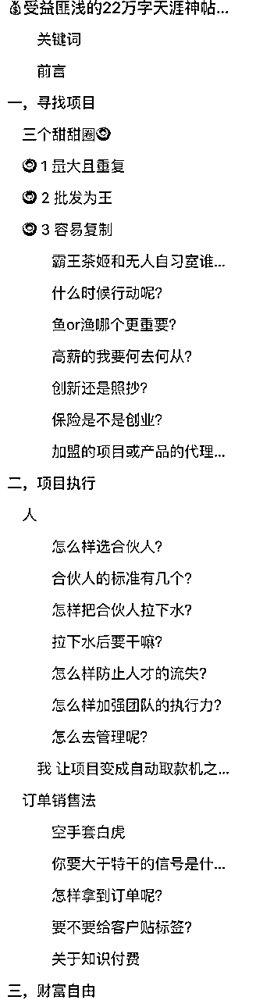
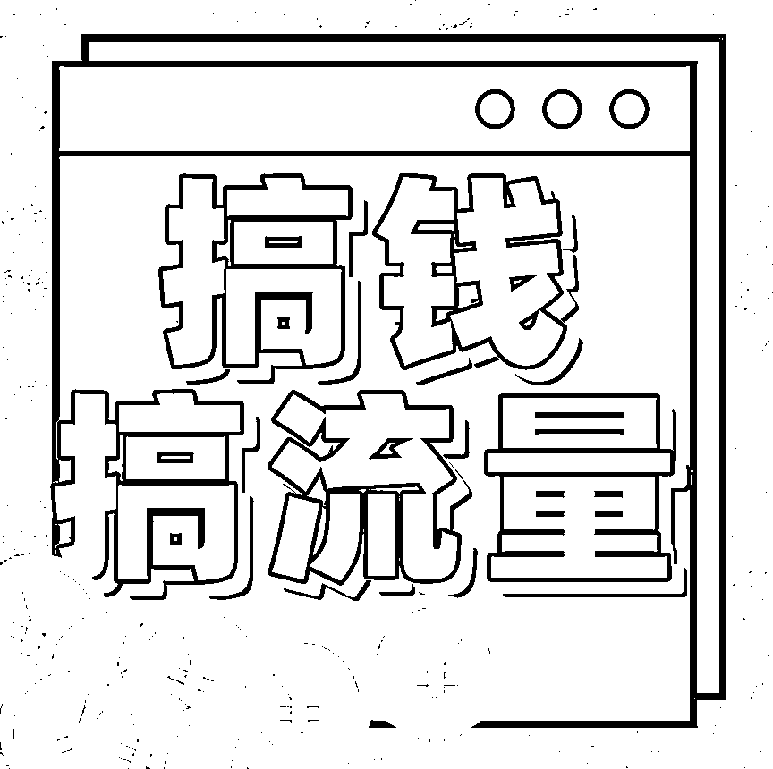
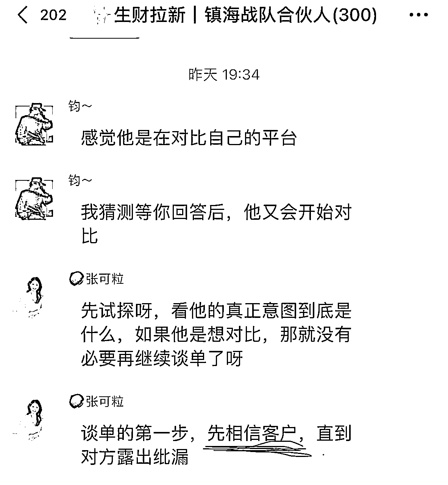

# 💰受益匪浅的22万字天涯神帖——手把手教你从无所有到财务自由

> 来源：[https://hjlrkivx2z.feishu.cn/docx/XrhldwO9koUTdWxaWaEcWChjnHc](https://hjlrkivx2z.feishu.cn/docx/XrhldwO9koUTdWxaWaEcWChjnHc)

### 关键词

销售 产品 客户 合伙人 分享 流量 案例 渠道 订单 财务自由 重复消费 经营项目 运营成本 开发产品 抖音直播 创业项目 创业公司 咨询公司

### 前言

👋你好，见字如面，见我发财🤑 我是搞钱搞流量的播客主当小时，原文很长，有22w字。是在 2010 年发布在天涯论坛上的。

天涯关了后我发现不管在抖音还是小红书，有很多人直接把这篇帖子的文字粘贴上去，或者文字转语音， 出了很多几千点赞的爆款。

我做了一个播客叫《搞钱搞流量》现在小宇宙差不多也有快上万人订阅了。

这里面收听时长和收藏点赞跟打赏都最多的一期，就是我分享的这篇帖子，也是我准备时间最长的一期。

原帖因为中间还夹杂很多网友回复，道理很系统但文字和顺序都非常非常杂乱。

我整个把他找项目、选项目和项目执行，到第三步财务自由中间做了一个梳理。

自己也会有一些实操性的经验，我卖过服务、卖过产品，也见了非常多的老板，访谈了很多嘉宾，看了很多生财的帖子，提炼了一些做生意搞钱的共性，把他古早的很多案例换成了现在更适合当下线上搞流量的案例。比如我最近采访的靠谱，可粒，王燕楠Nancy，陈龙。

大概前面花了整整三天来梳理内容，录了7h，最后剪成了3h的内容，后面回听发现非常适合生财的圈友们，于是决定再它梳理成文字（居然又花了7h）。就有了现在大家看到的这一篇更简洁的内容。读完这篇感兴趣可以听听播客，再看帖子，这样比较高效。

从一无所有到财务自由，说白了就是分三步走。

第一个是寻找项目。

第二个是经营项目，积累财富。

第三个是让财富增值。

听起来很简单，道理都懂，其实也很难。为什么简单？其实说明白点就很简单，谁都能理解。问题是这世界绝大多数人都不会去想，或者是想不明白。很多人就像一个 36 位数的组合密码，知道密码的人一分钟就解开了，但是如果不知道的人一辈子他都解不开。

你的创业动机是什么？

任何创业动机都对，创业的目的其实直白一点讲就是搞钱，而且我们希望的是搞大钱。

这篇就是针对一无所有的没有父母托举的东亚男孩女孩食用。

什么叫做一无所有，就是要资金没有资金，要资源没有资源。

可以照着抄的路径，非常适合收入不稳定，对未来有一定担忧或者是收入持续性很低的稳定，想要进行一些突破的人

# 一，寻找项目

1️⃣挑项目的三个标准

2️⃣你什么时候选择出来创业的时机和选择

3️⃣案例和提问，比如说写真馆到底能不能做？做证券经理人或者是保险的怎么做？我们看到生财上很多好项目和产品要怎么去挑选？

创业要像鳄鱼捕食一样。

什么叫做鳄鱼捕食？就是你在真正选项目的时候，不等到机会，你需要一直潜伏，等到机会就速下狠手。

就很多人要去做一个东西，什么调查都没有，他就直接投钱去干了，这个就非常不鼓励的。我们是需要宁愿在寻找选择中等待，也不能够去屈就，因为你屈就你选了一个不好的项目，你其实会在错误的路程当中越走越远。

那什么样的项目才适合一无所有的人呢？你要记得一无所有的人可是要资金，没资源，如果没资金的话，投入稍微多一点钱的项目你就需要 pass 掉了。

比如说你搞实体店这种肯定是不太好搞的，没资源的话你就不能靠这个关系，靠那个人脉了。

那只能靠什么？

对，靠你的勤劳和你的头脑。

做点小买卖。

你不要一开始就想搞一个很大的项目，最开始就是接地气的搞一点小项目，做点小生意，做点小买卖，专业一点其实就是两个字， 销售。

卖什么？

可以卖产品，把拼多多上面的东西拿到小红书上面去开个小商店去转卖。

也可以从 1688 上面进的进点货，然后到学校或者是医院的门口去摆个地摊。

也可以是卖概念。就是知识付费，也可以是服务，比如说做运营操盘手等等。

卖就是销售东西。

这个东西是什么？这个东西可以是你自己，比如说你去打工、做副业这种也算是销售。

总而言之就是要用你拥有的东西去换取别人的现金，因为你要赚钱，别人不可能平白无故地把钱给你，你要给别人一些别人恰好可能会需要的东西。

有可能你现在没有（毕竟设定开局就是一无所有），没有这些知识了，又没有这些产品，怎么样去用这个东西换到钱？

怎么样去拥有这些东西就称之为选项目。

* * *

怎么去选项目呢？

这里给到大家三个标准，这个是整篇重点，叫做三个甜甜圈。

我自己对这三点也会有非常多的启发，因为我也有一些失败的创业经历，你就会发现脱离了这三个，如果没有满足这三个标准里面的任何一个，你就是很容易开局就挂掉。

## 三个甜甜圈🍩

Sweet zone for making money

🍩 1 量大且重复

🍩 2 批发为王

🍩 3 容易复制

## 🍩 1 量大且重复

好处：

1.  有复购的话，你后面的运营成本和广告费用就会变低，你的利润就会变高

1.  后期因为有复购，你就可以用忽略不计的成本带来源源不断的现金

1.  你大量的精力可以得到解放，可以轻轻松松地赚钱或再去弄个项目做

反面案例：

如果你的量很少，又没有复购的话，会出现什么样的状况？

我们举个例子，刚开始做生意入局一无所有的你是会去卖卫生纸🧻还是会去买飞机✈️？

最早的时候薇娅卖过飞机还是那个罗永浩卖过导弹我记不太清楚了。

这个叫高手折柳都可以当做剑。

但是如果你是一个小屁孩，你武功很低，你学人家高手折柳的话，你就只有死路一条

武功低的人一定要找到一件厉害的兵器。

你们看直播间里面很容易起号的。大家都在卖什么？

卖卫生纸，有一个算一个，卫生纸的销量非常高，我认识有很多供应商的朋友，他们就是靠卖卫生纸来拉直播间的一个流量作为引流品的。

卫生纸你会有非常多的客户群，他会一点开花， 4 点结果。就好像你的朋友圈里面就是一个池塘，因为如果你没有从公域引流进来的话，你的朋友圈里面的人数是固定的话，如果没有复购，就卖完一波没有了，你就会更辛苦地去研发新的产品，会越来越辛苦。

尽管你很差，谈 10 个人别人都不买。没关系，你坚持下去总会有人买的，人人都有不向你买的理由，人人也都有向你买的理由。

比如说看你太敬业了，被你感动了，随便丢两个硬币给你，全当看你可怜，你看现在你就有收入了，你有了收入至少不死，从无所有到财务自由的第一步有收入，接着第二步你就可以收入渐增，第三步，盈亏平衡，第四步，组团忽悠，第五步你就财务自由。

怎么样去选择不同的渠道？

很多人会问现在平台那么多，我选小红书还是抖音还是视频号还是朋友圈还是？

其实很简单，你可以刚开始全都测一遍，先做 AB test，就四个组都是去做。

做了之后哪一个销售最好把其他三个组开掉，就留下这一个组，

其他三个组都像这一个组一样的去攻这个渠道，去卖这个产品。

有的人看到这些方式，会觉得这个方法很落后，不正统、不规范，小农思想甚至庸俗幼稚，但是我只能告诉你，非常有效，有很多人会陷入到创业的很多范式。

什么叫范式？一来就要把公司的规章制度设定非常标准。

我身边很多朋友很认同像一些 MBA 的那种创业的流程这样走，要很前卫、很高雅，要优雅地赚钱，办公室要装修得很漂亮。

其实你要规范干嘛？你只要赚得到钱，你要正统干嘛？你只要赚到了钱，你要钱位干嘛？你只要赚到钱，你要高雅嘛？你只要赚到了钱，因为你赚钱才是硬道，你什么都可以不要，就是不能不赚钱。

现在很多教创业的都是大企业，你看到的像网上很多定位分析、广告投放、营销策略都是给大企业做的，大企业是可以干嘛的？他们叫战略性亏损。

而你亏不起，所以你所有的注意力都要为现在赚钱，现在赚到钱而服务。

所以生财这个平台就挺好的，所有的帖子项目都很接地气，先从术开始，不要一上来就讲很多大道理，先干起来再说。

哪条路有效，就是坚定不移地走哪条路，复制哪条路，名门正派有名门正派的思路，有无名小辈的玩法。

像我们的播客也是，其实我知道有很多播客都是找的有很多知名的企业家、投资人，而我们播客采访的是什么呢？更多的是小商小贩怎么搞钱搞流量的，我们录播客的定位就是接地气。

有很多人他会觉得说我和访谈的嘉宾讲的很多的内容都太接地气了，因为我有一些很高大上的朋友们，他们每次见面都会问我，当小时，你为什么不去搞点大钱呢？为什么要专注在这些蝇头小项目上面呢？

最初起步的时候，你没有父母托举的东亚男女孩的必经之路就是你说我鼠目冲光也好，你骂我唯利是图也好，我们反正永远都要做着目前最有生产力（搞钱）的事情。

时刻记住你的目标不要弄偏了，很多人做着做着赚了一点钱就慢慢和初衷背道而驰的。初心变了，最初你创业你只想赚钱，你后面你赚到了一点点钱，你就想要做有派头的大老板，哈哈哈，你最初只想赚钱，后来你就贪恋规模和形象，派头大于赚钱，面子大于赚钱，规模大于赚钱，形象大于赚钱，这些其实都是非常不健康的搞法，迟早是要破产的。

## 🍩 2 批发为王

什么叫批发为王？就是找下家，我当然知道现在你只能搞零售，而且只能小打小闹的找下家做批发，但是不是说让你最开始就借钱去进很多货，去搞批发起步，我要说的是从生意开始之前，你要具备这样的思维，要有这样的认知和发展思路。

如果不符合这一条发展的思路，宁可不去做，也不要选择其他的项目将就，这一点非常重要，不然你的项目很可能会被你做成鸡肋。

久而久之，你连放弃的勇气就会失去，就有一些反面案例，我举个例子，有很多女生一想着说去线下开店就能，我要做一个服装店喽？男生的话就是去开一家炒菜馆，炒菜很好吃，你做着做着不上不下的，你做到后面你的发展前景你就会觉得其实只比你的工资高一点点，你是根本搞不了大钱的。

那这里对成功的定义是实现财务自由，那现实中很多的生意是不符合第二个圈圈的，就是批发为王。能不能搞到大钱从你下决心开始的那一刻就决定了。

其实我之前是从来没有考虑这个点的。我最早开始做摄影，虽然赚的钱很高刚毕业没多久就月入十万了 ，但时间就根本就没有批发的地方。

往好一点方面说，如果你的产品经销商能够重复消费，消费者也能够重复消费的话，你就不得了，就相当于你的下家和下家的下架都会不停地消费，这就变成什么大家都很知道的微商招代理很赚钱，线下招商加盟很赚钱，因为你的成长速度就是爆炸式的，你的财富增长也是爆炸式的，你的快感也是爆炸式的。

后面我们会讲到一些案例，不是说你不做批发，你就不能考虑做批发为王这个思路了，这个你其实是可以通过一些方法方式去改变你的属性的，比如说我最近访谈的生财的嘉宾@陈龙 副业做命理咨询师，怎么样让他重复消费呢？把一次的咨询变成了年度的咨询，客户在这一年内遇到什么问题都可以问而不是一次算命就结束了。

做操盘手陪跑，也是没有办法批发重复的，那么我怎么办呢？去专门给一些做招商加盟的项目做陪跑，那么相当于我的下家就是他们是可以批发为王的，所以我也能够间接享受到这样子的红利，这个只是给大家一个思路，不是说真的让大家去做批发商。

## 🍩 3 容易复制

你的业务结构要尽可能的简单、容易、快速、低成本能够复制。

我在不同的时间段都听到了无数次。在去年我们接了一个青城山的民宿项目，因为上山的时候不想自己开车，就打了个顺风车，我们在那个顺风车上面就一直在聊我们最近接的业务，我们后面要做的业务，我们这次上去要怎么去做这个民宿的项目 （先开个坑后面再填）。

那个司机就一直默默地从后视镜里面看我们，哈哈哈，他过了一会儿要到终点的时候，他就跟我们搭讪，他问我们是不是自己在创业，得到肯定的答复后他说那我送你几句话，把复杂的事情简单化，简单的事情流程化，流程化的事情系统化，再加上监督考核。

后面他说的那句话更有哲理、更深刻，那句话叫做骨肉血魂气魄战甲。拆开来叫做骨肉、血魂、气魄、战甲、战靴，

企业的人才搭建体系-骨，

企业的实体发展体系-肉，

企业的利润分配体系-血，

企业的文化建设体系-魂，

企业的团队文化体系-气，

企业的愿景目标体系-魄，

企业的安全稳定体系-战甲，

企业的运行建设体系-战靴。

这个大哥一开口我们就觉得不一样，真的不一样，高手在民间。

我就问大哥之前是从事啥的？他说之前是收购矿山的，一个项目十几亿。我后面又加了这个大哥的微信，看到他朋友圈里面全是在哪里打高尔夫，在哪里的海岛游，看得出来还是有点家底🤣也不好问是发生了什么来开顺风车。

#### 霸王茶姬和无人自习室谁更容易复制？

看真有没有真正掌握项目易复制这个理念。

你觉得霸王茶姬好像有很多家店应该很成熟，从数量上来讲是不是感觉好像更容易复制？

刚好 两者都做过调研，一直很好奇现在奶茶店的加盟真的赚钱么，跟一个加盟了半年霸王茶姬的朋友聊天，

她说是很不错，不用太动脑子，总部会把很多营销和培训都标准化，她只要每天开店就行了。听起来是还挺好的是不是。

但是你有没有想过霸王茶姬的店长需要是什么样的人？

她的反馈也是，店长很不好招，招了半天没有找到，所以她还是需要自己顶上店长这个位置，我这个朋友的父母是有十几家连锁鞋店的老板，她之前自己也开过服装店。 然后开店的成本用了150w，像她这样优秀的人表现出来的形式是还挺容易的准备，还在筹备开二店，但你想想其他人， 你能拿得出这样的资金和有这样的能力？

不说店长不好招聘了，就连她也跟我抱怨现在00后摇奶茶的员工非常难管，

常常心情不好一天就能做错报废十几杯奶茶😂

操作不好被总部罚款也不认损失只有她来承担😂

人才才是最不好复制的。

但是无人自习室的店长不存在。

我前几天采访了生财有几百家无人自习室的@楠姐，她之前做活动策划的，重人工，实在不想管人了转行做了自习室。

她的很多店长都是当副业来做的，人在上海深圳广州店开在三线小城市 白天还要上班 ，居然一个人也能远程管五六家店。

没有任何知识、没有文化，就算没有时间都可以做。

所以结论来了，霸王茶姬要开好一家店。要管理员工，要熟悉sop执行流程，还要有足够的资金实力去付加盟费。

无人自习室逻辑比霸王茶姬的要简单，所以他的项目对普通人来说更容易复制。

你的生意能否复制，能以什么样的速度复制，取决于一个条件，你培养出了多少人才，或者是更细致一点，你捆绑住了多少人才。

当然人才的概念是相对的，你的生意体系越复杂，你需要匹配的配套能力就越高，那么这个人才需要的段位也越高，你的生意的复杂难度也越大，你的生意体积越简单，你需要具备的配套能力就越低，那么这个人才所需要的段位也相对越低，生意复制的难度也就越小。

我们的目标是要轻松愉快地赚钱。

我们不是要被生意或者项目囚禁，如果没有条件，创造条件通过找下家把不能重复消费的东西盘活，那比如说其实直播带货，他可能虽然说看起来现在好像挺赚钱，但真的很多小本生意的人，没有背后的供应链体系所支撑，其实就是在用自己的时间和体力去赚钱，不能够重复消费，因为很多直播间的流量他不是靠你主播的个人魅力，没你没有 IP 属性，你只是靠这个价格低。

当时我们做抖音直播其实起盘挺快的。

就是用低价的库存的产品去起货，就好像现在有很多直播间里面靠卖卫生纸，但是你 a 卖卫生纸和 b 卖卫生纸，消费者只是去比价，他不会留存在你这里，他就没有办法可复制。

3 个甜甜圈量大且重复批发为王和项目易复制。三个圈里面的，也不是说你一定要三个圈都符合，因为三个圈都符合也轮不到你刚开始一个小屁孩就找到了这么好的机会，有两个能够符合就已经算是还不错的生意了，如果你能够想办法创造一些条件，或者改变一些模式，把你现有的生意想办法往三个甜甜圈当中的某一些去优化，那么能够取得成功的概率也更大。

* * *

#### 什么时候行动呢？

两种情况

1️⃣在你的思维认知范围内，对一个项目的考虑判断无法再提高的情况下，那你就尽快去尝试。

你如果你想一年都没有想清楚，那你不如就一开始想不明白就开始干，因为你干的过程当中你会有新的感悟。

2️⃣如果你刚开始你是对一个项目的判断和考虑是可以提高的，比如说你可以再去问一下这个行业的人，你多方向去对比一下，那么这个时候你就不要上来就做，你就还是先想。

所以答案不是非黑即白的，那么假如说你对项目的考虑和判断无法提高，你自己去做的话，你付出了努力，哪怕你当下没有想明白，没有收到任何的成果，但终究会以非物质的形式给你带来未来的价值提高。

什么叫做非物质形式？就是你累积的经验，你有了充足的准备和做事的能力，再加上下一次机会来临或者是势能来临的时候，那么你成功的概率就会更大。

比如说现在你考虑要不要做小红书？是想清楚了再做或者感觉小红书现在是不是很卷了？

其实这个时候你是想不明白这个问题的，因为下一个小红书什么时候出现？你是看判断不清楚的，这个时候你就是去做，就算在小红书上面没有取得成果，但是下一个，比如说小宇宙开始爆发的时候，有在小红书上面积累的一些经验，是不是就比纯小白更容易取得成功。

#### 鱼or渔哪个更重要？

没有经过修炼的人就保持着人类最初的天性，会表现出短视的一面，特别是小屁孩，这是令人遗憾的。为什么就像生财有术咨询项目具体操作的人很多，听讲大道理的人很少？

因为做了这个播客《搞钱搞流量》有些加我微信的听友，招呼都不打直接上来的第一句话给我发消息

我想赚钱，带我赚钱，给我介绍几个搞钱的项目。

我都怀疑它听没有听过，因为我反复强调虽然我们叫搞钱搞流量，但重点在两个“搞”，钱和流量只是搞得结果。

为什么会有那么多韭菜？忍住不割你真的很需要毅力。

韭菜们反省一下你们自己是不是因为太想要被骗，就你的诉求，只有骗子能满足。

说回来你到底是选鱼还是选渔？

如果你现在吃不到鱼，你就会饿死。毫无疑问，你选择打鱼的技术就是愚蠢的。

如果你现在还不至于为生存而担忧，不至于面临饿死的危险，那你还是去选择吃几条鱼的话，那也是愚蠢的。

那现在这个物质这么丰富的世界上，多少人的死亡是因为没有饭吃饿死的？

no，但是讽刺的是，就现在这个社会太让人浮躁了，大家刷生财都是看到人家 00 后月入百万的，

总是希望天上能够掉鱼下来，希望突然遇到救世主（知识付费的老师们），拯救自己与水深火热中，而自己可以什么都不做，这就是很多霸道总裁爱上我灰姑娘所幻想的。

很多人为什么会被割韭菜？也都是这个原因，佛只渡有缘人，只渡有慧根的人，佛只渡你自身可以修行的人，而机会只会光顾有准备的、头脑有沉淀的人，能自我救赎。

有了基础，练就了内功，你差的就只是一阵东风而已。而对于很多人来说，一天到晚都盼东风，盼着一夜暴富找东风，有没有问过自己，哪天东风来了？那是你的东风吗？你能接住这股东风吗？

很多人开始选择创业的话，特别是现在很多小朋友，他就会说，我有什么？我想要做什么？我想要做一个知识付费的老师，我想要靠知识付费赚钱，我想要做一个小红书，我想要开个抖音，或者说是我能剪视频，我能写字，我是不是就开去开个公众号。

其实一味地问自己能做什么？这个叫做固步自封。一味地问自己想做什么，这个叫做好高骛远。那正确流程是什么？

三个步骤，

第一个步骤，你一般先问自己想要做什么。

第二个步骤，看看自己能做什么。

第三个步骤，最快开始赚第一块钱。

举个例子，我们拆一下如何定目标，这个叫终局思维。

大家定目标也可以去听一下我们在 68 期的记事本圆梦讲人生规划， 就是从终局思维去参考，你最大的梦想是什么，你的墓志铭是什么，然后再倒推回来，你的十五年规划是什么？你的五年规划是什么？你明年的一年规划是什么？你再拆解到月目标日目标行动 TODO list。

比如说你想要一年赚 100 万，就和你想一口气爬 100 层楼一样，你先试一下自己的体力，入你一口气只能跑上 10 楼（目前一年能赚10万）。

那么你就要这么去拆，

你要一口气能上 100 层，是不是你得先具备一口气上 99 层的体力？

要上一口气上 99 层，你是不是得先具备一口气上 98 层的体力？

要上一口气上 98 层，你是不是得先具备一口气上 97 层的体力？

。。。。。

你要想一口气能上 11 层了，你得先具备一口气上 10 楼的能力，

而这个我好像正好具备，所以我下个目标就是要找一个 11 层楼拼命往上冲，直到体力锻炼到可以一口气冲上 11 层楼，这样一步一步，总有一天你就能够达到你想要的，这个就是站在未来看现在，你能够更清楚地知道你现在做什么，怎么做。

#### 高薪的我要何去何从？

那万一我其实是已经不是小屁孩了，我的工作拿到的薪资还挺高的是不是已经不是一无所有了，比如说已经月薪5万+了（其实已经比很多小老板的利润高很多了）那么这个时候我要何去何从？我要怎么选？

借这个机会的话，我们来聊一下，高新其实不属于一无所有的概念了，但高薪不等于富有，你要财务自由，只有改变你的思维认知，因为你最大的资产就是你的头脑，当然你的头脑也可能是你最大的负债。

因为人与人之间的差距就是思维模式上面的差距，是你脖子以上的差距。所以大家多看下生财的帖子，反复听一下认知提升的播客比如说我做的《搞钱搞流量》和@陈雪她们的《搞钱女孩》。

完全从高薪和低薪其实是没有太大的关系的，而是要看我们的思维在哪个级别。

跟你的学历也是一个道理，有的人的路他是越走越窄的。

如果你没有上过大学，你是一个中学毕业，甚至你小学毕业，那么你啥都可以干，做啥都行。

但是你如果你是本科毕业，那么你的选择面就窄了一点点，但问题还不是很大。

假如说你是研究生博士毕业，还海外留学，你见过几个人出来后会去摆地摊的呢？

你见过几个读到博士了还去选择跟自己专业不相关的职业，是不是要下很大的决心？

要去的地方就屈指可数了，学历越高，对赚钱的要求跟选择范围就越低，所以我们要探讨的话题的相似点在于，拿到高薪的人对于念书来说就是已经到了博士的阶段了，这些我们不去管他，我们要研究的是为什么有的博士他在工作中脱颖而出，成就了另外一番事业，而有的博士一直被公司套牢，当着金丝雀。

我去年在北京参加群响的线下大课，中途接了一个电话，十几年没有联系的初中同学，问我最近怎么样？

当时就想说是要干嘛呢？传销还是借钱（狭隘了）

因为已经很久没有联系了，先叙叙旧，她说一直忙着生孩子，已经生了三个小孩了。

我说这么幸福啊？那你老公是干嘛的？

她说是一个博士，研发了一些专利，然后自己出来搞公司马上已经要快上市了，政府也批了几十亩的地给他。

我打开天眼查一艘还真是。。。融了几轮了还是瞪羚企业。。。

后面我又去了她家的别墅，又带了正在合作的投资人去见她，才知道那个时候她给我打电话是在领导力的课，要完成作业联系童年阴影相关人（当时我俩一起被班上的同学霸凌😓）

说远了，举这个例子我想说的，其实是当时她老公要出来创业的时候，家里人是很反对的，因为在很多年前，她老公在中科院搞科研每个月到手工资就6万了，其实很多高学历高薪的人出来搞钱是可以收获更大的。

高端的人如果整合了高端的资源，往往会更有杀伤力。火药整合得好，可以变成子弹射杀百米之外的人。

像我初中同学的老公，对吧？同样的技术实力，他整合到的资源就会发现自己的技术不仅仅停留在科研价值，还可以创造生产力，产生财富，融资上市。

所以问题是这些高薪的人，他到底有没有往搞钱的这上面去想？

就是我的理解，打工之所以能够成功，是因为成功的条件之一是你的见解能力和你的角度。

但凡是打工就比较成功的人，他的视野其实是会更高一些的，是可以站在老板的角度来看待很多问题的，正是因为有了这种角度，才能够发现打工当中的一些不合理，能有积极思考，得出建设性的建议，所以才会得到老板的认同。你在打工过程当中取得的视野，就有利于你在创业中对大局的把握。

但是当然不绝对，创业成功的人打工应该也很成功，因为他的角度是站在老板的高度，不会说我没有这个，所以我做不成那个，而是会自己去想办法，去创造成功的一个条件。

在工作中在自己身边发生的机会更容易成功。

这个生意其实就是上游下游的关系，就像包工头一样，你是先想办法中标，想办法承包一个项目，你再去分包出去找下家。

搞钱要趁早，成功要趁早，因为越往后你的选择就会越来越少，负担会越来越大，阻力也会越来越大，到最后连放手一搏的勇气就没有了。

人到中年如果你上有老下有小，很多人是不敢辞职的，因为辞职就意味着没有现金流就会恐慌，像我有个朋友月薪3万还能辞职出来坚持半年才拿到 3, 000 块钱，不是每个人都能够有勇气去接受这个事实的，但这个就是成功必经之路，就是你在黎明前要走的漫长的无人问津的这一段。

所以创业是一种思维，是水到渠成的事情。这里有个判断标准，如果你计划 5 年后创业，因为有很多在上班的人说我先积累些经验， 5 年之后我再想办法创业。我敢打赌，五年之后你依然不具备创业的条件。那条件是什么？条件就是你的资源和思维啊。所以如果你的计划 5 年后创业，那你建议你现在就要开始用创业的思维来做人，做事，做副业积累资源。

是打工一段时间之后创业好还是直接创业好？

如果你像创业一样去打工，那两者之间可以通过创业先积累资本，如果而且你没资本的话，那如果说你从一开始就是奔着创业去的，又有资本之类的，你不缺什么你就可以直接干。

其实我是这么认为的，创业就像是在大街上开车，而在打工的话，就像你在驾校的开车。

你开始就车技高超，或者说是你是一个富二代，那你就直接上街撞了也有人帮你搞定。

但是如果你不会开车，你爹又没有资源，那么还是先去驾校训练。

什么时候可以开始创业呢？你什么时候学会开车了，你就什么时候开始。

所以后面又有人问啊？有很多人会说，诶？我发现了一个好项目，我发现了一个绝妙的创业机会。又是一个小屁孩在问这个事情，就是我发现了一个市场缺口，我觉得这个缺口非常巨大，能够赚不少的钱。

这里劝大家脚踏实地，不要好高骛远。有很多人看了几篇生财的帖子，几本创业书，读了几个创业课，上了几个创业培训班，就觉得自己也会了，看懂了，不找个和自己能力匹配的项目就开干。

这个叫掏起杀猪刀就要去屠龙，哈哈哈，就往这样子做项目就会撞得满头包，就是你不知道市场有多么残酷，市场最喜欢灭这种两脚书橱。

#### 创新还是照抄？

就创新对于新手来讲敌敌畏，不管你做流量，做账号还是做项目，为什么我跟很多人说你要做小红书，你得看你的同行是怎么做小红书的，你不要上来自己想一个体系，

我要自己写自己有感觉的。

我要开创一个赛道。

我要有自己的风格。

有的新人真的是。。。艺不高人还挺胆大

你要做账号找对标一样，你先抄先复制，你抄都抄不会，你自己做能做会吗？

有很多人真的是抄都抄不会的，因为你要保证你眼中看到的要是客观事实而不是感觉，很多人他看问题的角度是不全面的啊。

要挖掘事物的本质，而不要只看表面，这个需要眼力和段位。

就好像之前有个客户看到那些什么十年体命运开始转动的爆款，她问我是不是抄他的文案音乐剪辑方式就能火？

我说人家线上有结果是因为线下也有结果，这条爆的原因是60s浓缩了人家十年的沉淀。

你的眼力和段位根本就看不出来它本质上能红，到底是有哪些东西，你只能看到它的这句文案的开头前 3 秒它的封面，它的字体的选择大小，它在几点发布的这些根本就不是问题的关键。

所以这个时候需要干嘛？需要找咨询顾问，哈哈哈，大家如果有不懂的，你要看那些做得成功的人给你分享经验，或者直接请他当你的流量顾问，比如说我。

起号有三个步骤，不管你是搞流量还是搞钱。

1️⃣第一个定位

你不要自己去做定位，你要去看你的同行，你要去看他变现好、流量好的人。它是做的什么内容，卖的什么产品？你要去研究它的定位、它的基本知识，它的早期的积累，再对比一下你具不具备，你能不能够达到你这个对标，你的资历背景，拥有的能力、长相，甚至是不是跟他差不多。风格要一致，你还能够得着。

2️⃣第二点就是吸引客户。

你先要请教别人生意做得好的都是在怎么引流？他怎么引流的，他发什么样的钩子你就发什么样的钩子，这里钩子是指引流到你的私域上面的东西。

3️⃣第三个就是开拓市场。

好，就先你刚开始，小屁孩刚开始做的时候你不要浪费太多脑细胞，你先打爆一个单品，你先做一篇爆文爆款出来再说。

如果你已经做了一篇爆文，你只需要去复制类似的，再放手去干就可以了。

在把握本质的前提下先有效模仿，再适度创新。

记得是把握本质的前提下，如果你看不清本质，那你就付费去咨询。

一秒看清本质和搞了一年都看不透中间是可以用钱解决的。

这里又有听友问我

现在我看小红书上面很多他觉得人家那个那些摄影师天天玩得好，拍的照片又很好又很轻松，好像摄影我也很喜欢感兴趣用手机拍照朋友还夸我拍的挺好的，我是不是也可以去开个照相馆辞职出来做摄影师。

我最早就是个摄影师，而且不管粉丝量还是赚钱都已经算是相当成功，至少已经超越了那个阶段 99% 的同行。

但是现在的我来评价那个阶段的自己，绝对不是一个非常优质的创业项目，只能说当时我还挺有情怀，为什么这么说呢。

这个叫做同劳不同酬。

什么叫同劳不同酬？就是你跟别人付出了同样多的劳动，但是你拿到的成果却不一样。

就以我当时的拼命程度（全球到处飞经常工作完累得胳膊都抬不起来了每天去推拿按摩）和当时的运气（刚好踩中微博的流量红利旅拍和汉服的崛起），如果换一个满足三个甜甜圈🍩玩法，一定能够取得更多的结果。

你最后的结果，其实往往是最开始选项目就已经决定了的。

虽然当时的我有努力还有运气加持，但既不满足量大且重复又不满足批发为王还不能复制，月入十万已经是我的天花板了。

就有的人会去讲说创业要做自己感兴趣的事情，最容易成功了，就这句话真的不知道误导了多少无辜的热血青年。有很多人会相信这个说法，喜欢吃猪肉就去开了个养猪场，包括以前的我，就如果你搞流量，或者是你单纯为了红，为了名，OK，这个前提是成立的。

但是你真的要搞钱，就你再喜欢跑步，只要你跑不过刘翔，你的退役后生活估计都成问题。

你喜欢画画，只要你画不出蒙娜丽莎的微笑，你慢慢的连画纸和颜料都买不起了。

就你要想成功，你选择上就不能只凭喜好，要选择最有可能有前途的事情去做。

逼自己喜欢他，做一行爱一行。我给大家分享一个经验，我会发现我现在已经具有这个能力了，其实我在做流量咨询，包括现在我给一些企业做咨询顾问来讲，我最开始是没有想过我要做这一行的，我当时只是觉得我自己搞品牌、搞流量太累了，我做自己的货，我做自己的原创产品太累了，我先休息一段时间，刚好又有人来找我，又有人愿意付费，那我就先做着呗。

我当时做这一行的目标我定的是啥？我说我先做个几个项目，选一个赛道，我再自己起盘all in，我当时只是想要说帮别的老板去做咨询策划，去看懂人家的生意逻辑，我再去复制进入这个生意的赛道，结果我一开始做这个咨询，我就越做越好了，就又不停地新的客户找我还有发展出了一些第二曲线。

这个行业也不错，也很棒，又很有时间，又很有钱，又很轻松。这个就是你可以去刻意练习的能力。

#### 保险是不是创业？

这里又有人问，有的人会说我是一个证券经理，或者说是是做保险的，我是不是可以把我这个事情当做创业项目来做？

因为你会发现很多保险人他会把自己卖保险这个事情当做创业来做，你只要接触够多的保险人，所有的保险人都会告诉你说这个是无风险的创业，包括证券经理类似的职业。

这里有提一个问题，就每年有很多企业老板花几十万甚至几百万去报很多商学院，就像很多普通小孩会觉得像是传销，是成功学这样的课程，比如说领导力。还有生财，最近我拉新的时候发现很多从不知识付费的人也觉得这是不是传销。

那么请问就这些课程和平台本身而言，是不是上了以后就能够提高他们公司的业绩？显然不能，哈哈哈，包括麦肯锡、特劳特最顶尖的很多在内的全球任何一家咨询公司都不敢打这个保票，包括我，很多人来问我咨询，你是不是能够对赌，我花了这个二十几万的咨询费，你就能够给我带来 200 万的业绩？

显然不能，哈哈哈，那为什么还是会有这么多的人付费给我们呢？还是会有这么多人去花钱听课呢？

你为什么会买生财的门票？是因为你知识付费完了之后，你就能够马上赚到这个知识付费的钱吗？

不一定，大家肯定是想要把这笔钱再赚回来的，但是很多人并不能。

那为什么又有人会愿意花这个钱呢？

是因为他们相信自己能，你注意相信这个词是因为他们相信这一点，而不是看到了这一点或者真的能够做到这一点啊。

所以这里举的是那个证券经理人的例子，因为证券经理人他会觉得说你找我理财，我能够帮你赚钱，我能够带你赚钱，就是带客户赚钱的，这一点是一个大大的误区。

每个人都会有这样子的困惑，比如说做金融行业的，包括大家炒股，对吧？你觉得说只要能够获得好的股票，就能带着客户赚钱，客户就自己捆绑好了。

但是你有没有想过熊市和牛市是完全不一样的，还有券商的利益和客户的利益是对立的，卖保险你的短期利益和客户的利益也是对立的，解法是你要想取得长期的发展，先要断腕砍去你短期的利益。

那这行能不能做呢？其实经纪人是一个有积累几乎没有天花板的职业，但是要做好长期抗战的准备。

就我们以前提过，成功有两种模式，一种是自己摸索，第二种是学习成功者的经验。

这是为什么我们要去付费的原因。就任何一个朝阳行业都会有部分人觉得是夕阳行业，就像现在的很多直播，你真正问身在直播里面的人，包括我当时一小时能卖10w 为啥也关掉了直播间，当时我也会觉得没有前途，自己要做货还要卖，又要管前端又要管后端，女装退货率又高，直播已经是一个很朝阳的行业了，那么再明智的投资也有人会看不懂是一个非常愚蠢的赌博。

比如生财已经是市面上非常良心的知识付费平台了，但是有的人认知里面这个就是传销，是他的思维和眼光所决定的。

#### 加盟的项目或产品的代理靠不靠谱？

好，那么又有人问了，我想要加盟某个项目，我想要代理某个产品，我的朋友圈里面有一个人做什么什么项目，卖什么什么的减肥产品，或者是营养素，很赚钱，我能不能够去代理加盟这个项目？怎么判断。

如果你是做产品代理的，产品本身很重要，有很多人说，诶，我这个卖效减肥产品，卖营养素，客户每个月他只要吃了，他下个月就会再买，再买我就能够有源源不断的钱。是不是所有的直销招代理的时候都是这么讲的？但是你永远要记住，能重复消费的产品，不代表着消费者会重复消费。消费者会重复消费不代表他会来找你进行重复消费。

重要的事情说三次，

能重复消费的产品不代表着消费者会重复消费，消费者会重复消费不代表他会来找你进行重复消费。

能重复消费的产品不代表着消费者会重复消费，消费者会重复消费不代表他会来找你进行重复消费。

能重复消费的产品不代表着消费者会重复消费，消费者会重复消费不代表他会来找你进行重复消费。

而你要做的事情是什么呢？是如何让你的消费者来找你进行重复消费，这个属于阶第二阶段要谈的就是我们怎么执行项目，就算是再好的产品再好的项目也不是人人都能经营成功，只是说我们选到好项目相对比较容易成功罢了。

就好比给你一把机关枪，你虽然暂时不用去苦练心法、内功、剑术、刀法之类的，但是你需要基本的知道如何上弹夹、如何瞄准、如何射击，这些你至少应该去学习掌握。

那么如果做一个产品，你做着做着就在市场上消失了，只能证明你选择的产品有问题，你在选择前没有进行深入的调研，当然要排除天灾人祸的意外，但是如果一个产品市场反应很好，别人都做得红红火火，但是同样的搞法你却搞垮了，那说明什么？

事实上这种情况其实是比较小的，在这种情况下差距往往是好和很好的差距，而不是很好很差的差距。

因为这个世界上有 20% 的人是佼佼者，为别人打工或者自己创业都能成功，还有 20% 的人是落后者，为别人打工或者自己创业都会被淘汰，剩下 60% 则是大多数的普通人，为别人打工尚可勉强度日，自己创业则凶多吉少，创业是少数人的游乐园。OK，我们怎么样选项目就到这里了，下一个第二个阶段是怎么样执行项目。

# 二，项目执行

选项目我们讲了三个甜点圈，量大且重复批发为王和项目易复制和怎样去选择创业的时机和形式和举一些例子。

在执行项目里面主要是有两方面。

第一个是人，这里面人有你的团队、合伙人、员工和你的客户，包括你自己。

第二个是销售，你怎么样才能拿到订单？你怎么样才能够卖得出产品？你卖不出去怎么办？如果你产品滞销了又要怎么办？

## 人

#### 怎么样选合伙人？

首先你要选什么？选合伙人，首先结合我们的经历和经验，非常有代表性，非常重要，而且有一定的参考价值，做事情的话其实我们很简单就一个原则，就是你在每时每刻你都要做最有生产力的事情，

刚开始没有项目的时候，你在选项目，你就是最有生产力的事情。

但是如果我们已经选到了合适的项目的时候，最有生产力的事就是去找到合适的人才，然后邀请他入伙一起经营本项目，走上正轨之后脱离了具体的管理，以后的话你每年都可以坐地分赃，然后再去找项目，再去找人，循环往复，其乐无穷。

哈哈哈，所以一直认为找到合适的人去做合适的事情，成功基本上就被你内定了。因为所有剧情的事情都是由人来完成的，所有的问题在执行项目上所有的问题最后都是人的问题，是事情对了，人也对了，世界自然就美好了。

说起来简单的不能再简单了，但是复杂起来可能你一辈子都不明所以，因为人是世界上最复杂、最难懂的生物啦。

那什么叫做合适的合伙人呢？

很多人创业初期对于合伙人是没得选的，往往就是我有个好朋友，他也想创业，那我们一起就合伙了，我的闺蜜也想搞这个事情，我们就一起开了一个美甲店，或者说是我跟兄弟一起喝了顿酒，大家都对现在工作不满，不约而同第二天辞职出来就一起干了。

那其实根本就没有选择，如果实在没有选择的话，你就要注意具体的分工、性格、互补、项目预测很多方面的问题了，不然事业的长久性就很差，那所以项目因为创始人之间的内杠而流产的很多，这里其实只是讲如果你有的选择的话，你要怎么去选人，你如何选择的问题。

但其实大家都会说，诶？我是不是没有这个选择？其实你只要有这个思维，你都是有的选的啊。那什么样的思维来听我慢慢地分享啊。就因为你的目标是什么？你的目标是有一天自己能够从这个项目里面具体的执行中脱身而出，让该项目自动地运转成为你的税后收入，所以你要选择的人会慢慢地成为这个项目的最终管理者。听起来这里是不是还挺高端的，不像小屁孩能做的事情。但是我相信你有一天一定能够做到的，因为最初的选择决定的最终的结果，只要你的方向对你的执行跟得上，这个真的是可以有的。

定位很清晰了，你就是要选择一个现在能够冲锋陷阵，能够独当一面的人。

好的选择是成功的一半，对你这个项目来说，只要这个人选对了，你就成功了一半。这样的话又有个问题来了，世间的项目非常多，每个都不同，自然要匹配的能力要求其实是不一样的，那大多数的项目的核心在于什么？最开始 80% 的项目的核心能力在于销售能力，能不能够拿到这个项目，拿到钱。

还有一些项目的核心是在于说是专业技术方面的，项目的侧重点不同，那你需要的武功的侧重点也不一样，而且项目的前期、中期、后期所需要的配套能力也不一定相同，很难一开始就找到共性贯穿整个过程。

但是困难不意味着不可能，我们一直都在讲说我们先开始要找共性，那么我们来分析，首先这个人他为什么要跟你搞这个项目？你觉得你找一个合伙人，那他入伙大部分人的答案，他为什么要跟你干？

大部分人答案就是为了赚钱，而且是为了赚大钱，至少是比他之前赚得多的钱。

人的潜力是无限的，只要他想，他愿意，他一定要，那么就没有什么东西是他学不会的，没有什么能力是他不具备的。这样说你真的想要做播客？你会愁找不到嘉宾吗？像我这么内向的i人都天天混各种付费圈子找有货的老板和操盘手。

你要真的想谈恋爱。你真的愁找不到对象吗？只是说你没有那么想，至少天上没掉下来之前你还没有那么想。

人家没有把钱送到我的面前的时候，我还没有那么想要去跪着接下来。

而且你要知道，我们不是说非要做一个跨国大企业，全球 500 强，所以也没有那么多高深的能力需要我们去具备。记住，我们不是要去屠龙，我们只是杀猪的，我们刚开始都是普通人最容易做的小生意，项目不是特别离谱的前提下，只要你找到这个人，他的主观能动性足够强，再加上在实战的过程当中研究尝试。

#### 合伙人的标准有几个？

1️⃣他要有对金钱的欲望。

因为他不想赚钱，他是根本搞不到钱的。钱怎么会来到一个不想要它的人身边呢？那么多人排着队想要它。

2️⃣学习能力要强。

因为你在创业的过程当中会遇到很多很多搞不定的事情，如果这个时候他都要等着你学完之后教他，那么你还不如去招一个员工就好了。

3️⃣品德要好。

前面两个标准学习能力和对钱的欲望都比较好判断。那么什么叫做品德呢？怎么知道他的品德好不好呢？那其实在这个搞钱的系统里面，这点其实是蛮重要的，千万不要因为麻烦就忽略这一点，你完全可以多花一点时间去接触以及了解他周围的人，其实是很好的判断的，就是需要多花点时间和心思。

就这 3 点，很多人会觉得说这 3 点选合伙人的标准有点搞笑，太过随意，太过平凡。什么叫做学习力要好，品德要好，要对钱有欲望？

但是天底下没有太多的新鲜事，这个就是朴素的赚钱道理，好好体会一下这几个标准，你会发现真的不一样，勇敢地用会有惊喜的。等到你成功地运作了这几个项目之后，你就会发现这三个标准的精妙之处。

需要补充一点的是，选择合伙人，不是招聘员工，不能混为一谈，而且这三个标准其实是相对的，并不是绝对的。

如果你的忽悠能力足够强，你找的人不必刚开始就很有赚钱的欲望，因为你可以忽悠起他激发起他的赚钱欲望，富二代都能跟你玩命天涯。

如果你的教导能力和耐心毅力足够强，你找的人也不必学习能力够强，你也能够一点一点的带他。

如果你的同理能力和洞察力足够强，你找的人也不必非常有道德唯才是举，也能够殊途同归。

#### 怎样把合伙人拉下水？

怎么样让这符合这标准的几个人能够被你拉下水呢。

你要知道你看好的项目别人不一定能看好，所以基本上把合伙人拉下水，为你心甘情愿地卖命是不太容易的事情。

特别是一些本来他就很牛的人，为了参与的项目还要放弃他原来的东西。

比如说你要说服他辞职陪你创业，他要放弃的是他的岗位、薪酬、机会、成本、所有，所以很困难。

那么怎么样实施你的阴谋呢？哈哈哈，其实我们讲是阳谋。

人的动机只有两点，就是趋利避害。

要么就是追求快乐，要么就是逃避痛苦。

哪个是主导呢？你觉得人的动力哪个更强一点？是痛苦？是的，逃避痛苦视为主导的。拿纸写下来，并牢记这一点，未来的你将高潮迭起，获益无穷。

如果他觉得做一个选择需要放弃原有的东西，而未来很可能不会带来快乐的时候，他就不会选择继续了。只有他确信未来的收益可能远远大于现在所拥有的，他才会放弃现在的东西去追求未来的收益。

这里的关键词是远远，比方说你要找的人现在本来就有一份不错的工作，假如说我们月薪3万，好了，你让他辞职，跟着你从零开始干，如果保守的告诉他这个项目天花板也不是很高，还可能会血本无归，可能搞得好的话一个月也就能够赚个三四万，你放心好了，大家都不是脑残，不会为你破釜沉舟的。

那么你最初要做的事情就是做两件事情，一方面告诉他我们刚刚上面说的趋利避害，一方面告诉他你现在工作通过研究升职潜力是比较有限的，而且你都 35 了，对吧？

中年危机了以后，通货膨胀、物价上涨、生老病死、天灾人祸等等负面的事实让他感受到生存的压力。

现在工作上面的小成果而不勇敢地去追求财富的最大化，简直就是慢性自杀呀。

不突破现在就会痛苦，未来会更加的痛苦。

不仅我们在招合伙人的时候好用，你卖副业和代理的项目也是非常好用的，这个就是在加大他的空痛苦，让他有辞职大干一场的动机，让他痛苦了。

你接下来要干嘛？要给他快乐。

给他解药，就是帮他消除痛苦，给他追求快乐的途径。所以接下来另一方面你要做的就是把项目规划好的方面、光辉灿烂的方面一一呈现在他的眼前，尽量图像化，对，尽量不要用过多的比重去谈风险以及负面的信息，只能大幅的渲染，极有可能成功以及成功后的风光无限。就是这个啊。你有没有发现其实跟你卖课买知识付费道理都是异常的相同。

尽管你可能不是巧舌如簧，但是坚持你这个思路就是趋利避害，你会收获意外，你会神奇地发现，居然很多牛人都会被你打动，哈哈哈，而且会抛妻弃子跟你背水一战。

别认为这是没有技术含量的，忽悠，你去看一下历史，你去看一下现在周遭的事情，你会觉得这才是大智慧。你见过以往的大将军都是这样忽悠部下卖命的吗？

你看打土豪、分田地这种画饼的智慧，作为领袖是必须具备的。要让人家更加幸福和接受你的观点观念，用举例子和讲故事来佐证的方法总是能够事半功倍。

千万不要只讲道理，你千万不要给他讲说啊？你 35 岁了，你看你现在有没有什么前途，大家不知道吗？他自己能不知道吗？但是你说谁跟你一样也 35 岁，也是个程序员，他之前的月薪3万，现在创业了，出来跟着我们干，加盟了我们的项目。那他现在已经月入百万了，而且他现在正在马尔代夫度假，是不是听起来就非常的令人上头？

你看那些卖保健品的套路，大家上去讲那些故事，你去看那些招商会上面的买家秀，包括周处除三害里邪教洗脑说自己之前得了癌症的，是不是都是同样的道理？都是讲自己的故事，千万不要只讲道理，用举例子和讲故事来去作证。

好，终于在你的蒙汗药加砒霜的猛攻之下，这个牛人一咬牙一跺脚，放弃所有，跟随于你，信心满满地准备大战一场了。这个时候要怎么样？

#### 拉下水后要干嘛？

要冷却人。

这个时候项目要即将拉开序幕了，你们刚刚知识付费完了之后进入训练营的第一天干嘛？

比如说你报了一个稍微贵一点的小红书训练营，你在交钱之前都是说告诉你说，小红书多好做，你只需要做 21 天，你就能够月入百万，容易对，你进去训练营的第一天就会说没那么容易，你要学拍摄、剪辑、选题、定位、找对标，还要学会选品，你还要学会做售后，你才能搞到钱。

在项目刚开始拉开序幕，大家都情绪高涨的时候，你作为项目的发起人、创始人、领袖，或者是知识付费的领导者、老师、讲师，你要考虑灌输一个词汇叫什么————困难。

因为大家已经进入你的训练营了，已经开始做项目了，对吧？婚前婚后不一样，哈哈哈，现在你要把风险和困难的意识灌输给大家，降低大家对这个项目的收益和时间的预期，不能像刚开始那样夸夸其谈，只提胡萝卜，不提大棒了。

因为人在不同的状态下，他对困难承受能力也是不一样的，他是心理预期和心理落差，如果他没有什么希望，没有什么预期，情绪也不怎么激动，按部就班地去做一件事情，可能会让他扛得起一些困难。但是如果他预期一件事情很快很好就能够得到结果，摩拳擦掌地去做，结果很可能被一个小小的拦路虎吃掉，好像说我们刚开始带你们去做线上小红书一样，对吧？刚开始我都会给你们讲做操盘手运营其实很好做，一下就收了客户20w，马上做起来了每个月还有项目分成，你要做播客是吧？播客很好做，你看我随便录了几期这已经1w 粉了。

但是当你真的要做，我会告诉你什么？我告诉你没那么容易，前面的黑暗很长。

对，你至少要写够 100 篇。为什么？

因为激情一旦遇到小困难，就会产生愕然，同时产生失望，这种惊愕和失望会有加速度的，这种负面情绪会如疯长的野草一样占据你的心灵，慢慢地你就对项目失去信心了，慢慢地你就对小红书训练营不抱期望了，慢慢的你就不想开始再录播客了，信心没了就什么都没了。

那开始强调这个项目好的预期是为了拉他下水，拉他加盟，拉他进行训练营，对吧？现在强调项目的困难预期，目的是为了增强他抵抗困难的免疫力。有人会问了，那降低了预期还做什么？本来我们做小红书就是要出名，就是要搞大钱，我们出来创业搞项目就是要赚钱，没有预期还不如回去打工，你应该这样去理解，降低预期，不是说结果有变化，我还是会搞到钱的，只是让你清晰地认识到困难的存在。本来他以为轻松的 21 天就可以涨个1万粉，轻松的一年就可以搞个 100 万，现在的目的是让他理性地认识到这个过程充满了挑战和困难。预见到的困难，遇不到的困难，但只要狠下一条心，都能克服的，只要能够披荆斩棘，客服遇到的任何困难，一年两年还是能够赚到 100 万的，我们坚持努力发购 100 篇，还是能够涨到 1, 000 个粉的。

道路是曲折的，前途是光明的。

重点在于不要放弃，连放弃的念头都不要咬啊。

简单来说，前后的对比开始让他沸腾，现在让他冷却，一阴一阳为之道牛好。那么冷却之后又会出现什么样的问题呢？

冷却之后有的人可能会不想做了。

#### 怎么样防止人才的流失？

冷却后怎么样防止人才的流失呢？怎么样让别人买了你的课不给你差评呢？

首先我们要提高对方的抗压性，同样的业务在同样的阶段，为什么有的团队的抗压程度高，有的团队一风吹草动就坐鸟兽散，两个字使然，就是希望。那如果人的希望是能够赚到钱，所以有希望的时候，尽管现在我们情况不乐观，我们尽管现在三个月只能搞到 3, 000 块。但我们坚信未来能够赚到钱，你也可以说是信念或者说是预期，所以有希望就能较大程度地抵抗现在所受的磨难。

而如果没有希望了，就一分钟都不能够坚持，哀莫大于心死，这对于绝望的人来说，任何一根稻草都能将它压垮。

作为团队管理者就最重要的工作之一，就是一系列的做法举措，让团队内部都能够时时刻刻具备希望。所以你要做的事情就是以此为根源，衍生出不同的管理措施来让大家坚持信念。

积极的事情要多做，影响士气，希让希望变弱的、消极的事情就要杜绝。比如说我观察到靠谱给生财的拉新战队里，就如果说谁卖出去了一个，马上发表情包表扬，发朋友圈大肆宣扬。

还有跟我们团队内部的人分享我是怎么卖出去的，给大家传授经验。

每笔奖金要在公开的场合以现金的形式发放，偶尔要一起看一些励志的电影啊。

销售的培训过程，你可以自己躲起来哭😭一下，但是在团队里面绝对不可以出现消极负面的，比如说叹气、抱怨业务难做、消极怠工之类的。

相互监督，就一旦出现这种状况，乐娟一杯奶茶一杯咖啡给大家买咖啡，增加一个对赌，如果真的想要搞钱的话，好，那么合伙人、员工、客户之间的关系就要维护好。

这些关系有两个基本原则，就是二八法则和情利法。

早一点的成功学或者说销售类的书都会讲到这个东西啊。利益是恒定的，你关系越高，你就需要用情感的关系来维护。如果你的关系是比较底层的，情谊的比重就越小，那么法的比重就会越大。

比如说你的合伙人，你就需要用请去联系它怎么来谈这个情，就是怎么样去捆绑这些高层的关系，怎么样跟合伙人之间捆绑住呢。不要问别人为你付出了什么，而要问你为别人付出了什么。不要要求你的合伙人对你好，你要先要求自己对你的合伙人好，你想要得到什么就必须付出什么，这个也是宇宙万物的基本规律之一。

我们去看任何类的致富类的书，比如说后面我会想要跟大家分享的能断金刚的种子法则 ，你播出好种子，你就会收获好果子。

这个世界上其实处心积虑去伤害别人的人很少很少，而受到别人的伤害还能包容别人的人也很少很少，大多数人都是普通人，就是别人怎么样对你，你就怎么对别人。人不犯我，我不犯人，人若犯我，我也犯人。

所以很多朋友的人际关系不和谐，就是把自己看得太高了，注意力放在了别人为什么这么对我，而不去思考，先思考自己拥有什么，先付出什么。一般而言，其实你只要全心全意地对别人好，你的合伙人自然也会对你好。你对别人如朋友一般好，别人也会对你如朋友一般好。就有的人很喜欢占小便宜，但是你要知道你耍小聪明，你不管你的演技再高，那都是表面上的东西，你会被人发现的。

其实讲到这里大家都会觉得说，已经不是在谈我们要怎么执行项目了，而是说如何做人。

做人和做事是相辅相成的，人做对了事情就自然能够对，事情经常能够做对，做人也不会差到哪里去。

因为每个人的心里面都会有个天平，你的合伙人会，你的员工会，你的顾客也会，他会不断地把你放在那个天平上面去衡量到底是加分还是减分，包括你的男朋友、女朋友都会加分，或者在对方心里面是起是落，你无法控制，但是你可以不断地加重你在他心中的分量，就是去投入。

#### 怎么样加强团队的执行力？

又会遇到这样子的问题了，对吧？

我的理解是谋定而后动，按部就班。执行力该强的时候强，该差的时候差，这才叫智慧。

不是说我们一直要执行力很强，你说没有执行力怎么办？

其实这个问题的话是可以理解为执行力该强的时候强不起来怎么办？

因为强扭的瓜不甜，就如果你的合伙人没有被激励起来，你硬要去掰他，这个是不能够长久的，你要去找到他的根源。他为什么执行力不强？大部分原因是因为他没有动力了。那他为什么没有动力？不够快乐，也不够痛苦。他没有欲望。

那为什么没有欲望？是因为他没有需求。为什么没有需求？

这个就是重点了，凡事多问几个为什么，多几个为什么之后你才能够找到重点。那为什么没有需求呢？

其实要么就是你认为的需求，只是你的需求，而不是你的合伙人的需求，也不是你员工的需求，不是执行者的需求。要么是这样的需求不足以抵消在执行过程当中遇到的困难，这就叫做需求不够强烈。比如说我是想赚钱，但是我在销售的过程当中，我觉得被拒绝的这种痛苦成太更难。已经高过了我想挣钱的欲望。

所以你想要执行者的执行立场，你就必须直接或者间接地把执行和他的需求连接起来，这样子的话，不用你的激励和监督，他的执行力都会特别强。而你的智慧在于说选对一个方向，然后将执行和需求连接，并不断地放大他的需求，那么事情的结果往往是开始的，选择比你最后的努力会更重要的。

举个例子，你要选同伙跟你一起去抢银行，你会选谁？大部分人都不会去跟你抢银行对不对？但是如果他的家人得了绝症，不凑够这几十万的医药费，他会不会去以身施法？或者是他自己得了绝症，他会不会去贩毒？像绝命毒师？像那个我不是药神，对吧？

首先你要找到需求特别旺盛，跟你想做的这个事情能够去结合，你需要做的就是不断地放大对方的需求，高明的一点的人他是可以给其他人制造需求的，而然告诉他们怎么去满足这个需求。

或许又会有人会说我自己比较懒，执行力也不强，咋办？

哈哈哈，我现在不是教别人执行力强不强了，我自己有时候都懒得搞钱，怎么办呢？

我有时候也很懒，我就是不想发播客中间停了一个月，也不想写生财的帖子，中间停了快一年。

哈哈哈，那怎么办？很简单，就是不断地给自己制造需求，比如说我们给自己定计划，我们要给自己加强，说不断地加强潜意识，就非要得到这个东西不可，我就非要他妈地做到播客一万个粉丝不可了，不然我就活不了了。

我马上给自己买了一张生财航海家的票，我非要把这个门票赚回来不可了（然后就有了这一篇帖子）。

那就是不断给自己心理暗示，不断地加强这件事情的意义。

就你在做一个项目之前，你一定要想清楚你为什么而做？比你去看很多，怎么做要重要得多。你为什么要创业？你为什么要选择这个项目？你为什么要做小红书为什么要加入生财？比你怎么去做小红书、怎么创业要重要得多。你为什么想要搞钱？是什么和怎么做？更重要的是知道为什么做。

不断地给自己制造需求，久而久之你习惯性的只要你的目标或者是这个需求没有达到，你的心中就会有根刺，你就会奋斗不止，执行力超强。

对于我自己来讲也是屡试不爽，最早我要去做摄影的时候，我就会不断地给自己洗脑，我的梦想就是要环游世界，我就一定要环游世界，我当时跟很多朋友说我要去环游世界（虽然那时候我朋友都笑而不语），所以我就会不断地想我要怎么做？我要做出哪些努力？我自然而然的就会非常有动力去发微博找人、去拍照搞钱、去研究一些攻略。

#### 怎么去管理呢？

你的下属里面会有一些需求和欲望特别强的，有一些不怎么强的，

开创性的团队和服务性的团队价值取向是不一样的，作为打工人你是选初创公司、创业公司、小公司还是选大公司？你的价值取向是不一样的。一般来讲你在初创公司里面你是需要有狼性的。

你在你在初创公司或销售岗位来讲，拓新业务的时候，你是需要有狼性的，而你在大公司里面做一颗螺丝钉，或者说是你是只是一个客服售后服务型的团队，是需要有羊性的。争取客户开拓市场需要狼，服务客户维护市场需要羊。

工作性质和工作内容是不一样的，所以你管理的思路和手段也需要不同。那么如果说开拓性的团队是需要不断地制造需求，引导需求，通过激励、刺激捆绑员工的话，那么服务性的团队则是要温水煮青蛙。要打造一种企业文化，要有一种独一无二的企业氛围，让员工满足在这种工作状态下，依赖于这种工作氛围。就你自己在找工作的时候，你也需要明确自己的需求，你到底是不是适合创业？你到底你自己本身是一个羊还是狼？你如果只是一只羊的话，其实你是不适合进入丛林法则里面去厮杀的。

分享完怎么选人和管理，接下来需要对你自己提出一定的要求了，你需要有什么样的素质？你才能够创业，才能够去做好项目的领袖呢。你怎么样让这个项目变成自动取款机？

### 我 让项目变成自动取款机之一——做好项目群领袖

What kind of abilities do you need to possess?

🍩 1 视野

🍩 2 彪悍的心灵

🍩 3 平衡

10 个人会说出 30 种需要满足创业的素质来。素质这个东西就跟韩信点兵一样，多多益善，你需要具备非常多的硬技能加非常多的软技能，再加上每个人的基本条件都不一样，对于创业成功这个点来讲，素质也是很难有必然性的。

因为你的定位问题，所以勤奋、专业能力之类的，你其实是不需要比一个一线的员工强很多的，比如说我现在剪辑能力就不如我们后期了。

幸运的是这些也不一定是你一定需要具备的，比如说你搞汽车修理维护的生意，你不一定非要会修车，你开互联网科技公司、游戏公司，你不一定非要绘画、原画会做编程，对吧？很多因素你都不一定会比其他人强，但是在我的系统里面，我认为三个非常非常重要的要求。就是说这三个要求你一定要强于一般人，而这三个要求也是一般人很难修炼的，当然你也不是非要现在就一定要具备，但是你要有意识开始去修炼这三个功能，当这三个功能一成，你就会威力大增。这三个传说中的神器到底是什么呢？

1️⃣第一是视野。人们只会追求难以得到的东西，如果相信你能帮他得到，他就会追随于你。

而假如你招来的人眼界和视野都不幸地高过你的话，他就会对你失去敬仰，你在管理起来就很费劲了，他迟早也会离你而去。

比如说我们在销售的过程，对客户也是同样的，永远要给到她的诉求再往上一层才容易成交。

假如说我们的线上运营陪跑客户的诉求他只是一个小白，只是想说我能不能做好一篇爆文？我们会跟他讲什么？我们会说你怎么只能够追求一篇爆文呢？你要去想你有 100 万的粉丝，你要追求涨粉，你不能仅仅只停留在一篇文章的流量高上面。

那如果说他的目标诉求，他的需求，他的视野是停留在我要做到 10 万粉丝，那么你要跟他讲什么？你怎么能只涨 10 万粉丝呢？那这些粉丝来了，看你要引流到你的私域。

那如果他说我的诉求就是给我的店铺引来流量，给我的私域加 1, 000 个人，那么你就要说只加人怎么够呢？一定要变现了。

1, 000 个客户算什么？我们要冲到变现的 10 万，我们不仅要涨粉 10 万，我们要变现 10 万。

如果他说他的诉求就是给我的业务一年多增加 100 万，那么这个时候你要干嘛？

100 万小事情，我们不仅能够给你做流量、做变现、做引流，我们还能帮你招商加盟，我们还能给你复制你的模式，复制 10 个你出来。

这个就是视野哈哈哈，所以在销售的时候也是根据客户的目标去调上一级的，那这里的视野我们更多的是指精神上面，而非物质上面的价值，而什么叫做精神上面的价值，而不是物质上面价值？比如说你炒股，很多人炒股是为了什么？他炒股的终极核心底层逻辑是什么？赚钱，赚钱只是结果，他为什么会去花钱购买股票？他炒股炒的是什么？炒的是预期。他炒的是我觉得这个东西会涨，他才会去购买这个，视野就是第一个。

2️⃣第二个是你可以没有彪悍的身躯，但是你必须有彪悍的心灵。

你彪悍的心灵是拿来干嘛的？——受伤。

这点是用来处理困难、瓶颈和危机的，危机会淘汰一大部分的人。

任何事业，你哪怕卖一个包子，你摆个地摊，你做一个小红书账号，你都会遇到或大或小的困境，甚至是绝境。你可能半年都没有涨一个粉丝，动不动就被封号。你如果没有彪悍的心灵，你是撑不过去的。

如果是可以撑过去，却因为你的心灵不够强悍而倒下了，这个时候就是百万负翁和千万富翁的差别。负债的负，本来你是有机会可以翻盘的，但是你撑不过黎明前最后的那点黑夜了。

3️⃣第三个点就是平衡。

阴阳调和，人生整个关键词，我最近看很多书写的他人生中最大的一个关键词就是平衡，包括和一个印度的瑜伽老师聊，我更小的时候也没有办法理解，经历的足够多之后感悟会更深。

你看你把项目的发展看作是顺境和励志相互结合的话，你要充当的是调和剂，当顺境时你需要谨慎，当逆境所有人都觉得不行的时候，你要给大家加油打气。但是如果所有人都觉得，哇，这个事情太好了，太盲目乐观的时候，你需要去做一些备选的方案。

那怎么样？因为这个是事情，或者说是这些趋势来讲都是从动人是主动性的，你是可以有选择的，你能够去经得住顺境的诱惑，经得住逆境的磨练吗？

很多人在赚钱，包括我，在赚到第一笔钱的时候都飘了，觉得自己能够一个小时挣 40 万，之后我再第二个小时我是不是可以赚 400 万？但啪啪打脸、翻车翻得很快，当你起得很快的时候，如果你没有这个能力接住他，你翻车也翻得很快，那么你能够成熟。

我一个小时挣到 40 万之后，因为一些事故我后面半年就没有挣过一分钱，但是那个时候我是在规划，盲目乐观说我要怎么扩张，我要怎么去增加我的员工，增加我的流量，随之而来的很长一段时间就没有生意了，就是怎么去经历顺境的诱惑和逆境的磨砺呢？就有一句话献给大家，可以让你的心态趋于平衡，那就是一切都会过去，一切都会到来。

## 订单销售法

也会跟大家提到销售我们怎么样去定计划？销售怎么样给客户去贴标签，然后销售不出去怎么办？销售时怎么和客户沟通？

到销售第一步要做什么？做计划，做卖，直接卖，哈哈哈哈，就动起来，先卖后做。有很多人都会有这个误区，大家会一头心思的研究自己的产品，研究自己的课程。闭门造车半天卖不出去。应该先卖出去之后验证成功了再去做产品。

不是所有的项目都需要万事俱备之后才开始做销售的。要看你用什么样的思维去具体操作了，你要降低你创业的运营成本和风险。

大多数刚刚开始创业的人都会觉得说我赚不到钱是因为我技术不好，是因为周边环境不够好，我的办公室不够优美，我还没有场地，没有资金，没有人带我。

订单销售法它其实挺简单的，就是钱要花在刀刃上，不见兔子不撒鹰。你的钱尽量投入在直接产生效益上面的东西，比如说你的办公室、你的办公椅、你的交通工具、你的车，这些非策略性的成本投入能少则少，就不要讲面子。排场这里还是有个前大前提，我们讲的小屁孩就没有没钱的人、资源的人，等到你收入稳定了之后，你再置办齐全，不见兔子不杀鹰是什么意思呢？你可以理解为空手套白虎（就比狼还高级一点）。

#### 空手套白虎

你可以理解为如何低成本的执行项目，从中吸收一下这方面的精髓。就比如说我们做企业咨询营，做运营业务很简单，对吧？

举个例子，我觉得到现在这个例子都依然不过时很多你看抖音的知识付费都是这么做的，不管是博商，还是你看到的那个创客匠人人，他是怎么做的？他是一方面签合同，一方面去找老师啊。他先找到一些中小型公司的中高层，卖给他们，学习卡，卖给他们三天两夜的老师的课程，他再去找这些老师去讲课。

如果是你的话，你打算开始这份生意，你好好研究一下他们的做法，他就是三，办几张电话卡，注册几个微信，然后疯狂地加人，疯狂地去你的竞争对手和你的同行那里去招人、拉人，告诉这些人，他们请到了某某某大师来讲一些某某某课，这里的某某某，大家自行代入，就开始推他们的会员，他们的门票等等。

那么一段时间之后，他就积累了一些有意向的客户，他们就再去收定金，将名额定下来，拿着这些定金他们干嘛就去找那些大师，跟他们签合同，找场地、在租办公楼，在大量的招聘员工，在全国各地跑马圈地，一而再、再而三，每个月都在不同的场地巡回开办各种培训课程。是不是很像？就短短几年他就能够做到行业第一？这个就是真实的案例，包括现在我觉得这个东西都是这样，多的是成立，而这本书我之所以觉得他经典，就在于他十几年前早就看透了这个逃离所有生意的本质逻辑是在于这些不变的东西。但是假如当初没有一个人被他们说服，没有人愿意去听他们的课，没有人付定金给他们。怎么办？那就放弃喽，哈哈哈，损失的不过是几个电话卡，注册了几个微信而已。但是如果你置办好了满汉全席再去做销售，你先去付给了这些老师的定金，找了很多的人你再去卖，最后项目行不通，怎么办？你钱已经付了，场地已经租了，赔的就多了。

有很多人上来问说，我想要卖一个什么是什么样的产品？我想要去有一个手上有一个很牛逼的项目，它是一个什么转基因的，什么大豆、什么核桃，什么乱七八糟，你听也听不懂的，很，好像很高科技的东西。

前期项目的重点是销售，能否拿到订单，这个才是你的核心竞争力，而不是产品本身。

因为不出意外你真的不能够开发出独一无二的非常牛逼的课程也好，产品也好，但是如果说是你能够卖出这些课程，卖出这些产品，那么你其实根本都甚至不需要自己去开发课程，有的是老师提供课程给你，包括产品倒买倒卖的人，二道贩子是不是赚了很多的钱？但是真的你去开发产品的人，比如说你做服装有多少的二批商家？批发商家他赚到钱有多少的？有情怀的，要设计自己的原创服饰，要设计自己的原创文创品牌的，赚到了钱了。这里面的道理大家自己琢磨一下，就想不通的话，我们可以在评论区里面去探讨。

但是这个时候有的人又会说，诶？我这辈子我就是喜欢设计衣服（比如第二次创业做原创汉服品牌的我大部分时间花在设计上😓），我就是喜欢研发产品，我就是喜欢去做课程。那怎么办呢？我就是要做这些事情。

那既然这样其实也没辙，那你就去做喽，就去研发喽，其实合作是互补，资源互补、能力互补，与人合作，就你自己而言，你要将最大的优势是什么？你要把销售牢牢地掌握在自己的手上，不然的话，其实就算你找到合伙人，你希望找到一个销售的合伙人其实很难，你觉得自己有非常牛逼的产品，像现在很多老板会来找我们，跟我说他的产品多么多么的牛逼，他的质量多么多么的好，什么堪比国际大牌，说你能不能先帮我卖？卖完了之后我们分成。

我想说流量多贵啊？能搞到流量能够销售出去的人才多贵啊。产品到处都有，但如果真的能卖的话，直接去 1688 进货比你那里还要便宜很多。

在操作很多项目的时候都是用这个订单销售法，因为销售的出去说明眼光准自然好，如果卖不出去，也能把损失控在最小的范围，性价比非常高。

你自己尝试了一下，其实你现在假如说你刚才已经选了一些项目了，你现在手上也有一些项目，你不知道选啥，那么你就可以去试一下，如果有个产品卖得特别好，订单销售的特别多。

#### 你要大干特干的信号是什么？

拿到订单！！！（虽然说是这听起来非常简单的一句话，我也不太喜欢用感叹号，但不出意外是他所有的帖子里面，全篇帖子里面出现的唯一一个感叹号）

对，在项目的运营中拿到这个信号是多么的激动，大干特干的信号就是拿到订单。所以为什么我说我做播客？我从开始要非常重视这个播客的信号是什么？我收到了第一笔钱，拿到了第一笔订单，还是在香港的客户，所以我就很激动地开始做了这么多的准备，来更加投入的去做这个播客。所以在这次在拿到订单之前，请谨慎再谨慎，不见兔子不撒鹰。这样就算种种原因，你的项目最后死掉的时候，你不会负债累累。

#### 怎样拿到订单呢？

分步骤定计划。

怎么去定计划啊？你说销售我怎么定计划呢？

比如说我们服务的客户是在线下卖一个产品999，目标是每个月拿到10w的订单。

倒推回去的路径是

1.  需要成交100000/999约等于成交100单/月

1.  假设我们线下来3个人能成交一个， 100单就需要到店300人/月，每天需要到店10个人

1.  假设线上邀约3个人能来线下1个人，每天就需要邀约50个人。

此时你的目标就更清晰了，不是单纯停留在拿到十万订单，而是落地到每天邀约30个潜在客户。

听起来是不是挺简单的了。

为什么现在大多数老板觉得月入10万块钱很困难？因为每天能真的做到邀约30个人非常少，还有假期，然后你流量池的大小，邀约话术，转化技巧，都要做得很顺畅才能达到这个结果。

所以你想要每个月都想拿到 10 万的话，与其他拉开差距，与梦想拉近距离，就要想办法达到这个量，首先前面的这个邀约量保持够一定的。

这是拿订单的目标路径，但很多人的卡点在没有很好的产品，在这个生产严重过剩的时代，很多人的创业路径一开始就是想去开一家公司？

其实前期你应该专注于你的业务，维系好你的客户，然后等到比如说你要开很多发票非注册公司不可再去注册公司。

你要卖产品的话，你的上家你就需要多掌握一些上游的供应链，对你不要有太多的束缚，最主要的是你要先看清楚需求，再去看市场，很多人他开始想要卖东西，他就在研究自己的产品。

因为你需要先去看需求，看市场，然后再去选择相应的产品，然后再承起项目，而不是先找一些产品再去寻找市场。就像很多听友在小红书上面开店。

天真的脑回路是这样的：

“我喜欢自己穿衣服，我就进一些衣服首饰回来挂小红书卖，，哪怕卖不出去，我自己穿。”

最后你就自己穿了，哈哈哈，对吧？你根本就不去看小红书服装首饰有多红海，现在市面上流行的是什么？哪些卖得特别好？哪些低粉的账号它不需要自己 IP 出镜，不需要长得很漂亮，它也能够卖得好的一些产品，你再去看你能不能找到比它更低的进货价。

就好像说你拿着灭蟑螂的药去五星级的宾馆卖，人家根本就没有蟑螂，你基本上是卖不出去的。但是假如说哪天你非常的邪恶，在一个月黑风高，伸手不见五指得黑夜，拖了几麻袋的蟑螂去放到宾馆，然后你再去卖蟑螂药，只要别人不怀疑你，你觉得成交的概率会提高了多少倍？

#### 要不要给客户贴标签？

有很多人在做销售的时候会给客户贴一些标签，比如说我不知道你们有没有在来一个客户的时候，你会给他贴上容易成交，这个人不太容易成交，这个人他根本就不想买，我下次就不跟进了，对吧？其实我之前也会，因为时间精力有限要服务最佳客户。

人与人之间是有磁场的，你如果不喜欢一个人，不管你怎么掩饰，别人绝对能够感受得到。

不管你的演技有多高超，所以当你给这个客户打上，他不会买，他很讨厌，我很不喜欢他的感受的时候，不管你的销售技巧有多牛逼，客户都能够感受得到。

你不喜欢他，你也不想成交他，你都不想要成交他，你都不想要卖给他，他会来腆着脸来给你买吗？

哪里买不到你的产品呢？举个例子，那么这个时候正确方法是什么呀？就是你的第一印象，你全部打上好的标签，就是好客户还是好客户，但那一部分可以争取来的不太好的客户就会因为你良好的态度而被你争取到了客户的行列。

如果你想从优秀生之卓越，请牢记这一点，争取到被大家所忽略可以争取到的客户。

80% 的人都会放弃第一次感觉销售不成功的客户，包括我，那么这个时候你与其他销售的差距就拉开了，有很多很难搞的客户，他就是需要销售 5 次以上的，而有 80% 的客户他都不会第一次就买单，所以有 80% 的人去抢这 20% 的好客户，你知道你的竞争难度有多大了吧？过二八法则是差 16 倍，不是差 4 倍。

最近我在跟着靠谱可粒她们拉新（这个战队真的很牛逼，推荐大家能贴多近贴多近，靠近会销售的人自己也更容易能做到）的时候就印证了这个观点，不管怎样，都先把所有的客户贴上是个好客户的标签，直到对方漏出纰漏。

其实你不管看任何帖子听播客看书，都是有值得学习的地方的，都有金子，知识付费也都是，只是含金量高低而已。

所以如果你最初认为我们这个帖子就是一个好帖子，既然你已经看到现在了，我相信你也会非常的满意你刚开始点进来的一个决定。

所以你最初就要认为对方是个好人，值得与你真诚地交往，从他身上吸取长处。直到你客户多得忙不过来了再去挑选客户。

#### 关于知识付费

很多老师会认为他的核心竞争力是掌握了某些技术。他会英语、他会写作小红书、他会画画。

现在去找任何一个会这个技术的人大把大把的，英语好的人非常非常多，但是能够真的招到大量学员的人并不是很多，所以做培训项目核心的点在于说是渠道，而不是课程本身。

我之前一直跟其他的一些同行会交流，现在市面上非常非常牛逼的一个老师，他收的费用是一个企业家游学 40 万，但是他们要花 20 万给渠道，他已经是行业内最顶尖的了流量也很大，这么顶尖的人他都要给 50% 的给渠道，所以对于培训所有的培训思路都差不多。

很多人卖知识付费，一开始都想先开发自己的课程，做自己的IP，而不是先去卖课。

天真的脑回路是这样的：

“我自己开发一套课程——我自己去卖的话我的利润就是100%。但是我去卖别人的课程，我可能提成只有 20% 或40%。”

但是有没有想过你花100%的精力，你花 100 个小时去研发你的课程，你可能一单都卖不出去，但是如果你去找到一个非常好卖的老师的课程，你 20% 甚至40%，你卖出去量非常多，你投入 100 个小时，你可能赚到钱，比你自己去研发课程要靠谱得多（比如说直接卖生财或@梁靠谱 的课 ）。

这里也打个广告，后面我们播客的定位就是访谈一些搞钱搞流量的实战嘉宾，做他们的渠道帮他们卖货卖课卖项目，欢迎大家链接我～～🙋🙋🙋

# 三，财富自由

这点我还没有太大的发言权，还在第二个步骤执行项目中苦苦践行，我相信看帖的大部分也是处于前两个阶段。

财富增值其实原帖也讲得非常少。十几年前他定的目标财务自由是——亿字垫底（通货膨胀估计现在又增加了）。

当你做任何消费的时候，你没有钱的概念。你当你拿钱抵灾的时候，没有肉痛的感觉，财富对你来说只是个数字的时候，你就自由了。

有很多种对财务自由的定义，比如说比较经典的富爸爸穷爸爸就会告诉你是被动收入大于总支出。

自由它是一种很主观的概念，就算你有很多钱，但是你感觉不够，你感觉后面我会支出的更多，你还是没有自由。

它只是一个非常客观衡量的，你满足基本的开销的一个标准。

有很多人会去猜测作者的身份，他到底是一个有多么成功的成功人士？当然这个作者很神秘，我在网上也搜不到他的别的信息，笔名叫做“突然之间心血来潮”，所以大家在论坛的回复贴中都叫他潮哥。如果看到了这篇帖子的人有认识他的帮我带个感谢🙏。

如果大家看到这里觉得有收获的话，请给我点赞留言，爱你们。