# 00年设计师怎么通过咸鱼接单做副业收入过万？

> 来源：[https://nzhajvb0qa.feishu.cn/docx/FfdsdRkNIoRmN8xMDBzc3NP9nRb](https://nzhajvb0qa.feishu.cn/docx/FfdsdRkNIoRmN8xMDBzc3NP9nRb)

你好，我是由一

00年，一个6年设计经验的平面/包装/品牌设计师，裸辞探索自由职业中

误打误撞用咸鱼接单做副业首月收入过万，具体实操和一点心得在此分享，希望对你有一点点帮助

起因是因为，有时候在刷小红书的时候会看到类似这样的笔记，偶尔看到一条我可能会忽略掉，可是刷到同一天出现好几个帐号发类似的内容，很明显的矩阵号，背后可能藏着潜在商机，这也对应到了生财思维课里面的"异常值思维"

不正常的地方，往往藏着赚钱机会

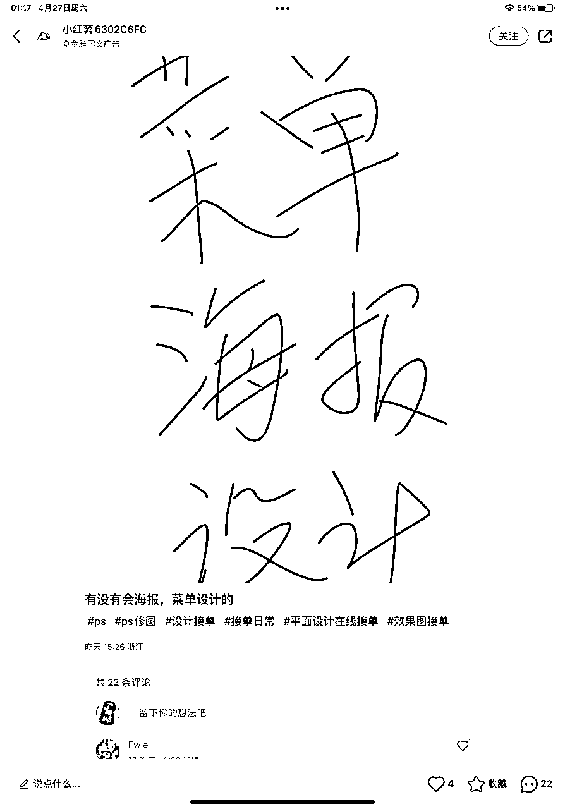

于是我就去加了这个账号，看了看朋友圈，主要变现渠道就是通过矩阵号引流到私域，通过朋友圈接单项目吸引设计师，以开设咸鱼店铺接单教程，实现变现闭环，也通过分销散单赚取差价，实现多渠道变现，这也对应到了生财思维课里面的"中介思维"

找到发现用户需求+满足用户需求的产品，作为中间方，从中赚取利润实现闭环

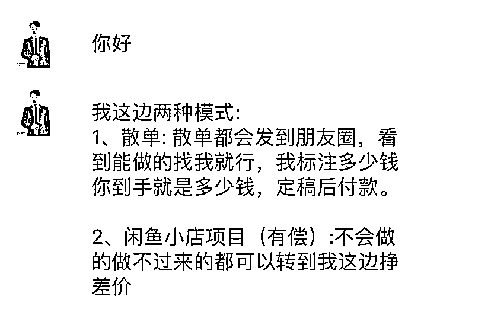

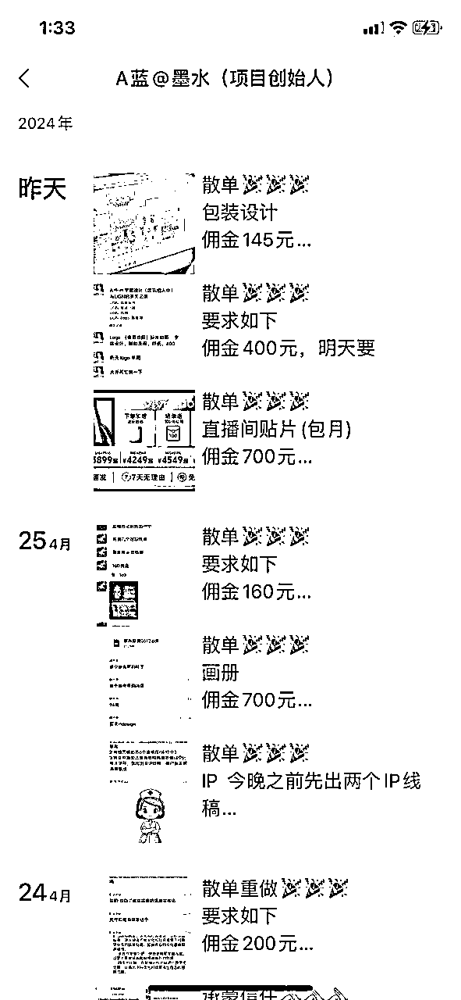

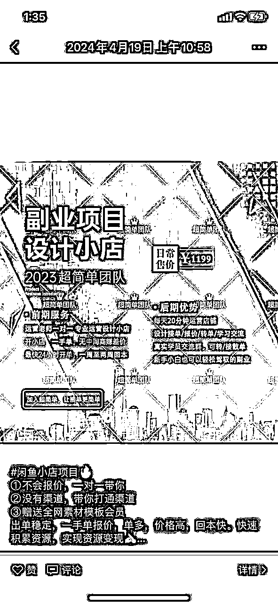

因为看到咸鱼小店的可行性，所以打算自己先跑通把店开起来，发现首月接单收入就已过万，部分收入在微信

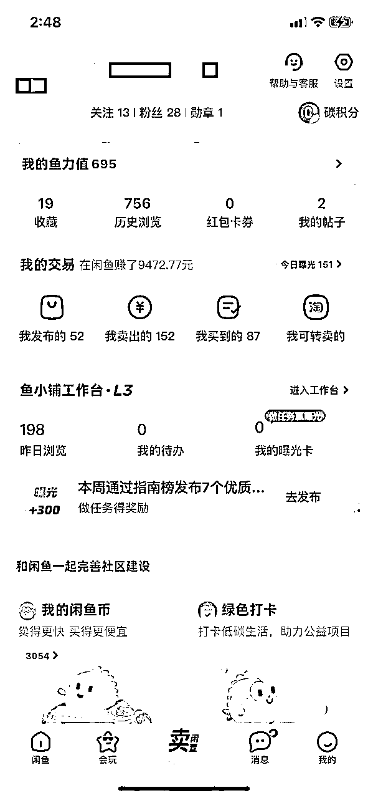

话不多说，接下来进入实操，分为三个部分来讲

1.账号搭建

1️⃣账号包装

修改头像/个人名称/个人简介/背景，多找几个对标账号，结合一下自己的条件修改一下就可以

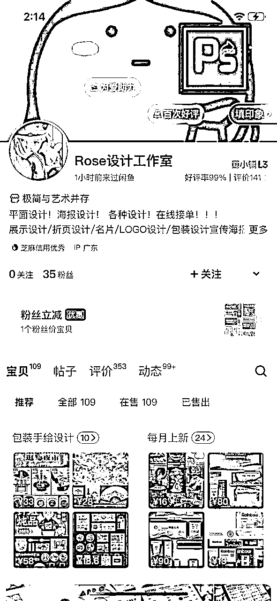

2️⃣产品上架

1.准备要发的图片

准备好自己的作品图片，我看到有些账号是用别人的作品发布，没有作品也可以用别人的作品先引流，后续再发布自己的作品

发布的数量没有要求，最好是多张，但是主图也就是第一张图必须是视觉足够吸引人的，可以多看看对标账号的首图，首图有让人想要的欲望并点进去私聊，帐号才会增加权重。

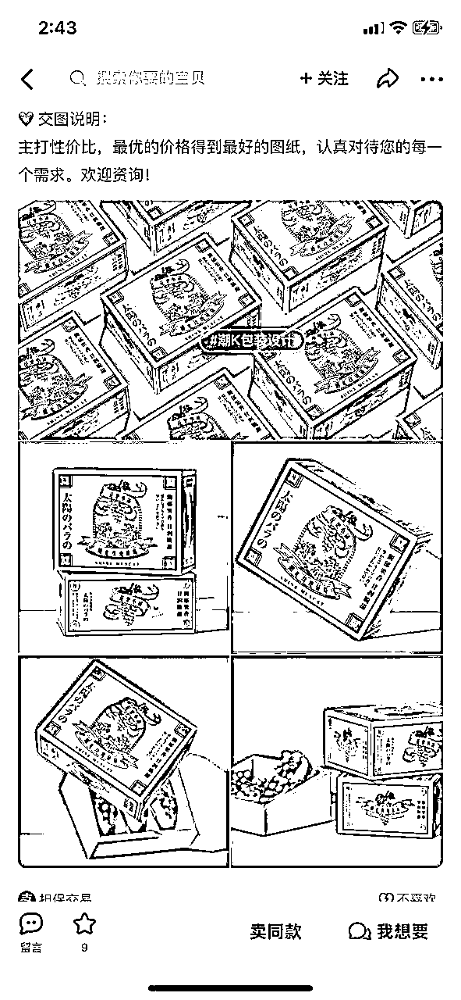

2.准备文案

同样是找对标账号，比如是包装设计，那就在搜索栏搜索包装设计，找到想要的人数高的账号，有一百到几百想要的就可以，直接复制文案，也可以修改一两个字，我都是直接复制发布

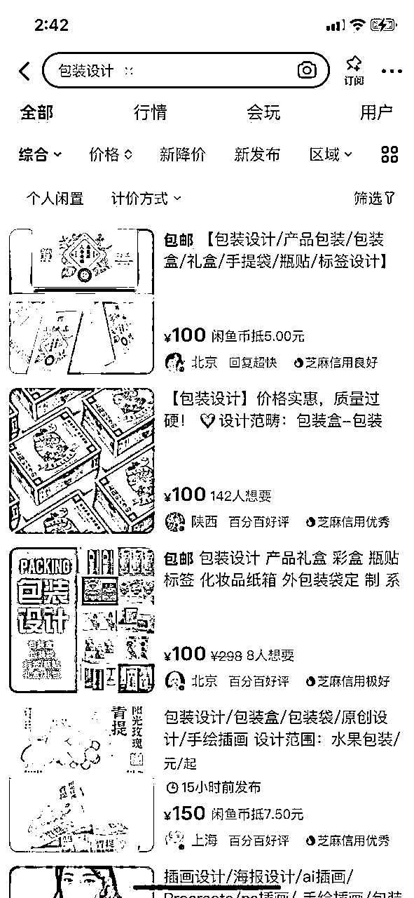

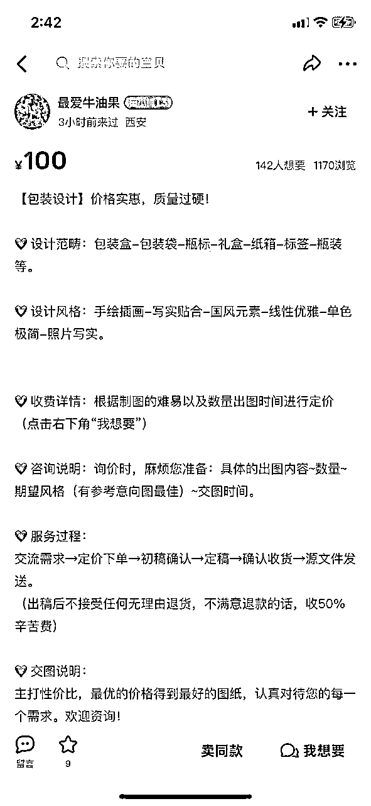

3.发布产品

每天都需要发布2-3个产品，发布产品的时间最好间隔一会儿，我都是编辑在草稿箱里想起就点击发布了，时间点最好是在早上7-9点，中午1点3点，晚上9点-12点

2.店铺运营

1️⃣产品上新

在账号初期，每天都必须坚持上新产品，最好是2-3个，最少也必须一个

2️⃣一键擦亮

每天都需要擦亮，点击我发布的，进行一键擦亮，我的擦亮时间一般是在午夜12点后，属于首次擦亮，第二天可以挑几个重新发布，不用编辑不用改动，直接点编辑发布即可，等于二次擦亮，时间段可参考早上7-9点，中午1点3点，晚上9点-12点

3️⃣咸鱼任务

点击我的咸鱼币，完成赚骰子里面的所有任务，每日坚持完成，可以增加曝光权重

4️⃣急速卖曝光

每天可以用咸鱼币增加曝光一个产品，可以选想要人数多的产品进行曝光

5️⃣咸鱼币抵扣

可以把每一个产品都设置咸鱼币抵扣，增加账号权重

6️⃣1分钱壁纸增加曝光

这个是增加曝光最好用的一个，可以理解为互关互拍，有人点击进来私聊并下单以此给店铺增加曝光量，可以在自己店铺发布0.01互的链接，也可以搜索别人的去操作 (需要注意咸鱼平台最近在查0.01，可以协商好改价1或者改价2)

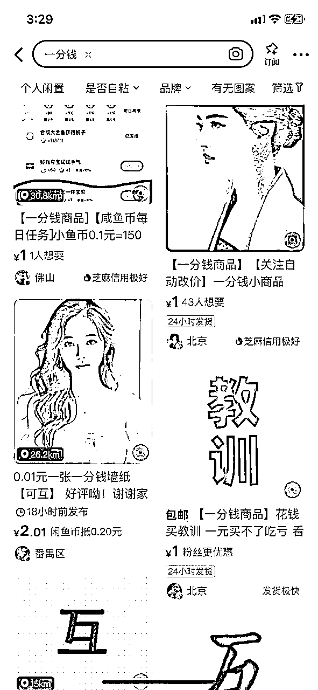

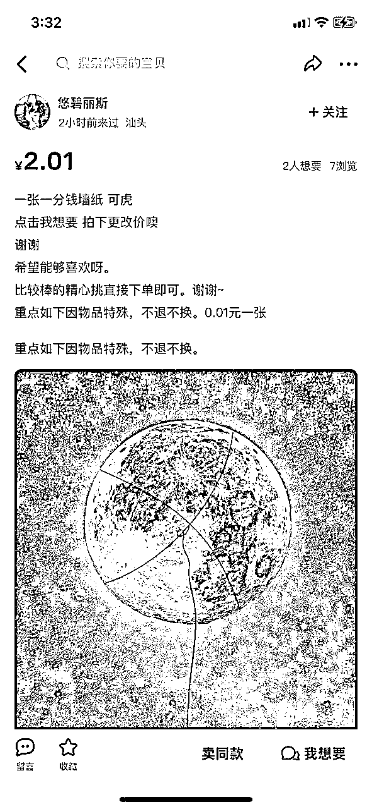

3.注意事项

1️⃣设计师需要收取50%定金以防跑单

2️⃣可以引导对方留微信自己添加，不要留自己微信号，防止被降权重，引导时可用符号代替，不要被识别到

3️⃣成交几单后咸鱼会邀请开通鱼小铺，如果曝光量一直很好的话，可开可不开，我曝光量一直是在3000-5000左右，开通之后一段时间曝光量只有几百到一千，断崖式下跌，不过过个一周左右曝光量又逐步恢复了，所以可根据个人需求进行选择

具体的实操环节就到这里，接下来说说后续的一些操作及思路，只靠个人接单的话能实现月入过万，但需要累死累活赚幸苦钱

所以一个店铺稳定跑通之后，就可以多矩阵放大外包出去，一个身份证可以开通三个支付宝账号，也等于可以开通三个咸鱼账号，但是最好是一机一号，不要来回切换号，接不完的单子到小红书找人，一条笔记一大把，外包出去从中赚差价，所以不是设计师的也可以套入中介思维去跑通项目

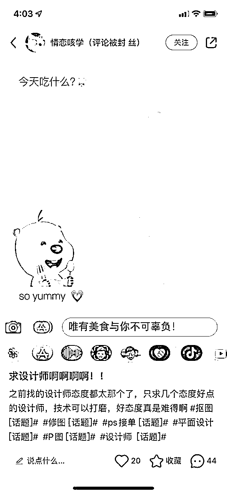

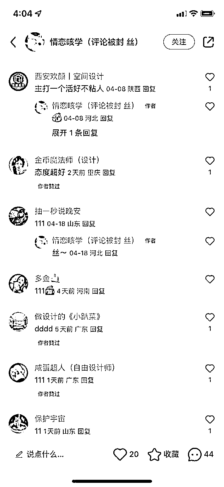

第一次写帖子，请各位海涵

希望这篇帖子可以给设计师或有需要的圈友提供一点思路，也相信有部分圈友能琢磨出新玩法

我是由一，感谢阅读