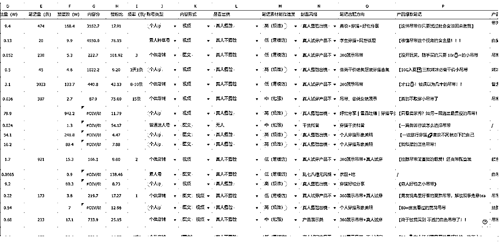
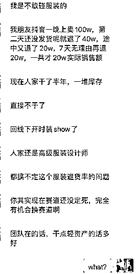
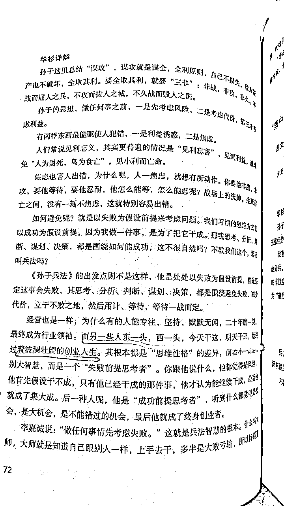

# 小红书女装创业失败复盘：花费几万，只出了1单！

> 来源：[https://z1zu4xvq1ns.feishu.cn/docx/FlgBd36YdoVJEjxIItzcGT8rn6d](https://z1zu4xvq1ns.feishu.cn/docx/FlgBd36YdoVJEjxIItzcGT8rn6d)

23年5月加入生财，一直潜水，因为整个23年自己忙着房子置换和装修的事情。

等装修结束后，自己也开始在琢磨着做点什么项目，不再能废柴下去了。

自从19年自己做头条一年赚了五十多万以后，因为一些私人的原因（比如思考人生的意义，找不到人生热爱），躺平三年。

三年没工作没上班，整天躺着。

个人ip自己一直有计划做，但我认为一个健康的ip必须要有实操的项目去做基础支撑，不是凭空想孵就能孵出来的，所以我没有去弄自己的ip，而是想寻找一个长久的项目，且最好拿到结果。

中间有想过做图书直播项目，拿了很多样品，买了设备，还报名了Eric教练的训练营，但是真正下场才发现，自己亲自直播始终过不了心里那道槛，都没露脸呢自己都会边讲边脸红心跳，唉……

中间也看了公众号爆文项目、AI项目，迟迟决定不了。

和刚来生财的人一样，信息量巨大，无所适从。

也留意到了小红书电商这个事，但我迟迟没有下定决心开始做。

因为在19年赚钱的同时，我也曾经组建过团队弄抖音视频带货，亏了10万收场。那时候不知道生财，如果知道的话，可能不会那么轻易解散团队，可能会是另一种结局吧。

今年3月份，让我下定决心去重新尝试电商项目，除了近一年在生财接触的各种信息之外，最重要的，是我身边最亲近的人在3月前拿到了实际的结果。

没错，这个亲近的人就是我老公本人。

去年的某一天，在他向我吐槽他的某个游戏团队面临业务瓶颈时，我建议他是否考虑让团队负责人去试试小红书电商，并且丢了一堆资料给他。

当然，他做业务多年，比我清醒，也不容易被一些文章忽悠。任何再亮眼的成绩、再好的项目，在他眼里，都绝非表面那么简单。

耐不住我天天在他耳朵边叨叨，且那个游戏业务确实看不到任何继续下去的前景了，一时半会又找不到更好的出路，而那个团队有好几个人需要养活。

反正都这样了，有现成的人员在那里摆着，那就不如先试试看吧。

于是他们的团队负责人，直接从一名游戏运营变成了小红书运营负责人，从0开始摸索。

他们不看市面上那些成功团队经验分享，老公和那个负责人的风格都是倾向于自己摸索，我当时还各种劝他们先花钱进生财多看点经验，少走弯路，却被拒绝了。

老公认为生财是有很多值得学习的地方，但根据他多年做业务的经验来看，没有什么事情会那么简单容易，很多成功经验会在描写的时候被美化、被夸大，他只希望先专注做事，有问题卡点了再考虑是否加入来寻找答案。（这和我做事习惯完全相反，后面细说这个事）

因为我不是他们这个项目的负责人，具体细节我不清楚，我只知道，他们弄了各种产品一直测试，在尝试一个多月以后，他们某个品爆掉了，一条笔记几十万的眼睛，卖了上千单，刚好又碰上春节，流量起飞，产品到了供不应求工厂产能跟不上的地步。

有了数据反馈，老公这时候才觉得，小红书电商这个事情，确实可以加大投入力度。

然后他们开始尝试直播，在我准备进场的时候，他们一天直播GMV有近3万。没有任何技术含量，一群0经验的人转去搞小红书，有这样的成绩，实在是震惊到了我。

在我3月进场的时候，他们的月GMV目标是希望能冲刺一百万，为了达到这个目标，他们在短时间内招了一堆主播。

在他们正在紧锣密鼓招人的时候，我决定也亲自下场了，想着，既然身边的人都验证了，那我也试试，先搞到钱再说。

# 一、赛道上，从内裤到女装

一开始我选择的类目是去做女性内裤，尤其是加长裆的内裤。

实话说这个赛道非常卷，但是我选它一是自己也是用户会比较了解，二是卖不出去自己也能慢慢消耗，三是产品图不需要上身，直接拼文案就行了，比较好操作，也不用出镜，直播露个手就行。

然后就开始网上找供应商，对比了好几家供应商的产品，质量是不错，但是我就想更有质感一点。小红书都是颜狗，我就盯上了实体店供货品牌，也找到了两家。

我找的内裤供货商，颜值非常在线，淘宝也有自己的天猫店，一条内裤卖18-25一条。但是他们的进货价非常贵，一条内裤的进货价在10~15元之间。

如果算上成本再加上快递费或者是代发费（代发一般是3.5-5元一单，包装和人工还是另算），而用户能接受的价格一般也就20元左右（我甚至还看到大量9块9三条内裤的），那每一单基本上就赚一到两块钱（前提还是我能卖得出去这样的高客单）。

那这个价格太低了，利润太低了，同样的时间投入到低利润产品，完全是靠跑量。问题是，我能不能跑出量，这完全是个未知数，那同样是未知数，我干嘛不选一个利润高一点的？而且在内容营销上来讲，内裤也就只有款式和加长档上面做文案，整不出别的花来。

再加上另一家供应商，它的拿样要求是每一款必须整箱齐色拿，一个款，一箱是36条或18条，光拿样品就得几千上万。我都还没有测评哪一个款可以卖爆，我没法说一次性拿那么多。

于是我放弃了内裤这个类目。

内裤供应商有一家刚好有吊带、背心这些产品，恰好也是适合我日常穿的，面向的人群也比较广，都是基本百搭的。

我自己是不会化妆和穿搭的，所以这种基础款比较适合我。

商家要求齐色拿货，但是一个款齐色也就四五件，我能接受。

当然，我并不是只拿一家。同样是背心吊带产品，我前后网上也找了不下十家，每家拿个几件，然后全部进行对比，看看质量的区别。

同样的背心，有拿货价6块的，有30的，有50的，我就是想看看质量差别有多大。

现在小红书热卖的19块9，29块的基本都是拿货价6-10元左右的，我拿到手的时候，说实话，可以穿，但是确实没多少质感，是我自己也不太看得上的产品，基本穿几次就会变形，月抛型产品吧。

于是我最后定下的产品都是拿货价比现在网上卖的价还要高的，走中等路线。

我就这样子，一不小心进了女装赛道。

# 二、正式实操

回归正题，前面提到，在做具体项目的习惯上，我和老公不一样。

他倾向自己研究和摸索。

而我倾向多花钱多请教；

即使多年来我一路被割了这么多韭菜（累计十多万），我还是认为付费学习是最短的路径，这跟我做没做过知识付费项目无关，确实也在这个过程中遇到了真心指导并让我拿到结果的老师。即使这样的老师非常少，90%在割韭菜，但我愿意一直抱着相信的态度，只要遇到一位真心交付的，对我来说就是值得。

就好比我看中医，一路各种尝试和更换医生，很多花了钱却毫无效果，甚至越来越糟糕，但不代表你就要对接下来所有的医生失望，放弃治疗。

就是因为这样的心态，让我在去年因为小红书一篇帖子遇到了如今一直为我治疗的医生，并且让我20多年的口腔溃疡真的极少发作了，而那时我已经求医问药两年多了。

所以，做小红书女装项目时，我所有的经验来自生财上面看的各种项目总结文章、航海实战手册。

我认为这些东西完全够用了，没必要再专门花钱，我直接按上面写的去亲自实操就好。

我把生财上面所有关于小红书女装的帖子全部看了好几遍并进行梳理总结，对于没有品牌能力的小白们来说，里面能操盘的打法基本是分成两派：

一派是混剪与无人直播的模式，废号法快速赚一波流；

一派是做原创视频矩阵式分发，用数量对抗概率；

我选择了后者，因为不想和平台抵抗。

而矩阵式分发，按生财里的教程，同一个款的衣服，按照一定的方法，是可以做到短时间里产出几十上百条原创视频（根据爆款模板，同款不同色、同色不同场景等各种排列组合），每个星期测3-5款，不行就继续换品，直到某一天出现爆款，然后集中所有力量（账号量+笔记量+投放）去放大。

我看到这些方法的时候，心里想，这似乎不难。

但真正执行的时候，你就会知道，事情根本没那么简单。

或者说，我在执行的过程中，因为有太多的个人想法，动作也慢慢变形了。

奔着弄矩阵，一开始就注册了4个店铺，（幸亏没注册十几个，否则又要像当年搞头条百家号一样动用朋友亲戚关系，消耗大家），一个店600块认证成企业店，就开搞了。

说下我都踩了哪些坑吧：

## 第1坑：产品上架过度追求完美

模式想好了，也拿到产品了，开始亲自实拍。结果很长一段时间我就一直卡在产品图的拍摄上，因为自己本身就不擅长拍照，拍摄过程中永远觉得自己缺工具。就好像爱美的女生永远觉得自己缺那一支合适的口红一样。

一开始觉得自己缺一个好看的桌子，没有那种ins风的感觉。

接着觉得缺个人体模特，我又跑去买了一个人体模特，结果买错了颜色，买成了肤色。拍的时候连我的直男老公都说太土了。

因为我说我要主打真实无滤镜，所以要在自然光线下拍摄。

刚好广州的天气特别的糟糕，没有任何太阳，又是阴天。我拍的产品就是看起来又暗又黑。为了不要受限于天气情况，我又把自己以前录课用的柔光箱，神牛灯和大型支架全部组装起来，还是没有那个感觉。

接着我又看到有人直接用那种挂衣服的落地支架来直接拍，也比较简单，我又在网上买了落地支架。

可是我拍出来的就是那种出租房的风格，没有任何氛围感。

没办法，我只好尝试自己上身实拍。

那时候广州的温度比较低，我还在房间打了热空调，结果第二天就重感冒了，为此病了一个多星期。

好不容易等到天气回暖，可以放心大胆地直接上身拍摄。

结果自拍怎么样都不会凹造型，拍起来奇奇怪怪，没有任何感觉，不吸引人。

总之啊，光拍摄一个产品图，我前前后后就拖了将近20天。

我老公一直建议我直接招一个全职的拍摄，虽然知道要勇于亏钱，做好了相关的心理准备，但是有时候我觉得钱还是要花在刀刃上。

既然别人可以直接在家这样拍摄，为什么我就不能拍？

有一天上午老公看我又在那折腾，忍不住对我说：

真不是为了故意要打击你，但是像你根本就不适合一个人这样搞，你本来就不擅长当模特拍照，你自己都知道你擅长 研究打法和定策略，而不是执行。你就应该什么都招全职：全职的运营，全职的模特儿，全职的摄影师。像你这样子搞法，五年都没有什么成绩你信不信？

然后我不服气！！！！

现在回头看，这纯属浪费时间。

直接发笔记不挂车也没什么，因为发笔记也不一定就会爆呀。

也不知道当初自己的脑子是怎么了。

而且，我还天真地相信用户喜欢“真实”，所以我无滤镜原图直出。

但是，用户只是喜欢看起来真实的美，不是真的真实……

## 第2坑：数据不行就怀疑是限流

一开始是自己在家里一个人慢慢折腾，病好了以后就根据爆款笔记模板，一比一模仿着拍摄并制作笔记，根据那些方法执行。

一天发布5条商业笔记，发了还不到20篇笔记的时候就出了一单。

相当于我认真执行的第4天就看到了正向反馈。

那时候店铺才3个粉丝，纯自然流情况下，每篇文章的小眼睛都不过百。就这样居然出了一单，单价69.9元的一款工字背心。

为此我还挺开心，为了这一单我还送了用户一条独立包装的品牌内裤，再加上两次运费（厂家下单到我家，我再寄出去，且快递费很贵），我这一单没赚钱。

但它至少说明了模式是可行的。

既然模式可行，账号也弄好了，就差执行放大了。

于是我们迅速找了场地，租的比较大，200平，一个月租金两万。

里面还包含了三个直播间，借鉴老公那个团队的模式，想着未来需要多个直播间，到时会做笔直联动。

决策的过程是非常快的，一个多星期的时间就把办公室的所有事情落实了（桌椅、电脑、其他配置等），然后就开始招人。

短时间内就找到了全职的基础运营，全职的主播。

我还想要招一个非常有经验的运营，薪资开到1.5W+提成，但是一直没有适合的。

就想着一边招着，一边自己和已经入职的两个小伙伴先弄吧。

结果，自从出了第一单之后，就再也没有任何流量，也没有任何出单。

所有的笔记拍摄完发出去都是个位数的眼睛。

即使我花薯条去拉也拉不动，笔记没有任何点赞评论，顶多是曝光可以升到两百个眼睛。

太邪门了！

我反复怀疑是限流、违规，甚至找了聚光那边，官方都说没有问题。

我不服气，想着是拍摄能力太差，那就找专业的人！

我让主播同学带上衣服去朋友家拍摄，朋友以前是电视编导，懂审美，她家的景也非常好，那天朋友用她的专业相机为主播整整拍了四个多小时，上百张照片最后挑出十几张，这里还有个小插曲，主播同学发布前执意要修图，说是要把皮肤弄白一点，我当时挺不理解，后来我才知道，原来网上女孩子们拍的照片以及其他同行发的那些图都会认真修图？只有我发网上都是原图直出，哈哈哈哈。

这时候我才知道，干女装的那些图，个个都会修图，主播常年自拍修图，所以她一眼看出来谁哪里哪里修了。而我完全看不出来。

但不管怎么样吧，这次拍摄总比我自拍的不知道高了多少档次。

结果发布到企业号上，数据居然比我自拍还要差，30个眼睛！！！！

这个时候我真的不相信什么我的号没有问题。

于是我又拿了一个新的手机全新的企业号，把拍摄好的专业图片拿来发笔记，还是30个眼睛！

最后我用一个小号来测试，这个小号我原来是计划用来做种草引流号，发的第2篇帖子小眼睛有3K以上评论一百多，这个账号百分百是没有问题的。

我把在朋友家拍的专业图片发上去——还是30个眼睛！！！！

这次我彻底相信了， 是内容有问题，不是账号的问题。

做小红书，数据不好非常容易以为是账号被官方打击了，但其实，99%就是你的内容不行。

我们容易认为是被限流，是因为明明有同行比我们拍得垃圾且随便，为什么别人的数据就千赞就爆单？

关于这个问题的答案，我后面细说。

## 第3坑：找错了对标账号

在我被这个事烦恼的时候，偶然知道了身边一个朋友在22年底就开始研究做内容，23年一直在做小红书电商。

听了我的经历，他哈哈大笑，因为他之前就经历了我这个阶段，也是弄矩阵，卡在起号，数据起不来，各种折腾，结果全军覆没。

后来他痛定思痛，不管外面的声音和别人的成功经验，只从平台底层逻辑出发，亲自测试，老老实实做内容，才终于做起来。

他本人负责前端流量，另一个合伙人负责后端的产品。

在此期间，他总结了一套内容方法论，他的所有小号，按他的内容方法论，基本都是5条就能成功起号，数据非常亮眼。

我还专门带着运营同学跑他公司，看了他后台和他的账号数据，听他当面传授经验。他也毫无保留地分享给我们。

但里面，有一个特别重要的点，就是指出我们一路以来都找错了对标账号。

我是矩阵号的打法，所以我找的也是矩阵号的对标。

但是，无一例外，我们看到的矩阵号对标的账号，都是通过其中一两个爆款拉起来的数据。

这些对标，一天更新3-8条，最狠的是一天更新15条笔记，且数据都非常差，点赞基本个位数。

也就是它们一直是在靠某一两个爆款笔记的流量活着，下一个爆款什么时候来？不知道。只能一直继续这样测下去，执行下去。

我们看到的很多这种账号都是吃到了时间的红利。

继续下去，拼的是谁执行能力更强，谁子弹先打完，谁能扛到最后。

这样的账号毫无积累，没有任何粉丝粘性。这也是为什么大佬们想要做得更长久会开始去孵化ip的原因。

“而且官方并不喜欢这样的内容，官方喜欢什么样的内容早就在各种官方文档里写出来了，基本就是开卷考试。小红书一定要种草，种草，先种草啊，不是你们这样直接发硬广！”朋友说，并发来一堆官方权威指南。

他认为看官方指南比什么都重要。他也用实操经验给我们破除了一些谣言，比如：

1、新账号需要先养号三天再发内容？没这回事，注册了直接发！只要内容好，平台欢迎，不用考虑这个事情。

2、账号都在同一个wifi下会限流？没这回事。手头十几个账号共一个网，都好好的。

3、企业号不能用拟人角色？没这回事。只有发商笔和聚光的时候才需要注意，发普通笔记和在普通账号上一样的。

……

回去后，我就花了大段时间重新做了同行分析，本来计划分析100个同行，当分析到第20个时，我对自己为什么做不起来已经心里有数了。

【价位上】

目前20人里，18人的价位在30元以内；

1人169元和1人59元，都是靠穿搭博主极强的个人属性和颜值来拉的；

其他全部价位是14-29元；

而我的产品定价是69元！

【带货模式上】

8个是个人ip，高辨识度。

7个是个体店，全靠量去怼，凭其中一两个爆款，日均更新5条，最多的是一天15条；

剩下的是素人引流号，评论区导流。

一波分析下来，20个里面只有唯一一个在我们团队能力范围内勉强够得着的，是一个做得不错的素人引流号，它做得好的原因完全是超强的网感，非常吸睛的话题，非常考验一个人的网感和话题营销能力。

结论基本就出来了，

我的情况是：

1、同样的价位，产品视觉呈现（审美、穿搭、构图）打不过别人；

2、同样的low图，我的价格又比别人高；

3、一句话总结——又土又贵的硬广！

## 第4坑：项目超出了自己的能力圈

以为这次选的女装小类目在自己的能力圈以内，结果完全是在能力圈以外。

那女装还能不能继续做？

可以。

分析了下，只有三条路：

1、要么走低端路线，价格调整到19-29元，配合网感话题与素人种草；

2、要么走中高端路线，坚持现在的价位，但是审美、构图都要做到和同价位至少一个水平；

3、要么ip路线。

好吧，后面两个路线，不是不能做，那就是时间成本和金钱成本的问题，我自己不懂穿搭，平时自己也是不怎么化妆打扮的人。这怎么去拿货拿款？也考虑过直接招懂穿搭的员工，但是这里面就有一个很大的风险，就是整个团队的选品非常依赖这个人，一旦这个员工因为什么事情离开团队的话，这个风险太高了。

考虑过我自己亲自去学，比如说找形象穿搭师一对一的教学，让自己的能力短时间的提上来。但是这个东西很难短时间提上来，我又没这块天赋。

也可以去请专业的摄影师，专业的美工，专业的模特，用大量的钱去达到同行的水平，但是这里面又是巨大的开支，而且你也不知道这里面的周期有多长。多久才能看到效果？

孵化穿搭ip？

更不现实了……

对了，别以为卖中高端产品就没有退货率的问题了。

能走的，只有能力范围内，不是想不想的问题，是能不能的问题，唯一的一条路线——低价低端路线，主打性价比。

但是，我一直认为19块29块的衣服，简直不能称之为衣服，材料一般、做工差、线头多、易变形，各种各样的毛病。15块的吊带，甚至19块买一送一的文胸，诸如此类非常低价的，是我在拿到样品的第一刻就会申请退回的东西。

就是这样我看不上觉得不可能有用户愿意使用的产品，在各大店铺畅销，算上退货率还有利润空间。

我一直认为带这样的产品，我就是没有良心，就是欺骗。

但是我问了手下同学，她们刚刚大学毕业，她们会去蹲直播间买各种39、29的衣服，只要满足基本需求就觉得没什么问题（看到衣服有线头剪掉就是，变形了就再买，反正又不贵）。

原来消费者是这样的心理……

我有点恍惚。

大概是广州这些年，

让我渐渐忘记了当初刚毕业的自己是怎么在只有月薪2000处处借钱放假也不敢去逛街的日子里度过的了。

也忘记了学生时代洗衣服只买得起肥皂而羡慕室友可以用蓝月亮。

忘记了自己曾经也只能承担起几十块的衣服（不是不想穿好的，是不能），连进森马、美特斯邦威这样的店都觉得太贵了。

现在做项目，我一直只关注做工、质量、版型，认为69块钱的价格完全不是问题。

而用户，或者说绝大多数用户，恰恰最关注的就是价格。

但臣妾做不到，做不到，真的做不到。

不管是从自己的喜好上，还是退货率上，还是长久上

我都不想卖低价品呀！

## 第5坑：过早考虑直播又纠结太多

在租办公室之前，我自己在家直播过3次，每次1小时左右。

第一次还拉了一个朋友一起配合。

三次的数据一次比一次差，讲得也是乱七八糟，讲着讲着不知道讲哪去了，一通乱讲。

更糟糕的是，我的身体极限就是1小时，每次才到50分钟的时候，我的腰就痛得直不起来了，做不到每天三小时。

等到全职主播入职以后，我们原计划是每天固定6小时，上午3小时，下午3小时。

结果因为笔记的数据一直起不来，导致直播迟迟没有开始。主要是担心主播受不了前期坐冷板凳的这个心理压力。

于是我们就一直想着等做出爆款笔记再开始直播吧。

结果数据又一直都起不来，死循环了。

甚至我随时都准备好了去开聚光走付费流量，但是前提都是要把账号的数据给做起来，笔记CTR数据一定要有一个基础支撑，这样做聚光才有放大的意义。

一开始我花钱认证企业号也是为了这个目的，谁知道一直卡在第一步。

后面我不想等了，直接开始直播，每天固定时间开播，播够时长再说，先坚持。

毕竟也有账号是0粉开播的。

但是，等我花了一天时间弄好直播所有的事宜（直播前需要重新梳理产品，和供应商核对库存，设置好直播活动价格，理清楚利润空间，没有想象中那么快），临开播前，找主播简单聊了一下，本意是想打气鼓励。

结果主播提出说第二天不打算来了。

说觉得创业太难了，数据起不来她也拿不到提成，也不想这样慢慢熬。

当晚没播我让主播直接收拾东西离开了，自己上去播，照样，一小时，极限了，疼得直不起来腰，弯着回家的。

现在回头看，主播招得过早（当时也是为了让主播当一下拍版模特），进来了又久久没开播，瞻前顾后太多。

# 三、过度自信，惨淡收场

总之，对自己算是各种认知不清晰，过度地自信。

以为别人能的，我也能。(主要是19年自己裸辞人生中第一次创业就拿到了不错的结果，自己带来了巨大的自信。成功是成功之母！）

但很多时候，我们接触到的都是别人已经拿到了成果了，这个成果首先代表的可能就是人家进场早，有红利，或者人家在某方面已经有长时间的积累，刚好跨赛道的时候能综合用上。

等我们这些啥资源也没有的小白也能接触到这些信息时，可能这个赛道已经挤满了人，你不知道你是第几轮进来的了。

而且那些失败的经历，我们很少能看到，也不知道背后已经有多少炮灰。

女装创业项目这两个多月，备受煎熬，怀疑自我，中间也请教了生财一些财友想打开一下思路（每次请教别人都会主动先发个200元红包不白嫖），也因为着急现金流的事情病急乱投医去弄视频号小店做后端店群（结果刚交完钱学完，视频号规则就变了，店铺现在还一直卡在新手村里）。

种种决策，都是自己认知不到位导致，怨不了任何人。

也通过这次短短的尝试，知道自己在电商这个项目上，各项能力都不太行。

而且自己还有点眼高手低，看不上自认为的小钱小项目。

其实，没有一个项目是“小项目”，只有自己能力不行，把它给做“小”了。

就算现在让自己马上去做公众号爆文啥的， 我能保证自己能马上做出成绩吗？

所以，但凡涉及到从0开始的创业，没有一个是容易和简单的。

我也特别认同生财里一个叫“家蒙”的财友说的话：

盲目上车，跟风，就和赌博无疑。

赚了，影响心智--觉得自己真牛逼，以后会吃更大的亏

亏了，影响心情--觉得自己当时在想啥，为啥会乱来

可能副业钱来的太容易，不珍惜

打着「为家庭更好」的口号，胡乱操作贸然进入一个自己完全不懂的市场，其实是很不负责的行为。

这一段话，无疑是对我这段时间的最好的总结吧。

然后最近看《华杉讲孙子兵法》，孙子兵法第一篇计篇就强调了，要计算，要先胜而后战呀呀呀呀呀呀呀

还没下场之前，就要认真盘算，看看自己的各项能力和资源和别人对比，有多少胜算。毫无胜算的仗，不要打！

（为什么突然看这个书了呢？那还不是因为通过这个创业发现自己分析和决策能力全面拉垮？得好好多看相关的书，提升自己了。）

看到这句话，说的不就是我吗？——永远在写失败复盘的波澜壮阔的创业人生！

说到这里，

在我开始进场弄女装后，老公的小红书团队不久后业绩开始直线下滑。

直播间突然没有量了，毫无预兆的。

笔记因为也是做矩阵模式，弊端出现，爆款笔记之后，一直没有再次出现爆款，导致流量快消失殆尽。也正应验了前面说了，粉丝没有任何粘性，账号没有任何积累，就看谁的资金能支撑得更久。

前面赚到手的钱，又很快花在了场地租金和更多的员工成本，甚至还开始出现亏损现象。

他们团队被逼无奈，刚扩招不久的主播，又只好一个个砍掉，以此节约成本。

那我们来假设一下：

如果时间线只停留在团队出现爆款和直播日万GMV的时候，负责人写一篇帖子的话，我们会容易认为他们成功了，彻底地成功了。

但后续却像是股票走势一样，又快速跌回去，然后煎熬等待下一次爆发，只是能不能撑到下一次，没有人知道。

# 四、接下来打算做什么？

在分析完各种情况，结合自己的能力圈，我的女装创业项目就此告一段落，方向不对，努力白费。

我也不用对自己有各种执念了。

现在我和朋友正在商量着一起做一个我们俩更加喜欢的项目。

朋友在小红书上死磕这么久，但为什么也想放弃自己正在做的项目呢？

因为电商让他太痛苦了。

用他的话说，流量起来了，工厂产能却老是跟不上，他的产品又不是那种随便一件代发可以搞定的，工厂起订量一般要十万件，最低的是3000单起步。

这种处处受制于人的感觉让他非常痛苦。

而且做电商需要24小时随时待命，处理各种问题，再加上会遇到各种奇葩客户以及退货问题，让他心力交瘁。

而用户退过来的货，他还要忍着恶心去处理。

再加上和合伙人产品和营销理念的不合，让他萌生退意。

大家深度聊了一下，我俩的三观和价值观非常类似，一致认为对于我们这种喜欢独处喜欢思考人生注重成就感和精神世界的i人来说，电商这个事是能量消耗型，会掏空我们。

我们应该去寻找那种既在能力圈范围内，又能为我们提供能量滋养我们的项目。

对了，

说到这里，

我在放弃女装前，用朋友的系统方法论认真地在我的企业号上发了唯一的一篇强内容的笔记，终于让我的账号摆脱了只有几十或一百个眼睛的命运，达到了6000+，验证了他的思路。

情况基本就是这样了，

肯定很多朋友会说，是我不够坚持啊，又是浅尝一下，起码给自己半年的时间等等。

甚至这篇文章都有点不好意思发出来，为什么呢？

因为我重新回头看自己19年弄抖音带货项目时写的那几篇失败复盘文章，简直如出一辙。

但，是自己的错，就勇于承认。

大家的批评我会全盘接受。

躺了三年，不说进步，只能说毫无长进，能力也全面退化。

但人只有一直在行动和犯错反馈中，才能不断成长。

愿自己，

在创业道路上，

步履不停！

（完）

最新更新：

这个失败复盘发出来，初心就是想让大家避雷，不要走我的老路，另外发出来也是觉得自己的认知还是不够深刻，希望能有大佬能指出更多的问题，毕竟我自己认知实在有限。也不能给大佬提供什么价值，只好用这样的方式，希望能获得高水平高认知的大佬指点一二。

另外，也说一下吧，我现在入局中老年人的知识付费项目了，和电商相比，算是在能力圈范围里了。

所以，如果有正在做老年人培训项目的圈友，或者也在广州创业的朋友，期待一起交流。

V：tznetdong

备注财友。