# 抖店-催付机器人RPA程序（飞鸽发送催付话术+弹窗提醒助播/运营+大屏提醒主播口播催付等功能）

> 来源：[https://x0gnb2e1yj.feishu.cn/docx/GJBydvTP6o7NhZx0rlmcb88Dnch](https://x0gnb2e1yj.feishu.cn/docx/GJBydvTP6o7NhZx0rlmcb88Dnch)

😁大家好，我是RPA研究院院长-商叁，这次给大家带来一篇关于抖店-催付机器人的RPA流程设计。通过RPA技术提升直播过程中的销售转化率，经过我们的实测，每场直播GMV约5%左右的增长（一场100万GMV的直播，就能提升5W左右的业绩，实际应用需要根据公司的直播模式进行决策，憋单的直播模式嘎嘎好用!!），充分展现RPA技术在电商领域的实际应用价值。

# 🚀 程序介绍

抖店-催付机器人RPA程序是一款针对专为电商直播场景设计的智能RPA程序。RPA（Robotic Process Automation，机器人流程自动化）程序通过模拟人工操作，实时监控抖店后台的待支付订单，通过发送催付话术、弹窗提醒助播/运营以及大屏提醒主播口播催付，实时订单状态跟踪等方式，解决高意向客户因缺乏及时跟进而流失的问题，有效提高订单支付转化，经过实际测试该RPA程序可以提高每场直播5%左右的GMV。

# 🎟 功能介绍

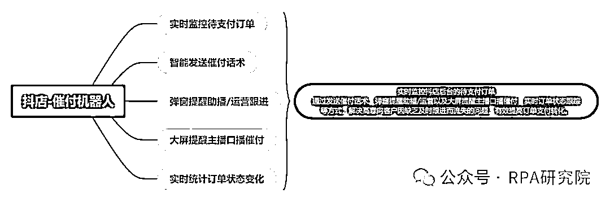

1.实时监控待支付订单：RPA程序可以持续监控所有待支付的订单状态。一旦有新的待支付订单产生，机器人会立即触发相应的催付流程。

2.智能发送催付话术：针对待支付订单，RPA程序会智能选择并发送催付话术。这些话术可以唤起客户的购买意愿，促使其尽快完成支付。

3.弹窗提醒助播/运营：当发现待支付订单后，RPA程序会通过弹窗形式提醒助播或运营人员。这种即时提醒机制能够确保相关人员及时跟进，提供一对一的转化服务。

4.大屏提醒主播口播催付：RPA程序可以直接将待支付订单信息展示在主播的大屏上，提醒主播在直播过程中进行口播催付。这种直观的展示方式能够有效提升催付效果。

5.实时统计订单状态变化：RPA程序能够实时统计待支付订单的状态变化，包括等待支付，支付成功、取消订单等。运营人员可以通过数据了解催付效果，优化催付策略。

# 🛠 业务流程图

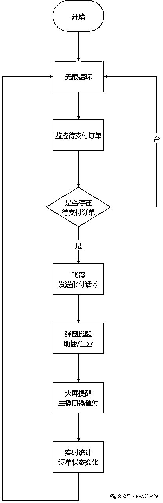

# 📟 业务代码（影刀 RPA）

主流程

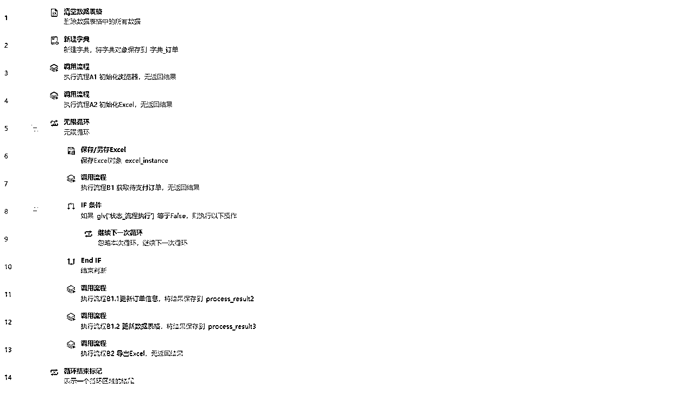

A1 初始化浏览器

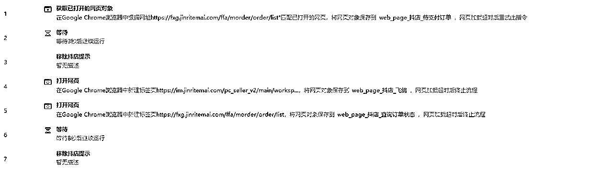

A2 初始化Excel

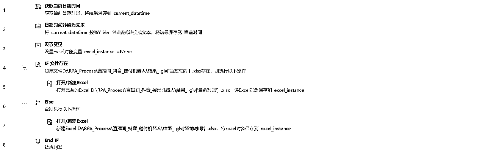

B1 获取待支付订单

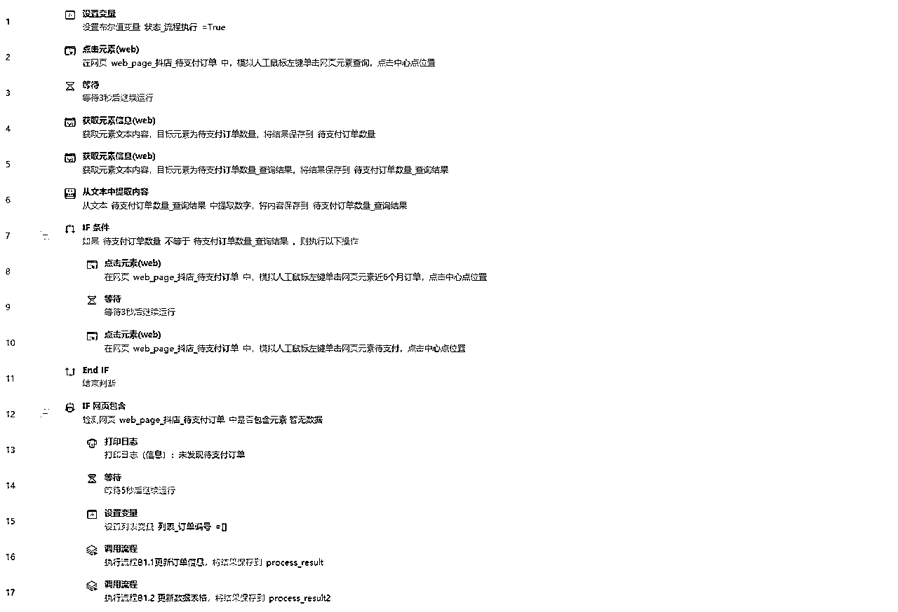

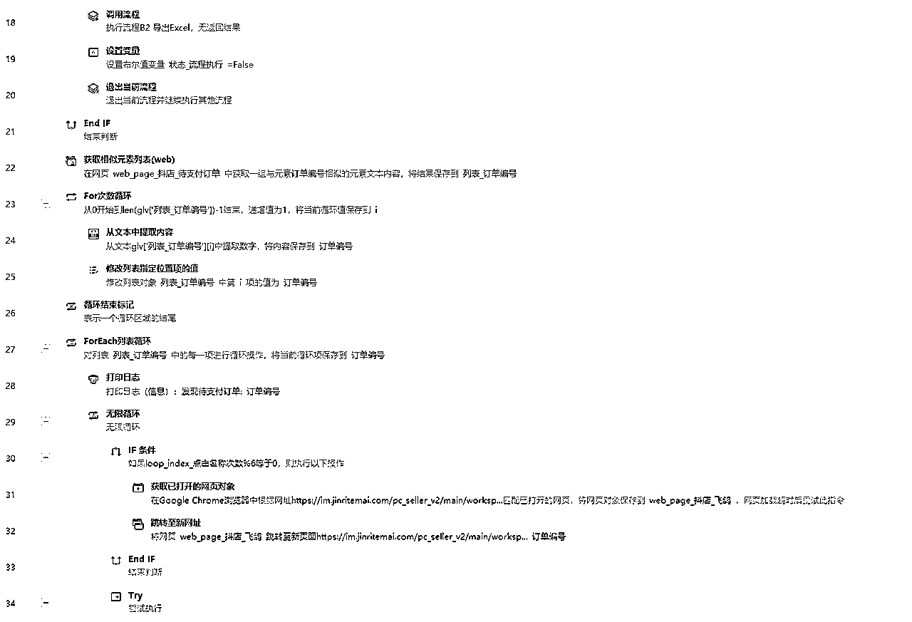

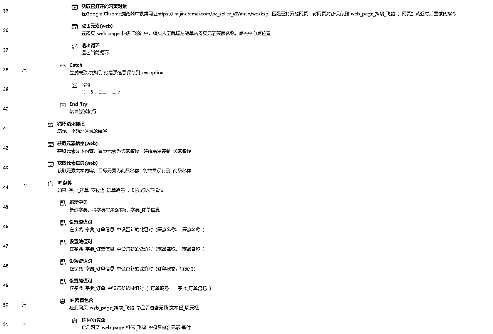

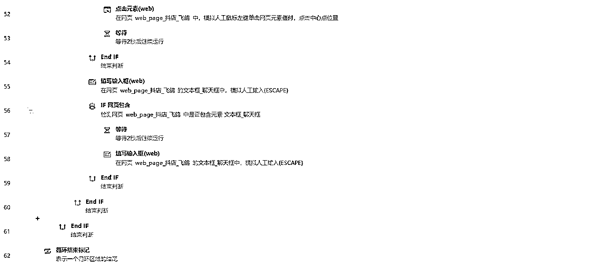

B1.1 更新订单信息

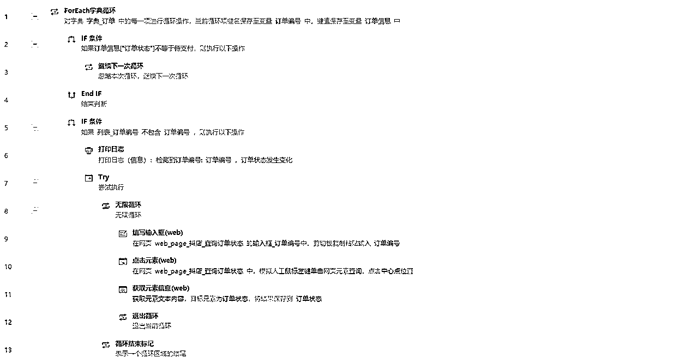

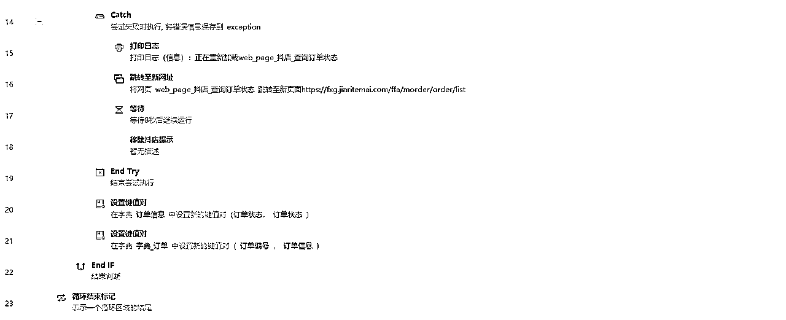

B1.2 更新数据表格

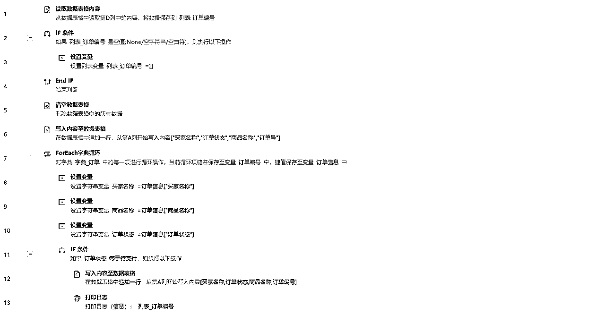

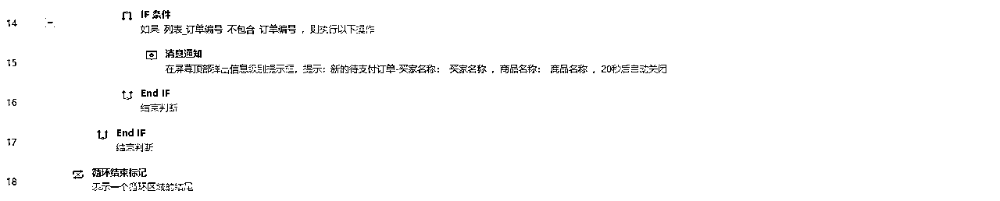

B2 导出Excel

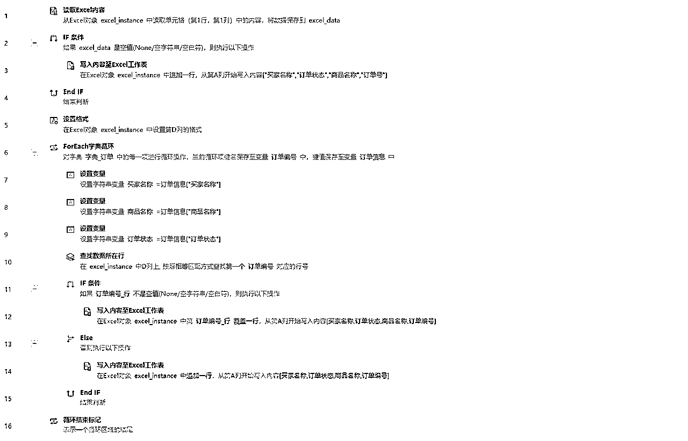

🥂RPA研究院院长-商叁，Base：广州

拥有12年经验的互联网老兵，目前在一家年产值8亿的电商公司担任RPA技术负责人。

主要职责包括领导并推动公司在抖音、快手、视频号、拼多多、唯品会等多领域的RPA业务程序开发。

欢迎对RPA技术感兴趣的朋友一起交流