# 自由职业指数型增长标准打法：用10元单品，一周引流5000+新用户，撬动近50万收益

> 来源：[https://j7329dxmbu.feishu.cn/docx/GTo6drjueoAU0YxhmWhcB7vqnnt](https://j7329dxmbu.feishu.cn/docx/GTo6drjueoAU0YxhmWhcB7vqnnt)

大家好，我是生财龙珠圈友立心，前大厂产品经理，裸辞1.5年实现月入六位数。目前是一名职场转型及自由职业教练。

在上个月，我突破了之前自由职业的瓶颈，实现了自己的10倍之旅，付费用户达到近1w人，变现近50w。

我推出的小报童专栏《自由职业0-100w指南大全》，2天卖出近6000册，6天总销量冲上全网第二，仅次于生财官方出的项目精选，截止目前一共卖出8000+册。

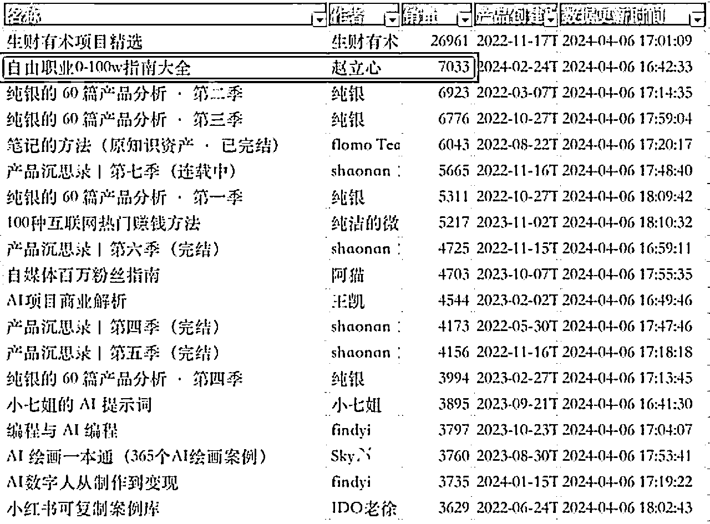

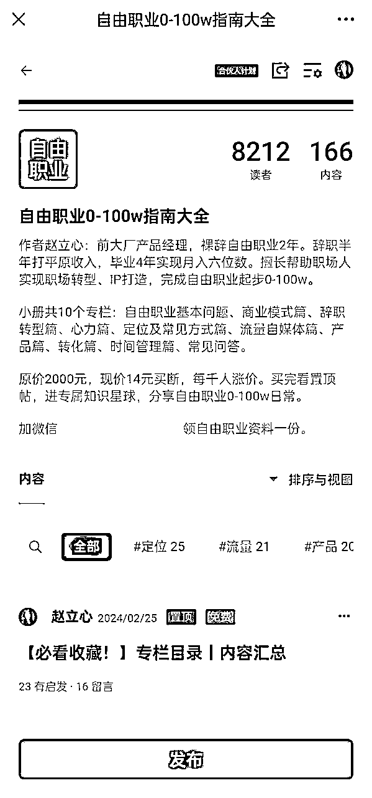

这个动作实现了引流加好友5000+人，变现50w，我的知识星球也从100人暴涨到4000+人。前后还被四家出版社邀请，出版这个专栏。

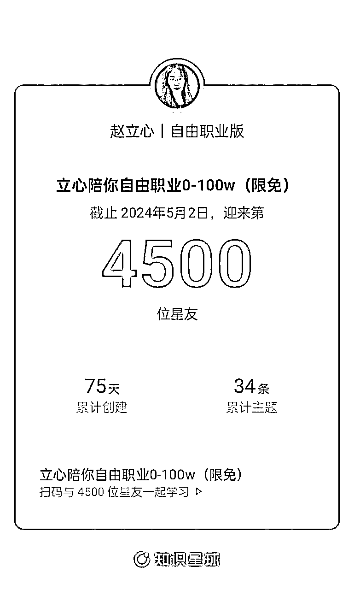

最震撼的是，截止目前，有700+人有效参与分销（卖出了单子），这个数据持续还在涨。还有很多社群在自发的讨论，引发群里疯狂抢购。

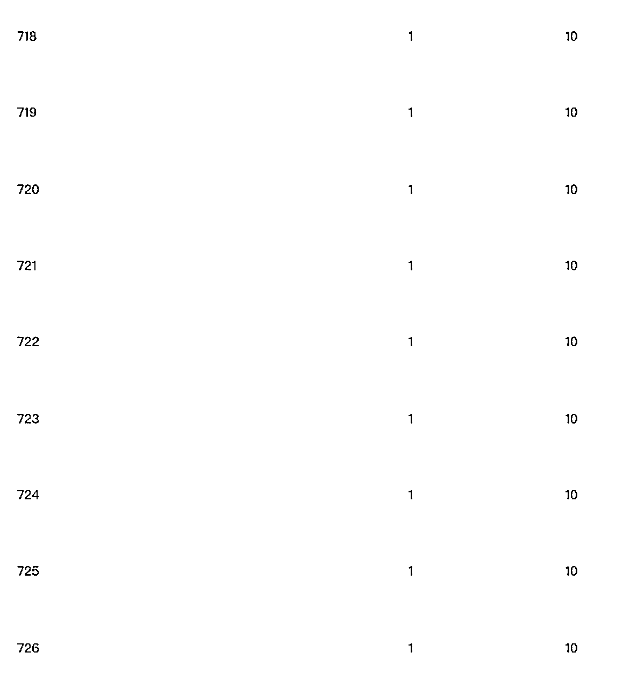

很多几十万粉丝的号主下场推荐，头部卖了几百单的大佬，我之前都根本不认识，甚至很多kol在几个人拿一个人的码分销冲榜。

成绩和真大佬比可能不值一提。但这个动作在持续稳定的为我带来收入。并且，我觉得它背后是一套对于大部分自由职业者，普适可用的方式。

这篇就给大家分享一下，我是如何突破自由职业瓶颈，实现10倍跨越。以及这套标准化的玩法详情。具体包括——

1、职场人想做自由职业，如何突破焦虑迷茫和收入不稳定，构建核心竞争力？

2、如何通过一套标准化流程，实现自由职业的跨越式发展？

3、普通人做流量、转化、产品三端，如何实现能够实现指数型增长？

4、自由职业的10倍增长从何开始？有哪些需要重点关注的事情？

## 职场人想做自由职业的困境：找不到方向，收入不稳定，缺乏体系化商业操盘能力

在具体讲我的10倍之旅前，我想和大家分享一下，我之前遇到的、以及带自由职业陪跑学员过程中发现的一些普遍问题：为什么我的自由职业收入上不去？以及破局的思路是什么。

总结下来，困境主要有三点：

### 1、找不到聚焦的方向，想做很多事儿，很累，但没什么有效结果

职场是轨道，自由职业是旷野。轨道无聊，但跟着走就好了。旷野特别容易走丢，找不到路。

在刚开始探索副业的那段时间里，是极其容易非常迷茫，感觉非常累的。不是身体累，就是纯纯内耗和心累。

就发现，好像有好多方向都可以做。

比如，我本职相关的，产品经理，求职面试，职场博主。我都可以做。

我自己对读书写作，个人成长，情感心理，也非常感兴趣。我也想做。

有的时候还会看到别人在做的一些事情，比如直播带货，抽卡解读，等等，我觉得好像也挺有意思的，也挺赚钱的，我也想学学，试试。

然后就一直在各种方向之间来回看。这个做了几天，好像没拿到什么结果，觉得不行，是不是这个方向不对。于是又切换到下一个方向。

几个月下来，发现搞了一堆事情，没少做。但什么有效结果都没有，还是在原地踏步。慢慢就开始自我怀疑，觉得自己是不是做不了自由职业。

其实，能做的方向很多，都能做的出来。最重要的是，找一个自己适合的，市场也认可的，把心定下来，扎进去，真的做。

### 2、收入不稳定，竞争激烈，特别焦虑

你做阅读课，有了第一波的变现。但你做了几期之后就发现，招生有点困难，后继乏力，好像该买的人都买完了。你去混社群，做自媒体，续命了几期。但还是无法持续发展。

而且你慢慢发现，阅读这个事情，好像没有那么刚需，不那么赚钱。

某天，你看别人搞小红书课程挺赚钱的。于是，你也把方向切换到了小红书导师。

但好景不长。你很快又发现市面上有一堆人在做小红书导师。对方履历还都很牛，做的也很大。你一下心态就崩了。感觉竞争太激烈了，自己打不过别人。

收入的不稳定，竞争的激烈，都让你感到异常的焦虑。

每天都觉得自己不如市面上的其他竞争者。每天都觉得自己的方向是不是该调整一下。

其实，在职场，那么多人在做程序员，你也不会感到自己做不了程序员。

做自由职业也是一样的。这个市场很大，远比你想象的要大。做好自己的事儿，发挥好自己的优势，足够你过的很舒服了。不需要和别人去比较。

### 3、缺乏商业化操盘能力，变现效率低

你可能原来产品能力80分，转化能力60分，没什么流量能力。但靠着自己的原始客群，也能做的还可以。但是你想持续的月入几万，甚至更高，就很难了。

你可能原来做的是1v1咨询，每个月也能收个几千上万。但是，一对一做，时间精力耗费太大了，而且每天能接的用户量也非常有限。做的超级累，也不怎么赚钱，更看不到发展的空间在哪里。

自由职业，也可以叫做一人公司。看起来是一个人做事情，但需要跑完整个公司一样的商业化闭环。

一个人肩负公司那么多人的职责，非常容易手忙脚乱，顾得了东就落下了西，做成一盘散沙。

如果你想提升你的商业变现效率，你必须具有完备的商业化操盘能力。产品、流量、转化，三端都不能差。

跑通0-1只需要简易的框架+基础的能力，但1-10，需要综合，更深度。

这个时候特别需要，向外去学习成熟的模式和做法，增长见识，扩大视野。并且在重点环节，做的更加深入。

## 如何突破发展瓶颈，放大业务量级，构建核心竞争力

### 1、基于个人优势，做整体架构

方向的来回切换，找不到核心发力点。其实说回来还是不知道到底什么是属于自己的，什么是属于别人的。

拿好自己的，能够飞速发展。觊觎别人的，就会来回折腾。

属于自己的，就是这件事儿上，我做就比别人强，就比别人好，或者效率更高。

属于别人的，就是这件事儿我好像也能做，但实际上我做不了别人那么好。

跑偏大部分都是对自我认知不清晰，误以为属于别人的事儿，自己努力努力也能做很好，之前没做到只是因为没做。

比如，做小报童转化这套模式，是圈里比较成熟的一套玩法了。但我的做法和市面上的普遍做法会有点不太一样。

大家通常会拉群，会提前定向邀请非常多的人帮推。这个是绝对可行的做法。我这么做，也能做的还行。但是，我做不到突出。

做社群维护，关系维护，不是我擅长的点位，对我roi也偏低。这就是属于别人的事。所以我就舍弃了。

相对来说，写内容，写文案，做机制，是我更擅长的。是属于我的事。所以我把更多的精力花在了这里。最后的效果要好很多。

再比如，我的自由职业陪跑学员和我讲，她不想做原来的方向了，想做个人成长。因为看到我们另一个学员做这个方向变现了几十万。

个人成长，非常典型的模糊领域，看起来很好，谁都能做。但非常不好做。

你想做个人成长，你得证明，你在个人成长上，有拿得出手的成绩。或者说，相对竞争力。

我们另一个学员能做这个领域，是因为她毕业5年在职场做到了差不多年薪百万，她拿到过很多各种各样的成绩。她有别人想学习的成长点。

但这位学员，并没有这方面的显著成绩。

看别人做什么挺容易的，你也能做，很可能是背后有大量信息你都不知道。

后来我们聊过一次，给她纠正回来。就踏踏实实围绕自己的优势，做能做的事情。很快也出了结果。

不用觊觎别人的。自己的，就很好。每个人都有属于自己的优势。

至于怎么做个人优势和竞争力挖掘，我在另一篇精华帖里有详细说明，大家感兴趣也可以之后去看：

### 2、复制和放大个人优势，形成飞轮

探寻完个人优势和方向，这件事情并没有结束。在往后每一次你陷入焦虑迷茫，低效竞争的时候，都要回到这件事情上。

比如，做成交，有很多种方式。有人靠谈单，有人靠直播销转，有人靠内容被动成交。

我其实能很明确知道，前两种方式，我也能做，但效果没有那么好。对我来说效果最好的就是靠内容被动成交。

所以基于这个判断，我就会把前两部分全部砍掉。只做第三部分。

即使，我多去谈单，多去直播，我能成交更多。但我觉得长期来讲，仍然是低效的。

因为，如果我只做我核心优势的环节，是指数型增长的。

具体可以参考我总结出的这个架构——

比如，我自己的优势飞轮，是这个样子的——

所以，我会非常注重深度内容和深度服务的经营。 朋友圈、播客、小红书、知识星球，几个环节做有机配合。产品上也更多的展示交付和观点，而非强营销类型。

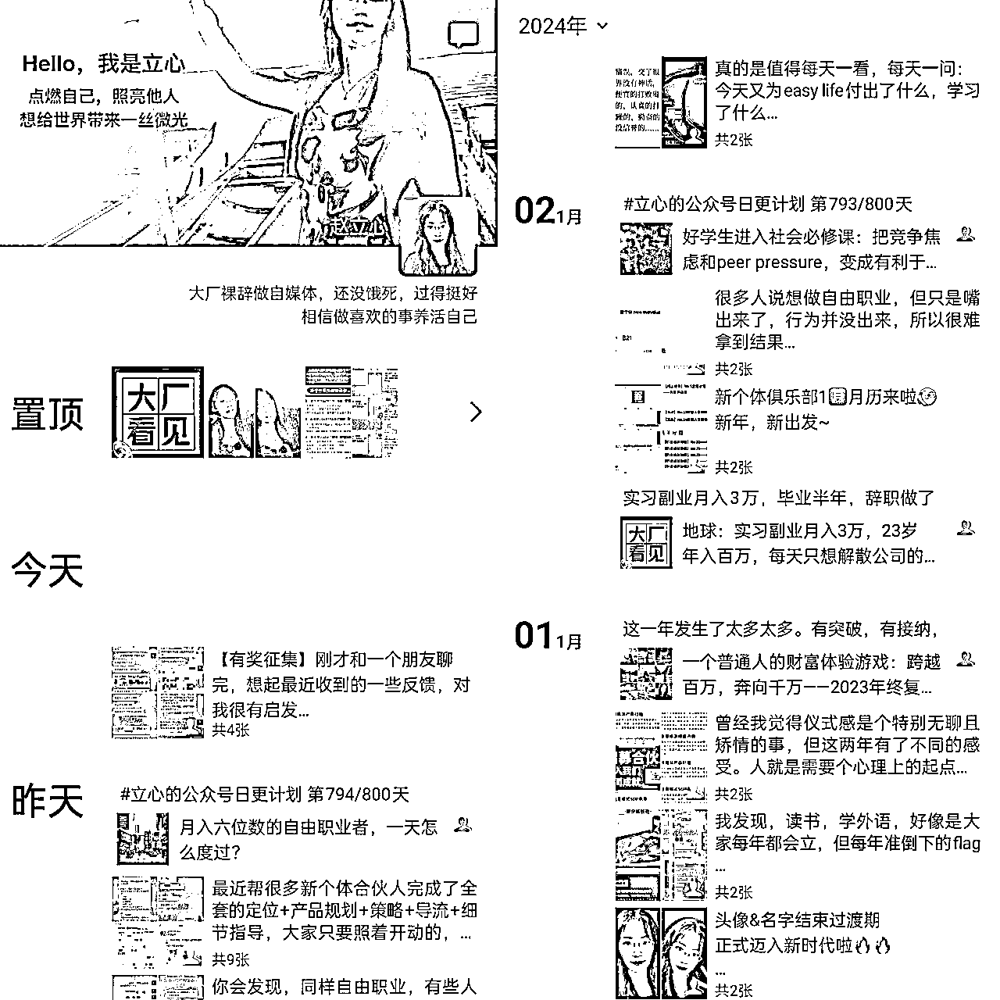

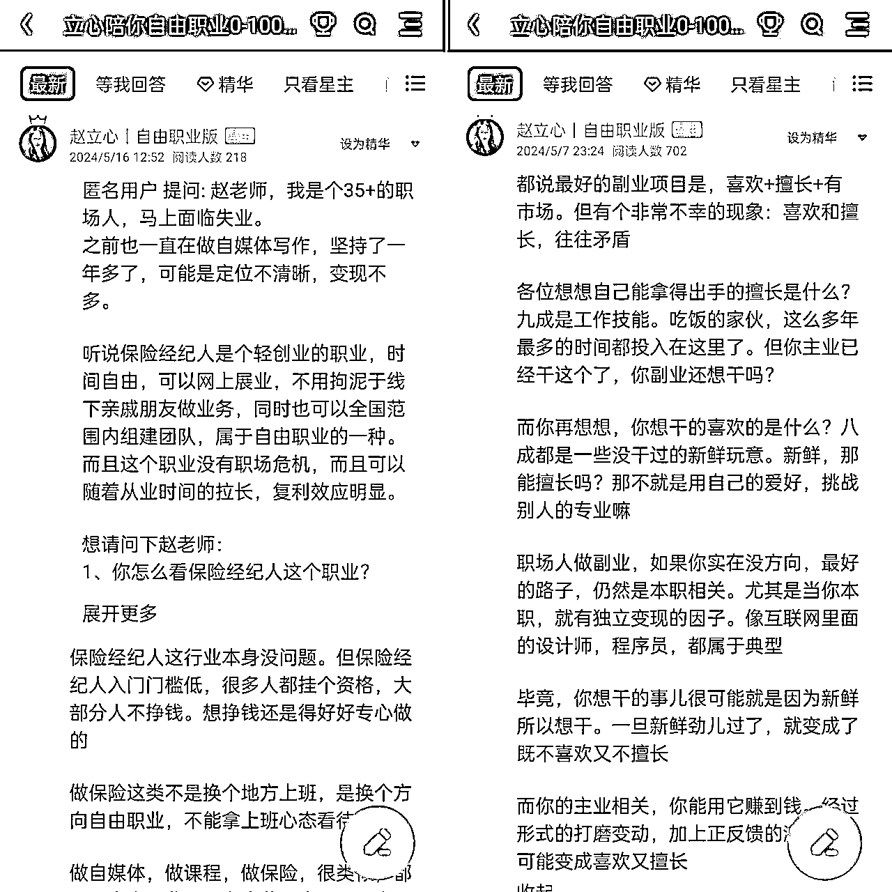

同时，我也会有自己的不为清单，哪些事情，是我要坚决say no，不去碰的。

比如，我在沟通和推流的时候边界都是特别明确的。什么样的问题，对方什么样的表现，可以回答到什么程度，什么是一定要付费才做的。什么样的忙要帮，可以用什么来兑换。

因为自己不擅长，更要把规则定清楚。

再比如，我给一位我的合伙人学员打造的优势飞轮，是这个样子的——

这位学员也实现了月入六位数。她擅长的东西，模式，和我的完全不同，但丝毫不影响我们都拿到了不错的结果。

虽然我们的特质风格不一样。但我们都做了一件事：拿走属于自己的，放弃对属于别人的东西的觊觎。

### 3、标准化的成交转化动作

一套完整的成交转化有很多环节：怎么触达用户，怎么让用户关注你，获取信任，产生付费行为，成为高单价用户。

很多环节都是有标准化做法的。比如搞流量，高效简单的做法，无非是内容钩子获客，推荐裂变获客。再比如做转化，无非也就是销售谈单，大事件集中成交，内容细水长流，几种。

每个细分环节，也都有标准化的动作。具体怎么做的路数很多，做好细节的天花板很高，但是60分还挺简单的。

想提升变现效率：

第一层，先把基础动作做标准。至少达到60分，不拖后腿。

第二层，在标准化的基础上，优化细节效率。精细化，像素级模仿。

第三层，根据自己的优势环节，做创新，组合。

对于1-10这个阶段，最大卡点通常是，停留在差不多，能跑通的水平上，但比较粗糙。信息不够精准，也不够有耐心。

这块首先得去深度进入别人的体系，看清、问清别人的细节究竟是什么样子的。然后，学到位，做到位。

持续向比我level高的人学习，固定跟着几个比我高一两层的人，研究透，做透，充分的相信和执行。这也是我一直在做的事情。

## 如何通过一套标准化流程，实现指数型增长

一个自由职业的商业闭环，无非是流量-转化-产品三端。

在跑通0-1闭环的基础上，每个环节放大10倍，整体就是1000倍。能赚到1000块钱的事情，好好运作一下，大概率也能赚到100万。

但这个10倍，通常并非是简单的优化，而是模式的变更。

就比如，私域转化的一个非常微小的环节：第一次触达。

加一个好友，打一个标签，说几句话，要多长时间？

正常来说，一个人三两分钟撑死了，不费什么劲儿。

但你试试1000倍呢？这次我们做发售的时候，就遇到了这个坑。

开始前，我做了一些准备。先做好话术。平均处理一个人一分钟之内肯定够了。

可是，当4000多好友两三天内加进来的时候，我整个人都傻了。不眠不休的持续操作几个小时，也仍然赶不上新申请好友的速度。

一次点个几十个撑死了，绝对得歇一会儿。而且会有各种各样的情况和问题，有二次回复和需要单独处理的。时间就更不好说了。

事实上就是，我一整天都陷在消息完全看不到尽头的绝望。

当量级扩大的时候。简单的缩短时间，完全不行，必须要换模式。

要不然引入助理来操作。要不然使用机器人。

整个商业闭环都是这样的。赚1000块，和赚100万，需要各个环节的模式升级。

赚1000块，可以是你在朋友圈随便发个内容，吸引到1个人，为你付费1000，就解决了。100万，需要比较成熟一点的商业模式。

比如，常见的标准化模式——

下面，以我们这次的主线，小报童+群发售+高单价产品，为例，来聊聊各端分别的情况。中间某个环节替换掉其他形式，原理也是类似的。

### 1、流量端

流量端的10倍放大，有这些需要重点关注的部分——

#### （1）获取门槛

我在带学员的过程中发现的最大误区就是：做流量品，非要收个一百多两百多。觉得少了太便宜，自己亏了，东西不止值这点钱。

这里核心问题是，你不知道这个产品在你的产品体系里到底是干什么的。

如果要走量，就不要想着价格太低不行，非要同时能赚到很多钱。

最后结果就是，赚钱也赚不多少，量也上不去，用户买还觉得贵，就很鸡肋。

一个完整的闭环里，什么是流量品，什么是利润品。什么动作用来搞流量，什么动作是转化。一定要清晰。

动作的执行要干脆简单。一个动作想同时完成两个目标，最后结果就是哪个也完成不好。

如果是大佬，已经不缺流量，流量品就想做筛选，另当别论。普通初阶玩家，就别想那么多，价格搞低点。

比如说我的小报童，虽然内容量很大，价格卖高点可能也行，作为交付环节，可以卖高点。但如果作为流量品，它就是10元最低价。定位上它就是这个价格。

再比如我们用资料包，如果是裂变的引子，可以设领取门槛。但如果目标是做公域引流，就不要用卖的形式，或者有其他什么门槛。

另外，价格不光指初始价格，还有流量品的涨价机制。很多学员做涨价机制，也非常容易做飘。飞速就涨上去了。

涨价机制是促销节点，是应该要有的。但是同样的原理，不要形成价格门槛，时机和幅度，一定要谨慎。

10元涨到50元，其实也没多贵。但是购买体感上，就完全不同了。

比如我的小报童，在一周里就只涨了两次，从10元，涨到14元。用户感知上，几乎没有差别。但仍然可以起到促销作用。

#### （2）超值的交付

不管是做哪类流量品，都一定要给用户带来超值的感受。超值，才有推荐，才有进一步的转化。

比如，自媒体什么帖子最稳定的容易火？干货合集类。这就是典型的超值感受。别人一个帖子介绍1本书。我一个帖子介绍1000本你一生必读的书。

不一定看得完，但一定要收藏下来。有人问起的时候，也很容易被推荐出去。

其他产品，同样可以塑造这种感觉。

比如，我在做小报童的时候。我的专栏名字叫《自由职业0-100w指南大全》，指南大全四个字很好诠释了这一点。

我的内容有166篇，10大章节，总计16w+字。看起来涵盖了自由职业会涉及到的方方面面，不仅有商业模式、定位、产品、流量、转化、时间心力管理等基础环节，甚至详细到怎么交社保，提离职的注意事项。

而且，这么多东西，只卖十几块钱。是不是超超超值？

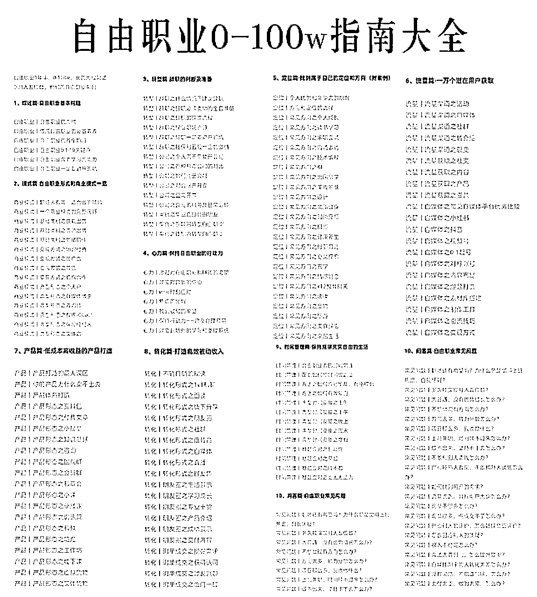

很多学员做流量品，担心里面给的太多，后面没得给了。

但我不担心。只要自己是不断成长的，后面能给的东西，要多的多的多。而且，最珍贵的不是信息，是遇到具体问题时能给出的解决方案。也不是我藏着掖着不给你，是这种形式根本就承载不了。

当时我的小报童很多人有给一些意见，是不是要精简，要涨价。我也犹豫过。但权衡再三，最后还是没改。

做产品，不要看用户说什么，看他怎么做。

多了看不完是人性。但想要的多，更是人性。

觉得便宜的不珍贵是人性。但贪图便宜，更是人性。

显性的理性状态的人性，永远打不过潜意识的人性。或者说，本能。

王兴有段话：“便宜的打败贵的，质量好的打败质量差的，认真的打败轻率的，耐心的打败浮躁的，勤奋的打败懒惰的，有信誉的打败没信誉的。”无外乎如是。

#### （3）裂变效应

做低单价的发售其实比高单价压力大很多。高单价不用那么追求量，低单价必须要把量冲出去，否则就不用玩了。机制上，更需要好好设计。

个人力量是有限的，流量品真的能爆破，还是需要能裂变出去。

核心关注点有三个。

第一，奖励机制

奖励机制一定是能有效促进裂变的强大武器。

但很多学员做的时候，特别容易做成自嗨。给了很多东西，效果也不好。

比如，你给大佬66元红包奖励，让他们去推。这个操作起不到任何激励作用。他们不会为了这点钱去推。给东西要刺激到点上。

奖励的形式通常有两种：里程碑和排名榜。一般里程碑榜主要是给小散的，排名榜是给大kol的。

奖励的类别通常有五种：资料包，付费产品（货/群/课/咨询等），推流，荣誉称号，现金奖励。

有人想拿到现钱，有人想要学习，有人想要流量，也有人想要名誉。需要在中间尽量满足各种类别的需求。

同时，具体情况对每个人来说差别也很大。如果你自己流量很小，推流、荣誉称号就没有吸引力。但对于几万付费用户的社群，推流和荣誉称号就是最大的吸引力。

不能盲目去学别人的机制，要掂量用户的需求和自己能提供的价值。

另外，也要注意控制成本。比如，排名榜可以给高额奖励，人数是固定的，可控。但是里程碑榜，人数是无限的，如果给现金或者一些大规模助推，量级大了之后可能会让整个事情无比复杂+成本极高。

第二，节点节奏

做自由职业，最重要是心气儿。一鼓作气，再而衰，三而竭。

打仗更是这样的。推几次通常大家就推不动了。一定要在咣咣涨的那股劲儿里，最有动力的三分钟新鲜中，完成所有动作。

做裂变切忌战线太长，尤其是非成熟团队。

像我这次，正式动作就是压缩在2-3天完成的。剩下的都是预热和蓄势。

我从提前两个月，开始写这个小报童的时候就开始做预热。每天在朋友圈打卡更新。

开始发售之后有人问，你这个小报童真的有16w字这么多吗？我说我朋友圈打了一个多月的卡，每天写了哪几篇，多少字，你全都可以来查。

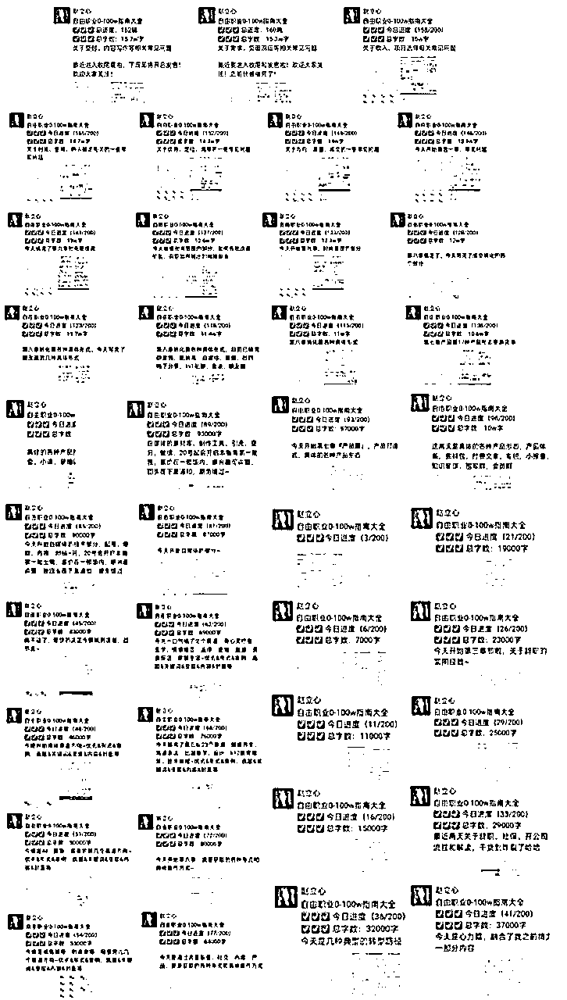

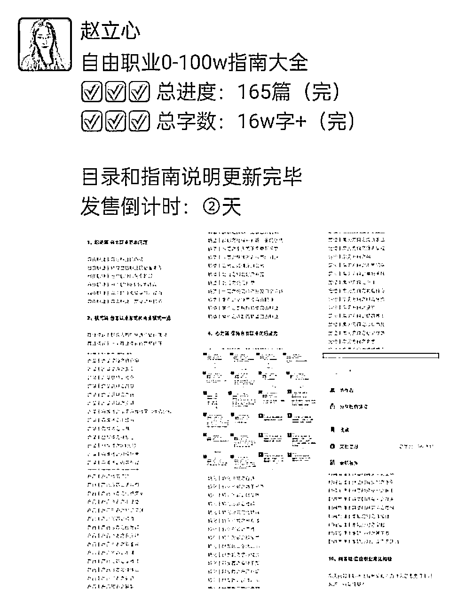

小报童的二维码早就可以发了。但是除了凑内测的50人，让我内部合伙人买了一下。其他的我一个都没卖。

好多人问我怎么买，内部也好几次想开始卖，我都压着节奏。

就是为了集中所有力量在同一天发力，极致聚焦，打透，把节奏搞起来。

让别人感受到这个节奏，被带起来。让用户亲眼见证你写出来，做起来，养成系。这种震撼感是非常强的。

在正式开售之后，还需要不断设置小节点。

通常有三种：报喜，涨价，榜单截止。

比如，我们提前准备了每满500人的报喜海报。3天和6天，排名榜和里程碑榜分别截止。然后插空进行涨价。

保证在过程中，节奏不断。

同时，我也提前给大家准备了这些各种不同角度、不同时机需要的文案。

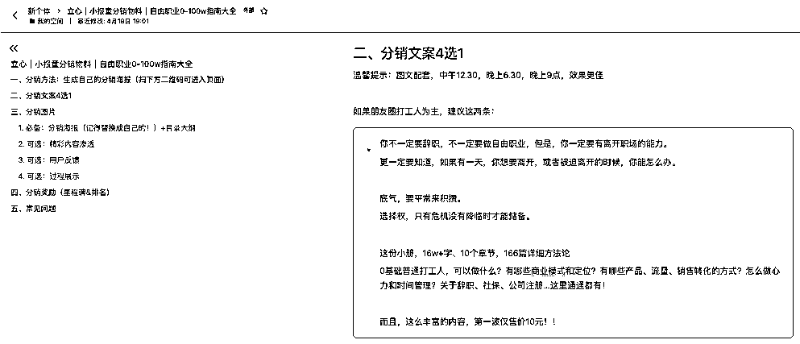

第三，kol的邀请

销量总是遵循二八法则的。80%的增量由20%的核心kol带来。

冷启动阶段，也需要一些kol的助力，把场子先热起来。

这部分需要提前先做一些准备。

一方面，给内部学员、团队做激励。离你最近的人，是最好的证言。

另一方面，给外部友好关系，一些大佬，提前打好招呼。请他们来帮忙。

这块主要功夫在平常。有没有用心和用户维系关系，有没有人脉积累和往人情账户存款。

临场能做的主要就是，把自己能给到对方什么，想清楚，说清楚。不同级别的kol，需求也不一样，要根据他们的需求来看。

对于渠道，比较成熟了之后，还是要采取广撒网、博概率的心态。

有些大佬虽然自身能量很强，但是和你的领域不匹配，效果也未必好。而有效精准的小kol可能效果也很好。这些事情都是无法精准预估的，不要抱有太高的期待。

爆款多少都是有运气成分的。不过动作做到位，结果至少一定不会差。

你找了10个渠道，做了10个动作，即使有一半效果不好，最后大面上来讲，也仍然是有效的。

此外，结束之后，也要真诚的去感谢大家的帮助。我们也花了很多时间，去给各位中间助力的kol制作感谢物料，发放权益。

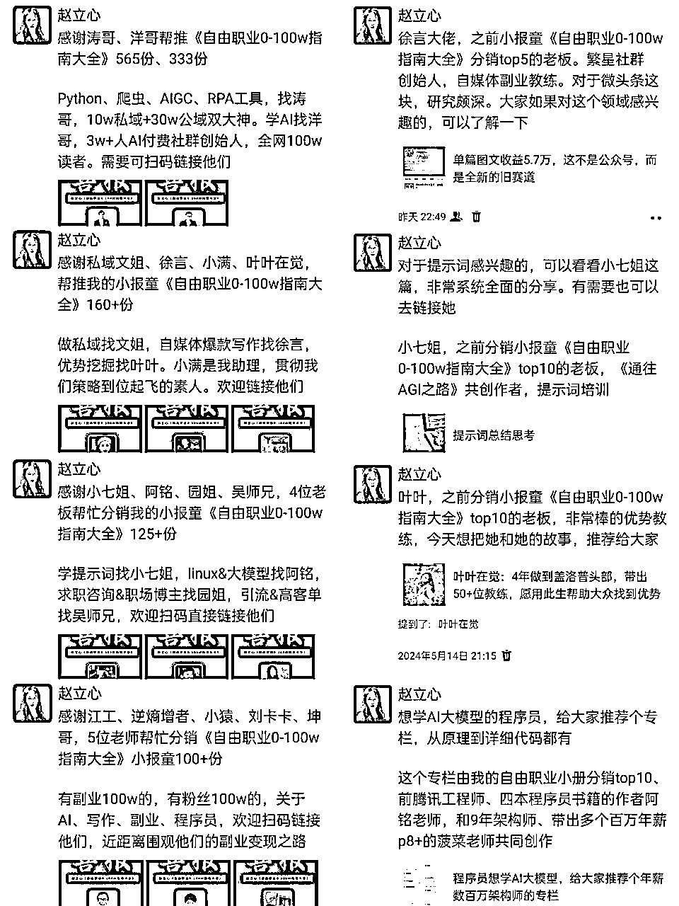

#### （4）钩子的设置

流量品，最后一定要导入到自己的私域，否则就不是自己的。

通常的承接方式：个人微信，社群，知识星球。

其中最高效广泛的，就是加好友领资料包。

除了引流的钩子，流量品还可以做转化的钩子。

比如，适当的秀肌肉，展示个人成绩。

再比如，告知自己有xx服务，如果有xxx情况和需求可以来找我。

这块要注意的是，如果你同时想让用户加微信，加群，加知识星球，关注公众号，买你的产品。不要设想的太完美，每个用户都能走完这套是绝对不可能的。每多一步，都会有一定比例的流失。

先引哪里后引哪里，以及中间的联通配套，细节讲究就非常多了。要提前理清楚。

### 2、转化端

#### （1）快速建立信任

和一个人接触的越多、时间越长，通常对一个人的信任度也越高。

集中转化最大的难度就是，在短期内完成长周期自然建立的信任。

信任是怎么来的？对一个人的正向了解越多越全面，信任越强。

结婚的时候特别喜欢用一个词叫知根知底。你了解对方的家庭情况，认识对方的父母，知道具体情况，关系网的交叉也多，欺骗和不好好对待的成本高，所以更放心。

转化成交也是类似的。我们可以从多个维度，来快速让大家看到这些东西，建立信任。

这个模版给大家参考——

比如，真人出镜直接互动，就要比文字输出信任强很多，能线下交流更是强转化利器。

比如，找一些长期的朋友、学员，连麦、交流、唠家常。多展示自己的真实生活，真实想法和情感。会让别人觉得更加可接近。像我的朋友圈，就是各种内容都有。

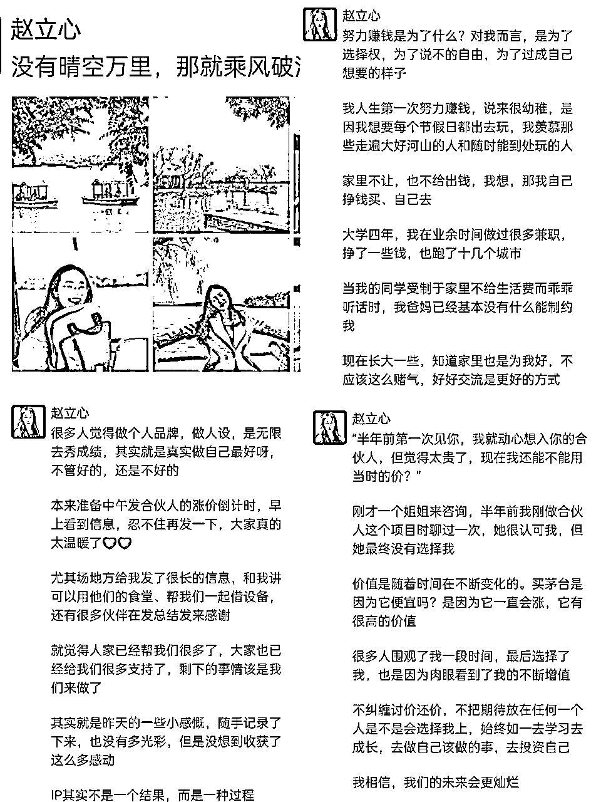

比如，设置给现场的案例分析和解决问题环节。答疑是最显水平的。

比如，在聊产品情况的时候，都拿出真实的学员截图物料，时间、人、内容都是可考证的，而且有明确的成长线和时间节点。也让学员上去交流，做证言。

大家感受一下这个图，是不是要比随口说一个，我的学员xxx，真实、具体、可感知太多倍。

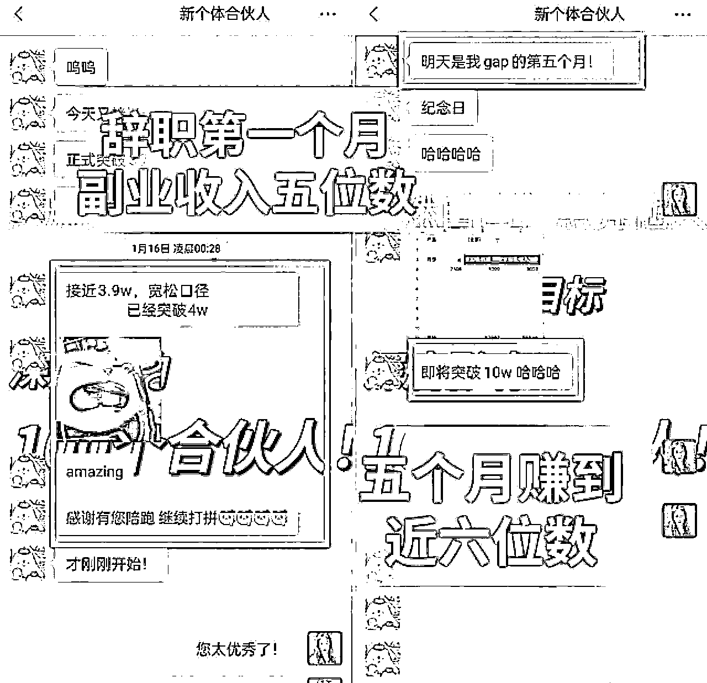

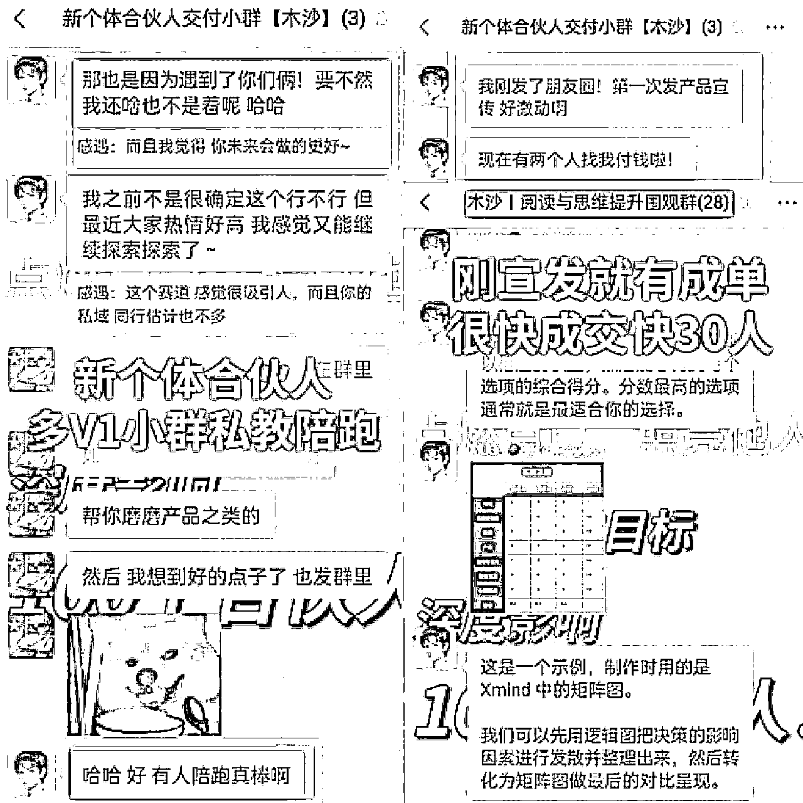

再比如，一些敏感话题，不要逃避和对抗。

就像我发售的时候很多人问，你这些是不是话术。那我就直接说，人很多，是话术，也是本人，有需要可以找我。

群发通知的时候，我也直接告诉大家，是群发，但不是瞎发，是定向给了小报童购买者，且承诺大家之后不会再收到类似群发。

很多学员觉得收佣金卖人家东西不好。我说那你就直接说，我卖这个东西是收佣金的，但我也确实觉得好才给你推荐。

很多东西先行解释了就没事儿了。对方觉得有疑惑，就说清楚。

#### （2）获取更多线索

越了解一个人，越容易成交。对用户是，对产品方也是。

过程中要尽可能去了解到用户的详细情况，有针对性的操作。

答疑的时候，让大家说说自己的详细情况。

比如，设置调查问卷收集信息。

比如，回答问题的时候，让对方说清楚自己的情况和需求。

对方情况都不了解的时候做沟通，无异于盲人摸象。

#### （3）降低决策成本

高单价产品通常决策周期较长，考虑较多。

即使前面信任足够、信息足够，仍然会在下单环节出现各种问题。

一个最常见的方式就是，用中价品来让对方先做体验。但这个相当于把一次销售过程切分成两次，反而有可能让周期变长、变数和复杂度更高。

对于日常成交，这种方式还可以。集中成交的时候就不太适合。

更适合的方式是，体验卡/体验课/小样这种模式。

让对方先做一定的付出，比如交个押金，可退的那种。先来感受一下，然后再做进一步决定。

另外还有一个问题，体验品可以承诺可退，正品尽量不要承诺可退。

即使对产品和交付有充足信心，我仍然不建议大家用承诺可退的方式来出售正价产品。

这种方式确实会让一些有犹豫的人能更放心进来，扩大招生。但招进来的人更容易心智不坚定，给自己留退路。后期的麻烦会很多。

#### （4）设置截止时间

Deadline是第一生产力。不仅适用于做事儿。也适用于买东西。

很多用户可能都对产品动过心，但他们会一直无限期的拖延购买这个决策。需要适当的使用截止时间来促进购买。

典型的比如，体验品补全款的周期限制、下架时间限制。涨价策略。限时送礼策略。截止人数策略。

都属于截止时间的变种。给用户一个当下立即购买的理由。

关于发售的一些细节，我之前有写过另外一篇精华帖，大家也可以查看：

### 3、产品端

产品的10倍，通常是交付更轻更容易规模化的中价品，或者是高价品。

一般后者更普遍，也更好做。

高价品不是单纯的提价，而是解决的问题更值钱，更深度。往往领域还是同一个，但做的事情已经大不相同。

有三种典型。

#### （1）目标人群的10倍

比如，我有一个合伙人学员是做设计的。一开始想做的是教人怎么做海报。

教人做海报，是个需求，能卖钱。但是，这个需求值不了太多钱。

我给她的10倍方略是，更换目标人群。

从服务普通用户，到服务老板。目标人群的支付能力强了10倍不止。

教人做海报，目标群体就是普通用户。没有哪个老板、时间值钱的人，会自己去做海报。一定是直接购买成型的服务。

所以，做工作室，给老板提供成型的设计服务，她的产品端就可以实现10倍。

#### （2）需求价值的10倍

比如，我有一个合伙人学员，做情绪能量的方向。

她一开始做的是带人吃喝玩乐开心。也能跑通变现。但瓶颈也很明显。

普通打工人愿意为开心这件事情花钱，但是，单纯的吃喝玩乐的开心，相对浮于表面，很难收上高单价。

我给她的10倍方略是，调整产品针对的需求。

追求开心，背后的需求是，情绪痛苦。生活压力，发展焦虑，人际关系，等等。

一时的开心很快就会过去，痛苦还会持续。

但如果做深度的心灵疗愈，把根底的问题解决。一下价值就上去了。

我根据她的情况，帮她选了一个适合的细分赛道。很快她就卖出了近万单价的服务。

#### （3）问题深度的10倍

比如，我们自己的产品，就是走的这个路子。把交付做的更深、更扎实，解决问题的效果更好。

我们做自由职业的陪跑。帮助普通职场人，挖掘优势和竞争力，确认定位和商业模式，打通产品、流量、转化端口，提升变现效率。

一开始的时候我们做的就是单纯的咨询。对方有问题就来找我。不来找，我也不管。各方面做的都比较粗糙。

现在我们做陪跑，对标的是教培，极致奔着出结果，而非知识付费或咨询顾问的模式。

每个陪跑学员进来都有1v1的助教带，每周会和学员跟进进度，做详细指导。

会建立个人成长档案，给各个环节的sop。会在大家做不下去的时候，变着法，给鼓励，给支持。

还会带着大家一起做项目实战，做资源等各方面的赋能。

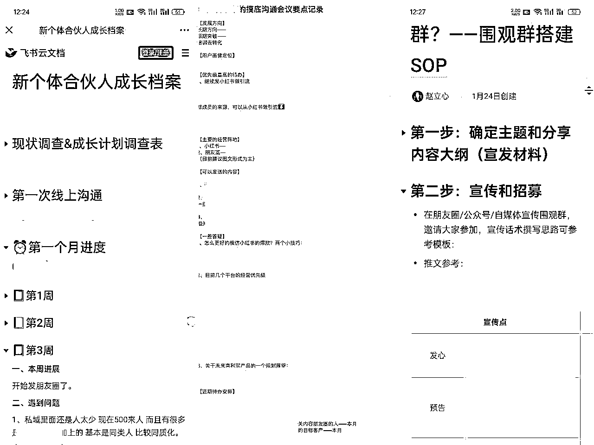

同时，我们也会针对不同阶段、不同需求，提供不同的服务项目。新人进来之后会先进行评估，适合哪条路径。0-1阶段更多的是助教深度跟进，1-10阶段更多是资源赋能+深度信息+综合商业能力的精进。

我们也会根据每个人的情况，配备不同的、适合的教练。满足更高维度的个性化需求。

并且我们的模式一直在迭代优化。会不断根据学员的问题，和具体的情况做调整，更好解决学员的问题。

现在，出结果的人要多了很多。对于自由职业的各方面的问题，不管是怎么做自媒体，打造产品，咨询转化，朋友圈，还是时间、心力，甚至财税等问题。我们都能更深度的解决。

### 4、多端协同

各端有各端分别的成熟玩法，但最后的成交转化是一个整体，还是得匹配得上。这才是对综合操盘能力的最大考验。

比如，有些学员引流环节做的很好，但后端产品没搭建好，只有一些低单价品。那也就是打了个看起来好看的成绩，最后收不到什么钱，也很难持续产生效益。

比如，有些学员产品很棒，交付做的非常好。但是前端获客打不出去，也很快遇到瓶颈，难以突破。

像我们平常就是非常注意内容和案例积累的，我朋友圈，社群，自媒体，都会持续做获客和种草。在把模式跑稳之后，再逐个去做单点突破。

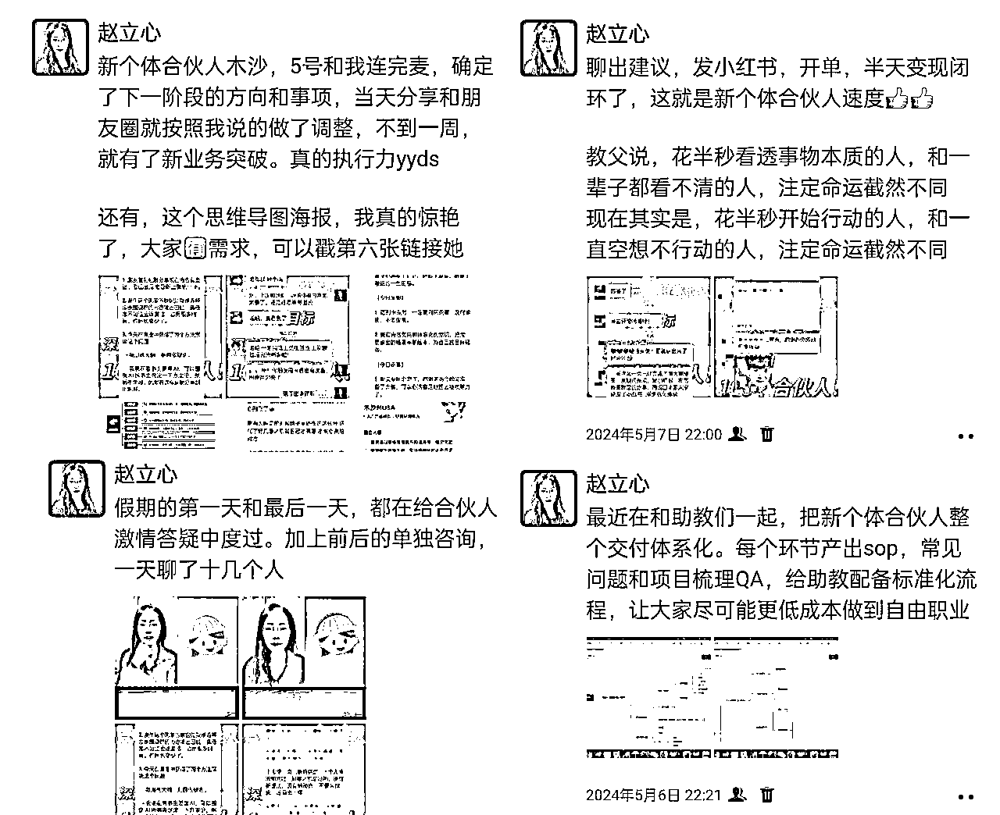

另外，不同的领域和模式，玩法不一样。每个人面对的具体情况，打法也不尽相同。

比如我有个合伙人学员，做给企业端的小红书生意，那么流量的玩法，就不是单纯的看量，要非常精准。对于案例的要求也更高。

比如我另外一个合伙人学员，做的是玄学赛道。这个赛道，目前在公域被打压的太厉害。所以不得不使用公域的极端玩法+大量私域的配合。

这也是为啥，大家经常觉得，看了很多很有用的东西，一到自己手上，效果就没那么好。

这些一定要综合搭配，才能获得最大化的结果。这是最难的部分。需要更高的视角和视野。

## 我的自由职业10倍之旅：始于心力，终于心态

“10倍首先是关于身份的改变，我在心里认为我是谁。就像股票总会在某个点位上不去，人的水平和财富也总是在某个点位上不去，不是真的有个天花板，而是心里的压力，大家认为，就在这里了。这需要放弃曾经的自己，摒弃活动、情景、人，做全方位的刷新。”——《10倍比2倍容易》

3月开始，跟着航海家行动营共读了这本书。我决心，也开启自己的自由职业10倍之旅：承诺新身份，提高标准，迎接挑战。

我以前的想法，就是自己做自由职业，一个人潇洒就好了。我觉得自己只适合单打独斗，处理不了各种人际关系。随缘接点自由职业陪跑，一个月能六位数，自由自在也很舒服。

但是，一个人的能力终归是有限的。

我决心给自己一个新身份：我要带更多人实现自由职业。帮助大家，脱离职场困境，走上自由之路。

我不再是一个自由人。我是一个“团队领导者”。

这就意味着，我要做很多我以前不会做的事情。旧的做法结不出新的果。大幅刷新思维和行为，才可能有大的结果改变。

### 1、聚拢人员，拉起团队，一起做事情

做事情，who比what更重要。这里包含找人，和协作两个部分。

第一，找人：找更好的人，而不是能做的人。

以前我总觉得自己也能做的不错，没有必要找人。花钱，花精力，还不如自己做的好。

即使找人，也就是找个人帮我解决点杂活儿。

但这会陷入低效的陷阱。我不可能在所有方面同时做到最好。我需要更厉害的人，比我厉害的人。

我只能专注在某一环自己最擅长的事情上面，而后去和别人合作。

对于我来说，核心擅长就是内容和机制设计。

那这次做小报童+群发售，我在谈单、销售、运营等所有我不够擅长的环节，都高价聘请了外部助力。求的就是，释放自己的注意力，节省自己的能量，去关注更重要的事情。

同样，我也找了配合的团队，来和我一起做日常的各个环节。

第二，协作：领导，不是管理，而是愿景驱动。

每个人都是这个团队的领导者。我不是个管理者，我是和大家一起航海的人，激发每个人对海洋的渴望。

所以我现在会非常注重，和大家的沟通，提振士气。不是简单的，任务分发机。更多的是，把自己的能量和愿景，传递出去。

我以前觉得自己做不了这件事情。我真的不是一个表现力感染力很强的人，甚至风格接近于平淡木讷。

但后来发现，并没有那么难。简单，真诚的，把自己所思所想告诉团队。并且，相信他们每个人。

找到优秀的人，而后，给大家更多的空间去发挥。并且，用我的能量和能力，去给大家做赋能。这就是所有的全部了。

### 2、提升标准，瞄准更高要求

我以前觉得，我做到领域的差不多水准已经不错了。但这次，我给自己提升了标准。我给自己定位于，我要成为这个领域的top。

所以，我们做《自由职业0-100w指南大全》的发售。我在发售前定了个指标：我们要卖到4000册。这个目标，当时我和大家说，大家都有点觉得，这么高，做不到。

但实际上，我们一天多就达成了，很快达成了两倍多。

为什么是4000册，大家可能不太有概念。

当时我做过调研，市面上销量超过千册的小报童都不是很多。业内，个人到3000多册基本上就铁定推不动了。再往上面的不是一些老牌大佬，就是团队的项目。

那我说，我们的目标就是4000册。超过这个标准。

我在做之前就把这个话放出去了。和我们团队说了，和合伙人学员们说了，和外面很多人也说了，甚至和助力的资源方大佬说了。

就是势在必得。没有退路。

我心里很忐忑，不知道做得到与否。但我想逼自己一把。牛吹出去了，总不好意思打脸。总得努力一下。

就像贾玲拍热辣滚烫。这个剧要成立，她必须得减到100斤。她前期投入那么多了，不光是资金、时间，还有自己的信誉，很多人上了这条船。

你已经入局了。不完成也得完成。

《论语》里有句话：取乎其上，得乎其中；取乎其中，得乎其下；取乎其下，则无所得矣”。

有很多事儿，在找参考标准的时候，就已经决定了，能做到什么程度。

如果没有这个目标，大概我在推到1000多册的时候，就觉得也挺不错了。不会殚精竭虑的去冲后面的目标。

实际上，如果我的标准是，超过市面水平。那我就不能照着别人的做法去做。用别人的做法做，不可能做出超过别人的结果。

所以在一开始我设计整个机制的时候，我并没有照着任何已有的小报童路径来做。更没有用任何小报童的质量水准，来做我的小报童。

思考原点不是和市面产品的比较，而是：到底什么样的内容，用户更需要，用户更满意，用户更愿意转发推荐。

别人十几二十篇，写了几天，写一个垂类领域，拿出去发。我写了一个多月，写完166篇，写了各个领域，才开始发。

别人的分销奖励榜一般就是几十几百的奖金，我的直接给了1000。而且，我是照着几万人星球的拉新榜单在做我的奖励榜。打着亏一万的量在做这件事情。

事实上，几乎所有环节，我都做了诸如此类的准备。

10倍的决心，不仅是我要做更能的事儿。也要正视更多的困难，和决心承担更大的，可能做不到的风险。

担心做不到有两种方式。一种是放弃，一种是为此做plan A，plan B ... 各种预案。 我选了后一种。

我想，事情的做法是，我先定目标，然后尽全力去完成。而不是，我掂量着，我能做成什么样子，之后再卡着去定目标。

或许你觉得，有必要吗？这事儿也没多大，做成也没多厉害。确实。但我觉得思维方式和行为模式是一以贯之的，每件事儿都拿出这种状态，和每件事儿都差不多就好，最后一定是不同的。

### 3、所有的细节，做的再好一点

每个地方，做的比别人好一点，最后形成的或许就是压倒性优势。

我在给大家做自由职业陪跑的时候，经常听到很多人说，自己学了一堆课程，看了一堆书和资料，做不出来。其实很正常。

大家看着好像说，他赚到100万，不就是发几个朋友圈，做了个小红书，做了个什么产品嘛，我也照着做就是了。

这个颗粒度就跟，我要化妆化成范冰冰。她上了口红，我也上口红。她上了眼影，我也上眼影。我就能成为范冰冰的脸。一样的离谱。

很多成败都在数不尽的细节里。死磕细节，做到极致。

就像我们这次的发售奖励，中间的转化环节，话术，每一项都是我参考了无数市面类似项目，反复打磨过的。光是奖励这个，前后我就改了六七版。上面每一个字都是反复打磨过的。

我给合伙人们看，我问他们，感觉怎么样？他们问，送课程的这些权益，我们是不是已经有了。我意识到，合伙人的激励不足。于是，我给合伙人出了一个专门针对内部的激励策略。

我给朋友看，我问他们，这个能激励你多发吗？他们说，可能推的差不多就不推了。奖励差别也没有很大，再推感觉也很难出单了。于是，我把前几名的奖励，增加了差异化，拉大了金额奖励。又给了一批不同角度的文案，让大家能换着发。

我给助理看，我问她们，你会因为这个奖励，多发一条朋友圈吗？她们说，如果我现在有4单，我或许会冲一下5单，但差的远了，就不会了。于是，我把前半段的里程碑奖励调的更密集了，1单，3单，5单，10单，一步一奖。

比如，我觉得奖励的价值感不明确。于是我标注了奖励的量级，单价。

比如，我觉得如果拉的人数太少，成本太高了。于是我加上了奖励需要的人数限制。

比如，海报做完了之后，我觉得看着不清晰。光是海报，又改了三四版。

无数的细节，如此反复打磨，修改。直到最后一刻。

### 4、选择，是舍弃的学问

比如说，权衡用户和kol的利益。

小报童定价这个事情，是我纠结了特别久的一个大问题。我前后问过N个人。

前面说了，它是引流品，应该低价。但实际操作还是有很多的问题。

价格高了，用户购买有心理压力，决策成本高，裂变出去难。

但价格低了，大家转发的时候没有动力，分销也没几块钱，裂变出去也难。

后来的考虑就是

第一，最后的终端还是用户，用户利益为先。如果只是满足了kol的需求，不符合用户的需求，kol很难推。但如果满足了用户的需求，kol好推，最终也会满足kol的需求。

第二，小报童本身的定位还是流量品。既然是流量品，既然目标是销量、人数。那么，它就应该是个价格上不构成压力的东西。这个是最核心的作用，取主舍次。

第三，在这个大原则下，通过提高分销奖励榜的奖励、定向邀约等其他方式，来平衡kol的利益，提升kol的积极性。

比如说，权衡特殊性和一般性。

大部分人的链路是，小报童-加微信-进陪伴群，通过陪伴群去转化

我的链路是，小报童-加微信-知识星球，后面单独拉群做发售来转化

有几个考虑点

第一，我需要把知识星球做流量沉淀池，后面给合伙人学员们导流量，这个从战略意义上讲，高于我本次马上收了多少钱。小报童单点做了多好，这件事情的意义并没有太大。但对于整个体系的长远意义，值得。

第二，我们后面要做群发售，这个群发售，不止是针对于小报童人群，是完全对外的。如果我们一开始承诺，给小报童专属陪伴群，后面做强转化动作，而且不买的人也能进，这个体验就很不好。而且中间隔了一段时间，用户的注意力持续不了那么久。

第三，我不想拉免费群养人，运营成本非常高，效率很低。他们刚开始做IP的这么整就算了，我这个流量这么大，我转化能力也不弱，就完全没有必要。

所以就选择牺牲掉触达更直接的群，改成引导进知识星球。

再比如说，权衡成本和收益。

中间有一个环节是，我要给所有前期买了小报童的人群发信息，让他们进入公开课群。

但有一个很头疼的问题是。群发助手，群二维码的图片发不出去。我问了一圈，在当时的已有条件下，这个问题解决不了。

于是有三个选项

第一种，效果最好的，我手动给所有人发，9个人9个人的批量转发。看起来好像一个人没多久，但架不住人多。算算就知道了。连带勾选，找人，下翻，就算发一轮1分钟，4000多人，400多分钟，不眠不休也得7个小时。我之前加好友的时候吃过这个亏，不能在一个坑里跌倒两次。

第二种，给大家说，想加入群，扣1，我拉。我判断回信息的成本很高，折损会比较大。至少对我这样的社恐，如果你给我个二维码，我静默可能就扫进去了。但让我给你回个信息，我就得琢磨一下。

第三种，朋友圈放个二维码，和大家说，让大家自己扫。虽然链路更长了，但是可以自己偷摸看到情况，知道是个免费群，直接能进，人也不少了，心理压力会小很多。

综合考量，我用了第三种。

这些都没有对错，只是你更想要什么。

中间我也有很多因为经验不足，准备不足，非常智障的处理，和后来发现不够完善的操作。

比如，完全没有做好这么多好友一下涌来的准备，手工加好友加到大半夜，基本属于浪费时间重复工。

比如，用群做发售，现在的效率确实是越来越低了。触达情况很不好。但是，在新的成熟办法出来之前，它仍然是最好用的。

比如，我有时候也在想，发售排行榜三天就截止了，时间再长一点是不是会能数量冲的更多一些？但我不想占用资源那么久，后面还有其他人。

再比如，当时内测有人提到部分章节有点短，有案例更好，这个后来也有被吐槽。但这不是短时间能改出来的。而且定价这么低的小册，毕竟不是真的课程。如果这样还觉得不值的，也不是我们的潜在用户。

时间的配合，心力，这些我觉得还是更重要的。太久会不会状态没了，这些调整了又真的对结果能有很大改变么，谁又说得好呢。没有最完美的结果。一切，已经很好了。

### 5、极致专注，重要的事只有一件

虽然整个商业，涉及到产品流量转化各个端口，要方方面面兼顾。一次操作，也有很多环节。

但同一时间，最重要的事情只有一件。

极致专注，单点打透。

比如，在我做小报童的时候，最重要的就是，把这个量级拉到最大。

后面的事情，已经提前规划好了。现在就不考虑。

举个简单的例子。

当时小报童发售期，很多人来加我好友。那么，加完好友，给什么指令？

自我介绍，引导购买高价产品，这都是常规操作。毕竟小报童只是流量品，大头是后面的利润品。

但我的引导重点并没有放在高价产品的介绍上，而是仍然围绕着小报童。

首先，只要对方没说已购买、截图过来，就默认对方没买，再推一遍。事实证明，很多人就是看了上面的微信号，直接加了好友，确实没买。很多这样二次成单的。

其次，如果对方说了已买，引导深度阅读。我提前写了一个小报童的阅读说明，发给大家。让大家先深度消费内容。

最后，引导对方继续裂变。在我的说明和内容里都有适当的环节引导读者做分销。我的加好友话术里也着重引导分销。

为什么这么做？

第一，如果自己没想清楚，最重要的是什么，给一堆乱七八糟的指令。那么，用户也会很懵逼。给用户的指令要简单干净，每次只有一条重点。

第二，每个环节做什么，是提前要策划清楚并坚决执行的。高单价很难几句话就成交，除非对方决心很大，转化的事儿就交给后面群发售去做，不要浪费时间硬成交。而小报童承担的就是流量+增强信任的作用，用户深度消费了这个内容，后续也会更容易成交。

第三，用户刚刚购买了一个产品，虽然说价格不高。但预期仍然是被交付，而非被推新的产品。这时候从交付角度的给予，要更好。而且小报童的产品形态很特殊，很多人买了找不到，这样操作也会避免一些问题。

10倍，绝对不是更轻松了。而是在更少的事情上，更费心了。思考的粒度更细，应对的问题更难。

自由职业，是一项强烈关乎心力的运动。

于是，这段时间，我也在有意识的给自己做清理。比如，把一些能花钱就解决的操心事儿，用钱解决掉。比如，重新重视作息和运动，增强自己从外到内的能量支撑。

诚然，一个好的结果，都有运气，有各方面因素。但，我想原理是一样的。目标定在哪里，花费多少心思。最后的结果，一定会不一样。

看着好像大家都在做类似的动作。但大家做的，很可能完全不是一回事。

毕竟，我的10倍，也是相对于自己而言，不和任何人去比较。

也顺便有一个小提醒，我上述说的所有具体细节，放在大家的实际情况中，可能都是错的。不同阶段不同情况，差异很大，谨慎使用。

比如，遇到卡点的时候，在top的阶段，才有创新的必要。开始阶段，模仿就是最好的，大部分人的问题反倒是，在没有手感的时候一定要自己创新。

比如，聚焦，专注，都是相对的。如果你的闭环都没有跑通，那你就得什么都做，否则单点技能再强，仍然无法变现。

再比如，中间给大家举例的产品方式，并非所有人都适用。不同特质和性格的人，都不一样。

但很多原理和思考方式，或许可以对大家有些微启发。

## 写在最后

2021年4月我加入生财，和今天很多刚进入的朋友一样，觉得里面全是大佬，高不可攀。

在前两年的时候，我一直是纯纯小透明，和大佬们搭不上话。但我没有闲着，我想着，或许有哪一天，可以变得不那么透明一点。

2023年，我写了一篇转型的帖子，命运的齿轮开始转动。受邀做航海教练，实战派访谈，年会嘉宾分享，视频栏目，线下组局，加入航海家。

这一年和生财的接触非常紧密，受益颇多。真正见识到了这个圈子的强大力量。也见证了，写好内容，做好事情，真诚利他的力量。

现在和真正的大佬比，这点微末成绩，仍然什么都不是。不过也没关系。时间还长呀。

我之前写过一篇精华帖，聊做事和做势。IP要持续性做事，间歇性做势。

没有事的积累，无以成势。没有势的爆发，事就是感动自己。

或许你听过有人给你讲，要日更做积累。

或许你也听过有人给你讲日更没用，爆款才有用。

但我自问没有什么很强的天赋。再不努力，还有什么能拿得出手呢。

对于普通人如我，没有日复一日的练习，又哪里来的爆款呢。

纯粹做事是没用，但目标导向、持续迭代的做事很有用。

大部分所谓的天纵奇才，不过是后天刻意练习得来的。

我的发展速度相比于很多人并不算快。但我会始终让自己在前进的路上。不断突破，不断成长。

就像龟兔赛跑。持续向前，可能比飞速向前，更加有效。

也送给所有，还在焦虑着的你。

相信厚积薄发。相信时间的力量。相信即使今天如何，凭借自己的努力，明天也可以非常精彩。

在这半年的突破中，我收到了非常多大佬和朋友们的帮助。在此也特为感谢。

感谢亦仁哥和条形马马哥，在我路演时提出的问题和指导，真的是醍醐灌顶。打通了我很长时间的困惑，让我决定开始做这些事情。没有这次沟通，就没有后续的一切。

感谢洋哥、芷蓝姐，真的是举整个体系在倾力相助，对我们的操盘和声势壮大，都有巨大的助力。

感谢靠谱姐、理白哥，持续的托举支持，过程中给到的宝贵建议，还有对本帖的修改指导。

感谢我的操盘手彩卉，运营官雪萌、邵菲、梦梦。发售过程中有非常多突发事件，但是大家都在全力以赴。靠谱，团结，一起想办法。很荣幸有你们。

感谢sitin彭涛、内推熊cjm、Gone阿秀，私域文姐kevin，徐言、叶叶在觉、小七姐、园姐fightingmom、逆熵增者、阿铭、程序员吴师兄、黄赟、江工、谭庆波、刘卡卡、坤哥、小猿等诸多大佬，在拉新过程中的大力支持。

感谢我的合伙人牛牛、园姐、夏至、感遇在公开课中帮我站台。还有我的合伙人邓邓、jessie、竞一、甘甘、甜小菜等，在发售过程中的支持。让我这一路走来，不孤单。

感谢阿坡帮我做的RPA工具，不厌其烦一遍一遍帮我适配调整。感谢洪智提供的小报童数据。感谢饭大官人提供的小报童复盘。给了我非常多重要参考信息。

感谢之前负责微天使项目的木棉小姐姐。一直持续鼓励我向前突破，给了我很多的信心和动力。

还有诸多兄弟姐妹们的支持，无法一一点到，但都记在心上了。都是多亏了大家，才有这个看起来还不错的结果。

最后，感谢大家的耐心收看，希望能对大家有所帮助，也希望看到更多优秀的朋友在自由职业之路上实现突破。

整个商业闭环里面细节还蛮多的，篇幅有限，无法把所有都说的特别详细。大家如果有什么需要，也欢迎和我交流。