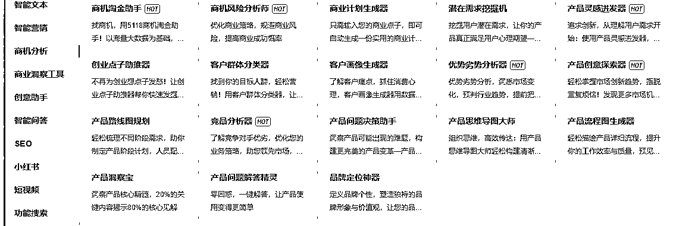
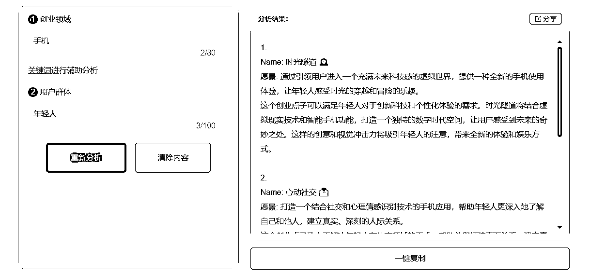
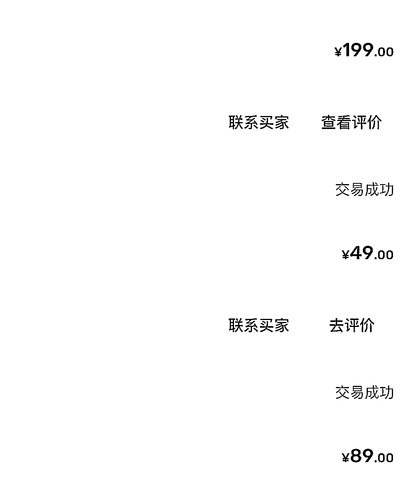
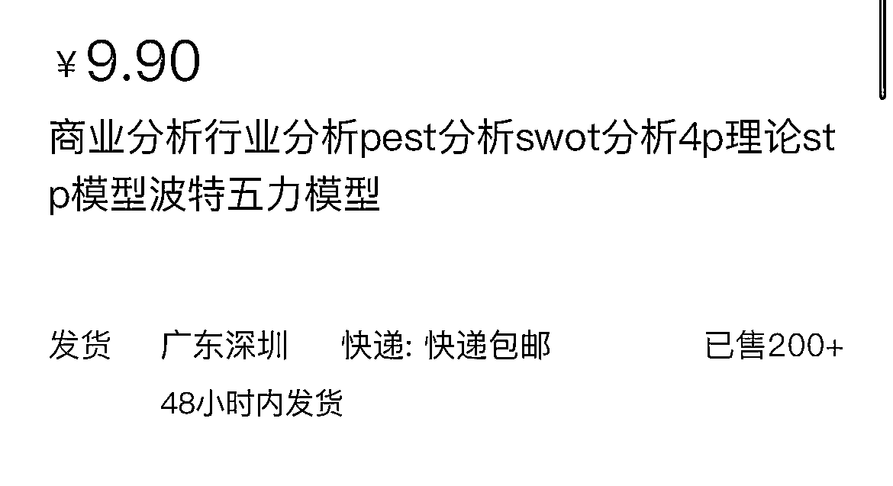

# 通过Ai赚了5位数的经验跟反思

> 来源：[https://opkmy65iz4.feishu.cn/docx/GiOQdk0hfoO5fkxR2dOcuCV3nRg](https://opkmy65iz4.feishu.cn/docx/GiOQdk0hfoO5fkxR2dOcuCV3nRg)

# 一、自我介绍

我是一名普通的青年，学历普通，经验普通，家境普通，自小就生活在农村，辍学后就去亲戚的眼镜店上班，处于一个比较封闭环境，每天都是接触跟眼镜相关的信息，对于外界跟其他行业发展信息知之甚少，一次偶然的机会，加入生财才慢慢扩展了自己的信息圈子。知识付费跟混圈子是普通人改变最快的路径，从你每天获取的信息开始改变你的人生。

# 二、Ai代写

## 一）

Ai代写收入：15000+

### 1、尝试

以前因为有做自媒体，在AI还没普及的时候就开通了5118会员，在chatgpt出来后，没多久就发现5118上架一个商业分析的功能：包括创业点子、优劣势分析、用户画像、PEST框架分析等等关键词，我就尝试去闲鱼上架这个服务。

### 2、从0到1

上架第一天就发现有人来咨询了，由于一开始没经验，就随便报了个价格可能10块钱，然后把关键词跟需求输入5118的列表里面，简单筛查一下，觉得没问题就发给客户，过程还是比较简单的。

### 3、高峰期

#### 1)：成绩

一开始是尝试闲鱼，发现需求很旺，一天咨询的人虽然只有7-8个，但个别单价高，有的一单有200，那时候一天一个号基本有200-300收入，维持了大概半个月左右，可惜后面被闲鱼下了链接，说关于学术之类，这一点现在各平台做代写都会尽量避免敏感词了。

#### 2)：市场细分

1.  学术写作：

*   期刊文章：

*   原始研究：实验结果、数据分析。

*   综述：文献回顾、理论框架。

*   评论：对现有研究的批评和建议。

*   学位论文：

*   文献综述：现有研究的总结。

*   研究方法：实验设计、数据分析技术。

*   结果与讨论：研究发现及其意义。

*   学术报告：

*   会议论文：简短的研究介绍。

*   演讲稿：正式或非正式的学术演讲。

1.  商业写作：

*   商业计划：

*   执行摘要：商业计划的简短概述。

*   市场分析：目标市场和竞争对手分析。

*   营销材料：

*   品牌故事：品牌历史和价值观。

*   营销策略：市场定位和推广计划。

*   企业通讯：

*   企业社会责任报告：公司的社会和环境影响。

*   投资者关系材料：财务表现和未来展望。

1.  技术写作：

*   用户文档：

*   安装指南：软件或硬件的安装步骤。

*   故障排除：解决常见问题的方法。

*   技术规格：

*   设计文档：产品的设计细节和规格。

*   测试计划：如何测试产品以确保质量。

*   研发文档：

*   项目提案：新研发项目的建议书。

*   风险管理计划：识别和管理项目风险。

1.  创意写作：

*   小说：

*   科幻小说：探索科技和未来世界的故事。

*   浪漫小说：以爱情为主题的故事。

*   诗歌：

*   叙事诗：讲述故事的诗歌形式。

*   抒情诗：表达个人情感和思想的诗歌。

*   剧本：

*   喜剧：幽默或讽刺性质的剧本。

*   悲剧：探讨严肃或悲伤主题的剧本。

1.  新闻写作：

*   硬新闻：

*   现场报道：直接从新闻现场发回的报道。

*   专题报道：对特定主题深入调查的报道。

*   软新闻：

*   人物特写：对个人或群体的深入报道。

*   评论和专栏：提供观点和分析的文章。

*   专栏文章：

*   观点文章：作者对某个话题的看法。

*   社论：代表出版物立场的正式文章。

1.  法律写作：

*   法律文件：

*   法律备忘录：对案件的法律分析。

*   法律简报：对法律问题的详细讨论。

*   法律分析：

*   法律评论：对法律原则或案例的学术讨论。

*   政策建议：对法律或政策改革的建议。

1.  医学写作：

*   医学研究：

*   临床指南：基于证据的医疗实践建议。

*   系统评价：对特定医疗干预的全面评估。

*   医学教育：

*   患者手册：为患者提供的健康信息。

*   医学继续教育：为医疗专业人员提供的教育材料。

1.  教育写作：

*   教科书：

*   基础教育教材：针对小学生和中学生的教材。

*   高等教育教材：针对大学生和研究生的教材。

*   教学材料：

*   教学视频：辅助教学的视听材料。

*   在线课程：通过互联网提供的教育内容。

*   教育研究：

*   教育心理学：研究学习过程和教学方法。

*   课程设计：开发和评估教育课程的方法。

#### 3)：建议

先从其中一个细分领域开始做，毕竟激励竞争，还有一个好处，在足够小的细分领域你有机会做成一个小IP，让用户去转介绍跟建立影响力。要有长期运营的打算，不要想一时之利，内容交付不能马虎。

### 4、换平台

转战淘宝，淘宝感觉宽松一点，不过淘宝新店流量比闲鱼真的差很多，到目前为止我也没怎么去弄他，都是靠淘宝自然流量。闲鱼真的很适合新手去玩，抓到一个品类卖的好，要学会矩阵，多搞几个号，说不定过阵子就被官方封了，先把钱赚到口袋里。

### 5、总结

以上就是大概做Ai代写的过程，通过5118网站切入一个细分领域，在由各平台发布内容接单，最后通过Ai写作完成交付，Ai写的终究有些死板，需要检查稍微做一些修改，一些首先.....其次......最后等等格式，一系列格式让人一眼就看出是Ai写的。后悔当初没有把这个代写当回事，觉得这个市场小，没去扩大经营，也没去做更多的市场，导致错失了做大的机会。

## 二）赚钱的一些思路

### 1、思路

习惯接触新词并搜索，我的第一桶金就是看到5118中的关键词，一开始先去闲鱼看有没有做这个服务，发现只有一两家，就上架尝试，过程前面有介绍了。由关键词衍生的服务，后面在一步一步通过客户去了解背后需求跟交付，一点点打磨。每一个关键词你都能当成一个服务或者教程那样去打造。

### 2、市场规模

要估算市场规模，大概估算用户数x付费x单价，自己能触达的用户，大概做一个月也能摸到这个规模，要是触达的用户实在有限，自己能达到业绩估计也是可观的，就得早做打算了，是把这个打造成项目卖还是多做一些市场。

# 三、Ai绘画

Ai绘画收入：1000+

## 一）mj

Mj刚比较火的时候，也是通过淘宝买了一个共享号19块钱一个月，然后通过给别人跑图9.9/5次，也赚了一些钱，不过确实也是辛苦跟麻烦，要跟客户沟通跟关键词表达，后面也是直接放弃了。

## 二）sd

一部分是通过吴东子的教程，一开始的SD做文字背景项目，也是通过淘宝、小红书等平台展示吸引客户，并成交，没有坚持太久，也只是赚一点小钱。

## 三）总结

以上也是一些简单的，可以赚点小钱的操作思路，新软件出来的时候，很多人都想尝试玩一下，不想去开一个月，甚至更长的时间，这时候可以去租个共享跟充值个号，做服务也可以租号出去，都是最简单赚钱方式。

# 四、思考

## 一）思考

通用大模型可能只是开始，最后的小模型跟行业模型才是商业的一个目的，我做为一个门外汉的思考，也可能是对Ai肤浅的认识。

## 二）角度

我在想我一直站在Ai有多么强大，多么方便，能做多少活的角度去看，是不是错了，是不是应该换个角度去看，企业的角度，实用的角度，个人的角度等等。

## 三）细分

Ai也算一个大门类，关于普通人如何通过Ai去赚钱，一定要落实到一些细分领域上。

Ai做图细分有做头像、壁纸等娱乐类，有做产品图、效果图、建筑装修图等商业类需求；

Ai文字也同理继续分文章跟论文类的，交付给平台还是个人等。普通人想通过Ai搞钱一定要做细分在细分。

## 四）建议

Ai绘画的COMfyUI的工作流方式我觉得是符合企业或者ai的高效率工作方式，ai写作现在好像也可以搭建工作流形式。搭建辛苦不过流程搞定了，只需要一个指令就能搞定，才是ai工作流+RPA才是值得研究的方向。

# 结尾

在今天，互联网一天生产的内容，我们花一辈子都看不完，选择性去看，建立一个指标，一般只关注这个指标相关的内容，比如Ai具体场景的应用，做为一个非程序员想通过Ai赚钱，去学习大数据，大模型，算法，道路太长远，

多关注自己能上手做的事。

以前看课程听过一句话感觉对我挺有帮助的分享一下：你在什么优势都没有的情况下，想通过标准的方式战胜比你厉害的对手，大概率会输，学会耍流氓，用非标准的方式去跟他玩。