# 虚拟学习资料项目追热点，4天赚1000+

> 来源：[https://jvx6nnxr4va.feishu.cn/docx/GrgqdIuhIoLQB6x6Z0gc4T1mnYd](https://jvx6nnxr4va.feishu.cn/docx/GrgqdIuhIoLQB6x6Z0gc4T1mnYd)

大家好，我是奉小又，裸辞近两年，靠自媒体装修一套房，主线项目虚拟学习资料，副线项目得物好物种草。

这个前不久有跟大家分享过，感兴趣的可以再去看看。

这个月教资面试热点，带几个执行力好的学员追了一波，小红书建群4个，共1865人，引流微信343人，总变现2700+，其中一位学员4天1个渠道变现1000+。

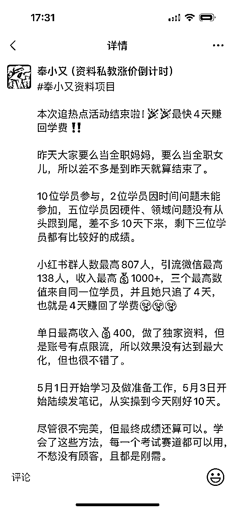

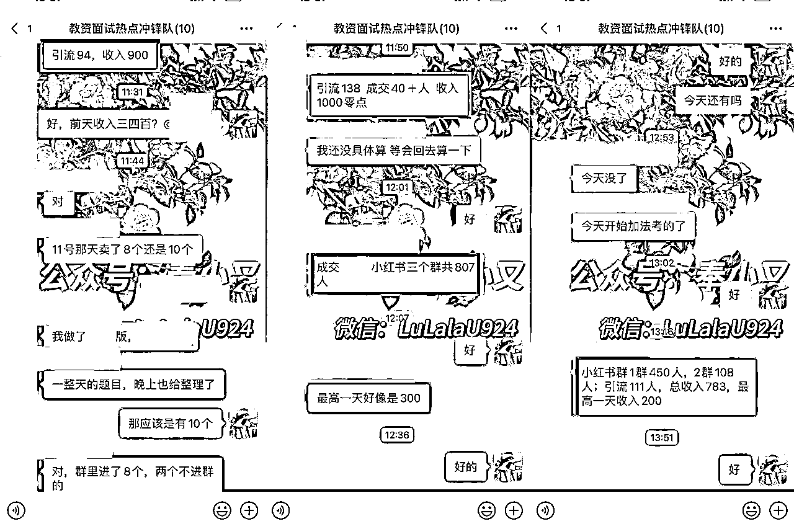

学习资料项目是我目前接触到的网赚项目里唯一能全方位快速锻炼一个人的自媒体能力的项目，运营思维、销售思维、产品思维、热点敏感度、网感等等，都是这个项目的必备技能。

可以说你搞定了资料项目，那么你之后去做自媒体的任何赛道都不会很难。

还有一点是它能直接给你解决产品问题，很多同学想做自媒体，也学了一些平台运营和引流技能，但是由于没有可以承接流量的变现产品，往往只涨数据无法变现。

这也是我最初遇到的问题，空有几千粉变现不到一千，但是做了资料项目以后，一个600多粉的公众号就变现了一万多。

今天就跟大家分享一下这个项目的变现逻辑。

## 一、什么是虚拟学习资料项目？

市面上有很多考试，比如考公、考编、考研、教资、财会、建筑等等，几乎每个月都有考试，很多人在网上求资料，市场需求非常大。

所以就诞生了一些资源整合的团队，这些团队负责收集资料，但不直接零售，我们普通人没有办法去做这样的团队，但是做零售每个人都可以。

所以做这个项目的资料来源一般有两种：一种是自己去收集，有能力的话自己出一些资料；还有一种是加入资料团队，用团队的资料去引流、售卖。

一般的资源整合是没有版权的，比如真题、笔记之类的，此外还可以做一下服务类型的产品，这个放在后面详细讲。

## 二、如何引流变现？

前面说了，这个项目可以全方位锻炼一个人的自媒体能力，而做自媒体绕不开的一个点就是引流，没有流量再好的项目都是空谈。

你能想到的所有的平台都可以引流，公众号、小红书、抖音、微博等等。

我做四六级押题引流的时候很忙，因为要带孩子，所以每天只有四五个小时可以工作，当时只做了微博和公众号。

就这两个平台我都忙不过来了，公众号我只发了一篇就有20多个精准用户加我，成交率非常高。

我学员用我的方法去做，效果也很不错。

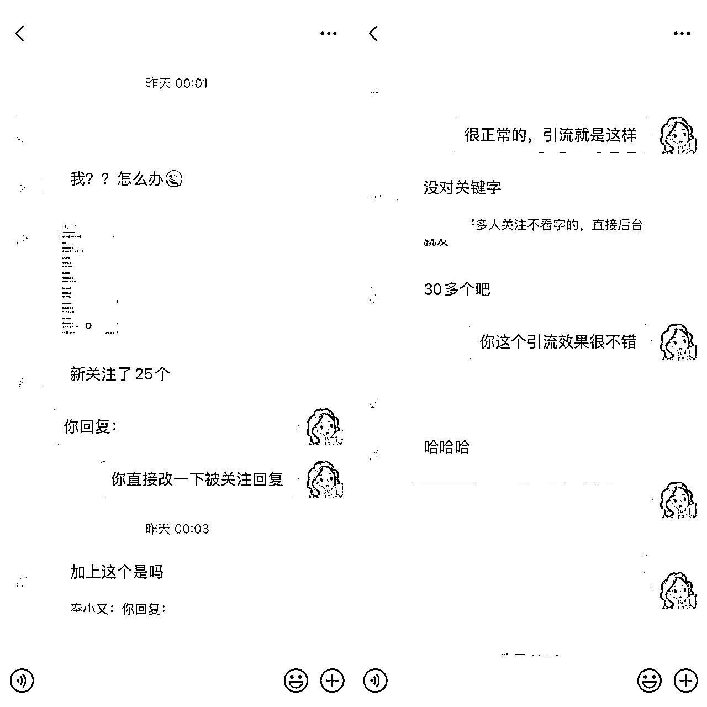

一篇推文，新公众号涨粉30多个。

微博就是去对应的超话引流就好了，不过要注意，一不留神很容易被举报或者被超话拉黑，这样你的号权重就会降低。连续被两个超话拉黑，你的号就废了。

小红书引流效果也很好，给大家分享一个比较基础的方法。

你把自己伪装成一个求资料的，发个帖子，加一个求资料的热度比较高的话题，等看着流量跑起来了，就自己在评论区说：找到了！太不容易了！

再找个小号去你自己评论的那条下面回复：姐妹，可以分享一下吗？

你自己再回复引导就行。

如果平台提示违规，隐藏笔记就行了。

或者去各大平台各种帖子下面截流，说自己上岸了，用的就是博主分享的这套资料之类的，再找个小号去你自己的评论下面问：姐妹，可以分享一下吗？

然后就会有人跟风说求分享，你再针对性引流就可以了。

这次带学员追教资面试热点的主战场就在小红书，主要引流方法是建小红书群，再从小红书群引流到微信。

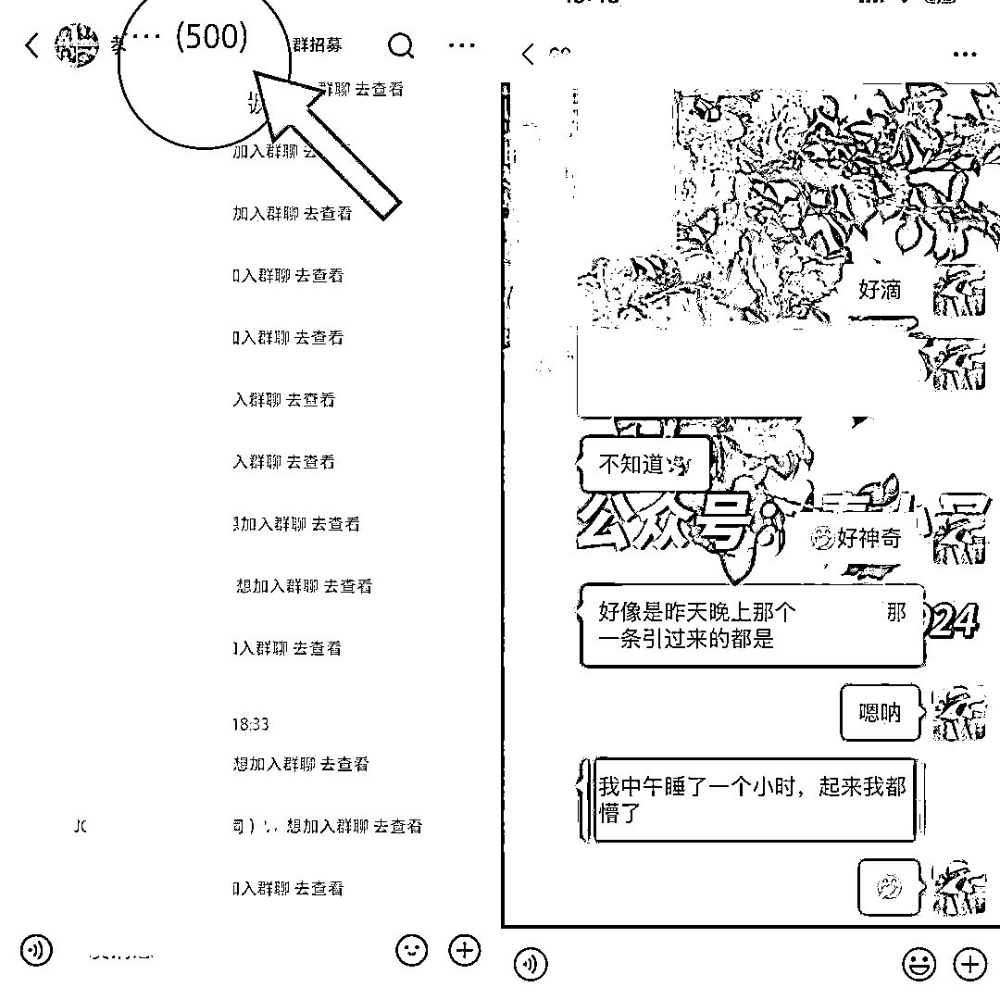

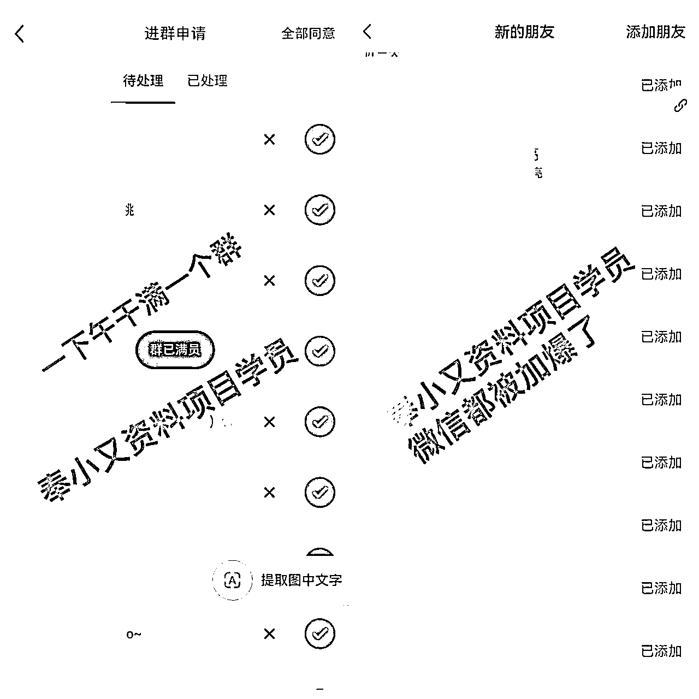

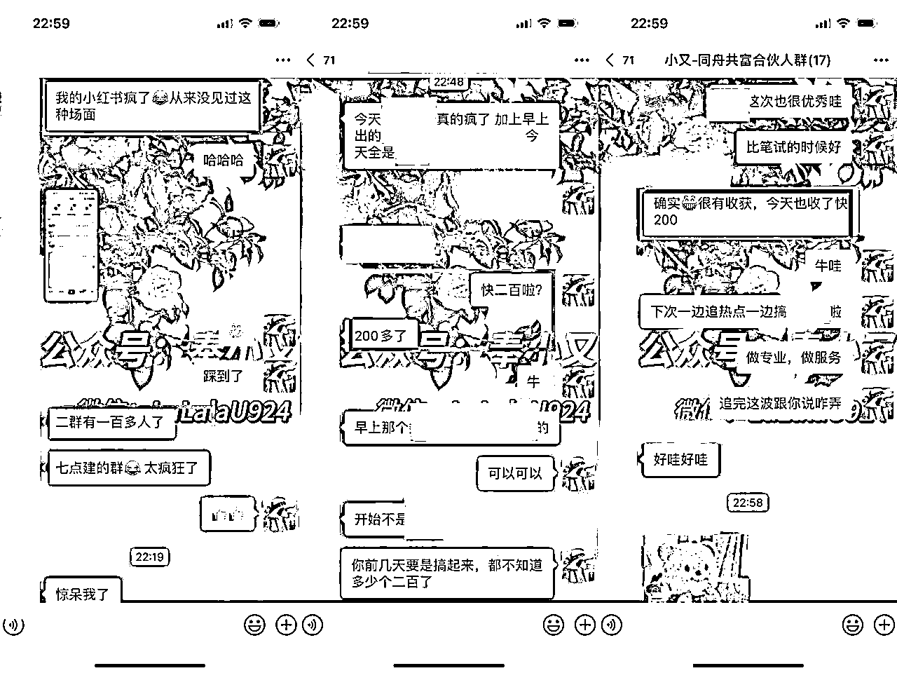

这是今年第二次带学员追热点了，3月份教资笔试也追了一波，当时效果也很好。

面试热点引流准备比较仓促，临时决定建群大家一起追的，5月中旬考试，4月30日晚上才临时决定带，准备账号、养号就两天时间，真正开始引流变现可能就几天时间，只要跟上节奏的同学都赚到钱了，虽然不算很多，但是这么短的时间能取得这个成绩我自己也满足了。

## 三、如何发现爆款资料？

引流之前首先要弄清楚，自己要做的这个考试都考哪些内容，哪个部分占分比较大，再去各大平台看看哪个部分比较火，提前把这些资料整理好，做几个组合定价。

这次教资面试热点，按照我们以往的经验，结构化、押题、逐字稿是比较好出的，但实际操作发现题库速递需求量非常大，而且都是刚需，加上微信以后基本没有什么废话，都是直接转账。

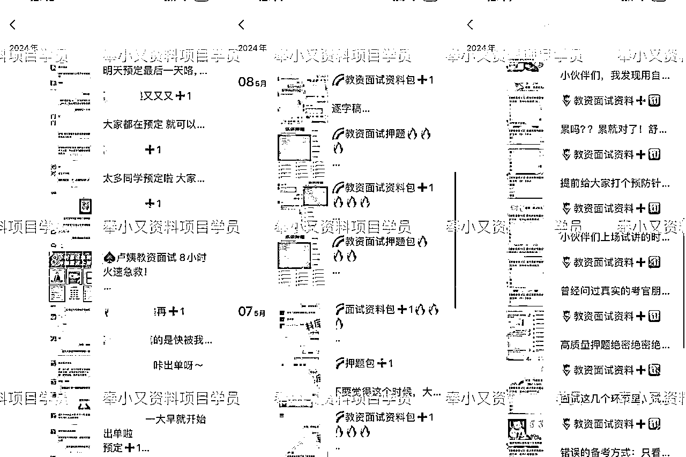

在看近期爆火资料的时候一定要搜最近3天最火的笔记，多去看别人是怎么发的。

比如下个月考四六级，我们去搜小红书搜六级这个关键词。

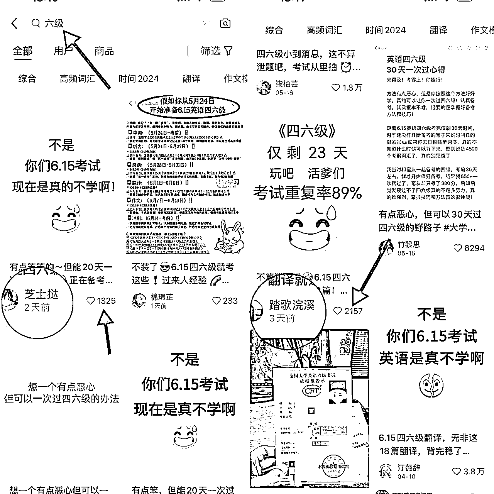

这样就能看到近期最火的内容，看同行都在发什么，自己跟着发就好了，别人会火，你也会。

如果这个关键词搜不到满意的，再换一个具体的关键词去搜，比如六级作文、四级听力等等，同行是最好的老师，跟着去学就好了。

这样下来，现在哪个资料最火最好卖你就知道了，准备好微信做承接，朋友圈氛围一定要弄好，成交截图、资料截图、爆单文案等。微信个性签名也可以改成“六级作文素材爆单中”“教资面试题库速递爆单中”之类的，甚至昵称都可以改为“XX（四六级版）”之类的。

一套组合拳打下来，要出单真的不难。

如果引流来人没有成交，那一定是朋友圈没做好。

## 四、如何拔高单价？

追热点的单价一般都不会很高，一单大概在19.9~39.9之间，因为这个时候临近考试，考生大多抱着临时抱佛脚的心态来求资料的，所以没有办法精细化运营。

要想提高单价，有两个方法。

### 1.做独家资料

如果你不够专业，那就把事情做细致。

比如这次教资面试热点，我有个学员就发现某个资料是PDF（大家用的都是这个，竞争力不强），不太清晰，不好打印，她就花了一些时间自己做成了word版，还加入了一些别的内容，让资料更丰富，那这份资料相对来说就是独家了。

同样的资料，别人卖29.9，她可以卖39.9，收入就会比别人高一截。

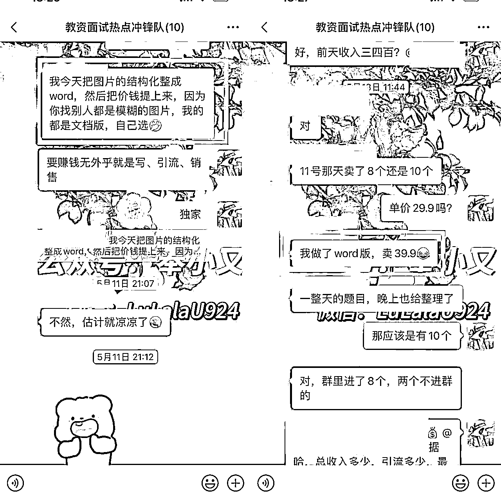

如果你流量足够大，没有时间去做这样的“独家”，直接卖资料团队的资料也是可以的，以量取胜。如果流量不大，就把事情做精，提高单价，一样不会少赚。

### 2.提前布局做服务

要想把单价做到大几十甚至几百，一定要做得更专业一些，要在考前一个月甚至2个月就开始布局。

这里有一个问题，如何提高专业度。

小又我自己没有考过教资，也不是师范专业，但是我带过两期教资笔试陪考，我是怎么做的呢？

我自己买了卢姨的课，从头到尾看了一遍，还把历年真题和解析都看了一遍，此外还收集了很多教资笔试的干货贴，知道教资笔试主要考哪些知识点，哪些是重点等。

可以说让我去考教资笔试是没有什么问题的。

于是我就把这个考试分成几个阶段，每个阶段耗时多少，需要用到哪些资料或者知识点，都归纳好，把这些都给到考生，定期监督，基本上我带的考生只要去做了的都上岸了。

当然，你可以不用像我这么累，一般来说一个考试的复习无非就是三个阶段，第一个阶段打基础，第二个阶段巩固知识点，第三个阶段刷题冲刺查漏补缺，每个阶段需要哪些资料你给配好就行了，不够专业就不去监督，只卖规划表，赠送复习资料就好。

如果你够专业，还可以做细分领域。

比如我有个学员自己曾经是高中语文老师，一开始也是只打算卖资料，后来我发现她分析作文非常专业，于是我就让她主打教资作文上岸辅导，一个考生可以收到200多。

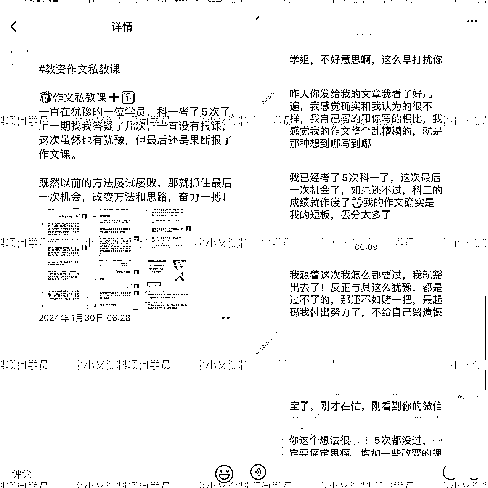

后来她还出了自己的作文押题资料包，面试也做了自己的上岸辅导课，在这个领域，几乎没有人跟她竞争。

## 五、如何保持热点敏感度？

一般来说一个考试的热点有三个，一个是报名后的十来天，一个是考前10天，还有一个是考后对答案的一两天。

报名后十来天是很容易出高单价的，考前10天一般单价都比较低，考后对答案主要是引流做储备。

那不知道什么时候考怎么办呢？

去小红书搜2024年考证时间表。

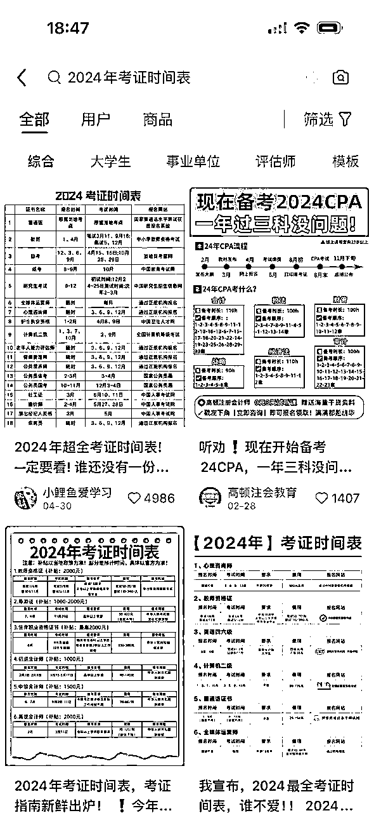

你会看到一大把人帮你把考证时间都总结好了，时不时去查一下，你想做哪个考试提前去布局就好了。

结合前面追热点的方法，一年四季你都不会有淡季。

还有，爆过的内容一定会再爆，这次考试爆了的，下一次考试一定也会爆，所以注意总结复盘，下次考试就可以提前发，抢占第一波流量了。

以上就是我做资料项目的经验，希望能给做这个项目的小伙伴一些帮助或者启发。