# 【实测】AI智能体到底有啥用？我用Coze手搓了一个免费私教！

> 来源：[https://v0bko2tq65.feishu.cn/docx/HMlOd659PoLpPBxKhd1cqziHnKb](https://v0bko2tq65.feishu.cn/docx/HMlOd659PoLpPBxKhd1cqziHnKb)

最近 MBA 课程迎来了考试周，有很多门考试需要准备，复习资料一大堆&……￥#……@。看？是不可能看完的！所以打算用最近新学的 AI 知识，手搓一个小机器人，我问它啥，它就能根据课程内容给我回答啥，而不是给你瞎白活。没想到效果贼好！

## 用 Coze 手搓私有知识库 Agent

这学期我选修了一门《创新创业管理》的课程，简直赚大发了！

老师上边讲的是理论，我这脑子里出现的，可都是一幅一幅画面啊。不得不说，之前创业踩过的坑，踩得那叫一个踏实、那叫一个精准、那叫一个义无反顾。要不说“理论”这个东西好使呢，那都是从实践中千锤百炼提炼出来的，对实践确实是有指导意义的。

废话不多说，咱们就拿这门课搓个机器人，开整！

### 制作 AI-Agent 的思路

一句话来说，就是通过给大模型喂一些专有的数据，来实现你问他啥，他只根据专有数据的知识来回答。重点和难点在于控制。

控制个啥？控制 AI 不要发散、不会给你侃侃而谈、不会联网之后给你说点有的没的，而是只根据专有数据来回答；控制 AI 根据我们规定的格式来回答。

这里头引入两个概念（都不难理解）：知识库、工作流。

知识库：就是你专有的资料，可以是 word、pdf、excel 啥的。我们这里准备的是课程的录音和老师的 PPT 内容。

工作流：一听也能明白，它是一套流程、一个系统。你丢进去一个东西（你的问题），它经过处理后，给你吐出来一个东西（回答）。是我们控制 AI 的重点。

好了，有了这两点知识，足以搓一个机器人了 🤖。

### 1、上传知识库

我们先把课程录音跟 PPT 上传到 coze。

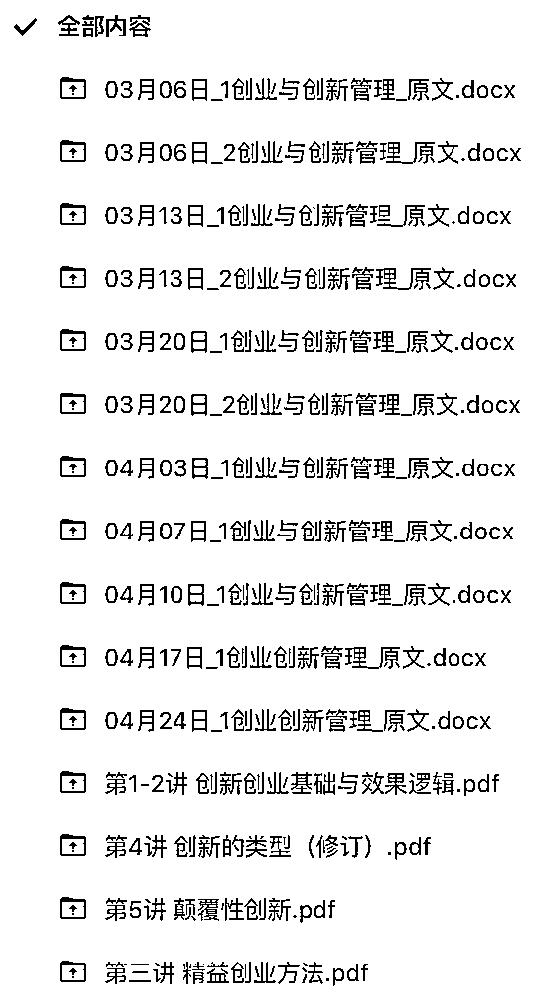

上边 WORD 文档是通过“通义听悟”将录音转成的文字稿，下边的 PDF 是课程的 PPT 内容。

目前 coze 知识库支持 PDF、TXT、Word、Excel 几种格式的本地文件上传，还支持飞书、Notion 这种在线文档，还支持自动采集网站数据等方式，可以说是很方便了。

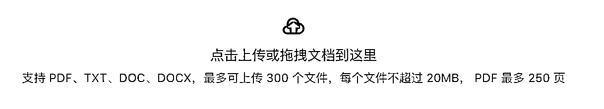

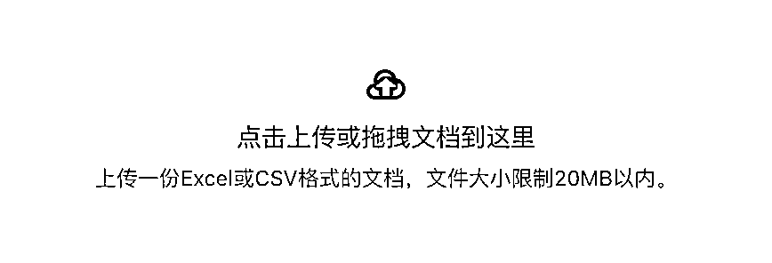

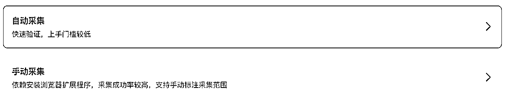

### 2、制作工作流

上传完知识库之后，重点还是制作工作流，给大家看下我的工作流，并不复杂。主要用到了大模型、知识库、选择器、数据库等功能，其实 coze 真正强的还是插件的能力，咱们这个案例里没用到。

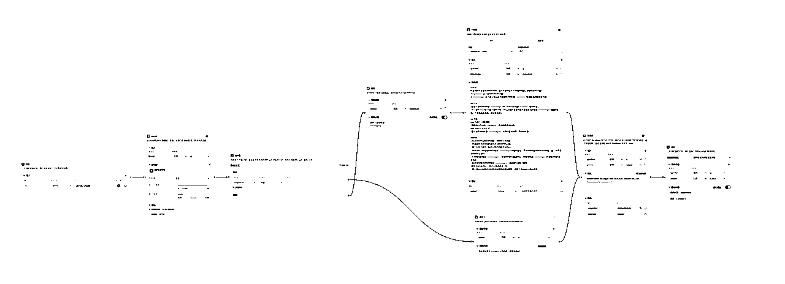

怎么制作工作流够单开一篇来讲了，不是咱们今天重点，有兴趣的可以私下讨论哈。

咱现在，主要还是看下效果。

### 3、效果展示

先来看看最终效果，哒哒！就一个输入框，你负责问，它负责答。我这是用 PC 端，发布出来之后手机端也可以使用。

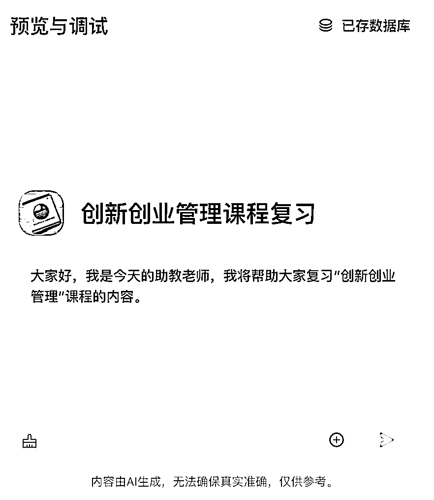

#### 1）先问个“是什么”的问题

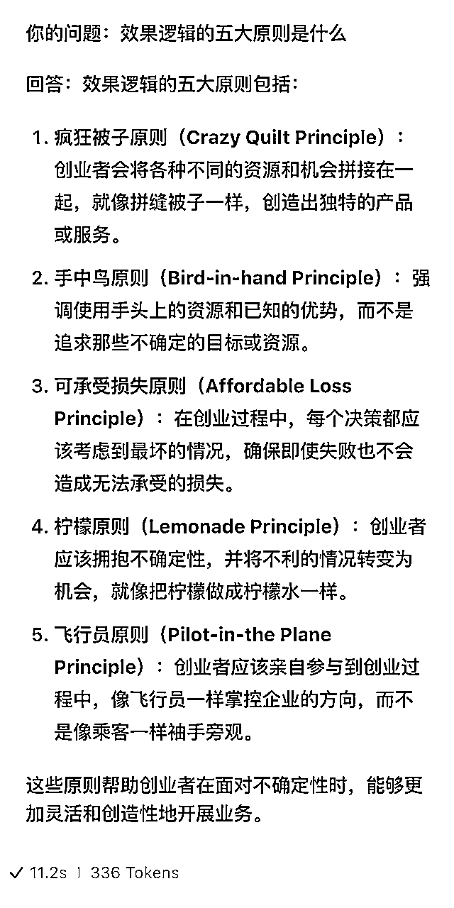

怎么说呢，这 5 大原则说的很准，但是解释的还是有点含糊，稍微差点意思，再追问一下。

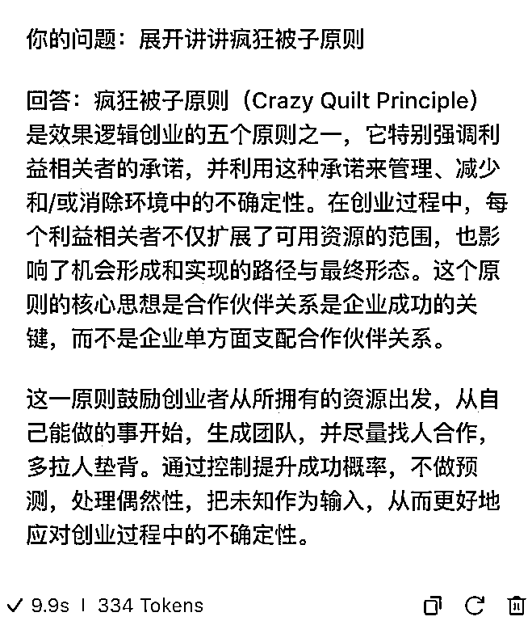

嗯~是内味儿了！奈斯！再来个尝尝：

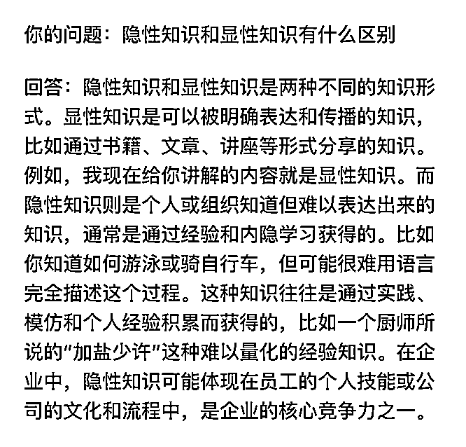

艾玛，说的真有道理，咱还得多积攒隐性知识，我感觉显性知识以后肯定能被“AI+搜索”取代。关键是这总结的寥寥数字，大约是老师讲解15分钟的知识点，表达的非常到位了。

#### 2）再来个“为什么”的问题

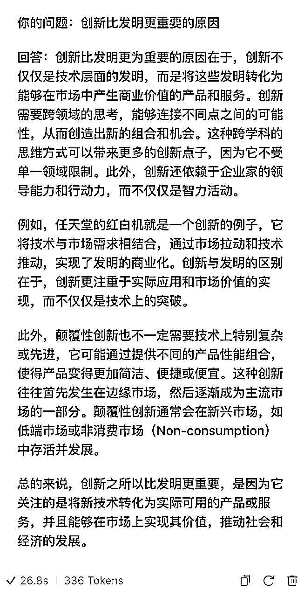

秋豆麻袋！我明明问的是“为什么创新比发明要更重要”，它回答的时候解析成了“创新比发明更重要的原因”，应该是它理解意图时候的问题，这个回头可能得稍微改改工作流。

不过不影响整体使用，而且不得不说，甚至讲的还有点好呢~成功唤起了我失忆的大脑，任天堂红白机推出的时候，是一个精神小伙发明了一种新的主板，性能优秀，任天堂老板说用这个主板做什么都成，但是成本要控制在一万日元以内。老师在课上用这个案例，来解释创新与发明的区别，精神小伙是技术出发，任天堂肯定是从市场出发，考虑如何用技术创造商业价值。

我们再来问下小机器人，这个故事是不是我脑海中这个样。

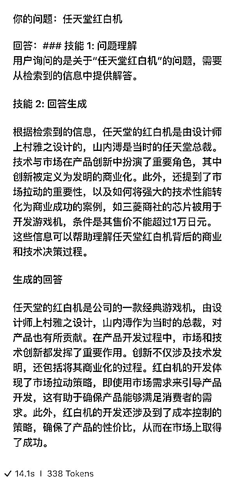

险些翻车，这回小机器人明显有点力不从心的感觉，它居然把我的一部分提示词给展示出来了，不过主体内容还可以，也大约是我记忆中那个样子。勉强接受。

揣测是大模型或者是提示词的问题，提示词可以后续再优化一下，大模型用的是 kimi，不知道用 GPT-4 效果会不会好一些，回头也测试一下。

再来一杯！

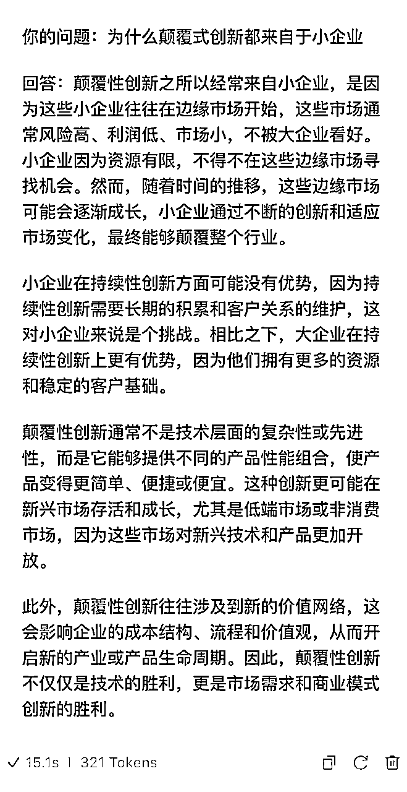

啧啧啧~ 这个回答无懈可击了！真的！

#### 3、最后来个“怎么办”的问题

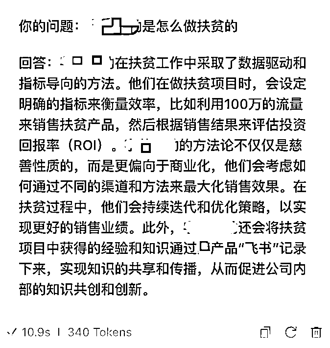

讲的是某大厂是怎么做扶贫的，请允许我稍微码一下。印象中说的是大厂搞扶贫，通过在自己的媒体上投放，来卖扶贫产品，比如给了价值 100 万的流量资源，重点测试是否可以卖出去 300 万的货，扶贫任务结束后，凭借这个投放的模型，扶贫企业可以持续卖货。是一个商业与慈善结合的案例。

同样，我们再让小机器人回顾一下这个案例，看看是不是这样。

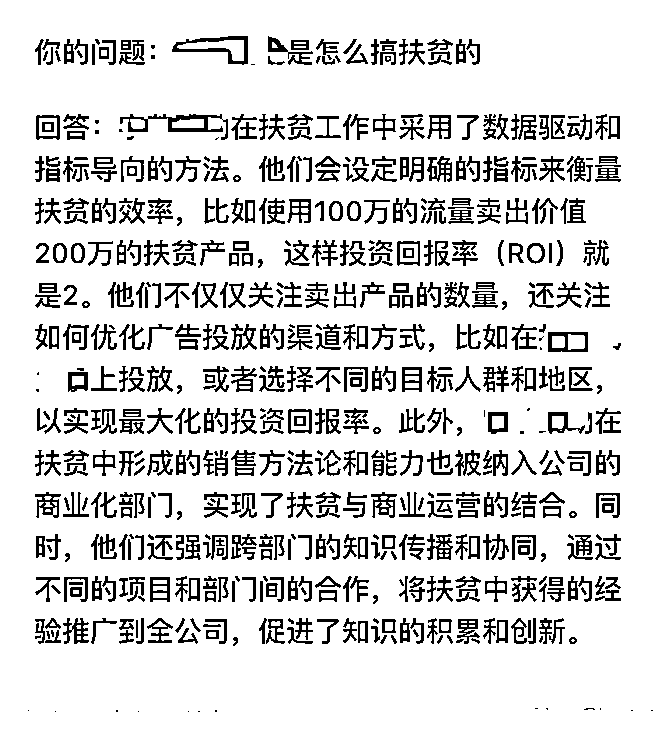

想了半天怎么提问，后来还是使用跟第一次提问相同的问题，感觉表达的最准确。第二次回答内容，明显要比第一次好很多。

#### 4、总结

通过这个案例，我真实的展示了目前 AI 能达到的一个水平，我是边写文章边测试的，不吹不黑，真实展示了完整的过程。

怎么说呢，现在 AI 的水平，适合“公司内”使用，不适合“公司外”使用。假设这么个 Agent 是直接面向客户的一个产品，感觉还是挺忐忑的，你不知道能从他嘴里秃噜出来啥。但是如果把它作为企业内部使用的一个工具，效果应该还是杠杠的。咱们文章最后畅享一下。

AI 提升的是能力下限，能力上限还得靠人

作为辅助学习使用，这个机器人我给打 80 分，在座各位没有意见吧？但是 80-100 分还得靠人，如果这是老师贴脸帮我复习，那效率肯定是 100 分。不过 80 分也够用了，不是吗？比你原来问不靠谱同学强多了吧。

用冗余性对抗不确定性

这是挺重要一个创业思维，这个案例里也实践了。第一次问大厂扶贫案例，说的不够细，第二次用同样的问题再问了一遍，比第一次效果就好多了。AI 输出不是不稳定吗，那我多问两遍就是了，总有说的对味儿的时候。

先搞起来，在实践中学习，快速迭代

在写这篇文章的过程中，其实我也发现了小机器很多的问题，接下来我会通过优化大模型参数、提示词、工作流、知识库分段规则等方式，再去优化一下，不断迭代。

## 知识库机器人可能应用的领域

学会了手搓知识库机器人，我们现在掌握了一个方法，拿到了一把锤子，现在看看其他地方有没有能敲的钉子，我大胆畅想一下哈：

销售话术库：金牌销售掌握的大多都是隐性知识，这客户你搞不定，人家一出马，第二天签合同。好在现在有企业微信，销售话术可以留档，作为知识库，小白来了哪里不会问哪里。

教育培训领域：港真！咱上边这已经能算一个案例了。还有，你买的那些个视频课，先吹吹上边的灰，然后用AI提炼要点，快速看一遍，再配合机器人，学习的不要太快。

公司制度库：公司制度千千万，扔电脑里看不见。咱下回跟其他部门Battle的时候，先搜搜制度库，看看是怎么规定的，咱要做理直气壮的“甩锅侠”。

合规智库：金融业最短鬼故事：“你这不合规啊！”之前合不合规全凭一张嘴，现在可以先翻翻有没有相关规定。孔子不是有句老话儿嘛：只有你比合规还懂合规，你才能PK掉合规。

企业知识库：企业里有各种项目，项目里有各种会议纪要、各种文档、各种邮件，甚至是各种群聊记录，用知识库沉淀下来，这是隐性知识转显性知识重要的步骤，有意义！

个人知识库：当然，个人也有“与世长眠”的“稍后看”，还有各种收藏夹，借这机会也整理整理。分门别类弄几个知识库，兴许以后还能翻翻（下次一定）。

……

就这样。

更多内容：

Coze/扣子新出的图像流功能，有点惊艳到了！

我做的Agent智能体上了Coze扣子官方推荐之后……

告别手写Prompt！一句话自动生成6个结构化提示词，附工具地址。免！费！用！