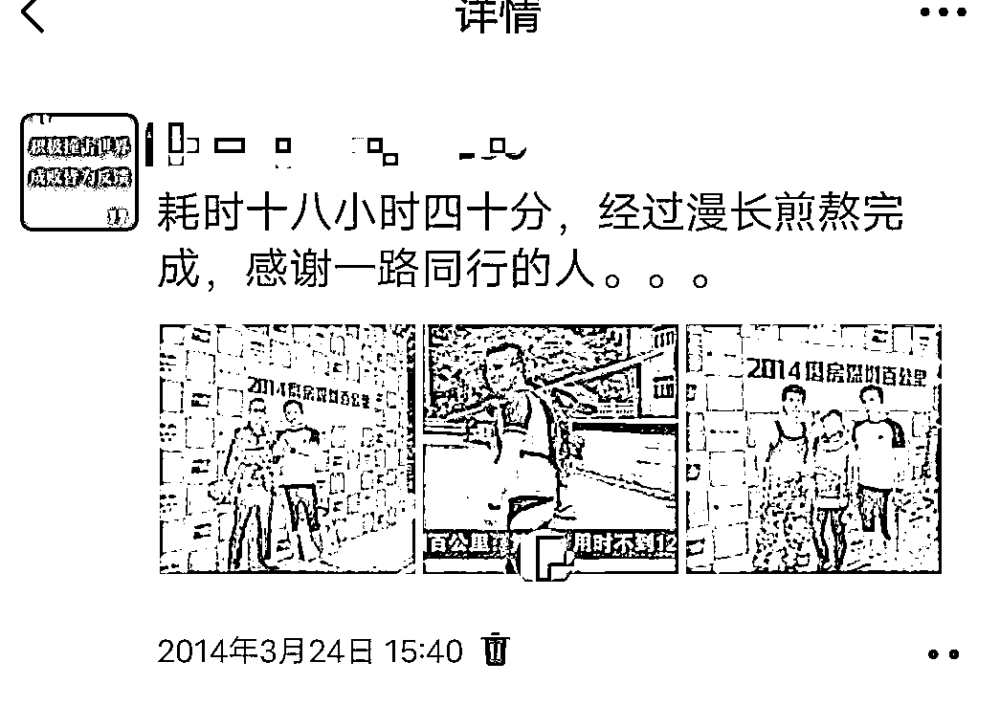
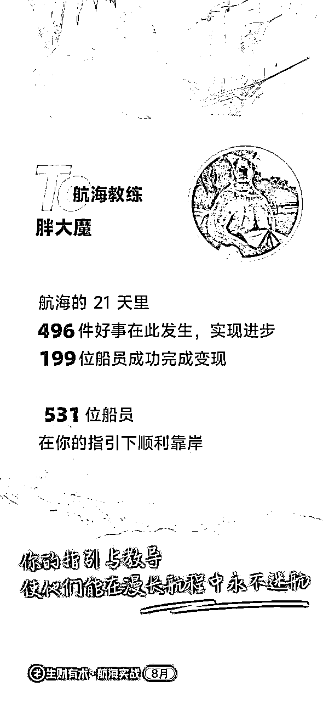

# 真大力出奇迹，分享我1年10倍成长的破圈之路

> 来源：[https://rx0xuq19kud.feishu.cn/docx/HOkrdOjgKoCe0HxAla5c1etOnec](https://rx0xuq19kud.feishu.cn/docx/HOkrdOjgKoCe0HxAla5c1etOnec)

# 真大力出奇迹，分享我1年10倍成长的破圈之路

大家好，我是胖大魔，非著名生财水军。

破圈难，难于上青天！人是环境的产物，如果父母是在小县城做生意，不走出小县城，那大概率子女也是做生意的。

2023年，可以称之为我在生财的“破圈元年”，这一年让我获得了过去10年都没有的认知和资源的提升，链接了1800+各行业的优秀圈友。作为一个从传统装修行业到互联网破圈的案例，我想把这1年来成长经历复盘分享给大家，如果能对类似经历的朋友有一点启发，希望给迷茫的你，带来一点力量！

在遇见生财前我是这样的👇

*   2012年从肥宅转型成为运动宅，自此一直是运动狂热发烧友，跑过马拉松百公里、通宵徒步、爬山，用脚丈量深圳很多地方。

*   2014年后回老家开始做门窗生意。因兴趣爱好在小县城做了一个300多人马拉松团，从零开始带到几十个人跑马拉松。

*   2018年前，我还是一个对互联网项目零认知个体户，在小县城每天和朋友吃喝玩乐，很多个瞬间我在想：这真的是我想要的生活吗？每天很开心但是重复这种低质量社交，往上走很难，内心还有一股追求运动梦想的劲儿。

*   2019年开始追寻自己的梦想，从事健身行业，准备拜师打比赛，做健身工作室准备。

*   2020年疫情开始，健身梦破碎，重操旧业门窗定制。那时候天天刷抖音，混入一个别墅群，了解客户需求，热心解答门窗一切问题，于是在2年多的时间跟着群主大大学习各种认知提升，获得了大哥大姐认可，说有杭州、上海门窗的需求都找我做，后面给我介绍同城客户。朋友安置房拆迁，邀请我去他那边开门店，当时以为安置房就是六层小楼，万万没想到，居然有33层高楼一百来栋，按当时水平，最差也可以接50-60个单，但是由于认知不够一直没有搞定，错过了好机会。

过去，因为受困于资源、平台、眼界，我很难从原有的固化圈子和资源中获得突破，于是我放弃了经营多年的家乡圈子，重回长沙发展。所谓破而后立，说的就是我当时的决策吧～

## 01 从小透明的点赞狂魔到生财水军：我的破圈&认知升级之路

2023年3月，通过自然流量进入生财有术，完全是个小透明。通过刀姐视频直播，我体验到了GPT十几秒生成一个培训完整文案的魔力，也看到AI的机会。突然觉得想做且心心念念的养老终于有方向了！（详细可看第三趴）

零资源进入生财以34岁高龄装修个体户，互联网圈完全不搭界萌新，对生财庞大信息量无从下手。

2023年5月27日第一次生财同城聚会：聊私域怎么玩，00后大学生雄熊进行生财启蒙、点醒了我风向标怎么使用。

我开始深度挖掘生财脉络，用了四个多月时间，鲸吞狂吸把近7年精华帖快速过了一遍，每天必须把风向标内容看完，培养自己的商业嗅觉和认知迭代。

那时候我每天早上睁开眼就靠刷风向标提神醒脑，泡在生财看精华帖，每天保底10w➕的阅读量一度让我看帖进入心流状态。对我来说，学习是快乐的，广泛阅读、收集信息能让我进入心流状态。

几个月时间，我这二十年的水群水论坛功力在生财发挥出来后，帮助我建立了几个关键破局点：

1、通过生财深度挖掘学习，给每个发帖新人与风向标大部分圈友鼓励送赞评论互动，获得了大量曝光，认识链接了非常多圈友，进了一部分地方群、在生财发现各种行业群、付费进大咖群去学习。

2、进入风向标3群，练习各种钩法，后因太聒噪被刀姐禁言，每天只准说三十分钟🙊

3、把握生财风向，5月份航海中，生财有在推动圈友自建群意图，参加两个航海小群都是湖南圈友达到80%，于是在6月4号看到深圳群组局复盘贴，申请进深圳群学习；6月23号搭建框架生财湖南同城群，3天人数破150人，目前人数快700➕，迅速建立了生财同城交流社群根据地，后面在生财湖南群组局20次＋深度局10次＋，参加各种线下局30次＋。

ps: 长沙深度局一场包含下午场、晚上场、晚晚场，我深度参与大部分局。

2025年已经把拖延2023组局复盘贴写出来了！

4、积极热心帮助很多圈友，在这个过程中帮大家对接很多资源，极大开拓眼界，原来这也能賺钱，那也能賺钱。这个时代表达者的红利一直都在，当你被更多人看见时，你就获得了更多人的注意力，而流量的本质就是用户的注意力。

2023年6月我当时对自己的认知就是：最差我也可以给当大佬当个铁粉。我研究一圈大佬的生财成长路径，发现每个大佬都需要铁粉，我可以当最铁的那个。这就像你是在自己家跳舞，还是在天安门广场跳舞，对自身的收获不是一个量级。

跟大多数圈友进入生财需求不一样，我没把搞钱放在第一位，因为我之前吃了太多闷亏，周围赚钱机会一大把，但因为我认知水平不够，统统错过，认知差一度让我拍青大腿，人永远无法赚到认知以外的钱，只有提高认知水平才能达到赚钱高度。

2023年7月4号响应在风向标3群老侃号召，组建小团队做亦仁益语共读后转型生财研学社

5、成为生财风向标教练。818大会去见刀姐，面基自己专属鱼丸，当时亦仁见面时第一句话就说：“你就是那个生财很能水的😂” ，前期的铺垫在这也发挥了价值，让生财老大有了记忆点。

由于我天天住在风向标栏目了，活跃于风向标3群，后来成了风向标教练，我是硬怼出来的就是。我复盘去年一年的开挂经历，其实就是：“大力出奇迹”，没别的。

为什么我对各种领域的信息都懂一些，因为我在持续关注风向标。我看了四个月，这四个月是每天看风向标全部刷完并点赞，遇到感兴趣的就评论互动，一天要看10万到30万字。在我的记忆中，我以为自己不忙，但是实际上这段时间我还挺忙的，我每天只睡四到六个小时。

所以说，风向标对我来说有多重意义：

1）提升个人商业嗅觉认知，弥补自己认知差。比如抖音评论截流赚钱、倪海厦视频咋赚钱等等。

2）它让我看见了新的机会。2010年开始，曾经有很多机会我没有抓住，完美错过风口。比如豆瓣、知乎等各大平台我都是深度用户，某英语黑胖子全网几百万粉之前，我们算同期出道的，他现在用的职场赛道还是之前大哥13年前的框架内东西，但我那时没抓住机会。

3）它让我打破信息差。进生财翻精华帖才知道长投学院的战绩，当时我在豆瓣，看看从无到有，慢慢壮大，但是没想到去参与学习！2011年跑步兴起时，我在深圳跟老大哥们山里翻山越岭，通宵达旦。圈友在深圳湾带大佬们跑步，提升商业认知，如何商业化。这个对比一目了然

4）费曼学习法：点赞的人很多，评论也是一种反馈，我重新去阅读一遍，学习一遍。

5）深度学习参与生财运营一部分，系统学习提升自己社群玩法，补短板、强长板。

6）兴趣使然，从2004年我开始互联网水群水论坛。我活跃的群，从不会死群！

7）在风向标组建自己的小团队

2023年9月竖式导图在生财开始具体故事可见：https://t.zsxq.com/xHsSk

破圈路上，除了我本身水群天赋，还有就是我的“战略”才干突出，眼光会看得更长远。因好奇心旺盛，对什么东西都感兴趣，喜欢分享，所以感觉这个东西对谁有用，就会发给谁。

也是因此，我在成就他人的过程中，也逐渐看到了自己的第一个价值：链接能力。我一直在做且不断坚持干的事情就是链接3000名生财圈友，赋能100个圈友拿到龙珠、教练或参与深度合作。

## 02 盖洛普让我重新认识自己 建构，打碎，再重构

去年6月14日，发现圈友都在说盖洛普，在圈友林幻雨推荐下，刚开始的我不屑一顾，后面真香警告。

6月17日在测完盖洛普后，我震惊了一下午，颠覆了我过去的自我认知，于是我前面所有规划全部推翻，重新制定未来的路，同时边做边改边迭代。

在测盖洛普前，一直以为我是搜集第一，从小就有很重收集癖，测试后被盖洛普一下点通，思路完全打开，开始理解自己的一些行为了，比如说我很喜欢收集，很喜欢分享吃瓜挖掘后面脉络这些信息，原来这些都是“战略”才干在发挥作用，也就是说我了解的东西越多，分享的东西越多，然后我收获的也就越多，因为在这个过程中我收获了大家的反馈嘛，再去纠正自己行为。进了生财以后，场域对了，圈子对了，成长速度飞快。

在此之前，我之前一直是内耗迷惘的状态，总在不停试错不断确定自己想做的事情，经常脑子里有一百个小人，一百个方向，好不容易说服他们，突然又出现新的小人，那怎么走出内耗的呢，就是通过我的“战略”才干为其打造出一个将军，凝聚出军魂，所有的努力都是为了一个目标服务。

这时候我慢慢开始有了一些自己的方向，在这方面我还是比较敏锐的，比如我做线下守在装修工地十几小时觉得累的要死，但研究社群的各种玩法我却乐此不疲，从十几岁接触互联网，就开始在网上水群水论坛，玩了十几年依然热爱，现在我一个人就可以把生财的灌水灌满，反正只要有机会我就到处加入进去😂

而之前因为受困于资源和平台，我很难从原有的圈子和资源中获得突破，但通过盖洛普打通任督二脉后，作为“战略”第一的我，开始给自己整活了哈哈，我在网上各处留言咨询小马宋老师战略对标该学谁

就此开始恶补一系列战略知识和认知，归纳起来就这几点：

1）像素级复制、学习高手一切好的思维、策略、打法等

2）研究他们的成长路径

3）了解竞争对手的战略和策略

战略就是生态位，按这个逻辑去思考很多问题

除了“战略”，我的“学习”+“回顾”排第二第三，我之前就自学跑步马拉松、健身十多年，而且我妈妈62岁还学会了用简易软件画阳光房效果图，大概率到我60来岁思维也是不会僵化的。

我也喜欢通过研究一些高手的成长路径，去看他们怎么从小透明成长为大佬的，在了解事物发展的来龙去脉的过程中，方便我更好的去看清当下所处位置、回归初衷，也更清晰未来的路。回顾，只要觉得有价值我都会复盘，重新挖掘一遍。

再说到，我这水军混圈能力，其中关系建立中的“交往”发挥很大价值，我喜欢交朋友、也很愿意分享自己所知道的，但这个有利有弊，就比如之前装修就被师傅坑很多轮，后来看完《乡土中国》，我明白了2个概念，社会规范和市场规范，我决心只对认可我的朋友采用社会规范，其他人均采用市场规划，从此给人出主意的军师能力发挥越发高效😂

热衷于出主意。

通过柳大盖洛普的优势分析，“盈亏同因，优劣同源”，点透了我。很简单，人都是为自己利益代言的，我的最后一块短板靠盖洛普弥补，所以天天为柳大打call。信息差、资源差都在生财解决，为生财打call。

去年6月刚分析盖洛普的感想

## 03 决心深耕养老赛道，命运齿轮开始转动

自从上场做养老知识星球就有一种心想事成的感觉，我觉得我做养老，是一种被命运选中了的感觉，为什么这么说呢？

首先，最开始是因为外公意外摔跤，去医院治疗结果医院直接不收了，然后只能回家静养，但在家缺少很多科学养老的信息，很多事情是当时就想做，因为拖延，一直没有做，但是这件事全程本身太痛苦了。

再后来，就是姨父有认知症，也没有得到好的养老看护。

更重要的是，我看到了身边很多例子，让我焦虑未来自己的父母养老问题，包括未来自己都很需要。

我很希望像我们这种普通人家孩子通过对正确养老认知科普帮助自己、有问题及时处理，自己少花钱，亲人少受苦。

让周围亲人度过一个好的晚年，能通过互联网找到好医生救命、能有好的临终关怀、减少痛苦的度过最后的日子...... 这些都是我希望一直努力的方向，也希望以后父母因为我现在做的事情受益。

从2023年4月开始定了一个目标：用爱发电。一年多来一路经过很多拷问与认知迭代，但是初心不变。

期间，我认识北京开养老院大哥开始接触正经做养老圈子，并且推荐了一些靠谱资源。

从零开始挖掘养老信息，去年五月去参加了一次北京协和老年医学医养的专业大会，让我获得了大量优质信息以及链接了部分优质医生资源。

后面我就开始全网搜索养老信息，开知识星球，做养老信息资源整合、养老变现和创业等信息交流，目前星球已经了养老政策风向标集合、适老化科普一百篇合集等 深入养老、大健康、银发经济、医院、医疗等各行业聊痛点、挖需求，深聊挖掘找到自己方向。如何帮父母养老，未来如何为自己养老

还有，我在豆瓣开了健康养老小组，目前有5600+成员，还认识了一系列相关豆瓣组长，在几个热门小组收集回答问题。编辑父母养老百问百答。

# 2024年做出来知识库，迭代两个大版本

## 2024年肝出来的

## 2025年拍100条口播视频

在我充分发挥铁粉水群能力后，进了多个养老社群，全部是精准养老行业的资源，后续也能帮助想做养老的朋友们链接资源，打破养老信息差。

最后，通过在生财挖掘，对自己各项能力挖掘。我想说普通人成长谈何容易，每个拿到结果的人，都是一路过关斩将过来的，对于我们大多数普通人来说：

一缺少看懂商业底层逻辑的认知；

二缺少能转化为赚钱机会的信息；

三缺少真刀真枪下场实战的勇气；

四缺少解决具体问题的经验技能；

五缺少同频真诚互帮互助的战友。

只有找到自己最擅长的技能，通过“传播＋链接＋私域”不断迭代，也希望大家在生财都能找到自己方向！

2024年，我重新定义自己，从水军到生财百事通，我链接了各路神人圈友，在这里，也希望能和各位圈友一起共建共生共生长，期待实现共赢。

从过去各种水健身圈、跑马圈、吃瓜圈 ，通过水群水贴到链接各路圈友，混迹在AI圈、养老圈、跨境圈、知识付费圈、电商圈、私域圈、WEB3圈等......一路破圈，2023年期间助力4个圈友拿到了龙珠，鼓励4个圈友当了教练，和部分圈友建立了更深层链接。2025年盘算已经鞭策四个圈友单独开航海了

同时，在建社群、组建研学社、助力圈友拿到龙珠&教练，再到自己成为教练，这一路的成长，让我变现接近门票的20倍。

线下实体通过认知提升跟家里共同协作谈到一个大单。（这里可以吹个很大牛皮，但是不说）

进入生财绝对是我去年做得最正确的一个决策，不仅让我的认知提升多倍，也让我看到了我的人生方向多个选择机会。

最后，我特别感谢生财有术这个平台，感谢亦仁老板搭建的这个优秀场域。

生财之路，是大家互相成就的过程

任何人的生财之路都需要资源支持，包括但不限于思维、渠道、产品、流量、技能、人脉等资源，这些也正是我们和你这样的生财圈友一同共创的。

一个人或许可以走的很快，但是一群人可以走的更远

雄熊，2023年5月27日优秀00后，我破圈之路开始贵人！！！

刀姐，风向标明灯，六边形战士，破圈水群双料冠军，我的学习榜样！！！

JC，一起同行相互激励！！！

生财研学社小伙伴老侃、云舒、罗卜、小竹、小萝卜、费曼、九歌、笑笑、段子手、鞭炮 super黄，一起做了两个小项目，大家一起飞速成长！！！认识了九个优秀产品经理，学习产品思维

村长，从2023年6月23日一起组建城市群，同心协力在生财湖南同城组局20次＋，真诚利他分享提了很多建议，给予很大帮助与启发！

第一个给我星球付费姐姐正反馈朋友，是认可！

感谢母亲大人支持，让我走过漫长低谷期。

感谢非白、相柳，对本文发出起到巨大帮助。

感谢柳大、比浪、艾小飞等等

感谢华冠大家庭八年常伴，玉姐、毛子、章鱼、地主等

## 2025年出海汇社群负责人