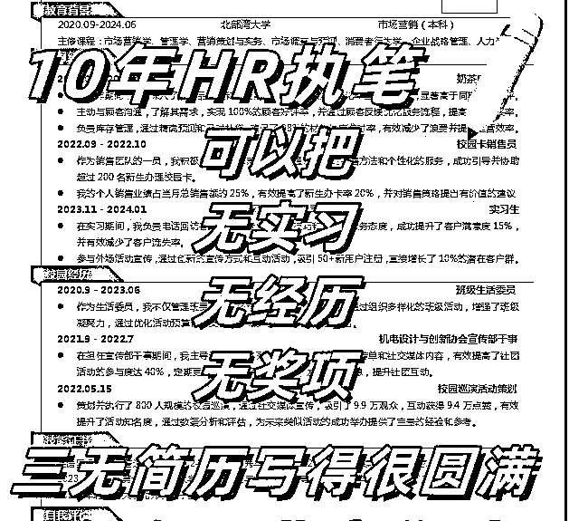

# 全职宝妈，跑通AI简历从0-1，满怀期望

> 来源：[https://h2hncrkzea.feishu.cn/docx/IDxJdqlfvoWuBuxpjMFcqzWinnf](https://h2hncrkzea.feishu.cn/docx/IDxJdqlfvoWuBuxpjMFcqzWinnf)

各位生财圈友大家好，我是阿敏，一个全职在家带娃的二胎宝妈。

加入生财也是一个偶然的机会，在去年的时候，因为在家带娃，没办法外出工作，家庭支出的压力带来了较大的焦虑，就一直想着能不能找一个线上的兼职可以做。去年在一位好友的朋友圈看到生财拉新的内容，当时半信半疑，抱着好奇心，领了一张试用卡，看了一下里面的精华内容。

# 一、初入生财

一看就入迷了，竟然还有这样的知识星球，各种副业赚钱干货，太神奇了，当时就很想加入，但是价格对于我来说比较高，因为只有在4月3日晚上8点才能享受最低价，所以我定了一个7点50分的闹钟，1965元对我来说还是很多很多的，毕竟在家带娃，没有自己的收入，但我实在是太喜欢里面的干货了，里面的信息是我过去几年接触的互联网信息的很多倍。

果然人的改变都是从花了从来不敢花的钱开始的，加入以后，我就开始每天看精华，感觉是打开了一扇神奇的门，里面有很多我从来不知道，不了解，没接触过的各种互联网赚钱信息，心情是很激动的，兴奋的，忐忑的，看到各种月入几万，几十万的帖子，多么希望有一天，我也能在互联网上赚到钱，不需要那么多，几千我都很满足，接下来的一段时间，边看帖子，边找自己能做的项目，看这个项目和自己的能力，资源，匹配度如何，然后跟着实操，果然是看着容易，做起来难。

实际情况有时间比我想象得要难很多，不知道是自己操作不对还是项目的环境发生了变化，从蓝海到红海了，就是各种实操，拿不到结果，那段时间心很累，焦虑，怀疑，迷茫充斥在自己的心头，心有余而力不足，到后面就开始想是不是自己哪里不对？慢慢就明白了，一看就会，一做就废，原来读懂了和会做了是两码事情，有些项目对个人能力是有要求的，比如你之前会引流，会剪视频……操作起来就会得心应手，如果不会，就会使项目难度增加，需要一个个模块解决或者是项目已经到了红海期，之前蓝海期的操作方式已经不适用了又或者就是我个人的能力不足。

有一段时间就这样焦灼着，迷茫着，焦虑着，希望有一天能有所改变吧！

大概在10月份的时候，我看到了饭饭写的《AI+简历修改，首月盈利7000+，低成本高收益的保姆级教程，附带多个接单平台详细操作步骤及避坑指南》觉得很实用，当天就操作起来了，当天就出单了。

因为我之前看到饭饭的分享，我就提前链接了饭饭，近距离的咨询了饭饭关于AI简历实操的问题，和客户交流时候不懂的环节，非常感谢饭饭的悉心指导，每次遇到不清楚的地方，饭饭总能给出及时且有用的建议。

# 二，项目实操结果介绍

我是10月18日开始操作的，当天出了9单，基本都是应届生的简历修改；10月19日出了18单，有应届生和往届生的简历，算是第一次跑通了闲鱼简历修改这个项目。

也让我对线上交付客户有了一定的了解，需要先熟悉平台，然后获客、给客户做解答、再来给客户制作简历，最后交付，最后交付好再收到客户的钱，很开心在项目中拿到反馈，得到成长。

# 三、项目实操步骤

1，下载闲鱼，注册闲鱼账号，因为之前会在闲鱼上面进行过闲置，所以有一个账号；

2，账号包装：

A，头像，这个随意

B，名字（XX简历制作）（XX资深人力）（XX求职辅导），

C，简介，突出自己的实力，写简历的水平

比如：

资深大厂HR，校招社招经历丰富！一对一优化简历，简历润色，制作，欢迎来咨询。

8年人力资源管理经验，曾制作过1000份简历，专业HR为您制作个性化专属求职简历！针对求职岗位完善简历内容，轻松拿到offer！

3，标题发布：直接在闲鱼上搜索“简历”“简历修改”，找到我想要个数很多的，点进去看，看他是怎么发布的，

可以直接复制她的标题，或者自己适当改写一下都是可以的；

参考标题【1】

国企简历，大厂简历制作。简历帮做！简历优化！格式修改！模板修改！在线秒回

1.提供应届生和工作经验的简历帮写！内容修改！

2.性价比高，会从专业角度提供简历润色，当然也会尊重参考你的意见。

3.其他就是很耐心也很认真负责，当天修改到你满意～（但也请尊重知识劳动成果）

4.点击我想要，和我私聊吧！

❶您只需提供您的基本信息和您的要求，我可以给您一份完美的简历,百分百满意。满意再确认收货。

❷简历制作包括：板块排版、文字语言润色/优化、修改，满意为止！

❸一对一私定制，拒绝套模板；简历制作后发word和pdf两个版本。

❹闲鱼拍下即与您沟通，信息确定后会给您制作简历，届时您可以提出修改要求，修改次数不限，直到您满意为止！

⭐相信老师，成就你的美好未来❗

⭐每天限量出售，追求高质量服务！进来看成功案例，本店好评率优秀！值得信赖！

参考标题【二】

【最快两小时出稿】简历代制作简历制作个人定制简历优化中英文简历代做润色简历修改

1 .连续两年面试邀请率高于91%

2 .针对岗位丰富简历内容，深挖提炼优势业绩！

3 .实习应届没有经验也可以丰富，一对一深挖!

4 .7年大厂hr从业经验

5 .一对一制作，根据个人情况，针对修改，并给予免费建议

24—48小时内出稿

出稿后 30 天内可免费修改

参考标题【三】

简历制作

本人7年上市互联网公司+上市外企招聘工作经验，4年社招，3年校招经验;

涉及行业：IT互联网，外企

负责社招，校招简历筛选，面试，

负责面试改革题目，面试官培训多年

涉及开发，产品，运营，市场，销售，客户等多种岗位

实习，校招，社招简历均可制作，根据个人情况量身定做，三天内免费修改。

可发pdf+word版本，可做面试指导。

15块起，根据简历复杂程度调整

可以自行出价，能接受我就接～

加急需额外+10元

# 四、注意事项

（1）商品发布分类：

分类这里要注意一下，是office办公制作，PPT制作。做简历的时候我一般选择PPT制作。

（2）商品发布地址

还有发布地方，最好是一线城市，毕竟大城市求职需求旺盛。图片有两个地方需要注意一下

（3）商品标签

点击添加标签，#简历 #简历制作#简历优化#简历修改#简历润色#应届生

（4）图片需要修改

不能直接使用别人的图片，因为下载以后图片最下方会有别人闲鱼号的水印，需要先把水印裁剪掉，建立一个手机相册叫简历图片，把裁剪好的图片都放在里面，发布的时候随机组合发布。

四，商品图：推荐用【搞定设计】【创客贴】【美图秀秀】三个作图软件，图片越简单越好，用户觉得越真实。

# 五、发货技巧

简历做完选择无需发货，然后在微信上发带有水印的简历给他看，没问题，就让他在闲鱼上面收货，然后在微信上面发无水印的简历文件给他。

# 六，引流技巧

1，我用的最多的是他拍单后，我能看到他的电话，直接打电话过去，说我是闲鱼卖家，我马上添加你的微信，请通过一下，需要和你沟通简历的要求。100%是能加上的。

2，让客户自己发他的微信号

我怎么把文件发给你？ 他一般都会把他的微信发过来。毕竟客户不是卖家，引导一下，他就发过来了。

# 七、接单后的处理步骤

1，询问他是应届生还是往届生？

如果是应届生，一般很好处理。往届生的要求会多一些，因为他的社会经验多，主要是给工作经历润色，还有就是工作经历和想应聘的职位的匹配度。

2，如果是往届生，询问他的工作经历，这块其实最好他发一个他做的简历过来，在他的简历基础上进行修改和润色。

3，给简历模版图片给他，让他去选样式，避免我们选了，他又不喜欢。

4，询问他要应聘的职位和岗位要求，便于在工作经历中重点突出和他要应聘的职位的匹配度。

5，沟通做好简历的时间，一般是24小时内出，如果是急单，就需要另外加钱，一般客户都能接受。

6，报价，应届生统一是29.9元，有经验的39.9元起，感觉是优质客户的，付费能力强的，可以向上加价，如果是只要模版，是9.9元一个【有一些这样的客户】

7，交付，简历制作完成以后，先打上水印截图一部分客户，让他去闲鱼收货，然后微信把无水印的简历文件发给他。一般是发送Word版本+PDF版本各一份，中间可以免费修改2次，如果修改的次数过多，需要另外收费。要注意的地方是在闲鱼没有收货的情况下，不要把简历文件发给客户，容易跑单，我就遇到过几次。

非常感谢生财提供的交流平台，在这里认识了很多正能量且愿意分享的圈友，我记得认识饭饭还是在生财看到他写的《被低估的赚钱项目：揭秘月入 1W+ 的手机壳行业的暴利拆解》，加好友以后，请教了一下手机壳开店的事情，没想到他最后直接把他的货源商家发给我，实在是太惊讶了，这是我遇到的第一个愿意这样分享的圈友，实在是太靠谱，太实在了，后来因为其他原因，没有去做小红书手机壳。

后来他告诉我，可以在闲鱼卖高考志愿填报数据，专业录取分数线，招生计划，院校分数线……我记得是11点多的时候，我们就赶紧行动起来了，首先买别人的数据，然后发闲鱼，12点的时候还在那里讨论怎么弄，然后第二天他就开始出单了，行动力是真的强悍！在他的身上学到很多，他的朋友圈和围观群我每天都在看，去年他的成长速度非常快，又看见他分享的AI简历、AI代写、写作店铺等等收获都很大。

今年我自己也在生财逐渐找到了方向，希望新的一年在生财持续成长，熟练项目，赚到更多的钱，打破目前宝妈状态的迷茫。

最后祝各位生财的圈友都能发大财，谢谢大家阅读，第一次写文章，觉得有用的圈友可以点赞鼓励一下~