# 小红书投放没效果？保姆级小红书获客方案

> 来源：[https://p03a4vs9s2.feishu.cn/docx/IX1Lds1f7ot70Hx1h2Ec1Tk8n1f](https://p03a4vs9s2.feishu.cn/docx/IX1Lds1f7ot70Hx1h2Ec1Tk8n1f)

这两年小红书的风很大，特别是今年上了春晚后，越来越多的商家参与小红书获客。但小红书月活用户才3亿左右，流量不够分。而且随着越来越多的商家介入，未来小红书的流量一定会越来越贵

为了帮助品牌抢到流量，我们团队把「BKFS组合营销」升级了，变得更全面，更适合投放预算不高的商家，内容矩阵方法还很适合比较敏感的行业

这一套营销模式操作也很简单，我们团队的一个运营就能负责完整流程，一个月单账号获客1100+，营收70w，境外游能做到月gmv 700w+

之前在复盘境外游投放的时候已经讲过「BKFS组合营销」，感兴趣的可以回看：

今天拿婚纱摄影行业具体讲下组合营销玩法

# 目录：

1.  BKSF组合营销

1.  品牌账号运营策略

1.  聚光 + 达人种草投放

1.  KOS + 内容矩阵

# BKFS组合营销

这个组合营销的方式，适合大部分需要从小红书获客的商家，特别是客单价高、决策成本高的商家

先讲下我们是如何选择营销方式的：

## 行业竞品现状

在确定营销方式前，先做了一遍市场调查，主要2个方向：「同行怎么做」和「用户怎么买」

### 同行怎么做？

我们收集了一系列的竞品来分析，发现同行基本都是这几种玩法：

1.  以聚光投放为主，客资量随大环境波动（旺季多，淡季少）

1.  少数品牌在做kos矩阵，内容不出彩

1.  同行笔记下截流客户

1.  少数品牌做kol投放，互动量不理想

1.  部分品牌在做素人铺量，品牌词被封

1.  ……

整个行业的同行情况都摸了一遍，大部分都是采取其中1～2种方法，获客情况也做的不错

### 用户怎么买？

根据产品特性，我们也调研了一下用户的消费路径，在下单前，大部分用户都有这几个动作：

1.  有拍婚纱照的需求，先了解婚纱照风格

1.  小红书发帖，或者评论，向博主求推荐品牌

1.  挑选有自己喜欢的婚纱照风格的几个品牌

1.  品牌之间对比，咨询、了解、探店……

1.  对比环境、套餐内容、客片……

1.  对比品牌信任度、小红书舆论……

1.  选择综合水平及格的品牌下单

用户在下单、完成服务后，还可能会有以下动作：

1.  发小红书推荐品牌

1.  发布测评笔记

1.  向其他用户推荐品牌

1.  ……

### 竞争策略

我们可以把用户下单前的1、2、3归为：被看到

把4、5、6归为：被信任

行业竞品在做的，大部分在做「被看到」，少部分在做「被信任」，有部分想通过素人铺量玩法扩大「被看到」和「被信任」，结果被封品牌词

所以，我们在定营销策略时，既要做「被看到」，也要做好「被信任」，同时还不能被封品牌词

因为在境外游有试过BKFS组合营销，所以我们把这个方法迁移到婚摄行业，意外发现，非常契合

## 婚摄行业的BKFS

为防止有人没看过境外游的帖子，我再解释一下什么是BKFS

B：品牌/官号矩阵

K：kos主理人 & kol

F：信息流投放

S：搜索投放

组合营销就是：通过品牌账号输出产品营销内容，配合聚光搜索、信息流广告获客，再搭建kos矩阵，增强用户信任

婚摄行业我们是这样规划的：

### 企业号配合聚光

主做产品宣传，品牌宣传，发布自己的婚纱照风格，让更多人看到产品

在通过搭建、调整聚光广告，以最低成本来获取最精准的客户

### 矩阵运营

搭建主理人、客户好评和伪素人的矩阵，增加用户的信任度。因公司没有合适的人员做个人IP，所以主理人矩阵我们做了一些调整

*   主理人矩阵：以公司摄影师、化妆师等员工为主理人，根据岗位、人设制定特殊选题

*   客户好评：服务好顾客，引导客户分享好评到平台

*   伪素人矩阵：模拟用户生活到拍婚纱照的过程，发布日常笔记与成片

这三个矩阵最容易与用户建立信任，引流到品牌咨询

### KOL投放

为降低风险和扩大曝光，我们安排了一些KOL来探店，主要有2种模式：

*   达人探店：真实到店、出镜分享探店全过程和体验

*   素材代发：无需到店，运营做好素材给达人代发

前面是运营思路，下面会具体讲下具体操作：

提醒：为保护客户隐私，以下图片案例全部用网上找的相似案例，非本人实操账号，注意辨别

# 品牌账号运营策略

首先明确企业号的职能定位：

1.  用于品牌宣传和产品推广

1.  用于广告投放获客

1.  活动宣传入口

1.  流量中转站（投流账号可以发微信）

1.  KOL邀约

1.  ……

企业号的经营思路，就是增加「被看到」的概率

## 账号装修

账号基础设置按正常设置就行，参考：

*   头像：品牌logo

*   昵称：品牌名+（地区）+关键词（xx婚纱摄影、地区+xx婚纱摄影……）

*   简介：品牌广告语 + 门店地址

*   背景图：挑好看的产品图片

*   瞬间：引导私信

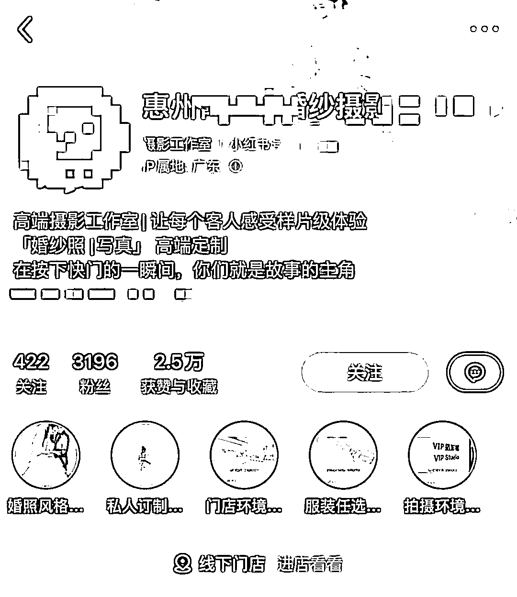

这些在很多帖子、文章里都有讲过，而且有点运营基础应该都没问题

装修另一个重点是「置顶笔记」，分享几个比较高转化的置顶笔记选题：

1.  引导交易笔记：引导用户如何咨询、如何交易

1.  公司实力宣传：介绍品牌、门店地址、环境、实力等

1.  产品宣传：热门婚纱照风格合集

1.  品牌爆款产品：推荐品牌的爆款婚纱照

置顶笔记同时也是投放笔记，需要花心思写，特别对于高客单赛道，公司实力宣传非常重要

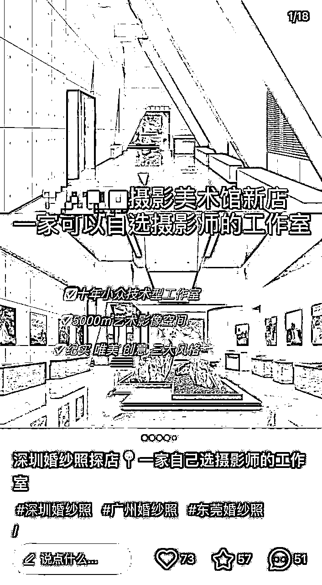

## 高转化内容制作

### 选题

企业号的内容定位主要是品牌宣传和产品推广，内容大部分都会用于聚光投放，所以笔记选题可以都往硬广上写

分享几个高转化的选题类型：

1.  基于公司产品做选题

直接宣传公司产品，包括拍摄风格、婚纱照风格、套餐包含内容等

选题参考：

*   2024全新/热门婚纱照风格

*   客户成片分享

*   婚纱照改造、拍摄花絮

*   ……

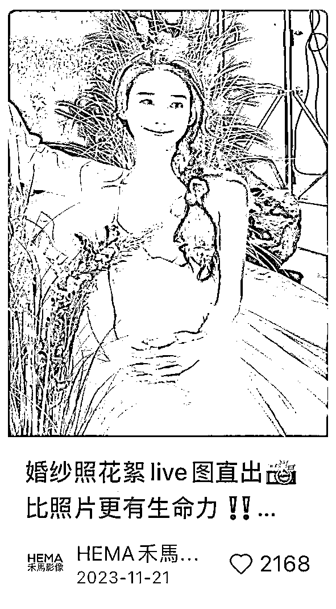

1.  基于公司实力做选题

包括置顶笔记的选题类型，主要突出品牌门店、环境、公司实力、品牌调性，以及引导到店、咨询等内容

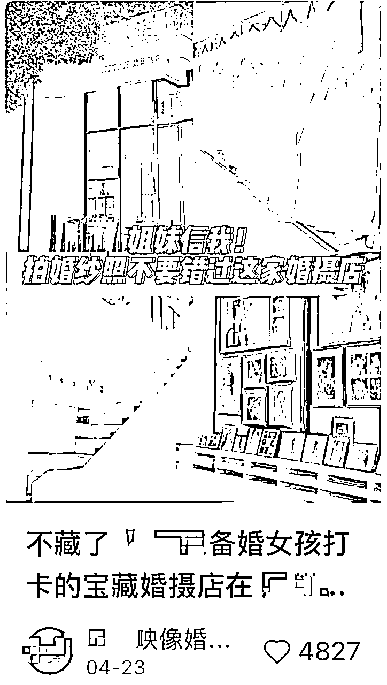

1.  大合集选题

也可以把产品/服务，或者相关的报价、价格表、服务表，做成个大合集，这样的内容，可用于长期投放

选题参考：

*   X 套婚纱照风格怎么选？

*   2024热门婚纱照风格合集

*   X套风格+XXX张照片，多少钱

*   9组中式婚纱照风格合集

*   ……

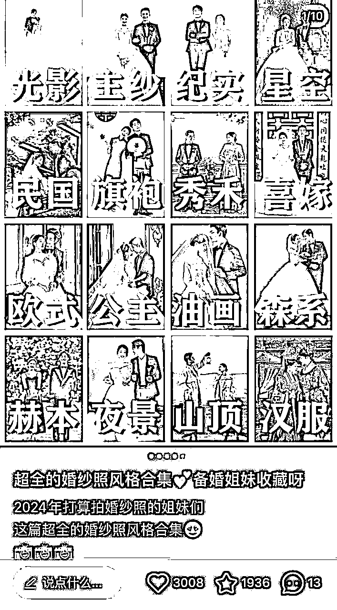

### 标题制作

为了增加搜索权重，一般会在标题上增加一些关键词。常用的关键词包括：

1.  地区词：上海婚纱照、惠州婚纱照、深圳婚纱摄影等

对于有地区限制的行业来说，地区词是最容易被搜索和识别的，所以一定要加上

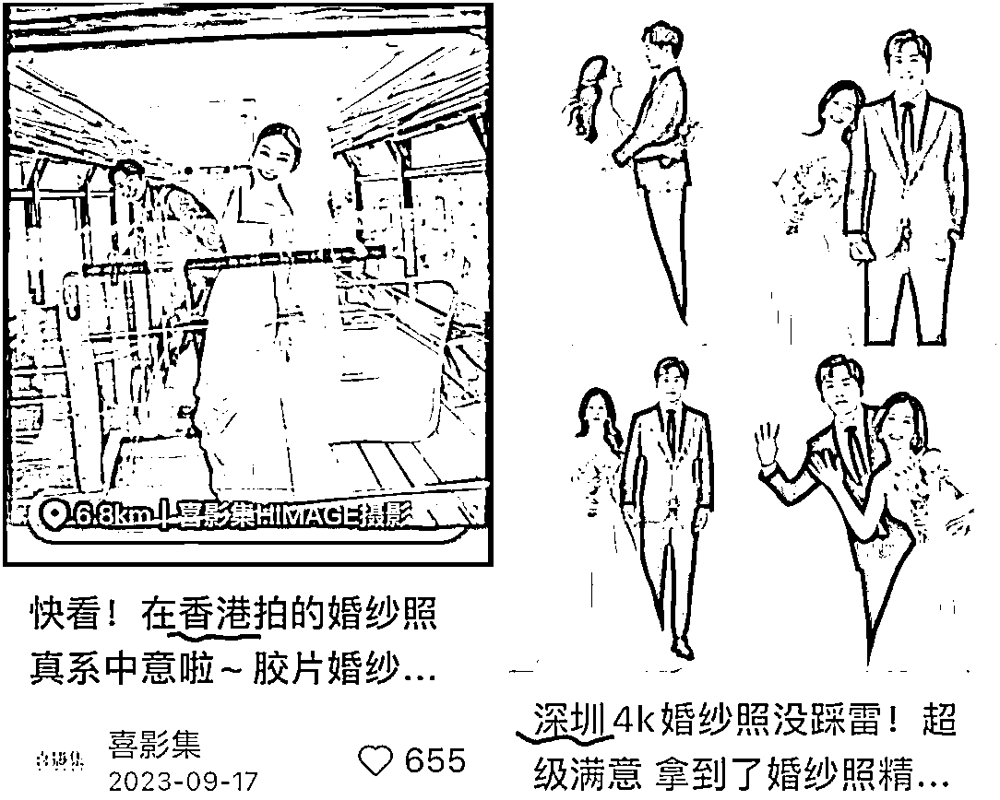

1.  风格词：中式婚纱照、喜嫁婚纱照

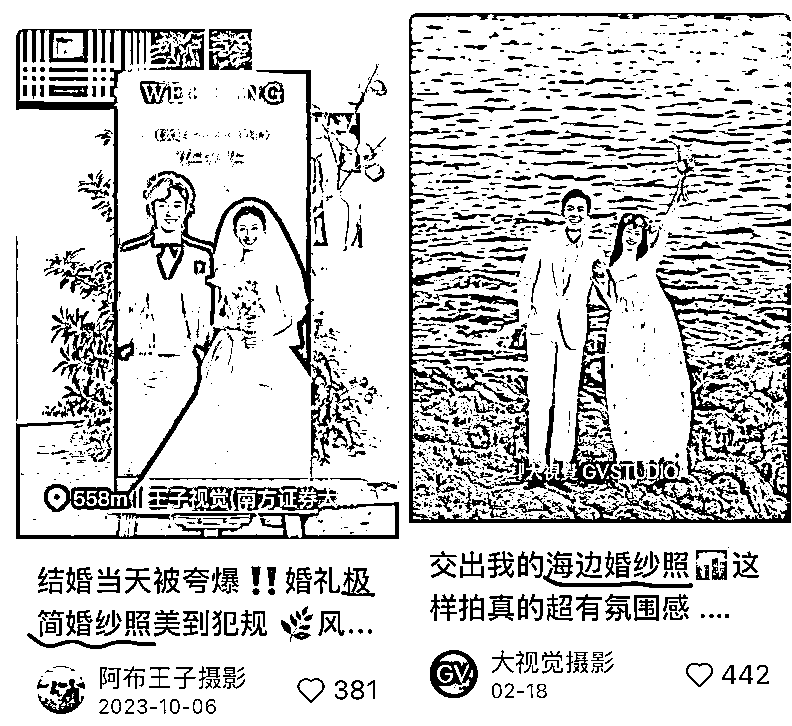

这些都是热门的产品风格词，也是用户经常搜索的关键词，尽量都加上

如果笔记用于投流，在聚光广告上可以设置标题优化，可以在一定程度上减轻内容制作难度

### 封面

婚纱摄影类的笔记封面，只要找出产品最大的亮点突出，点击率就会很高

比如，

*   当图片只有一个女生时，可以先从展现女性美的角度出发，挑选好看、有氛围感的女生单人照当首图。

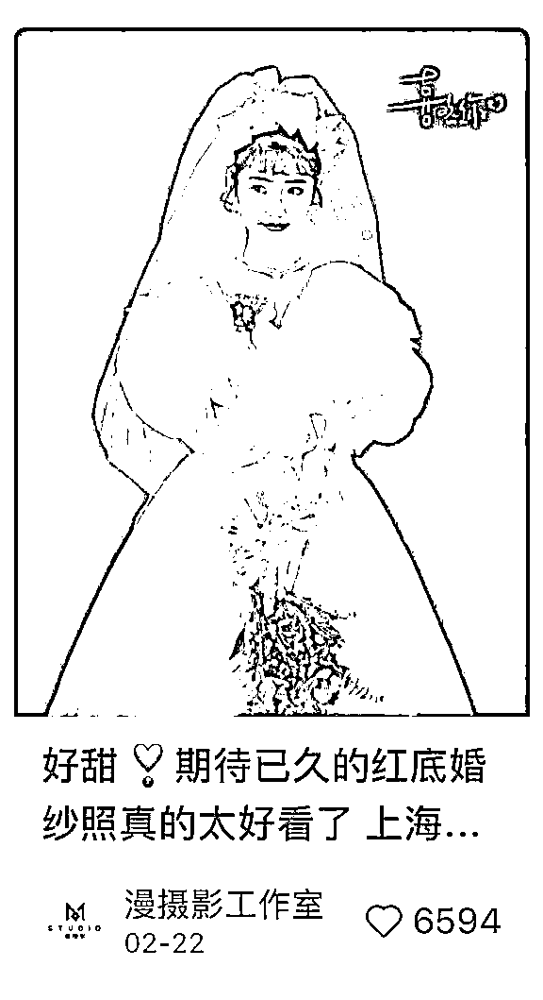

*   当有两个人的半身图时，选择互动性强的。有幸福感的同时，让用户更能看清妆造

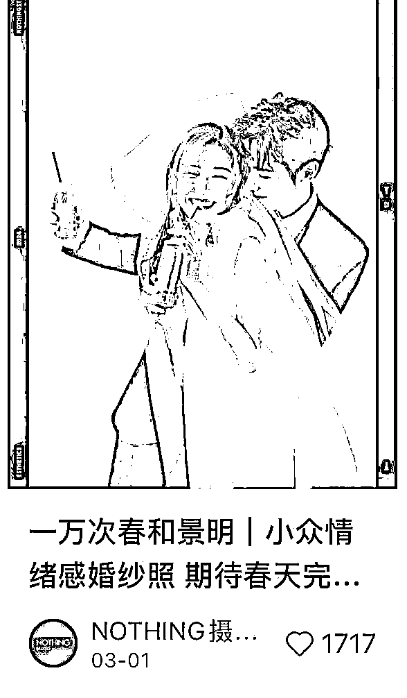

*   当图片有两个人的全身图时，需要背景干净美观，整体画面和谐有氛围感

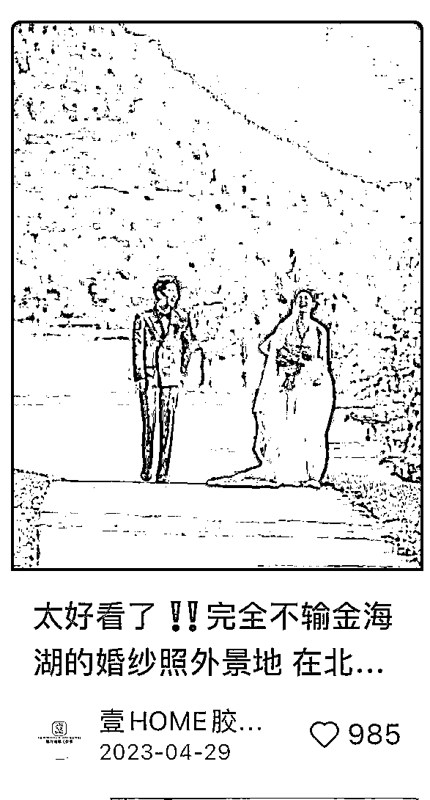

聚光投放也有封面优化，但如果封面是经过精心设计，后面内容图片没那么好看的情况下，不需要开启封面优化

封面优化适用于，封面和内容图没有特别大差异的情况下使用

### 文案

每个行业、不同选题，写文案的方式都有差异

分享几个大部分行业都通用的方法：

1.  从品牌角度出发，表达产品的研发思路（讲清楚为什么这么拍？）

1.  从产品角度出发，表达产品的风格意境（给客户选择的理由）

1.  从客户角度出发，适合什么人群？（谁可以拍？）

1.  从故事角度出发，展现企业定制能力（能为客人做到什么程度？）

1.  从引流角度出发，留钩子，推荐热门套餐内容

# 聚光 + 达人种草投放

广告投放部分，主要聚光 + 达人种草，没有投放薯条。在广告预算分配，主要是这些：

*   50%投放全站智投

*   30%投放信息流

*   10%投放搜索

*   10%投放达人

以上预算分配，都不是固定的，会随时调整。我讲下为什么这么分配：

1.  前期测试了很多广告类型，对现有的笔记，只有全站是成本最低，效果最好的

1.  搜索用户虽然精准，但量有限，而且竞争蛮激烈

1.  数据不好的笔记在大量投放前，可能会先投产品种草拉互动

1.  达人投放并不是投放重点，只是为了降低营销风险分配的

## 全站智投搭建

在搭建全站智投前，先筛选一遍适合投放的笔记：

*   不投流也有不错的点击和互动

*   评论区有在讨论产品

*   不投流也有人咨询

*   ……

把符合要求的笔记ID全部收集起来（笔记ID每一篇笔记后面那一串）

如果是新账号，跳过笔记筛选，直接进入建立计划

建立一个全站计划：

1.  建立「客资收集」的「私信开口量」或者「私信咨询量」「私信留资量」

1.  把所有笔记添加进去一起赛跑，赛跑时间大约3～5天

1.  消耗快，但没效果的笔记，可以关掉

1.  消耗好，且效果不错，成本低的，可以另外建立计划再投

1.  如果定向选的太窄，导致成本高的话，可以放宽定向（人群年龄）

## 如何投放信息流？

将全站跑出的优质笔记重新建立信息流计划，前半部分操作都差不多，信息流主要在人群圈选

如果产品适合小红书所有用户，可以选通投。如果没有经验，可以选择「智能定向」。如果想人群更精准，可以选择「高级定向」

我们一般选择高级定向，人群圈选这几个：

1.  平台精选，筛选有机会感兴趣的人群标签 （如瘦身人群、520送礼人群）

1.  对婚摄服务行业感兴趣人群（可加家居家装、婚嫁服务、酒店旅游等）

1.  关键词行为与婚纱摄影、风格套餐、高点击词，同行工作室、地区定位婚纱照相关

1.  定向人群按市级投放、结合现状投放，可不断测试出计划最适合的年龄，性别与地区

最后再把「智能扩量」打开

信息流人群圈选，可以根据自己行业去调整，一般都是全选核心人群 + 相关人群，如果跑不出去，再加边缘人群

## 如何投放搜索广告？

按正常理解，搜索流量比信息流会更加精准，但我们的投放的婚摄行业，搜索广告成本反而增加，用户比价也比较厉害，所以并没有做投放重点

但依然分享下投放思路：

投放搜索时，关键词可以选择1000个，不能太少，也不能太多，关键词太少会导致投不出去，关键词太多会导致人群跑偏，成本变高

一般情况下只选择：主关键词 + 相关词

主关键词包括：

1.  品牌词，如：惠州婚纱照、婚纱照

1.  品类词，如：惠州备婚，深圳备婚攻略

1.  竞品词，如：旅拍婚纱照、铂爵旅拍（随便写的同行）

跟产品、服务和品牌直接相关的词，这些词的搜索概率非常大，但是竞争也很大，可以增加一些相关词

相关词包括：

1.  需求词：惠州婚纱照哪家好

1.  长尾词：惠州婚纱照风格

1.  间接相关：婚纱照前攻略

1.  ……

在旺季时，如果预算充足，且想要扩大品牌声量，可以追加投放「抢占赛道」

抢占赛道可以把笔记推送至关键词搜索广告的第 1 位或者前 3 位，费用非常高，所以如果投放这个，关键词一定要精准，而且不能太多

## 达人投放计划

婚摄行业一般就邀约本地的达人来探店，这部分不是投放重点，简单分享下投放思路：

1.  每个月大约找3～5个达人探店

1.  前期沟通好素材、肖像的使用权，一定要沟通好，而且一定要能把素材给商家商用

1.  如果投放后的数据好，可以追加效果广告加热

1.  达人拍摄的素材，可以用于官号转载，也能对内容进行二创

1.  投放时搭建好服务组建，方便引导用户咨询

1.  除了kol，也会投放一些koc，这些创作能力一般的达人，只沟通素材代发

# KOS + 内容矩阵

前面都是常规运营操作，到矩阵化操作才是弯道超车的重点，矩阵类型有以下几种：

*   kos主理人+员工号矩阵

*   伪素人矩阵

*   客户好评内容种草

## 主理人矩阵运营策略

简单说，就是打造 IP ，突出行业专业身份和业务范围，并关联主理人（一个企业号可以关联3个主理人）

如果有「员工账号」功能的话，可以关联若干个员工账号

### 主理人设参考

员工人设：以员工的角度，切入你的产品，如：在XXX公司上班是什么样的体验

品牌虚拟IP：以品牌的形象出镜，虚构一个品牌IP，如旺仔、雪王

创始人设：把自己当作品牌创始人，分享自己品牌创建经历、品牌故事和品牌愿景、产品等内容获得曝光，让用户既支持自己又支持产品

小编人设：最常见的人设，以小编的方式写营销文案，如盼盼、扫描全能王

其他：岗位性质人设，如旅行体验师、摄影师、化妆师、设计师、客服等等

### 主理人形象打造：

头像：突出主理人专业身份或者产品、服务即可，真人头像更具说服力

昵称：主要突出主理人的称谓、身份和作用，如：（品牌名+昵称职责：xx婚纱摄影主理人）

简介：@官号联动，并描述账号价值，账号更新的内容方向等

内容：根据个人工作事项，突出品牌优势。可以更新专业知识、产品测评、品牌故事和实力证明……

定位：笔记定位到门店地址

标题：同样添加搜索词（xx地标 +婚纱照）

## 伪素人号运营策略

前面我们调研了用户的消费路径，发现很多用户都会在小红书发帖，或者评论，向博主求推荐品牌

这些看起来是用户「真实测评」和「推荐」的帖子，最容易吸引其他用户的阅读，而且信任度很高

一个用户在找婚纱摄影店之前，即使不发帖求推荐，也会经常刷到其他人的推荐，会看下评论区，其他人对婚纱店的评价是怎么样的

同时，如果一个求推荐帖子火了，往往会去主页看下她最终选择了哪一家，也会看下有没有真实测评，有没有踩雷

所以为了利用好这一点，我们做了一系列的素人号矩阵，主要更新内容：

1.  分享日常，吃喝玩乐等，蹭一蹭小红书热度

1.  分享备婚相关笔记（可省略）

1.  求推荐婚纱照（也可以添加其他备婚相关的求推荐，让笔记更真实）

1.  会有大量同行在评论区留言，这一步先不处理，让笔记自然推荐

1.  发布探店笔记，说最终选了xxx家（包括环境、试纱、花絮等）

1.  安全下车，发布成片，没有踩雷

发布完最后的笔记后，这一个素人号基本就结束了，后面继续更新日常和婚纱照的问答等，不用花太多心思

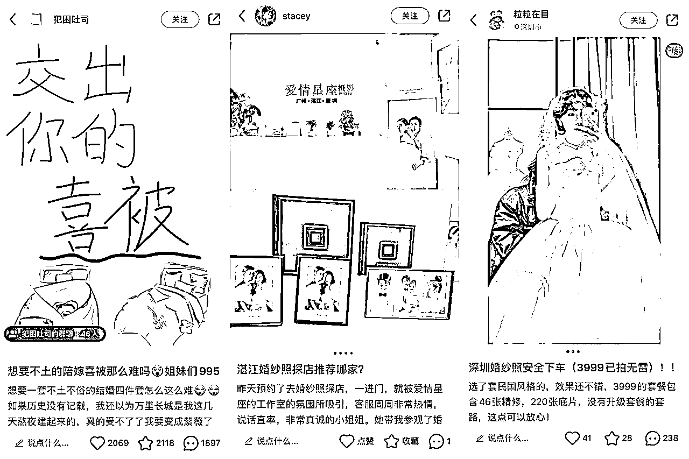

### 运营重点：

1.  账号数量： 不低于3个，量少效果不明显

1.  起号： 确保账号浏览正常、无违规限流就行

1.  前期内容铺垫： 可以发布一些引发讨论的笔记

1.  如：各类求推荐笔记、夸张主题引发热议……

1.  婚纱照内容制作：

1.  前期：妆造、妆后自拍、花絮与拍摄体验感受

1.  中期：成片合集（可发布不止一篇）与好评感想

1.  后期：每套不同风格成片分享与选择风格的原因

1.  获取用户信任 ：全程从真实客户的角度出发，建立与客人感同身受的热心人设。即使最后推荐，也可以引导对比了解，具体选择权交给客户

1.  引流方式：

1.  笔记内容@官号（量大有风险）

1.  建立员工号，@对应客服

1.  评论置顶引导（例如：就不一一回复啦，我是在@官号定哒，想拍的姐妹们可以去了解一下）

1.  用户咨询后，推荐官号名片，引导用户可移步了解

## 客户好评种草

服务好任何渠道来的客户，引导客户分享小红书笔记，真实客户分享，比伪素人号更有用

分享主题：

*   第一篇：门店环境、服务态度、试纱挑选

*   第二篇：妆造效果、拍摄花絮

*   第三篇：分享成片、安全下车、引导至品牌

数据好（点赞/收藏达到标准，有真实用户咨询），可给一些费用帮助薯条投放，增加曝光

另外，用户是不会免费分享的，给他一些费用就行了，具体费用根据行业确定

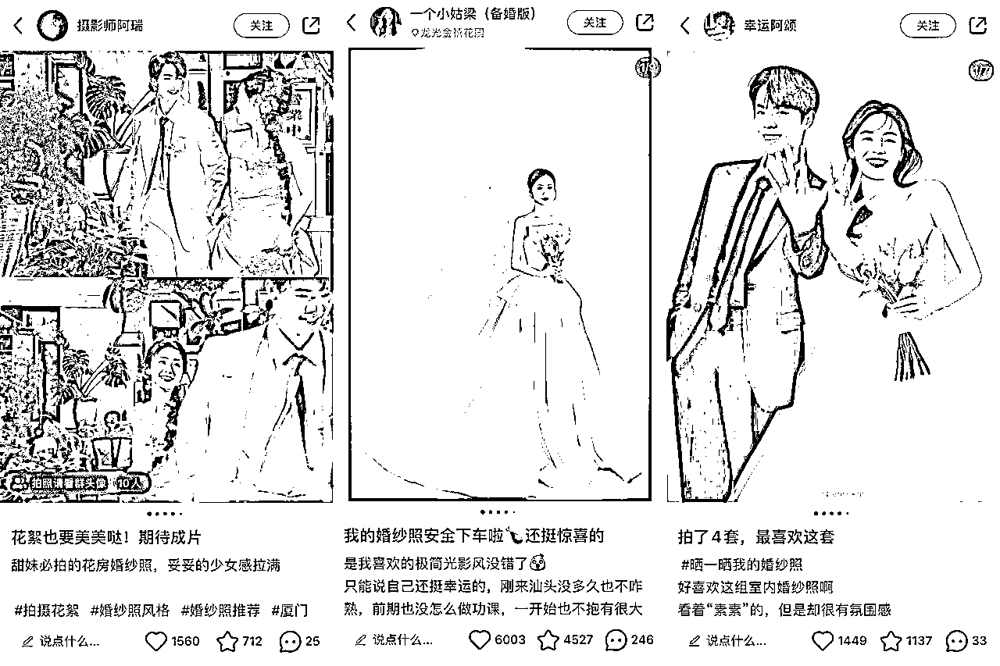

大部分用户也没有内容创作能力，所以如果采用客户好评种草的话，有2个建议

1.  建立完整sop，教用户怎么拍摄、怎么修图、怎么写标题以及文案

1.  做好笔记写好文案，给用户代发

以上，就是整体营销的思路，适合大部分决策成本较高的行业

几乎是无保留分享啦！跨行业也可以拿来即用！

-END-