# 当了TK航海教练后，我找到了轻资产入局TK搞钱的方法

> 来源：[https://xych0525.feishu.cn/docx/OJEadJcveo0kDBxJk8ZcB6NwnMh](https://xych0525.feishu.cn/docx/OJEadJcveo0kDBxJk8ZcB6NwnMh)

Hi，大家好，我是众里，一台手机入行，从服务商到店群铺货，半年时间合计在TikTok美国卖货上千万，也是上期TikTok美区小店的航海教练。

生财圈友聚会听到Serena分享，回公司3篇小红书笔记成交10万，在半年内两篇分享帖子：

感兴趣的朋友可以戳戳：

23年：生财线下聚会，让我半个月变现10万+，从跨境小白变身TikTok美区专家

24年：从没做过跨境，怎么入行TikTok赚到 100 万？

这篇文章分享的是：「TK轻资产入局分析」，我想也会对准备出海的老板有用。

# 1、TikTok赚钱趋势分析

## 1.1 TikTok美区开店的阶段性变化

资料店在美区彻底结束了，现在商家数量上来，封店封号，不合规的模式被平台嘎的差不多了

在待开放的墨西哥、巴西、德国、西班牙等42国还有下一波浪潮！

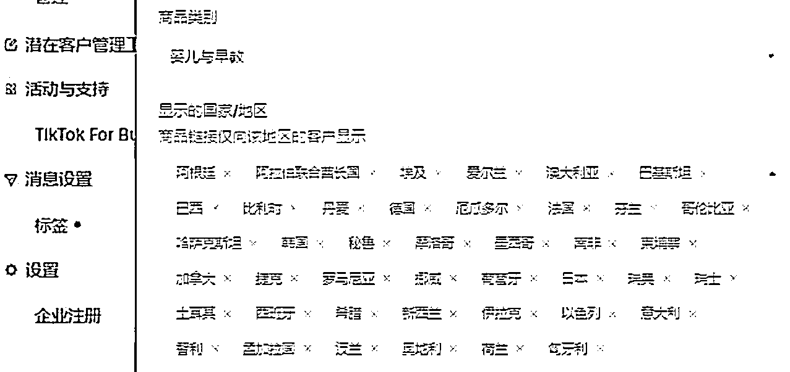

铺货模式赚钱最轻松的时间就是10月份之前，选品上架第二天满单，没有违规，能卖仿牌，几百万粉丝的网红带货免费低佣金，可以国内发货，大学生拿着1万块也能干电商。

门槛限制了新手小白，但是能解决美国身份及亚马逊单店200万美金的卖家，正是合规入场的好时候

## 1.2 现在什么样的团队在赚钱

去年无脑上架，刚毕业的运营不懂选品不会英语，就能日出几千美金的时代过去了！

那么问题来了，现在的卖家在赚什么钱？

过完年后，公司TikTok业务停滞，店群+矩阵号被封掉，几百台手机闲置，冻结部分流动资金。

随后走访了多家TOP卖家，美妆、家居、3C类，还在不断的扩张团队，总结下来就一点，基于供应链的深度做广告投放（达人、短视频、素材）

交流学习后，我们自营的卖货团队，走到了合规经营模式上

合规经营所需：

1、租赁一个美国身份真实店铺：2-3万+3-5%的抽点

2、测品成本：3-5种短视频脚本，购买100美金的广告折扣户直接投放

3、测试几款后备货美国，空运一批，海运一批

4、达人寄样成本

5、平台周转资金

6、运营人员（3-5人），运营、投手、达人BD、仓储几个相关岗位，有的公司还有主播、短视频团队

这么一波跑下来，20-30万已经出去了，如果是有投资人出资做这个项目，账面资金没有100万别搞，自己做看看能在哪些环节优化成本结构。

以上费用主要在两块，人员工资、物流备货。卖供应链货盘的情况下，只需要有店铺，做短视频素材投放就行了，但是利润很低，我们拿来让店铺出新手村的产品，卖亚马逊大卖海外仓的灯，一单只赚2美金，对接发货环节各种问题，他们美国海外仓的配合度不高

# 2、轻资产如何入局TikTok

4月份当了生财美区小店航海教练后，很多圈友加我，更多的还是想低成本的先看看。

美国听证会后，之前卖店铺时候写的小红书、抖音视频这些陈年老帖流量保障，加了一大批想入行的新人。

所以在思考让大家怎么低门槛的入行看看。

毕竟我去年做成分享的模式，当下不行了，资料店受限，真实店铺成本2.3万，还不算其他的

找网红推广的过程中发现了轻资产参与的方式，几个达人要收我们上万的费用+抽点

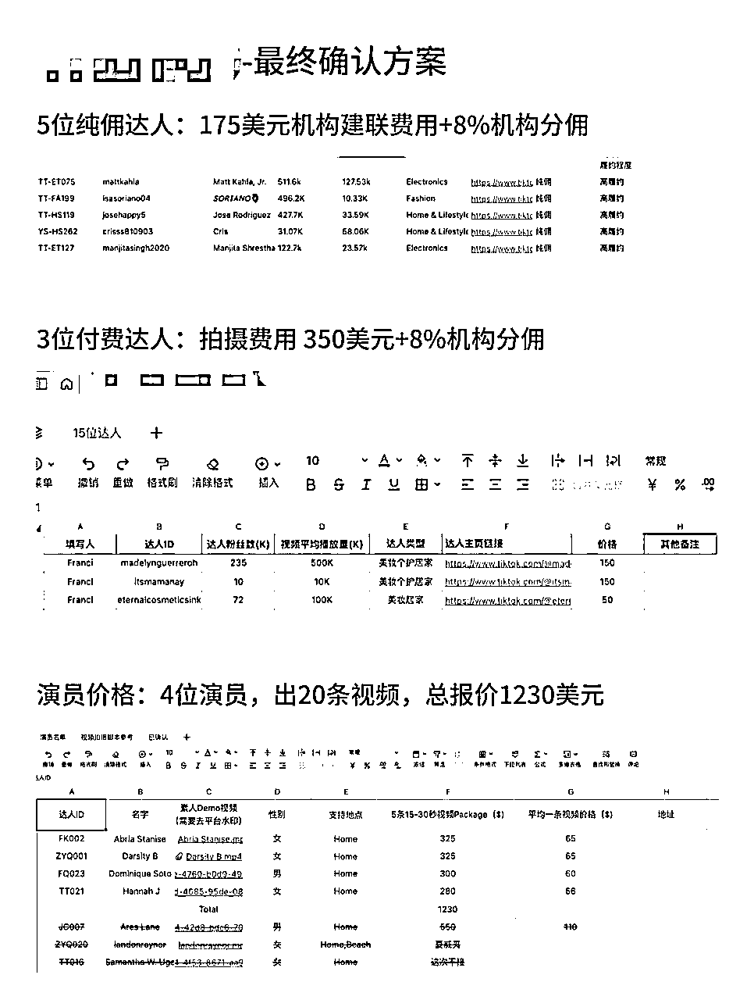

随后我们也在BOSS招聘达人间联岗位，薪资都要开到上万元，小店运营岗位要求会达人间联，说明该场景创造的价值远远高于付出工资

经过市场调研后，看到了以下几种合作形式

1、自己是卖家，通过卖货过程中沉淀了达人库，服务新入行的卖家，收取间联费及佣金

2、TAP机构，签约了网红入驻机构，服务第三方，这种可以佣金进机构，联盟定向给到达人，不需要对接繁琐的结账问题

3、从亚马逊、独立站时代走过来的代运营公司，独立站没有自然流量，需要通过找网红推广，产生素材投放带动销售，沉淀了一批有耐心的品牌方，直接加TikTok服务的板块

# 三、实操启动

## 3.1 手工操作

招聘员工后（后来发现是个水货开掉了），自己参与其中走了一遍，先是从TikTok数据后台一个个的去找邮箱，第一天，3个小时发了131封邮箱，因为没有管理数据，达人回复后不知道是谁。

达人邀约话术：找几个卖家要过来借鉴的，拿着GPT又改了几个版本的话术

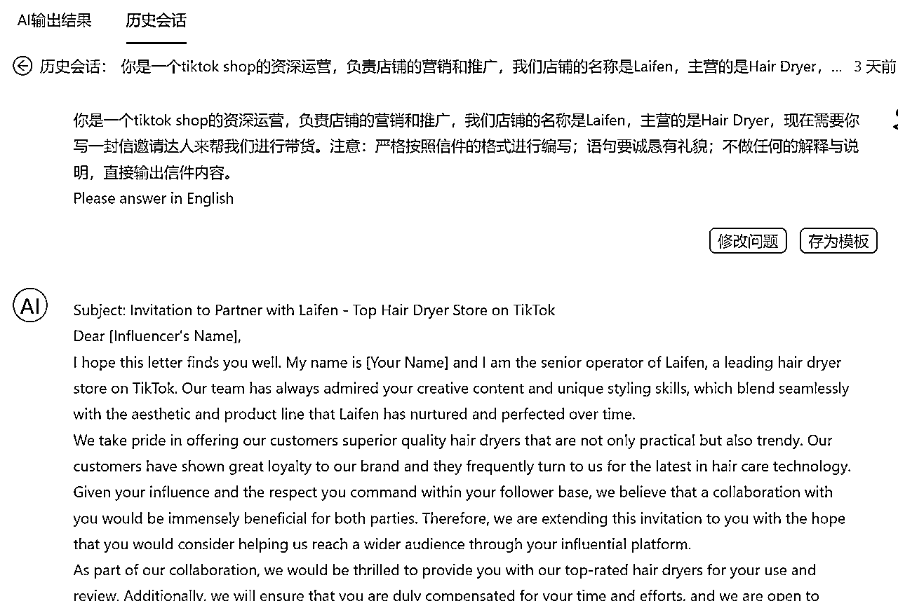

这是通过AI模板生成的提示词，有了思路在GPT上改了十几个版本

当然老美们很热情，正反馈！

美国人很热情！

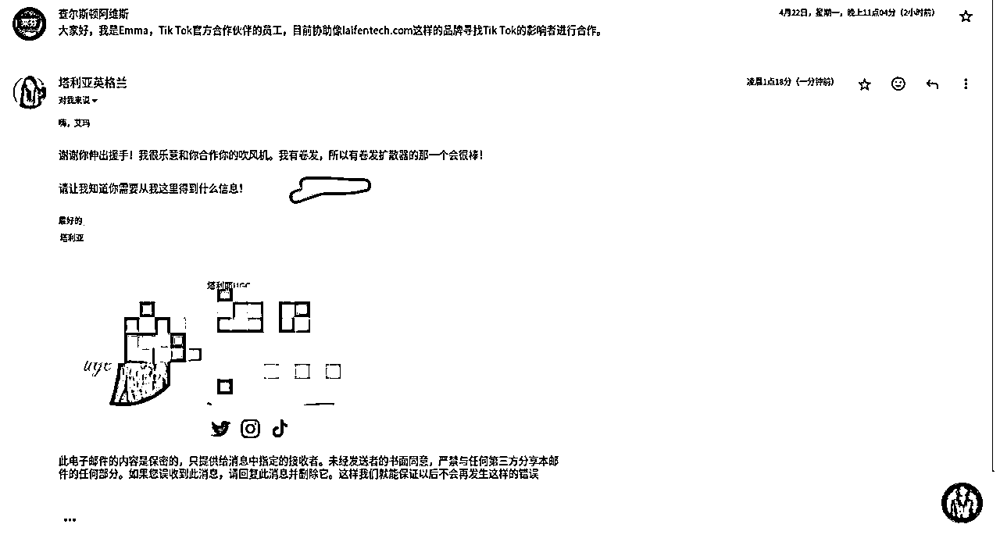

几十万粉丝就想要个吹风机回去

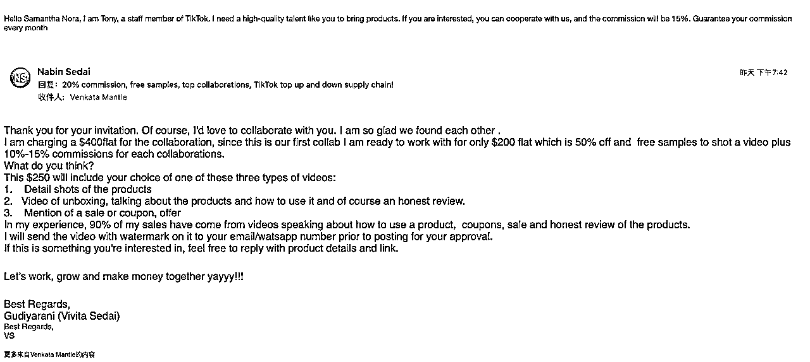

## 3.2 工具提效

开始买工具测试，达秘、花漾、达卖这些相关的软件买回来，都是需要店铺才能使用

购买邮箱间联模式MossCreator，这次效率提升了，有点贵，试用版399发2000封，续费几千到大几万

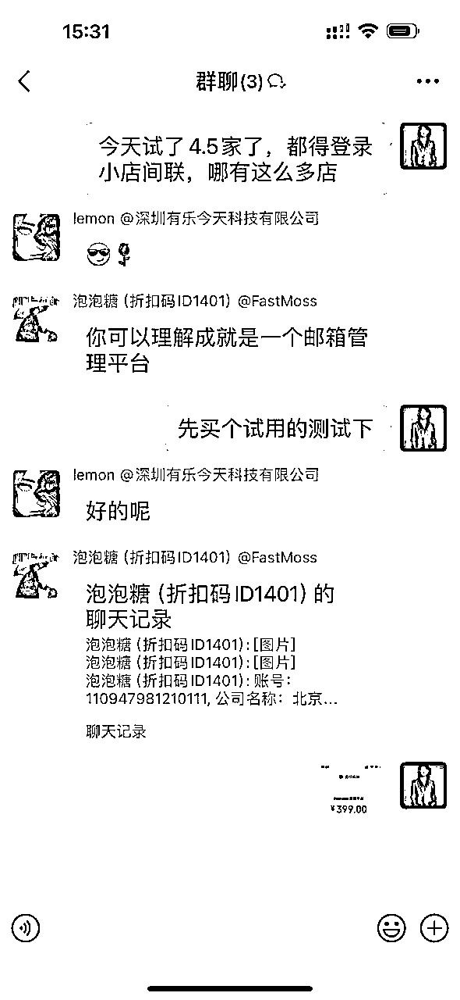

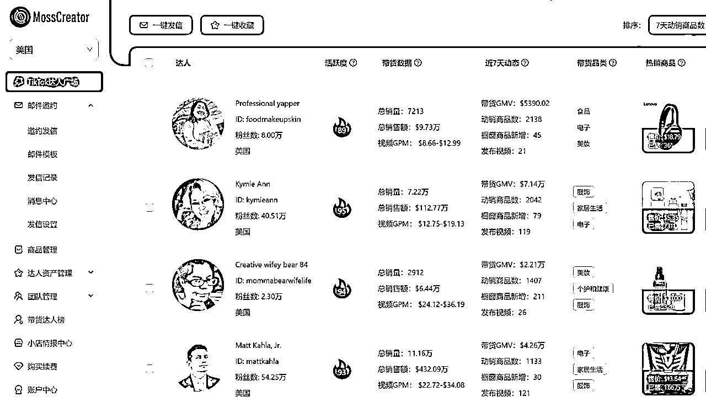

这时候小红书的粉丝量给了我加持，EohoTik选品平台找我推广，要给150块推广费，果断拒绝要了个最高级的会员，价值1500，导出了1万个达人邮箱

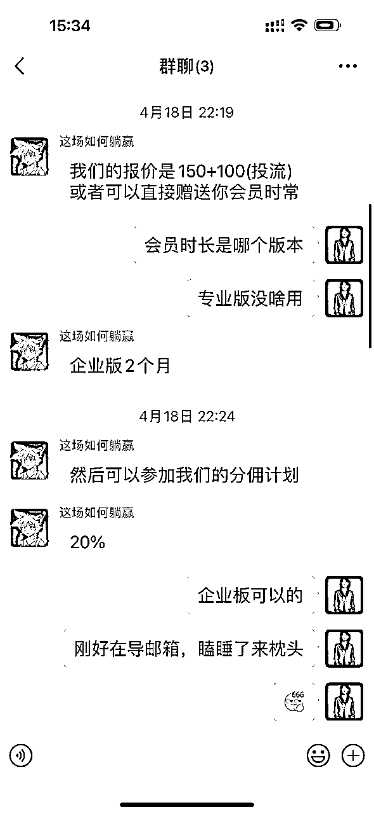

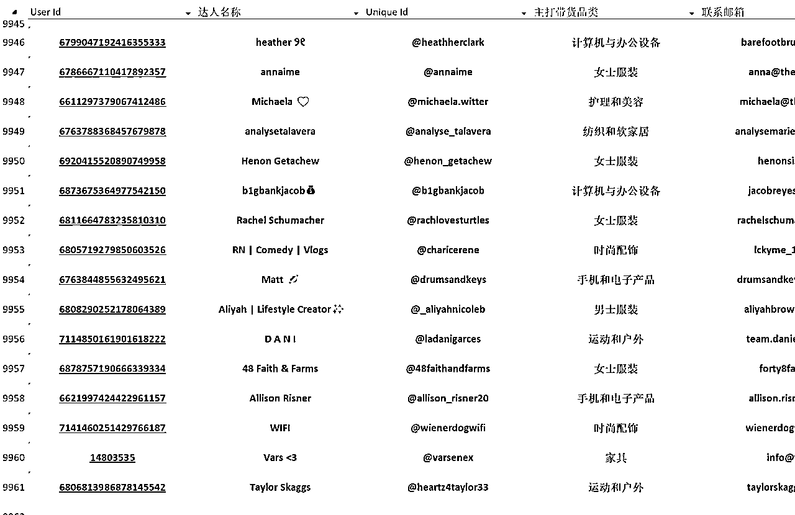

导出一万条邮箱后，想要更多信息需要额外付费了

## 3.3 搭建自动化

数据量上来了，想着提升效率，找到了生财圈友，海外工具站教练良辰美沟通，设计一套工具结合我们的模式。

良辰美精华帖：做出让亦仁愿意付费的产品：1000个以上分享真实收入的产品和服务（MRR in Twitter)）

隔天就跑到东莞，探讨到深夜，一沓打印纸写完，把最终方案定出来。凌晨搭建RPA，2点成型，吃饭的功夫用无线网卡配合笔记本电脑，自动发了200封邮件出去，第二天回复率10%，我们只需要回复第二封邮件导入WhatsApp聊需求对接样品

RPA这套模式成型，只需要准备聊单跟进人员，话术库出来还可以结合GPT做下阶段优化

多组局多参加聚会，圈友一个思路，项目直接进入成熟期！

（良辰美去年9月参加了我的线下组局，聊到开发拆件、自动化工具怎么结合TikTok，后来也是小聚了好几次）

## 3.4 小店内自动化

0-1搭建完自动化流程，且效果不错，迷上了这种打开电脑，琐碎重复的事情给到机器人的感觉

（建议老板们亲身参与，搭一次RPA，我去年店群模式相对成熟的时候，找技术搭的，体感不够）

从平台导出的邮箱1天就发完了，数据量跟不上，闲鱼购买的数据精准度不知道怎么样，把我们的资料店又重新激活了，围绕着店铺，设计了从小店数据采集，用小店触达，省了给软件公司几万块的费用。

## 3.5 业务闭环

有了以上的产品，我们的达人库算是初步成型，开始外部合作，是不是有更好的方式，在谈业务合作的过程中找到了新思路

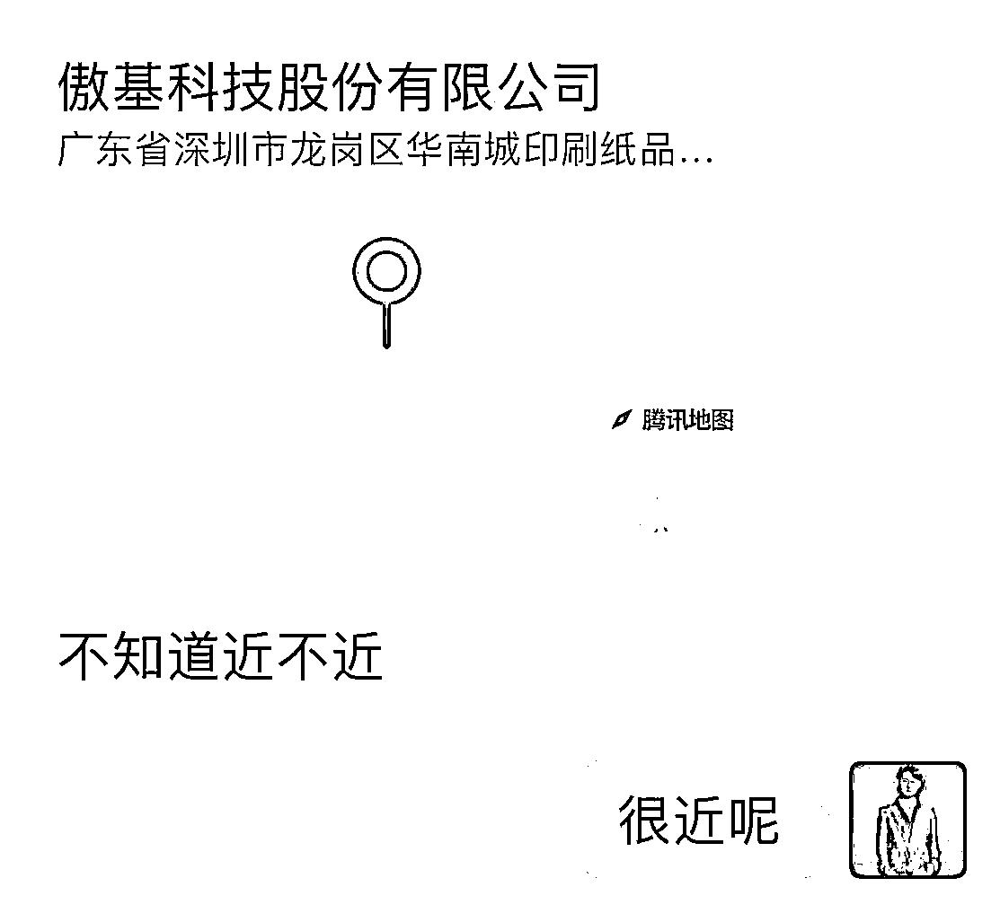

没店铺的玩具头部供应链

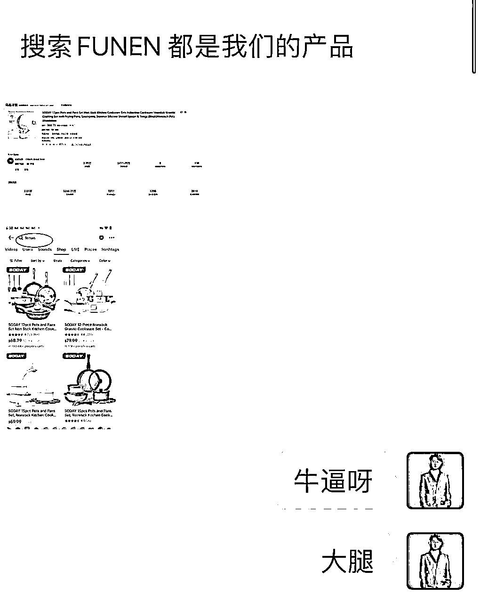

20亿大卖的TK小店合作

独立站代运营头部公司，分享了他们内部在用的邮箱触达工具，需要用到域名，设计定时发布，有足够多的精准人群邮箱，理论上一天发1000万封都没问题。

另外一个品牌商，在Meta、YouTube抓取关键词数据，其中邮箱90%，WhatsApp有30%这样，做TOB订单，没做过电商平台

信息流动了，发现这两套东西能结合起来！

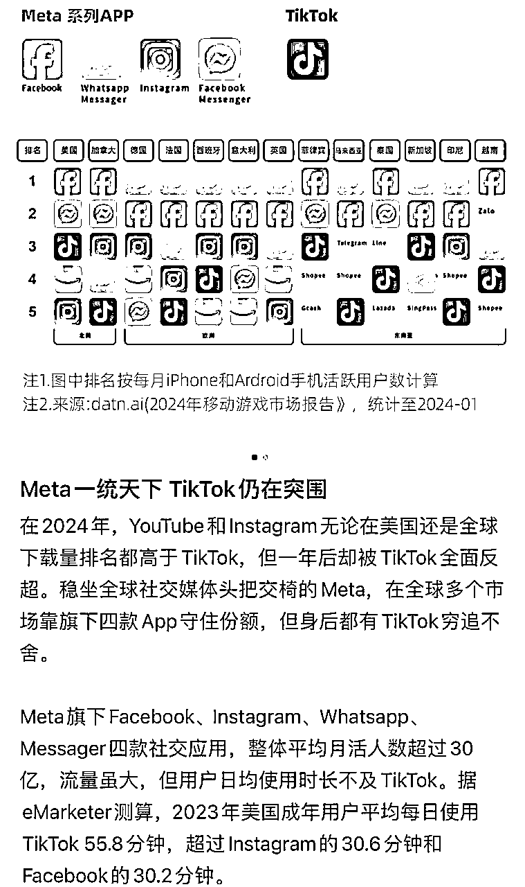

当场拉了圈友，隔天采集4200个邮箱回来，引流独立站，成交20多单1000的客单价

做完这些，任督二脉打通，有获客渠道跟触达方式，意味着外贸获客，独立站引流，小店达人推广都能服务了，服务商业务好像也能做大，能为卖家提供价值

## 3.6 价值10万的达人间联流程图

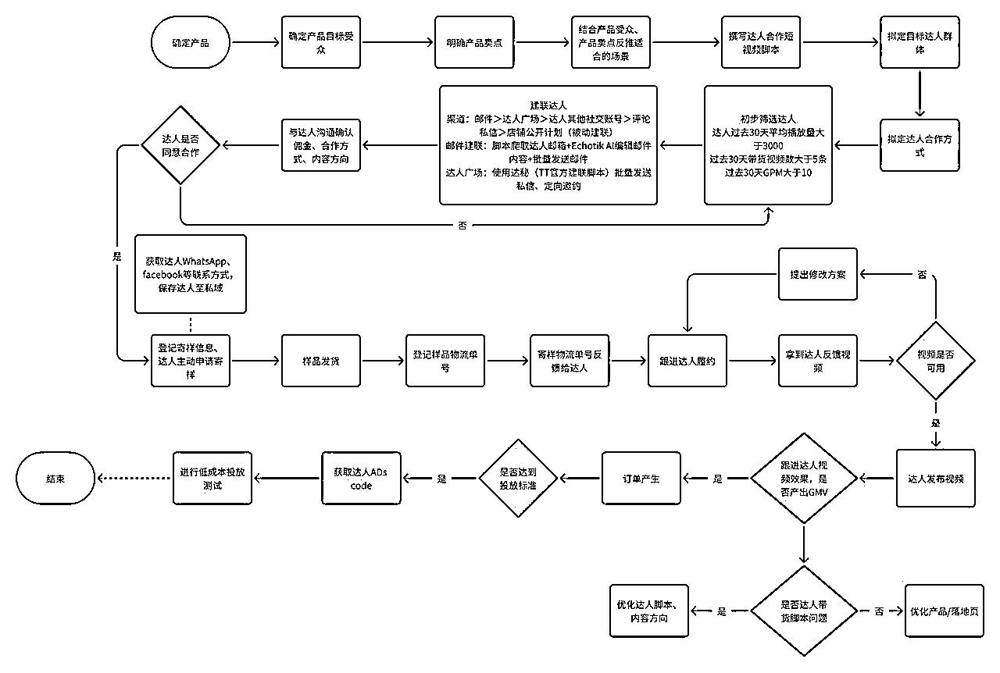

# 四、一些思考

## 4.1 国内外差别

通讯工具：

国内使用微信，限制多，邮箱不怎么看。海外用WhatsApp，采集到账号，企业版能直接联系对方，海外邮箱使用率高

达人心态：

美国达人和马上开放的5国，百万粉丝的拿到自己喜欢的样品就很开心了，没什么前置费用

利润差异：

国内在抖音生态也有对标，比如热度、艾美、尚博等等，做纯达人模式发展成了几百人公司，衍生出来的业务就是达人私域、培训、品牌方前置服务费等等，利润率来说，海外比国内高几倍，汇率高，品牌方做市场，主动提出50%分佣的大把

## 4.2 关于合作

项目合作：

报了N多个课程，生财就是我最好的老师，有问题把生财当百度搜，线上没找到答案就组个局，线下跟圈友链接下，集体智慧灵感流淌。圈友也是最好的合伙人，没有沟通成本，思路比钱重要

品牌合作：

达人间联这个业务不排它，我们自己做商家，找了好几个达人机构合作，大多数要收单达人的间联费，佣金也要，前置费用也要，一个达人收费几十上百美金，我们采取的是纯佣模式。帮企业创造价值，赚增量市场的钱

分销模式：

从去年一起干店群模式的合伙人中了找几个，跟着我们同步迭代，目前3个工作室加自营团队去迭代核心技术，我们解决核心技术跟品牌方合作的问题，看看是不是都能拿结果，后续考虑用知识付费的方式招商代理

## 4.3 跨行业的解决思路

TikTok很新，跨境很大。TK同行中找不到学习方向的时候，meta、独立站、国内抖音都有很多成熟可借鉴的玩法，最低成本的试错看看。

比如美区航海的时候，0播放低播放问题，把同样的内容发到ins、YouTube播放轻松过万，所以搞短视频的建了独立站，1台手机登录3平台6个账号引流，受单平台影响的焦虑没了

比如美区真实店成本高，资料店活不长，谈好的店铺迟迟没有搞定，一些人去申请MCN机构月销几百万美金，且平台机构还有很多报白机制

比如美国橱窗容易掉橱窗，跑去测试25国的卖家，把引流卖虚拟产品，搞私域卖复刻的方式跑通了，又杀回美国市场

## 4.4 持续迭代

RPA自动化

上次聚会听圈友把公司300多个流程梳理出来，通过RPA可以减少一半人工做更高效思考的事情。

我们也要学习这些，不断挖掘能结合的技术，下一步把我们团队在跑的开店、短视频也变成自动化，从TikTok店铺注册自动化、矩阵短视频剪辑这些重复性的工作，也梳理出来一一完善。

流量获客

把网红营销公司放大，放大流量获客能力，去年我们还是有30个小红书账号在运营，10来个抖音号获客，店群卖货后间歇性发布，把流量捡回来。

流量上要一一落地的事情：

买了生财SEO航海的工具，批量导口播文案，GPT去重，把人设号的流量拉一拉

五一假期学了GPT的航海，实操了一些，结合工具做内容

研究7秒视频号流量体，做矩阵放大模型

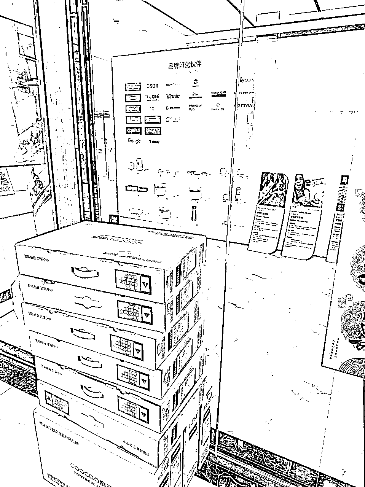

五一节假日加的工位，10台电脑，50台手机

有了自动化的意识，公司几个核心环节在去参与一遍，找到能优化的点

希望每个人都能在生财有术，找到适合自己的项目！

持续更新TikTok出海最新玩法