# AI情感陪伴是多巴胺，不是催产素！

> 来源：[https://superhuang.feishu.cn/docx/HYFRdFqA0ouGvLxPSALcVrc2nih](https://superhuang.feishu.cn/docx/HYFRdFqA0ouGvLxPSALcVrc2nih)

国内的情感陪伴赛道是伪命题！没想清楚千万别碰！

(标题的结论很清晰，不是标题党，后面会有写哈！)

其实这个结论过去给过一些朋友，但没有在公开场合提过，最近我们组织了一次闭门会，与会者交流下来，丢给大家几个暴论：

当前阶段大模型的能力+成本，情感陪伴类产品无法实现短期商业价值，也做不到社交，建议转向内容消费

这篇文章，我们会先聊聊情感陪伴类产品的发展过程，聊聊“非共识”里的共识，接着展开说核心议题：情感陪伴不是社交是内容消费产品！基于这一非共识，下一步可以走哪些方向？

# 00 引言

过去我写了若干篇情感陪伴方向的产品分析，包括：

Character.ai：这家AI创业团队，找到了让LLM“爆发”的方法

https://mp.weixin.qq.com/s/U_0essTMrEl2srROqxgBWw

万字长文：为什么AI陪伴产品都想抄星野？

https://mp.weixin.qq.com/s/R9-3Drlt1foX3M7Wx-JOYQ

万字长文：AI陪伴产品的终极解法?

https://mp.weixin.qq.com/s/WMOhsA6UW37Ov2h4CfIdKg

万字长文：用AGI视角重新理解筑梦岛

https://mp.weixin.qq.com/s/wsE1CP6kJdwd8FOq2FP33g

揭秘Inflection AI：15.25亿美元融资背后，Pi如何用多层Cake模型重塑Conversation？

https://mp.weixin.qq.com/s/ZV7azzuhbw7nZOF1mTDxQg

从半年前各大AI情感陪伴类产品纷纷上线，到现在百花齐放，大家也都在实践的道路上获得了不少的反馈，于是在4月21日，Super黄组织了一些相关的产品朋友们齐聚一堂：

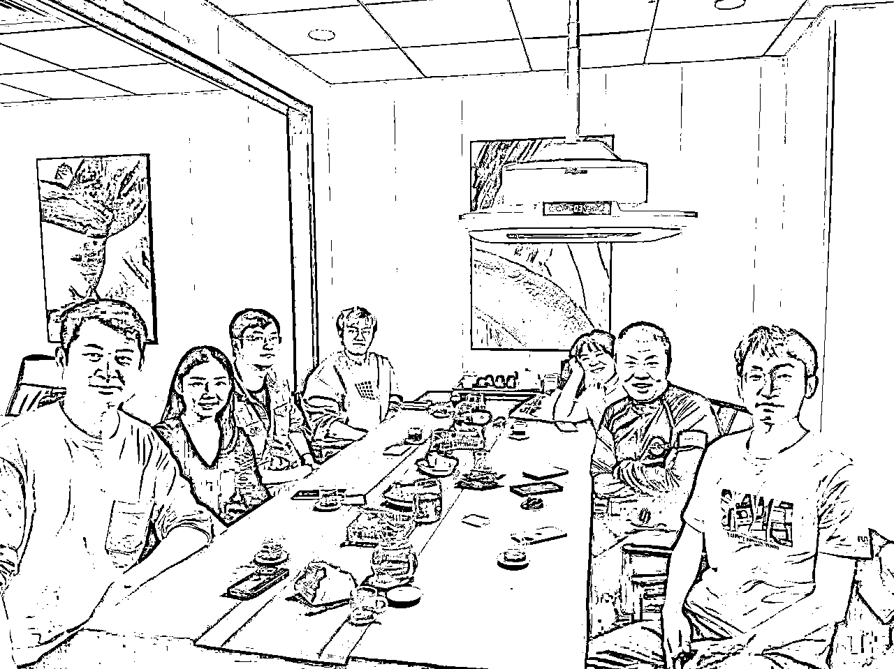

也得到了很多“非共识”里的共识，容我慢慢叙来。

## 第一. 回溯情感陪伴类产品的历史

我们画一个时间轴：

可以看到，在ChatGPT前后，Character.ai和MiniMax的Glow纷纷上线，这两款产品起步很早，不光奠定了自己的江湖地位，也让更多后来者找到了榜样，如火如荼的情感陪伴赛道逐步开启！

到今年3月份，A16Z的全球Top50 AI Web产品里，有8个是这一赛道的产品！仿佛情感陪伴赛道是一个新的趋势！

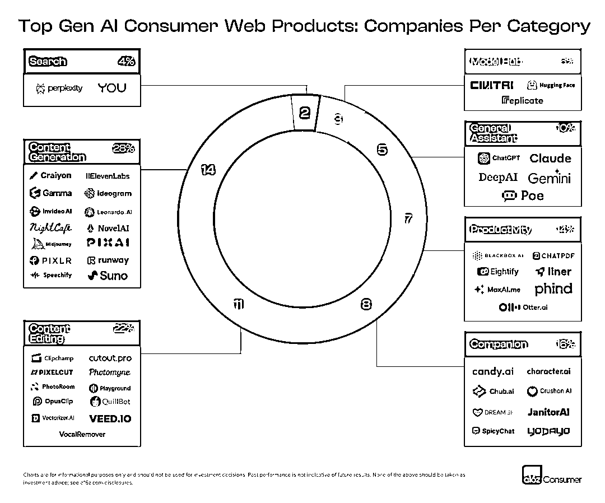

## 第二. 非共识的诞生

在这个期间，基于自己和伙伴们的研究，我有两个判断：

1.  AI可能会瓦解社交网络

1.  情绪满足是极强的价值

（from 万字长文：AI陪伴产品的终极解法?）

在这次闭门会的交流中，目前第一点在当前节点下是被证伪了，第二点被证明了。

换句话说，基于当下的大模型能力（注意这一前提条件），AI做不到构建AI和人之间的社交关系，只能提供短期的情绪满足！

违背这一点去做产品，很可能会踩到大坑。下面我们来展开介绍一下这一观点。

# 01 为何说情感陪伴不是催产素！

催产素是一种与社交行为、信任建立和情感联结相关的神经递质。它在促进社会交往、增强人际关系和建立亲密感方面发挥着重要作用。社交互动，如与朋友和家人的交流，能够促进催产素的释放，从而增强人与人之间的联系和情感支持。

## 第一. 初期我认为情感陪伴是AI社交，但错了！

其实在最开始，我认为AI是可以形成社交关系的，如果一个人和AI聊就能满足自己的关系建立需求，能够抚慰自己寂寞的灵魂，那不就是社交关系的建立了么？

甚至我还写了AI瓦解社交网络的内容：

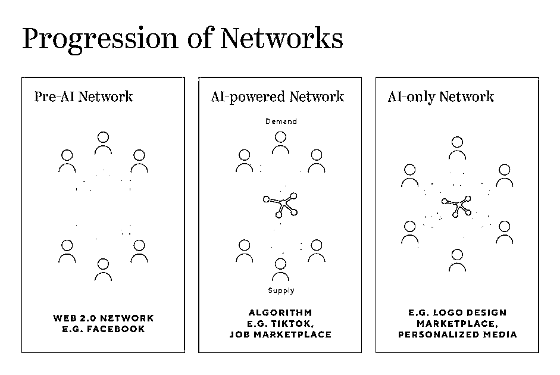

理想情况下，最右侧的图表明了AI的中心化网络，所有人都和AI建立关系即可。在星野、C.ai里，用户更多倾向于和AI就完成了交流，包括内容也都由AI生产，创作者的地位被大幅削弱：

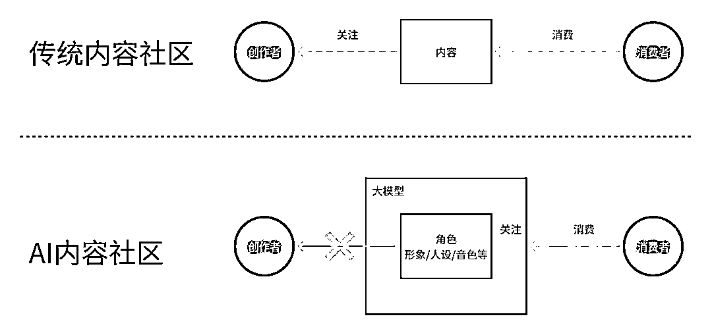

以上是我之前对于情感陪伴的部分理解，不过可惜，目前大家实践下来，发现这个理解现在来看是错的！

## 第二. 为何错了呢？

原因是AI满足不了社交：大模型的能力和用户需求还无法匹配！

首先，先定义一下情感陪伴产品：

情感陪伴产品是一种旨在通过技术手段提供情感支持和陪伴的服务或应用。这类产品利用大模型输出文字、TTS（语音）、图片、Live2D甚至3D等技术，模拟人类的交流和互动，以满足用户在情感上的需求。

罗兰·米勒在《亲密关系》这本书里提到的6个要素：

“亲密关系和泛泛之交至少在六个方面存在程度差异：

*   了解(knowledge)、

*   关心(care)、

*   相互依赖性(interdependence)、

*   相互一致性(mutuality)、

*   信任(trust)

*   以及承诺(commitment)。”

从这6个要素出发去看目前AI和人类建立的关系，可能程度都还是远远不够的。

下面我们具体展开讲讲为何是不够的：

1.  AI在理解和表达情感方面存在局限性。

也就很难真的和人类建立社交关系，

我们可以将AI和人类的多面性做一个类比，比如一个专业的心理咨询师在与客户互动时，会根据客户的需要扮演不同的角色：

*   倾听者：在客户需要倾诉时。

*   引导者：在客户需要方向时。

*   教育者：在客户需要知识时。

*   支持者：在客户遇到挑战时。

如果AI具备多个维度的能力，就可以通过自然语言处理（NLP）理解客户的需求，通过情感分析（Emotion AI）识别客户的情绪状态，通过知识图谱（Knowledge Graph）提供专业建议，以及通过角色扮演（Roleplay）与客户进行互动，从而在不同的情境下提供相应的支持和陪伴。

人类的情感体验是多维度的，包括生理反应、心理状态和环境因素的综合作用，使用文字和语音来表达，首先就已经损失了大量的信息，再加上从大模型的能力边界来看，AI很难完全理解真实人类的情感深度和复杂性。

局限性就出现了！

进一步思考，一个更好的AI伴侣未来可能是“MoE”的模型，因为要做到很强的拟人度，拆解下来，要做好背后可能涉及专业模型+心理咨询模型+Roleplay模型+日常闲聊模型。

1.  AI无法提供实例化

在Pi的文章中，我们提到了Pi的属性：支持性+同理心，尽管如此，人与人之间除了语言交流，还有更多的非语言交流：

“哪怕我就坐在你旁边，都能感到我的温度，这才是真正的人与人之间的情感陪伴”

在五感之中，人体感官感受的深刻程度依次是：视觉(37%) > 嗅觉(23%) > 听觉(20%) > 味觉(15%) >触觉（5%）

一个拥抱或握手可以传达安慰和支持，而这些是目前AI无法提供的。

人类属于哺乳动物，哺乳动物的大脑边缘系统负责处理情绪、记忆、嗅觉等复杂功能。

有个奇特的现象是：

人和人、人和动物、动物和动物之间会产生边缘系统共振的状态，刺激下丘脑和杏仁核，在感受正面情绪时，下丘脑会产生多巴胺和催产素等荷尔蒙。多巴胺提升情绪，催产素促进关系，主要负责恐惧和焦虑的杏仁核会减少活动，让双方感觉安全舒适。

因此可以推断在没有一个实际的身体和大脑存在时，AI无法提供这方面的共振和交流。

目前的AI无法实例化，并没有一个实体存在，所以存在很大的局限。

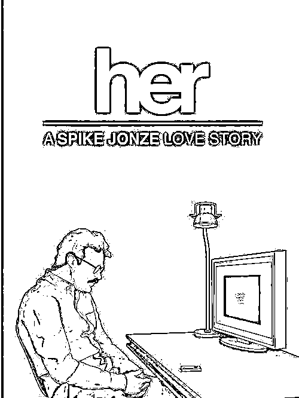

1.  记忆和逻辑连贯性的限制

目前各家情感陪伴类产品都会存在记忆问题，即使是做了一些记忆提取，一样会出现聊到后面忘了前面，用户就会感到困惑。。。你想想，你的朋友如果忘记了你觉得重要的事情，你的心情如何？情感关系就很难建立了。

逻辑也很难在长的交流中持续跟住，有时AI会在对话中突然改变话题，或者无法理解用户的隐含意图，这些都会也会带来影响。

1.  文字/语音的交互成本极高

和多个实践者的交流下来，我们发现只有5%的用户可以重度使用以对话框为主的交流形态的情感陪伴产品，这5%的用户消耗了50%的Token。

用户年龄层包括了小孩、青少年和成人。

背后的原因可能是：能使用文字去展开脑海中想象的人，在人群中占比偏少，这是精神层面的消费！

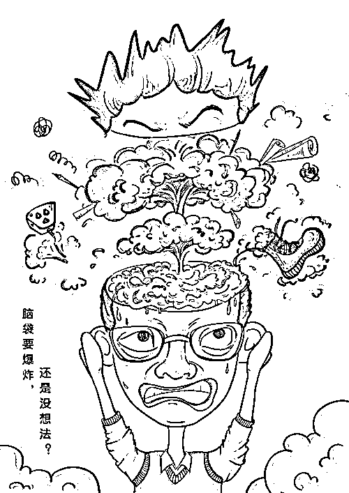

大部分人需要更直接的反馈，比如图像视觉直接的刺激，从短视频的流行似乎也证明了这一点：

人脑处理视觉信息比处理文字信息要快得多，也更直观。看图像或视频时，大脑中负责处理视觉信息的区域会活跃起来，帮助我们快速理解和想象场景。这就是为什么视频和图像比文字更容易吸引人的原因之一。

而且，研究表明，人们往往会对视觉信息产生更强烈的情感反应，这也是为什么多媒体内容在广告和营销中这么有效的原因。

这也是AI情感陪伴在多模态技术成熟后，可行性更高的原因：

AI在陪伴和交流时，如果能结合文字、图片、视频等多种方式，那就能更好地满足不同人的需求，让交流更贴心、更人性化。

所以当前模态下的情感陪伴产品，天花板是非常明显的低！你很难可以和AI并排坐在河边，无声的吹着风（这样也可以建立关系）。面对对话框，你没有输入，AI就没有输出，就不可能建立关系。。。但交互成本又很高！

也就是说，你可以举出很多重度使用AI来对话的案例，但如果依赖此来做出产品决策，很可能掉到坑里去了！因为toC产品，如果没有做到大众，那就意味着不存在规模效应！

“现在的C.AI类产品这种你来我往的聊天式的交互对用户来说成本确实非常高，非常消耗能量。要组织语言配合AI一起把故事推动下去，在聊天的过程中慢慢把脑海中的幻想世界搭建起来，和小说创作很像。虽然成本比纯写小说要低不少，但仍是一个耗时间耗脑力的工作，除非自己本身对幻想世界和想象中的情节有着非常强烈的渴望，或者对某个IP角色有着非常强烈的情感羁绊，才愿意付出这么多能力，去享受创作过程中的快乐。更多人还是被社会磨平了想象力，喜欢故事，但是更愿意消费故事而不是生产故事。”

--《C.AI类产品的窘境与未来》一文中做出了很好的总结

以上这些问题，会导致情感陪伴类产品其实很难建立AI和人之间的关系！

## 第三. 情感陪伴产品，提供的更多是情绪价值

既然情感陪伴类产品，很难构建社交关系，那它的价值是什么呢？是的，小标题写了，情绪价值。

用各种方式，霸总、NSFW，都是让人和AI聊天过程中，感受到了愉悦！情感陪伴产品更是一种短时间内就能提供情绪价值的消费品！

人类在和AI对话过程中，潜意识里是知道AI有求必应、任人索求、不会伤害自己的！这里的伤害不光是心灵上的伤害，也包括AI不会进入到现实世界去对真实世界自己的生活造成影响。

你再想想是不是，AI尽管现在还无法达到和大众建立社交关系的水准，但对话质量在少数轮次内还是很高的，甚至说，比你在三次元里大部分聊天的质量都要高！

所以不管是霸总还是NSFW，都有两点好处：

1.  不会主动伤害人类；

1.  短时间内就能提供高情绪价值（满足幻想）。

总结来说，情感陪伴类产品，能提供情绪价值，而非情绪关系！

情绪关系就是催产素，偏中长期社交；

情绪价值就是多巴胺，偏短期即时满足。

情绪价值类产品，很像是《完蛋，我被美女包围了》，我们节选一个经典的用户高赞评论来理解：

你们都说这游戏烂，烂不烂我不知道吗，现实生活中我就是一个臭屌丝，现在难得有一款对我主动的游戏了，好不好我不知道嘛，我是真心动了哥，哥几个也别骂我了。我现实就一个丑屌丝，只能上游戏找找乐子，算我求你了哥，别骂我了

14,657人点赞

完蛋这款游戏，也非常好的满足了用户的情绪价值，用户肯定知道不可能和里面的美女建立关系，但是无所谓，情绪得到满足也是超值的！

为何在A16Z的Top50榜单里8个陪伴类产品有6个是NSFW类产品，除了海外用户付费意愿更高，还有就是荷尔蒙驱动的短期情绪价值能更快冲破付费阈值！所以在商业上更容易成立。

但在国内，这是不可行的，原因在下面：

## 第四. 商业模式的不可持续性

基于上面说的几点，我们简单做个总结。

首先，重度用户才会付费，基础功能免费的前提下，用户没有重度使用，是不可能付费的。这也导致了，维护日活用户的成本，很高！有朋友透露他们内测阶段拉来的重度用户，每人每天消耗的Token成本要超过10元。

并且，市面上的同类竞品能力大同小异，甚至背后是同一个模型，相互竞争，对于用户来说，迁移成本很低，无非就是一个Prompt，大量的“崽妈”们会同时在若干个平台养崽。

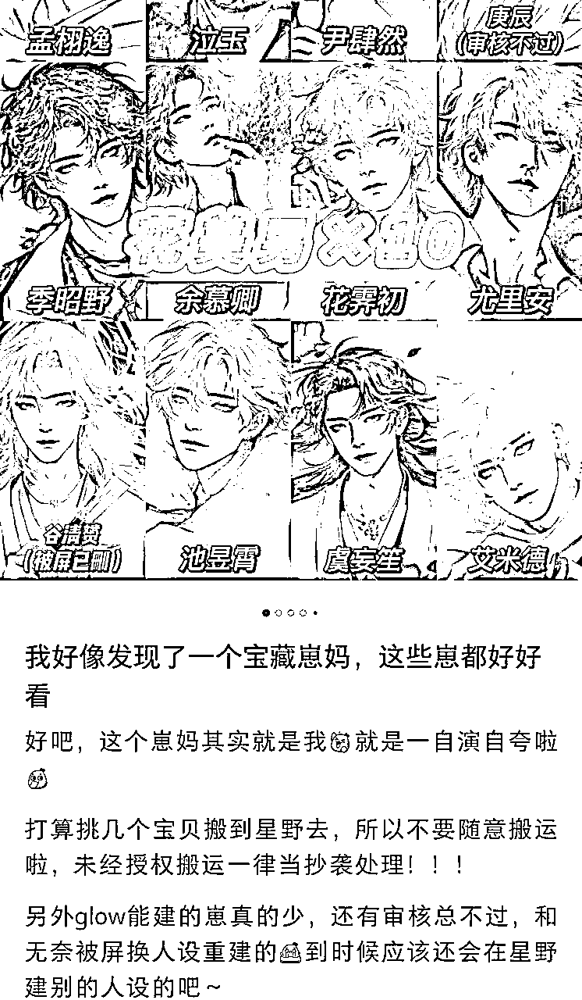

这样用户就更没必要付费了：基础体验都是免费的，你这收费我就去那玩，又没什么差别。

其次，重度用户又消耗了大量的Token，靠少量的订阅费是不可能收回成本的。

这就决定了商业模式不可能打正。

当然，走NSFW的我们没有计算在内，你可以认为NSFW是依靠快速调起荷尔蒙，刺激用户付费，然后依靠“健身房效应”，依靠用户花完钱之后就不来了的习惯，赚钱。

这种产品，国内是不合法的，海外呢，主要靠投放买量，计算ROI，有些公司跑不正ROI，也有的确实能挣钱的。但是长期是否有效，还不好说。

第三，人群中可以和AI长期交流的用户规模很小。前面我们说了原因：能使用文字去展开脑海中想象的人，在人群中占比偏少。这也是为何抖音更能Kill time的原因之一。

所以，除非对话成本再降低一个量级以上，模型对话质量，甚至是多模态技术更成熟之后，整个商业模式才可能成立。

之所以仍然有那么多创业者&大厂冲进这个赛道，原因是什么呢？

## 第五. 大部分人被ChatGPT和C.ai骗了！

闭门会上一位朋友提出了这个观点，我觉得很有意思。

她的说法是，ChatGPT的出现，聊天的形式让大家被误导了：聊天的对话窗口LUI是一种新的产品范式！

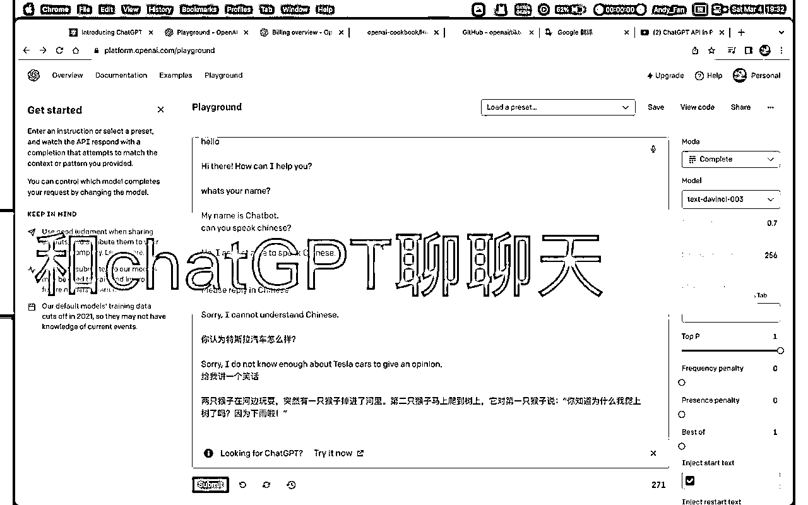

其实聊天在整个NLP领域内，只是个很小的任务集，但ChatGPT的爆火+对话的形态，把很多人带到沟里去了，就开始很自然的去思考：

ChatGPT，Chat，能不能让人和AI聊起来？

大多数学习者更喜欢被动接收而非主动创造

我们很少让学习者随意与AI模型进行交互，这种体验往往并不理想。

这是多邻国在智能涌现公众号采访时谈及的。不光是学习者，大多数用户都会类似。

开放式的Chat或许也成为了ChatGPT日活继续攀爬的障碍~尽管OpenAI不断地推出包含免费+免登录的策略，个人判断依然很难继续向上突破。

近期被疯传的SearchGPT（OpenAI肯定会推出的搜索），就是一种摆脱或者泛化Chat在用户心智中价值的工具属性。

进一步来看，ChatGPT更大的意义，不是聊天这种交互形态，而是它突然拥有了智能！从第一性原理出发，我们需要去思考，如何更好地利用涌现出来的智能，而不仅仅是Chat这种形态。

去年11月份，Super组过一次闭门会，当时有位大佬去和C.ai的不少人都聊过，他给出的信息是，C.ai的人都很惊讶为何中国这么多拿了很多融资的公司，都要做情感陪伴类产品。

其实在那个时候，C.ai对外做的是平台产品，试图用用户量来融资，这个故事是不被认可的，导致Noam资金非常紧张，进而导致我们在外面看到C.ai对于模型做了大量成本层面的优化，这是不得已而为之。

所以C.ai内部也不看好自己的方向，也就非常疑惑为何中国人有钱还要扎堆跳进来了。

（对了，最近小道消息也是说，C.ai考虑要卖了。。。）

Chat这种形态，还有一个问题是：

## 第六. 是的，人类不喜欢和AI聊天

即刻@Sophia在斯坦福，最近发了一条围观Altman斯坦福分享的笔记，其中有一段是这么写的：

人类始终更喜欢人类，就算现在ai下棋吊打人类，人类还是只喜欢看人类下棋;不过也有一些反例，比如青少年更喜欢跟ai聊而不是跟心理医生聊

闭门会里还有一位创业者也是给出了一样的结论：

一个人是不会试图和一个看起来像AI的机器人去聊天的。

当然，很多人（尤其是年轻人）明知道是AI也愿意尝试交流，但是单纯的聊不下去。AI最多也只是无趣的人，没办法感同身受的人。人只会跟有趣或者有共鸣的人聊下去。

这是经历过很多的产品类型探索，都失败后后验得出的结论，简单来说，是AI对话能力还不够强，这会导致人类和AI聊，一旦发现对方是AI，就不再愿意付出。

直播的时候还有朋友问，可是古早时期大家用QQ网恋，那可是非常沉迷的！

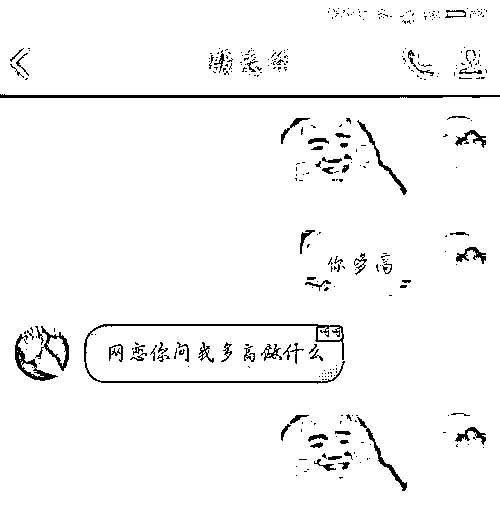

是的，如果对面是个人，我们会更加愿意，这是为什么呢？

对等付出理论：当你付出努力，大过于付出努力可能得到的结果，你是不会愿意付出努力的！

和AI对话就是这样，假如说你试图建立社交关系，但发现自己是在和AI聊，你就会中断这次session。

有个很有意思的case：一位创业者试图用AI来帮助下线后的主播，维系和粉丝的互动，试图拉高粉丝粘性，增加后续直播的粉丝回流量，结果发现了上述现象，只要男性发现是在和AI聊，会立马中断聊天。

还有一些案例也指向了这个论断，中间很可能的结论是：

不存在人和AI的社交。

我们指的是普遍意义上的，当然现在已经有很少量的人类和AI建立了关系。但比例非常的低，不会超过5%。

有一个可能的判断是：

人类的基因决定了宏观的行为。人的社交，尤其是伴侣向的社交，最内核的驱动就是将我“优秀”的基因选择一个好的载体传播下去。

但是AI并不具备这种作用，所以，95%的人都并不会浪费时间和AI聊天，因为这样并不能让我基因留存更长久。

那这个结论我认为是阶段性，由当前的模型能力限制导致，人类聊个20轮-30轮，还没完成关系建立，就识破了对面是个AI，但如果以后能聊50-100轮，甚至人类都没法判断是真人还是假人，或许这个结论我们就要重新定义了。

OK，这一Part差不多，如果情感陪伴不是社交，那是什么呢？请继续往下看：

# 02 情感陪伴是多巴胺

多巴胺是一种与奖励和快感相关的神经递质，它在大脑中的释放与寻求新奇、探索行为以及获得奖励时的快感体验有关。内容消费，如观看视频、阅读文章等，往往能够刺激多巴胺的释放，从而带来愉悦感和满足感。这种消费行为更多地与个人的内在动机和快感体验相关，而不是与社交互动直接相关。

## 小节强化：情感陪伴产品满足的是情绪价值

情感陪伴产品是一种情绪的消费品！

这句话在前面出现过，我们进一步思考：

如果建立和AI的社交关系可以连续（长期）的满足用户情绪，上面一章节我们已经讲清楚了当前是不可实现的，那情感陪伴类产品满足的是短暂的情绪价值。

先换个说法解释上面这段话：

人和AI在聊天的时候，没办法真实的产生情绪关系（即建立社交关系），但现在的情感陪伴产品，是可以让用户感受到愉悦和快乐的，只不过这种感受并不是因为人和AI建立了关系才带来的，仅仅是短暂的在交互过程中得到了情绪满足。

如何满足呢？

用户在一个场景里，受到了某个引导，主动提交了一段内容，大模型针对性的输出内容，反复这一过程，用户获得了情绪满足。

场景是一个很好的内容形态，它能够吸引人们沉浸其中，享受故事，体验不同的角色和场景。

当我们把这一过程，理解为内容消费，用户通过主动参与的共创内容，获得了短暂的情绪价值，这一切就合理了。沿着这一思路，后续的产品迭代，也可以朝着内容的深度和广度去做，路径也更明确了。

那接下来就有几个部分的思考：

## 第一. 实践来看，剧情向会更加粘人

前面我们已经摆出数据了，只有5%的重度用户会持续消耗Token，仅仅靠这波人，商业模式都跑不正，除非你流量获取是极低的成本、Token的成本也同样的很低，才有可能。

那什么样的产品形态更有可能成立呢？

其中一种就是剧情向的互动游戏，比较大的品类就是带有探险性质的玩法，这是不是一种内容向的产品了？

这种内容形态，我们举一个例子，之前很火的哄哄模拟器，

在这篇文章里，我们提出了一个概念：媒介即内容：新的媒介会有新的平台，新的平台也会有新的创作者。

为何这类似乎比情感陪伴的对话类型更好了呢？Super之前有一个思考是：

轻交互+沉浸感

我们设想，最多的用户在刷抖音，只需要上下滑就可以获得感官刺激了。互动内容向的产品形态，远远比情感陪伴向的产品更加轻量化：

用户不需要输入大量的文字，就可以在一个有设计的场景内，更好的沉浸体验自己主导的剧情走向。

可以这么理解：

需要陪伴本身也是一种无聊，需要Kill time的东西，泛用户不想费脑子，所以双击或者滑动，比Text普适性强且成本更低。

但其实除了轻交互，还有个点是重沉浸。剧情就是为了提升用户的沉浸度，NPC带来情绪价值，留存和用户时长都有了，还不用绞尽脑汁想对话，不用猜什么时候才能结束对话。

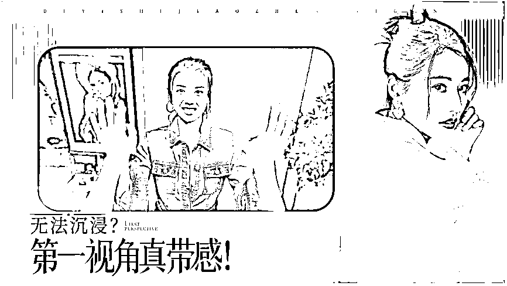

这类的内容形态，在PICO的VR上我感受过，更强，甚至还有直播间专门为此打造，不少性感女主播很会利用沉浸感，会用手撩拨你，还蛮真实的。《完蛋》只能在大屏幕上玩，沉浸感比VR稍弱，但也还是有不错的感受。

比如浩浩妈的火辣身材，还是蛮有冲击力的：

可怜汪汪的大眼，问我是不是真的把她儿子当成自己的儿子时，我怎么好拒绝呢？

短视频，游戏，似乎都在有轻交互+沉浸感这两个重要的因素！

## 第二. 剧情向的内容就很需要UGC

如果是剧情向的话，那就很吃剧情了对吧，此时剧本就很重要。

好的剧本从哪来的呢？UGC！你可能会说是，不对啊，PGC为何一定会弱于UGC呢？

关键是，极少有团队有真的专业小说写手出生的，每天坐在办公室里，如何能写出专业的、用户喜爱的剧本呢？

初期可以自己创建一些好内容来做冷启动，但后面一定是通过内容、产品，把种子用户吸引过来，做好基建（比如模版），做好引导，把社区的氛围感建立起来，让好的作者能持续创作出好的剧本！

这里面还是需要部分好的PUGC，但大部分确实依赖UGC。

这其实是大部分产品忽略的一点：创作者生态。

创作者如何有归属感、有获得感，甚至是有稳定的收入，从而可以持续的在生态内贡献自己的力量。

Poe就推出了创作者收益计划：

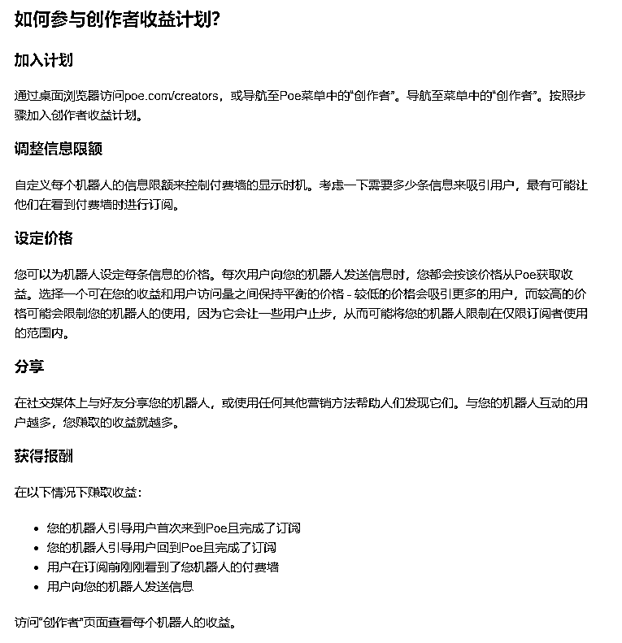

这种策略鼓励了创作者创造更好的Bot、更多分享。

是的，平台做好基建（包括一些创作模版），做好培训和引导，所有好的内容和场景都依靠用户产出，背后有个很深层次的归因：坐在办公室是很难产生出好场景的。

## 第三. 剧情向的极致就是乙女游戏

乙女游戏是一个很好的参照点，因为它通过视频、语音、文字等，共同帮助女生更好的获得美好的幻想。

它的实现逻辑是如下两点：

1、让男主（NPC）人设形象更丰满，基于脸好看产生的好感，到被性格能力的深度吸引；

2、基于感情的世界观0厚度，有剧情才能共同经历，才有情感升华。

具体会怎么做呢？

比如说，在一个Dating的场景，它会很巧妙的留白，留下让女生幻想的空间。

比如说，短信交互，也会把最撩人的部分留白，让你自己去设想。

这就是艺术。

但目前AI的能力，做不到这一点，留白还很神秘，在AI的能力边界之外。

如果这些无法实现，那AI也只有少量的内容价值，没办法达到乙女游戏的情感价值。

## 第四. 从乙女游戏，我们进一步再去想想游戏向？

我们在 里，提过《病娇AI女友》：

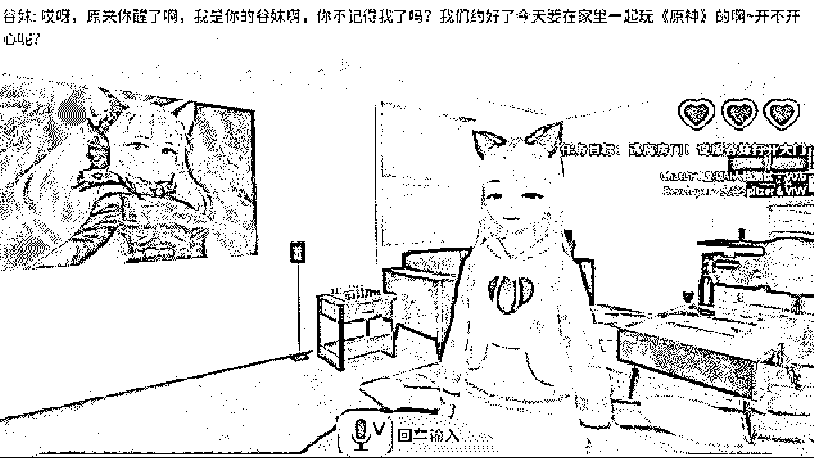

《病娇AI猫娘女友》是一款结合了ChatGPT的密室逃脱游戏。

游戏的玩法是玩家被关在一个密室里，眼前出现一位自称你女友的猫娘紧随着你，你的目标是通过和猫娘交流、和房间里各种物品的交互，实现逃离房间的目标。

这个游戏的设计独到之处在于：

基础游戏框架+AI实现自由度和丰富性

另外可以再看看一款AI游戏，叫做《Suck Up! 》

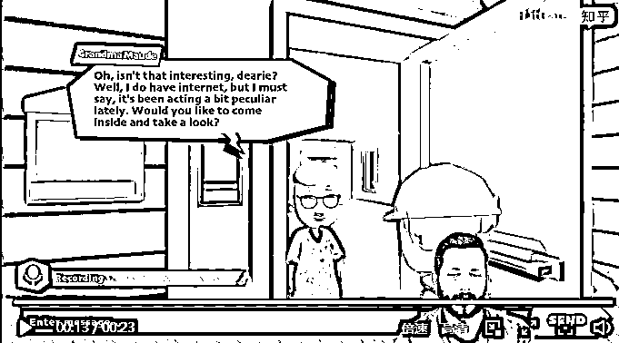

核心玩法就是“小兔子乖乖把门开开”，玩家在游戏中需要扮演一位吸血鬼，通过换装、和LLM驱动的NPC进行对话来使他们放下警惕，最终成功吸血足够多的居民来获得游戏胜利。

在和NPC对话的过程中，玩家需要在十秒钟内组织好语言，通过找借口、卖惨甚至来一段Rap的方式想尽办法说服NPC让自己进门并吸血，最后达成吸血31位居民的终极目标。

这极大的扬长避短！

还有一个《言灵计划》，看过玄幻修仙类小说的朋友，估计能知道一个词“言出法随”：通过输入你招数的文字描述（LLM理解转化后）来完成攻击和防守，系统会评定攻防分数，最后通过总分来判定胜负。

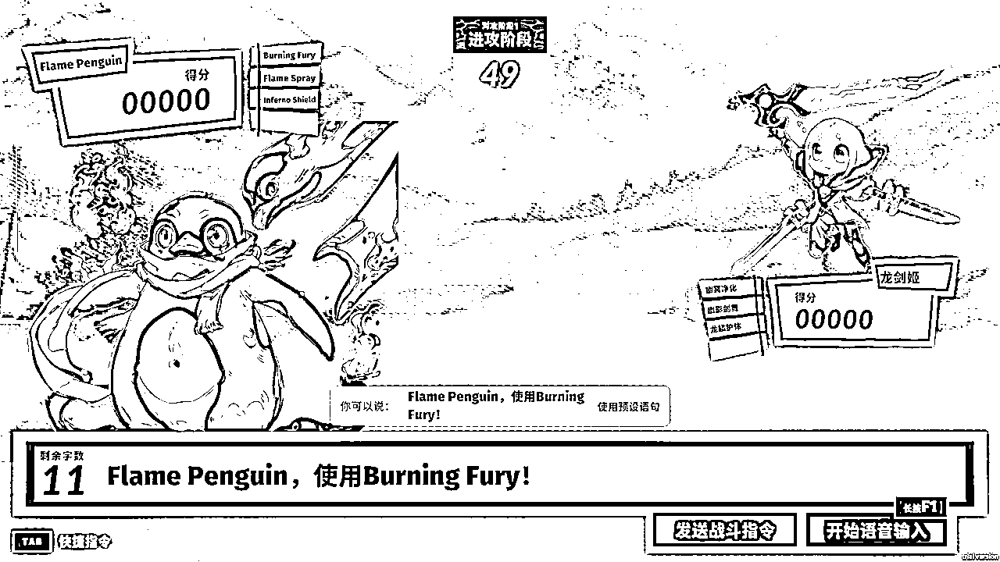

核心玩法也和如何找到最适合你的Prompt有关系。

以上这几个游戏品类，有几个特点：

1.  不是重度吃设计的游戏，这样开发成本就比较低；

1.  LLM是玩法中的核心一环，但占比比较低；非常符合我们的“低交互+高参与”；

1.  整体还是比较依靠玩法设计和LLM的融入。

我们理解一下为何这些AI游戏的设计理念非常巧妙？

重点可能在于：它把LLM用到了极限。

过去我们做情感陪伴类产品，试图让用户用无限的输入获得一个好的用户体验，但难点前面也说了，门槛特别高！大部分人是不喜欢or不能用自然语言来表达自己想法的！

所以游戏使用了画面这种人们最容易接受的载体来传递一种限定的场景，场景里再把最核心的体验部分用LLM来做交互：

这样用户就可以通过最少的核心交互，获得最大的体验感受！

## 第五. 聊聊AI内容消费的共性

我们换个思路：一个个的AI游戏，可以类比为一个个的剧情向内容。

只不过从文字模态，进阶为了多模态。对不对？

这样看下来，不管是剧情向orAI游戏向，都属于我们接下来要聊的AI内容消费品类。

这两类我们换到用户视角来看，用户的预期是完成一次交互式的游戏！这个游戏有一定的规则或者主题。

《病娇AI猫娘女友》是逃离房间

《Suck Up! 》是把门开开

《言灵计划》是战胜对手

《哄哄模拟器》是哄女友开心

只不过他们最核心的体验是通过LLM来完成交互的！这里就出现了和传统游戏不一样的点：

要给用户选择的空间，并且每一个选择背后对应着不同的可能性，这种可能性是相对多样化的。整体来说，只要保证有明确的主线，记忆和推理逻辑是否OK不是最重要的。

也就是，这是一种开放式的剧本！有趣好玩有的探索。

因此，用户实际上是在消费剧本，消费内容！

## 第六. IP对于内容消费的增强

如果是在消费内容，那就必须补充一点：IP对于内容消费的增强。

我们都知道Character.ai上面有非常多原神的角色，并且由于这些角色吸引了海量的用户来访问。那对于平台来说，如何增强IP的吸引力呢？

一种常用的思路就是：把IP运营成网红！

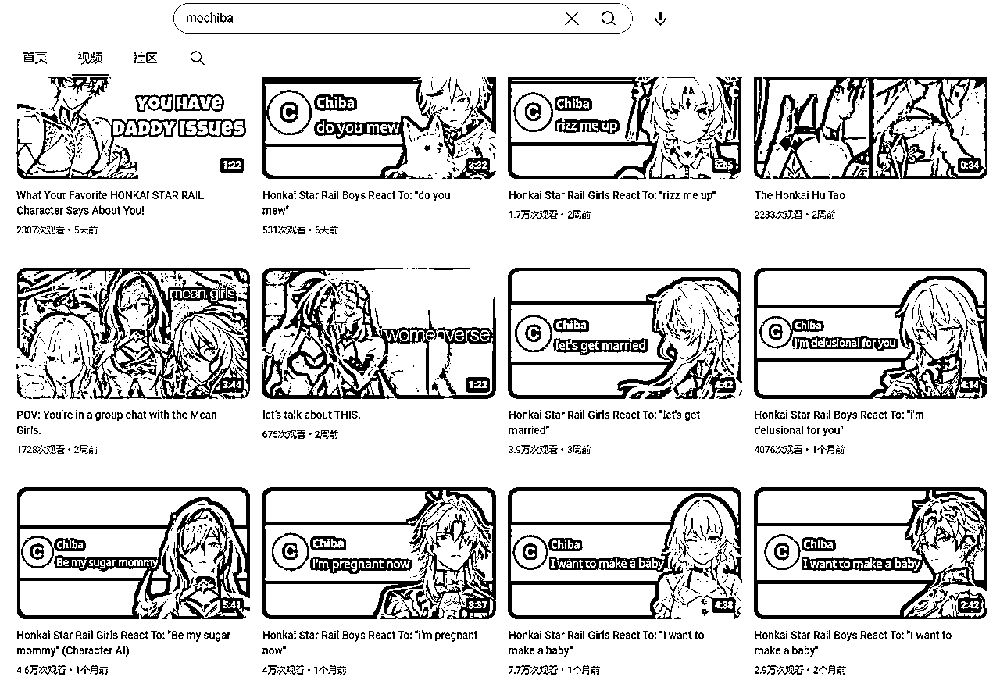

大家可以自己去YouTube搜索Character.ai，会发现很多素人博主，做了很多以角色为主的视频内容，从而吸引用户到平台上面自行体验。

同样的事情在Instagram，TikTok都屡见不鲜。通过社交媒体的运营，打造角色IP，再转化到平台本身，就是一种IP对内容消费的增强！

如果稍微用心一些，会发现国内不少出海的产品也都是这么玩的：）

不过这里面又进一步的有所区分：成名的IP角色和OC（Original Character原创）角色

IP角色作为引流和新客转化，因为认知度高和可消费IP价值大，在YouTube，TikTok等比较容易拿到流量。

但IP角色忠诚度其实并不好，像原神的魈和雷电将军，每个平台都有，哪个模型聊得好，价格低，大家就会迁徙到哪个平台。

于是有了OC角色扶起来做IP，OC角色是做留存，每个人的癖好都是很niche的，光靠IP角色其实很难match大家的癖好，得靠PUGC/UGC的OC角色，

OC角色就是因为原创性，就像小王子那朵玫瑰，倾注时间进去，只要它能解决记忆力问题，就会变得独一无二，形成对平台的忠诚度和粘性！

这一章节，我们从剧情向展开，讲到了这是一种轻交互的内容形态，再扩展到AI游戏品类，并发现两者之间的共性，再拓展到IP对于内容消费的增强，会发现情感陪伴其实就是内容消费。

## One More Thing

除了上面的思考，其实还有一类产品是很明确的提供了即时情绪满足的，最典型的代表是心灵疗愈的产品：林间疗愈室

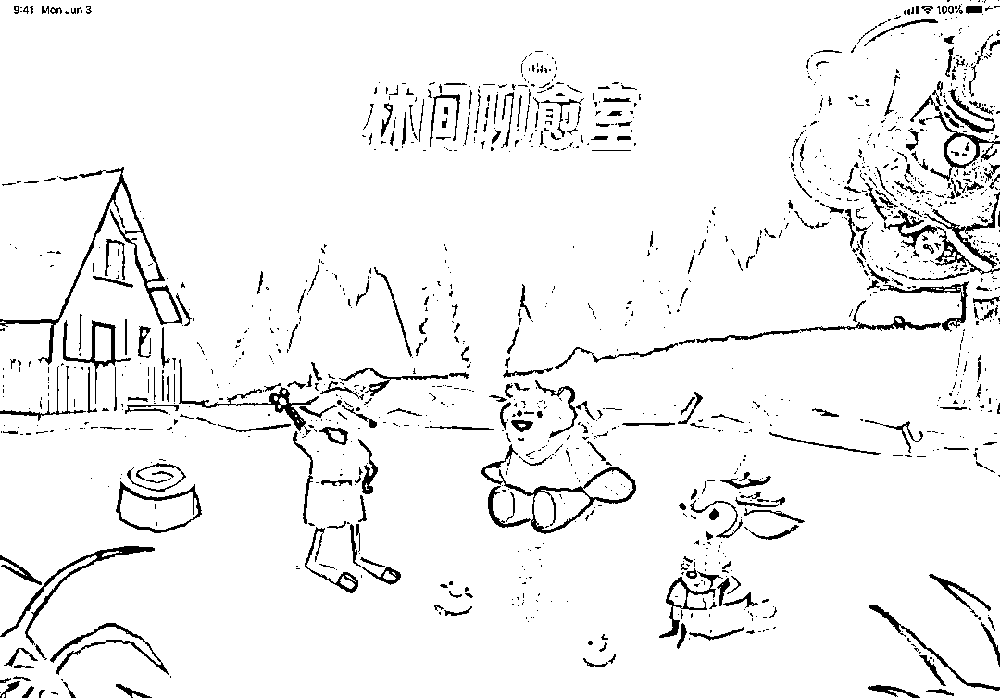

「林间聊愈室」作为一款主要服务 Z 世代的 AI 心理疗愈 APP，创造出小狐狸、小熊、小鹿这三只可爱的 AI 伙伴，用一种有趣的方式，希望像心灵的气泡水一样，给年轻人注入持续的「情绪补给」，不仅关注用户的即时情绪变化，更致力于通过长期的陪伴和轻松的互动，帮助用户表达自我、探索自我并从中获得力量。

这个产品的主体能力就是通过选择一位AI伙伴，快速解决掉自己的情绪问题，获得心理疗愈。

短连接里快速搞定具体问题，长连接中又保有一定的记忆能力。

这种产品是非常典型的带来多巴胺，而非催产素的！

再典型一些的，还有之前写过的心光App：

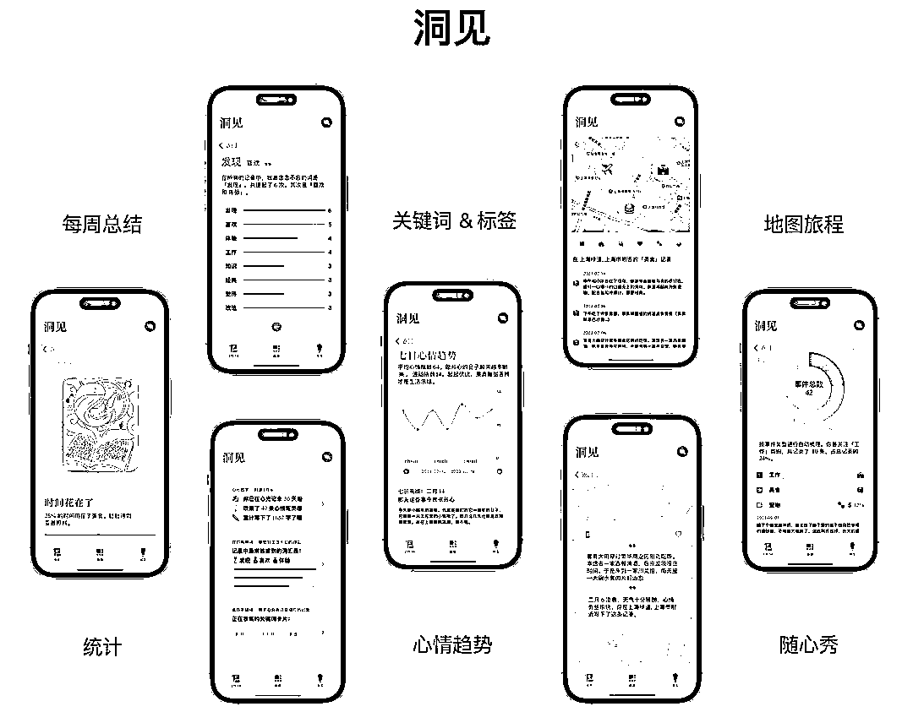

通过记录-AI回应-各种总结统计等，来让用户获得对自己的理解和洞察，它想做的是“AI生活记录伴侣”，记录伴侣就很典型的不会特别走社交了。

# 总结

内容消费和社交活动确实满足了人们不同的需求。内容消费更多地满足了个人的多巴胺需求，而社交活动则满足了催产素需求。

当人们寻求社交互动时，他们可能不仅仅是在寻找多巴胺的快感，而是在寻求更深层次的情感联结和社交支持，这是内容消费所不能提供的。这也解释了为什么AI情感陪伴等产品虽然能够提供一定程度的情感支持，但与真实的人际互动相比，它们在满足催产素需求方面存在局限性。

AI情感陪伴，是伴随着GPT出现的一种新的交互形态，之所以大家都锚定了做ChatBot，也是被ChatGPT，C.ai所影响，并没有进一步的去理解它的内核，从而快速的总结出了LUI这种所谓的新形态。

我们要理解对话形态给用户带来的“诱导”，以及这种形态下用户使用习惯，成本，营收等多方面的短期不可行，面临记忆，逻辑推理等方面的技术难点。

可以发现对话只是LLM具象化的一种产品范式。

发展到现在，已经可以看到有其他的方式可以把LLM的优势发挥出来。背后是经过实践，对话在很多场景下，并不是最有效的产品形态！

这篇文章，来源于一次闭门会，本文需要感谢这些愿意公开的朋友：

Yijia 公众号“嘉儿的移动城堡”

理想汽车 刘金鑫

AI风向标 黄小刀

木水酱 公众号“银河系降落伞”

琳 想做一个AI社交产品

喂猫 努力成为builder和creator的人类研究者

# 参考：

即刻@王半城：「内容消费满足的是多巴胺需求，社交满足的是催产素需求」

https://m.okjike.com/originalPosts/66287b5d36246663245de7f7?s=eyJ1IjoiNWEyYzBiMDQ1MTY1YTMwMDExYjZmMDcyIn0%3D&utm_source=post_card

C.AI类产品的窘境与未来

https://mp.weixin.qq.com/s/abCBOytjRvlVkNJf5KZRXg

纸上谈兵：做满足垂直人群需求的虚拟陪伴产品

https://mp.weixin.qq.com/s/37f6-z2h1DArv8f5LRvbxA

对AI虚拟陪伴的突围思考：用户群，游戏化和IP

https://mp.weixin.qq.com/s/etWJLCDs0S1Yfz3SvFT3Og

Character.ai：这家AI创业团队，找到了让LLM“爆发”的方法

https://mp.weixin.qq.com/s/U_0essTMrEl2srROqxgBWw

万字长文：为什么AI陪伴产品都想抄星野？

https://mp.weixin.qq.com/s/R9-3Drlt1foX3M7Wx-JOYQ

万字长文：AI陪伴产品的终极解法?

https://mp.weixin.qq.com/s/WMOhsA6UW37Ov2h4CfIdKg

万字长文：用AGI视角重新理解筑梦岛

https://mp.weixin.qq.com/s/wsE1CP6kJdwd8FOq2FP33g

揭秘Inflection AI：15.25亿美元融资背后，Pi如何用多层Cake模型重塑Conversation？

https://mp.weixin.qq.com/s/ZV7azzuhbw7nZOF1mTDxQg

AI时代产品新范式：心光App分析

https://mp.weixin.qq.com/s/ghQKIQkGsYSZ5nbp723-lA

上线三周油管播放超千万！这款AI冒险独立游戏玩的就是骗人

https://zhuanlan.zhihu.com/p/681468328

AI 时代的「情绪补给」，来点儿不？

https://mp.weixin.qq.com/s/AgQxxdCJgXebe_UPCVUgCA