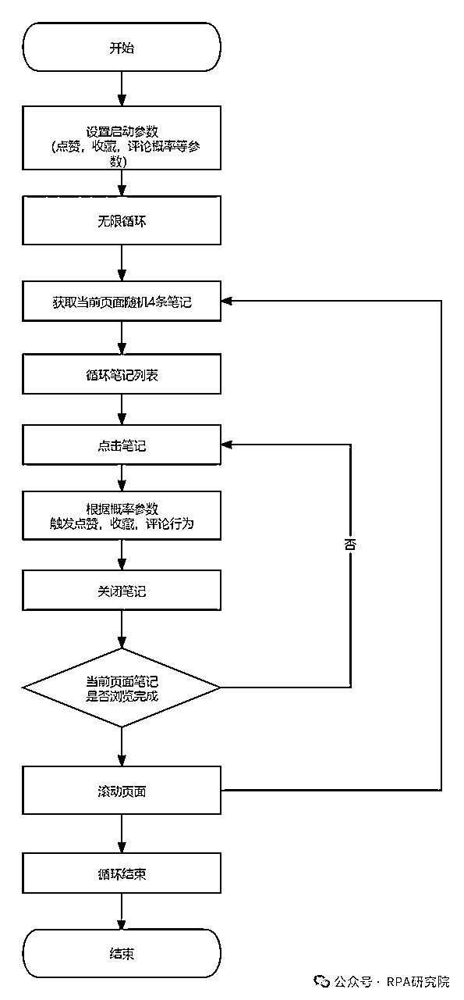
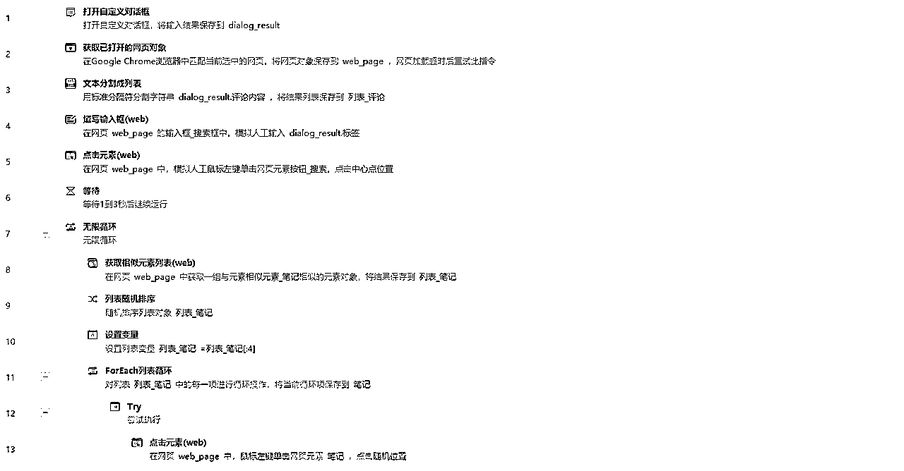
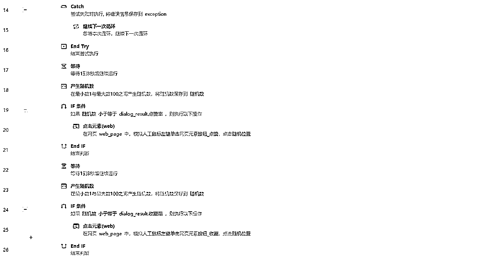
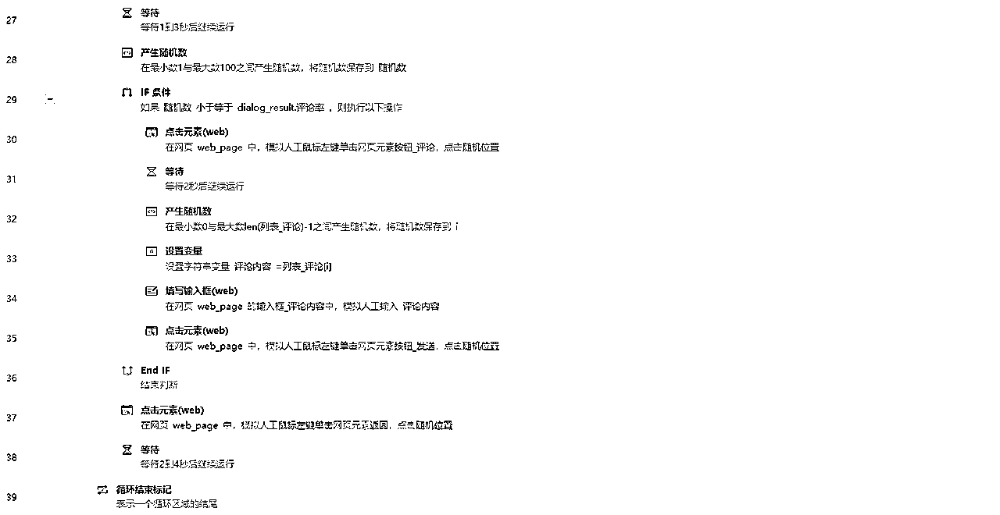
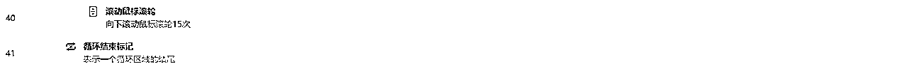

# 小红书-自动养号RPA程序，7天养出高权重账号

> 来源：[https://x0gnb2e1yj.feishu.cn/docx/JydrdQ3YZoFQTExzJXKcnHIOnlh](https://x0gnb2e1yj.feishu.cn/docx/JydrdQ3YZoFQTExzJXKcnHIOnlh)

😁大家好，我是RPA研究院院长-商叁，这次给大家带来一篇关于小红书平台的自动化工具的RPA流程设计。

仅需41条指令，教你搭建一款自动养号RPA程序，让你解放双手，把更多的精力用在有意义的事情上。

# 🚀 程序介绍

小红书-自动养号RPA程序是一款针对小红书平台用户开发的自动化工具。它利用先进的RPA（Robotic Process Automation，机器人流程自动化）技术，帮助用户实现自动化浏览笔记、点赞、评论、收藏等行为，从而有效提升小红书账号的活跃度等多维权重，仅供交流学习使用，请勿用于非法用途。

# 🎟 功能介绍

1.自动浏览笔记：程序能够模拟真实用户行为，自动浏览小红书平台上的各类笔记，包括但不限于美妆、穿搭、旅行、美食等领域，可自定义浏览笔记关键词。

2.智能触发互动：根据用户设置的概率，程序能够智能触发点赞、评论、收藏等互动行为。这些行为均基于预设规则和算法，保证互动的自然性和真实性。

3.个性化设置：用户可以根据自己的需求，灵活设置互动概率、评论内容等参数，实现高度个性化的养号策略。

# 🛠 业务流程图

# 📟 业务代码（影刀 RPA）

🥂RPA研究院院长-商叁，Base：广州

拥有12年经验的互联网老兵，目前在一家年产值8亿的电商公司担任RPA技术负责人。

主要职责包括领导并推动公司在抖音、快手、视频号、拼多多、唯品会等多领域的RPA业务程序开发。

欢迎对RPA技术感兴趣的朋友一起交流