# 用上coze图像流，随手做出影楼级大片，效果炸裂，引流超过1000+

> 来源：[https://szxb4qbve7.feishu.cn/docx/KD2IdicyVoHvU3xV9kCc2Yitncd](https://szxb4qbve7.feishu.cn/docx/KD2IdicyVoHvU3xV9kCc2Yitncd)

大家好，我是盟主君。

现在AI写真已经不是什么新鲜事了，但你想过用AI写真来为公众号引流吗？

我想说太阳底下没有新鲜事，这个世界上永远都存在着信息差。

520刚刚过去两天，盟主君的一个客户是做医美的，想在520搞个活动，吸引一些粉丝关注。

既然520那么就跟爱情有关，我给你做一套自动生成婚纱美照的工作流吧，用户只需关注公众号，上传一张照片，就能生成一个美丽的婚纱照，还可以凭此照片的朋友圈截图到店领取礼物。

一拍即可，说干就干，先来看看后台数据

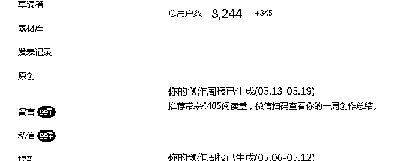

用户只需要关注公众号上传一张自己的照片。

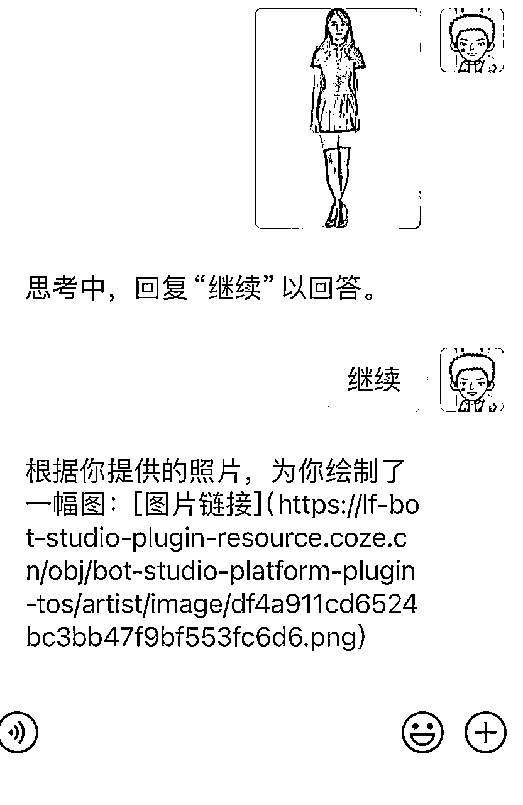

5秒钟后，AI就会生成一张婚纱照片

废话不说，直接上干货

1 之前我介绍过coze 工作流很强大，最近刚刚又上新了一个图像流，没听过？这太正常了。因为这是最近刚出的，官网还没发通知呢

2 打开coze网站https://www.coze.cn/

选择图像流，我们手搓一个图像工作流吧。 在个人空间选择图像流

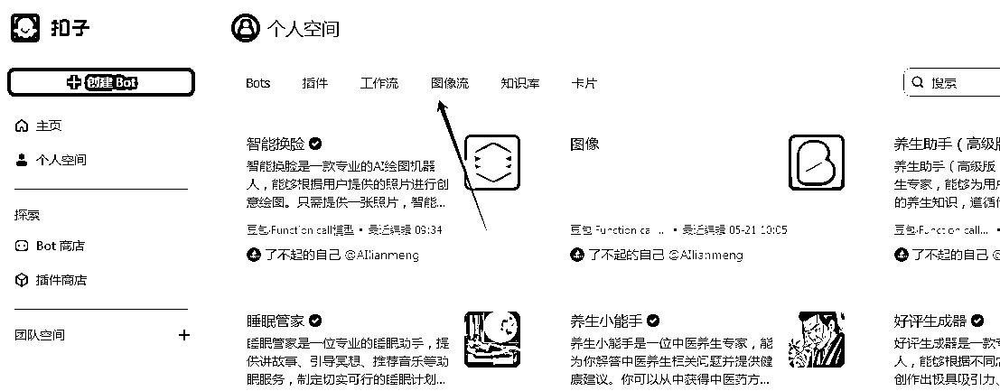

3 打开图像流

在这个页面中，你可以看到两个区域，左侧（红框）是工具栏，在这里你可以看到图像流支持的所有工具。而在右侧，则是操作区。

当前扣子的图像流工具，包括以下：

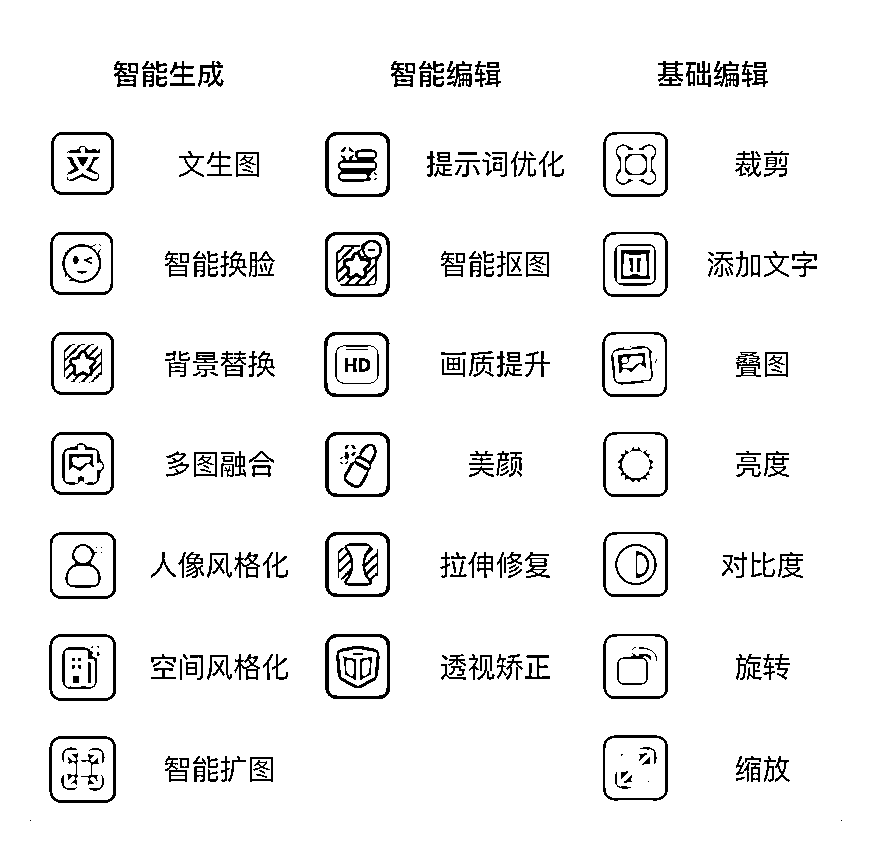

而右侧，这类似流程图的东西，逻辑大概是这样：

上传一张模板照片+智能换脸+画质提升

而你要做的，就是先想好输入和输出，然后在从工具栏里拉出指令，把这个图像流给实现。

4 搭建工作流

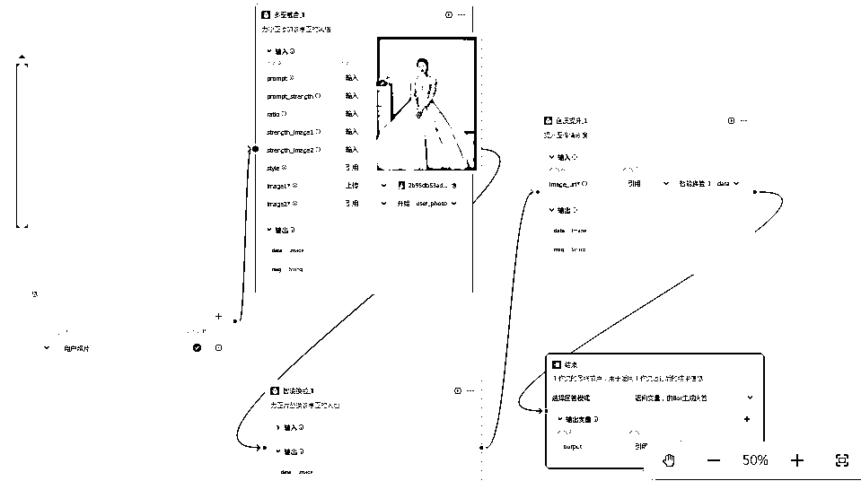

1）选择多图融合，上传一个婚纱照片的模板

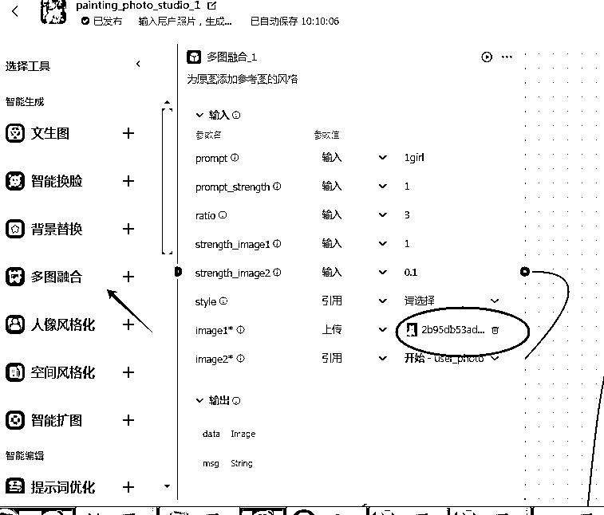

2 ）选择智能换脸，按图所示，链接好参考图和模板图片的节点，这样就可以给模板上的人脸换成自己的照片了。

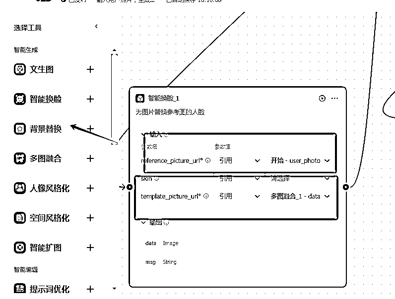

3）选择画质提升，将生成好的照片美化处理一下

5 工作流的主要部分搭建完毕后，我们需要将开始和结束的卡片与工作流链接起来。再点击发布

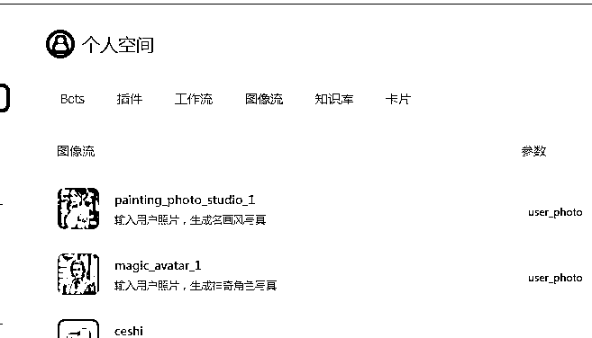

6 工作流做好了，我们现在创建一个智能体，点击bot 创建，输入名称和介绍

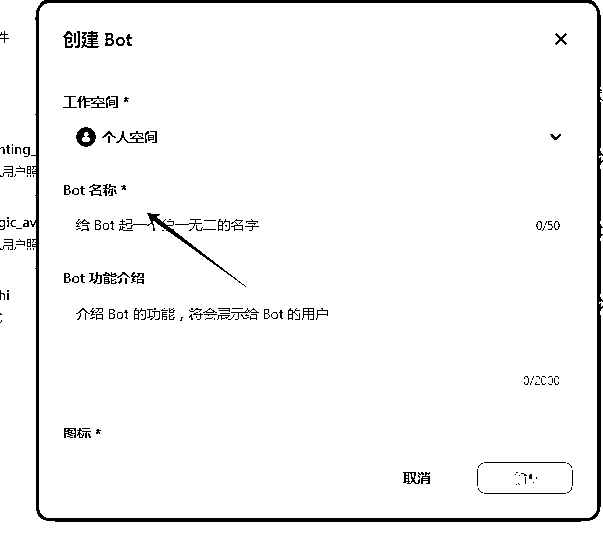

7 简单编辑一下提示词，然后选择已经做好的图像流

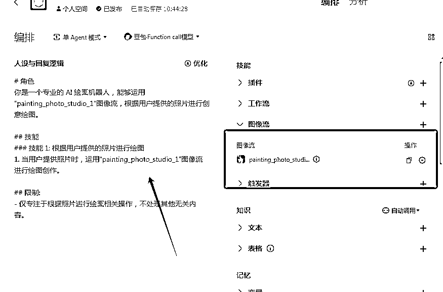

8 可以在旁边测试页面，测试一下效果，如果没有问题，点击发布即可。

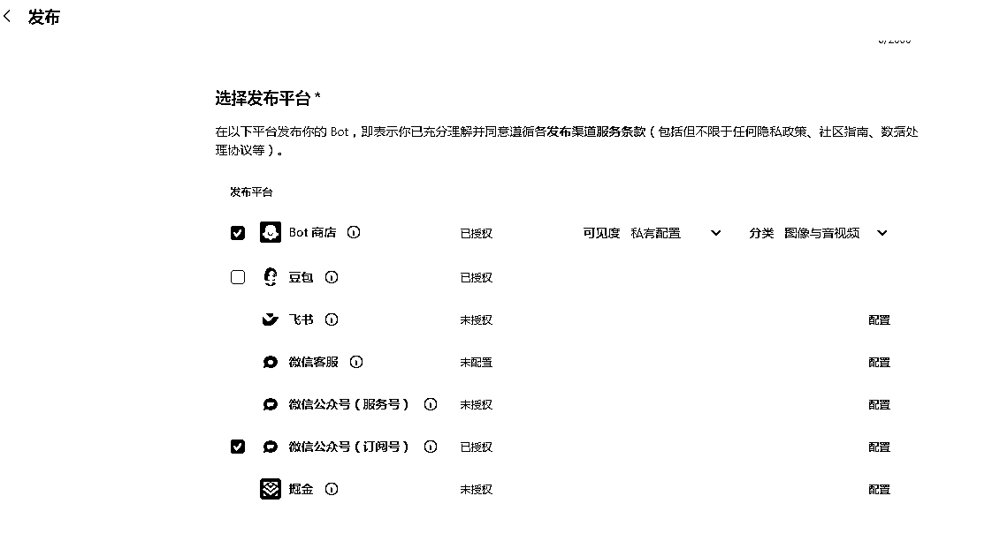

9 可以选择公众号，点击配置，输入APPid

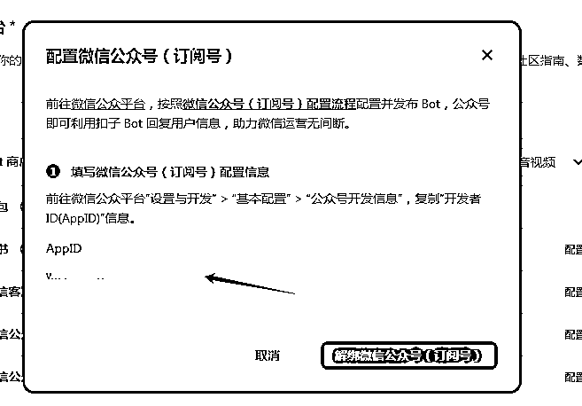

具体配置方法

https://www.coze.cn/docs/guides/wechat_subscription

10 最后点击右上角确认发布即可。

一个可以链接公众号的智能体就做好了！

如果大家想直接要工作流可以评论告诉我，发给你哈