# 小红书如何精细化运作？

> 来源：[https://hadad3oapn3.feishu.cn/docx/PpOHdPCzKoIQdoxQYIlc3bnvnMf](https://hadad3oapn3.feishu.cn/docx/PpOHdPCzKoIQdoxQYIlc3bnvnMf)

哈喽，大家好，我是李校长，校长会创始人，小红书头部MCN机构，高客单项目顶级操盘手，最近好多人都来问我如何才能做好小红书的内容搭建，今天给大家出了一篇关于小红书内容精细化运作的纯干货文章。

原因是这样的啊，前几天跟一个做医美行业的老板聊天，她的账号流量爆掉了，数据非常非常好，但是没有变现。我看了她的账号，她的笔记只做了科普的帖子，非常可惜。类似于像这种科普帖子有几篇大爆帖子的话，她就应该抓紧出人设笔记和强转化的笔记，但是就是因为她不懂笔记类型，我简单测算过，她每个月少赚大概百来万的利润，但是我只能默默的测算帮她做调整，怕她知道因为就这个点没理解，知道自己损失了那么多，更难受！！！

那么我今天给大家列举一些，什么是强转化文章以及写强转化文章的方法。

# 工欲善其事必先利其器

99%的人做小红书只需要4个软件

视频可以用剪映专业版

作图可以用稿定设计、美图秀秀

文案：文心一言

大家这里一定注意几个点：目前市面上的Chat gpt以及文心一言，写的文章一般来讲，正确的废话比较多，即便你特别会调教，也会有这样的弊端，所以写文案不能完全依赖Chat gpt和文心一言。

如果说你的行业以前在知乎上比较火的话，那么你一定记住，你的行业的好文章一定在知乎上。

稿定设计里面有大量的小红书模板

文心一言也可以产出大量高质量的文案：

# 账号精细化运作——账号内容搭建

## 新人博主如何设计账号主页？

主页账号作为账号的“门面担当”，不仅要清晰、美观、有辨识度，还要体现账号的人设、特色、加深用户的印象。

头像上要符合主页的整体风格，或者体现出我们的职业、身份、角色，比如：账号的定位，品牌logo、个人形象等。总结就是要美观、有辨识度！！

名字上，要简单好记，方便用户的搜索，名字要有辨识度，让人印象深刻，除此之外，可以体现自己的职能，让不认识你的人一下子就知道你是干什么的。切忌名字不知所云，一定要给用户一个关注你的价值。

咱们这里一定记住一个点:如果你做的是本地同城项目,比如你在武汉做月子会所,那么你的起名一定是武汉某某月子会所,这样就可以非常有效的圈本地同城用户,不至于流量分散到全国各地。

简介上，要体现我有什么不同，我是谁，我能给大家带来什么样的价值，与用户的需求相结合

简介里一定记得不能放任何的联系方式,如果放了会立马违规的,当然邮箱可以放,不过我们测下来,放邮箱其实没什么用。

背景上，可以补充简介的价值，体现出你的专业度，这里需要注意的是，背景图不要引流，背景图的尺寸：5:4，背景图最好与要求尺寸一致，如果尺寸不同会被系统自动裁剪，可能会丢失重要内容。而且背景图上茶后颜色会变深，所以背景图最好选择较为明亮的颜色。

下面给大家举个例子：

反面案例：

正面案例：

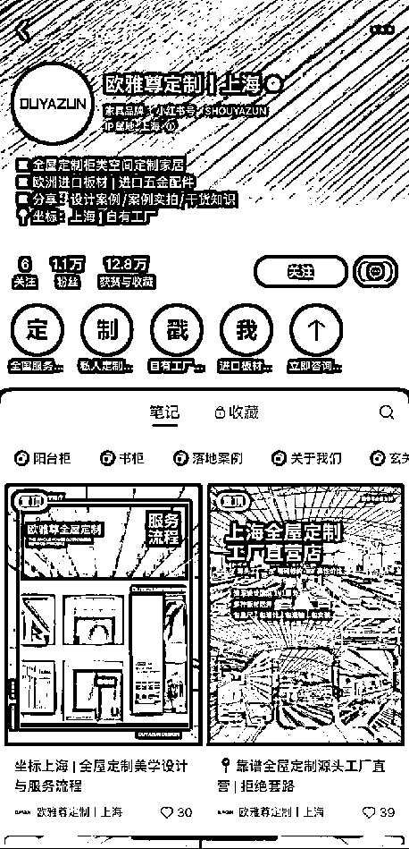

很明显，图一的四件套就设计的很拉胯，图二的主页模式更吸引人，给人的感受更加的专业，

那么账号搭建好了，如何去找对标呢？

## 对标账号要满足三大要素：

1.人群相似

比如做轻医美的人群和需要美妆的人群是同一个人群,可以跨行去找对标

2.话题相似

比如二手奢包和二手手表的话题就可以借鉴,属于话题相似

3.变现相似

比如川藏旅游民宿和川藏线租车就符合变现相似,也可以相互借鉴

对标找好之后我们就要开始内容制作了

## 内容制作的四大要素：

1.痛点卖点：用绝对的差异化/优势化卖点去戳中客户最痛的痛点

①本行客户的痛点：成交过程中客户最关心的点

②自身产品的卖点：直击客户的痛点，客户选择的理由

③营销的核心在于解决供需关系，供就是你的产品，需就是客户的需求

④做内容的核心在于将供和需无限放大

如果我这样讲,大家还不明白的话,那就通过销售和客户的聊天,可以提取到这些内容,比如说用户加了微信,问的第一个问题,就是用户的痛点,可以分析出来比例的,比如用户上来问价格的占了6成,问位置的占了2成,其他占了2成,那么我们出内容的时候就会知道,我们大部分的内容要围绕价格去做笔记。

拿我的头部驾校举个例子：

驾校的痛点很明显，价格、学车位置、拿证时间、如何避坑等等，都是用户关心的问题，那我们的卖点又是什么呢？

①收费透明，可以考一科付一科，服务不好可以拒付尾款

②整理全上海学车的地方，并且向客户说明我们都可以安排

③最快拿证时间，周末党拿证时间，学生党拿证时间

④针对于如何避坑，我们准备了50页的PDF文件《上海避坑指南》

这里的《上海避坑指南》就是一篇非常好的钩子了,大家一定记住,免费且有价值的东西才是真正的好钩子,如果大家都有,你送的东西和你的同行是一样的,那其实用户为了钩子去链接你的可能性会大大降低

价格：

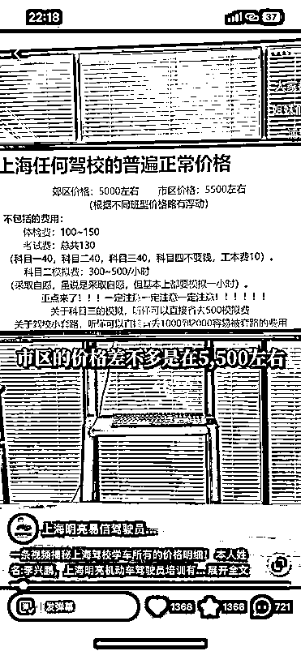

基地：

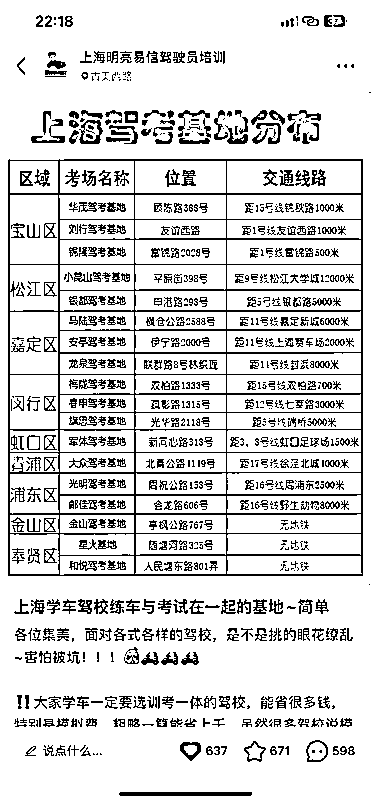

时间：

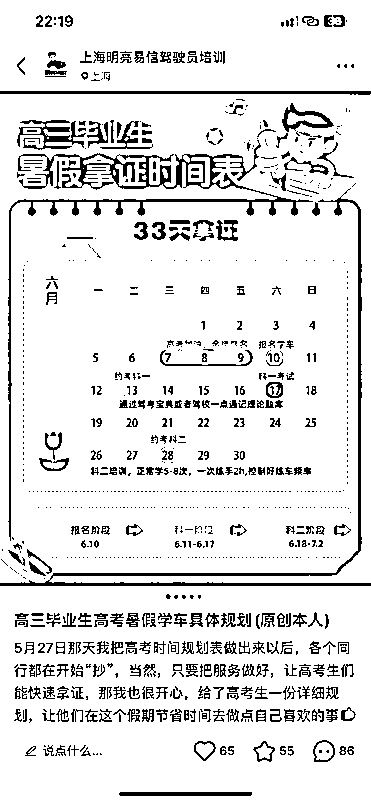

避坑：

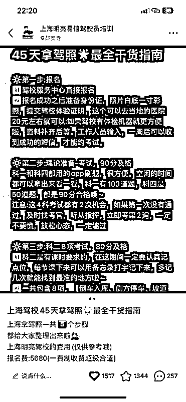

⑤谁是最清楚客户痛点的人？

毋庸置疑是销售。

⑥如何简单粗暴的找准痛点和卖点？

1.让销售把客户的问题进行一个数据统计，问的最多的几个问题就是客户的痛点

2.将痛点一条条拆解，结合自身情况整理出差异化/优势化的卖点（可以适当偏离事实）

还是接上面我说的点,用户问你的微信第一个问题就是痛点,那么也可以结合线下的沟通等等,凡是和用户的沟通,都可以梳理出来你这个行业的痛点痒点,每个行业用户关心的问题其实不多,也就是那么三五个问题而已

爆款文章

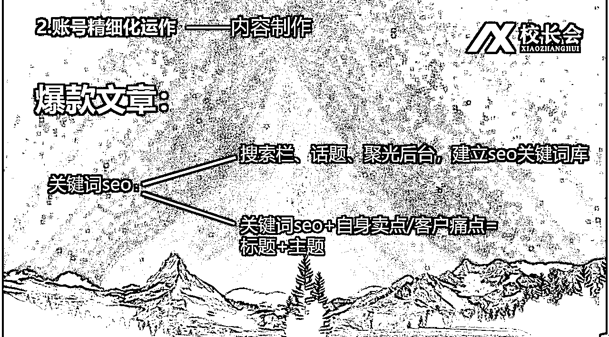

关键词seo：

1.搜索栏、话题、聚光后台、建立seo关键词库

2.关键词seo+自身卖点/客户痛点=标题+主题

搜索栏：

一级关键词（泛流量）

二级关键词（略精准）

三级关键词（转化核心）

话题：

聚光后台

在这里给大家科普一下一级关键词（泛流量）、二级关键词（略精准）、三级关键词（转化核心）

我给大家放几张图大家就明白了

一级关键词“留学”

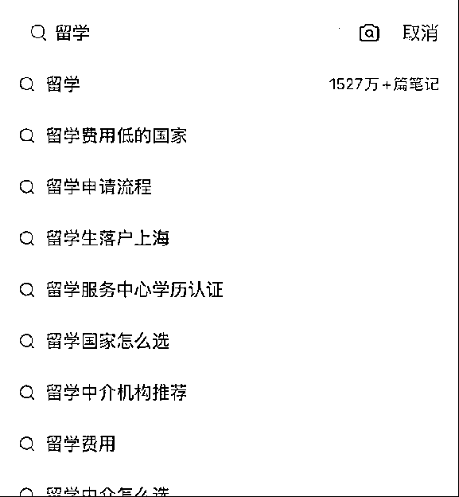

二级关键词“留学美国”

三级关键词“留学美国需要多少钱”

那么一级词二级词三级词的区别到底是什么呢?我们通常把一级词叫做泛词,二级词叫做精准词,三级词叫做成交词,也就是说用户搜索到时候,搜索的越具体,其实离成交越近,大家一定要重点关注二级词三级词,尤其三级词,而且三级词一般包含了一级词二级词,看似三级词搜索的人比一级词少很多,但是三级词的成交率非常非常高

2.爆款文章

## 怎么去做爆款文章呢？

你想做爆款文章你就要去找爆款文章，去找同行的爆款文章，然后去分析他的文章为什么会爆，一步一步去拆解文章：拆解封面、拆解标题、拆解内容、拆解文案、钩子（引导转化）

①拆解封面

封面的风格：是什么类型的风格？拼图类?大字报?颜值类?还是对比图?

封面排版：有字吗?多少字?怎么排版的?字体颜色?

思考:看封面的第一眼是如何吸引到你的?

②拆标题：

标题技巧:蹭热点?干货型?激发情绪?

选择的关键词:人群?功能?场景?热词?

③拆图片：

表现形式：备忘录形式？思维导图？实景图？模版美化？

④拆文案：

开头:揭秘型?劝告型?痛点型?共鸣型?

文案结构:清单体?痛点+解决方案?还是故事+感悟?

在这个时候你就要去思考，这个文章内容有金句点缀吗?

有插入人设吗?有情感共鸣吗?有引导互动吗?

⑤拆钩子：

你要找到在文章哪个位置下钩子的，下的是什么类型的钩子，图片、文案还是在评论区

同行的文章又是针对哪个痛点下的钩子，你觉得这个钩子是否勾住了人？

这些都要思考，每一层都分析清楚了，很容易复制出爆款文章。

3.羊群效应

## 羊群效应的核心

想要打造一款爆款文章，一定要做羊群效应，即人工干涉笔记

相当于你可以自己制造爆款笔记

羊群效应的核心就是CES机制

点赞1分，收藏1分，评论4分，关注8分

当然这里我就不方便公开这一套玩法,我身边很多专业玩家,都说这样一句话,不能做人工干预的平台我不玩,我认为非常高级,一旦可以有人工干预,那么我们的效率以及确定性是不一样的

4.置顶文章

## 封面定生死！

虽然封面只占流程的10%，但是却决定了90%的流量

固定封面都有几种形式呢？

1.生活感分享型：买家秀-koc同频

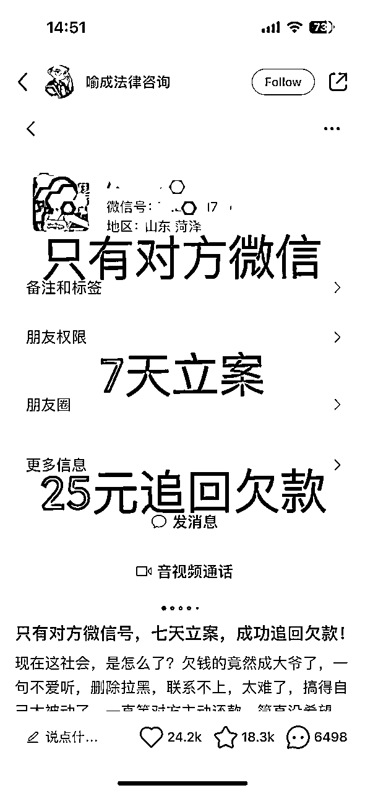

2.视觉冲击美好型：视觉享受

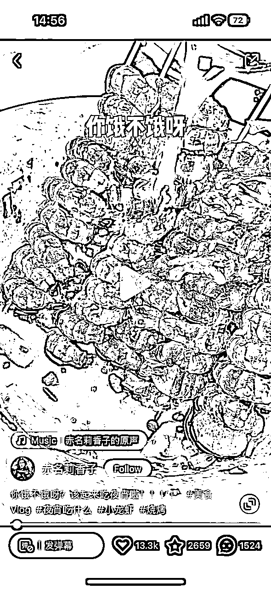

3.提供价值信息型：学习知识

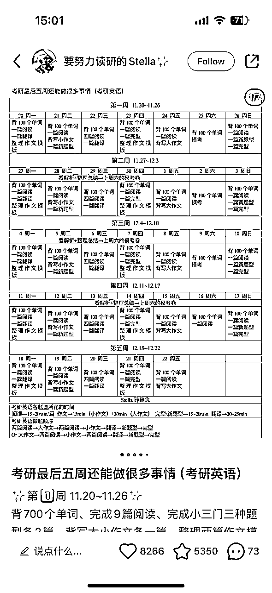

## 常用的5种爆款封面

1.图文并茂法：

搭配上与主题匹配的背景图，让标题照片相互呼应，让人眼前一亮这种方法更突出“选题”更多是用于营销号，以及教程类软文类笔记

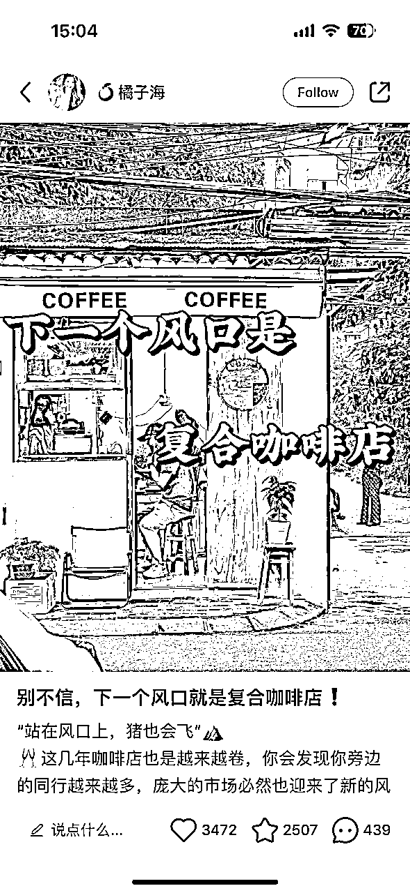

2.单张大图法

更适用与一些高客单，符合“美好生活”的相关赛道，如：花艺、旅游、民宿、家具

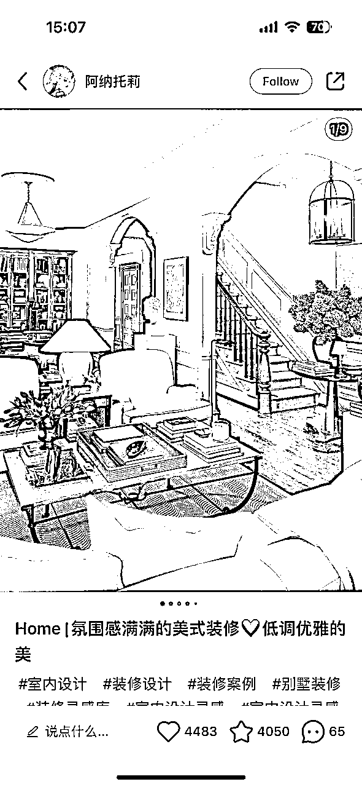

3.多图合集法

将多张相关火互补的图片拼接在一起，形成一个更饱满的画面在有限的封面图里展示更多元素及信息，并且将素材重复打乱的情况下也能用于矩阵素材

适用于：产品种草、摄影、家具等行业

4.对比冲击法

使用前后对比的反差越大就更吸引眼球，故点击率就越高，以结果为导向起到了加强信息的传递效果

适用行业：美妆、减脂服装、好物种草

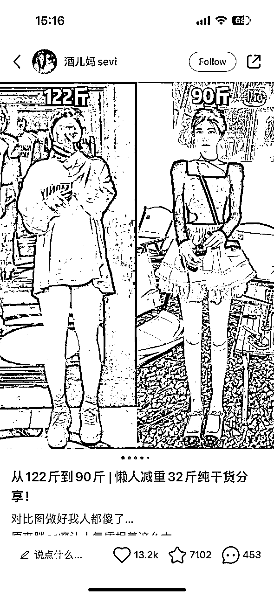

5.纯文字、大字报法

这种比较适用于干货类及互动类的起号选题，大多数行业都可以用，简单粗暴好上手～

文字可以直接吸引用户注意力，激发用户的点击欲望

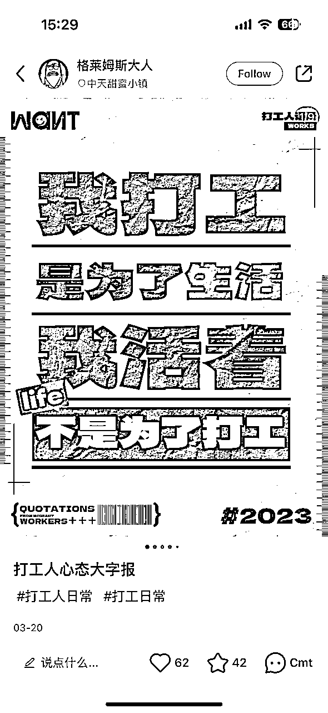

其实我做小红书这么久了，我一直有个观点，就是不要追求完美，要粗糙的先开始，在做的过程当中去解决问题，当然大家有什么问题也可以直接链接我，评论区我会及时回复！

下期给大家讲讲如何快速产出优质文案。