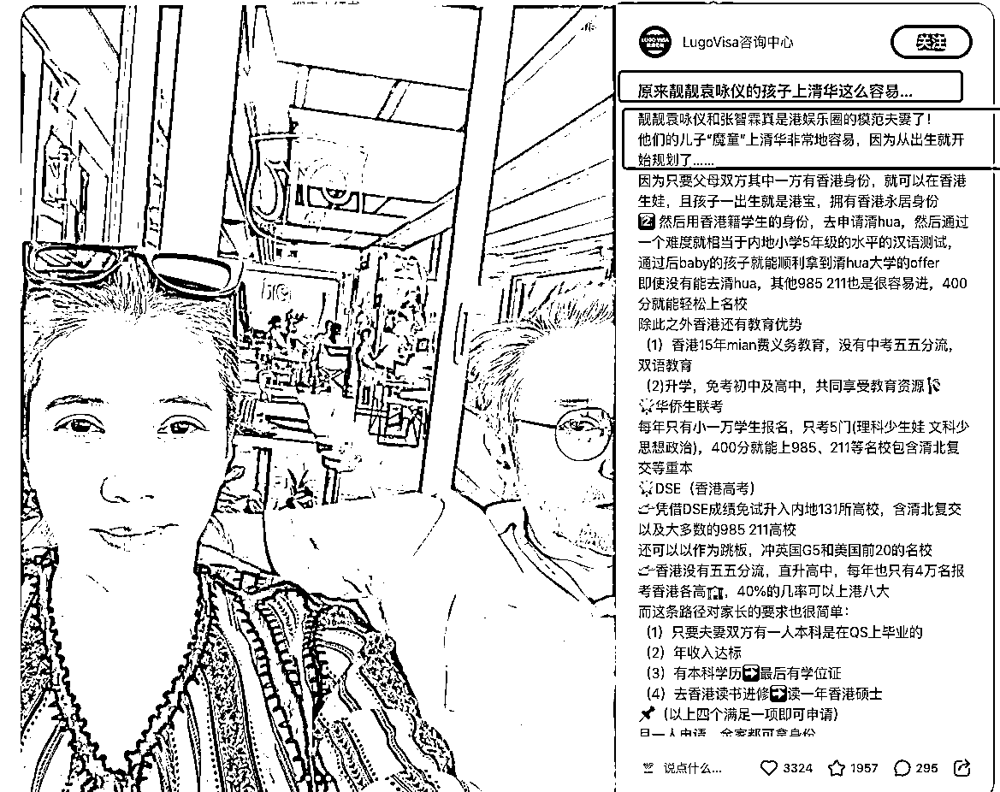
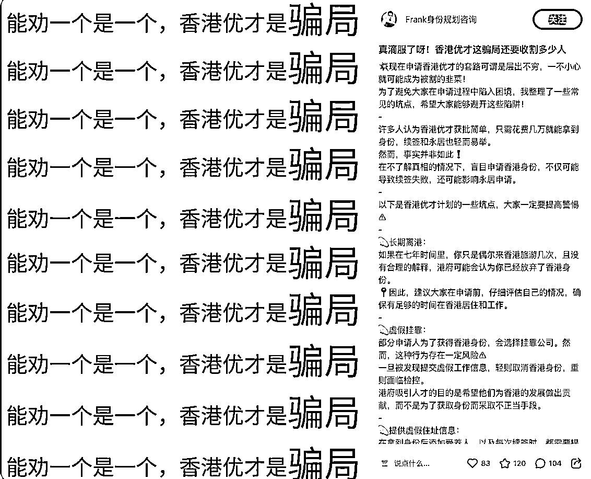

# 小红书高客单项目-香港身份项目打法及行业拆解

> 来源：[https://sjs3mbt2d0.feishu.cn/docx/KbDHdQ2XRoJEEexYgbUcFDp4nAf](https://sjs3mbt2d0.feishu.cn/docx/KbDHdQ2XRoJEEexYgbUcFDp4nAf)

项目拆解类型说明：

项目拆解为私域+高客单的项目，拆解的内容以及打法不包括IP类、直播间及ad信息流广告的打法，IP和直播间成功因素不易复制。

主要以可复制内容（图文+短视频）方式去做的内容

分析的打法主要为小红书平台

红海项目的打法很多时候用在蓝海平台会产生意想不到的效果

# 一、用户需求及痛点

## 1、需求&痛点

需求：

可以通过优才计划以及后续的7年续签，可以成为香港永居身份，并可办理香港护照

持有香港护照可以更方便地前往其他国家和地区，可以免签入境多个国家

为孩子提供高质量的教育资源以及可以通过华侨生联考较低分的方式考入内地名校

痛点：

竞争激烈，众多优秀人才竞争，名额有限申请难度大

申请流程复杂，所需材料繁多，政策细节时有变动

证明材料要求详尽，收集和翻译文件可能较为繁琐

申请香港优才后，后续的续签条件和政策稳定条件是个难点

## 2、用户分析

香港优才计划引进的人才比较倾向于 研究型、学术型、高管型、国际型、技术型的人才或者是名校、名企、专利的人才，这部分就是做香港优才计划的目标人群。

希望孩子能够在香港读书的家庭

希望能避开国内竞争高的高考，通过香港华侨生联考的方式考入内地的名校

希望孩子能够更容易考取国外名牌大学的家庭

# 二、业务的前后端

## 1、前端

前端通过介绍香港身份带来的好处，包括教育、工资、社会福利、免签国家等方式吸引目标人群，并通过领取资料和申请表格及申请SOP等资料 的方式导流到微信端。

## 2、后端服务

提供香港身份申请（优才、高才、专才等）咨询服务，其中包括全流程咨询服务以及只提供部分环节（例如文书的撰写服务）

## 3、后端交付方式

提供申请香港身份（优才、高才、专才）成功

提供申请香港身份（优才、高才、专才）成功以及后续7年的续签服务直到拿到香港的永居身份

只提供申请香港身份过程中需要的文书环节，只提供文书的撰写服务

# 三、前端流量获取方式

## 1、资料整理法导流打法

伪装成素人，然后以素人的角度分享自己申请的过程，申请的资料，以发送资料的方式，导流到微信端。

账号的作品里面全都是类似的香港身份相关的帖子

## 2、使用明星的话题和封面的打法

使用明星作为主图以及标题来制造类似于“瓜”的内容，然后再转成香港身份相关的内容。

大部分人看到明星相关的“瓜”都很感兴趣，带来流量，但是流量里面精准流量占比相对就可能比较少，只能去铺搜索的排名来获取搜索流量。

## 3、素人内容

素人发布相关的申请香港身份过程的内容，然后置顶评论不用看评论区分享的机构（防止同行截流）。再@出承接流量的账号，该账号同步在评论区回复用户，完成流程的导向。

进一步优化的话，就是@的时候不是@的问题，而是@的账号，这里面有点问题了。

另外承接流量的账号太隐蔽，可以把承接流量的账号发布一条评论感谢之类的评论，然后素人账号评论其中过程中的优势点，这样突出承接流量的账号，当前这种方式有些过于隐蔽。

## 5、同行群聊里面截流

加入同行的群聊中，如果同行的群聊里面有人加入后立马私信加入的人，然后以发资料为名，获得用户的微信导入到微信中成交。

PS：该种方式受制于单个账号私信的数量，需要用多个账号来进行私信才行。另外私信截流的方式主要是靠大力出奇迹，效果并不一定会很好。

## 6、对比法（高低工资的对比）

对比没有香港身份前以及有了香港身份后的状况，同时加上高工资5w+去吸引人

评论区再安排小号进行资料以及SOP的领取，把内容导向到获取香港优才的相关内容上

## 7、劝退类打法

通过负面的骗局、坑、劝退等反向的标题/封面来吸引流量，然后在内容端再做软科普类的普及

再通过分享优才资料、文书模板和流程类的导入到微信端

## 8、科普知识类

清晰列出表格对比香港各个身份的条件及要求等科普类的内容，以专业性的角度来展示其顾问的能力。

# 四、内容分析

## 1、内容制作

内容的制作以素人的的偏多，也有一些移民机构和顾问身份制作相关科普类的内容

具体内容的类型见前面一章流量获取方式，里面也包含了内容制作的类型

## 2、内容制作总结

内容的制作需要一定的专业性，需要对于香港身份相关的政策有一定的了解

图片类的相对容易制作，但是文字及文案需要对香港身份的一些政策和规则的了解

专业性要求强，要求对于香港身份、香港永居身份的政策以及申请 条件等内容的了解

## 3、账号定位

素人类：自己diy上岸香港身份，通过领资料导私域

移民顾问

身份咨询顾问/身份规划师

# 五、打法分析

## 1、内容的打法

很多伪装成素人的账号去做内容，以发送资料的名义加到私域里面做成交，其实作品全都是香港身份有关的内容，看主页会让用户觉得广告有点硬。

打法很专业，各种专业的打法，内容打法都眼花缭乱的，市场竞争激烈

以明星作为标题和封面的打法，带来的流量非常大，搜索关键词的热度排名，排前面的都是明星话题封面打法的内容。

打法很专业，伪装成素人的身份，从深圳换工作到香港的人设，然后分享到香港后的一系列的工工资生活状况等。虽然铺设得很好的内容，但是内容综合起来看就很偏硬广，除了优才相关的内容外，生活类的内容偏少。

## 2、赚退款差额的商业模式的打法

一些中介公司在前端进行客户咨询的时候，夸大其词并且掩盖后续续签的苛刻条件，忽悠了很多用户来申请香港优才计划，如果申请成功那更好赚得更多。如果申请不成功，退回80%左右的金额，因为客单价是几万块钱，20%的退款差额也是一笔不菲的金额。该商业模式就是通过这20%左右的退款差额来盈利。如果前端通过夸大其词的模式来获取到很多的用户，即使不成功，有这些用户基数在，一年也是很高的收入。

PS：行业需要共同营造好的环境，不建议采取这种方式，但作为对行业的拆解也需要其他人这种商业模式 的了解。

# 六、行业流量说明

整体的流量都挺大，内容也没有要求认证后才可以发布相关内容，内容也没有受到平台打压等情况。

整体用户的需求也很大，根据香港政府公布的数据香港优才23年申请有8万人，香港高才申请的人数为6万多人。

# 七、行业分析

## 1、行业简析

## 2、行业风险

政策类的服务，可能会因为香港身份政策的变动导致带来的条件苛刻或者是服务取消（例如华侨生联考）等，导致业务比较难做下去。

另外就是香港优才后续的续签7年要求的条件苛刻，导致最终获得香港永居身份非常的难，就会导致前面申请香港优才身份的人数降低。

因为各种原因政策等，当前新加坡可能会比香港还更吸引富人群体，香港身份可能人数下降，导致申请人数降低

## 3、行业利润

行业利润很可观，客单价足够高，给出来的佣金都是很高的。

## 4、合作模式

与后端进行合作的时候确定合作模式以及佣金支付的模式

合作模式有两种：

如果自己负责只做流量，那么对方做销售以及交付。

如果自己负责做流量和销售，对方做交付。

不同的合作模式，涉及到佣金的方式，因为该赛道属于交付周期长，交付成功率低（也可以看作核销率低）。因此佣金模式有：

按照询单计算佣金+销售成交再按比例给成交金额的佣金，也就是有两份佣金

按照销售成交给佣金，那么交付周期以及成交周期长，可能导致佣金需要较长时间才能收到

需要确定的是因为交付失败的情况，佣金是否给自己给的佣金比例是多少，这个需要在与后端合作的时候需要确定的

## 5、博主举例

数据很好的素人博主，发的内容都很容易爆，内容都是给整理资料包的方式要求评论区留言的。

可优化点：主页可以搭建相应的内容做导向型的引导以及相关经历做信任的提升

