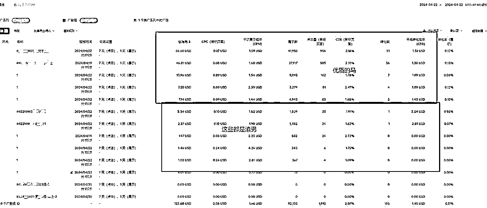

# TIKTOK ADS投流，4天赚了1.5W，我是怎么做到的？

> 来源：[https://u0b7kwavgo7.feishu.cn/docx/M53jds3eYo2D3hxY4juc7OhEnFb](https://u0b7kwavgo7.feishu.cn/docx/M53jds3eYo2D3hxY4juc7OhEnFb)

我将本次分享的全部内容整理成了思维导图的形式，根据思维导图，结合着”7A内裤“案例给大家做拆解分享。

注意！！本篇文章不是针对新手小白而写的，是针对有运营过TK，或者是已经在做投流的投手写的。所以一些非常基础的步骤我会简单略过，只对项目核心内容做交付分享。

# 一、跟爆品打法的三个核心

## 1.产品有足够利润空间用于广告投放

我们在进行广告投放的过程中，必须留足一部分的利润用于广告投放，这样才能保证我们实际在做广告投流去调整我们的广告策略。一般东南亚建议是留足1.5-3美金左右的平本CPA，平本CPA也就是我们的盈亏平本比，顾名思义是我投一款产品，一分钱不赚一分钱不亏的一个点。

## 2.在TIKTOK上面能找到非常多的优质素材

跟爆品第二个核心是一定要能够找到足够多的广告素材，这些素材必须是优质的带货素材。

何为优质的带货素材，一般来说，当地真人出镜+口播讲解，这类素材是比较优质的，如果大家不知道如何筛选，也可以直接参考数据分析平台给出的数据，用来判断视频是否是优质的带货类型素材。

这点的目的是为了后面我们将素材做成矩阵进行消耗，这里给大家讲解一下我说的素材矩阵是什么意思。

素材矩阵：顾名思义就是我通过足够多的优质素材，每日对这些素材进行广告投放，使得尽可能保证我的ROI的情况下疯狂扩量。

举个例子：今天我发现了一款爆品，我能找出5个素材，这些素材我测试发现基本上当日消耗50美金的时候，整体的ROI是比较稳的，如果消耗过多就会导致素材疲劳，使得我的广告组跑飞，那么我单日对这款产品的消耗就是50*5=250美金。

那么假设我又找到了5个优质的素材，日消耗也是在50美金，此时我就有10个素材做矩阵消耗，我单日单品的消耗就能够到50*10=500美金，而且此时我的ROI还是比较稳。

只有通过素材矩阵的方式去堆积我们优质素材的量，才能尽可能的延长我们的产品生命周期。

## 3.具备一定的销量

这个非常好理解，产品具备一定的销量，说明它在当地是有一定的市场的。而且我建议前期投放新手建议选择做铺货去跟，成功概率会更高。

# 二、SOP拆解

## 1.在超店有数中选择满足条件的爆品

因为我的店铺是做女装，我平时用的比较多的是超店有数。我就直接在超店上演示给大家怎么去做选品。

我们找到女装大类，找到对应的内衣类目，然后点击搜索。

我们会看到琳琅满目的商品，那怎么去判定对应的产品是否可以跟呢？这里就要用到我们之前提到的三个核心。

首先我们的目标是女士内裤，内裤这个品类比较特殊，大家购买自己合适的内裤通常不会只买一条，大部分都会买3-4条，所以这里我们可以使用组合SKU的方法去提高我们产品的客单价。比如通过5PCS，6PCS去售卖。

最后我经过漫长的寻找，比对1688的价格，最后确定到这款产品适合跟。

这款产品我们的进货价格在16.3，重量为173g，超店上同行卖的价格是1美金左右，那么6件装的话就是6*7.2汇率=43.2人民币，再放入我们的平本CPA计算表格可以得到我们这款产品的平本CPA为2.65。

## 2\. 找到产品链接，用店小秘ERP上架

在店小秘我们进行产品修改主图，因为采集过来的信息是同行的，所以我们要对图片详情页去重处理。

具体操作方法有这几种：

### （1）更换主图位置

### （2）更换产品标题（我们可以选择用Chatgpt生成）

这里给大家推荐我自己经常用的chatgpt第三方插件，链接放在这里了

POE-AI 语言模型集合（无限制使用chatgpt3.0需要科学上网）：https://poe.com/chatgpt

请Chatgpt帮助我们生成一个不一样的标题，这样就能够实现了。

### （3）加上自家店铺LOGO

这样我们就做好去重了，可以上架到自己的店铺中去了。

PS：这里注意，关于产品上架可能大家有很多方法可以实现，请美工，用PS，美图秀秀都可以。我这里是给大家分享我们团队日常比较方便快捷的办法，店小秘也可以实现AI翻译，用来修图。

## 3.找到爆款素材，用哼哼猫去水印下载下来。

我们回到超店有数，找到关联视频，按照对应的排行榜，将这些素材进行收集。

一般排行榜上面靠前的都是优质的素材，不过具体的话还得需要我们去做测试。

前期我们准备3-5个素材就足够了

然后再通过哼哼猫进行去水印下载

## 4.将爆款素材过两遍CR（去重软件），再发布到TIKTOK账号中。

这样我们的优质素材就被我们扒下来了，现在需要对视频进行去重处理。

我们通过CR软件进行操作，改变画面尺寸大小，视频速度，也可以适当添加水印，改Md5值。

最后将产品上传到你的TIKTOK官方号中发布就可以了~

这里提一下，为什么要对素材进行去重，是为了防止TIKTOK平台对我们的素材进行查重，发现是搬运视频，影响我们投流的数据，所以我们要对原视频进行去重修改。

这样一来，我们的产品上架成功，我们用来VSA的投放素材也都有了，这时候就可以开始进行广告投放了。

## 5.将发布好的素材建立好广告测试

现在我们开始进行广告投放

一般我投放的时间是在早上9点，此时早上的出价会比较低，我一般会直接选择从1.0开始到1.5做阶梯出价，如果是新手小白对出价理解不多可以做多几次出价阶梯数。比如可以复制10个组，按照你的产品平本CPA70%，向下做出价，每次递减0.1，如果是欧美地区可以每次递减1.5-2美金。

我简单科普一下出价的知识，你可以把预算比作大水池，出价是水龙头，出价越高，水龙头拧的越松，出价越低，水龙头拧的越紧。做出价的目的是为了找到广告最合理的流速。

什么叫最合理的流速，就是在这个时间段内，比如是白天9-12点，你此时的出价对应的CPA，CTR各项数据指标是最好看的。

当然，跑CC（手动出价）新手小白理解起来会比较困难，也可以直接跑自动出价。这个能保证你的广告金花的出去，但是我们跑CC的目的是为了尽可能保证我们的ROI好看，同时能够扩足够大的量。

建好广告组后，我们就耐心等待它进行消耗了。之后我们需要设定两根线，分别是：CPA线、CPC线。

这里我给它取名叫渣男定理，意思是如果广告组碰到了我们的两根红线的任何一根，它就是渣男，我们就不能要。

两个线要根据你的产品平本CPA以及对应类目的受众人群去定，这个很考验投手的经验。

我这里给大家几个大致标准：

①东南亚CPC做到0.1以下的素材算是非常优质的广告素材

②2%CTR的素材算是合格素材（勉强达标）

③一般CPA线我会定在产品平本CPA的30%，然后做阶梯，40%，50%设下一级阶梯。

然后我们就只需要等待广告消耗达到足够的量后，如果碰线就会被自动规则关掉，最后形成广告赛马，筛选出我们心中优质的广告组。

最后给大家看看当天的数据，因为我这个是新店铺，4月22日当天解限，跑了350单，一单利润在8.64.当日净利润在3000+

店铺后台数据，4月22日-4月25日，4天共销了1523件货，平均一单利润在10元左右。

## 6.不断优化供应链，降低成本，提高质量。

产品测试出来没问题后续就是要去优化供应链了，前期测品的时候可以不需要考虑，毕竟没测出来都不知道量在多少，测出来后就可以找工厂批量采购拿货。

这个产品1688的价格大概在17-18块钱（6Pcs），我们通过多家比价，最后砍到了16.3，这样我们的成本就降下去了，同时也找厂家提前拿了样品比较了质量，确认质量没有问题才批量采购。

