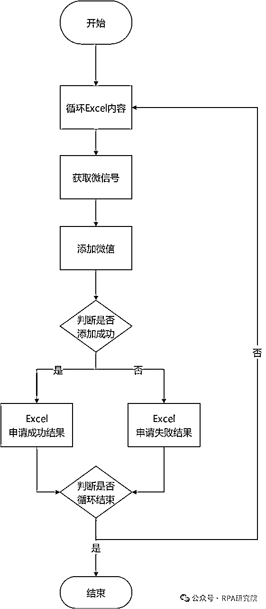
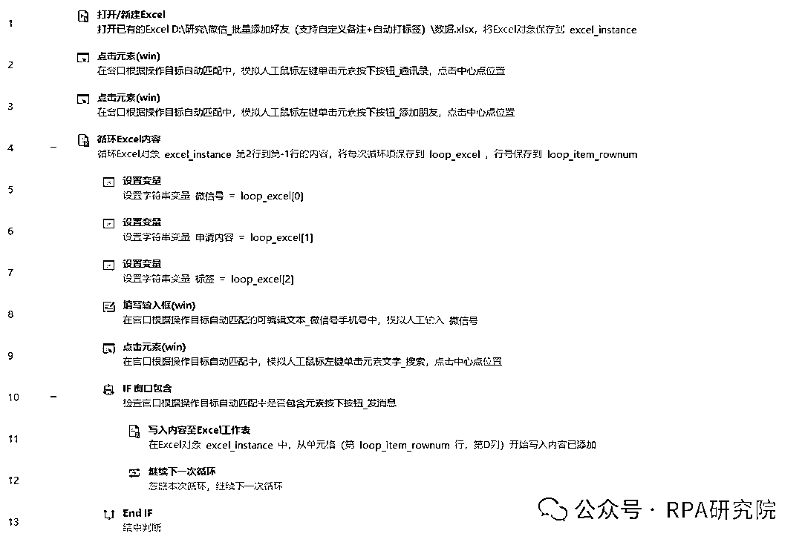
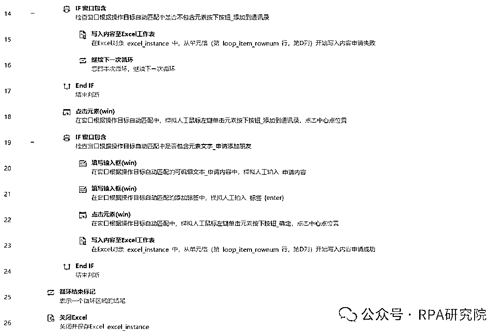

# 微信-自动添加好友RPA程序（支持自定义申请内容+自动打标签）

> 来源：[https://x0gnb2e1yj.feishu.cn/docx/M9KBdfk90o21KSxUB3BcS8olnwh](https://x0gnb2e1yj.feishu.cn/docx/M9KBdfk90o21KSxUB3BcS8olnwh)

😁大家好，我是RPA研究院院长-商叁，这次给大家带来一篇关于微信用户的自动化工具的RPA流程设计。

仅需26条指令，教你搭建一款自动添加好友RPA程序，让你解放双手，把更多的精力用在有意义的事情上。

# 🚀 程序介绍

微信_自动添加好友RPA程序是一款针对微信用户设计开发的自动化工具。它利用先进的RPA（Robotic Process Automation，机器人流程自动化）技术，帮助用户高效地管理微信好友关系，实现批量添加好友的功能，并支持自定义申请内容以及自动打标签、自动生成结果报表，仅供交流学习使用，请勿用于非法用途。

（达人商务实战场景）

# 🎟 功能介绍

1\. 自定义申请内容：用户可以根据自己的需求，设置个性化的添加好友请求信息，如独特的问候语、自我介绍或添加理由等。这种自定义功能使得添加好友的请求更具针对性和吸引力，增加了被接受的可能性。

2\. 自定义标签：在添加好友的过程中，程序可以根据预设的规则或条件，自动为新添加的好友打上相应的标签。例如，可以根据好友的地域、行业、兴趣等信息进行分类打标签，便于后续进行精准的管理和沟通。

3\. 自动生成结果报表：批量添加好友的操作后，自动生成详细的报表，以便用户能够清晰地了解添加好友的结果情况。结果报表包含申请失败，申请成功，已添加三种状态等。

# 🛠 业务流程图

# 📟 业务代码（影刀 RPA）

🥂RPA研究院院长-商叁，Base：广州

拥有12年经验的互联网老兵，目前在一家年产值8亿的电商公司担任RPA技术负责人。

主要职责包括领导并推动公司在抖音、快手、视频号、拼多多、唯品会等多领域的RPA业务程序开发。

欢迎对RPA技术感兴趣的朋友一起交流