# 站撸流，论如何复刻“职场柠檬”公众号？AI原创全自动爆文保姆级教学-2024夏季RPA工具发布会

> 来源：[https://ovumyiw67u1.feishu.cn/docx/M18tdYtADod2DvxF9xQcuWw6niS](https://ovumyiw67u1.feishu.cn/docx/M18tdYtADod2DvxF9xQcuWw6niS)

# 开场白

最新版本已更新，请移步

嗨，大家好，我是RIO

AI武器研究所成员，我们专门研发"能搞钱的RPA工具"，定期公布RPA工具以及分享背后的运营逻辑

今天分享主题是公众号爆文写作

这也是本人第二次航海的复盘

上次航海之后写的“ 纯数据流打法”，最近已经加了精华

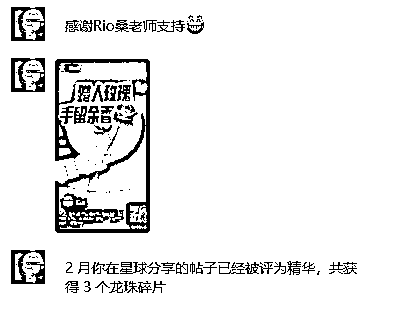

很开心，不幸的是，“纯数据流打法”有的过时，

那时的我有点“炫技”，讲的比较散，都是单个点

这次航海我尝试把他们串成线，奔着“变现”去

实战中演变出更强的打法

容我慢慢道来

这次航海教练推荐了几个赛道

其中聊到了职场人情世故很爆，例如“职场柠檬”

聊到格式化，素材重组，AI模块化扩写

我感觉我可以

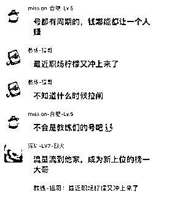

说干就干，这次要复刻“职场柠檬”公众号

注意，复刻不是洗稿，而是做像素级复制，然后按他的风格写文章

有点像厨师，吃一口，然后炒出同样的味道

经过一个月强撸终于赚到了一张门票

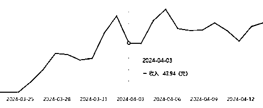

接下来，一步一步介绍我是怎么做的

尽可能做到保姆级

之前好几篇文章都写到要公众号要坚持日更

关于这，我是这么思考的

其实根本不存在坚持一说

公众号拼的就是原创的续航能力

所以，要干就要干一辈子

“干一辈子”意味着写到死

“写到死”意味着无论退休，忙工作，休假，生病，任何状态不能断

“不能断”意味着写文章不要花太多功夫

“不花功夫”意味着不能全手搓

“吃到老”意味着文章有收益

“有收益”意味着文章有质量

“有质量”意味着素材要源源不断

“源源不断”意味着不违规

“不违规”意味着不靠洗稿

总之，细水要长流，目标是一辈子的号

为此，我给出的方案：“AI原创全自动文章生成”

全程RPA，机器负责定向采集，批量AI写作，格式化的编辑，批量的存入草稿

人只要负责在订阅号APP上设置发布时间即可

当然需要人给文章以“灵魂”

只要电脑在，素材源没有改，人还有思考，就可以站撸到老

所谓“站撸流打法”

论质量可能打不过手搓

但论持久与量级，手搓完全不是是对手

最近有个号“燕子职场30” 日更500篇 1分钟1篇 该爆的一样爆 平台对他毫无办法

他们用的手段大概就是这套

但他们重复洗同一篇文章的做法未必能长久

有没有不靠洗也能撸一样能爆的方法

在那种行业中相当讲究原创与算法的环境也能爆的方法

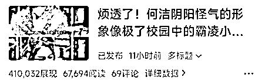

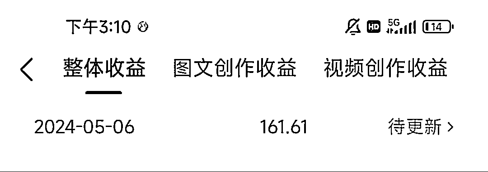

我们开始吧

# 第一章：选题

关于选题，基本上已经锁定了职场人情世故

下面更多是拆解与前期调研

介绍一下选题的方法论，举个例子

“职场柠檬”这类小柠檬 在搜一搜里一大堆

其中找到一个“薄识君君”的号，是这个赛道做得比较好的，流量不亚于“职场柠檬”，用他来举个例子吧

为什么？因为他比较接近正常人起号，以下是他的数据

上期介绍过公众号分析大师的功能

还没细说他如何用，这次补上

这个工具主要用于“分金定穴”

在鬼吹灯里，他能够快速确定墓的位置

例如这个号，可以先看他的发布频率，知道以后要日更频率，基本一天一篇

再看预估收入，可以理解=阅读量 * eCPM，结算最近一个月的，能看出这个号至少赚5000

再看词频，可以知道这个赛道的关键字：单位/78 | 领导/61 | 同事/18 | 体制/17 | 永远/11 | 明白/10

单位与领导基本每个标题都有，就是这条赛道的平台固有推荐标签

然后翻翻到第一篇文章，他开始在1月29日发职场文，然后日更到2月26日才有第一篇10W+，等于他坚持了1个月才有所收益，后面就开始起飞了

如果你用他类似的文章，大概率也是这个起号节奏

按常理推测，从2023年11月到现在，同赛道玩家已经很多，越来越卷，现在进场，起码要50篇以上才有机会，可能更多

要不是承诺了要复刻他，绝对不会选这条赛道，因为进场太晚了

进去文章分析他的内容

https://mp.weixin.qq.com/s/u68MR8SFRO7wx0iewZnSHA

基本每篇都一样，符合总分总结构，如图：

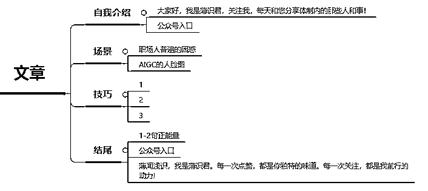

如此这般对比了本尊“柠檬”和其他“柠檬”

得出结论：

自我介绍与结尾是固定的模版

AIGC图片与场景没有关联

场景是找那些常见的职场困惑

而技巧与场景强关联

标题都是“单位里”开头+场景+技巧123小标题

看10W+的爆文总结规律，都有两个特点：

①场景要共情

②技巧要干货

但我认为两者中场景最为重要，因为

场景就是话题，只要话题吸引人，感兴趣才有机会点击进入看技巧

等于说找到好的场景，等于写好了一半

接下来就是找场景

# 第二章：采集

最珍贵的食材，只需要最简单的烹饪方式

素材也分级别，越采集的门槛越高级别越高

简单地说，采集的人越少，用的人就越少，内容稀缺度越高

没人用的话直接用 你就是原创

所以要采集那些高门槛的素材

哪些属于高门槛呢？

第一类是付费平台，举个例子，航海手册

成为会员才能打开，即使付费了，管理员不会给你带走的

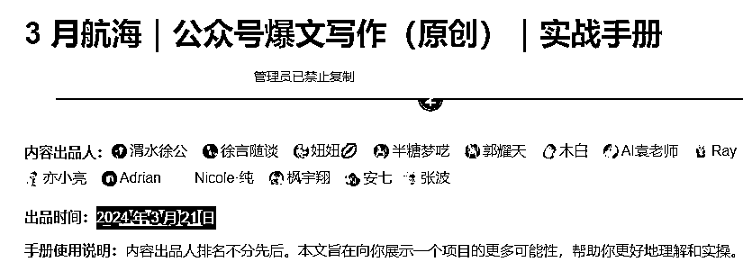

但是，拿来吧你

第二类是付费内容平台，如飞书，小报童

他们不支持拷贝的，会提示没有权限

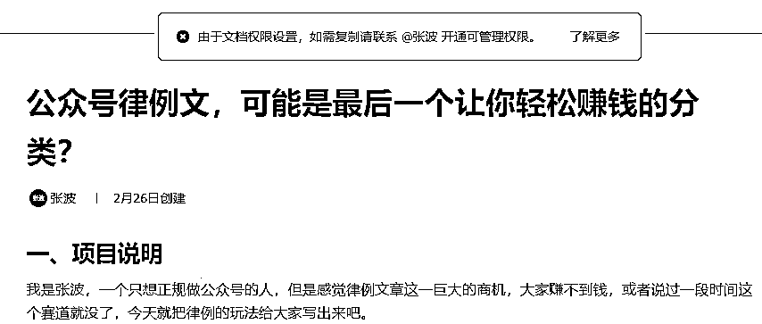

但是，拿来吧你

第三类是只有手机端才有的，如脉脉热搜榜

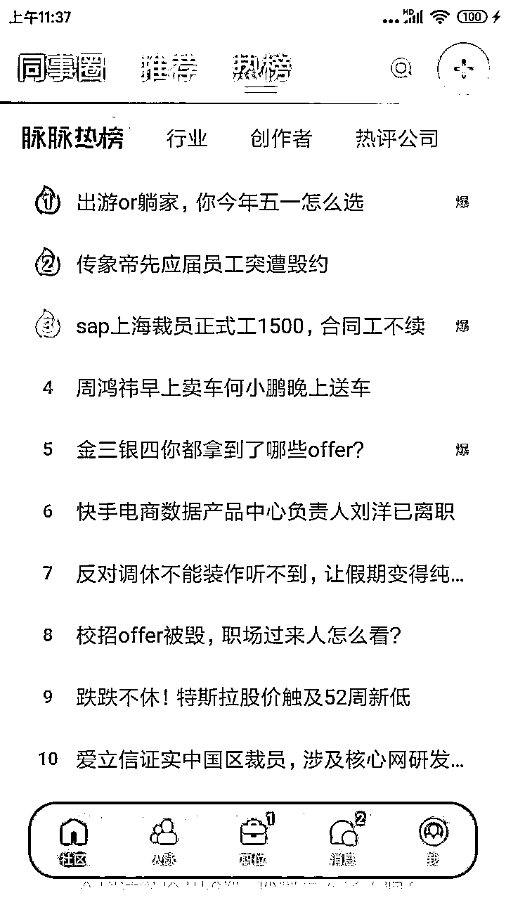

没有网页端，唯有手机端可见的内容

但是，拿来吧你

看到没，只要看到都能捉到，技术上没有什么做不到

（捉不到的可链接我，让我挑战一下）

所以、素材常在，缺的是你有没有发现素材的眼光

还有另一种情况，素材太多，如何判断哪个素材会爆

主要看两个指标

“展示流速”，展示流速越高，展示量/发布时长，如有流速证明选题方向是对的，平台愿意推的，一旦过了某个时间，流速会下降

“阅读率”，阅读率越高 ，阅读量/展示量，证明标题写的好 ，或者称为点击率

在海量素材中，挑选同时满足这两个指标的，大概率流量不会差

我写了个脚本，专门采集这类的文章

对于我们职场柠檬，我想要的素材是可持续的，垂直的

最终找到了一个头条号，每天更新4-5篇文章，都是职场中的故事

然后写个脚本就是轮询他的主页，采集昨天数据比较好的那几条

小技巧，文章先让他在头条做一轮自然筛选后再选

# 第三章：加工

素材采集回来了，要开始AI加工

问大家一个问题、写一篇文章至少发多少次请求？

答：共3发

第1发：把采集的素材与“职场困惑创作者”合成第1条prompt，发1次，生成章节①

第2发：把刚生成的文章①与在下面的“职场生成技巧创作者”合成第2条prompt，发1次，生成章节②

第3发：把①+②的内容与下面“职场公众号标题创作者”合成第3条prmopt，发1次，生成标题

群里好多学员洗稿被摘掉原创，原因是虽然换了表达方式但论述逻辑没变

如果一篇文章如何洗稿必过原创，分享一段手法

注意看！看懂了代表你很有潜质

洗稿后可以在http://www.wenpipi.com/sim相识度测试

文本相似度可用于原创检测、剽窃鉴定、抄袭检测、论文查重、文本比较等场景。

相似度越大代表抄袭的可能性越高：检测的相似度值范围[-100%~100%]

抄袭律师解释：文章的表达元素、具体的人物设置、人物关系以及情节事件、内容等等，在相似度≥5处或者说相似度≥10%以上，就可算做抄袭(轻微)；相似度≥30%的，算做剽窃(严重)。

上面的手法可以做到以下效果

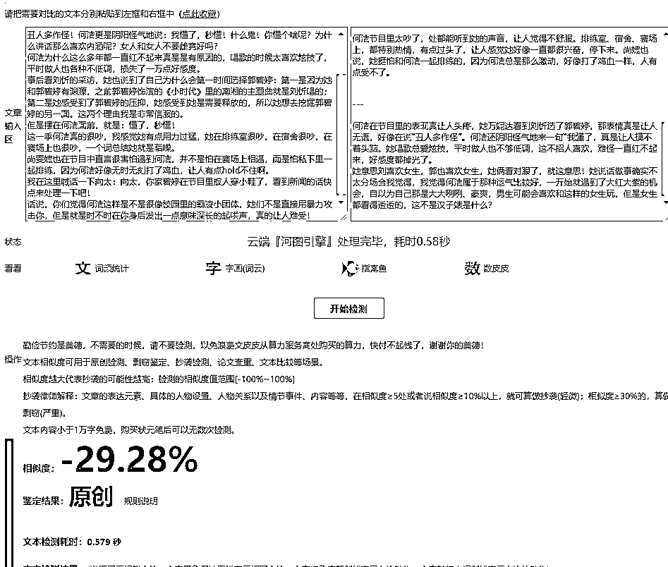

可能有人问，要是一次生成100篇怎么办？需要发300次请求

就算KIMI，每小时限额100次，怎么破？

关于这个问题，研究所也有解决办法，

视频中同时存在多个KIMI对话，每发一次换一个，实现KIMI无限连

有人问，怎么知道专属某种用途的提示词如何写？

答案：不懂就问KIMI

当然，KIMI给你的草稿很水，当做0.1版本

后面的版本要靠你自己打磨

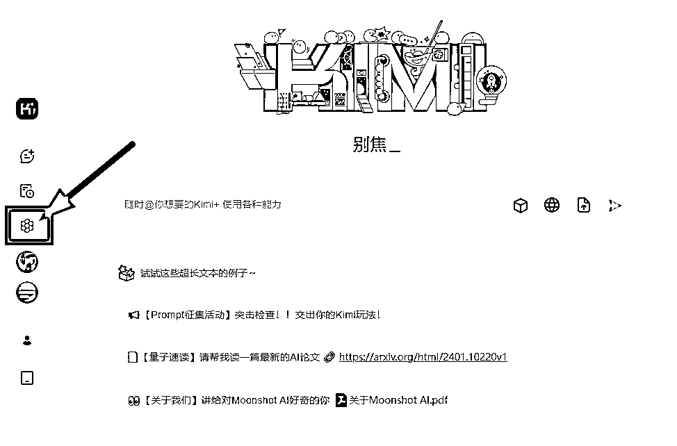

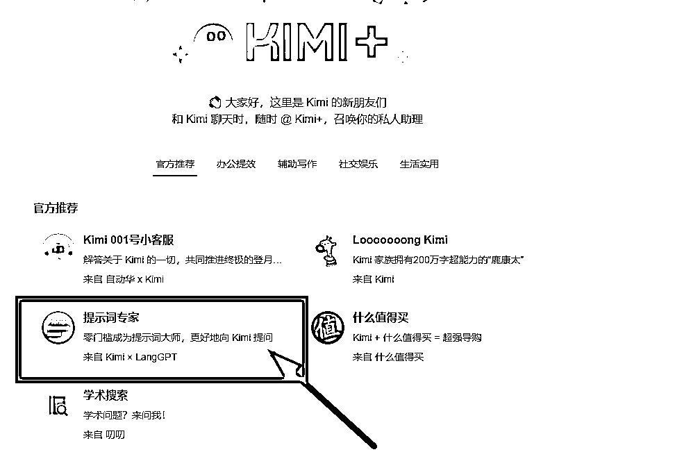

接下来图片的生成

我选择了这个云界AI平台，主打免费，生图快、业界良心

提示词：50岁亚洲男性领导,面向镜头,西装,严肃表情,办证中心内,背后阳光照射,大头照

用同样的提示词生成差不多的图片，一次4张

可以批量生成，下载到本地备用

AI生图的好处在于高清没版权

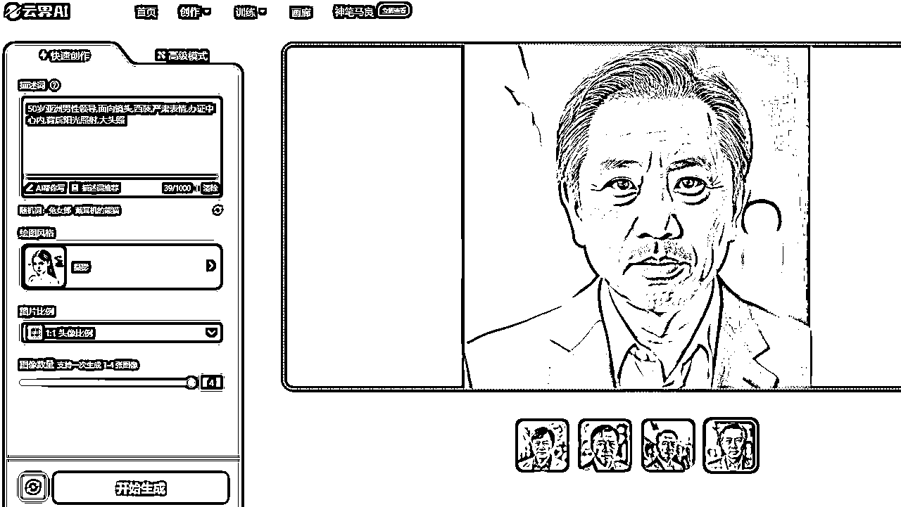

# 第四章：编辑

正如厨师烹饪菜品，食材采购与食材清洗完毕，下一步就是撸起袖子下厨

例如去掉难以消化的东西，例如

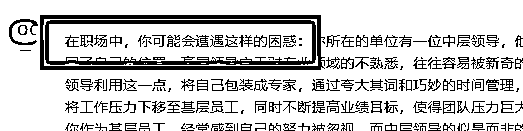

例如在文章插入图片

方法：随机抽取一张AI图片，上传到图床上，获得图片链接

然后，在①随机行插入上面的图片代码，用换行符拼接①②，

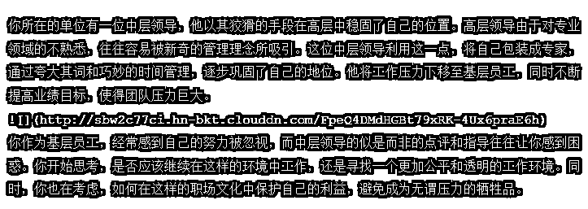

需要加粗某些精彩句子，图方便也是随机抽取即可

发去5118检查违规字，发现违规字用拼音代替

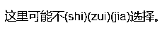

核心的核心：去AI味

各平台都上了AI创作识别算法，无论原创还是洗稿一律打压

一旦有这个标签，曝光量不会太好

市面上去AI一般用手搓，但手搓很累，有没有自动化办法？

还是有办法的

原理有点深，我试试简单说

机器学习主要来自神经网络理论，他定义每个元素都有一个向量（多维度数组）

计算机依靠计算向量与向量之间的数值关系，找到他们某种特定联系

识别AI也是这个道理，他们并非识别固定的词语，而是总结AI写作用词之间某种特定联系

符合这种特定联系就能判断为AI创作

去AI味算法就是在不影响阅读前提，能破坏词与词之间的联系

以下做个示范

随便找一篇爆文，然后KIMI简单洗稿，复制到http://aigcx.people.cn/AIGC-X 测试，判定为机器生成

然后稿子丢给算法跑一下，回去测试，判定为人工生成

不服？继续挑战5118 AI内容检查器

随便找一篇爆文，然后KIMI简单洗稿，复制到https://www.5118.com/act/aidetect AI撰写率： 85%

然后稿子丢给算法跑一下，回去测试

检测结果为：人工撰写 AI撰写率： 0%

最后一步，不知道你们有没有留意

我用的是Markdown格式，公众号正文支持这种格式的

用这个网站https://md.aclickall.com/

把CSS样式配置好

把文章导入就会看到好看的样式，不花钱

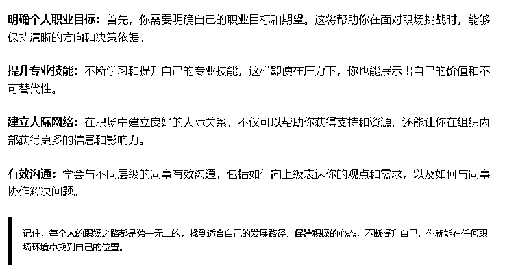

# 第五章：发布

菜品已经做好了，请服务员端上桌面

写一脚本，发布到创作者后台，全自动完成以下步骤

配置标题，封面，摘要，合集，原创声明，创作来源，直到保存为草稿

最后一步，点击进入订阅号APP，进入草稿，人工润色

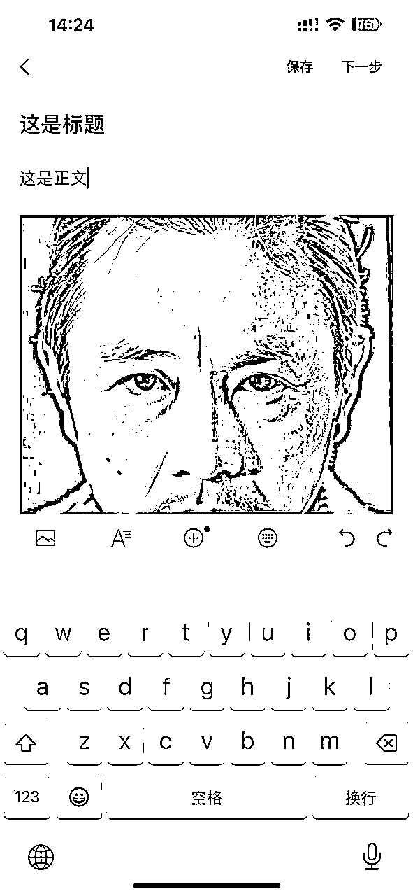

墙裂建议，手动修订标题

标题是整个文章的灵魂

机器永远揣摩不透人心

有些事只有人才能懂

可能改那么一两个字能带来泼天流量

再花1分钟扫一扫文章

然后选个好的良辰

提交发布，就OK啦

# 结尾

整套程序共390行代码

在阿里云上租台电脑

每天开撸50篇文章

走完大概要1.5小时

按每小时约￥0.1，合计成本大概￥0.15

如果有台闲置电脑，成本为0

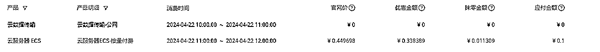

全过程自动化，无须人为介入，该干嘛干嘛去

目前一篇10W+都没有

一天流量主少的时候几块钱，多的时候有一百多

但已经知足了，毕竟就一个号

想多赚点就多开几个号，也是可以

同样素材每次跑出来的文章都不一样

做到极致的话，可以24小时不停电生产

分发给到其他人，让他们自行发布

类似快递行业

机器完成大部分重复劳务，人完成最后一公里送达

形成一个生态

有人问，这样会不会没有写作的乐趣？

第一，原本机器可以直接发布，还保留了最后人工修订环节

这环节目的为了去AI化

未来AI捏造故事，平台将会越抓越严

不知道哪天会被无理由清算

保持手搓的原创作者形象对人工审判很有利

第二，写作乐趣保留在编辑环节，也是最花时间的一环

先说什么后说什么，过渡怎么衔接，都需要精心策划

要把写作大纲固定下来，才能保持每次炒出来的菜品口味的一致

就像一台印钞机，很多时间在调整参数上，而不是一张一张改

第三，我们做流量主是为了享受写作的么？生财是一个文艺社区么？

回归初心，回归商业的本质，投入产出比，才是坚持日更的唯一动力

其实复刻“职场柠檬”只是一个引子

我想说，写其他赛道的文章也能套用打法，只要，发现缺口，迅速动作，把流量吸光

正如《三体》一句名言：“溃灭你，与你无关”

所以寂静森林不要发声，大佬都在闷声赚大钱

哪有时间陪你从0到1

看到这里，大家都知道打法的原理了吧

也对我们研究所也有一定了解了吧

一个专门结合AI与RPA，研发"能搞钱的工具"的地方

我们所欢迎：

1、凡事优先用机器的人

2、搞钱考虑用矩阵的人

3、要干就干一辈子的人

需要更深入的了解的话

请找我要链接

但不负责基础教学

LOW的问题一律不回

PS：最近我打算开了个小报童

我想打算一边做项目

一边更新笔记

每天都遇到新问题

寻找新的解决方案

然后写代码

然后做测试

然后复盘

最后把代码保存到那里