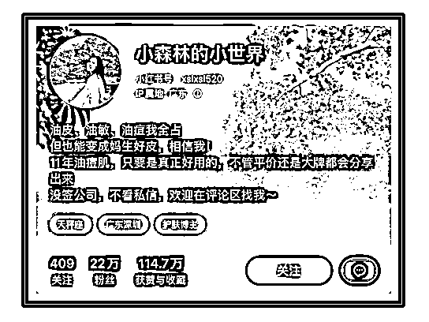
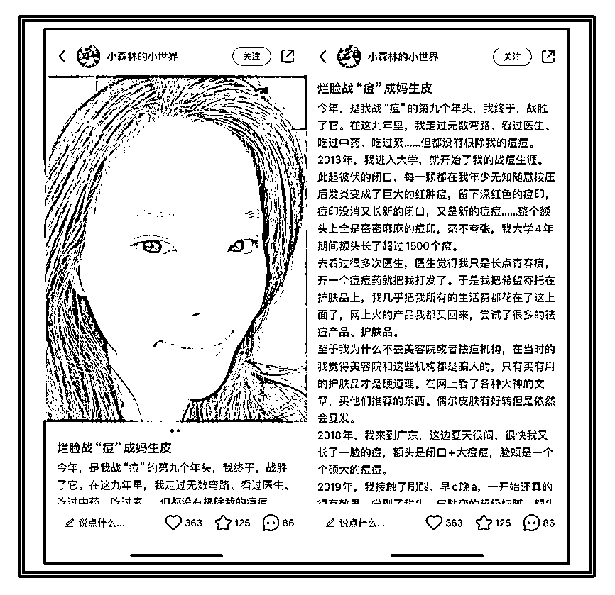
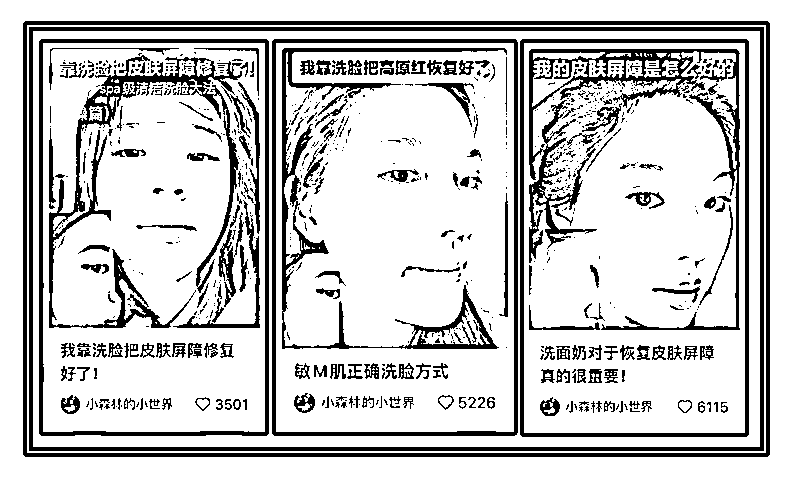
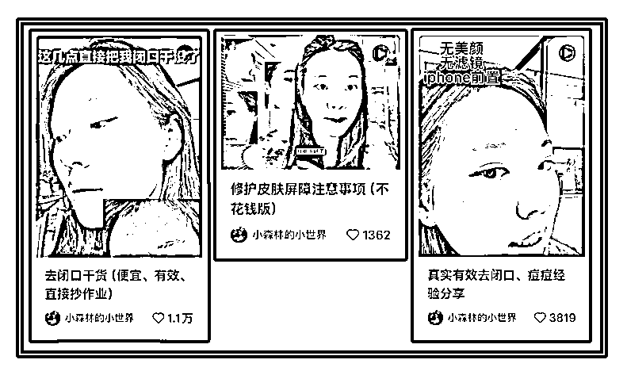
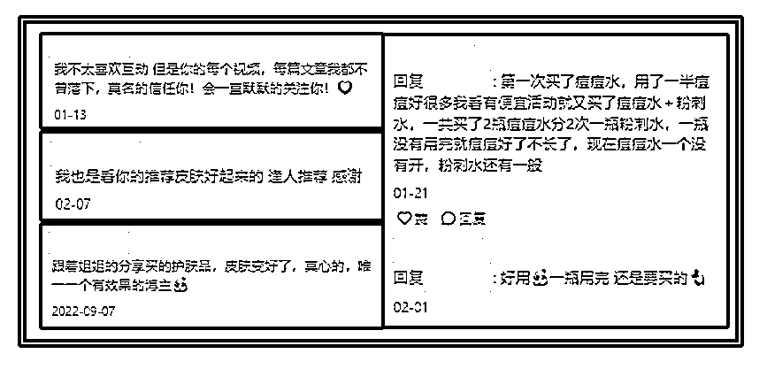

# 分享一个护肤赛道新人可照抄的小红书买手IP

> 来源：[https://m08zlw24sg0.feishu.cn/docx/WTimdnyPzopFmhxsqCmcGx9Dncg](https://m08zlw24sg0.feishu.cn/docx/WTimdnyPzopFmhxsqCmcGx9Dncg)

小红书上个月评选出的30位成长突破买手，护肤赛道只占了2个，小森林当时只有21w粉、205篇笔记，就占了其中1席。

在这个又卷、带货难度高的赛道，她是怎么做到的？

子木研究了小森林的内容，发现她的成功，是许多买手IP可以学习的。

.

# 赛道：选择细分赛道中人更多的

.

小森林的定位是油皮护肤，同时还是敏感肌、痘痘肌，是护肤的垂直细分赛道。

敏感肌的设定，也非常讨巧，现在“敏感肌”、“成分党”开始被熟知，大家越来越认为，敏感肌能用的护肤品，更天然、健康。

.

同时，敏感肌、痘痘肌也越来越多，所以虽然是细分赛道，但受众不少，只会越来越多。

.

# 简介：展现真实的一面

.

小森林的个人简介，显得真实、可信：

11年油痘肌，让人感觉她有丰富的去油、战痘经验，

平价、大牌都会用：不管是学生党、还是白领，只要是油皮，都能在她这里找到自己需要的；

还有一个讨巧的点：说明自己“没签公司”，更让人觉得她真实可信，不会为恰烂钱去接一些不好的广子。

.

# IP故事：自己的战痘故事

.

很多宝子问子木，怎么写自己的IP故事。

我们想想，写IP故事是为了什么？

是为了让大家知道，我在这个领域很厉害，值得你们相信呀！

还有什么，比“我本来满脸痘痘，经过努力，变成妈生皮”更能显得自己护肤很厉害，值得大家相信的呢？

所以，给大家一个IP故事的公式：

我本来怎样 + 那时的感觉 + 经过努力 + 现在怎样 + 现在的感觉 + 以后会分享我的经验

.

你是做护肤的，就围绕护肤来讲，

你是教英语的，就围绕你怎么学英语的来讲，

有了这个故事，大家知道你在这方面特别厉害，当然就更愿意看你分享的干货、经验啦。

.

# 选题：拿自己护肤中的痛点当选题

.

很多宝子不知道怎么做选题，很多时候，是因为我们钻研得还不够深，钻研得多了，你会发现，选题会自己冒出来:

比如，用心护肤的油皮、痘痘肌姐妹，去闭口、祛痘、修护肌肤屏障、防晒……是护肤过程中遇到的难题。

同样，这也会是其他姐妹护肤时会碰到的问题，那么，就可以把它们当选题。

.

所以，在选题的过程中，我们可以多去回忆，我碰到过哪些难题？

比如，作为打工人，怎么向上沟通，怎么不被甩锅……是难题，

比如，作为宝妈，孩子做作业拖拉、孩子有心事不肯跟自己说……是难题，

这些难题，只要我们用有效的方式解决了，就可以把“难题 + 解决办法”发出来，就是一个真实的、转粉更高的内容。

.

# 封面标题：多用对比效果好

.

小森林很擅长用对比：

烂脸战痘成妈生皮，文字对比，

护肤前的照片，跟现在的状态，视觉上对比，更直接，

反向给tony老师安利洗护产品，人物对比反差……

这些对比，能加深大家对她“很会护肤”的印象，更能让人想看她“是怎么做到的”，点击率、信任度都提高了。

另外，小森林非常会选择戳心的关键词，这些词都可以收集下来，发其他笔记时使用也是很好的。

举几个例子：

①关键词：便宜、有效、真实

真实有效瘦小腿经验分享

冷白皮养成干货（便宜、有效）

②关键词：直接抄作业

练成流利口语（不花钱，直接抄作业）

北欧风装修干货（直接抄作业

③关键词：不花钱版

马甲线练成注意事项（不花钱版）

三天入门PS（不花钱版）

# 说在最后

虽然有很多值得学习的技巧、方法，但是，真正让小森林成功的、以20w粉就占据了2个护肤买手榜之一的，是她的护肤方法真的有用、分享的东西真的好用，才不断的有人愿意跟着买、愿意把她分享给别人。

子木在跟学员的沟通中，经常提到，做个人IP，不是做流量，不是造噱头，是你的产品真的好用、有用，然后借用自媒体、借用渠道的平台，让更多人看到。流量是其次，产品才是第一。

子木之前分析过一些博主，比较短的一段时间过后，他们消失了。有时候，是因为，他们的产品没有打磨过关，慢慢地沉寂下去，或者，因为他们没有确定要做这个方向，自己换了赛道。

而想要长久的赚钱、享受到个人IP的复利，还是要打磨好产品，提供好价值。