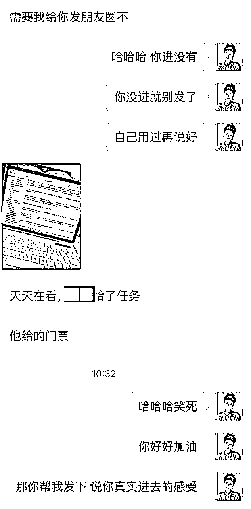

# 💰第一次生财拉新复盘 获得战队前五

> 来源：[https://hjlrkivx2z.feishu.cn/docx/XxrMdtxK0o18iPxDJrPc6WHBnog](https://hjlrkivx2z.feishu.cn/docx/XxrMdtxK0o18iPxDJrPc6WHBnog)

hi，先自我介绍下，

哈喽，大家好，先自我介绍一下，我叫当小时，现在是播客《搞钱搞流量》的主理人。

去年跟着醒谱白加入了生财，今年又跟醒谱白粒战队一起参与生财拉新，从作为一个萌新的视角到今年从头到尾、从里到外参与围观了拉新的全过程。还取得了战队前五的好成绩～

这次是我第一次做私域拉新，而且是把拉新当成一个项目来做的，共引流了700+人进群围观，发了90+条朋友圈，私聊销售300+的人

最终取得了拉新了9人进生财，且获得了战队前五的结果。虽然和其它大佬比起来不算多，但第一次尝试从0到1踩过的坑应该会对大家在私域发售有所启发。

如果你同样刚有想法做私域拉新推一些知识付费产品，或者正想做自己喜欢的事的同时也得到一些商业回报，千万不要错过这篇文章。

这篇文章5000字，我的复盘会分为以下几个部分进行，感谢你抽时间阅读，希望你能有收获。

第一部分：我为何要参加生财拉新的，如何知识付费才能投入产出为正

第二部分：第一次做知识付费拉新，如何引流发圈和销售。

第三部分：从这次发售中的总结复盘及可迁移的地方

# 私域发售拉新策略复盘

### 1️⃣巧用smart定目标🎯 如何知识付费才能投入产出为正

👩🦰刚才和朋友吃火锅也在猛推生财

她好奇问我在里面赚了多少钱

我仔细算了下去年应该是有一百倍门票回报

所以今年又加码了航海家🎫

我最开始了解生财是因为要想搞个自己的知识社群。

我研究了半天，发现了知识星球这个神奇的地方，

生财是里面的top1

当时我很好奇怎么能卖这么贵却卖得这么好？

刚好后面4月最便宜的时候入了

也是很幸运一来就遇到靠谱她们战队

然后又很幸运的参加一次线下聚会

然后就很幸运的签了个大单一下赚回百倍门票

这就是为啥我今年停掉了很多知识付费

生财却加码续费的原因

然后因为自己去年是从靠谱这里进的生财体验感很好

所以这次看到她们战队在招募时就毫不犹豫报名了。

要使购买知识付费产品后投入产出为正，关键在于如何有效地选择和利用这些产品。以下是三个关键步骤，帮助你在购买前设定好目标，以确保投入有所回报：

1.  明确学习目标和期望：

*   分析自己需求：有的钱花出去是消费有的是投资，大部分人知识付费是消费逻辑，自己有焦虑或者想享受情绪价值，买课只为了自己爽。你有没有诚实面对分析自己的学习需求？🌰例如，我去年购买生财主要是为了研究知识星球怎么玩，今年购买航海家是因为觉得自己太小富即安了生活舒适需要一些外部刺激，而参加拉新的需求是为了更好的给做知识付费的客户提供私域发售的服务。这是三个完全不一样的需求。

*   设定SMART目标：然后你需要根据你的需求制定你的目标，确保你的目标是具体（Specific）、可衡量（Measurable）、可达成（Achievable）、相关（Relevant）和时限性（Time-bound）的。🌰例如，我在参加拉新前定的目标就是1卖出十张门票2写复盘总结规律 3迁移到自己或给客户的服务上。

1.  仔细评估产品内容和口碑：

*   查看知识付费提供的内容：确保它们与你的学习目标和需求相匹配。

*   查看背景和口碑：了解组织者或老师的资质、经验和专业领域。这里主要看对方取得的结果和案例而非宣传语是什么。查看其他用户的评价，了解课程的优点和不足。这有助于你更全面地了解课程的质量和效果。其实到了一定阶段你的同行者比带领者对你的影响更大。所以除了老师或组织者，其它用户是不是你想与之为伍的。

1.  制定学习计划和跟进措施：

*   规划行动时间：确保你有足够的时间来行动，行动是链接内部世界和外部世界的桥梁，不管买多少知识付费不预留时间来行动都是毫无意义的。

*   实践应用：卖是最好的学，这是我本次拉新得到最重要的感悟，可以更好地理解和掌握所学知识，并将其转化为自己的技能和能力。学到了的不仅要用还要总结复盘，比如我写这篇复盘，以确保长期记忆和应用。

很多人呀 抠抠搜搜的花了很多钱，却从来没想过有的钱送出去了是能带很多兄弟姐妹们回来的，其实不在于知识付费的学费是贵还是便宜（甚至参加这次拉新是免费教学的），要使购买知识付费产品的投入产出为正，关键在于明确学习目标和期望、仔细评估产品内容以及制定学习计划和跟进措施。

### 2️⃣听话照做执行反馈 卖是最好的学

卖是最好的学，这是我本次拉新得到最重要的感悟。

因为要卖所以要看卖得好的人是怎么卖的

因为要卖所以别人在问的时候你得能回答上来，就得更了解产品。

因为要更了解产品你自己就得更加的使用这个产品。

说实话去年付费后刚开始还比较有激情，过了两月也没有怎么再打开。

这次拉新让我对生财的熟悉度猛增

之前一直很好奇的如何大规模的组织协调这么多人参与协作

打开靠谱她们写的拉新sop才知道原来需要提前做这么多工作准备这么多物料。

包括朋友圈都给你写好了

我从引流发圈销售这三个步骤来复盘这次的行动踩过的坑和做得好的经验。

#### 引流 700+人进群围观

引流的关键步骤就是邀约人进群围观。

最开始引流时，因为跟错误的预估的目标跟靠谱访谈时说到群发售转化率最高可以达到10%，导致以为要完成10个人卖门票的目标只需要拉群100个人就可以了。

那这还不是轻轻松松的吗？因为这块是我比较擅长的地方，刚开始瞬间就加满了一个战队提供的群，然后马上采取措施自建群，瞬间又加满了一个，觉得可以不用那么用力了接下来发圈就没怎么带二维码（踩的第一个坑）。

过了两天群开始正常运营后发现基本没啥反馈和互动，开始敏感的察觉到可能和我10%的预期转化率有所差距，因为引流运营转化就像漏斗模型，如果运营的效果不太理想一定会影响到最后的销售，于是采取的补救措施要达到最初十人门票的目标，就需要在引流上面多做一些动作增加技术，开始激活其他两个许久没用的账号。

很赞同靠谱说的一句话，在这次拉新其实也是检验自己私域基本功和自查的时候。

开始盘点自己的私域资产基本盘

我有四个微信，总共有2w人，有三个不同时期的工作号，一个生活号。

如果能用工作号达到目标就先不打算启动生活号3q人，里面基本都是线下认识的人，同学亲戚和B端的潜在客户。

剩下的三个工作号

1️⃣运营最频繁的营销号5q人，每天还有从搞钱搞流量播客被动添加的新增用户，活跃度最高。

2️⃣微博网红时期摄影号8q人，从2016从微博引流的人，之前主要是摄影工作室的客服在用，人数最多但时间最久远已经几年没怎么运营了。

3️⃣淘宝时期的服装号4q人，20年左右从淘宝订单电话号码添加的和抖音服装直播的买家。也是主要客服在用，于新品测试处理售后和清仓的。

你们猜猜你哪个号卖的最多？

引流的700人进群，有400人是1️⃣营销号，200人是2️⃣摄影号，100人3️⃣服装号

但成交上居然全是来自1️⃣营销号。

然后如果包含（给我说是从我渠道进的结果不是的还有2人）总共11人有9个来自搞钱搞流量最近添加的播客听友。因为除了朋友圈我还很真诚的在听友群安利，还邀约了4位生财的航海家录播客访谈。

引流部分得到的经验是

1.  流量要精准不要泛，过期的流量很难激活，激活了业务不相关也没用。

1.  盯紧目标，实际操作后发现与预期有差距需要及时调整策略补救。

1.  多渠道引流和数据分析，能更加客观认识评估自己。

#### 发圈邀约 90+条

本来以为只发了60条，结果一数居然发了92条，还不包含同步发到另外两个号上的，然后中途只有一天因为要全程接待从美国回来的朋友太现充了看手机不礼貌只发了一条。

硬广or软广

因为前几天发现引流进群的人几乎没啥互动，我就费尽心思，又多写了不同角度的招募文案。

能明显的感觉到这条朋友圈发完进了多少人。这个体感跟我的之前的认知也是不一样的，

我之前觉得是不是软广才是最好的，后面发现大家的注意力好有限，太软了根本看不到最后一句。

而直接发硬广两句话睡前发福利醒来删配个群二维码，第二天早上人就满了。

模仿高手

发朋友圈最大的收获在于之前也三天打鱼两天晒网，后面采访了靠谱之后被打动是需要付出足够的努力才可以的于是给自己定了个flag，每天至少发三条。

有因为飞书里面战队准备的朋友圈物料足够充分，只需要换一下形成自己的。哦原来这样发是需要在原来提供的素材基础上再加入一些个人的感悟会更好

模仿永远是最快成长的策略，每当我不知道咋发的时候我都会每天点进去看靠谱是怎么发的可粒是怎么发的

再加入一些自己的优势

模仿一段时间后加入了自己的优势，我之前是摄影师啊，认识很多美女模特照片拍的很好呀，除了文案的内容也会准备很多原创的图片。

比如发这么美的美女模特都加入了生财你还在等什么？果然吸引了一个老板而且惊喜的是这位老板又邀请了一位老板加入。

最后养成了习惯之后，现在结束后还是会每天发三条朋友圈，这个就是习惯和系统的力量吧，也有人因为发朋友圈很久没有联系的人会来联系，算是做到了激活。

#### 私聊销售300+人

花90%的时间贡献价值，花10%的时间成交；

运营这部分战队包了有人分享有人直播，自己只需要发发圈，除了前期猛拉流量影响最后结果的就是销售这个环节。

我之前可能引流能力还不错基本都靠被动成交，导致一直没怎么做临门一脚，也没有珍惜每一个流量，这次终于开始有主动销售的意识。

一是源于引流进群几乎没啥互动，二是前几天完全没人下单。

为了达到目标我开始在群里点进每一个人私聊，最开始本来只想私聊有互动的人的，但说来吓人七百多人只有三五个在群里互动。

所以我先开始从朋友圈点赞的人入手私聊，后面又塞选听友群和围观群重叠的人私聊。

为了把打扰降到最低我没有直接发广告，只是问一句

“看你也在生财围观群呀，感觉怎么样？”

然后在快结束前优化了一下

“看你也在生财快闪群呀，还有三天解散了，感觉怎么样？”

不出意外，90%是没有回复的哈哈。现在结束反应过来其实还可以再优化一下降低用户的回复成本。比如

“看你也在生财围观群呀，感觉不错想继续了解回个1我再给你介绍下呀”

剩下大概有个三十人回了，然后开始跟进私聊销售，这部分的启发是最大的，因为马上就用上了。

在谈单的过程当中遇到有不会的就会发到战队的群里去寻求答案，之前就是凭着感觉在销售。

后面大概了解，哦，原来根据他们的回复，这样子的客户是不能收的，这样的话原来是表达这个潜台词，这样的客户又要怎么再戳一下痛点。

然后马上设计了一套销售转化框架方案给到客户，给他们做了一场2h内训，结果升单率从0直接提升到了70%，快速完成了一个月的kpi。

因为我的客户大部分都是小老板，其实前期从零到一要解决的根本不是什么商业模式的问题，就是怎么搞钱，怎么快速搞到钱，只要达到这一个目标，客户满意度也会提高，团队积极性也会起来。有钱到账老板也会放松一点自然不会焦虑。

这个也算是完成了最初设定的目标，你亲自学习运用过后再总结出来的经验能够复制到团队身上，还有很多的认知销售也是一个非常迷人的东西，等到拉新完了之后还有一种不知道卖啥的失落感。因为自己的产品是本地服务20w以上的高客单团队没起来也不着急卖出更多，所以又做了三个播客的商业化的动作。会再写一写这个

### 3️⃣总结复盘迭代实践

#### 风险控制和心态调整

最后定的目标差了一个，本来以为自己的风险控制还算不错，毕竟中途感觉目标可能有差距时都想尽办法补救，结果还是有些意外。

第一个是在拉新过程中没有自己列表格，都是凭感觉在记录拉新的数据，然后快到目标的时候节奏就放缓了，最后感觉应该是超了目标的。

但感觉哪有数据准。。。最后拉新结束统计的时候我记得在咖啡厅，开始自己拉表格一个一个去找聊天记录登记，后面发现和统计表上差了两个。

于是去询问发现对方是先进了群下单了来找我进陪伴群了，但没扫我们的码下单。

因为刚好卡在10这个阶梯档位上，本来十张可以送一张门票还想拿赠票送人的，心态就有点不爽，就跟60分及格，刚好考了59一样。

一是有点后悔自己没有再多努力一点点。

二是在流程上对方下单后没有确认对方是不是扫我们码下的单。

三是最后挽救的时候对方又跟我说是直接进和扫鱼丸码进的结果鱼丸查了后台跟我说不是，这两个人都是扫了其它人的推荐码进的感觉被骗了。

当然心态的调整还是花了一些时间的，首先要接纳这种不开心，不管是主观原因还是客观原因，做出课题分离，哪些是你能改变的，哪些是你不可控的，然后想办法如何把每一次挑战都转化成机遇。

第一是在定目标时需要更多付出20%的冗余努力。

第二是提前研究好游戏规则并请教前辈可能会遇到哪些问题是否能提前规避。

第三是对自己微信里的好友的熟悉度和信任度，怎么提高流量的有效性，如何去销售。

心态的调整完后就是行动，最大的收获在居然我只拉了9个居然也进了战队前五，还获得了销冠课的奖励（本来还盘算着要怎么自己付费购买的）那接下来的行动学习靠谱的销售然后珍惜每一个来的流量做好努力和练习取得更大的结果。

#### 组织协调

这二十天的的收获不亚于报了个私域发售拉新训练营，在过程当中也认识了很多的人，特别感谢生财平台和战队给的机会。

采访靠谱的时候她打了一个比喻，拉新的过程就像临时组成的🐜蚂蚁社会。

🐜蚂蚁社会：每个成员都有其特定的角色和职责高度组织化的分工，使得整个蚁群能够高效地运作，每只蚂蚁都扮演着不可或缺的角色，共同维护着蚂蚁群体的利益。

这部分组织协调能力是我收获最大的。

可喜可贺的是还顺便激发了我老公的搞钱欲望，他之前一直特别稳定，因为我每天拉新都会跟他分享，他也渐渐在看一些生财的帖子，开始跟我聊搞钱，搞流量。

#### 99%的成功都来自在场。

昨天有串台主播问我我搞流量优势是什么，

今天再拆解《金钱心理学》这本书时有了些答案，

99%的成功都来自于在场，而我的优势是这么多年没有下过牌桌。

从07年开始玩QQ空间到现在17年过去玩小宇宙，

中间经历了论坛贴吧微博微信公众号朋友圈私域淘宝小红书抖音直播短视频还开过线下门店，

输赢常有，关注度或多或少变现金额或多或少，但都一直在场。

这次虽然生财拉新只卖出去9张门票，但私域发售又保持在场了。

不是每一局牌都能够赢得胜利，但你见过无数轮流量轮回的周期，

就像打德州，我的策略是每轮下小注，且只跟成功概率》60%的局，

在摸清牌桌上每个人的性格加上拿到一副好牌（成功概率〉80%）后，

再像鳄鱼捕食一样all in进去。

生命的容错率，远比你想象的高，

生活也不是一道道单选题，选错了天也不会塌。

我们要允许自己走错路，允许自己掉眼泪，允许自己偶尔停留，

但不要忘了自己上路的初心，要一直在场，99%的成功都来自于在场。

不管是航海还是拉新还是写帖子还是线下聚会，今年一定要保持在生财多多在场。

欢迎大家留言评论希望后面能跟更多的生财在场的朋友们一起做事～～

过往我在生财发过的内容