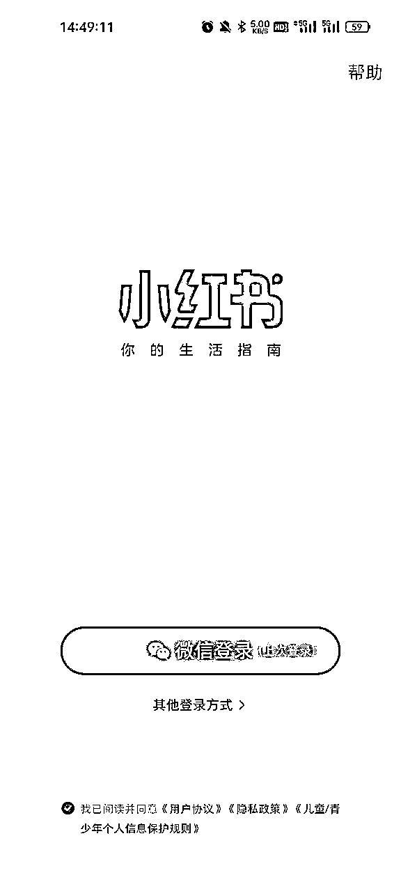
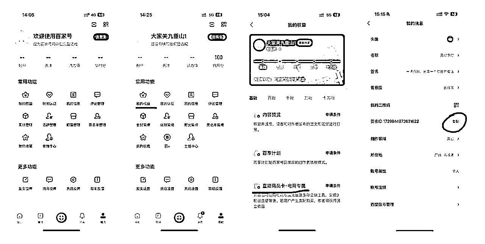
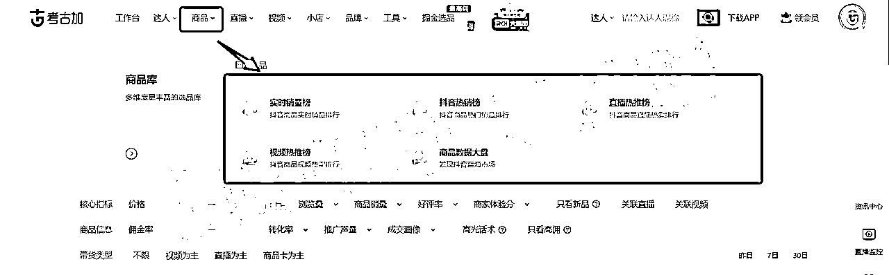
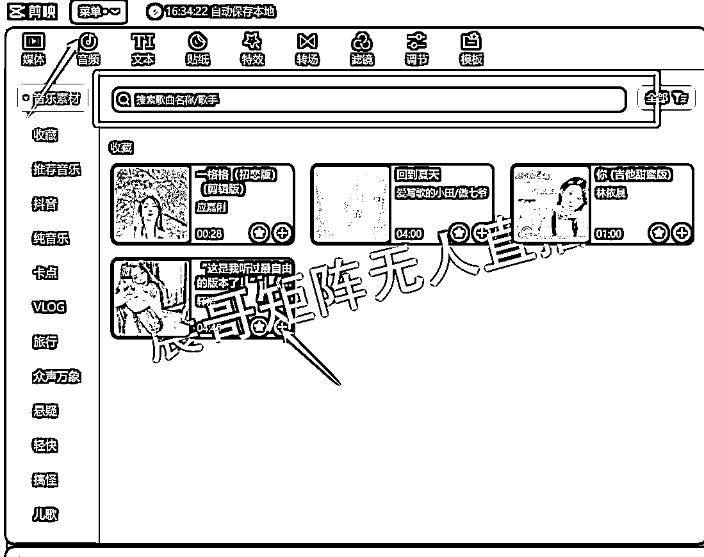
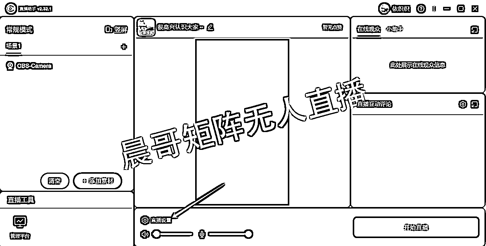
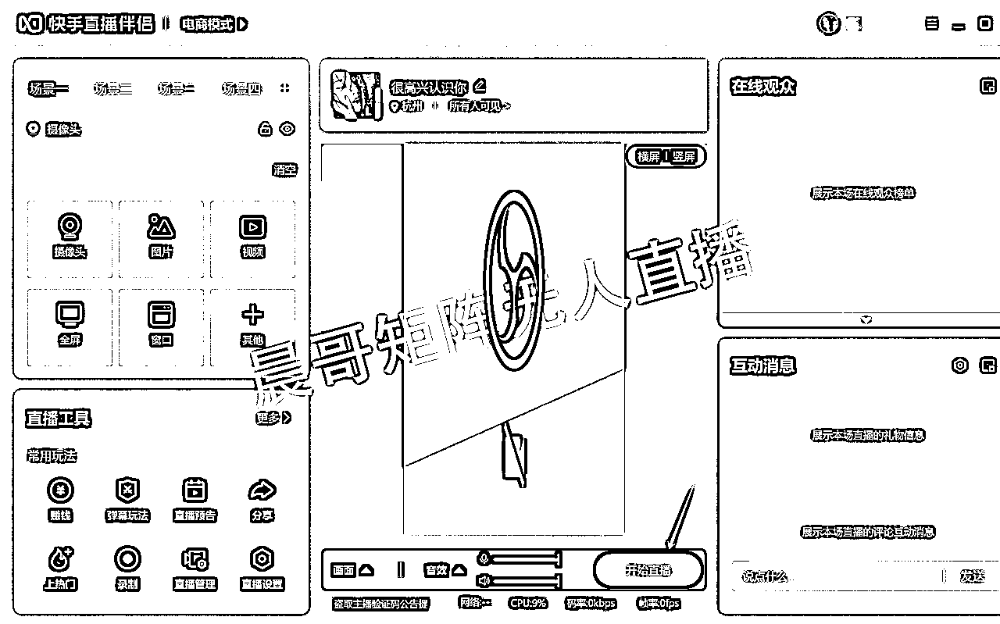

# 2024年实操矩阵无人直播打法，一天变现五位数

> 来源：[https://q1s61u5rpwr.feishu.cn/docx/N7Vmd0I1doMLf2xyVU0cEhVxnJI](https://q1s61u5rpwr.feishu.cn/docx/N7Vmd0I1doMLf2xyVU0cEhVxnJI)

# 前言：

圈友们，大家好。

我是一年写一篇帖子的“难产”专家--晨哥！哈哈哈~

去年写了一篇“让各位老板收入翻倍的玩法，全网多平台矩阵直播玩法”得帖子受到了很多朋友的喜欢，到现在还有人来找我咨询。原贴地址：

所以，还是觉得做分享有用，能够帮助他人，也可以交到更多的好朋友们。未来的创业路上，我也需要更多的小伙伴一起笃行致远，砥砺前行！大家互帮互助，才能共同进步，让互联网没有信息差。

因为去年分享的打法可能偏团队玩法，因为拓展全平台矩阵直播，需要你有一个基本盘的直播团队才能做，所以今年，我玩的就是个人就能玩的打法。

借此机会，把我个人在玩的全平台矩阵无人直播玩法，分享出来。全平台玩法我依旧是第一人（超前玩法）。

话不多说，上数据最有说服力了：

无人/半无人直播这个其实已经出来很久了，早期2020年是抖音为主，后面快手，视频号，再到现在的小红书、拼多多等等平台，确实有很多人吃到了这波红利，毕竟投入少，产出高，小个体人人都能玩的打法，适合所有个人。

市面上不管是抖音还是圈内人，基本上大家玩的都是单平台居多，像全平台玩的，基本没听说过吧。

首先，你需要了解每个平台的平台规则与玩法，以及各个平台的人群画像（比如视频号就是40岁+的叔叔阿姨们，小红书就是20-35岁的小年轻们，快手就是四五线下沉市场用户），这样才能更好的找到对应合适的爆品，根据选品才能锁定我们需要搬运的直播素材录屏，这些都是一环扣一环，环环相扣的，每一环节都不可缺少。

相信大家看完上面的介绍，对全平台矩阵无人直播玩法也有了一些基础了解。那下面我们就进入开搞模式！

# 一、准备工作

## 设备：

### 手机

硬件要求:

1.苹果选iPhone 7及以上

2.安卓选6+128及以上

3.价格300+

▲我工作室使用的都是300元+的安卓手机，首先他性价比非常的高，而且可以做群控系统，方便养号以及运行一下引流脚本。以下我们工作室的手机，都是一机一卡一号，避免违规：

### 电脑：

I5CPU11代以上

显卡1050ti 以上

内存16G 以上

硬盘512G以上

麦克风：

①建议选择带有开关键得麦克风

②作用：认为干预（钓鱼、互动、停留、灯牌）

③价格30+左右（拼多多）

一台主机价格：2000+

▲当然也可以考虑云端计算机，那个价格200-300/月，目前我们基本本地电脑居多，云端计算机大概20多台。

如果圈友们购买云端计算机，最好分散在不同服务器，这样子可以规避掉断网断电影响你一整天的收益。

远程控制可以使用向日葵+ToDesk，任何一家出事还有备选。

如果多平台矩阵开播的话，对电脑的配置要求就高了，配置越高画面就越稳定，显卡跟内存的要求都会提高，具体的话看预算，买云主机是测试项目最划算的方式。

## 账号：

### 账号的问题：

1.首先我们可以用自己的实名，一个人可以实名最少20张手机卡（移动5张，电信5张，联通5张，广电5张）

其次就是家人朋友亲戚的，这样子实名下来，账号基本前期稳定够用了。

2.后续通过渠道购买更多的实名号，这个渠道有很多，如果需要我这边也可以提供，资源都有。

3.账号注册，必须是四大运营的卡（移动/联通/电信/广电），切记不要使用什么0月租的卡去注册，注册时候，请使用手机网络注册，不要使用wifi或者物联卡去注册账号，容易被风控。

4.注册账号较多的时候，不能在同一个地点同一个时间段，尽量分散开来注册。

5.注册账号的第一天，不建议修改太多个人资料，建议养养号再去做修改。

6.账号最好不要随意登录不同手机，注册哪台最好一直登录那台（防止风控）

### 手机养号：

5G环境：①一机一卡一号 ②切换IP：开启飞行模式

wifi环境：①一个IP不超过3个平台号 ②切换IP：重启光猫

建议使用5G网络，一机一卡一号

### 养号流程（养三天）：

1.正常刷短视频，不要刷直播间

2.正常刷短视频，喜欢看什么就刷什么（模拟一个真人用户）。

3.每天刷短视频时间可以在早中晚各个时间段。

4.手机每天带出门溜达溜达，顺便刷刷短视频之类的（每天三次，每次20分钟以上）。

5.随手拍一拍发视频，不要发对标的搬运，就随手拍发。

6.第四天开始实名+刷粉开橱窗（不同平台不同规则）

### 电脑网络：

1.宽带100M以上（账号越多建议多拉网线，电信、联通、移动、铁通等等）

2.一台电脑每个平台一个账号

3.同一根网线下，最好不要超过3台机子同时直播（避免批量违规）以及开太多会造成直播间卡顿。

4.切换账号的情况下，最好是重启光猫切换IP（因为光猫重启了就自动换IP）

5.切换账号后，百度搜索“IP”查询是否更换了。

# 二、如何开通各个平台账号：

## （小红书、快手、拼多多、支付宝、百度等等）

### 1.小红书注册

①账号注册

进入小红书界面，选择“其他登录方式”，可选择手机号、微信、QQ三种方式进行注册，手机号需要短信验证注册登录（注意：需要勾选用户协议才能注册/登录）

②店铺开通

进入小红书的“我”的界面，点击左上角的图标后，找到“创作中心”并进入→点击“更多服务”后，找到并进入“开通店铺”。

点击“立即开店享权益”，进入店铺申请界面，选择“个人店”。

主体资质：需上传身份证，“免于市场主体登记证明”选择“属于零星小额交易活动，依法无需办理登记”，点击“下一步 店铺信息”（需人脸识别验证）

店铺信息：“商品类型”选择“电商商品”，“经营类目”按照自身店铺售卖产品的品类进行选择

店铺信息：根据自身真实情况填写“店铺运营人信息”和“店铺信息”，然后点击“提交申请”，平台审核通过后,进入“店铺已开通”界面，完成店铺注册

### 2.快手注册

①账号注册

进入快手APP界面，点击右下角的“我”，进入登陆注册界面，用户可以选择手机号、微信、QQ、微博、邮箱等多种方式进行注册，手机号注册需获取验证码（注意：需勾选用户协议才能注册/登录）

②店铺开通

进入快手app，点击左上角图标，进入“快手小店”，点击“更多”选项，选择“我要开店”

点击个人店入驻的“立即入驻”，填写经营者信息和店铺基础信息后，点击“人脸验证并入驻”

选择“去商家工作台”或“去达人工作台"后，进入快手小店页面，开店完成

### 3.拼多多注册

①账号注册

进入拼多多APP界面，可以选择手机号、微信、QQ三种注册方式，选择手机号注册，需要要验证码验证（注意：需勾选用户协议才能注册/登录）

②店铺开通

下载“拼多多商家版”，进入APP后选择“0元开店”

需通过手机号验证登录，登录后，点击“立即设置”

点击“个人店”的“立即入驻”，进入“个人店入驻”界面上传身份证和填写店铺名称，然后勾选“我同意《拼多多平台合作协议》后，”点击“下一步（人脸认证）”

人脸验证通过后，需设置登录密码，点击“确定”后等待平台审核

### 4.支付宝注册：

①账号注册

进入支付宝APP界面，点击右下角的“我”，进入登陆注册界面，用户可以选择手机号、微信、QQ、微博、邮箱等多种方式进行注册，手机号注册需获取验证码（注意：需勾选用户协议才能注册/登录）

②店铺注册

进入手机支付宝，搜索“商家服务”，点击“支付宝商家服务”

点击“同意协议并开启”，需输入身份证等信息

然后搜索支付宝商家平台网页端：https://b.alipay.com/page/portal/home

点击“登录”，可以选择手机号或扫码登录

进入运营中心界面，找到“生活号+”模块，点击“立即新建”

需扫码上传营业执照

填写完信息后，勾选“同意《支付宝’生活号+‘服务协议》”，点击立即开通即可创建生活号成功

点击“创建小程序”

填写信息后，勾选“同意协议”，点击“创建我的小程序”，即可成功创建小程序

点击左侧的“生活号+”，进入生活号界面，去账号认证

填写各项信息并上传营业执照后，点击提交

等待账号认证审核

### 5.百度注册：

需要“百家号”和“百度”两个APP

1.打开百度app,点击右下角“我的”，用户可以选择手机号、微信、QQ、微博、邮箱等多种方式进行注册，手机号注册需获取验证码（注意：需勾选用户协议才能注册/登录），注册成功后打开【创作者中心】，进行用户实名。

2.百度APP实名完成后，那么打开百家号APP，使用百度APP授权登录同一个账号。

进入【我的权益】，【直播商品卡·电商专属】缴纳300元保证金，百度店铺开通以后，绑定对应的百家号即可进行达人带货了。

其他平台还有很多，需要自行挖掘了。

# 三、如何选品&找对标：

## 选品：

首先，你要确认你所做的赛道类目，目前各个平台量比较大的事：服装、箱包、美妆个护、母婴、大健康食品、日用百货、珠宝饰品等等；但是一定要把控好利润，30%以上利润为佳。

出于选择的几个平台都是服装流量最大，所以我这边选择的是女装这个大类目，原因有三：

1.女装的对标直播间好找；

2.女装的款式基本网上都有货源；

3.女装容易出单，有积极的正反馈，才能持续去坚持做。

4.女装稳定以后，才能拓展更多的类目去玩。

## 对标：

### 1.从对标直播间选品

##### ①在各大平台通过关键字进行搜索，进入对应的直播间，可以看到当下各大对标直播间在卖什么，这个是最直接的方式方法，适用于各个类目的。

##### ②通过对标的直播间主页的倒三角，可以找到很多的同行对标直播间，这个功能非常的好用。

### 2.从第三方数据平台选品

#### ①蝉妈妈

点击此处，可以快速跳转至蝉妈妈。

与考古加类似，蝉妈妈也是电商人常用的数据平台。同样，蝉妈妈也提供各种供商家参考。

像我用的最多的就是蝉妈妈的【今日带货榜单】

筛选出你所在赛道的类目，这里我以女装为例。

可以通过榜单数据，找到对应的达人，进入达人主页分析数据

进入主页，点击商品分析

可以看到她是以单品打爆的模式，适合我们搬运素材

以此类推，可以找到很多对标的直播间，然后再筛选看她的这个款，你能否在1688、淘宝、拼多多等平台拿到货。

如果能拿到货，并且利润在30%以上，那么就可以作为素材库来准备素材。

蝉妈妈里面还有很多的功能，【商品榜】跟【直播榜】都是可以找到对标的，大家可以自行挖掘宝藏。

#### ②考古加

点击此处可快速跳转至考古加。

#### 考古加商品榜

考古加平台支持各种维度的商品榜单数据，可以在商品页面选择不同的榜单进行查看。

例如，在抖音商品榜中，可以通过对商品分类、商品上榜时间等条件筛选，找到对标商品。

另外，还可以在商品榜单中点击某一商品右侧的查看详情，查看商品的核心数据以及数据趋势。

#### 考古加直播榜

通过直播板块，找直播间，查看爆品直播间都在做什么品。

市面上类似的其他平台数据相对来说没有这2个完整，以上考古加跟蝉妈妈的功能都相类似，所以大家二选一即可。

### 3.抖音电商罗盘

电商罗盘适用于你已经有一个店铺，根据自己所在的类目去找对标比较合适。

### 4.抖音选品广场

官方的选品平台，选品最方便快捷，适合有一定网感的同学，知道哪些款能爆。

### 5.巨量百应选品：

# 四、如何录制下载素材

## 1.下载录播素材【江湖工具箱】

目前测试下来，最好用的录屏工具还是【江湖工具箱】，下载了用手机号码注册即可，不收费的软件。

主要用到的比较多的功能是：1.抖音直播录屏 2.抖音短视频素材下载 3.小红书作品下载

导入几十个你需要录制的直播间，通过分享【链接】，把链接添加到江湖工具箱里面添加直播就可以了。

正常你可以多监控一些直播间，前提是你电脑的硬盘容量够大，因为我们下载的素材都是蓝光，每个素材都有10GB+，所以素材这一块储备需要充足。

注意事项：

1、素材必须录制一小时以上的，时间越长越好；

2、素材需要处理，前后中 分段去剪辑做到防查重设置；

3、清晰度必须是高清的素材，如果素材不清晰那会导致平台判定你为 “低质量直播”

## 2.【实时转播】独家开发

目前实时转播的软件是我们独家自己开发的，所以暂时没有对外，仅供内部使用，这里也只是分享一下打法。如果想要试用，我们有一个试用版本，可以找我要试用激活码。

实时转播就是通过调用抖音正在直播的推流码，转播至其他平台，比如它只开抖音，那我们可以转播到快手、视频号、小红书、淘宝等等平台，目前我们用这套功能，基本规避了平台查重素材录播的问题，因为你每天直播的都是新素材，不可能跟别人重复使用的。

我们软件实时监控你要监视的直播间，只要开播微信就推送【XXX主播已开播】，下播也会通知【XX主播已下播】。延迟大概5s左右，基本可以同步关闭直播，不存在什么风控问题。

# 五、如何处理直播视频素材

1.通过【江湖工具箱】录制的视频格式为ts，导入OBS可能会存在格式影响，所以我们需要先使用格式工厂进行格式转换为MP4；

打开格式工厂，点击MP4

添加文件，选择需要格式转换的文件，注意更改视频保存位置，以免找不到视频

点击“确定”

点击开始即可

2.1第一种直播素材需要导入剪映，使用音频转文字，查看是否有各个平台违禁词，如（抖音、快手、小红书）等敏感字眼，找到对应素材，做剪辑操作，前后衔接完美即可；

2.2第二种，使用【飞书妙计】导入直播素材，通过导出文档，然后搜索关键词，再回到剪映里面做画面的删减拼接；

3.早期我们的直播素材，因为会重复使用，所以我们会在素材的中间穿插进入中控音频，比如“是的”“对的”“没错”“今天拍，明天发”“姐姐们”“抓紧拍”类似这样的音频去做查重规避。如下图：

4.直播素材也可以增加画中画，可以初期规避掉系统查重，也可以在OBS端口上添加画中画进行实时替换，OBS端口添加，可控性更强一些。

# 六、短视频混剪搬运&双频共振打法

## ①素材保存

去抖音搜索对标账号，进入对标账号的主页，选择自己选品产品的视频，点击右下角的”分享“箭头，再点击”复制链接“

去微信搜索”去水印印工具“小程序，进入小程序以后，点击”粘贴“将刚才抖音的链接复制进去，再点击去水印

点击”保存到手机“，注意需要看广告，才能解锁24h保存，而后显示”下载成功“即可在手机中查看视频素材。

## ②混剪流程

进入电脑版剪辑，点击”开始创作'

点击“导入”，导入保存好的混剪素材和扫光素材

将视频素材拖入主轨，或将鼠标放置素材上点击“+”，也可以添加至主轨，并将视频静音

分为两种类别的视频

1.一镜到底的视频

需要多条一镜到底的视频放置在一起进行，画面衔接能够自然

2.多种画面的视频

一个画面为一个镜头，我们需要拆分镜头，进行抽帧，并将不同画面的位置进行一个顺序调换

注意：两种类别的视频剪辑都需要掐头去尾，即将视频最开始和最后要裁剪掉一小部分（红框部分裁剪）

将视频进行“裁剪”，选择适合的比例后点击“确定”

选中视频素材，即可在右上角工具框进行变速

在剪映左上方导航栏点击“贴纸”，下载贴纸后点击”+“添加，并将添加的特效拖至和视频的时长一样，选中已添加的特效，可以在界面的右侧根据需求调节大小，同理添加特效、滤镜效果（也可在搜索框 搜索特效名称）

点击红框部分的三个选项，打开主轨磁吸、自动吸附和联动，能够更好的对齐

将扫光素材添加至主轨上方（即画中画），横向的比例素材尽量选择同为横向比例的扫光素材，竖向同理。将扫光素材拖至和视频时长要一致。

选中扫光素材后，在右方画面界面点击”混合“，将画面不透明度调为1%；

在左上方导航栏，点击”音频“，左侧会有不同的音乐分类，也可通过搜索音乐名称快速查找想要的音乐，点击”+“添加适合的音乐。

如果音乐包含解说、旁白等人声，需要选中音乐，右键点击”识别字幕/歌词“，并修改文字的字体、字号、样式等，字幕需要和画面搭配和谐即可。

将音乐时长裁剪至和视频一样，即可完成混剪

## ③视频发布流程

素材混剪完，开播前就要发布短视频了。

# 七、测品（OBS开播如何设置画面）

打开OBS，进入主界面，点击”设置“

点击”视频“，将基础（画布）分辨率和输出（缩放）分辨率大小改为1080x1920（9：16），而后点击”应用“

点击”+“添加”媒体源“

在”创建或选择源“弹窗点击”确定“，而后会弹出”属性 媒体源“界面，添加需要播放的直播素材，勾选”循环“，点击”确定“

将直播素材的画面大小进行调整，画面大小比边框大一些，最终效果如下图所示

再次点击”+”添加媒体源，在”创建或选择源“弹窗点击”确定“，而后会弹出”属性 媒体源“界面，添加扫光素材，勾选”循环“，然后点击”确定“

调整扫光素材的画面大小

点击扫光素材的媒体源的齿轮标志，选择“滤镜”

点击最下方的“+”选择“色度键”，弹出“滤镜名称”窗口，点击“确定”

将不透明度调整为0.0006（这个值取决于你的画中画亮度，非固定值）

点击直播素材的媒体源的齿轮标志，选择“高级音频属性”

将第一个媒体源的“关闭监听”修改为“监听并输出”，然后点击“关闭即可”

然后这里需要添加一下直播间的贴片素材（解决画面查重问题）：

再添加上各种画中画素材，有幻灯片素材、有浏览器字幕雨、有图像贴片等等。

最后点击“启动虚拟摄像机”按钮

# 八、各个平台直播伴侣如何设置开播：

## 1.小红书平台：

PC端无人直播操作流程

直播管理平台：https://redlive.xiaohongshu.com/

下载并安装电脑直播助手（https://www.xiaohongshu.com/zhibo/robs）

安装小红书直播助手并打开，可以选择手机号登录或二维码登录

点击“添加素材”

添加摄像头

选择OBS，分辨率为1080x1920）

有需要还可以进行美颜设置和滤镜设置

可以设置摄像头的图层顺序、隐藏和锁定

点击“高级设置”

进行直播设置

点击“开始直播”

## 2.视频号平台：

PC端开播操作流程：

调用摄像头：

选择OBS，分辨率1080*1920：

全部设置完毕，点击【开始】按钮就是开启直播了。

## 3.快手平台：

下载并安装快手直播伴侣：https://live.kuaishou.com/live-partner

用手机号验证登录或扫码登陆快手直播伴侣

选择电商模式

切换为竖屏

添加摄像头

摄像头选择为OBS，分辨率为1080x1920，点击“确定”

点击“开始直播”

## 4.淘宝平台：

下载并安装淘宝直播：https://taolive.taobao.com/

扫码登录淘宝直播，点击“我要开播”

点击“添加元素”

点击“摄像头”

选择OBS,分辨率为1080x1920，帧率设置在20以上

调整画面镜头后，点击选择场次

上传封面图片，添加标题和简介，频道栏目根据自身品类需求进行选择，点击创建直播即可开播

## 5.拼多多平台：

下载并安装多多直播：https://live.pinduoduo.com/login?isNewCreatorFrom=live&referUrl=/n-creator/live/home

用拼多多商家版扫码登录，点击“创建直播”

上传直播封面（尺寸大于800x1200像素），填写直播标题和添加商品，点击“创建直播”

点击“准备直播”，进入直播画面

点击画面管理，添加需要直播的实拍，而后点击“开始直播”即可开播

## 6.支付宝平台：

下载并安装ZLive：https://zhilive.alipay.com/

## 7.抖音平台：

下载并安装抖音直播伴侣：https://streamingtool.douyin.com/

扫码登录抖音直播伴侣，点击“摄像头”

摄像头选择OBS，分辨率为1080x1920

点击“开始直播”

设置封面、标题和直播内容分类，点击“确定”即可开播

## 8.百度平台：

①打开百度直播伴侣：

②添加摄像头，选择OBS，分辨率设置1080*1920：

③点击开始直播，然后添加直播商品，即可完成开播：

## 9.等等其他平台：京东、QQ小世界、点淘、B站、美团等等自行发掘。

# 九、微付费投流快速打正直播间标签

任何平台直播间，都是可以通过付费快速让你直播间标签打正，这个玩法针对一些有付费基础，以及口袋有预算的圈友们。

# 十、总结：

去年做了一整年的全平台矩阵打法，对于目前几个主流的直播平台，也都拿到结果了。并且也对接了小二资源，所以今年来搞无人直播这套，可以试探性的了解了解平台的动向；像做无人直播，自己也踩过坑，无人直播最难的就是没流量，违规的问题，像目前，我们没流量可以通过各个平台的起号打法，来突破平台的流量限制，违规的问题，我们通过自己开发的实时转播软件，能够规避掉素材查重的问题，加上其他的技术手段，基本情况都能规避，如果我的素材一天能卖1W多。。。那我绝对不会担心违规的情况，就是奔着被同行点去的，大不了废了号在买，因为号的成本都是小头。利润成交额在这里能看的到。

任何平台，只要有流量，我们就都可以去测试，希望大家都能拿到结果。最后也祝生财有术越来越好。

既然在生财有术收获了许多，那也是时候回馈了。虽然一年只写一篇帖子，但是是认真写的。