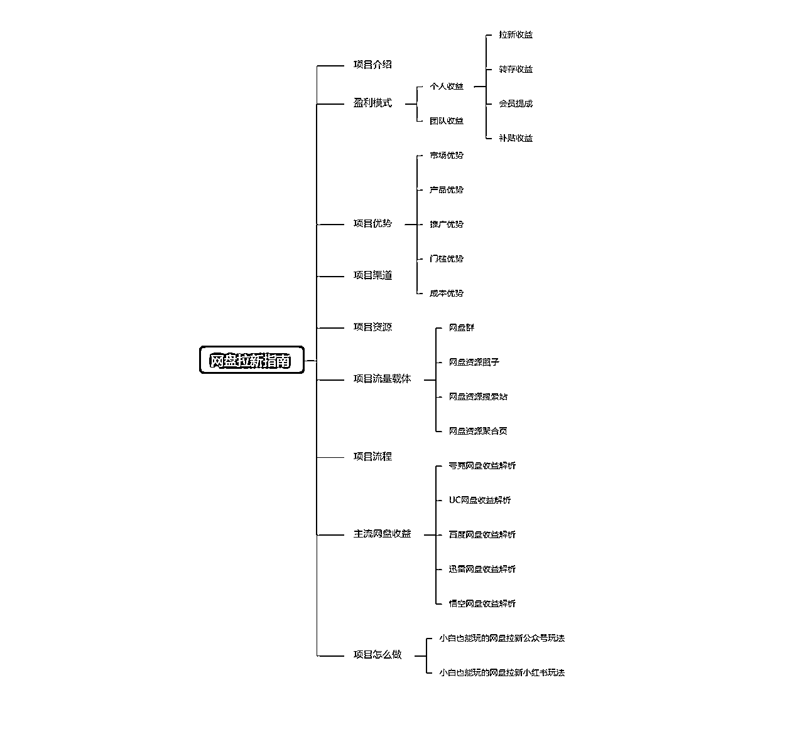
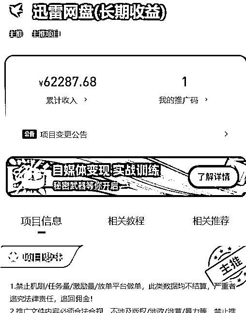
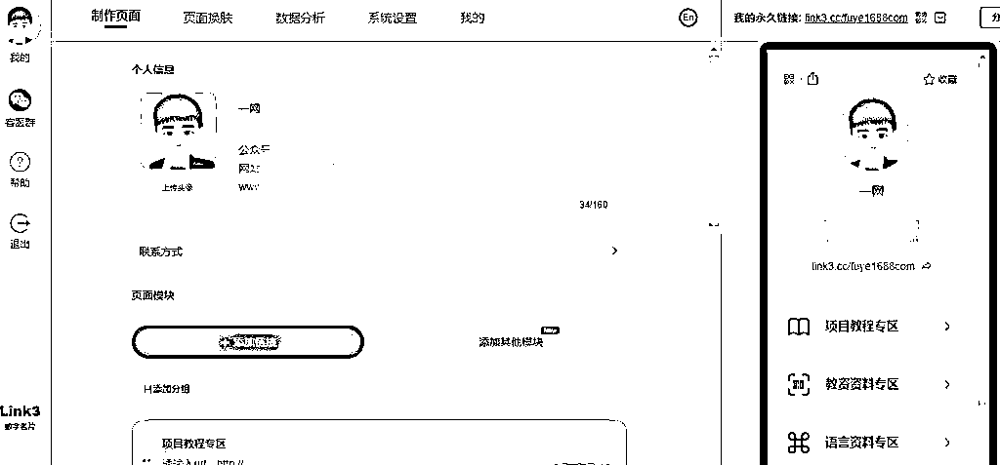

# 最适合新人练手的项目-网盘拉新

> 来源：[https://z7h6phhn3p.feishu.cn/docx/OqMcdYkxNoBzL5xZw0jcKe3Qnkh](https://z7h6phhn3p.feishu.cn/docx/OqMcdYkxNoBzL5xZw0jcKe3Qnkh)

# 自我介绍

我是一网，生财三年圈友，平常都是潜水学习，很少分享，在做网盘拉新项目之前，在生财搜索网盘拉新，没有看到一篇完整的实操教程，把网盘拉新项目走通后，我觉得可能很多的生财圈友，尤其是没有操作过网盘拉新的圈友应该也会有同样的需求，所以写一篇关于网盘拉新项目的分享。

一网V(2271033008),交流网盘拉新，请添加备注：生财圈友

一网新媒体导航（ https://yw456.cn/ ）互联网工具800+款，一起打包带走！

文笔有限，请多担待！

为了方便大家理解，我简单的做了一个思维导图，方便大家理解文章内容。

# 拉新渠道

直接点击下面的地址注册，然后下载APP登录，就可以看到网盘拉新项目了。

金牌拉新渠道对接入口：

https://dt.bd.cn/#/pages/login/register?invite_code=678678

金牌渠道邀请码：678678

渠道APP下载地址：

https://dt.bd.cn/main/app_download

注意：看不到网盘联系，可以联系一网

# 网盘拉新圈子：

网盘拉新圈子，是一个专注网盘拉新项目交流的社群，由一网成立！

社群的目标是让新手零基础做网盘拉新，从入门到精通！

社群交付：圈子社区+微信交流群+圈子教程+网盘资源+项目答疑。

如果对网盘拉新圈子感兴趣，想加入，直接联系一网V（2271033008)

# 加入网盘拉新圈子能解决什么问题？

1.新手福利，0粉也能申请推广码，协助快速申请，坐等审核；

2.海量网盘拉新资源，直接转存，省时省力；

3.网盘拉新各种疑问，一一答疑，豁然开朗；

4.网盘拉新内部教程，快速入门，快速推广；

5.网盘拉新圈友交流，同频交流，互助成长。

圈子即将进行升级，价格299，限时价格99.

99=一年网盘拉新圈子星球+永久微信交流群+圈子内部教程+项目疑问解答

算下来：平均星球价格每天不到0.275元！！！关键交流群还是永久的

不定时涨价，可能你下次看到就不是这个价格了

越早加入越划算！

# 项目介绍

网盘拉新的原理：各大网盘app为了抢占市场，获取新用户，而推出的APP拉新奖励活动，为了快速实现获取新用户，网盘厂商就得付费找机构付费推广，机构接到订单后，就会把任务上架到渠道平台里，我们通过对接渠道平台接单，就可以推广了，我们推广带来一个新用户，就会获得佣金奖励，奖励按照cpa的方式结算。

网盘拉新项目的收益大概是拉新收益、转存收益、会员分成和补贴收益

备注：什么是cpa结算？

CPA结算，全称Cost Per Action，是一种互联网广告投放效果结算方式，在这种结算方式下，广告投放的收益是根据广告投放的实际效果来确定的，即每行动一次，广告主需要支付相应的费用。这里的“行动”可以是用户注册、购买、下载等各种用户实际操作行为。

在网盘拉新项目中，新用户注册一次，就可以获得相应的佣金。

# 盈利模式

做网盘拉新之前，必须要先对接网盘拉新平台，而市面上的网盘拉新平台经常会设置二级分销，所以网盘拉新的收益分成两种：个人收益和团队收益。

## 个人收益

通过个人推广网盘产生的收益，收益主要有拉新收益，转存收益，会员分成和补贴收益

### 1.拉新收益：

用户转存你的资源时，需要注册网盘账号才能转存。

如果该用户以前没有使用网盘，那么他注册网盘，相当是你拉的新用户。

拉新收益大概4-9块，主流网盘拉新收益一个用户5块左右。

不同网盘的拉新收益不一样。

### 2.转存收益

只要用户转存了你的资源，就能获取收益。

不同的网盘转存收益不同

新老网盘用户转存的收益也不同。

### 3.会员提成

用户转存资源的时候开通会员，你就能赚取收益。

收益比例大概是会员价格的10%-40%的提成。

每个网盘的比例不一样。

### 4.补贴收益

一般在网盘搞活动才有，针对转存或者拉新达标的用户，给以额外的奖励。

网盘厂商会不定时有拉新活动的补贴收益。

## 团队收益

网盘拉新平台，往往都有分销功能，通过分销功能搭建自己的团队，你邀请的下级，你可以获得他推广佣金的一定比例。

不过这个比较很低了，以前通过团队赚钱还可以，拉新平台调整了政策后，现在基本上可以忽略不计了，真正想通过网盘拉新赚钱，只能自己推广。

# 项目优势

## 1.市场优势

各大网盘互相抢占市场，各种奖励活动相继展开，正处于红利期。

诞生了很多的新网盘，这些新网盘的新用户还很少，利于拉新。

## 2\. 产品优势

网盘作为存储文件的必备工具，具有自身独特优势。大多数人都有网盘存储需求，且需求量大。

## 3\. 推广优势

目前网盘的推广方式多样，可以结合教程、软件、壁纸、素材、短剧、音频、影视剧等，大大降低了推广难度。

## 4.门槛优势

对推广用户门槛低，任何用户都可以做，

对接网盘拉新渠道，网盘上传资源就可以直接分享，对小白友好。

## 5.成本优势

项目成本低，对接网盘拉新免费，网盘资源也可以免费获取，网盘的会员和存储空间可以通过拉新渠道平台获取。

# 项目渠道

网盘拉新渠道很多，大部分拉新渠道都是免费的，极少数的拉新渠道会收费，但是基本都是邀请制，没有邀请码往往注册不了，下面我给大家推荐一个拉新渠道，

之所以推荐这个渠道，主要这个渠道稳定性好，靠谱！

金牌拉新渠道对接入口：

https://dt.bd.cn/#/pages/login/register?invite_code=678678

注意：这个渠道，在信息完善那里，不要勾选地推或者任务量，不然看不到网盘拉新项目

任推邦邀请码：678678

渠道APP下载地址：

https://dt.bd.cn/main/app_download

https://apps.apple.com/app/id6475801745

# 项目资源

做网盘拉新，需要网盘资源的话，可以去淘宝买，你需要什么资源，就去淘宝搜索，一般几块钱就可以买到不少，大家也可以去一些网盘站点找。

考虑到有很多新手朋友可能没有资源，为了方便大家，我花了几天的空余时间，整理和制作了二个网盘拉新可能要用到的资源，需要的朋友直接收藏，然后尽快转存到自己的网盘。

大概有几十个T,，如果有需要，后面持续增加资源，直接批量转存就是！

1000T免费资源导航：https://zy321.com/（你想要的资源，这里都有，打不开的话，请复制到浏览器中打开）

# 项目流量载体

我们做这个网盘拉新项目，不能纯粹的给用户发资源链接，如果这么做，就很累，而且收益一般，没有积累，

正确的做法是我们先搭建自己的流量载体，然后在这些载体里面放网盘资源，当我们把这些载体分享给用户后。

用户可以在这些载体里面源源不断地转存资源，同时这些流量载体也可以作为我们多次触达用户的工具。

我把自己常用的这些流量载体分享给大家，下面一一介绍：

## 网盘群

简单的说，就是建立自己的网盘群，用于存放网盘资源，方便用户转存，当然用户转存的时候，你可以获得拉新或者转存的收益。

目前支持建群的网盘有百度网盘、夸克网盘、迅雷网盘

目前支持网盘群资料的转存也有转存收益的是夸克，迅雷网盘也支持，只是迅雷网盘必须先支持内测，百度网盘未知。

## 网盘资源圈子

网盘资源圈子，本质上也是为了存放资源和承接用户。

目前我研究了很多的知识付费社群工具，个人感觉目前就纷传比较合适，门槛低，可以建免费社群。

当然你想做付费圈子也可以，目前我是免费和付费的都做了，如果只是网盘拉新，圈子做免费的就好了！

比如我做的

## 网盘资源搜索站

网盘资源搜索站，我以短剧资源搜索站举例，他们本质是一样，演示如下：

https://kdocs.cn/l/cj0Xh9kxPO65

这种网盘资源搜索页面怎么建呢，下面给大家提供方法，不过我是以短剧资源举例，如果大家做的是其他网盘资源，就切换一下内容就好，原理都是一样哈。

### 网盘资源搜索站的搭建方法

### 一.准备工具

#### 1.网盘拉新平台

注册，登录，实名。

https://dt.bd.cn/#/pages/login/register?invite_code=494628

### 2.安装网盘

百度网盘、夸克网盘、迅雷网盘、uc网盘，这几个都可以做拉新。

#### 3.网盘资源

这里以短剧资源做举例，如果圈友做的是其他的网盘资源，这里就换成其他的网盘资源即可。

夸克： https://pan.quark.cn/g/adc40f8d27

#### 4.网盘批量分享工具

这款软件叫PanTools,需要在电脑端使用。

PanTools的使用教程：https://k7plkjw2y5.k.topthink.com/@g1rw33oj2o/ruanjianjieshao.html

下载地址: https://www.ilanzou.com/s/O6riGbD

#### 5、制作搜索机器人工具

微信扫码登录,建议放在浏览器收藏夹里。

https://www.kdocs.cn/latest

### 二、具体操作

#### 1、申请推广码

4个网盘注册登录好，在任推邦里找到对应的项目名称，申请推广码。

平台里面有详细教程，这里我就不讲了。

一般工作日1-3天就会审核通过，通过后就可以拉新了。

#### 2、转存短剧资源

打开我提供的短剧资源总链接，转存到你的网盘里。

如果提示文件数量太多无法转存,你就自己先创建个总文件夹,然后依次转存进去。

比如我的框架是[每日更新短剧] - [4月更新] - [4月5日更新] - [短剧合集]

你可以先创建个[每日更新短剧]的空文件夹，然后把[4月更新]转存进去。

如果转存时提示文件数量太多，你再新建个[4月更新]空文件夹，把[4月5日更新]转存进去，以此类推。

总之，一定要条理分明，要不然你后面分享的时候会乱套。

#### 3、批量分享资源

电脑打开PanTools,添加网盘账号，这里以夸克网盘举例。

PanTools的使用教程：https://k7plkjw2y5.k.topthink.com/@g1rw33oj2o/ruanjianjieshao.html

具体请看视频教程:

#### 4、 搭建搜索网站

电脑打开https://www.kdocs.cn/latest

具体请看视频教程:

以上就是短剧资源搜索站的搭建教程，上面是以短剧资源做举例，各位做其他的网盘资源搜索站，就依葫芦画瓢的操作就可以了。

## 网盘资源聚合页

聚合演示：

https://link3.cc/fuye1688com

备注：为了让文章有完整性，时间限制，我临时搭建的，页面比较简陋，如果你们要做的话，可以做完善点。

### 网盘资源聚会页的搭建方法

打开https://www.link3.cc/，注册登录。

在顶部设置个人信息，点击【添加链接】，输入文章和网址即可，右侧可以预览页面。

除了添加网站，还可以添加二维码、分组标题、分割线、PDF、图片等等。

全部添加完成后，点击右上角分享，复制专属链接推广即可。

# 项目流程

1.注册网盘

2.对接网盘拉新

3.保存资源在自己的网盘

4.分享资源给用户

5.用户转存资源

6.我们获得拉新或转存收益

7.收益提现

# 主流网盘收益

1.夸克网盘拉新

移动端拉新价格是5元一个，PC端的拉新价格是2；

会员分成的提成是30%，不分新老用户；

转存补贴1000次200块，结算时间是周结。

2.UC网盘拉新

拉新价格5.1元，转存收益1000次800元。

会员提成35%-40%，结算时间周结。

3.百度网盘拉新

拉新收益一个4.2元，会员提成10%-20%，提成收益会区分新老用户。

转存收益1000次200元，结算时间月结。

4.悟空网盘拉新

拉新收益，一个6.1元。

7日留存收益3元，结算时间周结。

5.迅雷网盘拉新

拉新区分链接和口令，拉新收益一个5块；

会员分成40%，支持群组转播数，但是需要参与内侧。

结算时间周结。

主流网盘收益对比如下：

拉新收益，大部分拉新一个用户收益5块左右，百度网盘最低，悟空网盘最高。

转存收益，目前UC网盘的最高，1000次800元，百度和夸克转存是1000次200元。

会员提成，迅雷网盘最高，40%的提成，百度网盘10%-20%的提成，夸克网盘30%的提成，UC网盘35%-40%的提成。

结算时间，其他网盘都是周结，百度网盘是月结

备注：

以上是任推邦的渠道做解释，可能不同时间段各个网盘拉新的收益不一样

# 项目怎么做？

## 小白也能玩的公众号网盘拉新玩法

对于新手来说，公众号玩法最简单，小白也可能轻松玩，我之所以分享这个方法，是因为这个方法太简单了，每天只需要几分钟复制粘贴发文章就行，主要获取搜索流量。

当然我也在测试其他平台的方法，后续在分享。

我通过这个玩法也拿到一些成果，现在正在放大中。

给大家分享一下，这个玩法主要是通过公众号发文章获取流量，我以短剧资源来举例，流程如下：

##### 1.注册订阅号

https://mp.weixin.qq.com/

如果你考虑做短剧资源圈子和公众号对应的话，名称的就写XXX短剧，然后你做的短剧资源圈子就取相同的名称。

同名主要方便推广和传播。

当然这里主要是举例，大家可以灵活一点，目前公众号不支持取名含有资源的字眼，这些字眼一般要求资质。

如果你不考虑做圈子的话，公众号名称随便写都行。

简介就写短剧资源每天更新或者短剧资源每天分享，欢迎关注。

公众号头像图片，你自己随意。

公众号菜单，这里就需要把前面教大家制作的搜索站页面和聚合页给弄上去，主要是引流用。

##### 2.搜索热门短剧

抖音搜索“热点宝”，输入短剧，选择近7天视频热度榜，就能找到比较热的短剧。

依次把这些剧名记下来，因为热度就是流量密码。

除此之外，我们还可以打开热点视频，看看下面的评论。

毕竟这些才是用户的真心话：

当然，我们也还可以去一些短剧推广平台（比如好省短剧）获取热门推广的短剧，正常情况下那些专门热门推广的短剧往往都是热门短剧。

##### 3.公众号文章发布

很多人一想到写作就会头疼，其实很简单，闭眼抄就可以。

一篇引流文章由标题、开头、内容、结尾组成，我们依次拆解。

第一种公众号文章写法：

标题：先搜索剧名，找到下拉词，然后用这些下拉词组成一个标题。

比如我在80后当后妈，我们可以起《我在80后当后妈全集免费，完整版观看，速进！》

开头：瞎白活几句，目的是带上关键词。

比如：最近我在80后当后妈短剧非常火啊，很多伙伴问我有没有全集资源，今天我就给大家分享出来，有需要的在文章最后领取。

内容：这个部分没啥作用，只是为了丰富文章结构的。

最简单的方法，公众号搜索剧名，找一篇文章复制下剧情介绍，再找几张剧照就可以了。

结尾：最后和文章开头首尾呼应，留钩子。

引流思路：文章后面放上我们前面讲的网盘资源搜索站，如果你做的短剧资源，你就放短剧资源搜索站

这种文章吸引的是精准的搜索用户，所以你一定要提前把你写文章的那个短剧资源网盘链接安排到短剧搜索站点。

第二种公众号文章写法：

这种文章就更简单，文章的标题都是固定的，目前可以写的标题关键词有：短剧资源每天更新，短剧资源更新，短剧资源分享，短剧分享，短剧更新，短剧更新合集....

标题：

随便以上面的关键词作为标题的关键词，前后面可以+时间或者加数字，比如短剧更新（一），短剧更新（二）.....

比如2024年1月1日短剧更新，2024年1月2日短剧更新......

开头：直接复制标题放开头

内容：直接复制短剧的名称

参考范文，看下图：

结尾：就做一下引导用户访问原文地址或者引导用户关注公众号，或者上一个，也可以在开头做引导。

原文地址就跳转到资源搜索站。

说明：公众号玩法，目前只要采用SEO玩法，所以一定要让关键词在文章标题出现，文章开头出现，文章中适当出现，文章末尾出现是做常规的做法。

##### 4.公众号玩法避坑

（1）文章不要标原创，有时候会被系统判断滥用原创

（2）文章不要出现网盘链接，这个可以避免侵权投诉。

比如下图，我之前没有经验，直接文章放短剧标题+网盘链接，这种效果还行，就是容易被投诉

唯一不好的地方是经常被投诉，但是大家也不要害怕这个。

做项目，引流被封号吗，被投诉是常事，被投诉和封号往往说明你的效果好，我做的几个号，流量效果好的都被投诉，效果不好的号一个投诉都没有。

遇到问题，不断思路，不断改进！

后面我改进一下玩法，就是不要在文章中出现人家的短剧网盘，这样基本上就没有投诉了。

（3）如果文章被侵权投诉，看一下你文章是否直接出现网盘链接，如果出现的话，后台直接承认侵权即可。

那个文章会被自动删除，但是不影响账户使用，不要等腾讯审核来判定，目前我做的好几个公众号，一个被投诉了几十篇，我全部承认，全部自动删除，目前账户还在正常使用。

##### 5.公众号引流思路

（1）公众号自定义菜单引流

（2）公众号文章提示回复

（3）公众文章末尾提示点原文链接

（4）用户回复的信息，如果没有对应的关键词回复，自动回复网盘资源地址或者二维码

##### 6.公众号玩法效果

（1）流量方面

别看阅读量不高，文章多的话，一个号一天的阅读总量可以上千。

上千的阅读量，大概能带来8个10个拉新，按照每个拉新5块钱，这个能赚40-50块，然后转存能够带来几十或者上百的转存次数，按照1000次转存200,100次转存也能赚20块钱，然后这些转存的用户，个别用户会开会员，

一天收益有几十块。

而且每天一个号只花几分钟复制粘贴，然后定时发布，不花啥时间。

关键是持续的做！

收益方面：

目前我这边测试的，一个号一周能有100-200，一个月一个号有1千左右，如果想赚多点，一定要矩阵号放大。

##### 7.公众号收益放大

（1）公众号矩阵

如果你一个公众号做到一天阅读量上千，这里指的不是一篇文章阅读量，而是一个公众号一天的阅读。

这时候可以考虑进行矩阵号，吧阅读量放大，把收益放大。

（2）流量载体互相倒流

我采用的方法是，公众号引导部分流量到纷传建圈子，引导部分流量到资源搜索站点，纷传建的圈子又引导回关公众号，圈子又引导部分进QQ群，QQ群又引导关注公众号，这样做的好处就是把用户装在不同的载体，一旦某个载体出现问题，还有其他载体能够触达用户。

这样的话，QQ群，公众号，资源搜索站，圈子等等地方都能触达到用户。

因为我们的很多平台都是搭建在第三方平台，实际上把全部鸡蛋放在一个篮子里，风险比较大，最好分开。

## 小白也能玩的小红书网盘拉新玩法

玩法思路，去找几个对标账户，模仿数据好的就可以

##### 1.注册小红书

进行小红书设置，头像随意，名称的话，如果你想获取搜索流量，建议包含关键词，

比如你做网盘资源的，可以设置为网盘资源，，，，，，

比如你做短剧资源，通过短剧资源拉新的，可以设置为短剧+其他关键词，或者短剧资源+其他关键词

简单的说让名称包含你想做的关键词，这样的话，用户搜索关键词会直接找你，比如网盘资源，短剧资源

##### 2.发布小红书图文

找几个做的好的同行对标就行。

一般常见图片都是直接把热门的短剧图片弄成一起，然后文字上写一下短剧的名称。

##### 3.建立小红书群

建小红书群的路径，消息-发现群聊-创建群聊

##### 4.小红书引流

发布图片，图文后面留小红书群，同时评论区引导加群里。

主页第一个图片顶置引流到群里

小红书引流，我们采用做法是：大号建群，小号当管理员，小号在群里发要引流的链接，这里我们发的前面教大家做的短剧搜索站（或者网盘资源搜索站），然后大号顶置小号发的信息，同时记得开启允对新成员展示历史消息。

这样的话，新加入的用户也能看到你之前在群里顶置的内容。

目前这种引流方法，我们持续了几周都没有问题，可能有部分圈友喜欢用群公告来发引流信息，但是容易被举报。

整个引流路径看下面：

备注：如果你想引导私域卖教程，就在短剧资源搜索站的公告栏加你的微信，如果你只是纯粹做网盘拉新，就不需要添加微信。

# 项目总结

网盘拉新项目是一个可以长期做的项目，同时也是一个躺赚项目，怎么理解？

首先新用户转存你的资源，拉新收益是一次性的，但是转存收益不区分新老用户的，如果你有1千个老用户，你只要你源源不断提供新资源给他们转存，1000次转存就是200的收益，所以你只需要不断更新你的资源库就行。

其次，网盘拉新项目已经存在好几年了，随着各种网盘加入，活动肯定越来越多，不说那么远，我个人觉得网盘拉新项目在做个几年应该问题不大。

如果你确实没有找到好的项目，建议你先从网盘拉新开始，先赚到自己的第一块钱，给自己有一个正反馈，自己后面做其他项目也更有信心。

网盘拉新这个项目，不说多，就认真做，赚回生财的门票钱，问题不大。

如果你自己懒得的做，把我分享的这个教程拿去卖，卖29.9.买给100个人，2999就到手了 ，哈哈。

网盘拉新，引流就是找对标模仿，有流量就放大，限制了看原因解决问题，尽量规避一些违规，要么换号，简单的事情简单做就行。

想，都是问题，做，才有答案。

如果觉得对你有用，点赞就是最大的支持！

一起生财有术，祝大家发财