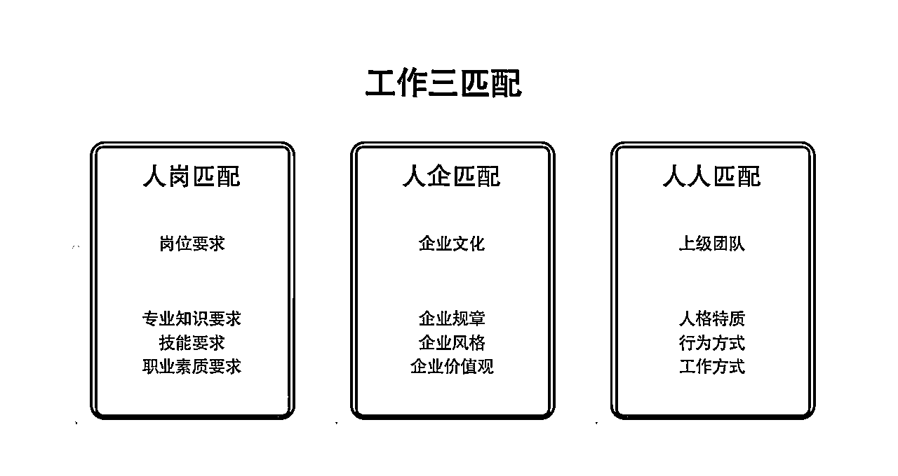
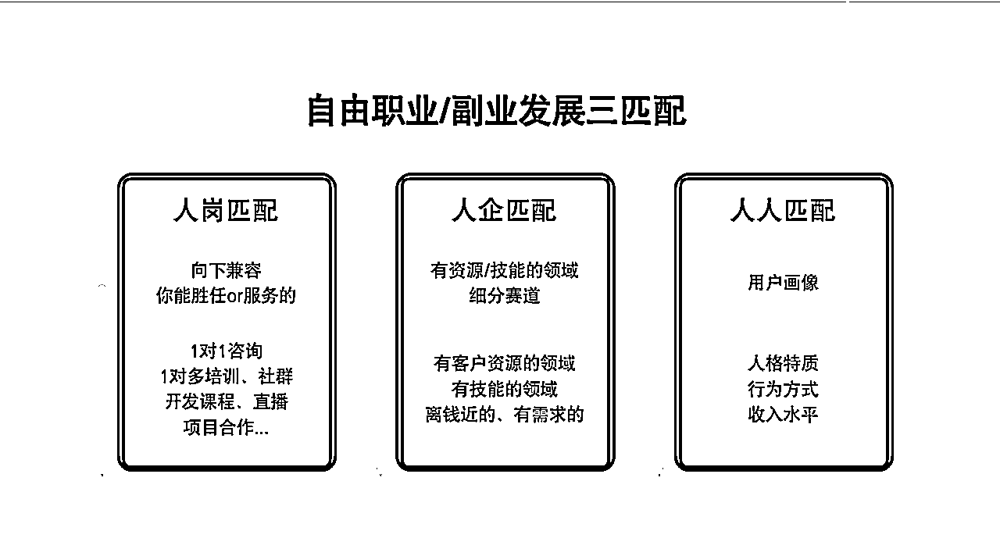
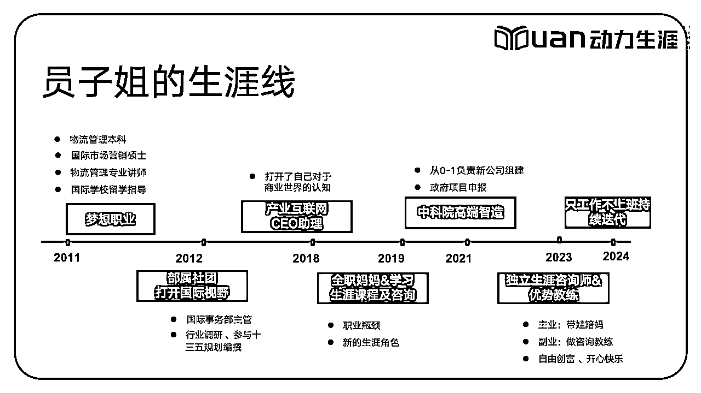
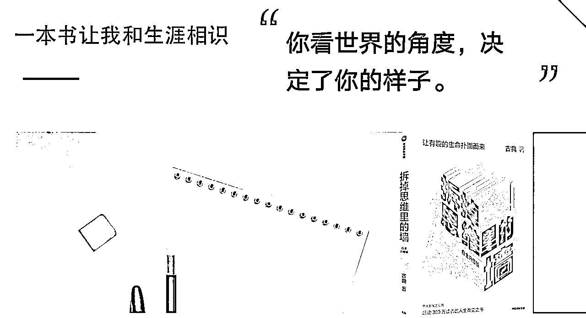
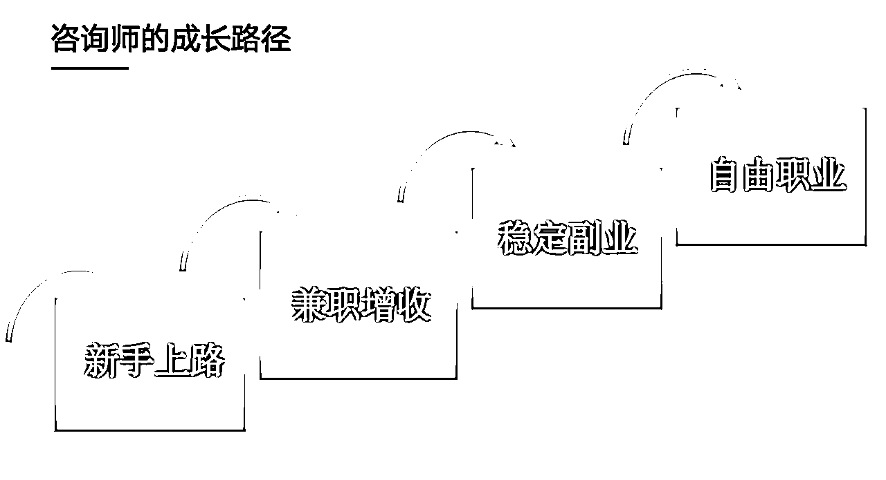
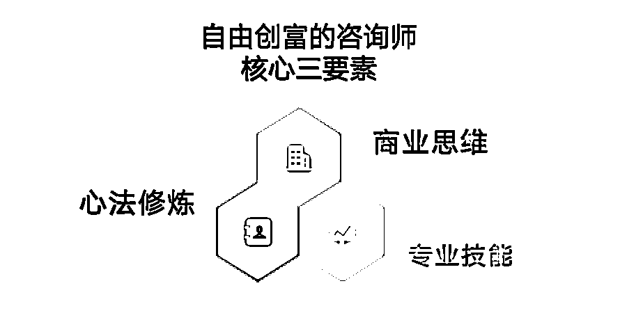
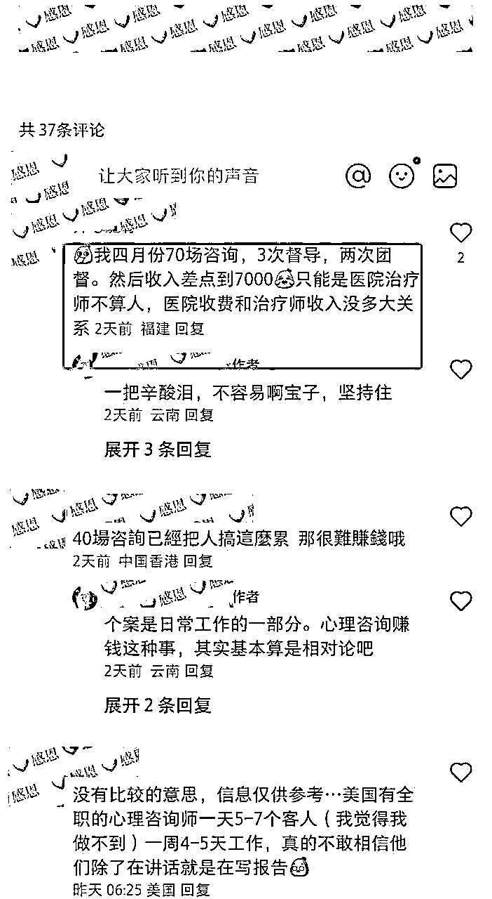
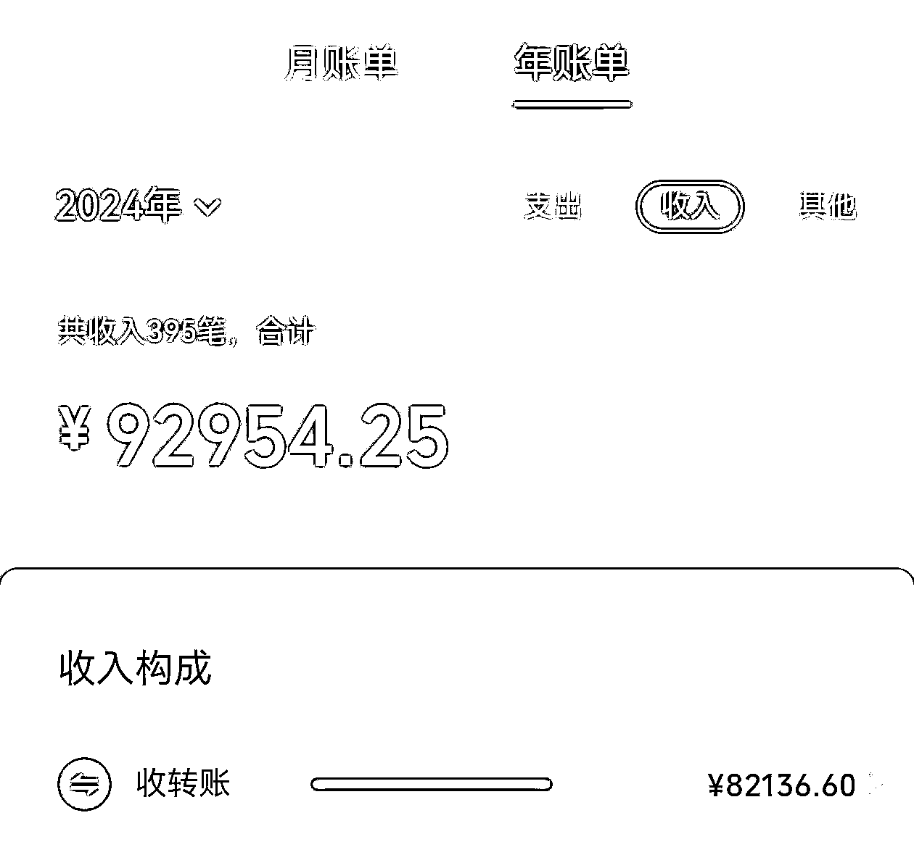

# 自由变现的咨询师成长路径大揭秘

> 来源：[https://gulggw6ggu.feishu.cn/docx/P1G3dfQKsomdwlxAOOgcrUBinfe](https://gulggw6ggu.feishu.cn/docx/P1G3dfQKsomdwlxAOOgcrUBinfe)

哈喽大家好，我是你们的老朋友员子姐。

我是一名生涯规划师、盖洛普全球认证优势教练、咨询师IP经纪人。

上次分享后，很多小伙伴找到员子姐，都表示对咨询、生涯规划、优势教练、高考志愿填报、家庭教育等方向感兴趣，但是却不知道该如何开启这咨询师的成长路径。

今天，员子姐就以生涯咨询师为例子，给大家分享一名自由变现的咨询师成长路径。如果你本身也对职业规划、优势教练感兴趣的话，可以对照今天的分享内容，判断一下自己的优劣势和所处的阶段，看看如何能够做得更好以及成长路径做到心中有数。

如果你不打算进入这个赛道，那今天员子姐分享的内容，成长逻辑上其实也是有助你去理解，如何从0到1去学习一项新的技能，成为自己的副业，然后逐渐过渡到主业的。

关于员子姐成长路径，大家可以看之前的分享内容

今天的分享有以下几个方面的内容

一、什么人适合做咨询师？

二、我该如何确定自己的咨询领域？

三、咨询师的成长路径和周期是怎么样的

1、咨询师心法修炼

2、咨询师的商业思维

3、咨询师的技法提升

## 

开始前，先小小互动一下，你们知道在个人创业者中最受青睐的变现方向是什么嘛~

生财有术之前做过“新个体创业”的调研，其中个体知识/服务IP、咨询师/教练/顾问、自媒体博主是最受青睐的独立变现方向。

很多小伙伴也问过员子姐，咨询师、教练、顾问还有培训师之间有什么区别呢? 我该如何选择呢？

那我们一起看看~

| 顾问 | 某个领域的专家，直接给建议、给解决方案 |
| 咨询师 | 一起挖掘和解决问题，如生涯咨询 |
| 教练 | 激发潜能，定方向，交付结果 |
| 培训师 | 一对多，上课讲授知识，快速的拉平认知 |
|  |  |

## 一、什么人适合做咨询师？

在了解了咨询师、教练、顾问和培训师的差异后，我们一起看看什么样的人适合做咨询师。

这里呢，员子姐以职业生涯咨询师为例子，当然这个逻辑也适用于其他咨询师，比如升学咨询师、心理咨询师、家庭教育、优势咨询、情感咨询等等。

先给大家分享一组数据，这个来自于生涯规划师头部培训机构。每年报名学习生涯规划师课程的人中，有80%是人力资源背景。

员子姐插播一下，我就是那唯数不多的非人力资源、心理咨询背景的人员。

作为职业生涯规划师，我们一般建议这几类人：

人力资源从业者

教育培训行业

心理咨询行业

企业管理者

为什么他们适合呢？

1、他们是距离客户最近的人。

像人力资源、招聘、猎头，每天面对的就是那些找工作的、想做职业规划的人群；

心理咨询，从专业的角度来说，职业咨询本身就是心理咨询的一个分支，也有一部分人是需要用心理+生涯方式去解决职业困惑；

教育培训行业内，像大学的辅导员、大学老师、教培机构的老师，他们每天接触到的客户也都是有职业规划需求。

企业管理者，自己有丰富的职场经验，是需求的感知者，也是解决方案的提供者。我们会发现很多人并没有去上职业规划师的培训课程，也没有认证，但是凭借着在职场摸爬滚打几十年的经验，也是一名很好的咨询师

以上这些人都是有客户资源，同时也有一定的专业基础。还有一个核心的点就是，他们的主业工作，和生涯咨询的副业其实是可以相互赋能，有很多交叉点的。

2、技能相近的人。

做为咨询师除了提问、倾听、总结三大核心能力外，其实还需要人际沟通、信息收纳、资源对接等能力。

所以，只要你以前从事类似的工作，和人对接，提升内在，帮人对接资源的，都是很容易上手的。

像心理咨询师、教练、猎头、老师、培训师，他们相对来说就更容易上手。

3、自己有困惑，并且成功从里面走出来的人。

那么员子姐就属于这类人，你能想到的职业困惑员子姐基本都经历过，我当初也是为了解决自己的问题，所以才去学习了职业生涯规划。

像我这类人，就有点久病成良医，你的感受我都懂，你踩过的坑我都经历过，所以知道你要什么。

## 二、我该如何确定自己的咨询领域？

先给大家看一下我们在求职时候的三匹配原则，员子姐在这个基础上迭代了自由职业/副业发展的三匹配原则。

### 1、优先选择自己有资源的领域。

员子姐接触了很多来访者，他们在选择职业方向或者副业方向的时候很纠结。这种纠结有两种情况，一种就是选择太多了，觉得自己啥都能干，啥都想干；一种就是选择太少了，觉得自己这也不行，那也不行，没有路可走。

这里很简单，选择一个能让你稳赢的领域就好。

这种稳赢其实两个层面，要么你有资源，初始的流量，要么你拥有初始的技能，能先打倒一大部分人。

举个例子，像大学辅导员、大学老师做生涯规划师，我一般都是建议做大学生的生涯规划师，毕竟每天工作接触到的都是潜在的客户资源呀。

像企业中高管，一般就建议做高管教练、企业顾问等；一是自身能力水平可以保证交付，二是有这样的客户资源和群体。

我3月份带了一个学员，她之前是在大健康行业做销讲师的，现在离职想转型做自由职业。因为自己养狗也喜欢狗狗，所以她一开始在抖音上做宠物赛道。发了几条视频没啥水花，内心很是焦躁。

这种就是没有好好利用自己的优势资源，其实她做销售非常的厉害，在别人的直播间听直播，都能发现好多可以优化的话术点。所以，找我辅导后，我就给她调整了赛道，做销转咨询师。在调整了方向后，她一下子就有了种如鱼得水的感受，每天工作的动力一下子也提升了几倍。

大家在选择自己的领域的时候，千万别忽略了自己眼前的金山银山，非要去开辟一个全新的赛道。

### 2、选择有支付能力的人群

这点特别特别特别重要。

首先，我们做咨询师前期会有公益咨询，但是不可能永远为爱发电，你一定是要开启收费的。

那么培训也好、咨询也好，都是脱离了一个人的基本生存需求的服务。

对于那些没有支付能力、温饱都成问题的人，即便你给他做了辅导，对于他们来说也是无米之炊。

对于这类人，不妨让他们先去解决生存问题，再来谈发展问题。我遇到这类人群，都是会给一些实际的建议，让他们找份能力范围内的工作，先有收入，然后再去找更多的发展机会。

所以，我们在选择的目标用户的时候，一定要找有支付能力，同时也有痛点的。

做咨询久了，你们会发现，能够支付高额咨询费的人，他们也更好交付，就像靠谱经常说的好的用户，成交即交付。

他们的认知起点高，一是你辅导起来就很轻松，一点就透，另外就是咨询费看上去很高，但是占他们的收入比例来说就很低了。

像员子姐上个月引荐的一名学员，一个电话就直接成交差不多2w的课程，特别的爽快，后来了解到，ta的年薪是90w。而且ta的成长速度特别快，学知识很快，行动力也在线，一个月的时间就开单收到了第一笔咨询费。

所以，选择有支付能力的人群也很重要。

### 3、选择向下兼容，选择自己胜任的方式（岗位）

这点也是员子姐在带新手咨询师过程中，很多人最大的一个卡点。总觉得自己学得还不够，知识技能还不足去给别人做辅导。

其实，每个人身上都有自己的闪光点，或者说天赋优势。

你一定是可以向下兼容，找到机会的，即便你现在的水平只有20分、30分，你也可以去辅导那些10分、15分的人吧。

这里还有一个点就是我们要用自己擅长的形式去工作，你像做咨询辅导，可以一对一的形式，也可以一对多培训、社群答疑的形式。无论选择哪些形式，只要你自己能够胜任同时能够持续下去，那就可以做。

千万别跟风，看到别人做直播赚钱，你就去直播；看到公众号现在又有红利的，你也去写文章；一定要根据自己的能力、自己的天赋优势来做判断。

## 三、咨询师的成长路径和周期是怎么样的

这里先给大家看看员子姐的成长线，我的成长线其实是普通人从探索开始，到开启副业，在过渡到主业的一个过程。

先是自己职业发展方面遇到了瓶颈，一个是生涯角色的冲突，多了妻子、母亲这样的生涯角色，同时也步入30+的职业中年危机状态。主业没有发展，浑浑噩噩，想跳槽转型，但是呢也不知道自己到底能做啥。

有没有小伙伴正在经历这些呢~

那时候我没有想到去发展副业，我是通过《拆掉思维里的墙》这本书了解到了职业生涯规划，然后我就报名去学习了生涯规划师的课程，一开始我真的是想解决自己的职业发展问题。

当我接触到生涯规划师，我发现我很享受做咨询、帮助别人解决问题的这个过程，就这样我慢慢走上了生涯规划师这条路。

大家可以看一下咨询师的成长路径，一般就是这样四个阶段。其实这个成长逻辑适用于我们大部分的想发展副业或者成为自由职业者的小伙伴。

很多小伙伴也会好奇这个成长周期，员子姐个人认为成长周期因人而异，这个取决于你前期的积累还有你真正想做成这件事情的决心。

像专业知识的学习，一般1-3个月足够的，但是这只是一个开始，因为真正的挑战在后面。

想成为一名自由变现的咨询师，专业知识相对来说是最不重要的。

### 1、咨询师心法修炼

在核心三要素中，员子姐把心法修炼放在第一位，把技法放到的了最后。

从交付的层面来说，成熟的咨询师，咨询技能其实相差不大，而一名新手咨询师如何从0到1跑通闭环，以及如何从1到10、从10到100去扩大自己的影响力，最重要的还是心法的修炼。

#### 心法一

你不仅是一名咨询师，同时你也要是一名销售。好的销售都是好的教练。

员子姐接触到很多新手咨询师，都很可爱的觉得客户会主动上来给你打钱，不需要去做任何的销售和转化的动作。

但是现实会啪啪啪的打脸，很多人公益咨询、免费咨询都无人问津，然后就做不下去，放弃了。

所以，作为一名能够变现的咨询师，你一定是需要做一定比例的销售工作的。（推荐靠谱的销冠群，一看销冠精华必定开单[呲牙]）

#### 心法二

注意力放在做事情上，而不是人际关系和情绪上。

把注意力放在如何解决问题、做哪些动作可以帮我们实现自由变现的目标，你能减少很多的情绪内耗。

靠谱说，努力只是成功的标配，每天的必修动作都没有完成（555），量不够就别谈变现。

#### 心法三

摆脱职场思维，转换到自媒体、创业者思维。

别总等着客户主动上门找你，要学会给自己布置任务、主动的去展示自己、主动的去找客户聊。

#### 心法四

你缺的不是专业知识，而是开启实战的勇气。

千万别等自己彻底想明白的了再去开始，最重要的是去做，一边做一边调整迭代，等你想明白，黄花菜都凉啦。

### 2、咨询师的商业思维

真正拉开咨询师收费差距的是商业思维。

这是我在小红书上看到，一个心理咨询师4月份的咨询量是70场，但是收入还不到7000元。 这种就是没有商业思维，也不懂商业模式，只能按次收费，挣的是辛苦钱。

很多人都好奇员子姐的工作量，其实我算是比较会用巧劲儿挣钱的。我一个月服务的新学员不超过10个，每天就3-4个小时工作，我的月平均收入在2W左右，好的时候3w+，差一点1.5w左右。

在上次的分享中我也提到了，我是如何打破一对一咨询的天花板，让1小时的咨询卖出了5000元的价值，其实就是商业模式。

举个例子，上个月我成交了一单粥左罗的顶峰会。这个小伙伴为什么想通过我加入顶峰会呢，因为她是咨询师但是不懂商业、不会变现，想让我给她一些指导，想和我长期绑定。我给她做一次深度的辅导后，ta后续6个月左右的行动计划就都有了。

这不就是商业模式嘛~

这里大家可以想想自己选择做咨询师、自由职业的初衷，不就是为了时间和金钱上更加自由嘛~那持续低客单的、大量的交付，是不是就违背了这个初衷呢。

咨询师的商业模式，要把自己从卖时间变成卖结果，给客户提供用心的陪伴和解决问题。

就像员子姐上面提到的案例一样，为什么这个小伙伴选择员子姐呀，因为ta看到了我拿到的结果，这就是从卖时间变成了卖结果。ta想要跟着我，拿到一样的结果。

### 3、咨询师的专业技能

最后，咨询师的专业技能的提升就四个字，持续练习。

咨询技能的提升是没有捷径的，就是不断的做咨询、做练习，然后去找专业的教练做督导。

以上就是今天的分享，相信对想成为咨询师的你一定有所帮助~