# 经过大佬引荐，实操3个月营收124万净利20几万可持续—企业信用管理项目

> 来源：[https://jiamiyuan.feishu.cn/docx/P7nJdDYEMoNjiOxBvatcu0qmn7h](https://jiamiyuan.feishu.cn/docx/P7nJdDYEMoNjiOxBvatcu0qmn7h)

大家好，我是双木林，base杭州，新生财友一枚，2024年4月16日加入（拍断大腿），之前公司在欧美金融城的时候就听说过生财有术，第一反应是骗子，这边🐶保平安，秉承着“教你赚钱都是割韭菜”的逻辑比较排斥知识付费，因此不幸错过生财（拍断大腿），今年在子文兄的安利下用他的账号拜读了很多生财的精华贴，突然发现找到了创业组织，果断通过邀请码加入了生财有术，正式成为了一个生财的朋友，加入恨晚啊！

### 简单介绍一下自己情况（流水账可以省略）：

15年设计专业毕业，工作小10年，之前在线教育企业投放负责人，主攻ASO\SEM\KOL投放年投放量在3000W以上，公司年营收过亿，并且公司vie架构也已经搭建完成，后面因为众所周知的730双减文件，行业迎来了至暗时刻（在此哭泣一下）

22年跟朋友合作数字藏品NFT从中间商转做平台，22年4月26日首发单品破百万操盘手，后面也是因为政策问题公安/公安压力之后选择退款息事宁人，无所事事了一段时间（有时间可以写一篇展开说说记录创业）；

### 今日重点：22年年底在一位老大哥的引荐下了解到信用修复这个项目，23年做了信用管理项目合伙人，从测试阶段投入3w产出12w，0-1测试完成之后，到后面大规模投放，投入三个月31w，产出124w合同额，实收50w，净利润20w的小项目，后续会源源不断的修复完成，尾款收到85%-90%左右；闲话休提，有图有证据，数据备份截止到2023年6月9日,

### 到23年底因为一些分润事情&产品路线上的争议跟原来的合伙人闹的不是很愉快，现在是独立一个人做信用管理师的创业哈，想要链接圈友一起放大相关项目；

截图来自于飞书多维表格yyds：

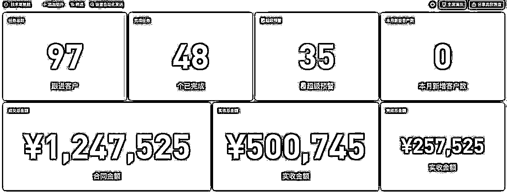

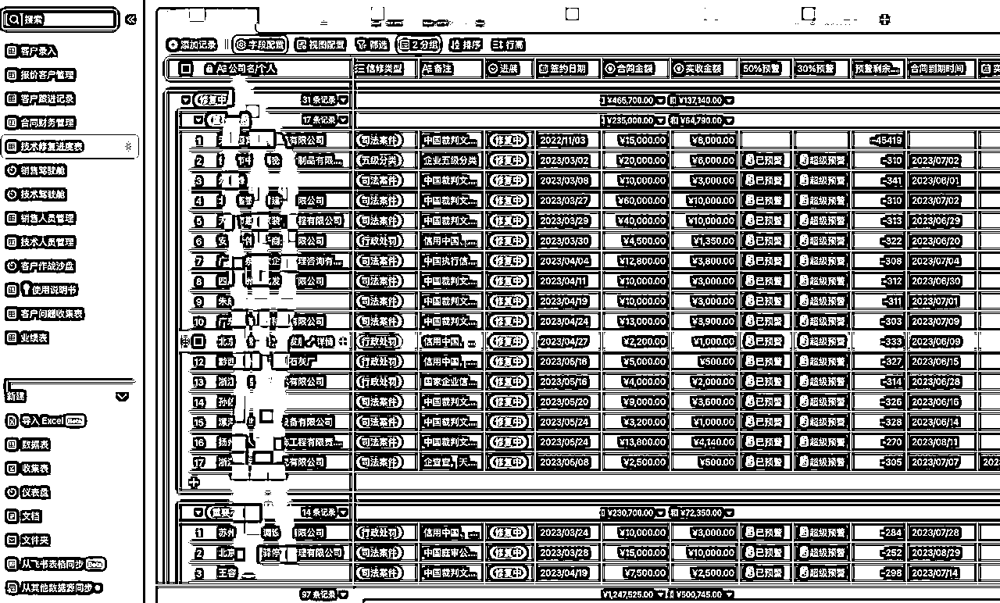

## 一、项目介绍

这个企业信用修复项目生财有位航海家Summer说的很清楚了，文章脉络借鉴一下哈！

这⾥的企业信⽤管理项⽬，主要是指企业信⽤修复，当然也还有⼀些其他，如做企业信⽤评估，企业信⽤等级认证， 企业 AAA 评级等。

企业信⽤是企业在市场经济中的通⾏证，是企业与客户、供应商、⾦融机构等各⽅建⽴信任关系的基础。 然⽽，企业在经营过程中难免会出现⼀些失信⾏为如⽋款不还、合同违约、逃税等，还有⼀些经营的违法违规⾏为，

这些⾏为将直接影响企业的信⽤评级和声誉。

企业的这些不良失信记录信息具体不好的影响有很多，如影响企业的资质认定、招标投标、政府采购、政策补贴、融 资贷款、商务合作、⼈才招聘、市场准⼊、客户⼝碑、上市评级等，这些都是企业的痛点，有痛点就会有需求。

为了帮助企业重塑形象，提升信誉度，所以这些企业就需要信⽤修复服务。

### 划重点：大部分客户过来的都是因为案件记录导致银行大数据风控卡住了，为了贷款来做的信用修复，那我们信用管理师的任务就是帮助客户—下架相关有来源的司法案件—处理相关的大数据风控平台—指导客户能顺利的达到自己的目的哈！下图就是一些成交的全过程；

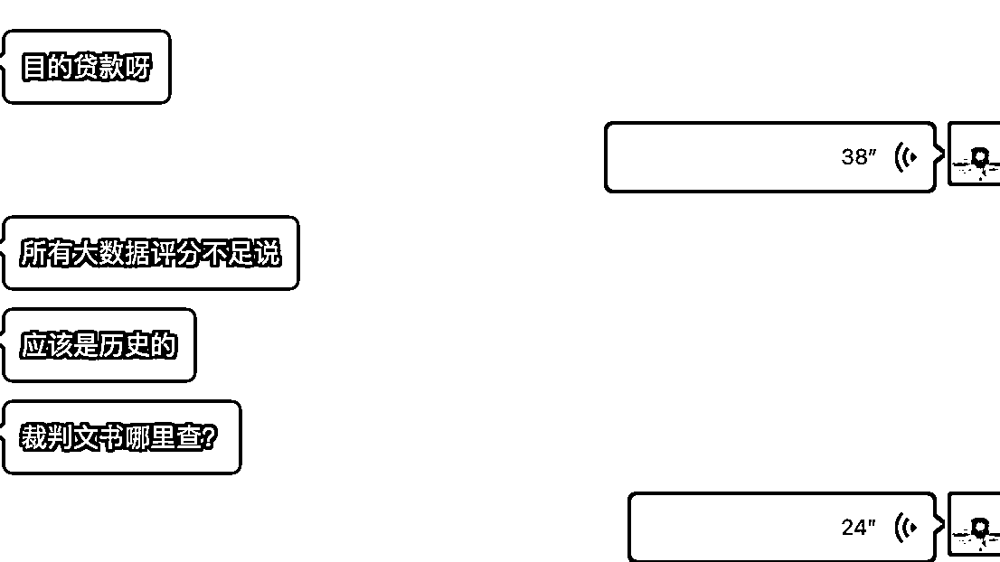

跟客户建立联系，主要是；

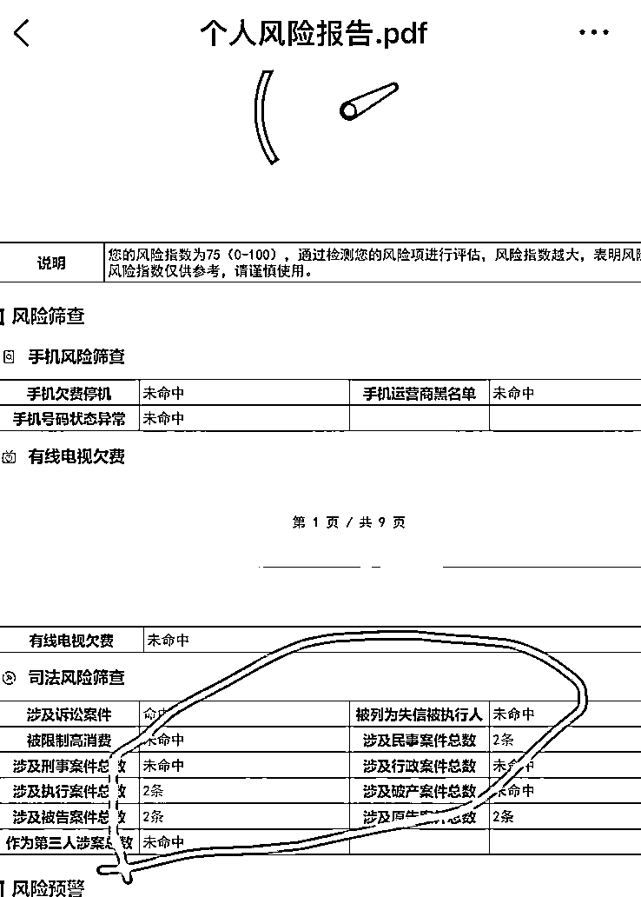

客户风险报告：

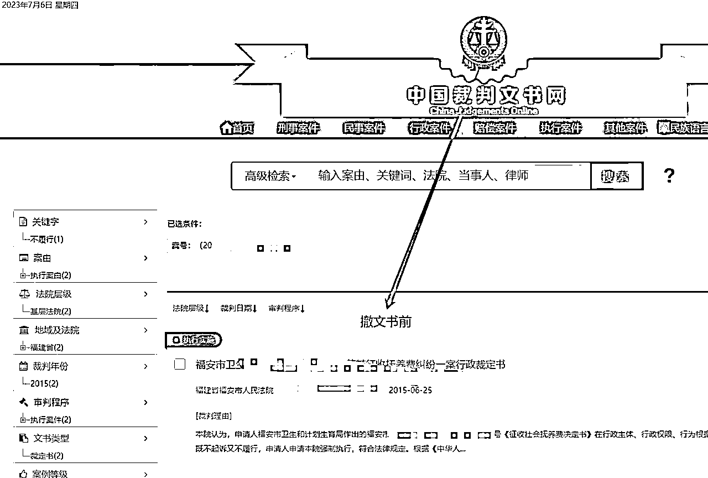

裁判文书撤销前

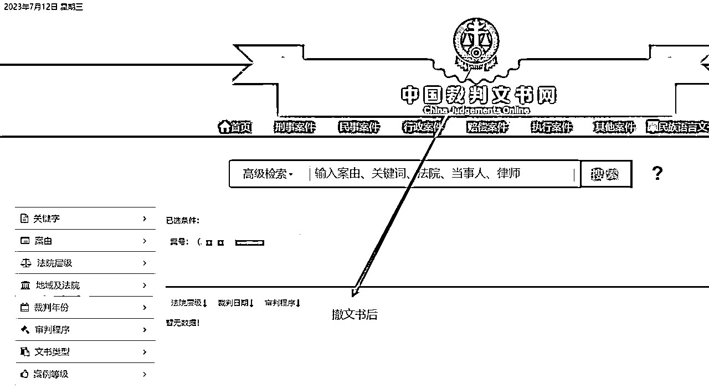

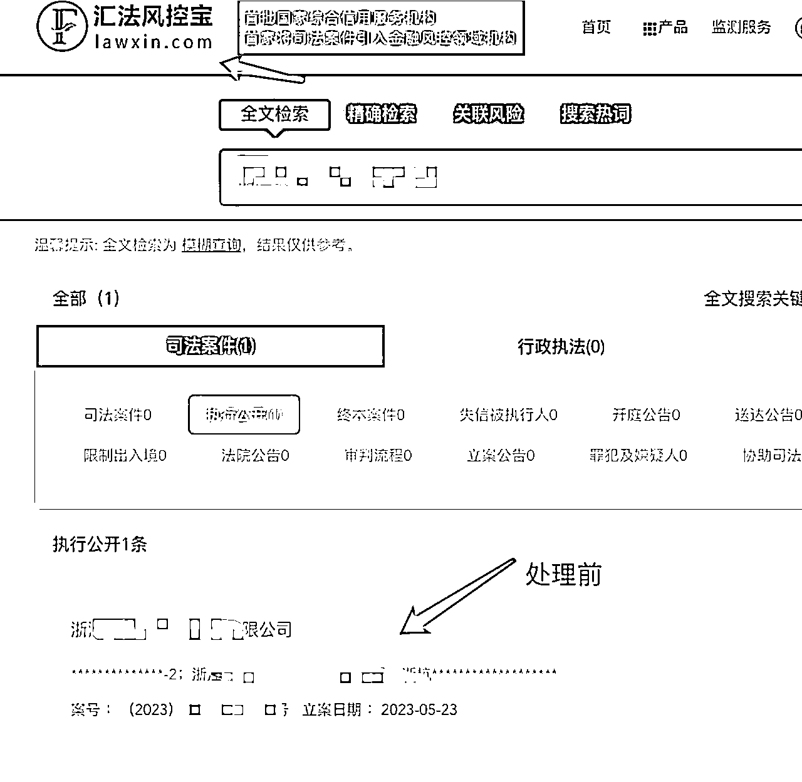

客户的大数据风控（其中一个，涉及机密不方便全部公开）

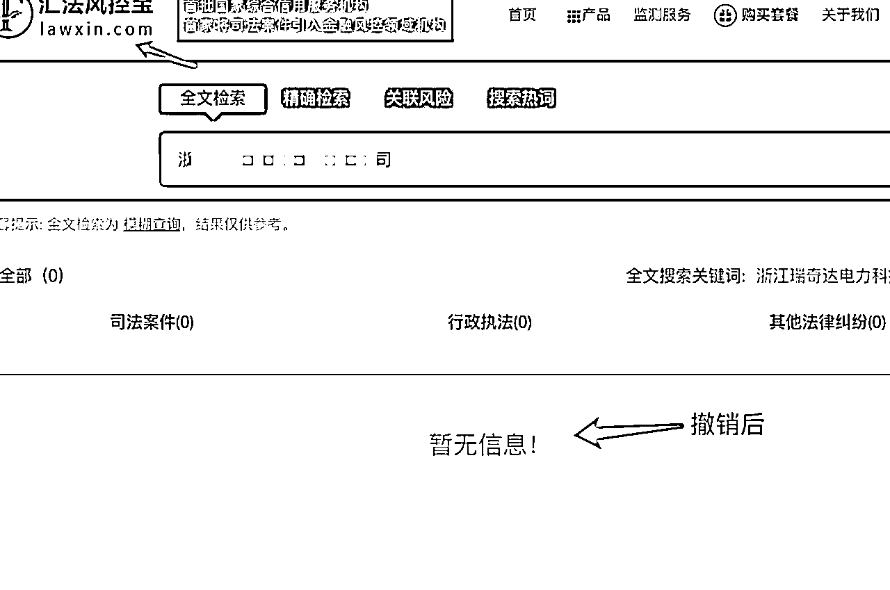

撤销完成之后，客户征信正常基本可以贷款啦！

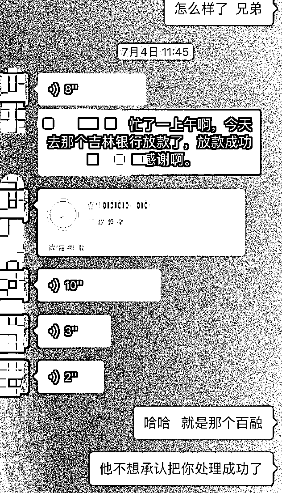

根据企查查的数据，全国范围内，筛选存在⻛险的⽬标客户，经营异常的有 1000 多万家，⾏政处罚有 300 多万家， 环保处罚有 30 多万家，裁判⽂书有 500 多万家，有失信信息的有 50 多万家，限制⾼消费 100 多万家，被执⾏⼈的 有 40 多万家。 ⽽且这个数据是动态变化的，每天都会有新的变化，做完修复的消失，新产⽣不良失信记录的增加。

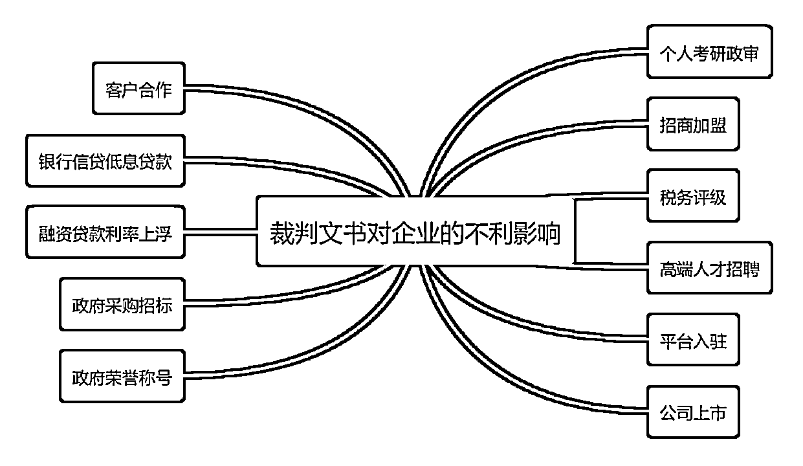

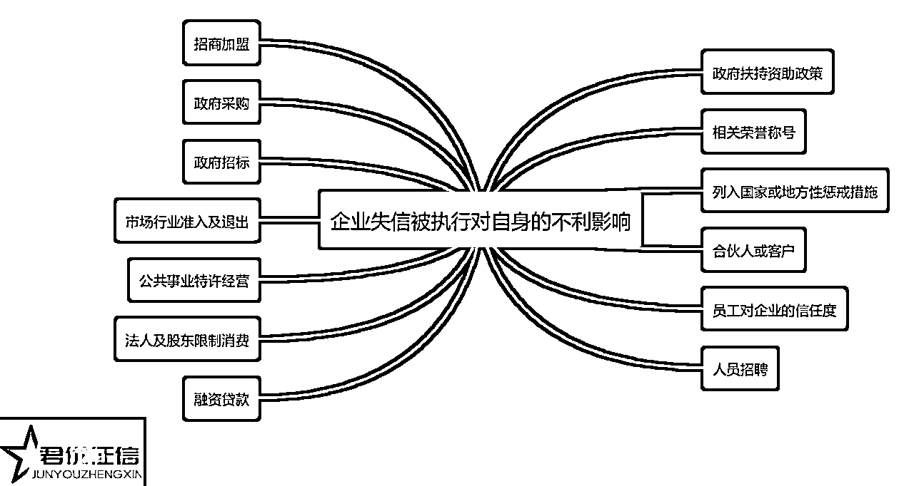

所以这个项⽬是可持续的能⻓期做的，能产⽣复购的，你这次给他完美交付，下次他碰到问题还会找你。

2022 年 9 ⽉ 30 ⽇国家发布了⼀个职业，叫信⽤管理师，企业和消费者信⽤⻛险管理⼯作的专业⼈员。 本人本着干一行考本证的想法，本人就去考了个证，在线打个码：

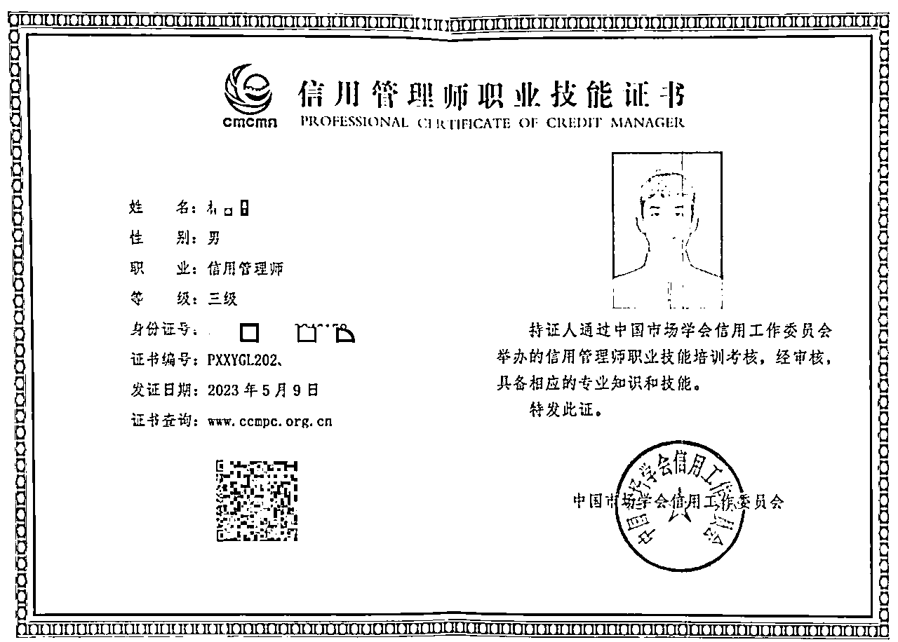

## ⼆、修复类别

企业产⽣的不良信息记录的种类有很多，公示的平台也有很多，有官⽅的有第三⽅平台的，⼀般给客户处理时会给他全⽹⼀起下架。下图红框内的不良记录都可以修复下架清零。

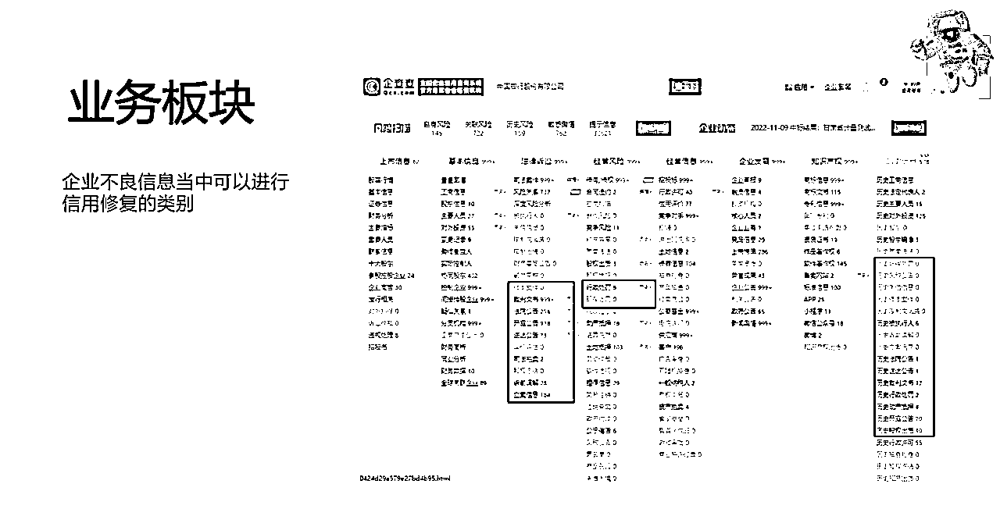

不良信息记录主要有⾏政处罚记录、环保处罚记录、裁判⽂书、其他诉讼记录、经营异常、失信惩戒、⽋税公告等

等。百分之⼋⼗的单⼦都是⾏政处罚、环保处罚和裁判⽂书这三类。

### 我们去修复的平台有：

官⽅平台：信⽤中国、国家企业信⽤信息公示系统、中国裁判⽂书⽹、庭审公开⽹、⾏政处罚⽂书⽹、执⾏信息公开⽹等。

#### 第三⽅平台：爱企查、企查查、天眼查、启信宝、⽔滴信⽤、企知道等。

#### 利润款疑难杂症：（衍生业务）

1、裁判文书：刑事案件撤销；

2、限高失信人处理：限高临时解除，解除一年，永久解除（这块可以单独讲）；

3、银行风控：汇法&法海&百融等；

5、第三方平台：假冒国企&票据违约&历史股权冻结等疑难杂症；

6、品牌危机公关（舆情监测，全网实时预警，全网处理方案）

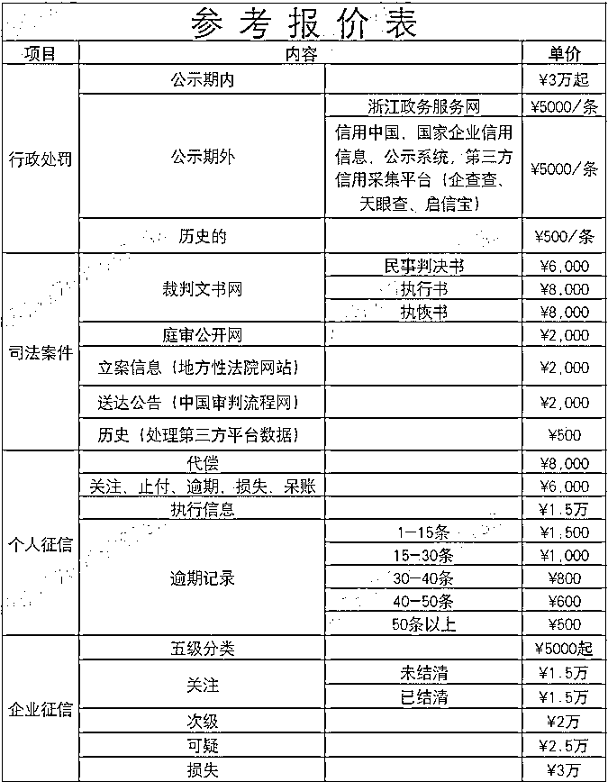

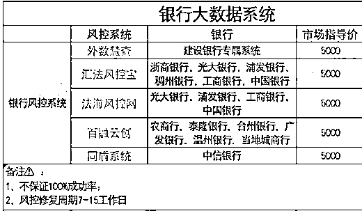

## 三、怎么拓客

##### 1、客户获取—— 三方平台 (企查查)

这也是传统的最简单最普遍的开发客户的模式，就是转化率越来越低，很多企业主也⽐较抵触这种营销电话，但仍是

有效的，在没有更好的⽅式时电销去扫客户仍是⾼效的⼿段，当你打的电话数量上去后，肯定会有⼀定的成功率。

所有⽬标客户都可以通过第三⽅平台导出来，并且绝⼤多数都会有企业联系⽅式。市⾯上也有专业的电销公司，在⾃

⼰没有销售⼈⼿的时候也可以试试跟他们合作，测试下意向客户转化率，计算投产⽐，能跑正就可以不停放⼤数量。

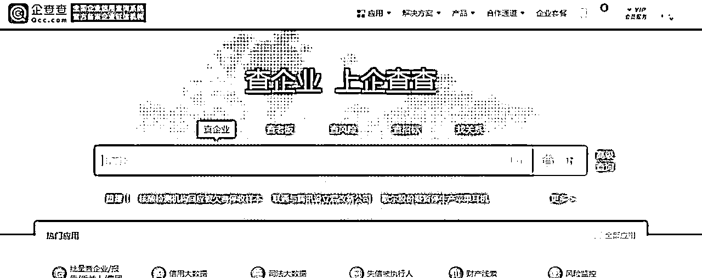

##### 2、线上获客

1、投放获客：搜索+信息流投放，这是本人强项，为了做这个项目本人23年还是经过了2周的细致调研，确定项目的可行性之后再去放手做的；

所有项目成功都是基于深刻的调研，做项目之前问一下自己三个问题：

*   项目有没有成功案例？

*   操作难度怎么样？

*   投入产出比算清楚没有？

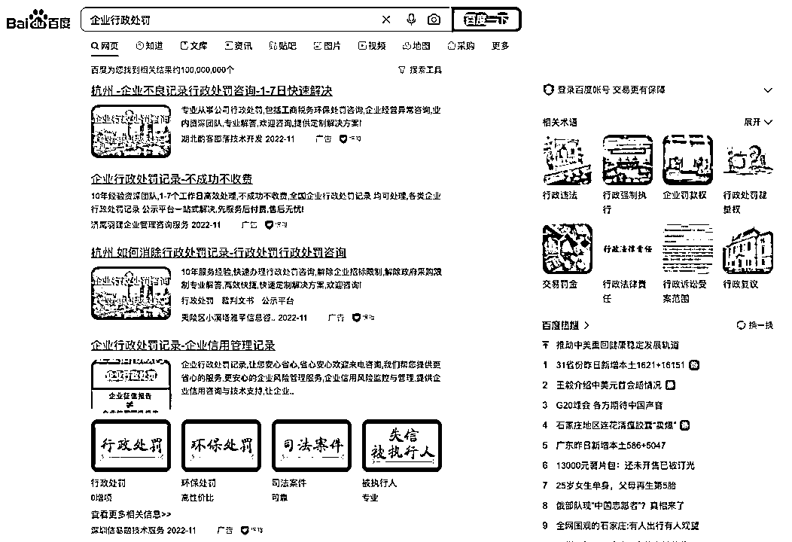

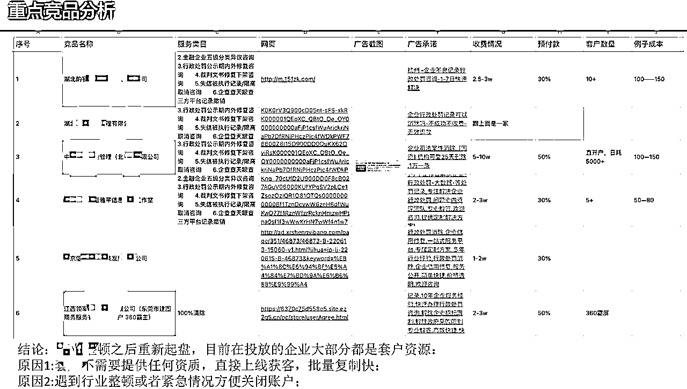

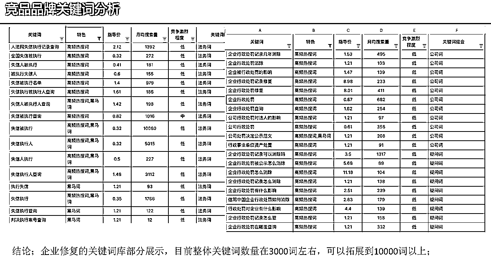

二、短视频平台批量运营账号，坐等⽬标客户，关于线上获客这⾥的⼤佬太多了，我就不班⻔弄斧了，去看看航海那些⼿册照着操作就⾏了。 目前平台上账号做的都不太行，敏感词也很多，封禁比较严重，本人是个INTJ性格的人，尝试着做了几个账号，确实有点难度，发帖也想要链接各位航海家想要尝试短视频+直播方式来获客，毕竟自然流是真的香啊！有没有杭州的圈友在做IP训练营的，咱们共同创业，一个人单打独斗有点累；

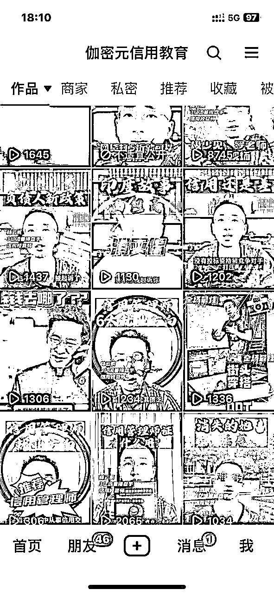

##### 3、渠道代理

很多⾏业⼿上都有不少企业客户群体，最常⻅的就是代理记账公司，银⾏信贷，律所，园区等。 所以也可以换个⻆度，去直接商务⽬标企业客户有时候不如去攻略这些渠道客户，让出⼤额分成，谈成⼀个渠道会成批的给你带单⼦。

4、客户转介绍

这块完全就是做服务⼝碑了。 我们也应该去做好服务，不⽌为了转介绍，也为了复购，以及维护良好关系后期的进⼀步转化。

5、官方网站获取（信用中国之前涉及敏感部分删除重发）

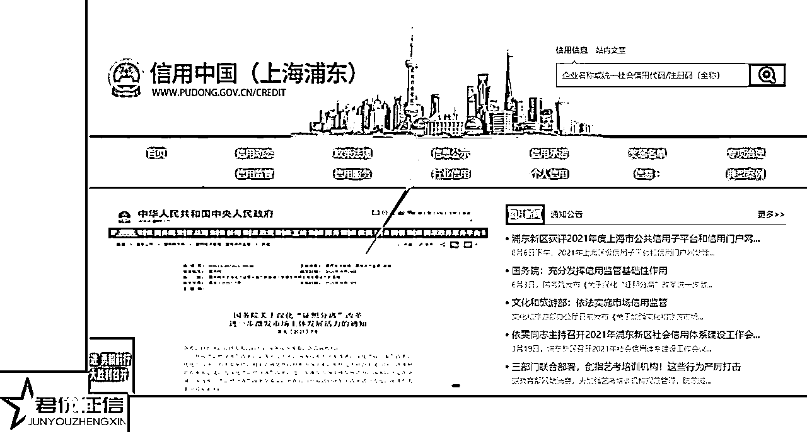

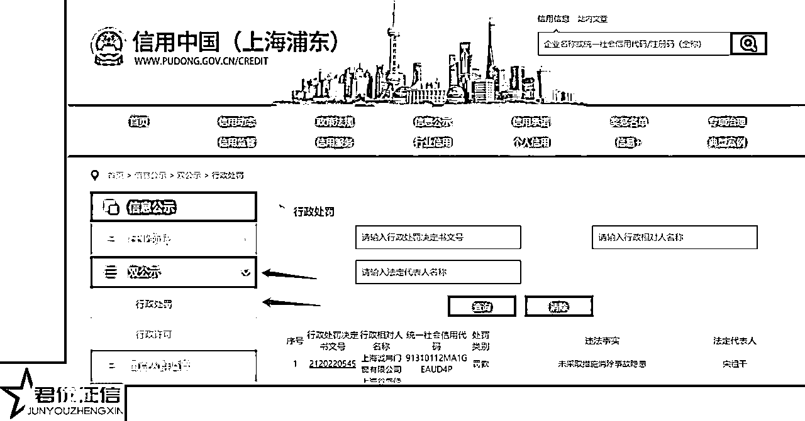

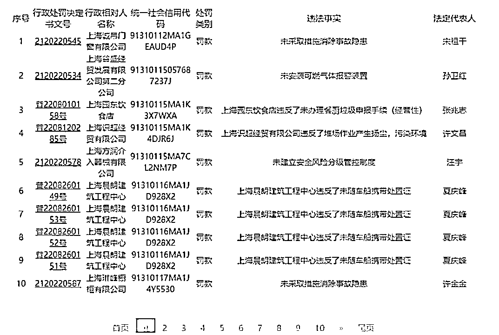

## 四、利润空间

市场规模极为庞大，发展空间极为广阔。听闻有每月业绩可达几百万的厉害人物，他们低调行事，从不张扬地在朋友圈中展示。就全国范围内而言，有着数百万乃至上千万家潜在目标客户。通过计算客单价，通常一单在数千以上，由此可知，理论上这个市场潜力是极其巨大的，而最终能做到何种程度，完全取决于个人的努力程度。

毕竟当下有很多企业主尚未形成强烈的企业信用意识，或许他们现在没有这方面的需求。但国家正在大力推进信用体系建设，相信往后大家的企业信用意识必定会越来越强。

这是我们当时对市场所做的测算，真的是非常可观啊；

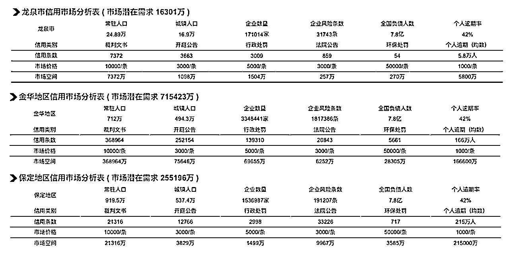

## 五、其他

总的来说，这个项目从本质上看其实是个"信息差"的项目，就目前而言，它算是一个相当不错的发展方向，但并不是适合每一个人。它对资源和销售能力的要求比较高，在前端，需要不断地对接并开发 B 端客户；在后端，则需要频繁地与政府部门联系，申请进行修复。有的人可能连法官的电话都不敢拨打，那这样的人当然是不适合从事这一行了。

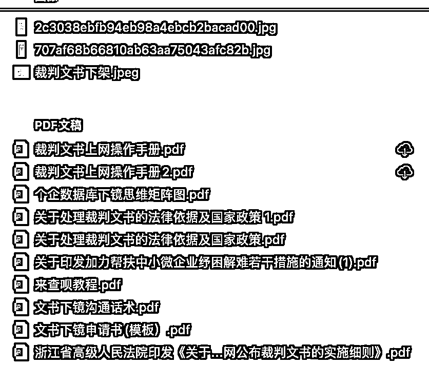

以下是我发帖的需求哈，第一次发帖不期待加精了，只想闷声赚点钱哈！

【我能提供的资源】 专注企业信用修复，一手后端技术支持，专业法务老师

【我需要的资源】 有B端客户资源或者财税等行业同行欢迎深度合作交流

诚邀前端合作，你负责转化我负责交付有客户，我帮你谈！！成交了 有钱大家一起分！！