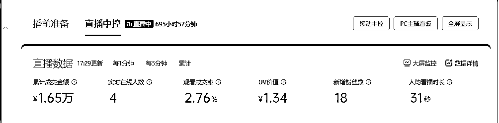

# 抖音半真人直播：新手小白7天GMV破10w，单日单号佣金破万！

> 来源：[https://hhkijeuq3w.feishu.cn/docx/PinxdM4llobM0yx4r8SclIffn0e](https://hhkijeuq3w.feishu.cn/docx/PinxdM4llobM0yx4r8SclIffn0e)

哈喽圈友们好，我是小溪，这次没有厂二代的标签，做这个是项目纯新手小白入场，从入场到现在也就短短三个月左右，中间经历过年和搬家，真正做项目也就做了两个月左右，目前做到7天GMV破十万，单日单号佣金过万，每月宗门大比，带领的小组成员二三十个人，连续两个月总GMV蝉联第一，第一个月小组赛总GMV46w，第二月小组赛总GMV138w！

#### 7天GMV破十万：

#### 单日单号佣金过万：

#### 连续两个月宗门大比小组赛蝉联第一：

以下是几许朋友圈截图：

在这插个题外话，最最好笑的是，学这个项目给几许转了1980的学费，然后反向“割”了他大概近一万，因为他特别喜欢发红包，然后激励红包都是最少1000起，加上各种小组赛奖励，群里单独给我个人转账就有七千多，不说了，第一次碰到这样的交付团队，哈哈，允许我再笑一会会~

###### 

除了晒一些业绩以外最想跟大家分享一下做这个项目的心路历程，我知道大家都想着急看干货，不想看鸡汤！

但是知道自己在做什么和喜欢做什么很重要，这关系到你能否持之以恒的做下去并且拿到结果。

生财有非常之多的项目，随便哪个项目稍微花点时间精力去研究，肯定能赚到钱，就是钱多钱少的问题，在做无人直播这个项目之前我也付费了很多项目，比如我自己做小红书还算有点成绩，按理说我应该继续深耕小红书，也能拿到大结果，但是，没有但是，可能是逆反心理作祟，就是静不下心来去研究，加上孕期没事干闲着也是闲着，然后付费试水了很多新的项目，

比如图文带货，比如ai虚拟，比如做私域，都是浅尝即止没有拿到结果，我没拿到结果不是项目不行，是我人不行，我实在是太懒了，做这些我一想到，我要做图，追热点，回复消息，做后端维护，天呐，又是走我自己主业的老路了啊，发货，运营，推广，销售，售后一条龙服务，那是真的很要命啊，骨子就十分之抗拒，所以没做起来很正常！（千万不要学我哈，我是因为自己有主业，做这些都是当副业做，所以有点挑三拣四哈）

好的，我深度剖析了解自己性格到底适合做什么以后，就在生财刷到几许的文章，就是这篇：《利用AI打造直播间，抖音无人蓝海搜索流，高效矩阵0封号稳定日入3000》

https://www.yuque.com/wishin/bn1ut0/wq3wyp7x232uuuix?singleDoc

我看完以后加了几许的微信，发个自我介绍，问了两句话，你好，有没有课程，多少钱，OK，好的直接转账，为什么付费这么干脆利落，因为几许写的文章很干货，哪怕不付费，看完文章也能直接干，但是时间就是金钱，我没时间自己去研究，所以花钱快速学习快速拿到结果.

刚开始我选这个项目，完全就是因为看重了这个可以让我偷懒，对的，你没看错，懒才是人类进步的第一生产力，无人挂机直播哎，只需要挂机无脑卖货，不需要上架，发货，当客服，而且没有品类限制，啥都可以卖，然后从中间赚取佣金就可以了，

天呐，这必须搞啊，以前对这种跟平台搞对抗的项目存在偏见，觉得都是小打小闹活不长，但是万万没想到，几许团队合伙人雨润和可乐做这个项目都好几年了，无人直播一直活的好好的，那一刻觉得自己真的一叶障目不见泰山，以后告诫自己一定要谦卑，不要妄自尊大。

###### 

废话不多说了，开始讲重点：

# 1：万万没想到，新手小白第一次开直播13分钟就出单

从拿到教学视频，到安装软件到跑通全流程，一共花费了三天时间，几许他们交付做的很好，新号开播都是可以找他们远程看看设置和软件是否有问题，基本上就是手把手教小白，比如你连软件都不会安装，比如你连链接怎么挂都不会，我当初就是这样连链接都不会挂，跟着大家在群里学习，

以下是我自己手写的笔记，然后群里小伙伴根据笔记整理出来的项目操作流程图，仅供参考：

然后就是这样万万没想到，自己慢慢摸摸索索搞完全流程以后第一次开播13分钟就出单了，而且客单价不低，150+左右，后面就是持续的爆单，后续做到第二天GMV破3万，佣金4000多，这个佣金也恰恰说明我有多小白，卖了3万才10%的佣金，按照我现在选品原则，10%都是直接pass，hhh~

## 首播13分钟就出单：

## 单日GMV破三万，成为当月宗门第一：

这样就靠这个品直接拿到了宗门第一，当时几许还单独给我寄了一个小礼物+一个大红包！

这个正反馈来的非常之快，所以更加坚定了做好这个项目的决心！

而且说个更加离谱的，这个直播搭建好了以后是我婆婆真人出镜的，我弄好稿子让她出镜直接念稿的，本人线下社牛，线上社恐，加上本来也只是测试玩玩而已，

终于知道为啥几许当初敢宣传什么100%出单了，这这这就非常之离离原上谱，要不是亲自证实了，就这样宣传的真的想把他当成割韭菜的处理了！

当然，看到这是不是非常激动，想要马上入局？

如果看完全篇还想入局的话，欢迎来卷，看到最后会发现这不是一个安利贴，而是一个劝退贴！哈哈

# 2：选品就是选人群，5个方法教你快速测试快速迭代

如果说第一次爆单是运气加持，连续两次，三次就是后天努力所得，选品对于做电商有多重要不在赘述，基本上80%的时间都是在选品，成功与否，选品占7分，技术占2分，勤奋占1分

以下是我不断迭代的选品方法1-5，仅供各位参考：

## 方法1：从身边人的兴趣爱好入手去选品

如标题所言，选品就是选人群，我的第一个爆品是做厨房电器类，选这个品理由很简单，因为我婆婆喜欢做美食，喜欢买各种小家电和厨具，要不是学了做无人直播没时间搞别的，大概率我就好好培养婆婆当美食博主，后续也能带带货啥的，嘿嘿~

第二个爆品也是我婆婆有一次跟我说她晚上睡不着，看一个卖衣服的直播间看到凌晨，后续我就试了一下服装，服装类GMV的确非常好看，但是佣金普遍只有10-20%，加上退货率贼高，谁不怕卷谁就上，但是出单是嘎嘎快！

刚开始测试就是小破笔记本+拼爹爹19.9包邮的绿幕，加一个敢于出镜的婆婆：

## 方法2：红海大类目虽然很卷，但是成功概率很高

冬天卖棉袄，夏天卖蒲扇！是大家都共有的常识，但是往往方法越简单就越容易被我们忽视，我们能很容易陷入找小众蓝海思维的怪圈，觉得自己一定要找一个没有什么竞争的类目和产品，达到人无我有的境界，然后走上人生巅峰！

但是现实会把我拍醒，无人直播靠的就是拼在线时长和搜索流量，博得一定的生存空间，不然别人真人直播间场景，主播，话术，优惠力度都吊打我们，用户凭什么买我们的？

前期没啥经验千万不要上来就找什么小众蓝海类目，一定要去找红海大类目产品，比如服装，美妆，鞋包，个护家清，食品饮料等等，只有这些类目才能有足够的市场和流量，去让你快速的拿到正反馈，随便一个产品细分就可以铺满200个链接，这些链接都有大量的流量和需求，你只要占住这个流量位置就可以，做好基本功，等着用户上门，自动成交就可以！

听人劝吃饱饭，真的，这都是实打实拿账号测试出来的经验~

商品分类这一栏都是大类目，可以仔细看看：

## 方法3：熬夜刷同行直播间，然后考古加看数据

哪有什么天选之子，哪有什么运气爆棚，都是深夜是睡不着的默努力，为什么要熬夜刷，因为只有无人才会凌晨还在开播，正常真人直播间哪有凌晨还在播的（也有那种24小时真人轮播的，测试是否真人，可以评论区问问题，看看主播是否回复），那就搞个小号，专门不断去刷各种无人的直播间，会得到很多灵感和惊喜，刷到觉得自己可以抄到跟同行80分左右的 就把抖音号保存下来，

举个栗子就是找这种类似无人的直播间：

然后去考古加重点看下这几个数据，考古加这个软件需要付费的哈（自行斟酌要不要花钱搞数据）

考古加网址：https://www.kaogujia.com/

1：看销量（看看近7天的销量，看看要不要跟），

2：品类佣金率（看下品类平均的佣金率，决定要不要做），

3：直播时长（确认一下是不是真同行，有的播了100多个小时都没下播，必须妥妥的同行）

4：流量渠道（推荐feed，搜索，付费，搞清楚同行流量从哪个渠道来的，不要看别人销量起飞，然后傻乎乎的对标付费直播间）

如果以上条件都符合，就可以直接抄，抄要像素级模仿，什么是像素级，同行的标题，场控，话术，商品链接的顺序，头像，简介，是否有发产品视频，全部都抄下来，别人能做起来肯定是有原因的，我们要找到努力这样的原因

（这里重点说一下，像素级不是让你搞得同行场景真的一模一样，跑去扒人家直播间，如果背景什么都一模一样会被判定违规的哈）

## 方法4：找到付费为主的单品直播间进行选品

到了这里才摸到一点门道，才停下来思考选品就是选人群问题，其实做无人直播，直播间的这种搭建对于真人直播来说还是很low的，当时我看的时候第一心想，这都有人会买吗？主播一看就是扣出来的，背景就是一个图片？

但是仔细想想，每个人接触的信息圈都存在差异，你觉得很假，别人不一定觉得啊

特别是中老年群体，对于这个感知就更加不敏感了，并且下单也很爽快，后续选品也都是围绕这个人群。

大家应该有刷到那种一个直播间只卖一个单品的吧，比如梳子，她就只卖这一把梳子，然后全程都是围绕这个产品进行讲解，不断的逼单，然后出单效率非常之快，这种玩法大部分都是低客单9.9-29.9之间居多，也有上百高客单的，然后这种直播间付费流量占比基本都是80-90%以上 ，

举个栗子：

这种直播间起量很快，下单贼猛！但是我目前还没学会玩这个的方法，但是我通过她们这样玩，找到了选品的方法，如果同行能愿意付费单独去打这个品，说明这个品有需求，那我直接找同需求的产品或者我也主推她这个品或者类似的品，我1号链接主推这个品，然后其它199个链接，挂差不多的同需求产品

比如：同行是卖锅的，那我1号链接主讲这个锅，然后其它链接挂上锅碗瓢盆，厨房用具，或者199个不同的锅，都可以，根据自己产品的品类数量来决定，懂了的小伙伴评论区给我扣一个1，hhh~

## 方法5：用测试出来的爆品，继续拓展品

如果测出来一个爆品，那就围绕这个品继续进行深入的拓展，拿我原先做的一个品给大家举例：

原先做过一个爆品皮草外套，那个时候刚好是过年期间，天气很冷，这个品就是刚好刚需，加上新手不懂，上去就干了服装，这个品起量非常之快，单日GMV破万轻轻松松，

根据皮草外套这个品，根据人群特点和需求，延伸到羽绒服，男士夹克，皮毛一体外套等等相关的品类，后续由于服装的佣金比较低和退货率高的问题就没有继续测，反正刚好给大家举个栗子~

其实很多品都符合这样拓展的特性，比如我卖个锅，锅也分很多种，章丘铁锅，不粘锅，涂层锅，小奶锅，辅食锅，每个品类进行细分，其实我们手上那点号根本做不完一个小小的细分类目的，记得发散思维~

如果测试的有一定的选品经验了，做出一点成绩，那就可以追求更高的收益，后续选品的时候会追求一下客单价，佣金率，店铺评分，商家是否愿意配合等等！

###### 

选品的方法千千万，适合自己的最好，除了以上这些选品办法，几许团队那边也有核心选品的方法，加上生财航海还有专门的选品航海手册，也有非常多好的办法可以借鉴！

# 3：单日佣金破万没有什么捷径，都藏在细节里

###### 

我记得单日单号佣金破万那天我特意跟几许说给我打个马赛克，我要低调做人，但是万万没想到由于头像太扎眼，打了马赛克都被大家认出来了，真真尴尬！

然后大家都一窝蜂来加我，问我有什么武功秘籍，但是哪有什么武功秘籍，其实都藏在细节里！

无人直播技术性的东西不难，搭建也就几个软件弄一下非常简单，操作几遍就能上手，真正核心的地方在于各种细节

## 1：直播背景画面怎么优化？

关于直播间背景的优化，团队内部有很详细的课程，手把手教我们怎么搭建直播间和优化商品链接，但是每个人审美不同，很多设计的点，没办法一下子就get到，比如可乐教了怎么把产品扣出来做成阿飘，就是那种产品在直播间滚动的效果等等，很多小细节的设计，能让直播间效果更丰富一些

我目前的方法还是抄袭优质同行，先抄后超，关于背景颜色，字体，是否有视频展示，是否有产品滚动，是否有文字循环滚动等等，都1：1复制下来，前期就是先测试，如果能跑量起来，OK，那我在深入研究一下客户需求，再根据 自己审美和理解进行创新和修改

目前做图主要是小红书找参考图,然后用ai做图软件进行以图生图，或者用稿定设计直接做好，稿定设计的一些直播背景模版已经能搭建出来一个效果不错的直播间了，还有抖音的巨量引擎——即创，这个网址功能也非常强大，可以写ai脚本，也可以ai生成直播间背景，有兴趣的话可以试试！

AI做图网址：

https://www.vegaai.net/

稿定设计网址：

https://www.gaoding.com/

即创网址如下：

https://aic.oceanengine.com/tools/live_scripts?source=jlcc&bpId=1763312072409160

## 2：直播间BGM怎么选择？

既然是抄就要抄到位，背景音乐也最好一模一样，如果同行也是不注重这个，没办法抄，那就自己去看去搜集热门爆款BGM，特别是可以参考短视频卖货的爆款BGM，还有那种大主播的直播间，也可以斗胆去看看，蹲一蹲，这种抖音搜索直播间背景音乐，一搜一大把：

一般月销能过百万的直播间，所有的一切都是设计好的，从背景到话术到什么环节用什么背景音乐都是有讲究的，学个几招都够我们做无人直播好好琢磨一下啦

千万别嫌我这点提醒的有点莫名奇妙，原先我带组的时候很多小伙伴上来直播间就放那种轻音乐然后念稿的比比皆是，所以细节细节细节！

切记，所有的方法都是提示和参考，要自己思考和结合产品，找到更适合自己直播间的音乐！

## 3：如何优化直播间自动回复话术和场控话术？

这个是通过一个叫小不点的软件，起到一个在线客服的作用，会用到其中三个功能，

1：自动弹窗（这个可以帮你把商品一个一个分别弹到直播间，可以增加商品曝光）

2：自动回复话术（相当于一个在线客服，可以根据关键词触发回复，我们可以设置好关键词+回复话术，比如客户问什么时候发货？如果你设置了"发货"这个关键词，然后添加一个回复，“下单24小时内发货哦”，这样哪怕你是挂机，不在线，客户通过触发关键词，直播伴侣的聊天框里面，他会自动@用户名去回复的），

3：场控话术（这个话术是会一直在弹幕下面循环弹出的，一般设置都是5-6句左右，讲一些产品相关的重点，比如：产品的优势，有运费险，放心拍下，工厂直销有保障等等）

自动弹窗设置一下就可以，场控话术抄袭同行也OK，重点是——自动回复话术这一点！

你问我怎么做到单日单号佣金过万？我问你小不点的自动回复话术 你一般搞多少条？你说大概10-20条吧，那行，

我告诉你我成功的秘诀是：自动回复话术一个直播间，把小雨滴的自动回复话术根据品的特点，总结至少100条出来（不管是去找商家客服咨询，还是看详情页，还是看评论，还是去拼多多，淘宝问大家，或者评论区找，想尽一切办法）

当然了，100条是有点极端了哈，就是举个栗子哈！有的产品实在写不出来也不用硬凑，但是我单日单号佣金过万的那个品，我就是真的做到了100多条自动回复，大力出奇迹！

这样不管客户说啥，都能回复上，这样如果做到了，你的号还做不起来，那真的命的问题，要知道我们可以挂整整200个链接，哪怕是瞎猫碰上死耗子都能出单！

这是一个很简单的逻辑，你去店铺买东西，咨询了客服不理你，你还买不买？

方法就是这么简单，就这，吾亦无他，唯手熟尔！有多少人知道但是能够做到呢？钱不是那么好赚的啊

## 4：直播间主播话术稿子怎么弄？

如果是前期先测试品，就直接抄同行就可以，用江小二软件录制同行的直播视频大概30分钟，然后保存视频用飞书妙计把视频字幕弄出来，自己对话术进行简单的语句和错别字修改，修改好了以后再放入巨量百应-预审工具里面审核一下有没有违规词就可以。

江小二软件：

飞书妙计：https://hhkijeuq3w.feishu.cn/minutes/home

巨量百应-预审工具：

https://buyin.jinritemai.com/dashboard/regulation/pre-audit

后期如果产品销量跑的还不错，就会进入自己根据产品写话术优化阶段（目前这个技能为0，还在生财里面搜集资料找圈友们请教学习中，如果这方面有经验的圈友，希望能带带我）

# 4：持续不断的优化才能拥有稳定增长的GMV

要一夜咋富，也要细水长流！大家是不是以为开播了，挂机了就万事大吉了啊~其实才刚刚开始哦，开播以后每天都要定时优化的，是的，做项目没有躺赚一说，市面上很多课宣传点就是轻松，躺赚，有手就行，每次碰到这种宣传的，我们小白就要警惕一下了，问一下自己，如果有手就行，凭啥是我赚？

就算是做同样的项目，同样的课程，有人月入过千，有人月入过万，有人月入几十万，上百万，差距就是在这种日复一日的每天优化一点点拉开的;

抽空整理一个账号从日佣几十，到日佣过千，我这边做了哪些优化动作：

## 1：软件方面：

①：小不点自动回复及时更新，每日定时检查小雨滴是否掉线，及时更新弹幕区客户咨询的问题和回复放在自动回复话术里面，用考古家爬取评论区，不断进行填充和优化

②：每日必看推广，推广的ROI和金额，每日截图发群里看看数据，是否需要加预算，是否需要换品

③：每日必看直播大屏，检查流量曲线，是否有断崖下滑

④：每日必看手机端后台违规管理或者抖音灵机查看是否有举报和违规记录

⑤：直播每隔6天重启一次电脑，挂机太久直播伴侣会出现卡顿，记得保存直播画面在五分钟内开机，直播画面会恢复！

⑥：每日必看用小号关注直播中的账号，检查直播画面是否有黑屏或者无画面，无声音，出现了立即检查或者下播

## 2：供应链方面：

①不断跟商家谈判提高佣金，用抖老板小程序绑定所有的账号监控和查看销量数据，一旦有哪个号哪个品出单超过10单，就可以通过精选联盟，选品车，商家客服，营业执照等等渠道找到商家，联系并且进行调佣，原先有个品本来公开佣金是50%,我卖了几十单销量还可以，赶紧找商家聊了一下调到了60%，都有点后悔找商家找晚了~hh

科普：抖老板是微信小程序软件，可以绑定n个账号，并且可以实时更新账号出单情况

②找到已经出单商品并且有销量的商家。找到联系方式，都导入到微信里面，一定要情商高一点，搞好关系，没事就问问最近有什么爆品，商家这边推一个品都是要花真金白银去测试推广的，所以他们前期会做大量的调研，这个比我们自己去碰运气选品会好很多

大家别学我这么黑心，40%的佣金还在找商家提佣哈，谁会嫌钱少呢！hh~

## 3：主播方面：

①在BOSS直聘等软件招募主播面试，试播80元/小时，通过后100元/小时（先发直播切片，确认没问题再邀约到线下来播，一般都是约好一次播3-4个直播间）

②优化主播规范事宜（以下话术是主播来线下之前提前发给主播确认，节约彼此的时间）

1：如果近视，需要自行佩戴隐形眼镜或者眼镜到场

2：主播没有权限且不要动电脑页面任何操作，比如下播，比如操作软件，比如点击页面等等，有需求随时找运营，运营这边来操作电脑（主要是原先遇到过主播手滑下播的情况，说多了都是泪~）

3：对镜念稿，话术稿子都是逐字审核过的，切记不要擅自加词，加词不当容易导致违规，不听劝阻擅自加词，导致违规出现问题，时薪减半

4：我们直播是需要录制并且24小时不间断循环播放的，需要同意录像的使用权，认可即可过来试播哈~

目前还有用绿幕录制的主播也在测试阶段，这样主播在家就能录制，只需要发1个小时的视频给我就可以，可以更加高效解决主播的问题，还没测试出效果就不讲解了哈~

## 4：盘点那些年我踩过的坑，记下来能省很多钱

1：标题，文案，直播封面，口播话术，不要出现清仓，青仓，加关注，扣评论+优先，加急发货，现货，7天无理由等促销违规词，扣除信用分0.5分

2：注意一个商家店铺可能会出现同一个产品，不同的主图和价格，比如我找到一个锅，这个锅，商家做了两个链接，一个卖129，一个卖229，如果不小心都添加到直播间里面，会被判定低价引流误导消费者！扣除信用分0.5分！（200个链接自行到选品车核查）

3：评论区回复客户，不要用绝对词，要模糊词，比如有没有运费险，要说大部分都有运费险，不要说什么都有运费险！

客户问发货时间，材质，尺寸等等问题，除非你确认或者了解，不然最好的话术就是家人们可以点击小黄车找客服，不要自由发挥，说多错多！容易违规！

4：没事多看看手机端-全部工具-体验-违规管理，不要被警告多次都没反应过来！

5：遇到缺德商家怎么办？有的商家看你出单了会把佣金调成1%

①用抖老板小程序绑定账号，及时查看出单信息和佣金比例，商家如果调整了佣金第一时间就能看的，

②这种商家产品尽快下架，半夜爬起来都得去下架！

③把不会随意调佣的优质商家店铺名记住，搜索店铺名上架更多优质商家的产品！

④如果优质商家商品无法满足，继续精选联盟选高佣产品无脑上架，然后循环这个流程，直到没有缺德商家~

6：小不点软件的自动场控和自动回复，一定要记得导出备份，不然可能积累了近100多条自动回复话术，软件更新或者系统崩溃啥的，就会没了，除了心痛，别无他法，只能重头再来！

7：口播的话术稿子里面要加入互动话术，比如欢迎xx来到直播间，感谢xx下单1号链接，xx就是用户昵称，瞎编一些用户昵称，加入到口播里面去，尽量每隔几段话就出现，可以避免无互动违规

8：口播话术是最容易出现违规的，抖音的巨量百应-预审工具，这个只能审核比较常见的违规词，具体还有什么话不能说，还是需要人工审核然后不懂的咨询客服进行修改！

9：一定要注意自己的口碑分数和商家的店铺评分，一旦低于80分，不止会限流，也会连投放也投不出去，账号基本属于半瘫痪状态，我们有时候会遇到商家给的佣金贼高，但是他店铺评分很低，这个时候一定要取舍，不要贪念那点佣金把账号弄废了，店铺评分低于80分的商家都直接清退！由于这个评分是动态的，商家可能今天85分，明天变成80分，所以要记得每天都去选品车看一下！

10：万万没想到，背景音乐也不能乱放，背景音乐用中文歌，中文歌歌词如果有问题，被识别出来也会判定违规，天呐撸，终于找到原因了，有的时候一些违规都是莫名其妙的，这个要切记了！

# 5：从0-1已经跑通，希望矩阵和投流能让我从1-10，10-100

以上的分享截图数据都是5-6个号进行的，可能是运气比较好选到了爆品，所以拿到正反馈很快，但是这个总归是个要与平台相爱相杀的项目，要跟着几许他们不断地升级玩法，规避一些平台突然的偷袭，比如非实时强行下播，比如直播中突然出现滑块验证是否真人在线，比如小不点软件突然罢工等等。。。

## 第一，矩阵账号+如何用他人实名绑定自己收款

如果就守着这几个号，一旦某个号出现违规，或者限流，就很晦气了。

目前陆陆续续从七大姑八大姨那边弄了十几个号，然后也找宽带安装师傅用分光器等操作弄了十几根网线，目前电脑还是租的，租了10台，一共租了两个月，打算后续项目测试稳定了就直接买下来，买下来还是更加划算一些

这个文章写了有十几天，断断续续的，拖延到现在目前账号都在陆陆续续播了，这期间测试了很多品，也验证了很多想法，矩阵号可以快速的测品，提高了很多效率，

大家千万不要把账号看的太重要，多准备几个号进行测试这个项目就是废号的，也不算废号，最严厉也就是封禁30天，一个月后又是一条好汉！

但是一旦测试起来，爆发力也是很强的，我目前有个品从过年做到现在一直都很稳定出单，每天能平均做到300-500元佣金，偶尔爆发一下冲到1000佣金没什么问题！原先最猛能做到单日单号佣金过万，就是这一个号！

这个品本来是一个账号卖起来，后续由于挂机挂了快二十几天，大概估计是电脑带不动给强行卡下播了，然后又遇到315抖音严打时期，被封了30天，后续进行申诉，申诉改判为停播7天，

示例：很多账号基本都是能挂几百个小时

那这7天肯定不能闲着啊，就立刻重新账号新开了一个直播间，同样的品同样的话术同一个主播，继续开播继续有成交，所以不要被账号局限了有条件多搞几个号！

如何用他人实名账号绑定自己的收款账户：

前进笔记文章链接：

https://mp.weixin.qq.com/s/kfGHHSaBRYk3cLnIJ5NTCA

## 第二，学会把花钱把收益放大，投流是必不可少的

抖音真的是为了让你好好做内容，让你不要搞一些花里胡哨的操作，把投流工具搞得简单又无脑，这也是对自己算法的绝对自信！

投流目前就两个工具：

1：随心推（手机端）

2：千川（电脑端）

随心推玩的不好就变成了随心亏，目前我玩这个也不是专业，关于这个玩法有很多很多，还需要继续深入研究和付费学习，

目前我用随心推就是测试一下主播状态和话术能不能吸引用户停留，每次开播的时候花费100元，选1个小时，然后智能推荐，选成交，拉一下人群，测试一下自己的直播间和主播话术能不能留住这波付费流量，如果能成交那就继续播，拉长时长，目前就是这样浅尝即止的投放，没有很大的投入进行很大的投入~仅供参考

玩的不好就变成随心亏了，以下就是惨痛案例，引以为戒：

千川的玩法目前就是几许团队这边教的千川投流玩法，方法很适合小白，但是目前还在测试阶段，目前也有一些账号拿到了一些成绩，但是还没有形成完整的方法论，在此就不赘述了哈~以免误导大家，后续有了方法论再来跟大家详细分享！

生财也有很多投流高手，有很多关于千川的玩法，大家可以搜索看看，但是如果不懂不要轻易去投哈！

投放这个重点说一下，这个是锦上添花的动作，不是你随便搞个垃圾直播间，花钱就能起飞，投放是在自然流跑的还不错的情况下，再上去花钱推一把的动作，切记 ，不要把这个当成救命稻草，以为花钱就能解决一切~

其实大家看到这里，其实也会发现，稍微认真听课，执行力拉满做项目，一个月赚个几千没太大什么问题，难的从来不是从0到1，而是从1-10，我目前的成绩是可以一个月下来稳定在日佣过千，但是如果我想稳定保持日佣过万，就需要更多的时间精力去专研去学习，不管是矩阵扩号，还是提高自己直播间的质量，市面上非常多的玩法有待测试，我也正在尝试慢慢解锁。。。

这篇文章是五一假期期间写出来的，可以看下抖老板实时销售截图：

7天和30天实时销量截图：

无人直播我很看好的从来不是躺平这个宣传概念，而是从这个项目里面，可以嫁接这个可以延伸非常多的玩法，比如无人直播不止卖货啊，还有品牌自播，本地生活团购，虚拟课程等等，而且技术玩法都是共通的，不止抖音一个平台啊，视频号，快手，小红书都可以做！

后续我哪怕不做无人了，我去给本地商家用这个技术做自播引流，哈哈，信息差就是这样来的，不要局限发财的想象力，

以上的所有经验总结，都来自自己实操和无人项目里面的师兄师姐师弟师们的无私分享，搞钱的同时，还遇到很多志同道合的小伙伴，大家一起齐心协力解决问题，有很多都是生财的圈友，真的都非常真诚且利他！大恩不言谢！

生财做到了带领更多圈友走向财务自由和精神自由之路。

最后最后，祝大家在搞钱的路上一路狂奔~~~