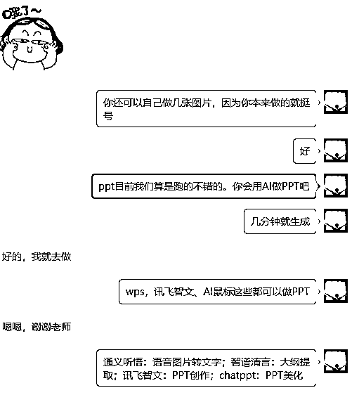
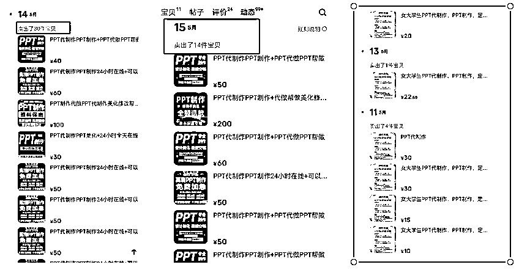
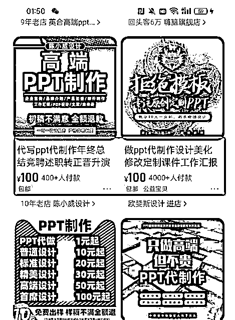
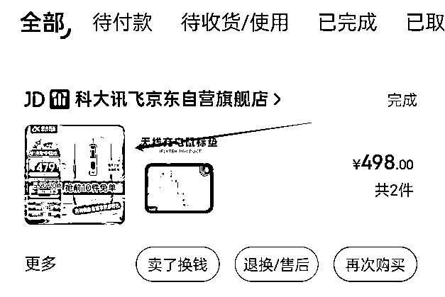

# AI+PPT制作，稳定月入7000+的实战指南

> 来源：[https://cxqeimz77vr.feishu.cn/docx/QPhmd9EwzosEnKxCr7lcdocmnn0](https://cxqeimz77vr.feishu.cn/docx/QPhmd9EwzosEnKxCr7lcdocmnn0)

各位圈友大家好，我是饭饭，生财二年级的学生啦，去年加入的生财，收获颇多。

拿到了龙珠，成为了航海教练、进入了航海家，链接了近千名生财圈友，完成了生财三级跳。

感恩生财提供的优质交流平台，感恩贵人梁靠谱带我进入生财这个圈子。

在4月底的时候水了这篇实操经验分享，后面自营的AI代写业务完全爆了就埋头干事了，今天写完了来星球分享。

我是一名95后电商从业者，熟悉各平台流量的打法，希望能在生财真诚分享写一些有价值的文章结识更多财友。

见贴欢喜，文章来啦~

# 1.结缘PPT市场

准确来说我是在做写作店铺的过程中，准备“捡”了个PPT项目。我认为做项目就是这样的，坚持实干，越做越有！其实很多时候做项目的时候拖累我们的往往不是能力或水平，更多的是自我拉扯。像PPT这种项目在没做之前会很少接触到，但是通过写作接触到以后发现也是小而美。

在去年的时候我分享了《通过开写作店铺年入50w的项目拆解》，分享以后就有很多优秀的圈友链接交流，给了我一些建议，然后我又掌握了小红书无限截流、抖音截流等等方法，扩大了我的获客渠道。写作店铺的流量就越来越爆，项目也是越来越精，合作对象也是越来越多。

后面我自己工作室的AI代写项目异常火爆，客户来源不断，来的客户中就有很大部分觉得我们写的文章质量还不错，然后就会问我们，“能不能做PPT？”能不能送一个PPT模板“”有没有PPT专业的老师？“等等一系列的问题。

当时我就感觉其实PPT的需求很大，但是没有去做。

刚开始的时候AI工具也不是非常的熟练，做PPT感觉很麻烦。加上自己不是这方面的专业人才，做起来很痛苦，而且一个客单价几十上百的，对比文章写作带来的收益，我认为时间付出和回报不成正比。然后我们就没有很放大的去做。

直到后面生财有术的怀民老师找我约一个视频录制，然后怀民老师考虑的太周到了，给提供了录屏的工作和PPT制作的工具，没想打里面这个小工具这么好用，一个PPT自动生成，我以前只PPT要花好几个小时，那天半个多小时就把关于AI代写的分享PPT全部做好、修改定稿了，而且做出来的PPT很高级，模板的选择也很多。

效率极大的提高，感觉太爽了哈哈哈哈。瞬间就让我觉得做PPT好简单了，然后我就给我身边的小伙伴说，“用AI做PPT太简单了，你们得空快赚点钱”，然后在做的过程中，我有发现了很多做PPT更好用的AI工具。

因为之前也有好多圈友链接到我，感觉大家的执行力非常强，而且很乐意的分享，我意识到这个市场不错的时候我就赶紧建议一些圈友做PPT，让我身边的伙伴尝试做PPT赛道，而且除了我自己，我身边好几个圈友拿到的成绩都还行，见效很快。

# 2项目认识

我从普通人入局实操下来AI+PPT的感受来说一下对项目的认识。

这是个蓝海产品，小而美。其实PPT代做、美化服务的兴起，都是源于解决“懒”或者“不会”两个痛点。

市场对高效、专业演示文稿的需求是很大的，在商业汇报、教育培训、产品发布、学生场景等多个领域，做汇报的时候是需要用到PPT的，PPT代做的服务，也就是帮助客户解决设计难题，客户花钱，你办事儿就可以。

# 3.PPT代做市场分析

Ai的出现降低了这些服务市场的门槛，大部分人都能入局，准确来说，只要你会使用ai，那你就可以通过ai去赚到或多或少的钱。 PPT的市场肯定是有的，之前我分享过简历，实操对比下来，我觉得这个回报率甚至高于简历，我们在实操的时候，ppt的客单价可以达到200~400，如果一些更精美的ppt价格会更高。但是我们自己很少做那些精美的ppt，因为没有全身心的投入，AI代写太火，我自己团队就花了一部分时间在扩招团队上面，我们的一个淘宝店铺光是PPT一个月跑了8000多的流水，而且是小助理在去做的情况下，闲鱼上过来的客户也不少，因为主营业务是代写，没有去细分的统计，准确来说回报超预期的。

各平台都有做的很不错的账号或者店铺，新手初期找到这种市场需求和找到对标学习的账号就可以开始实操。

## 闲鱼：

咸鱼上非常多的做兼职PPT代做的个人兼职设计师，或者大学生接单，客单价普遍在百元以内。

这个平台目前是没有门槛的，准备一个账号就可以做，对于新手小白来说，值得试试的。

在闲鱼上搜了一下做得好很好的账号不少，但是做的不好的应该也很多。

这样的客单价：优质的账号一天卖出高达30件，

收益：50*30=1500

虽有波动，但是也很可观。

我们上架的链接，同样不少人咨询。

## 小红书：

准确来说小红书难度偏简单一点的，目前，小红书上已有不少提供PPT代写服务的博主和工作室，比如通过分享一些成功的PPT案例、设计技巧、行业知识都比较容易成为爆款笔记。小红书上PPT代写服务的价格因复杂程度和时间要求很灵活，价格在几百元到千元不等，涉及复杂设计和数据分析的专业PPT，价格可能更高，需求大家看图。

## 淘宝：

目前淘宝的PPT价格是算较高的，很多大店。需求如图，客单价100、400不是代表每个PPT的具体价格，但是销量*标价，大估计能够算出，店铺的营业额不错。而且淘宝的PPT设计店铺投入门槛也就是1000元的保证金。平台选择的时候值得选淘宝去做的。

## 拼多多：

拼多多的流量巨大的，PPT代写服务在拼多多上有潜在客户群体，很多学生做作业、PPT的汇报啥的都会去这个平台搜一搜，需求也是非常的大，在拼多多上做PPT也算是活得比较滋润。

其实对于获客的方法论而言，做项目的人从A平台跳跃到B平台，或许不会立马干起来，但是花点时间测试一下，必然轻易的拿到结果，就说一下我经常用来获客的几个平台，给大家看一下市场分析。

# 4.PPT什么时间段最好做？

有淡季和旺季，提前知晓就行。

## （1）三月到五月

为什么说这个时间段需求大呢，几个层面给大家讲解。

第一：很多企业的财年在三月底或四月底结束，这时候，各个部门和团队都需要准备年终总结报告，回顾过去一年的工作成果，分析存在的问题，并规划下一财年的目标和计划，这种报告大部分需要通过PPT的形式呈现。

第二：而且春季是学术会议的高峰期，许多学术机构和高校会组织研讨会、学术报告会等活动。研究人员和学者需要准备PPT来展示自己的研究成果，这些PPT往往是高客单价，需要包含大量的数据、图表和专业术语，但是对设计和排版的要求较高。

第三：这是一个新学期阶段，很大一部分教师和培训师需要准备新的教学材料，例如课程介绍、教学计划、案例分析等，这时候需要不少的PPT。

第四：毕业季许多学生需要准备毕业论文答辩，同时毕业生们还需要准备求职简历和面试时的自我介绍PPT。

## （2）十月到一月

商业活动的高峰期也就是PPT的爆发期。在年末很多企业就开始进行年度总结和新年计划的制定，这时候PPT代写服务的需求会立马增加，例如产品发布会、行业交流会等商务活动就是PPT需求的旺季。

而且，年度总结、市场分析、战略规划、节日活动策划、学术会议、年终评审和绩效考核、项目申报与资金申请等等都是要结合PPT来做的。

## （3）七月到九月

在暑假期间，各类培训机构和教育中心会开设新的课程和夏令营活动，教育行业、教师和培训师会都有PPT需求。对于企业而言，七月至九月是进行半年工作总结和评估的关键时期。企业需要准备专业的PPT培训材料，也是大需求。甚至个人在求职、婚礼策划、旅行分享这些方面PPT的制作需求也会有所增加。

PPT需求的旺季通常集中在一月、三月到五月、七月到九月以及十月到十二月这几个时间段。应对这些旺季的需求，提前准备好模板和素材，然后再结合AI+PPT的修改制作，或者用AI鼠标，就是高效办事。

# 5.项目实操体验

## （1）反馈快

整个项目实操下来拿到反馈的时间是非常快的，不管是在闲鱼还是在小红书都能够很快速的有人咨询、有用户找着过来。不夸张的说，如果上架到闲鱼或者小红书，很多时候会出现当天就有人咨询下单的情况。

## （2）项目难度不高

以前个人来做PPT的兼职是需要具备一定的设计能力的，但是AI现在对PPT的难度直接降低，但是如果需要深度的去做高单价、精美PPT的定制，那还是需要一定的设计能力。现在有AI，掌握一些设计方面的指令。实操起来的难度极大的降低的，对学历、对设计、对能力各方面的要求都降低，要求就是去用AI。

## （3）交付周期短

一个PPT基本上不会遇见太多次的修改，绝大部分的客户都是为了应付一下临时的任务，套模板或者用AI生成的模板是能够满足要求的，很容易就完成交稿，做好交付。

## （4）收益有上限

虽然说PPT有不少的高客单，但是百元的客单价才是常态，对于个人来说的收益天花板不高，如果要放大的话就结合卖PPT模板或者结合一起其他的扩展玩法。

# 6.项目接单变现流程

选平台>获客>谈价>提炼客户需求>选择AI工具>交付PPT初稿>修改定稿

整个流程其实不难，也不复杂；选平台的话，基本上也就是这几个流量大的平台，例如闲鱼、淘宝、小红书、拼多多或者抖音都很不错。

我们常见的用户分为几种：

## （1）提供语音资料的用户：

这类客户多数会给出会议录音或其他语音资料，需要你听语音然后整理会议内容，并用这些内容制作PPT。可以使用以下工具：

通义听悟：用于将语音和图片转化为文字。

智谱清言：用于提取大纲。

讯飞智文：用于PPT创作。

ChatPPT：用于PPT美化。

## （2）提供文档内容的用户

这类用户会直接提供文本文件，比如Word文档或PDF文件，需要你根据文档内容制作PPT。这种情况下，你可以直接提取内容，进行设计和排版。

## （3）提供用途的用户

这类用户会告诉你PPT的用途，比如公司汇报、产品展示或学术报告等。然后你需要根据用途提供相应风格和格式的PPT，进行内容的优化和美化就能完成。

## （4）不明确需求的用户：

这类用户可能不太清楚自己具体需要什么，只是知道需要一个PPT。

难度较小，可以给一些现成的PPT，需要与客户沟通，明确需求，做出核心内容就可以，，设计和排版也不会太复杂。

# 7.AI制作PPT的详细演示

## （1）版本一：（免费版）

就以客户提供一个语音参考资料，需要根据语音资料来整理写出PPT。

那我们拆解步骤就是：

步骤一：提炼出语音内容

步骤二：根据客户的内容来提炼出大纲

步骤三：把大纲给AI工具，生成PPT初稿

步骤四：得到PPT初稿，直接美化

步骤五：交稿收钱

### 第一步

打开阿里的这个免费大模型：通义听悟 - 你的工作学习AI助手，这个模型的功能很全面，可以音频转化为文字、可以把视频整理出文案。把客户要做的语音资料上传，提取出原文。

### 第二步

可以将提出的语音原文，上传到智谱清言这个AI工具，提炼出原文的大纲。这是智谱的网址：https://chatglm.cn/

### 第三步

打开讯飞智文： 用来进行PPT来制作，输入提炼出来的PPT大纲、

然后 选择PPT模板

得到PPT初稿：

## （2）版本二（买一个AI鼠标）

我自己就是在京东花了几百块钱买的一个AI鼠标，别提多香了，AI智能鼠标可以直接提供主题，然后一键生成PPT，功能也是比较全面。

用下来的感觉有一些优点，可以直接在智能鼠标里面提取文档大纲，还可以直接给出一个主题，让它自己制作PPT，能够极大的提高效率。

# 8.实战避坑指南

## （1）朋友圈要打造专业形象

遇到好多次这种情况了，就是之前有个甲方通过淘宝加到我们想要合作。后面加到微信看了业务号的朋友圈说我看起来太年轻了，应该没什么经验…………。

还有一个加过来说，老师你朋友圈都是指导学生写文章的，做啥PPT！然后我们再发过去已经被删了。

这里建议参照大店，朋友圈打造成为一个专业的形象，头像要好看（西装革履），内容要多更新PPT案例，先去淘宝上加上几个同行，然后参照同行来打造。

## （2）不要接二手单

特别是做PPT这个行业，非常多二手单，更本来路不明，特点就是（价格低）。你会遇到一些同行加过来，先把你朋友圈屏蔽了，然后和你一直砍价，最后给你出一个牛马价格，

## （3）多看几遍客户要求

新手初期接单很幸福的，而且做项目特别需要正反馈。如果接了单以后埋头苦干，肯定容易出问题的，多看几遍客户的要求，避免白做。很多时候在做的时候要把ppt的主题色调风格，建议都截个图发给客户确认，多沟通一下，做出来的效果会更好，避免返修。

## （4）建议不要接修改单

其实做ppt主要是两方的交流，客户和设计师。有一说一，自从做了这些赛道以后。发现有些PPT不是你做的不够好，而是客户本身有问题。你来做了以后，你会发现一个客户，找了很多个设计师来做了ppt都不满意，最后找到你。这种单就不要接了，客户很难缠。

## （5）不要接超出能力的单子

其实做ppt设计的很多单子都是兼职大学生来完成，但是很多企业对PPT的质量要求很高的，例如一些企业客户可能需要制作包含复杂动画和交互元素的动态PPT，或者一些专业性强的领域。

## （6）怎么交付避免被白嫖！

方法1.PPT做完以后直接录制一个视频给客户，让客户先付尾款然后发送源PPT就可以。

方法2.把你做的PPT先加一个大水印，最好是横盖整个屏幕的。然后再另存的时候转成pdf，发送给客户。等对面确认最终版本后结算尾款再把ppt发给他。

# 9.写在最后

感恩生财提供的学习平台，让我们这种普通人不断的突破，加入生财一年的时间里，于我而言，最关键的莫过于早早找到自己的方向和目标。

明确自己想要什么、为什么想要，以及自己能做什么、想做什么，这些问题的答案一直推动我去实干。

一旦找到那些既想做又能做的事情，就要立马躬身入局，通过不断的改进和提升，将其做到极致，那就会成长！

以上分享共勉，以下往期分享，附上链接感兴趣的圈友可以阅读了解一下我~

1.《写作店铺月入5万的拆解》https://t.zsxq.com/0evxBa8Gu

2.《我的手机壳店铺》https://t.zsxq.com/0em6sqd4x

3.《互联网小白，加入生财2个月赚回了30倍门票复盘》https://t.zsxq.com/12gmuT5L7

4.《AI+简历修改，首月盈利7000+，低成本高收益的保姆级教程，附带多个接单平台详细操作步骤及避坑指南》https://t.zsxq.com/bf6GX

5.《AI+拼多多写作店铺，单店月均10000+姆级教程，内附详细运营方法》https://t.zsxq.com/AMeZ2

6《单月营收破20w，AI代写深度复盘，内附多个变现玩法~》.https://t.zsxq.com/ySjes