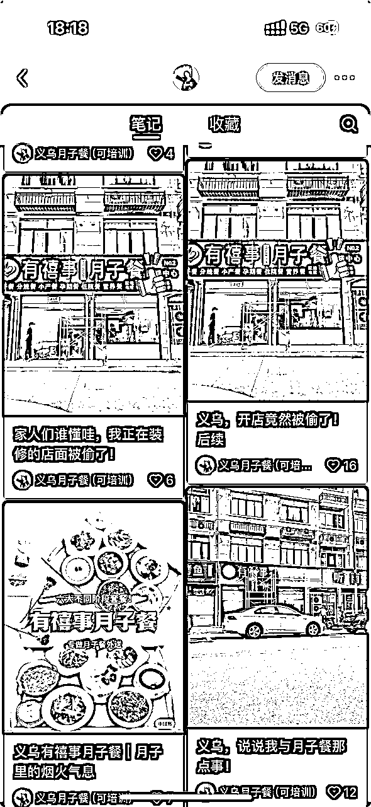

# 我发现了一个超级蓝海项目：月子餐配送，月入七万

> 来源：[https://jingdianyun.feishu.cn/docx/QS1pd2XKNoYXCrxY4Dmcj8Y4nuc](https://jingdianyun.feishu.cn/docx/QS1pd2XKNoYXCrxY4Dmcj8Y4nuc)

## 月子餐外送到家

各位生财圈友们好，我是肖玲洋，一个88年的已婚已育女性，身边人都叫我玲洋姐。

思考再三要不要写这篇文章，很多人乍一看可能觉得复杂，但其实月子餐配送本质上就是一个信息差业务，我担心写出来后，会很快有一群人就要做。

最终为什么决定要写？是想到几年前的我差点因为创业失败离婚，被丈夫抛弃。后来是因为加入了生财，看到了云家政项目，最后赌了一把，赢了，彻底改变了我的人生轨迹。

我觉得现在我好了，也应该反哺回生财。

正文开始

我去年8月，在义乌开了家月子餐外送店，总投入10w，次月回本，之后保持月流水15W+至今，利润率60%。（看图⬇️）

先给大家看下上月成绩

# 一、怎么发现的？

### 关于我：

我加入生财几年了，前面基本不怎么说话， 都是看看大家最近在做什么。作为一名 88 年的已婚妇女，其实对我这样的创业者来说，选择并不多。刚加入生财之前，我因为不想一辈子靠男人，也希望能够成为一个自由独立的女性。做了两次创业，淘宝、拼多多，忽略了创业的难度，最后结果都不太好，负债几十万。也是因为这个负债，老公要跟我离婚，家里人一直说教我。我也想过要么回归家庭，当一辈子家庭主妇算了，但也只是想，我心里很清楚，我要的是什么。

那会也忘记了在哪个群看到了生财的宣发链接，也正是那句「一个只聊搞钱的社群」吸引了我，在本就不宽裕的情况下，掏了入会巨资。

进了生财，好像帮我打开了新大门，原来赚钱还能有这么多方法。因为身在义乌，身边的所有人几乎都从事电商，低买高卖。我原本的世界里，创业只有那一种姿势。生财仿佛为我原本黑白的世界抹上了色彩，我清晰记得那晚我整宿没睡，在一篇篇文章里，心情也随着圈友们的经历起起伏伏，高亢、低落、兴奋、钦佩、敬仰...，无数种情感在翻阅里交织。

看了大量项目后，我也找到了适合我的项目，互联网家政。找身边为数不多的朋友借了钱，交了加盟费，我知道这是我最后一次赌博的筹码，也知道我身后没有一丝退路。但不知道为何，那些在生财写下文章却素未谋面的圈友们给了我再和命运叫嚣一次的勇气。

过程不赘述，我应该算是成功了，至少在我生活的那个圈子。我用了比别人十倍百倍的努力，加上选对了项目，还清了负债，调节了家庭关系，荷包鼓了起来。

这是做月子餐配送项目之前的省略版过往，为的是让大家更了解我，当然，我也希望能够认识更多圈友，未来能够有更多的链接。

### 怎么发现？

说来也巧，自从加入生财后，运气就一直比较好。月子餐是我去年 8 月开始的项目，那天我刚参加完杭州的加盟商大会，回程途中，我刷抖音给我推送了一条月子餐配送项目的广告。因为做家政的缘故，保姆、育儿嫂、月嫂、月子会所相关的资讯我都会格外留意。

广告很简单，说 XX品牌正在全国招募合伙人，做月子餐配送项目。市场前景大，项目收益好，对手竞争少，巴拉巴拉一堆，我听着挺有道理，反正路上无聊，也没听过这个项目，加上对这个行业的了解，也确实知道月嫂的需求一直很旺盛。我就搜索了关键词，一路看了上百条视频。

到站后，我心里就一个声音：这事能干，我能干。

我加了抖音上目前做得最大的一家，名字我就不说了，感兴趣的可以自己搜。（其实拢共没几个人在做）咨询了他们的培训费用，正好这两天在金华有一场，二话不说，交钱。

为啥我觉得这个事情能做呢？

1、疫情结束后，生育率已经逐步恢复，加上 24 年是龙年，中国人本来就喜欢龙年生子，生育数量会进一步攀升。

2、现在无论是一二线，还是三四线，月子中心和月嫂的成本都很高，核心是供需不匹配，大部分的家庭是不能承担这个费用的。

3、在很多年轻家庭，爸爸工作，妈妈生孩子，婆婆奶奶来带娃应该是常态，家里也不需要一个专职月嫂。

但是！

月子餐是任何一个女性坐月子里，除了足够的休息之外，最重要的事情，没有之一。只有吃的好了，才能抵消因为生产带来的一系列问题。

所以无论是月子中心还是月嫂的选择，月子餐也是最重要的衡量标准。

如果妈妈不住月子中心，不请月嫂，也能吃到更优质的月子餐，用外卖的形式，送到家里呢？

作为一名母亲，作为一个家政创业者，我极其相信这个市场的存在，即使并没有多少人在做这个事情。

去金华参加培训的过程里，我就马不停蹄得开始了，培训过程里，我同步招聘了一名厨师，找好了店面，确定了设备采购。

正儿八经由我发起的第一次创业，就这么开始了。

# 二、成本情况

总成本：10W

房租5万（面积 60m²）

装修2万（主要是接待厅的软装）

设备1.5万（买的几乎都是二手）

人工2万（厨师 8K+配送 4K*3）

装修过程：

第一家店装修好长这样⬇️

## 关于选址

第一次做线下门店，我是没有太多经验的，思路如下：（如果生财有餐饮大佬看到，期待给一些建议）

因为月子餐配送属于是到家业务，且目标客群是准备生产或者刚生产完的妈妈们，靠街边自然流肯定不现实，大部分还是要通过线上获客。线下就不需要很好的地方，只要能停车方便，能够供客户试餐，离居民区和医院别太远就行。

其实最重要的还是价格，如果有价格合适的，能够明火做餐的地方，离居民聚集区车程不超过 30min 的地方，几乎都可以作为备选。

我选择的第一家店在城市的中心，东南西北离我店10-15公里左右，位置不错，但并不属于商业街，所以60多平方一个月4000，一年48000，在我的接受范围内。（后来才知道其实不用按年租的）

## 关于设备

咨询了身边做餐饮的朋友

开店所需设备清单：

（第一次开实体店所以能省的地方都省了）

大家做个参考就行

1，1台商用抽油烟机-大约13k，二手8k左右

2，1台商用洗碗机-月租0.8k

3，1-2台消毒柜-大约0.5k

4，1台4灶燃气灶-大约0.5k

5，1台4灶煲汤灶-大约0.5k

6，1台双温冰箱操作台-大约1k

7，1个三槽水槽-大约0.5k

8，货架若干-大约1k

9，不锈钢操作台若干-大约1k

合计13800

## 装修

因为我租的店本来也有装修，所以改改看起来卫生干净就可以。后面其他店在装修这块花的心思会多一点，最近也在考虑出一套整体设计方案。

因为到店试餐是最重要的成交环节，这里做的越细致，客户越不容易流失。主要是要有个接待厅，用来给客户试餐，厨房搞个玻璃，让客户在接待厅就能看到厨房，整体一定要温馨，来试餐的都是孕期妈妈，环境氛围好，吃的也就放心。

最后硬装软装什么的加起来两万出头。（记得店里多贴一些关于产妇保养的小知识 ⬇️这种的）

## 人工

因为我是凡事亲力亲为的性格，前期招人这一块其实就请了一个厨师和三个兼职配送员，获客运营都是我自己在做。

厨师8000*1

月子餐对口味要求不高，清淡少油少盐就行，但厨师这一块对于没做过餐饮的人来说还是坑，后面我再细说。

兼职外送员4000/月*3个

从出餐到客户手上要控制在30分钟内，不然会不新鲜，所以这块成本千万不能省！（我杭州的新店因为比较大，买了两辆五菱mini送餐，非常方便，还能做广告）

## 其他杂七杂八

因为涉及到出餐，所以又去办理了营业执照和食品经营许可证。

菜单设计是刚开始培训那边学的，这半年我自己又研发改版了很多，现在能做到28天三餐不重样。其他还有高德地址、美团饿了么上架等等

到这里我的月子餐店的全部开店前投入，但其实我的店还没开起来，就已经有好几个客户成交了，定了全是7980的28天月子餐，这里卖个关子，先给大家讲我获客的思路。

# 获客思路

关于获客，我最开始的想法是主要靠三个渠道：

1、我熟悉的美团，因为家政业务获客就在美团，熟悉的战场能够更快起步。

2、做家政积累的 B 端资源，家政公司、月嫂中心、产康中心等等，异业合作

3、抖音、小红书这类内容平台

## 内容平台的惊喜

和我预想的不一样，我原本以为美团会成为我早期主要客流的来源，因为我家政业务都在美团获客的。但是上架了美团后，并没有太多客户，反倒是做得拙劣的抖音小红书为我贡献了首批客户。

后来才明白，美团是一个以用户主动搜索展示商户的平台，它需要本身就有大量确定性需求才能拿到用户，但是月子餐配送，本身并不是一个大众熟知的类目，也就没有搜索，自然没有订单。

相反，小红书抖音这类内容平台，能够根据我发布的内容精准推荐给那些一直关注产康信息的待产或已产的妈妈们。

月子餐到家，当下还不具备足够的用户心智，内容平台的兴趣推荐是唯一解。

下面是我的账号：

我实话说，我并不擅长内容运营，初期就是乱拍，我很早的时候就考过营养师证，还有中医知识我也学习了很多。早期的账号内容就三类：

1、装修日常

2、产康知识

3、月子餐出餐和成品视频（在培训的时候拍的）

当时抱着试试的想法发到自媒体平台上，想着反正发发视频又不用花什么成本，我就天天在我的几个平台账号上发，一天发五条，就讲我是在义乌做月子餐的，需要月子餐找我吧啦吧啦，本来以为不会有什么人看我的账号。

但！说出来大家可能不信。我培训还没结束，就靠发这些在培训场地拍的做月子餐的视频。我就已经拿到了一百多条咨询，订金就收了好几单。这真的是意外之喜，小红书的搜索，抖音的同城流量真的帮我找到了这些待产妈妈们！而且当时我连销售话术都没想过呢，就全靠跟这些妈妈们聊餐品，就能成交，这真的给我这次创业打了一针强力定心丸。

（后来我针对产妇总结了一套《九大体质》用来销售，客户资料拿到手后基本来十个能转化五个）

放几张咨询的图⬇️

## 异业合作

除了线上自己运营获客之外，月子餐的客户主要集中在医院、月子中心、产康会所这些跟孕产相关的地方，直接去聊合作基本都能成。

（医院这里有个小技巧，只要搞定产妇那一层的护士长，你的月子餐就能在这个医院被推爆！而且你想一下，都在一个产房，你吃着包装精美、种类繁多的月子餐，其他孕妇或者新妈妈怎么想？）

所以你们当地的医院一定是做月子餐必须要攻略的战地！

# 朋友圈运营

这是到店试餐前的最后一步，也是转化里面非常重要的一步

高客单价的产品，一定一定一定要做好朋友圈运营！

客户一上来，大概率是不会成交的，月子餐的客户很多都是怀孕中来咨询，甚至还有在备孕就来咨询的。所以 ，你需要朋友圈来销售她！

其实发朋友圈的核心是为了增加信任感、专业度还有转介绍，所以一定要围绕这几点做朋友圈运营。

我简单举几个例子

1、客户评价（体现服务专业、靠谱）

2、个人朋友圈（自己日常琐事，让用户感受到你是个活生生的人，而不是光发广告）

3、与用户有关的信息（月子餐的就是孕产知识之类的）

# 产品

产品这里我最开始是直接照搬的培训那的

分别是月子餐、小产餐、分娩餐、孕期餐、营养餐、住院餐。

正常的一个月子餐套餐分为28天、42天、54天；小产餐7天、14天、28天；分娩餐3天、5天、7天。

部分价格表⬇️

都可以按周定，这个根据每个人成交的能力决定。

但我现在做了半年下来发现这套产品其实不太科学，最近在做定价调整（有大佬的话可以提提建议）

我是准备分高中低三个档，直接跟食材价格挂靠，我找了燕窝、鱼胶之类的高端产品，用在贵妇套餐，然后用山姆的食材放在中产套餐，最后搞个正常市场的普通套餐，贵妇套餐定价在2-3万每个月。

## 成本：

每个地区市场菜品价格都不一样，会有部分出入，

现在一餐的成本，配送大约15元，食材水电约13元/餐

28天餐客单价为7800元

大家可以自行算算利润率

而且客户月子期过完就成了宝妈，都在我的私域里，在我这里吃的舒服后先天就会有信任度，再卖她们一些母婴用品，做做拼团活动什么的，能有持续的销售，我现在手上两个微信号一共有上万个宝妈和准宝妈，我一直在持续运营，还给她们每个人都备注了消费标签，这应该也算一笔不小的资产。

# 三两趣事

### 从租门店到接待首批客户一共用了20天，我是被客户强行接单的。

当时刚把店里软装放好，之前转私域的客户就说看到了我们家门店离她很近，想预约一个试餐，客户马上预产期，到店半小时不到试完餐就付定金了，全程我就介绍了餐品，送餐时间，问了一些客户的喜好和忌口，就成交了一个5980元的订单。

后面我持续拉私域里的客户来店里试餐，因为义乌只有我一家店，客户只要来了基本不会太纠结就能下定金，然后我又把医院的渠道跑通了，光一个医院就给我提供了十一个客户。第一个月服务了差不多30个客户，总进帐15W+。

再后来就是不断地发视频做内容，客户也越来越多。有吃了28天后又续了14天的，也有因为没有服务好客户退单的，遇到问题咱就改进问题。还添加了养生茶、药膳馒头、儿童辅食等产品。

后面的事情就是水到渠成，四个月我的单门店做到50W+的流水，每个月能给我带来4-5W的收入，说实话创业这么久第一次做利润这么大的生意，但是也真的累人，要整个人扎进去，店里生意平稳了之后我就招了个店长，给他单店股权，我就来了杭州开辟新市场。

# 为什么这个项目能成？

一个是上面说过的24年龙年我预判生育率会提升，另一个就是现在人讲究少生优生，现代人生孩子是真的舍得花钱，跟我当年区别太大了。而且你说月子中心去不起不是能请月嫂吗？跟定月子餐成本差不多，但其实我做了这么长时间家政，月嫂真的是极其供需不平衡的，好的月嫂基本不流通，全靠转介绍，还要约档期。所以我从一开始就判断这个市场能做。

至于为什么我能做成

1、我是线上引流到线下门店，不缺客户资料的同时也有门店跟客户做链接。

2、自身包装（月嫂、护士、营养师、医院工作人员等身份）我有专业的营养师证书，能解决妈妈们遇到的问题，提高转化率。

3、产品确实硬，付月子餐的价格，体验高端月子中心的品质。其实一般的月子中心月子餐都是外包出去做的，只有足够好的月子会所才有自己的中央厨房，所以这块体验和价格优势都大。

4、属于拿客户的钱，办客户的事，没有什么垫付成本，只有前期一次性投入的固定成本，设备这些可以去当地的二手市场找，价格更低 。

5、手上正好有一些异业资源帮我度过开店前期，不过这块门槛不高，一些小技巧都是通用的。

而且当你在一个区域拥有上万个客户的时候，你会发现很多另外的项目可以多次挣钱。

# 写在最后

不是很擅长写这类文章，想到哪儿写到哪儿，把我认为项目中重要的事情，可能会踩的坑尽量写出来。

在这个项目里，我问过自己为什么是我做成了？不是发现了项目，不是做好了获客，也不是完成了高转化。而是作为一名母亲，我更清楚我的客户们她们要什么，在想什么。

从想要做这个事情之初，我就站在今天即将面临生产的女性角度去思考问题。

怎么才能体面得，有性价比得，健康得做好月子？

只要发心向善，你要的自然会靠近你。

如果对项目有其他问题的，欢迎大家跟我交流。