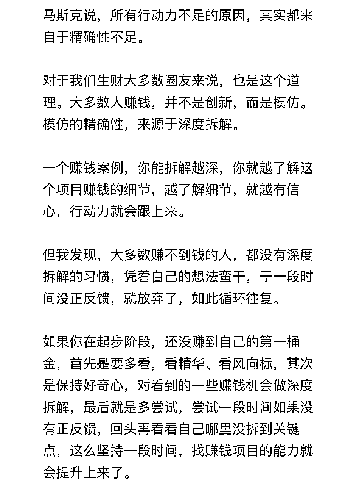

# 从亦仁一篇帖子开始，谈谈我理解的行动力

> 来源：[https://vz6cwy4ffd.feishu.cn/docx/RDOMd4KFOobmfRx7INtclm4Xnfe](https://vz6cwy4ffd.feishu.cn/docx/RDOMd4KFOobmfRx7INtclm4Xnfe)

## 自我介绍

我是周威，现在杭州市三墩镇。

我曾经是高考做题家、35 岁的大厂打工人，但是我不甘于此，所以，3 年前裸辞在家，开始探索创业项目。

只是一直处于探索阶段，23年做了微信公众号流量主项目，今年在探索小红书本地生活赛道。

五一之前，亦仁发了一篇帖子，谈到了行动力的问题。

我个人是一个行动力很差的人，如何提高行动力这个问题已经困扰我多年了。

正好趁着亦仁的帖子，我在整理一下我的认知，以期对自己的行动力有一个清醒的认知，并在后续的阶段中，提高自己的行动力。

本着批判性思维的精神，欢迎大家来打脸我。

如果能够对某些人有所帮助，那就再好不过了。

## 一、行动力的认知

### 1、质疑，但不一定否定。

读完亦仁帖子的第一段话，有一种“真的很对”的感觉，但是仔细品味之后，我依然觉得不够明确。

于是，在大脑中产生了很多的问号：马斯克说的这段话，是不是马斯克说的呢？是在什么场景下说的呢？ 亦仁的说明真的适合我吗？ ……

斗胆说一下我最真实的看法，在我看来，无论是马斯克的这段话还是亦仁的这段话都充满了不精确性。

再斗胆下个结论，马斯克说的这段话是错误的，至少对于我来说。

逻辑上看，马斯克的这段话可以这么说：如果你行动力不足，那么，你对这件事情认识的精确性不足。

那么，这段话在逻辑上等价于：如果你对事情的认识非常精确，那么，你的行动力就会足够。

不过，这句话是错的，是因为前提假设错了。

没有任何人对某件事情能够认识到完全精确。

如果要进一步论证，就要对精“精确”这个词语进行精确定义。

但是，应该承认，人类的语言本身就是一种简化，“精确”必然需要引入各种“复杂”。 无限套娃之后，“精确”必然是一个无限接近但永远达不到的状态。

是的，这样的状态也不能帮助我们解决问题，所以，需要一种恰到好处的简化。

而这种“恰到好处”，每个人必然是不同的。

所以，马斯克的话，对很多人来说可能是对的，但是对于我来说，恰恰是不对的，至少是不足的。

### 2、行动力的模型。

回到行动力这个话题。

关于行动力有各种模型，福格行为模型（B=M+A+P）是一种，马斯克的精确性是一种。

对我来说，行动力包括了行为启动、行动地图和行动临界值三个部分。

*   福格行为模型解决了行为启动的问题。

*   马斯克的精确性解决了行动地图的问题，确保行动有章法。

*   行动临界值，要解决的是跨越阈值的问题。因为你的行为效率、强度必须达到某个临界值才能获得一定的结果。

本质上，马斯克所说的精确性也包括了行动临界值的问题，但行动临界值太重要了，必须单独拎出来强调。

认识到以上三点，我接下来的行动就应该是：

1.  按照福格行为模型规划自己的行为启动开关。

1.  不断地获取关于项目的信息，并持续复盘、验证、分享自己的认知，提高自己对项目的认知广度和深度。

1.  探索、设定、验证行为强度，并提高行为效率，尽快跨越阈值。行为强度和效率是相关的，是可以量化的，也是可以使用工具和流程来提高的。产品化、矩阵化、外包化（这三个是偷亦仁的）是提高行为效率的极致形态。

## 二、几个提高行动力的技巧

### 1、行动力的源动力是目标，目标的实现必须要投入时间

我们决定要一个项目，就自然而然地会设定一个目标。

但是这个目标必须要量化为具体的行动，还必须进行时间管理。

所谓的时间管理是：在具体的什么时间，做什么具体的动作，以及做多久。

这样的定义是因为，结果本质上是无法控制的，我们只能通过控制我们投入的时间、行为来提升结果产出的概率。

只有这样才能真正落实下去。

### 2、行动力的基础是勤奋。

所谓的勤奋绝对不是普通的八小时工作，而是八小时之外的付出。

“勤奋策略包括在工作中投入额外的时间和精力、进行高效的时间管理、按重点排列目标次序，以及努力工作。”

勤奋对应的具体行为是时间管理和效率。

### 3、效率提升的两个关键点。

效率=行为数量/时间。

在某个时间段内提升效率，行为必须是不间断的，且单位行动的时间越少越好。

1.  处理掉情绪，行为连贯

回顾我自己的经历，很多时候我的行为是断断续续的，停滞的时候经常是在处理自己的情绪：焦虑、迷茫、怀疑、绝望……

这个时候应当意识到自己的情绪，并且落实到具体的问题上，绝望就找答案，迷茫就理出来解决方案，不要过于纠缠于情绪。

“听话照做”，不仅仅是说高手告诉你的方法是管用的，你做就对了，更重要的是，你不要让任何情绪耽误你做事。

1.  打磨工具，提高效率

这里引用王川的一段话：“古人云: 没有金刚钻，别揽瓷器活。可见工具的重要性。我认为人生至少80%的时间要放在打磨金刚钻上。更进一步，如果你的金刚钻在某些地方的性能提高十倍以上，你突然发现你可以解决以前没有想到的问题，可以揽铁器活，铜器活的时候，那你就可以天天谈笑风生，境界比只做瓷器活的人不知道高到哪里去了。”

我个人是有深刻体验的，本来微信公众号的选题对我来说是个很大的问题，但是当我使用了微信文章自动下载的工具之后，选题再也不是我的问题了。

1.  效率目标

怎么定义你是有效率的呢？这个问题涉及到拿到结果的行为临界值。

举个例子，如果你想要出爆款，一个账号跑出来的概率是30%，那么你维护3个账号基本上就能够保证出爆款了。

所以，具体怎么设定你的效率目标，就必须看你的结果目标是什么。

大多数时候，我们都是新手根本没有体感怎么办？

看航海手册，或者看身边做出结果的人的效率是怎样的，以此作为我们的目标。

### 4、确保行动力的机制

1.  设立flag：给自己设立一些能完成的flag，给一些社交压力。

1.  找人PK：就找这个领域里面你认识到的最强的人。

1.  让自己成为别人的“负担”：让自己的工作融入到与别人的工作流中，这里适用于合作性的项目中。

这其实是自己对别人的一种承诺。

“无论是职场，是情场，一旦对方信任你，而且他的控制能力足够强，那么恭喜你，你找到了值得同行一生的小伙伴。”

认识本能地要对得起这份信任的，所以就会有承诺，有承诺就会有压力，有压力，才有了行动的动力。

1.  定量：没有人监督的时候很难自觉的定量化，但是如果不达到一定的量，就完全没有效果。很多细节，如果稍微定量化一下，然后强迫自己坚持完成，实际上都不是特别高的要求，但是积累一段时间，自己可能都会被结果惊讶。

### 5、降低行动难度：一招鲜吃遍天

不知道大家有没有这样的经历，就是做项目的时候，航海告诉你一个方法，你就用这个方法做，做着做着，遇到了瓶颈，或者就是就想要去找更多的方法，系统化或者结构化地去推进这个项目。

结果读了一大堆精华贴，找了一大堆方法，最后把自己搞迷茫了。

比如我在做小红书选题的时候，就遇到了这个问题。

当时，我找了几个对标账号，写了几天之后，就想着要找到更多的选题，如何能够结构化、体系化地源源不断地输出选题呢？

结果找了“选题策划「GNSLP」五步走”、“系统性选题库公式”等内容，结果看完之后，变得迷茫了。

因为对于我来说，这些方法实操起来难度还是很大的，我还不如持续去找对标账号去学习别人的选题呢。

有问题解决问题，在没有很好地掌握一种方法之前，不要轻易地去横向拓展更多的选项。

把一种方法用透，而不是多种方法每种方法都用用，集中时间和精力攻击一点，拿到最大的效果。

## 三、影响行动力的因素

### 1、“我就是练练手”

这是李笑来的文章里面的内容，我确实是有体感的，当我练练手的时候，我就是做不好这件事情，下一件事情也做不好。

你必须认真对待你的项目，当你做这个项目的时候，必须认真努力专注地去做。

不要回避商业，该收钱就收钱，不能免费、不能公益——这是为了得到真实的反馈。

脑力的作用正在逐渐超越体力的作用，在脑力的作用无限被放大的同时，体力的作用正在趋近于零。

人的大脑是可塑的。

你的经验会不断塑造你的大脑，所以，要想尽一切办法甄别你可能会获得的经验。

“从一开始就玩真的”，这实际上是让你的大脑从一开始就在真实的世界里进化。

所以，做事的时候，大多数人常常这样欺骗自己：“我就是练练手”……

只有少数人从一开始就想把事情做到真好。个中虽然有天壤之别，却还真不是一下子能看出来的……

### 2、自怨和后悔

这里的根本原则是不浪费时间在处理自己的情绪上，一旦总结了失败的教训和成功的经验之后，就坚定地往前看。

王兴说，他回忆过去的时间不会超过五分钟。

成功者都是未来主义者，不会放任自己的自怜情绪。

### 3、不设定时间和损失底线

我们创业面临的是不确定的未来，如果不设定时间和损失底线，你会很焦虑。

设定时间和损失底线，就不用焦虑了，一门心思按照既定的计划猛干就好。

到了设定的时间和损失底线，你再决定要不要继续坚持还是撤出。

## 写在最后：下了功夫，才有趣

这篇贴子是我加入生财一年来的总结，也是我3年多来磕磕绊绊的教训，未来还会再这篇贴子基础上持续更新我的经验和教训。

但是，看再多的贴子都不如自己大干一场来得有用。

有一天，我看到一段鸡汤：“如果你没有能力“浪费”几个小时，几天甚至几个月思考和斟酌战略问题，最终你就会浪费很多年的时间。”

但是这个鸡汤对绝大多数人无效，因为很多人不会思考，而且也没有思考的养料。

所谓的会思考，起码要遵循基础的思维逻辑：多维度多角度的信息、遵循的逻辑准则（包含价值观）、对结论的反复验证、不断优化。

除此之外，思考也需要最基本的养料：尝试实践中的真正的互动信息、频繁且深入的情绪体验。

更低成本地完成这项思考，需要把实践也纳入思考的范围。

对于真正重要的事情，少则几个月多则几年打底的在实践过程中的思考，是必不可少的。

鸡汤、贴子以及所谓的道理，看起来固然很爽，但真要喝到鸡汤，就必须自己下功夫去干。

真传一句话，这句话简单且无趣，下了功夫，才有趣。

假传万卷书，曲解的话，都有趣有理，因为核心不真，要掩饰要装饰，富于迷惑性。

## 日常灵感补充：

1，健身的精髓是力竭，行动力的精髓是每次做到最好。

2，为什么没有赚到钱？因为行动没到位。为什么行动没到位？这里有情绪的原因，有认知的原因，有行动力本身的原因，也有正反馈不足的原因，极其复杂。

但是简单来说，就是行动力的原因。

因为认知可以在实干获得，正反馈也是在做对事情的结果，情绪也可以在做事的过程中消耗掉。

所以，一件事情该不该做，怎么做，都不重要，重要的是去做。