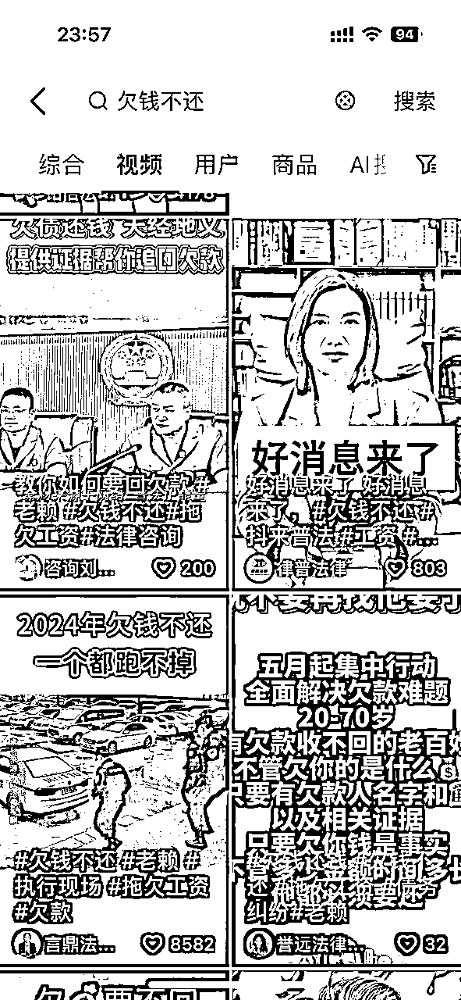

# 法律咨询项目：5人小组单月变现50万（从0到1全流程分享）

> 来源：[https://oj5ckuh05s.feishu.cn/docx/RYRsdcKkwowsYmxZDwIctE84nVb](https://oj5ckuh05s.feishu.cn/docx/RYRsdcKkwowsYmxZDwIctE84nVb)

5人小组，三个月，从0到50万。成绩不算很好，但逻辑清晰，希望能给你做项目带来一些思考。

# 一、项目的底层逻辑

法律咨询不是什么新鲜的项目，但却是一个可以长期深耕的赛道。客户群体是全国范围内，涉及到各个行业。卖的是专业知识及服务，看似稍微有点门槛，没有老师带或没有律师资源很难入门，竞争有但是真不大，全国的案件根本做不完。

为什么我们能跟律所去竞争？因为渠道的变化，简单来说就是流量获取方式的转变。

传统的律师想要获取案源主要靠身边亲戚朋友转介绍、混各种圈子或地推，而直播&短视频的出现更加刺激了用户的需求。为什么这么说呢？之前找个律师打官司是不是要三五千起步，高昂的律师费把大量的小案件、小纠纷拒之门外，因为当事人感觉不值当。要知道类似这种经济纠纷的案件可是太多太多了。

总体来说，我们通过图文、短视频、直播来获取客资，电销加微信，私域进行转化，然后交给律所进行交付。

# 二、准备工作

如果是1个人来做，前期自己可以搞定流量和销转，后端交付给律所来干。

如果是3人小团队，可以两个人负责流量，一个人负责私域运营及转化。

像我们5个人小组，就是2人流量、2人销售、1人主管对接律所协调团队，成交后非诉案件主管搞定、诉讼案件给律所来交付。

谈律所或律师比较简单，因为是咱们给他们推客户，谁掌握了流量谁就掌握了主动权。

文章末尾我会写上与律所及律师沟通的注意细节及合作事项。

非诉业务后期自己就能搞，因为大部分案件做的是起诉指导，也比较简单。

硬件上就是需要准备手机（苹果7就可以）和电脑，电脑配置差不多就行，可以用来剪辑和制作图文。

需要办几张个体营业执照，海南比较方便。

一个手机一张流量卡，小红书必须一机一卡一号，前期一个人准备3-5个手机即可，看个人工作能力。

以下是我们每日工作执行计划以及规划；

*   十点上班，首先开始检查一下自己的微信，昨天晚上有没有第二天约好待付款，或者已成交客户的很急躁，急切联系我们的客户，重要的消息先行回复，优先促成委托。其他的先不予回复，准备开早会。

*   （早会分享）由主管单独给小组人员组织早会，认真学习新的知识，说出自己现在遇到的问题，以及不足，确保每天都有进步。会议结束，接下来开始回复我们新的委托人消息，多去激活私域。

*   合理安排时间准备拍摄准备分发的素材视频

*   每天晚上发工作日报，复检每日完成的事情

*   每日业务微信朋友圈，必须保证每天5条及以上内容更新

*   每日必须执行企业微信一条群发内容（视频原创内容为主）

*   每日接待客户必须登记到《客户信息统计表》内

*   每日拍摄引流普法素材或图文不得低于5条，剪辑用于分发到公共引流平台

*   每日找精准爆款文案不得低于10条，存放到表格里，用于修改备用

# 三、流量怎么玩？

## 1、核心思路

经过大量测试，抖音、小红书作为搞客户的首选；其次是视频号，适合露脸口播；快手直接同步抖音或视频号的作品即可。

如果专注搞维权退费，把主要精力放在小红书上，客户付费意向强，年轻女性偏多，好成交。

如果专注搞经济纠纷民间借贷，把抖音作为首选，抖音虽然流量泛、但依旧是最大的流量平台。

## 2、操作方式

### （1）同类作品下截流

各个平台同类型主题账号下的（抖音，快手，视频号，小红书）等多个公共平台，客户头像上的，或者留的电话直接打，私信并跟客户沟通加到联系方式。

装作受害者身份评论引流到微信。饰演真实的受害者，越真实越鲜活越好，太有目的性就容易被质疑。举例：

#### 步骤一：找到目标视频

搜索关键词，以退费维权为例，搜索“中公”可以看到关联词，选【中公退费】，筛选时间【一天内】最佳，搜出来的视频评论数一般几十个就可以，当然几百上千更好了。如果搜完的视频只有一两个评论，但是发布时间比较新，也可以评论。如果【一天内】没有符合要求的视频，那么把范围扩大到【一周内】。如果【一周内】也没有合适的视频，那么就换个关键词继续重复上述步骤。直到找到目标视频为止。半年内的视频都可以做。

甚至超过半年的视频也可以做，因为视频是老的，但评论是新的，这个时候我们直接回复那个人的评论就可以。

进入话题后点击最新 里面的评论还比较新，评论往后翻 有最新的

这里评论的都是精准客户，也可以少量私信，但是容易封号而且转化率不高，没有这种装成受害者引来的客资质量高。

搜索词不限于中公，任何一个领域都可以作为关键词去公域进行搜索，这里就不一一举例了。

#### 步骤二：发布评论

以受害者的角度吸引客户的注意，在评论区发布：

“我退了全款 大家千万不要签分期合同 里面全是坑 还好当时没签 我找律师帮我退的 当时还有点担心会不会再次被骗 但是他们说到账后才收费的 非常感谢他们”

“我退了全款 大家千万不要签分期合同 还好当时没签”

“我交了2万，退了18000”

“弄了好久，终于退成了！”

“哎，还有这么多人没退成功啊，还好我的已经退到账了”

这种话术会非常吸引客户，我们只需要评论这种钩子去吸引他们，坐等客户主动联系。

我们在不同的视频下要不停换评论，不然多个视频一直复制粘贴，很容易被认为是钓鱼行为，也容易封号。

发布评论，可以在第一条评论下面进行回复，因为这样不会被刷下去。

也可以选择评论区一对一转化，针对每个人去回复他们“我的退了”，当然也可以自己新起一楼。

客户上钩后一般会来评论问怎么退的，也会有过来发私信的。

用户如果回复我们评论了问怎么退的，你就回“我找人退的”，如果问找什么人，就主动去私信把联系方式给他。

如果我们已经在评论区跟受害者有来回的互动（你来我往 评论2-3轮），那么我们是可以主动给她发私信发联系方式的，因为他想得到我们的回复。

发私信的是我们重点要转化的目标。

另外，在发布评论前，先检查一下自己的账号，要是一个正常号，可以发发日常生活，不要太营销号了。

### （2）图文作品引流

在小红书和抖音搜索关键词“欠钱不还”，查看同行。如下：

可以看下我们自己做的账号：

小红书上的同行可参考以下账号，包括模版类、聊天截图类、到账截图类、纸质打印类

注：一个号不限定一个风格，大家都是什么类型点赞高就模仿。

这里面需要注意几点，第一个是所有的抖音账号需要蓝v认证，目前有500粉丝是免费认证的。认证的目的是开通留咨服务，如下图所示：

蓝v的设置可以参考：

所有的账号一定要设置！！！要不然作品爆了也没啥用，因为咱们要的是客资不是流量。

作图工具可以用：美图、稿定设计、黄油相机

### （3）类个人IP露脸视频

可以发普法和法律避坑指南以及成功案例，视频内容形式如下：

这种视频形式拍摄简单，可大批量复制分发，不要怕封号，封号代表着引来不少客资了，也值了。

而且抖音、小红书不需要实名，抖音只需认蓝v即可。小红书、视频号的账号名字不能随意改动，除非再重新认证交审核费用才可以。

别一上来就发引流内容，可以多刷一下同行，先养号，这样系统会时不时给你推荐一些优质同行号。可以先发一些法律科普内容，先提高一下账号权重。开始写内容时先模仿同行，模仿不是让你抄，重复度要小于70%。

如果有律所资源的可以用资质认证账号，目前一个资质可以认证2个抖音号、2个小红书号，但却可以认证50个视频号，而且视频号很容易爆，转化率也比抖音上来的高，刚入局的要把握好视频号这个赛道的机会。

打好领带、穿好西装，视频号爆了直接开播，以律所某某老师自称即可，谁也不知道你是不是真律师，相对正规点。目前非律师也可以在视频号上开播，但是抖音快手上必须要有律师露脸才行，需要把律师的实名及执业资格认证添加到直播账号后台。

没律所资质也没关系，因为一般注册个法律咨询类的个体户完全够用了。让大家看看我们注册的名字，哈哈

小红书对标可参考以下：

不管是哪个平台同样的流量方式都值得在另一个平台走一遍流程，操作下来目前管控比较严的是抖音，视频号发视频的曝光要比图文好点，小红书付费意识强，但是会有货比三家的情况。

# 四、转化怎么搞？

## 1、基本逻辑

所有的技巧都是为了成交，成交的前提是信任，多站在对方的角度去考虑问题，最好的套路就是没有套路，最好的技巧是没有技巧。多去沟通，向优秀的人靠近，听，看，并且学习和记录。

#### （1）客户关系定位

不同的案件情况，根据客户的诉求去先去捋清楚客户在整个案情里的身份定位，原告或者被告，借款人还是出借人，甲方还是乙方。

#### （2）客户案件属性

属于民事还是刑事，执行案还是诉讼案，根据不同的案件属性有不同的沟通思路。

执行案：执行案就不需要过多了解案件的原由，只需要去考虑被执行人的财产信息，询问申请人（客户）对被执行人的财产情况了解。另外可以通过中国裁判文书网和执行信息公开网去查询被执行人以及案件信息。

诉讼案：收集证据，询问客户手里都掌握了案件相关的那些证据，同样可以通过裁判文书网和执行信息公开网查询被告的一些其他信息，做第二次沟通准备工作。

另外可以根据客户的社会身份和案件属性判断是否可以尝试推非诉业务内容，一方面可以降低客户的诉讼费用，节省律师费，同样可以达到相同的结果，给客户提供额外的价值输出。

#### （3）客户案件内容

标的：指的是民事赔偿和起诉标准的数额，欠款数额或者赔偿数额。一般在证据直接体现，如果在借贷关系里，有约定利息可以按照计算利息后的数额标准计算标的。

纠纷类型：所有案件类型，民事纠纷主要发生在欠款等，每一个不同的案件内容相对应的证据标准都不一样。

欠款：主要证实两者之间存在借贷关系以及借贷内容。

合同纠纷：以合同为主体根据客户的诉求去判定双方是否存在违约责任，以及合同之外的责任划分。

侵权：工伤，医疗等。首先建立两者存在过失或者其他原因。因被告所产生的一切包括但不限于（治疗费，医药费，误工费等）。但是根据赔付标准去提供相对应的证据。

#### （4）证据判断

特质诉讼阶段，根据客户的案件属性去判定所需要的证据内容，在沟通过程中要有让客户发送证据的习惯，可以直接拍照发送到微信上。通过案件的属性去判定证据能否达到立案的标准，缺乏证据在二次沟通过程中让客户补足。

#### （5）报价方案

诉讼案：根据标的额的3%-5%收取律师费（标的太小的最低收费标准5000），另外超过郑州以外的地方需要律师出庭的，需要客户出律师的差旅费用实报实销。

执行案：正常标的额的3%-5%（最低标准4000），这是律师的委托费用以及办案的费用，中间不再收取，执行回款之后收取执行款的15%左右，可以根据客户情况具体报价。

所有报价都以成交为目的，可以适当报高，给客户谈判的余地。

#### （6）思路鉴理

根据客户的真实情况，做沟通思路，主要是两个条件：

1.根据客户的地理位置进行邀约，一般省内的客户可以直接邀约，以建立基本信心或者让客户更放心为理由见面沟通。加大成交率。

例：看您也是河南，我们在郑州，您的案子也不是小钱，我建议您可以这几天来郑州一越，我们就在高铁站旁边，交通也很方便。我给您预约我们主任律师的时间，让他给您更专业的方案，即使您来了不委托我们，最起码您心里知道这个案子该怎么进行了，您这一趟也算没白来。

2.省外客户基本以线上签约为主，以建立基本信任为主，可以主动提高客户的对律所实力的信心，以及邀请主管进行二次沟通为理由进行案件方案给与进行逼单。多用实际相同案例（讲故事）去强调案件的复杂性，塑造客户对案件的寄托，达成信任之后进行成交。另外可以以主动开视频，主动降低信任问题可以收取部分定金，加大客户的信任感。

例：

1.我跟我们主任律师沟通过了，您的案子我们基本上没太大问题，如果您也接受我们的报价那我们就可以在线上签约。

2.因为您是省外的，咱们也没有见过面。要不这样咱们开个视频，咱们也见个面，您也了解一下我们律所的环境。这样更真实一些，您也能更放心交给我们去处理您的案子。

3.考虑到您是省外的，本身经济情况也困难。我跟主任律师申请一下，看能不能律师费分开付，您先付一部分定金，我们先给您走着流程，等您的案子立案了，您在吧尾款补齐。这样您也不用担心我们收钱不办事，另外也减少了您的经济压力。

注：所有的话术呈现都是以邀约和成交为目的，不要给客户任何保证性的承诺，在过程中可以提前邀请主管进行协助沟通，也不要以律师自称。

## 2、电话沟通细节参考

1、开场白的自我介绍

①你好，这里是***法律咨询（律所），我是***主任（助理），我通过X主任（视频号主任）了解到你有欠款要不回的问题，对吧？

②你好，这里是***法律咨询（律所）***主任，看到你这边有通过我们客服通道咨询债务相关的问题，对吧？（客服通道中只留有电话的客户）

2、给对方一个陈述案情的时间，但是为了避免对方重复啰嗦讲不到重点浪费时间，一般给2-5分钟。

①你给我说一下你这边案件的具体情况吧

②你详细描述下案件的具体过程，等下我给你具体梳理下案件该怎么去做

注意：非必要情况，不要可以打断客户的陈述，毕竟“受伤的人”需要倾诉。

3、停止对方陈述，快速分析他的情况，然后进行询问

①我打断一下，你的大致情况我已经了解，我需要问你几个案件的具体问题

②欠款的具体金额有多少？

（如果陈述中有所表达，就重复确认一下，例如：①你这个欠款金额是X万是吧？②你这个工资是有X万对吧？）

③你现在手里有什么证据啊？借条，欠条，聊天记录这些都可以

（这里就需要进行客户分类和进行详细备注了，第一次分类，客户有没有证据）

④你有没有欠款人的姓名、手机号、身份证号、地址这些信息

（信息做备注，欠款人的信息有哪些，缺哪些）

⑤有没有起诉过

⑥欠款有多久了（确定诉讼时效是否过期）

注意：问题顺序随意，视客户陈述案件的具体情况而定。

4、询问过后，添加微信，要客户把证据材料发送过来，看案件是否能够受理

①你先添加我的微信，然后把证据材料发过来，我必须要看一下，是否具有法律效应，才能确定你这个案件能不能接，我看完之后，再给你打过去，然后给你出方案，看你这个案件具体怎么解决。

5、再次电话打过去，告知证据问题，询问欠款人的情况，挑起矛盾点，达到共情

①告知客户欠条、借条或者其他证据材料的一些问题（没问题不用说）

②询问欠款人的情况

（①这个欠款人现在是什么态度？②不打算还钱了吗？③这个欠款人剩下的钱是不打算给了吗？④这个老板是什么态度，不打算发工资了吗？他现在还拖着不给吗？等等问题，看案件的具体情况进行询问，一定要确定欠款人现在是什么态度）

③挑起矛盾点

（不负责任、人品有问题、不提你考虑、只有0次和无数次、失踪了的社会渣滓）

注意：挑起矛盾的过程一定要适可而止，不要有太强烈的销售欲望，避免引起客户反感。适度的挑拨和共情，可以起到和客户共鸣的效果。

6、给予信心，并讲述委托我们办案的优势，促成成交

①给信心是一定要给到客户相对来说肯定些的回答，在销售层面吸引客户，并给予客户足够的信心，以及在她的诉求情况下基于合理的肯定性。

注意：可以给予肯定，但是不能保证！

②讲述委托我们办理案件的优势，以及走司法流程的可靠性

（法院开庭公正公平公开、我们有经验丰富的团队，专业的法务，受司法局监管的正规平台）

③了解完客户的基本案情之后，给出客户我们专业的处理方案，只要能够判断案情可以处理的前提下，可以直接向客户提出是否需要委托的明确提问，直接跟客户说清楚我们的服务内容及流程，达到让客户主动询问价格的目的。

客服通道直接添加到企业微信的客户，在客服通道中确定客户的意向之后，先走第四步要证据材料，然后再按照第二部开始。不要被客户牵着鼻子走，永远牵着客户走

举例如下：

A：您好！

B：你好！

A：您是X先生/女士是吗？我这边是******的法律顾问，在抖音上看到您在视频下面留言（刚在抖音上跟您沟通），您现在方便吗？给您具体沟通一下您的案件情况。

B：好的，我有一个人欠我钱/有一个老板欠我钱

A：具体什么情况？您起诉了吗？（确定案件属性）

B：没有（诉讼案），这几年一直找不到他人！也不确定能不能要回来钱

A：那这样，目前这个人是联系不上是吧！

B：是的

A：那您当时借他钱是怎么借的（确定案件内容），有欠条吗？

B1： 有欠条（可以确定基本立案条件）

B2：没有欠条（需要做证据补足）

A1：那好，欠了多少钱，对方现在是什么情况您清楚吗？（确定案件标的。被告情况）

A2：没有欠条的话，您有找到要钱的聊天记录吗？你们是什么关系？怎么借的钱？（从第二梯队证据做证据补充）

B1：现在对方联系不上了，想拿着欠条起诉他！看能不能行

B2：有之前的聊天记录，他这个人就是不给，现在都消失了，我们之前给的现金（询问现金从哪里来的！）/我给他转的钱（询问转款方式，获取转款凭证）

A1：可以，您这样，一会咱们加个微信，您把欠条发给我看下，另外看下有没有其他的证据，当时给钱的方式或者聊天记录啥的，只要有您准备一下一会发给我，我给您看下。然后我在微信上给您沟通。（要证据）

A2：那这样，您一会吧您现在有的证据整理一下发微信上，我帮您审查一下，另外对方的姓名以及户籍地发给我一下，我查一下这个人目前是什么状态，好给您回复。（加微信要证据）

## 3、怎么打消客户顾虑？

一定要解决用户的信任度问题，不成交要么是不信任、要么是价格高。用以下话术打消顾虑：

1、所有的资料都是我们帮你写好，确实，您也被坑怕了，我们确实是交一笔钱，办一个案子，你不相信都是正常，我也能够理解，我可以给你看一下我之前办的案子，咱们打个视频都可以看到的。（有条件能开视频的一定要开）

2、我也可以给你开视频看看我们公司是不是真是存在的，而且我的朋友圈也一直都在发，如果我是骗子，也不会做这么久，号早就被封了，所以你放心就好了

3、你要相信我们，我们这边就是在河南郑州，这么大的接案中心是跑不掉的，而且打官司最重要的是什么？最重要的就是走流程，没有把握我们也不会接，如果证据不足这个官司就没办法打，到时候立案都不会成功

4、我当然非常理解你，因为你现在面临的这个问题，我也遇到过，信任是一步一步建立的，我们可以开视频，或者是把我之前的案子，案例发给你看，或者你可以去查我们的资质，任何方面你都可以去做，因为你也在行动，我们的目的都是一样的，都希望能够把你的钱给要回来

5、如果你觉得网上怕被骗，那么你想想看，我们这么大的平台很好做吗？如果说为了这区区他一千块钱去行骗，导致我们公司被调查，甚至还有可能面临其他的法律责任。你想一下，我们这些法律从业者能不懂吗？你也不用这么侮辱我的职业，为了这点钱，知法犯法犯不着

6、我们这边都是对公账户收款，这样你也可以放心一些，信息都是公开的

7、每一个案件都是有专业的法务对接，不是一个人处理很多案件，我们是专业的人做专业的事，要是不能够服务成功，我们可以退款，你的钱是打到我们对公账户上面，不经过我个人手中的

8、如果你实在是不相信，可以先付个定金，我们可以先签合同，剩余的钱，你可以签完合同之后付，我们这么大个平台，也不能骗你这几百块的定金

9、经过对你案件的分析以及你提供的证据，我们没有把握是不会接你这个案子，肯定是希望能够把你的欠款追回来，所以你要相信我们，我们是不会让你失望的

## 4、私域运营

私域最重要的是真实。

与客户沟通我们可以采取：聊天语音（对业务已经很熟悉的情况下）+文字结合的形式，这样可以提高我们的信任度，我们的转化人员遇到河南的必须河南话，接地气。

朋友圈秀案例 （触动客户）+ 真实生活（打造真实感）。

### （一）账号包装

1.  微信名：可以起类似这种——大普老师-专注经济纠纷，大普靠谱-专注维权退费等

1.  朋友圈背景图：看起来专业一点，可以参考下图

1.  视频号入口：如果没发相关专业的问题，记得一定要关闭。

### （二）朋友圈建立信任

朋友圈是重中之重，可以帮助我们塑造专业形象，快速获得信任。东西不难，但是要注意细节。

每发一条朋友圈都是跟用户建立信任的过程。但不能总是营销，也要有日常生活。

50%的营销内容+30%的专业知识+20%的真实人设输出

1.  朋友圈整理

朋友圈一定不要设置3天可见，非常可疑，一定要把朋友圈全部显示，

这时候可能有人说：“我之前的内容跟维权退费也搭不上边啊”，

没关系，你们可以把一些明显能看出来，跟法律违和的内容，设置仅个人可见或者删除。

1.  发朋友圈

*   一定要发朋友圈，一定要发，而且多发这是必须的。

*   朋友圈素材这个前期自己没案例，那就想办法，懂得都懂。

一天发布5-10条，注意要有时间间隔，不要一次性发这么多，每条中间间隔一两个小时，要像一个正常的人，否则容易被折叠。

*   因为是刚开始做这个业务，没有几条像样的朋友圈，所以需要把朋友圈的个性签名写成——工作号已加满，私人号叨扰大家，请见谅。

这主要是告诉客户，我们已经做这项业务很久了，号都加满了，这是我私人号，迫不得已公用了。

### （三）打标签

给客户尽可能详细的打标签，便于后期回访，精准营销。

标签内容为：客户什么时候加的？通过什么渠道加的？成交状态如何？涉案金额多少？哪个类型的案子？

也可以简单备注A、B、C、D客户的四个状态：

A：未回复的，还没交流

B：交流过，没下文的

C：有意向的，重点关注

D：已经成交的

标签越详细越方便后期客户的管理。

## 5、销转注意事项

1\. ⾝份证照⽚问题

客⼾⾝份证照⽚不到诉讼阶段不需要，尤其在签约之前不要问客⼾要⾝份证照⽚！我们只要⾝份证号码就可以签约！

2\. 语⾳还是⽂字

熟悉业务后，能语⾳⻓条谈单不建议⽂字，语⾳谈单更能体现我们的专业性；当然，⼀定是建⽴在熟悉业务的前提下；

3\. 暴露需求感

*   不要太着急成交，当然也不要太不着急。上来没聊⼏句就逼单⼤概率会⻩；

*   消息不要发的太多、太密，给客⼾的感觉就是急于成交；

4\. 习惯书⾯⽤语

要习惯书⾯⽤语，减少⼝语化⽤语，正确使⽤标点符号，让客⼾感觉更加专业；

5\. 框架化谈单

谈单⼀定要形成⾃⼰的框架，有⾃⼰的主线；不要东⼀榔头西⼀棒槌，或者让客⼾带跑偏了；

6\. 公司资质问题

用我们公司的资质和办公环境照片

7\. 仲裁条款科普

*   ⼤部分仲裁是可以⾛线上仲裁的，即使不能⾛线上的也可以有机材料，本⼈不⽤去。

*   不是所有的仲裁都很贵，可以到合同指定的仲裁委查仲裁费⽤。

*   只有两种情况申请仲裁条款⽆效概率⾼（其他的也可以申请，只是概率低）

①⼤批量⽹上格式合同诱导签的，譬如中公教育。

②合同有条款但未明确仲裁还是起诉、或两个仲裁机构未明确哪个的，都可以申请仲裁条款⽆效。

*   仲裁费⼀般由申请⽅先交，由败诉⽅承担。

*   仲裁是仲裁委员会进⾏仲裁，⽽诉讼是向法院提起诉讼。

8\. 不要发⻓⽂字

所有的话术不要过⻓，全部断句发，单次发送的聊天消息最多不超过⼿机屏幕三⾏。

9\. 不要太快逼单/引导⾄成交

1）太快的去逼单或者引导到谈费⽤，消费者很容易不回消息了。前⾯⼀定充分种草挖掘痛点后再逼

单；

2）逼单⼀次不成功，不要持续逼单，这样会把客⼾逼跑；

10\. 不要⽤您字

⽤你称呼，⽤您字就陷⼊谈判劣势了；

11\. 不要告知已经起诉或者即将起诉

重要：⽆论市场还是信访投诉等相关部⻔的⼯作⼈员联系，⼀定不要告知已经起诉或者即将起诉。⽬

前很多部⻔踢⽪球甩锅严重，⼀旦听说起诉⽴⻢不管了，甩锅给法院，关于诉讼我们要悄悄的进⾏。

注意：所有加微信的客户要做好3天、7天、15天节点跟进。

前3天每天发消息，确定有意向就打电话逼单。不成交就冷却一下。

第7天发信息，确定还在犹豫的打电话逼单，没成交，再冷却一下。

第15天再次确认客户意愿，有意向，打电话逼单。

# 五、交付怎么做？

和律所或律师谈合作，交付交给他们。产品报价可以参考以下：

1、诉讼指导

需要客户自己出庭答辩，由我们法务全程指导你操作打这个官司，帮你把控这个风险（先收费，按报价表正常报价，如果需要律师出庭，律师费用按照报价表的视距离而定）

2、全权委托

需要律师出庭，由我们办理案件的律师全程帮你处理案件，直到终本为止（先收费，分差旅费和律师费两部分，适用于10万以上客户，按照5-10%报价）

3、全风险委托

需要律师出庭，由我们办理案件的律师全程帮你处理案件，直到终本为止（先付差旅费后付律师费，适用于50万以上，按照30%报价）注：涉及婚姻案件、继承案件、劳动报仇、工商赔款等案件不可以接，只适用于涉及财产关系的民事案件

其他一般的产品报价：

咨询，200起

律师函，500

代写文书，500-800

# 六、常见问题

Q：你们是哪家律律所？

A：我们是****律师事务所/（*****法律），受司法局监管的律师，一会我们可以添加您的微信给您发过去我们的律所资料。

Q：你们是怎么收费的？

A：我们都是按照正常国家的标准收费，因为我们这边是司法厅监管的律所，所以收费也是透明的，根据案子的标的和难复杂程度给出报价。

Q：你们不是先打官司后收费吗？你们做不做全风险？

A：首先，我们作为司法厅直属的律所单位，不会违反规定去乱收费。您要知道，开律所也是要有盈利的，全风险的案子一般都是都很高的标准的。一般的民事案子都不是符合要求的。因为律师没有傻子，没有人愿意接受损失。之所您看到这种全风险宣传的，一般都是小律所为了生存在网络上宣传吸引眼球的，其中有很多套路。比如，您把案子交给他做，他拖您几个月不处理，您也只能求着他办事，因为您没交钱啊！等到几个月后您着急了，他在给您说您的案子需要费用，这个时候您是交钱还是不交？不交。案子不会推动。交钱了，您白白耽误了。对他们来说没有任何损失，但是耽误的都是您的事情。还有，网络上宣传的说什么全风险，等您联系了之后就要交保证金或者押金。所以都是套路，我们收钱办事都是需要签协议的，这样您也放心，我们也能踏实办事。如果您要是不相信或者不信任，您可以随时来所里了解了解。一会我可以给您发一些我们律所的资质您做个了解。

Q：我交钱了，你们能保证给我要回来吗？

A：首先，我们作为正规的律所单位，在律师行业是不允许给客户做任何有保证性的承诺，但凡谁能给您承诺，首先，他不是律师。其次，他就是想哄你的钱。

我们可以给您沟通更合理的办理案子的方式，用我们最大的努力帮委托人解决问题。而且我们律所开了十几年是没有任何投诉的。说明使我们有实力去解决这一类案子的问题。如果您不相信随时欢迎您来所里考察。

A2：这样，您的想法我能理解，您担心花了钱在没有要回来，自己还搭进去律师费。首先，从专业的角度给您说，我们这个行业不会给委托人任何保证的承诺，如果有人给您承诺了，他就不是律师。其次，您自己说，我目前跟欠你钱的人不认识，我都没见过，所有对他的了解都是你转述的，我们只是按照正规程序给您处理案子，是个办事的。您要是真的想要有个保证，那您觉得这个人有没有钱，他的钱在哪？如果有，哪您就不用但心要不回来。如果没有，那我们也没办给你变出来钱。您说是吧！专业的事情交给专业的人去做，只要他有偿还能力，要回来钱都是早晚的事。

Q：你是律师吗？

A：我不是律师，我现在的执照还没考下来，目前属于实习阶段，我负贵前段的案件收集，把您的案件详情汇报给专门负责您这个案子方向的主任律师，给您一个更专业的方案。

Q：我被人骗了，你们能管吗？

A：您可以说下是什么情况。如果您真的被骗了，您可以直接报警。如果派出所没有立案，估计您这就是普通的民事纠纷，您可以说下您的情况我帮您分析一下，如果真的有诈骗的嫌疑，我可以给您一个方案。如果没有的话，我帮您看怎么更快的把钱追回来！

Q：已经立过案了法院也判决过了也赢了官司但没拿到钱

A：主要原因之一，没有在执行局立案，没有做强制执行，没有冻结对方名下财产，限制高消费，没有向法院申请财产保全，申请司法拘冒，我们可以给您做强制执行因为你立上案之后，法院是没有权利执行这个欠款人的，只有在执行局立上案以后，执行局才有这个权利对这个欠款人进行强制执行，因为法院只是判您这个案子的输赢，法院判决书判您赢了然后咱们递交判决书到执行局就可以了。

Q：没有当事人的户籍地址怎么办

A：我们律所可以以律师的名义去给我们的委托人到法院调查欠款人的档案的，因为我们律师有这个权利。

胜诉后三种支付方式：

①对方有能力偿还，能够一次性偿还欠款，包含本金、利息、诉讼费

②对方没有能力一次性偿还的，先偿还一部分，后面有法院监管分次划扣到你的账户里，不需要经过欠款人的同意

③不服法院判决的，那我们就可以向法院申请强制执行，法拍对方名下的资产，车、房、养老金、公积金等，强制执行后就会被列为老赖，以后对他的生活出行，还是他的子女考公考研，从军从政，或者是去一些事业单位，都会有影响，甚至是上985211这些名牌大学，也会被拒绝。好多人都不愿意吃官司，都没等到开庭，就已经把钱还了，要是他还耍赖，就拉入失信人名单，他的子女以后买车买房，还是贷款，都会受到影响。

强制执行冻结他的所有财产，也会抵押他的财产，冻结之后，他用钱的唯一途径，就是自动还钱，还不用你去要，因为他要是不还，他一分钱都花不出去，而且这个是终身制的，知道他还完钱为止。

（我们可以通过法律途径威胁到他的财产利益，甚至说严重的影响到他人身自由的时候 他自然也会跟我之前说的那样服软，比如说我们启动法律程序之后，会首先把他名下的资产进行财产保全，防止转移，然后我们再来走法院诉讼流程，一般这个时候对方都会主动联系你，这时候你就占据了主导地位，因为他自己也很清楚，如果你正面面对，过了诉讼周期，我们一样可以把他的资产进行处置，从而来保障我们自身的权益）

# 七、一些建议

90%的项目逻辑都是相通的，公域引流+私域转化+后端交付，搞定了流量至少能让你不亏钱，搞定了流量+成交那就基本上干成了90%。这个项目要不然你只搞流量（卖客资），要不然做流量+成交。

尽量不要和别人合作搞成交分成，双方之间的信任成本太高了，钱倒是无所谓，关键是浪费时间。

不要异想天开，不要高估自己的能力，等项目做起来就会出现各种问题，我本来以为我们团队成交这个环节没问题，结果踩了大量的坑，先是和别人合作，后来我挖了一个主管带了三个人开高工资另外拿项目分红，再到后来真正组建自己的销售团队，一言难尽。还好会搞流量能涵盖住这些损耗，要不然真的受不了。

找靠谱的律师团队，一定要找律师团队的负责人去聊，一般是律所的合伙人，单个律师不确定性太高，交付如果出问题，一切都是扯淡。

小团队建议放弃直播间引流这条路，除非找到合适的律师IP长期合作，有IP能打出差异化，要不然靠我们这些非专业的去装，装不了多久早晚要露馅，我们郑州这边的互联网头部律所，也是全国数一数二的规模，通过一个大哥去他们合伙人聊过，很重，一共一千多人，一天投流大几十万，现在是上不来下不去。他们的建议：做利润、做轻。现在已经不是两年前了，正规打法都投流花给抖音了，免费的自然流剽一个赚一个。

先写这么多吧，想到了再写。