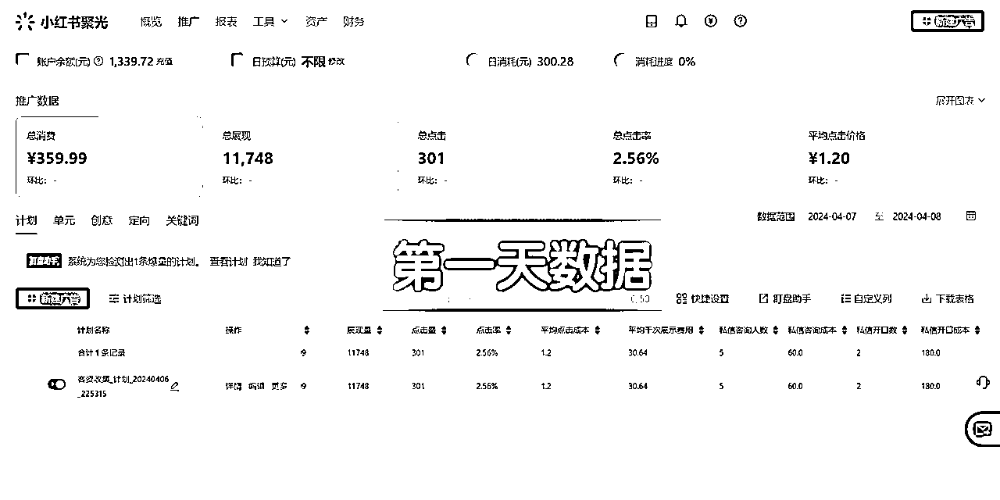
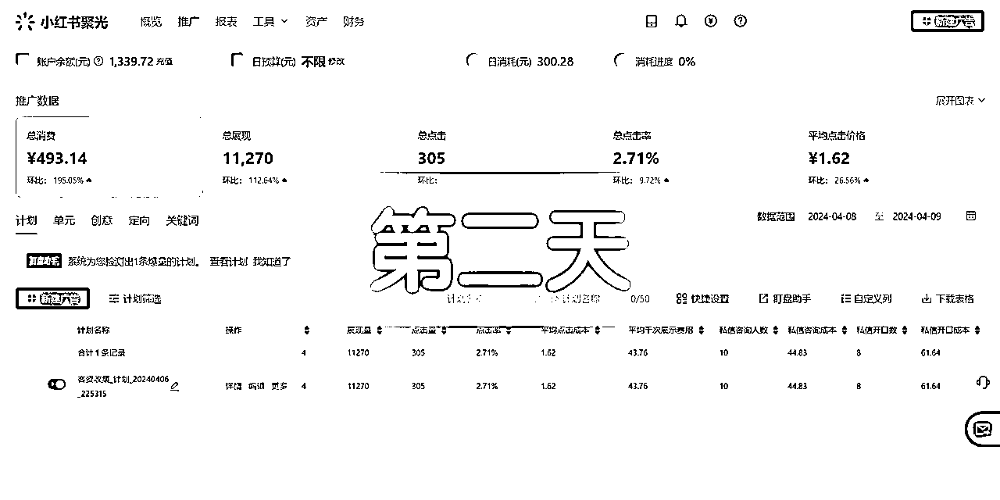
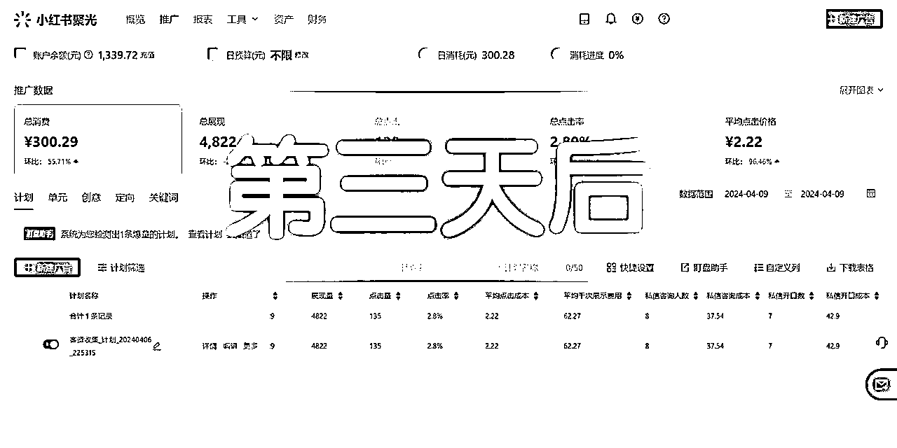

# 高客单聚光获客经验分享：教育培训考公赛道三天开口成本由大盘水平180降到40左右，一周左右招满学员

> 来源：[https://u8a4pf28ca.feishu.cn/docx/SGl6dS0UEosdZrxGGY5clyh6nyc](https://u8a4pf28ca.feishu.cn/docx/SGl6dS0UEosdZrxGGY5clyh6nyc)

大家好，作为一名生财新人，叫我小铭同学就好。作为一个在中高客单价赛道累计GMV近千万，聚光线索类投放roi大于10的水下操盘人员，主打去人设化玩法获客。想跟大家聊一聊小红书聚光如何在中高客单价产品行业运用~

在聊具体案例之前，我想先从项目的角度拆解聚光获客这波机会对于普通人来讲如何把握。

## 本文结构如下：

*   聚光获客目前的情况，人员配置，启动时间，当前成果？

*   这个项目普通人目前还有机会嘛？大概的利润空间怎样？入局有哪些门槛？

*   这个项目能赚钱，哪些关键环节我们可以切入，以及如何切入

*   具体项目案例分享

*   避坑指南

### 聚光获客目前的情况，人员配置，启动时间，当前成果？

我本人从去年开始做小红书，聚光获客。涉及留学及周边业务，冬夏令营，高端旅游，教培......由于我是自负盈亏，所以一直采用控成本获客转化策略。追求极致的roi。拿海外租房来讲，非旺季月耗三千左右，获客100-300条精准线索，不过因为我们是企业微信承接，所以加微稍微有点堪忧，波动在60%，如果是个微承接，加微率可以再80%-90%。

人员配置：前端流量1人（可以根据情况增加助理或者客服）+后端销售+产品交付

如果只做前端流量，销售与产品交付和别人合作，启动一周到一个月即可有精准流量

做小红书的圈友应该能感觉到去年中旬还是可以在平台导流的，官方睁一只眼闭一只眼总体和商家也算相安无事，因此六月份之前我们团队一直在安安静静靠着小红书做低粉高客单变现+素人种草，日子过的算还可以，转折点发生在去年6-9月份。这段时间能明显感受到官方在逐渐收紧，因为在六月份新起矩阵号时逐渐发现老被处理，挣扎到九月份被严重的封矩阵号后，日子实在过不去了，并且也很影响团队气势，所以为了保号活下去才开始接触聚光投流。

鉴于圈里有不少关于聚光的帖子，后台操作细节之类这篇内容就暂时先不聊，重点从项目的角度来分析对于普通人如何来切入聚光这波机会~

### 这个项目普通人目前还有机会嘛？大概的利润空间怎样？入局有哪些门槛？

其实在切入小红书之前，大家都一样，我是因为抖音电商项目失败，一夜回到解放前，逼不得已探索其他出路，做过抖音IP打造，小红书项目，视频号电商，视频号高客单引流转化......才逐渐在做的过程中发现小红书和视频号机会，又在走投无路的情况下发现聚光这波机会。所以对于普通人来讲，核心在于执行力与落地，不然即便发现机会红利也会错过。

当然有没有什么入局门槛，参加过上次聚光投放航海的朋友，会第一反应：需要营业执照申请企业号，以及需要申请聚光账户，和投流金额。

最开始我也是遇到这些问题，但是办法总比困难多，现在多的是商家缺流量缺投放人才。这里给大家提供两种解决办法：

1.  先入职公司投放，公司这些项目肯定是准备好滴，你只需要大展拳脚就好~这里有些人可能又问：我不会投放，怎么入职，你要明白一点入职只需要过了面试的门槛，以及你稍微学一些投放思路，通过互联网搜索提前了解一下后台按钮这些，不至于显得特别不懂就好，剩下的就是不断面试面试积累经验练手。

1.  直接找商家合作，就说我可以给您负责获客，需要您这边有现成的企业号账号与聚光账户，如果再激进一点，甚至可以说您这边的投流费我都可以自己出（1000-2000就行），目的是给对方希望，有了希望才有进一步。就好比恋爱中，空口无凭会觉得你在画大饼，但是你买一束花，一个礼物一些付出，让对方看到你的诚意和态度；这里可能有人会说，那他如果后面一直让我出投流费用呢？咱跑就行，要明白项目合作是双向筛选，不是高低位存在。要时刻记住你合作的最初期望，不要偏离太多。

你看这些门槛其实不难被解决，只要你想你的执行力足够，都不是问题。当然如果有人问，我身边没有资源咋办，这个就要发挥自己的智慧，现在公域这么多，流量这么多，商家这么多，总能有合适滴，就看你聊了多少~

我当时刚切聚光时，市面上的坑基本踩了一边：

1.  投流代投砸进去没效果；

1.  招千川其他平台投手，但是成本有点高，培养好员工后就离职；

1.  逼不得已自己亲上（本人电商出身，鲁班，千川......有一些投放的底子），经过自己烧钱摸索，花钱请教一线聚光投手，不断迭代。而且当时找聚光实战投手难得要命，交流都没有人交流，现在稍微好一些，陆陆续续有一些圈子可以交流。

这里后面会专门有一部分避坑指南！！！一定要看，都是血的教训啊！

这里分享一个个人学习心得：前期先去实战或者跟经验丰富/一直在一线人员的人交流付费学习（发个红包，请吃个饭，直接跟着学......），等自己稍微入了门能驾驭了分得清后，再去付费学习接收一些培训课程不一样的信息和思路，不要封闭自己！！！先建立一套自己的体系，再去丰富它。

### 这个项目能赚钱，可以拆分成哪些关键环节？（比如选品，引流，团队搭建...）

我们先来看项目赚钱的环节，再来看普通人适合做哪一块。

一个项目分为选品/定行业——流量端——销售端——产品交付。无论是电商还是线索型客资，核心就这几个环节。

对于我们想要切入的人来说，稳妥的方式，先定好行业赛道，再去从流量端切入。有能力的或者想完整跑闭环的额可以流量+销售+交付都跑下来。

接下来分别具体来展开讲：

1.  项目：

我个人的理念一直是项目先行，行业大于一切。

举个例子，拿高客单的留学/考公培训/财税/海外租房/旅游...这些一单的利润就是四位数+；这些利润可以支撑的住我们投流费用。加下来我们不考虑其他因素，只看付费流投放，用高端旅游来算个账：假设我们走聚光投放获客，我烧2000到3000，来了小100个精准客资，加微按照80%算，加了小80人，转化按照20%算，就可以成交差不多16单，一单按照1000的利润，只要成交大于两三单，这就是可以搞！更何况成交小16单呢，不放大不就是有钱不捡嘛

我们再举一个生活美容的例子，假设一单利润在100，那么我是不是要每天消耗100，加微两三个，成交一单，才能考虑接着做，不然这个渠道我就是亏钱的。或者再持续优化到可以做为止。

所以我本人非常倾向中高客单~

1.  流量端和销售端以及产品交付端这块就比较好理解啦，对于那些想一个人跑完全链路的，可以试试教培资料赛道。这样交付流程化，不用太费心费力，只需要把控好流量和销售即可。

1.  再来聊一下团队搭建，其实前期的话不需要很多，有一到两人就好，后面根据项目发展在随之调整人员框架即可。

### 落地案例分享

分析了这么多，下面我们以四月份带的最新的考公案例来具体的感受，一共用了2000左右来测，这个商家在第三天开口成本就有由180压到40左右，每天十多个二十多个开口咨询。不到两周就招满学员。数据变化如图：

#### 一：信息确认与准备

1.  首先确定后端销售转化路径没问题，资质认证没问题，行业不禁投。这块非常重要！！在这个过程中大家一定要对资质行业特别敏感，因为聚光变化很快，如果有朋友从去年开始下场明显就能感受到，首先是认证的时间拉长，其次对行业规范也逐渐成熟。一些行业可能之前可以投，现在就不能投放了，或者对资质要求门槛越来越高.......如果行业资质选的不对，那势必会影响过审，就算在厉害的投放过不了审那也白搭。这个商家就在后面遇到推广资质的问题。以至于在第一环节的测试时卡在素材上，后来发现问题后换了资质才顺利通过。

1.  在确保可以推进的前提下，我跟他讲了目前赛道最新的情况进展，以及后续节奏安排。

1.  然后商家那边确认企业号，聚光账户的认证开通。

1.  一切就绪后约1v1，梳理产品与业务，为后续投流做准备。投放一定是具体问题具体分析的，哪些业务适合投放哪些不适合，不要一股脑怼上去！不然很可能烧了钱效果也一般。

#### 二：小红书投流内容模块

这里很容出现的问题，各种误区。像是：是制作完笔记先跑自然流再从去筛选数据好的来投；投放之前先养号；投放之后就没有流量，付费压制自然......所以在这个过程既是纠正对小红书平台的理解，也会在推进中加深对自然流付费流的底层理解。

##### 笔记素材带着做3-5篇笔记，付费流与自然流误区；怎么制作投流笔记，参考笔记，如何去参考。

1.  为了赶上行业最佳的时间，直接1v1的会议中就把投放中笔记核心要点简短直接点明。给到最对方经过验证后，90%成功率的笔记框架，让对方直接先制作。不过还是不建议这么赶，时间可以的情况下还是建议留出一到两个月。不然很容造成拿来主义，遇到问题自己也没办法分析的局面。有时候快不一定快。

1.  举个例子如果只是用现成的，带的过程一路顺风，如果换了变量过审卡住，不过审怎么看，如何改。这些问题有时候还是需要自己遇到感受到，遇见问题-解决问题-总结经验。

#### 三：聚光认知+操作演练

根据考公业务建立专属词包，手把手带着搭建一条计划，一边一步步教操作，同时讲解各种按钮背后逻辑以及会造成额外浪费的费用，基本上1000-2000就能测出来投产，保守期间一般测试费用3000一批次，这个商家在第三天开口成本就压到40左右，每天十多个二十多个开口咨询。数据变化如图：

整个过程甚至就只建立一条计划，hh其实计划不再多而在有效，当然那种每天上素材建新计划也是有适用的阶段，投放的一定是围绕“精准，成本”，那些烧了千八百没转化的一定是某些链路出了问题，而这些就应在消耗100-1000；1000-2000区间被发现并逐步解决掉。

其实在第一条计划跑到正轨后，再搭建一条计划，两条计划相辅相成。就能解决大多数商家的投放问题，每月低成本撬动高效益。

#### 四：达到的结果

*   三天开口成本由180降到40 ，考公商家每天忙后台咨询，过了一周多都不咋理我了。看朋友圈已经招满线下学员。PS：产品单价在五位数。

#### 完整的业务投放步骤：

1，前期确认行业项目可以做小红书聚光；并准备企业号+聚光

2，基于对小红书，聚光的理解，制作精准的笔记用于投放，并搭配账号端操作。

3，计划不再多，而在精准又低成本。对于普通的商家而言，选择控成本投放比较合适。投放个两三千收益五到六位数。而投放的红线是roi持平，做渠道如果亏钱建议先停，优化好短缺的部分再来衡量。

4基于对聚光的逻辑理解只专注关键数据。分析优化关键指标。最终落到收益上。不同是投流策略适合不同的情况，一定要看自己行业自己业务的情况！

### 避坑指南

跟大家分享三个蛮要命的踩坑点，都是血的教训。

1.  投流砸进去没效果；

*   这是后来接触的很多商家反映的问题，像自己不会投放，招的第三方代投或者官方推荐，结果一个月花了一万，效果不理想，最近有个万粉博主找我聚光咨询也是遇到这个问题，我看了后台情况，其实本质上就是投放策略的问题，而投放策略不合适本质上由于对平台对聚光逻辑的不理解，同时对所投放的业务把握出了差错。

*   这里有个点大家需要注意昂，投放前一定要对业务熟悉了解，且销转路径是跑通滴，要不就花1000-2000测试业务的投放获客+销转现状。不要明明有问题还盲目投，一定要学会分析；

*   当然也不用盲目听别人说跑不出去素材有问题，跑不出不适合等等......咱们商家自己心里要有判断标准！！！

*   这里面还有的误区：大盘情况。举个例子大盘考公开口100-200。是不是跑到大盘水平就好啦，不是滴，你想想什么是大盘，就是不太擅长投放的商家小a，参差不齐的投手小b，有指标的官方/代投小c，以及各种水下人员小d，取他们的平均值，就好比你挣10万，我挣2块，平均就是50001，不要过于在乎大盘，有参考数据很好呀，没有也无所谓，基本上我所经手的商家行业远远低于大盘成本。最重要的要懂业务懂投放！

1.  招千川其他平台投手，不懂聚光逻辑，培养成本有点高，并且培养好员工后很有可能离职打水漂；

这个可能老板们会有所感受，看你的立场叭，作为员工又能更挣钱的当然会离开呀，作为老板就要看你舍不舍得分钱以及如何分啦，而且其实聚光投手这个岗位很稀缺滴，如果找别的平台投手，它可肯定需要烧钱涨经验，而且还得看这个投手的悟性，那倒不如跟着有经验的取取经。最好是老板自己也稍微懂一些。毕竟花的是真金白银，还是得心里有点数嘛。

1.  缺少交流的信息

这个在去年真的很少，当时逼不得已自己上投放（本人电商出身，鲁班，千川......有一些投放的底子），当时烧钱摸索，想花钱请教一线聚光投手都很难找到合适的，都快把自己的身边朋友资源盘个遍才遇到。想找聚光实战投手难得要命，交流都没有人交流，现在稍微好一些，陆陆续续有一些圈子可以交流。像咱们之前的投放航海，以及大家在社群的发言，其实都可以学到很多滴~还是要多交流叭多进一些投放圈，或者多认识一线投放朋友。千万不要封闭自己~

以上就是自己的经验分享，也是希望可以帮到更多人抓住这波红利，愿大家一起生财有术~