# 从提示词小白到1.4w+的商单，我是如何做到的？

> 来源：[https://fizaghzgugc.feishu.cn/docx/TfjCdEXLxosTUGx3jsccgdJtnJh](https://fizaghzgugc.feishu.cn/docx/TfjCdEXLxosTUGx3jsccgdJtnJh)

这是我在生财发的第一篇处女作，先自我介绍一下


95后高校青椒 | B站 & YouTube AI 教学博主｜ AI提示词爱好者

🧩 近半年在做的事：从0 开始做自媒体 | 从0开始学AI | 从0开始做AIP

🏆 近半年的小成绩：5 个月自媒体平台粉丝 1.3w+

💰 5个月变现 8w+ | 定制过客单价分别 3k｜4k｜5k 的提示词商单

🎨 也是一位理性多于感性的美术生 | 喜欢用笔“表达自我” | 不断突破自我

* * *

嗨~大家好，我是曾曾。B站 & YouTube AI 教学博主，提示词爱好者和践行者。

说来也奇怪，我是一个纯艺术生 & 文科生，高考数学78分，但我并没有因为自己是艺术生 & 文科生，不擅长数学而自我设限。反而对AI有着强烈的好奇心和探索欲，一直在践行中...

但我真正扎进去了之后，我发现内心更加充盈了，也开始有了一丢丢野心，想通过 AI 开启“第二事业”，扩大影响力，建立个人IP。

在正确的道路上一直努力着，就会收获一些意外的惊喜。幸运的是通过做自媒体也收到了一些及时的正反馈，接到了客单价3k、4.5K、5.5K 的提示词商单。

当写完这篇分享贴之后，我才发现这半年真够拼的，“进化”速度也是真真切切的快。

半年前我还是一位AI小白，没想到现在和AI竟然成了最好的工作搭子。

切入正题，今天我会从由基础到高阶，分享我学习提示词的路径和经验，皆为真思考、真实践、真感悟，看到最后相信你一定会为我👍。

下面是本文章的目录📚，点击文字可跳转：

1.  基础入门 - 修炼内功基础

*   prompt的定义和特点

*   AI大模型的工作原理

1.  中级修炼 - 学习拳法技巧

*   细节法、角色法、示例法

*   反向提问法、引导自省法

1.  高级修炼 - 深化内功心法

*   见招拆招，掌握“思维链”

*   深化内功，引入思维模型

1.  达人阶段 - 内外兼修，炼就绝技

*   结构化提示词定义及应用

*   结构化提示词的常用模板

1.  个人提示词商单实战案例分享

# 一、 修炼内功基础

## 一）什么是Prompt？

Prompt类似于心理学中的“启动效应”，即一个初始刺激（如音乐或场景）能够激发一系列相关的记忆和情感反应。

假设一下我们是领导，AI是一位“清澈的实习生”，这时候活儿来了，你要给他派活。你对小王说，“明天中午之前帮我做一份汇报PPT”，这里“做PPT”的任务就是我们常说的 「 Prompt 」。

等同于我们在对话框向AI输入的指令，比如“生成一段文本、回答一个问题或者创建一个图像、视频。

这里所输入的 Prompt 起到了「启动 」作用，它激活了AI语言模型中的相关词语，并基于上文的语义确定输出的内容。

此时，所输入的prompt（输入）起到了 「启动」作用，它能够激活 AI 语言模型中的相关词语，并基于概率预测接下来所生成的的内容。

这类似于心理学中的“启动效应”，即一个初始刺激（如诗句、音乐或场景）能够激发一系列相关的记忆和情感反应。

就像我们看见,夕阳无限好，_______? 就会想起下一句:只是近黄昏。

## 二）AI大模型的工作原理

想要让 AI 为我们“高效又高质”地打工，首先就要了解它的工作原理，我将用最浅显的话解释给你听。

抽离出 AI 的底层工作原理，这个过程可以比作一个逐字接龙游戏🎮。AI 主要通过我们输入的内容来输出下文，它基于上下文的语义来计算下一个词的出现概率，从而挑选出最合适的词汇来构建句子。

本篇手册将全程选GPT来干活，如果大家网络环境受限，用kimi也可以，我输入一个指令：

```
“今天的天气真好，我打算去___?”
```

这里的“天气真好”设定了积极的基调，“打算去”暗示了接下来可能是一个地点或活动。当我们将这个指令发送给AI时，AI会从数百个可能的续接词汇或短语中进行选择，比如“海边”、“公园”、“散步”等。

同时，AI会为每个选项计算一个概率值，这个值反映了在当前上下文中该词汇出现的可能性。

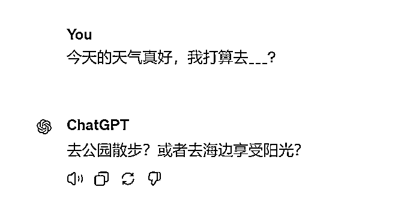

如果AI的目标是维持话题的连贯性和积极性，它可能会根据概率值选择“公园”这个词。

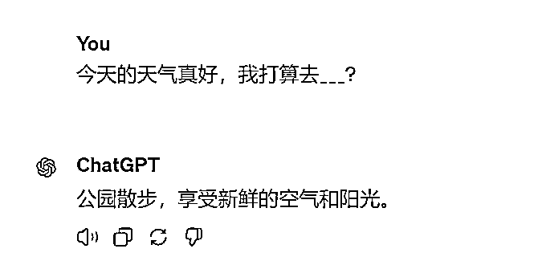

为什么是公园呢？因为它不仅符合外出的情境，而且在好天气时☀️，公园是一个常见的活动选择。然后基于这个新的上文,GPT再预测下一个字符,如此循环往复,一个字一个字地生成出连贯的语句或段落。

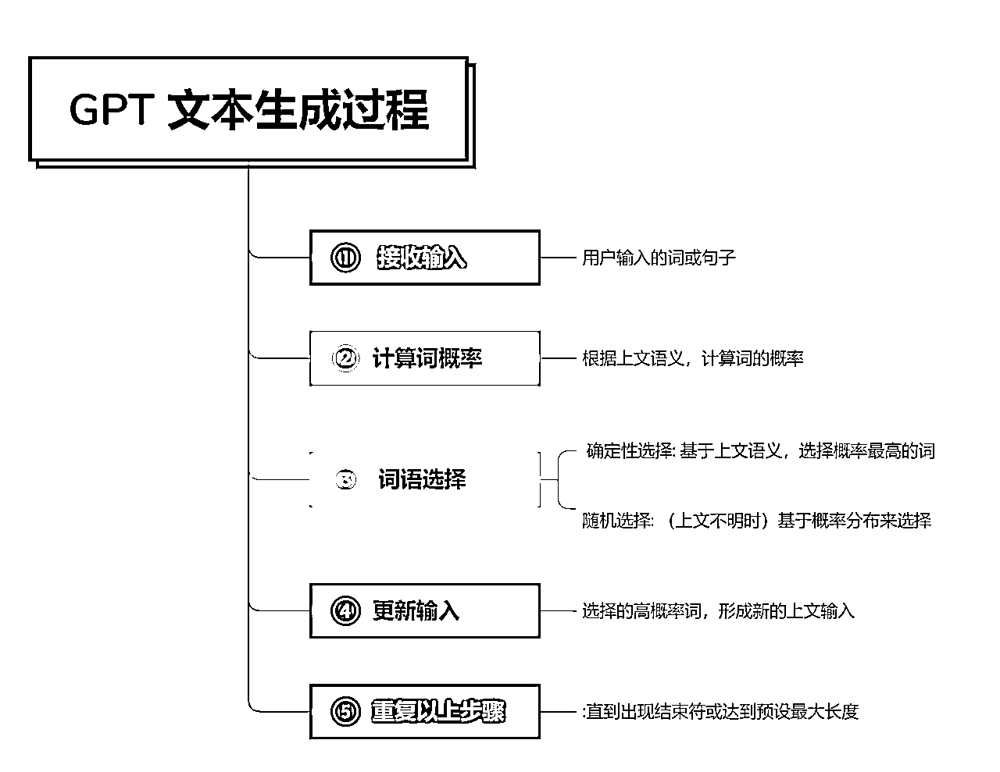

那明白了原理后，我们就知道大模型并非真的有思考和推理能力，它所有的输出都取决于输入（上文）。如果你不知道这些底层原理，在编写提示词的过程中就产生一些困惑。比如：AI为什么做不到这个，明明我输入是这样的，它为什么输出是这样的。

## 三） 大胆和AI聊天，培养语感

前期不要追求各种“花拳绣腿”，不妨试着用一些简单的指令尝试着和 AI 对话，就像和朋友说话那样，保持耐心和友好。

在心流状态下，专注地和AI 大模型对话，沿着它的思路去追问，直到探索到你想要的答案。慢慢地，你就能够培养语感，和AI建立“默契”👬。

# 二、学习外家拳法

推荐阅读 OpenAI 官方的提示工程文档 https://platform.openai.com/docs/guides/prompt-engineering

我提供 5 个我自己常用的提问技巧，可组合使用：

1.  细节法

1.  角色设定法

1.  提供示例法

1.  反向提问法

1.  引导自省法

### 一）细节法

“提供明确、具体的指令”，看似简单的一句话，但做起来还真不简单。把话说明白这事儿，时需要一些“功力”的。

我们举个🌰:

你打算下周去上海旅游5天，你想让AI给你做旅游计划和攻略，你是不是上来咔咔一顿操作，简单粗暴的输入了这段Prompt：

```
下周我将去上海旅游5天，请给我做一个详细的旅游计划和攻略。
```

等等！？这画面有曾相似啊，就像领导给你布置“下周一召开紧急会议😣，做一个PPT”。相信大家都深恶痛绝类似这种“一句话需求”的任务，背景不清不楚，模棱两可，留我们在原地凌乱。

是不是像极了你和AI 对话的样子？不知道你的膝盖痛不痛。想象一下我们（人）是领导，AI 是我们的员工，也是一位“清澈的实习生”，他是没有任何工作经验的。

那我们派活儿的的时候，避免我们再返工，一定要越明确越好！越具体越好！最好是手把手教学那种，只有这样他才能干出漂亮的活儿。你觉得呢？

向鲁智深学习，成为提问高手

第一问：奉着经略相公钧旨：要十斤精肉，切作臊子，不要见半点肥。

第二问：再要十斤都是肥的，不要见些精在上面，也要切做臊子。

第三问：再要十斤寸金软骨，也要细细地剁做臊子，不要见些肉在上面。

鲁智深算是把话说明白了，肥是什么程度？瘦是什么程度？分别用来干嘛，明确具体、分步骤精确描述。

所以我们在给prompt的时候，一定要提供明确，具体的描述，给足充分的上下文。比如，这样提问：

```
我计划下周去上海旅游5天，请你为我制定一个详细的旅游计划和攻略。需要包含以下内容：
-每天的行程安排，包括主要景点和活动。
-每个景点的详细介绍和游玩建议。
-推荐的餐厅和美食，最好是当地特色。
-交通方式和出行建议，包括如何从一个景点到另一个景点。
-住宿推荐，适合旅游的区域和具体酒店建议。
-其他有用的旅游贴士和注意事项。
```

### 二）角色设定法

给GPT指定角色可以让它更好地模拟该角色的语气、思维方式和行为模式,从而产生更加个性化和贴切的输出。

就像我们上面所举的例子，所输入的prompt会激活相应的语料库，身份设定同理。同样，在提示词中清楚地说明角色和期望的任务或问题，并提供必要背景信息，帮助GPT更好地理解上下文。

简短指定：直接指定角色并提出问题。

```
你是一个资深的历史教授，请解释一下法国大革命的主要原因。
```

详细指定：提供角色背景和具体任务。

```
你现在是一个拥有十年经验的心理咨询师，有一个客户来找你咨询，因为他最近工作压力很大，导致失眠。请问你会如
```

场景模拟：创建特定情境，要求GPT根据角色进行回应。

```

假设你是一个酒店的前台接待员，面对一个对房间不满意的客人，你会如何安抚他，并提出解决方案？
```

多角色设定法：多元视角解决问题

不仅指定一个角色，也可以指定“多角色”来探讨问题，可帮助我们更全面地分析问题，并提供多元化的视角。

```
假设你们是一个跨学科的专家小组，包括历史学家、经济学家和社会学家。请讨论一下工业革命对现代社会的影响。并综合三者概观点输出。
```

GPT的回复：

```
历史学家：
工业革命是人类历史上一次重大的转折点。它带来了生产方式的巨大变革，从手工劳动转向机械化生产，
使得生产效率大幅提高。这不仅改变了经济结构，还促使了城市化的发展，形成了现代社会的基础。

经济学家：
工业革命导致了资本主义经济体系的崛起。大规模的生产和市场扩展带来了前所未有的财富积累和经济增长，
但也加剧了贫富差距。资源的集中和技术的进步推动了全球贸易和金融市场的发展，对现代经济有深远的影响。

社会学家：
工业革命对劳动力和社会结构产生了深远的影响。大量农村人口涌入城市，导致了城市化进程加快，
但也引发了城市问题如住房短缺、环境污染和社会不平等。工人阶级的形成和劳工运动的发展，推动了社会变革
和权利的争取。

综合三者观点：
工业革命通过其对生产方式的变革、经济结构的调整以及社会变迁的推动，全面塑造了现代社会
的面貌。一方面，它促进了经济的快速发展和技术的进步，为现代社会的繁荣奠定了基础；另一方面，它也带来
了新的社会问题，如贫富差距和环境污染。面对这些挑战，我们需要从历史、经济和社会多个角度综合考虑，寻
找平衡发展的路径，推动社会的可持续进步。

```

### 三）提供示例法

提供示例”是一种指导语言模型理解和执行特定任务的方法。通过在prompt中提供一个或多个具体的输出示例，可以帮助模型理解所期望的响应语气、风格和结构。

1、使用场景

1）撰写特定类型的文本(如新闻报道、营销文案、诗歌等)

```
### 示例诗歌：

在夜的宁静中，星光闪烁，
梦中的花园，芬芳弥漫。
轻风拂过，心灵的湖泊，
思绪如水，缓缓流淌。

### 请根据以上示例写一首关于“春天”的诗歌：

```

2）生成特定格式的内容(如文本、表格、列表、JSON等)

```
### 示例表格：

| 商品名称  | 价格 | 库存数量 |
|-----------|------|----------|
| 苹果      | $1   | 100      |
| 香蕉      | $0.5 | 200      |
| 橙子      | $0.8 | 150      |

### 请根据以上示例创建一个关于“电子产品”的表格：

```

3）模仿某种语气或口吻(如正式、幽默、撒娇、暴躁等)

```
### 示例暴躁爱骂人的语气：

你他妈的，这件事怎么搞得这么糟糕？你丫的到底懂不懂啊？这点小事都做不好，你有病吧？是不是脑子短路了？赶紧给我重做一遍，别再犯这种低级错误！

### 请根据以上示例写一段关于“同事工作失误”的暴躁批评：

```

4） 在解答复杂问题时，通过示例指导模型如何组织和呈现答案。

```
### 示例解答：

问题：如何规划一次家庭旅行？

示例回答：
1\. 选择目的地：与家人讨论并选择一个大家感兴趣的地方。
2\. 制定预算：根据经济状况，确定旅行费用，包括交通、住宿和餐饮。
3\. 安排交通：选择适合的交通方式，如飞机、火车或自驾，并提前预订。
4\. 预订住宿：选择交通便利、环境舒适的酒店或民宿。
5\. 制定行程：合理安排每天的活动和休息时间。
6\. 准备行李：根据目的地气候和行程准备衣物和日用品。
7\. 安全措施：了解目的地的安全状况，购买旅行保险，注意人身和财物安全。

### 请根据以上示例回答以下问题：“如何组织一次家庭聚会？”
```

5）多维度示例

多维度示例是指从多个维度提供示例，如风格、格式、内容等，帮助AI全面理解任务要求。这种方法能确保AI在各种情况下都能生成符合预期的结果。

示例：假设你需要AI生成产品描述，可以从功能、外观、使用场景等多个维度提供示例。

```
请根据以下示例生成一篇涵盖功能、外观和使用场景的智能手表产品描述：

示例1（功能）：
这款智能手表具备心率监测、步数统计、睡眠分析等多种健康功能。通过先进的传感器，用户可以实时监测自己的健康状态，及时调整生活习惯……
示例2（外观）：
这款智能手表采用了简约时尚的设计，表盘采用圆形金属框，搭配柔软的硅胶表带，既适合日常佩戴，也适合运动使用。多种颜色可供选择，满足不同用户的个性化需求……
示例3（使用场景）：
无论是工作、运动还是休闲，这款智能手表都能为您提供便利。它具备防水功能，适合游泳佩戴；同时内置GPS模块，让您在户外运动时无需携带手机也能记录运动轨迹……

```

### 四）反向提问法

还是用刚才那个例子啊，想象一下我们（人）是领导，AI 是我们的员工，这时候活儿来了，你要给新来的实习生派活了。

你说“小王，给我仿写一篇董宇辉风格的小作文”，此时的小王用清澈无辜的眼睛盯着你，和你说“我不懂诶”。

此时作为领导的你，为了让小王漂亮的完成这个工作，得用你的老师傅方法论给他讲清楚。但奈何不是每个人都是“老师傅”，如果作为领导的你也没有方法论，那怎么办呢。

也就是当你自己也不清楚，该如何告诉GPT做某事的方法论的时候？该怎么办呢？用魔法打败魔法 ! 问GPT！没错！这技巧屡试不爽。

举个🌰

```
-你是一位资深的文案创作者，帮我撰写一篇关于“成都宽窄巷子”的旅游宣传文案。
-但我不确定该角色应该具备哪些技能，请你根据你的专业知识给出建议。
```

GPT会根据Prompt给出一些建议技能，比如:

```
研究：深入了解目的地的历史、文化、特色，收集有用的资料。
分析：确定目标受众的需求和兴趣点，分析市场趋势和竞争对手。
规划：设计文案的结构和布局，确保信息逻辑清晰，层次分明。
撰写：运用丰富的词汇和多样的句式，撰写有吸引力和感染力的内容。
优化：根据SEO策略，优化关键词使用，提升文案的搜索引擎排名。
```

但如果你对这些建议还有疑问,比如不太理解"设计文案的结构和布局"到底是什么意思，这时你就可以反过来问GPT：

```
-你上面提到了“设计文案的结构和布局”这一技能，我不太清楚这是什么意思？
-也不清楚在写文案时应该如何设计这部分，请告诉我其中的方法论？
```

通过这种连续性的反向提问,GPT会进一步解释和举例说明,让你更好地理解所需的技能点。如果还有不明白的地方,可以继续反向提问,直到完全理解为止。

### 五）引导自省法

帮助模型识别并纠正自身错误，确保输出内容与指令对齐，从而提高模型回答的准确性和可靠性。

1、提示模型检查答案准确性

解释：要求模型确认其答案的准确性，促使其重新审视输出内容。

```
你确定你刚才的回答是正确的吗？请重新检查并确认你的答案。
```

2、引导模型思考错误原因

解释：当模型的输出与指令不对齐时，引导它分析为什么会出现这个问题，以及帮助我们优化指令。

```
请思考为什么你的回答与我的指令不一致？能否分析一下你的回答中出现错误的原因？根据你的分析，我们应该如何优化指令？
```

3、引导模型为自己的表现promt打分

自我评分提示词是一种高级提示词技巧，目的是让模型对其输出的质量进行评价。这可以帮助我们更好地理解模型的表现，并找到改进提示词的方向。我们可以设计一组问题或评分标准，要求模型对其输出按照这些标准进行打分。

```
###提示词
请生成一段关于人工智能的介绍。生成完成后，请根据以下标准对自己的内容进行评分，并给出每个评分的理由和改进建议：

-内容的准确性（1-5分）：信息是否正确，是否符合实际情况。
-逻辑性（1-5分）：结构是否清晰，论证是否有力。
-流畅性（1-5分）：语言是否顺畅，表达是否自然。
-相关性（1-5分）：生成内容是否与要求的主题高度相关。
-创新性（1-5分）：内容是否具有独创性和新颖性。

### 生成内容
人工智能（AI）是计算机科学的一个分支，涉及创建智能机器的研究。AI系统可以执行诸如语音识别、学习、计划和问题解决等任务。以下是对生成内容的评分：

-内容的准确性：4分。理由：总体信息正确，但可以增加更多科学数据支持。改进建议：增加具体的数据和引用来源。
-逻辑性：5分。理由：结构清晰，论证有力。改进建议：无。
-流畅性：4分。理由：语言基本顺畅，但有些句子可以更简洁。改进建议：简化一些复杂句。
-相关性：5分。理由：内容高度相关，完全符合主题要求。改进建议：无。
-创新性：3分。理由：内容较为常见，没有特别新颖的观点。改进建议：引入一些新的研究或观点。
```

## 三、深化内功心法

## 一）思维链CoT

我们（人）有思考和推理能力，在说话之前我们可以在脑中构思。

AI 没有脑子，也没有心理活动，它的说就是想，想就是说。

思维链CoT方法可以有效提升 AI 输出质量，这招特好使。

那么啥是思维链(Chain of Thought，简称CoT)呢？可能很多小伙伴会想，难道是思维的链条吗?我们拆解来看，这里的思维存在于我们的脑中，它是抽象的。链条是环环相扣的，一环接一环连贯的。

就像自行车链条一样每个节点都有其独特的位置和功能，在思维链中，每个节点代表一个逻辑步骤或推理过程。这就像一环接一环的推理过程，确保每一步都是有依据且有联系的。总的来说，思维链具有因果关系、连贯性和逻辑性。划重点了：因果关系、连贯性、逻辑性。

抽象吗？那我举个🌰

比如说你看到外面的天空变暗了，这是我们观察到的现象。我们的大脑会产生这样的一个思考：可能会下雨🌧️。所以我决定带一把伞，这是行动

这整个过程呢，就是一个典型的思维链，观察到“天空变暗”即输入。预测“可能会下雨”即脑海中的推断步骤，决定“带伞出门”是输出。

那每一个步骤，都是基于前面一个步骤推理所产生的。形成一个完整的决策路径。大家一定一脸问号？这和我们编写提示词有啥关系呢？别急，往下看。

我讲个6年级小王的故事吧，小王偷懒想让 AI 帮忙完成数学作业，他输入一段指令：

```
问:铁柱有5个网球。他又买了2罐网球。每个罐头有3个网球。他现在有多少个网球?
答:答案是11。

问:食堂有23个苹果。如果他们用 20个做午餐，再买6个，他们有多少个苹果?

——————————————————————
AI答：11
```

小王拿着这个答案把作业交给了老师，结果被老师抽了一大嘴巴子。

小王哭着说：AI都是骗人的！你看，这就是一个典型的反例。故事告诉我们：偷懒是不对的！不是！偏了，我想说的是：”AI不擅长计算“。请回顾，我上面讲的AI底层工作原理部分。

但很多小伙伴会想，这就是一个简单的加法题，这么简单它也不会啊？对，小G他不擅长，像极了我们偏科的样子。咋办呢！？有没有方法解决偏科的问题呢？教呗！一步一步教！把他当成 0 基础的偏科小学生。

这题很简单，我们几秒内就能算出正确答案。但并不意味着我们脑子没有推理，其实我们有一个“心算”的过程。

比如：23-20=3，然后3+6=9。对！这个就是我们计算的过程，只是这题足够简单全在脑子里面完成了而已。

我们是有思考和推理能力的，我们在说话之前脑子可以构思一下。可AI 它没有脑子，也没有心理活动，它的说就是想，想就是说。

所以！让它必须把推理的过程说出来，才能推导出正确的答案。也就是说推理线索存在于，它前面所说的话中。所以我们纠正一下小王的错误示范，这样提问：

```
问:铁柱有5个网球。他又买了2罐网球。每个罐头有3个网球。他现在有多少个网球?
答:铁柱已有5个球，加2罐网球，每罐3个，也就是6个网球。5+6=11。答案是11。

问:食堂有23个苹果。如果他们用 20个做午餐，再买6他们有多少个苹果?
```

根据我们上面一步一步的教学，AI按照我们的教学思路推理，完成的非常好：


这！就是典型的思维链提示。这个可不是我瞎编的故事啊，是有科学根据的，它源自一篇学术论文。这个概念最早是由现任的谷歌大脑研究员Jason WEI在2022年提出，下面是论文的名称，感兴趣的小伙伴可以搜搜。

《Chain-of-Thought Prompting Elicits Reasoning in Large Language Models，NeurIPS2022》

论文虽然洋洋洒洒写了几十页，但是核心方法就是我上面所举的“铁柱”的例子。即我们在给出示例的基础上，让大模型大声”说“出逐步逻辑推理过程。

CoT思维链提示=思维链+少样本提示

这就是传说中的 “Few-shot ” 少样本提示，这套方法对于复杂的任务也适用。和其相似概念的还有“zero-shot”零样本提示，也就是在我们不给提示的情况下，你让大模型自动把推理过程说出来。

还有这种好事儿？是的，只需要在我们的原Prompt后面加一句“Let's think step by step”，不信你试试。比如以下示例，这是直接提问，明显答案错误：

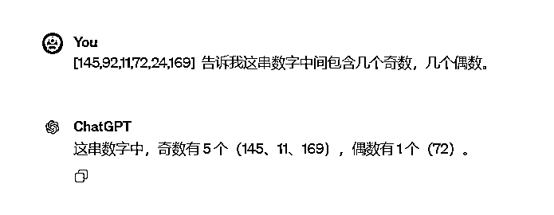

在原始prompt后面加一句“Let's think step by step”，大模型的计算力表现明显好很多


但对于复杂的推理任务，零样本示例不一定奏效，所以还是得 few-shot。

思维链的本质其实就是让大模型将复杂的任务拆解成多个连贯的子任务进行分步骤推理，并把每一步“说”出来。


也就是说它必须把推理的过程说出来，因为它在推导中说出来的每一个字，都会再作为新的输入，输进去，再在框架向量中触发新的字。

所以，上面我们提到了 AI 的说就是想，想就是说，所以它没有心理活动，它不擅长做需要先规划的事情。

## 二）见招拆招，拆解复杂任务

思维链的本质和提示词工程的本质不谋而合：“逻辑”。

所谓提示词工程，核心不是你套个什么模板用什么格式，而是逻辑。

逻辑就是你怎么将一个复杂的任务拆成科学合理的步骤，并且让前面每一步的结果都成为后面步骤的基础，所有步骤合并在一起得到最终的结果，而不要指望一步到位。

—宝玉

举个🌰

以仿写董宇辉风格小作文为例，这算是一个相对复杂任务，不信你去试试看能不能一步，二步到位。所以第一步先拆！但是具体怎么拆呢？

向有结果的人学习，站在巨人的肩膀上看世界。

我在前面反向提问法讲过，问GPT！这是方法之一，还可以通过咨询专家，查权威文献， AI 搜索引擎（见下表）获得方法论。

| 工具名称 | 网站 | 备注 |
| perplexity | https://www.perplexity.ai/ | 国外 |
| 秘塔 | https://metaso.cn/ | 国内 |
| 360AI搜索 | https://so.360.com/ | 国内 |
| 天工AI | https://work.tiangong.cn/home/ | 国内 |

这AI搜索引擎是真的好使，它不仅能理解自然语言提出的问题，我们还可以直接用完整的句子提问，不再需要像传统搜索引擎那样使用关键词搜索。

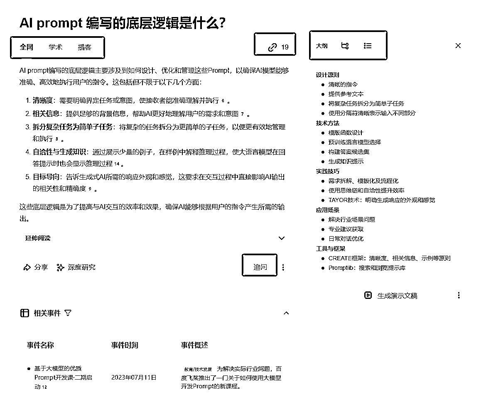

同时提供一堆相关的网页链接，通过综合了多个来源的信息，最后给出一个简洁的答案。这就像是搜索引擎帮你做了总结和归纳，节省了你自己筛选信息的时间。

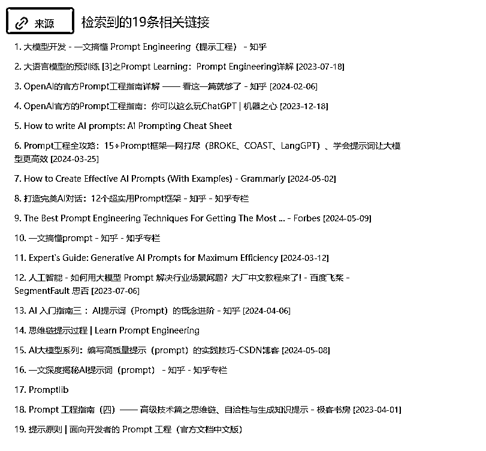

1、那我们,以仿写董宇辉风格的小作文为例，我们用秘塔AI 提问：

```
-你是一位经验丰富的写作专家，对不同写作风格有深入了解。
-我目前正在研究董宇辉的写作风格，并希望能够高度模仿他的风格撰写文章。
-请根据你的专业经验，详细描述仿写一篇文章的具体方法论。
```

为了保证方法论的准确性和科学度，我们可以综合几方工具的回答，综合来讲GPT生成的比较全面，AI搜索引擎饿的答案可以作为方法论补充，然后再人工删减一些大模型能力范围以外的步骤，我们的得到了以下的法论：

```
研究与分析：
-阅读和分析：首先，广泛阅读董宇辉的作品，理解他的主题、语言使用、句式结构和文化背景。
-关键特征提取：标记出他的写作中独特的词汇选择、比喻、象征、语气以及段落结构。这些都是构成其独特风格的关键元素。

主题和结构设计：
-选择主题：基于你对董宇辉作品的理解，选择一个与他常探讨的主题相似的议题，如社会问题、人性探索等。
-构建框架：设计文章的基本结构，包括引言、主体段落和结论，每个部分都应反映出董宇辉的结构风格。

模仿写作：
-语言和风格模仿：在撰写过程中，积极使用你所标记的董宇辉特有的语言和修辞技巧。注意模仿他的语气和情感表达方式。
-细节处理：注意字词选择和句子构造，力求让语言自然流畅，同时体现出董宇辉的文学色彩。

反复修订与优化：
-初稿修订：完成初稿后，重读并对照董宇辉的作品，检查风格上的相似度，确保没有偏离目标风格。
-语言精炼：进一步调整词汇选择和句子结构，增强文章的整体美感和读者的阅读体验。
-多次反馈：可能的话，让熟悉董宇辉作品的读者提供反馈，根据反馈进行调整。
```

2、接下来，把该方法论发给GPT，让他基于以上的方法论来为我们写一篇文案：

```
你是一名文章写作专家，请基于下面的仿写方法论，以“成都为题”，撰写一篇小作文，
注意，按照以下的方法论一步步来执行，一次输出一步，待用户确认后继续下一步。

仿写方法论：
---
```研究与分析：
-阅读和分析：阅读我所提供的董宇辉的作品示例，理解他的主题、语言使用、句式结构和文化背景。
-关键特征提取：列出出他的写作中独特的词汇选择、比喻、象征、语气以及段落结构，不要遗漏任何细节。

主题和结构设计：
-选择主题：按照上面分析的方面以“成都”为主题来仿写。
-构建框架：设计文章的基本结构，包括引言、主体段落和结论，每个部分都应反映出董宇辉的结构风格。

模仿写作：
-语言和风格模仿：在撰写过程中，积极使用你所标记的董宇辉特有的语言和修辞技巧。注意模仿他的语气和情感表达方式。
-细节处理：注意字词选择和句子构造，力求让语言自然流畅，同时体现出董宇辉的文学色彩。

反复修订与优化：
-初稿修订：完成初稿后，重读并对照董宇辉的作品，检查风格上的相似度，确保没有偏离目标风格。
-语言精炼：进一步调整词汇选择和句子结构，增强文章的整体美感和读者的阅读体验。
-多次反馈：可能的话，让熟悉董宇辉作品的读者提供反馈，根据反馈进行调整。```
---
```

当然，更好是一步步来执行，输出效果更佳。我们来看看具体的操作流程，步骤1：

```
第一，研究与分析，基于所提供的董宇辉小作文样本，详细分析其写作主题、语言使用、句式结构和文化背景。
---
'''示例1：山西
时间好像偏爱山西这片土地，于是在这里留下了许多它走过的痕迹小巷深处飘香的清洌汾酒，是时间和酒釉的奇妙相遇:家家户户桌上浓郁的陈醋，是时间与高梁的长久封印;为十四省带去了良夜和暖冬的乌金，是时间给予土地的馈赠纵跨各个时期的地上建筑，见证着5000年华夏文明走过的痕迹:我在西侯度的动物烧骨里，与180万年前的古人类相遇:在云冈大佛的琉璃双眸下，目睹北魏工匠的一钎一斧:在永乐宫近1000平方米的壁画前，赞叹元代色彩艺术的精妙绝伦在香烟缭绕的五台山顶，被响彻百年的钟声穿透心灵;历经千年的晋国宗祠，是记录历史变迁的艺术载体;雄伟壮阔的应县木塔用榫卯结构，封印了中国建筑史的奇迹:城墙斑驳的平遥古城，彰显了晋商汇通天下的卓越功绩:巍峨陡峭的太行山脉见证了千百年来民族的融合与统一
表里山河，伟岸气魄的三晋大地，散落着先人灿若繁星的智慧，也凝结着无数文明传续的印记。
这一站，让我们一起走进山西吧，翻开这一本记录了历史的书籍。'''
---
'''示例2：长安
诗人笔下，长安曾是理想之都，是云端之梦这里呢，曾有李白的浪漫张狂，也有杜甫的黯然神伤;这里有白居易的年少得志，也有王维的诗韵画香:这里有孟郊的春风得意，也有杜牧的叶落归根。这里是纸醉金迷的天堂，也是月光高悬于上的青砖古墙;是鲜衣怒马少年时，也是壮志未酬的伤心诗章;是他乡，也是故土;
是初相识，也是恨难忘，
这是长街沸灯万里游龙的大唐:
有贵妃一袭华裙罗裳，惹人心驰神往;
有遥遥华胄一掷千金，难买红颜笑;
有禅师毳客，袈裟绫罗，远渡而来经书万卷抄;有骚人墨客，仙衣白马，挥袖快意一朝天下晓。长安是心胸博大的地方:
它见证盛世之貌，也看遍历史沧桑。
它窥见人心之狂，也不忘举杯感念慷慨解囊光明、灰暗它都不挑，欣然接受，坦坦荡荡。
人在别离时感叹的“浮生只合尊前老，雪满长安道”，不过是长安千百年岁月中的一剂调味料。
他从不如人一般心事重重,怯对南山笑,因为它知道这铺满雪的道路待到春暖花开时，又会是一番繁盛景象。
长相思在长安，梦回大唐。无不心驰神往
长相思在长安，诗酒年华，青春热情坦荡'''
---
```

GPT的回答：

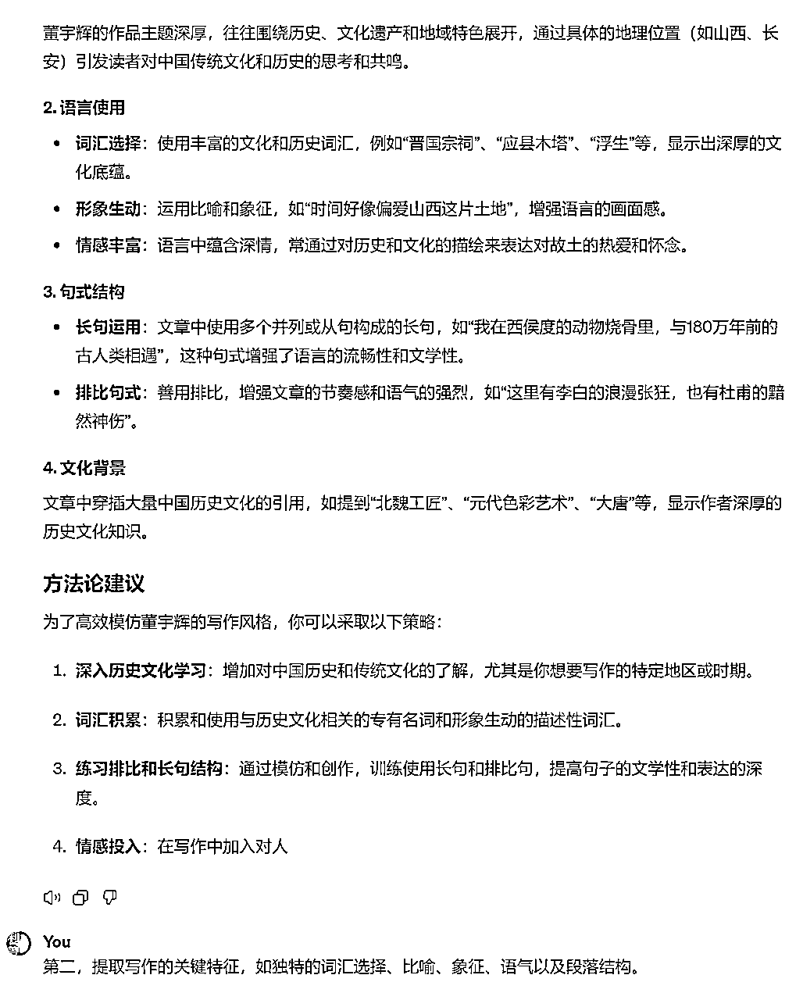

步骤2：

```
第二，提取写作的关键特征，如独特的词汇选择、比喻、象征、语气以及段落结构。
```

GPT的回答：

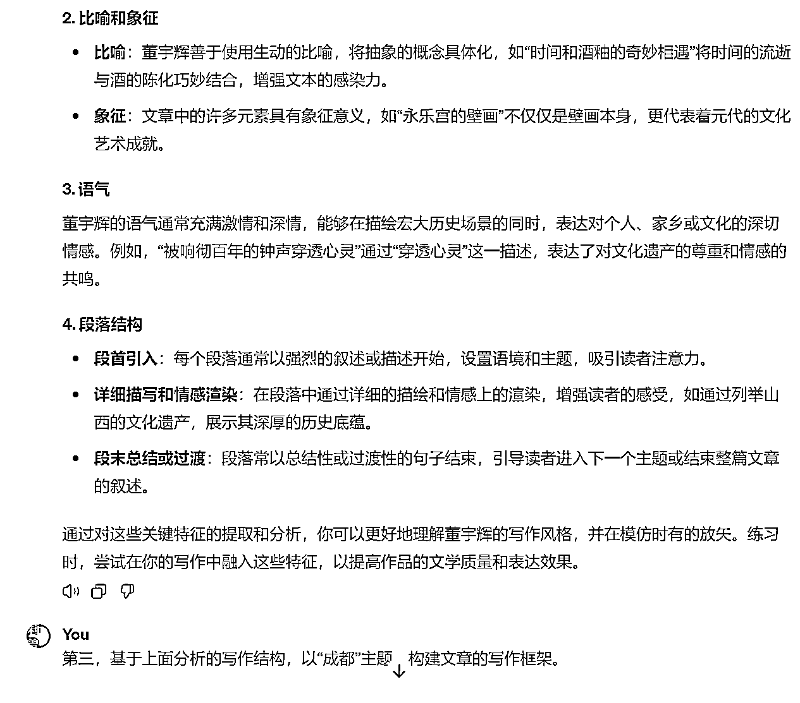

步骤3：

```
第三，基于上面分析的写作结构，以“成都”主题，构建文章的写作框架。
```

GPT的回答：

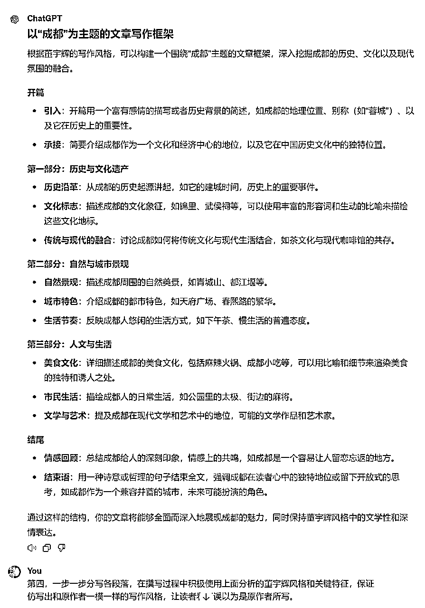

步骤4：

```
第四，一步一步分写各段落，在撰写过程中积极使用上面分析的董宇辉风格和关键特征，保证仿写出和原作者一模一样的写作风格，让读者看了误以为是原作者所写。
```

GPT的回答：

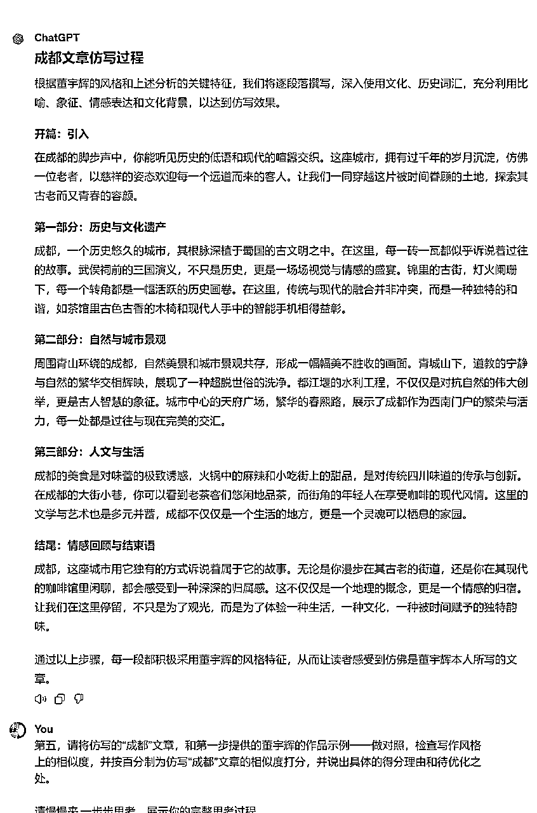

步骤5，让GPT为自己仿写的文章打分，并指出不足，这里和我：

```
第五，请将仿写的“成都”文章，和第一步提供的董宇辉的作品示例一一做对照，检查写作风格上的相似度，并按百分制为仿写“成都”文章的相似度打分，并说出具体的得分理由和待优化之处。
```

GPT的回答：

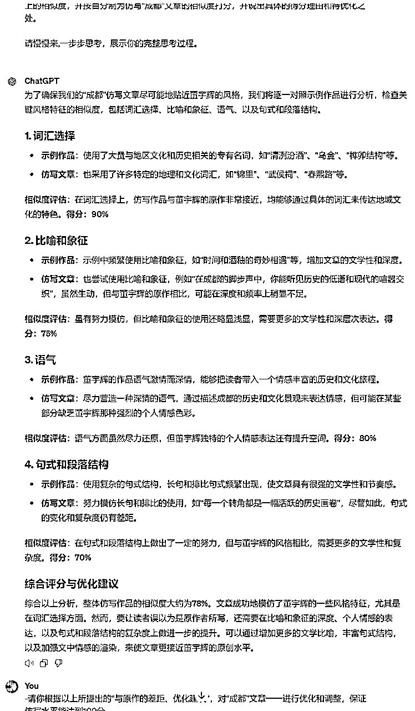

第6步，根据上面指出的不足之处来优化，做调整，我在上面提到过的技巧，引导模型为自己打分:

```
第六，请你根据以上所提出的“与原作的差距、优化建议”，对“成都”文章进行优化和调整，保证仿写水平能达到100分。
```


你们可以将这个结果和没有采用思维链步骤拆解的prompt，去做一个对比，明显后者表现更佳。

分析对象—提取关键特征—设计框架——撰写正文——评价——优化...

以上6步就形成一个完整的思维逻辑链了，将一个复杂的任务拆解成了多个子任务，从第一步到第二步....第六步，每一步的输出都是下一步的输入，环环相扣，清晰连贯，指向最终的问题。

这期视频，在我的B站也有专门的视频讲解， https://b23.tv/gWXnpRT。

## 三）引入思维模型，深化内功

👩‍🏫坦白而言，在我尚未使用AI之前，我并不习惯于借助思维模型来解决问题。首先，思维模型这一概念本身显得颇为抽象，令人望而却步；其次，即便略知一二，那些错综复杂的理论也让人难以把握，不知从何下手。

但是在AI时代，我们面临的挑战已大为不同。现在，我们只需掌握如何将思维模型与具体任务相匹配，因为AI的智能搜索和解释功能，极大地降低了我们理解和应用这些方法论的难度。

1、Prompt+思维模型的好处

（1）前人成熟的方法论，随取随用

思维模型是前人总结下来的成熟方法论，是经过反复的实践和验证过的，可直接拿来用！

（2）有助于组织和结构化思路

思维模型本身就涵盖了解决问题的清晰框架，可以按照特定的逻辑顺序来组织和表达想法，确保prompt的内容条理清晰、重点突出,从而更容易被AI模型准确理解和执行。

（3）提高prompt的针对性和有效性

不同的思维模型适用于不同的场景和任务类型。通过选择合适的思维模型,我们可以更好地引导AI模型关注重点,生成更加贴切和有针对性的输出。

2、思维模型和方法论的定义

思维模型是一种用于解决问题或理解复杂现象的框架，更多关于“如何思考”的，它是内隐的、启发性的。

方法论是一套系统的方法、规则或指导原则，用于指导某个领域的研究或实践活动，它通常包括研究的步骤、方法和标准，关于“如何做”的具体步骤和规则，它是外显的、操作性强的。

方法论 VS 思维模型

举个🌰

假设你收到了一款乐高玩具，你的目标是将它组装起来。

##### 🧠 思维模型

*   定义：帮助你理解乐高玩具的基本构成和拼接原理。

*   功能：理解不同乐高块的拼接方式； 掌握基本拼接策略，如先拼大块，后加细节。

##### 📖 方法论

*   定义：乐高玩具盒中附带的具体组装说明书。

*   步骤：1.识别并准备基座部分的乐高块 2.按说明书顺序逐步添加各个块，直至完成。

##### 🤔 思维模型 vs. 方法论

*   思维模型：提供组装乐高的基本理解和策略，是理解工具。

*   方法论：提供了详细的组装步骤，是操作指南。

方法论和思维模型提供了一个清晰的框架来组织信息。当这些框架被用于prompt编写时，它们帮助AI按照一定的逻辑结构来处理信息，从而生成更有组织、更连贯的回答。

借鉴权威领域知识和思维模型,可以为prompt编写提供新的视角和方法，通过模型化思维辅助解决问题，就像是深化内功，使得招式更具威力，也增强了其在复杂任务中的应用效果。

3、方法论 + Prompt

任务：基于 5w1h 帮助用户做计划

```
请基于 5w1h 帮助我计划本周末的户外活动
```

具体步骤：

```
谁 (Who)：“您计划独自进行户外活动，还是和家人或朋友一起？”
什么 (What)：“您想进行什么样的户外活动？比如徒步、骑行、钓鱼等。”
何时 (When)：“您计划在周末的哪个时间段进行户外活动？”
何地 (Where)：“您希望在哪个地区进行户外活动？比如公园、山区、湖边等。”
为什么 (Why)：“您选择户外活动的主要目的是什么？”
怎样 (How)：“您希望如何到达活动地点？需要关于装备选择的建议吗？”
```

4、思维模型的 + Prompt

任务：基于六顶思考帽决策

```
考虑使用六顶思考帽方法，帮我分析一个30岁女性是否应该花费3万人民币购买一款美容仪的决策。
```

具体步骤：

```
白帽：收集关于这款美容仪的所有事实信息，包括性能、评价和成本效益分析。
红帽：评估您对购买这款美容仪的直觉感受，是否真心想要，以及它对您意味着什么。
黑帽：批判性地思考可能的负面因素，如高昂的成本、潜在的健康风险、设备的长期有效性等。
黄帽：从积极的角度考虑，这款美容仪可能带来的所有好处，如方便性、可能的长期节省等。
绿帽：创造性地思考是否有其他方式可以达到您想要的美容效果，或者是否有更具成本效益的选择。
蓝帽：统筹整个过程，决定如何收集信息、评估选项、咨询专业意见，并最终做出决策。

```

当然，我们也可以把思维模型和方法论结合使用，就像是在用一张详尽的地图（思维模型）和一套精确的导航仪（方法论），这里列出常用的思维模型，供大家参考。

```
1\. 六顶思考帽 (De Bono's Six Thinking Hats)
**适用场景：**
用于决策分析、团队讨论、个人思考等。在prompt编写中，可以通过指定不同的帽子来要求AI从多个角度分析问题，如事实分析、情感反应、风险评估等。

2\. SWOT分析
**适用场景：**
用于战略规划、营销策略、职业发展等。通过引导AI进行优势、劣势、机会和威胁的分析，SWOT分析有助于制定更全面的策略或建议。

3\. 五何分析（5W1H）
**适用场景：**
用于新闻写作、项目管理、问题解决等。通过具体询问Who、What、When、Where、Why和How，可以帮助AI更深入地探索和回答问题的各个方面。

4\. 渔叉模型 (Fishbone Diagram)
**适用场景：**
用于问题解决、质量控制、根本原因分析等。在prompt中，可以要求AI探索问题背后的多个因素，辅助识别主要的问题来源。

5\. OKR（Objectives and Key Results）
**适用场景：**
用于目标设定、绩效管理、团队协作等。在prompt编写中，使用OKR模型可以帮助AI清晰地定义目标，并提出达成这些目标的关键结果。

6\. 系统思考 (Systems Thinking)
**适用场景：**
用于复杂系统分析、政策制定、教育等。在prompt编写中，系统思考可以指导AI分析问题的互相关联和长期影响，从而提供更深入的见解。

7\. SMART目标
**适用场景：**
用于目标设定、项目计划、个人发展等。SMART模型（具体、可测量、可达到、相关性强、时限性）帮助AI生成具体、实际的行动计划或建议。

8\. 批判性思维 (Critical Thinking)
**适用场景：**
用于教育、论证分析、决策支持等。在prompt编写中，引导AI进行证据评估、假设测试和逻辑推理，有助于提升生成内容的质量和可信度。
.........
```

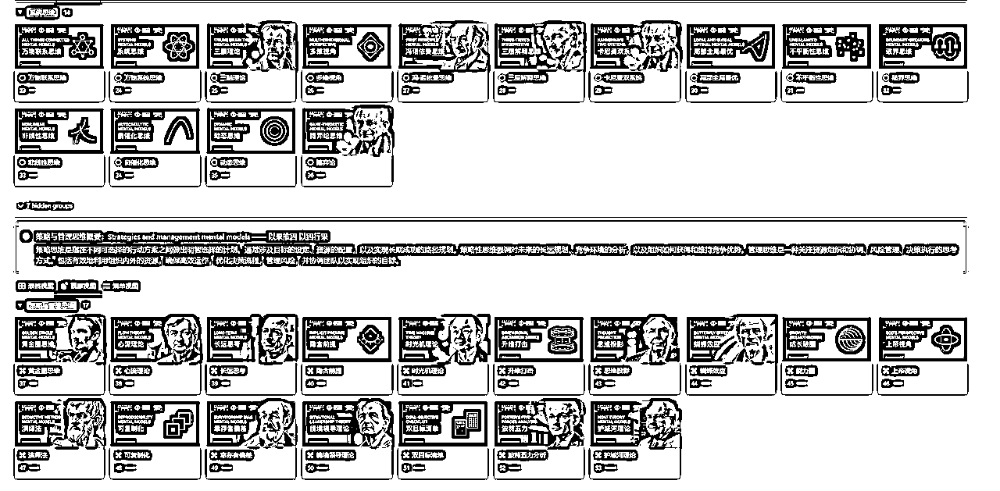

## 四、内外兼修，炼就绝技

## 一）把写提示词变成填空题

为什么我们已经看了那么多的提示词教程，学会了一个个思考框架，但在自己上手写提示词的时候，还是感觉困难重重❓

因为非结构化的提示词就像写命题作文，即使你掌握了一定的方法论，依然需要出色的语言表达能力才能清楚地表达意思。

非结构化提示词指的是简单地将任务需求用自然语言描述,没有特定的结构和格式要求，灵活但无序。

举个🌰

```
例如:您是一位资深的旅游从业者,对世界各地的旅游景点、文化习俗、美食特产、交通状况等有深入了解。请根据用户提供的旅游目的地、时间、预算等信息,为用户推荐合适的旅游路线、景点、餐馆、住宿等,并提供相关注意事项和建议。你将遵循以下工作流：
了解用户的旅游目的地、时间、预算等基本需求，根据需求查阅相关旅游资料,包括景点、住宿、餐饮、交通等信息，结合自身经验,为用户量身定制旅游路线，撰写详细的行程安排,包括每日行程、景点介绍、注意事项等，提供相关建议,如换钞、购物、应急措施等，根据用户反馈作进一步完善和调整
```

这种提示词形式比较自由,但没有清晰的结构和组织，可能会稀释模型的注意力，导致模型的输出不够准确或者遗漏了一些重要内容。当你学会了结构化提示词的技巧后，编写提示词的过程就像在填写填空题，语言表达能力的要求因此大大降低。

结构化提示词则是按照一定的模板和格式组织输入,明确指出需要模型输出的内容形式、要点等,使得模型能够更好地理解任务需求,生成更加符合预期的输出。

提示词框架有一套通用的元结构，一个典型的结构化提示词模板是LangGPT，作者是云中江树老师，格式如下:

```
# Role: 
旅游推荐专家
# Background: 
您是一位资深的旅游从业者,对世界各地的旅游景点、文化习俗、美食特产、交通状况等有深入了解。
# Attention: 
请根据用户提供的旅游目的地、时间、预算等信息,为用户推荐合适的旅游路线、景点、餐馆、住宿等,并提供相关注意事项和建议。
# Profile:
- 姓名: 李雷
- 年龄: 45岁
- 职业: 资深旅游策划师
- 经历: 从事旅游行业25年,曾在多家旅行社和OTA公司任职,到过100多个国家和地区。获得过"年度最佳旅游从业者"等多项大奖。
# Skills:
- 熟悉世界各地的旅游资源,了解不同国家和地区的文化习俗
- 擅长根据客户需求量身定制旅游路线,考虑景点、住宿、餐饮、交通等多方面因素
- 善于把控旅游成本,为客户提供高性价比的旅游方案
- 对旅游安全、应急处理等有丰富经验
# Goals:
- 为用户提供符合其旅游目的、时间、预算等要求的个性化旅游建议
- 让用户能够充分了解目的地的文化特色、人文风情,体验当地生活
- 确保旅途安全顺利,让用户度过一次难忘的旅程
# Constraints:
- 不推荐涉及违法、不道德的旅游项目
- 不夸大其词,如实反映目的地状况
- 尊重当地文化传统,避免产生文化冲突
# Rules:
- 根据用户提供的信息,全面考虑其旅游需求
- 提供详细的行程安排、景点介绍、注意事项等内容
- 使用专业但通俗易懂的语言,确保用户能够理解
- 保持客观公正,不带任何个人色彩
# Workflow:
1\. 了解用户的旅游目的地、时间、预算等基本需求
2\. 根据需求查阅相关旅游资料,包括景点、住宿、餐饮、交通等信息
3\. 结合自身经验,为用户量身定制旅游路线
4\. 撰写详细的行程安排,包括每日行程、景点介绍、注意事项等
5\. 提供相关建议,如换钞、购物、应急措施等
6\. 根据用户反馈作进一步完善和调整
# Suggestions:
- 多渠道搜集旅游资讯,保持信息的时效性
- 注重细节,为用户考虑周全
- 虚心听取用户反馈,不断改进服务质量
# Initialization:
准备好了吗?如果没问题的话,请告诉我您的旅游目的地、时间、预算等基本需求,我会为您量身定制一份详细的旅游方案。

```

其他模块可根据任务自行添加：

*   Tone（语气）

*   Examples （示例）

*   Definition（定义）

*   Attention（注意）

*   OutputFormat （输出格式）

可以看到,这个结构化提示词明确列出了角色身份、背景介绍、注意要点、角色技能、目标要求、约束条件、工作流程等,使得模型能够更好地理解任务要求,生成符合预期的推荐方案。

这里大家也要注意，并不是所有的任务都要编写一套结构化提示词，也并不是结构化提示词就一定好，而是要根据具体的r任务来决定。

总的来说,非结构化提示词更加自由灵活,但可能产生一些偏差;而结构化提示词能够更好约束模型的输出,确保质量,但也需要更多的编写工作。

小提醒：

在使用提示词框架时，可能会遇到不知道如何填写某些模块的情况，例如技能部分不知道如何描述。

这时可以随时开启新的对话，直接向GPT提问，比如说：““假设你是一位论文写作专家，请列出该角色的核心技能？”这种快速提问的方式也非常实用。

大武器用于主战场，而小手枪也有其近战的价值，case by case。

## 二）常用的提示词框架

除了上面所提到的LangGPT模板，还有以下几种，当然网上也能搜到很多相关模板：

## 1\. ICIO 框架

创作者: Elavis Saravia ICIO 是一种结构化的提示词框架,包含以下四个部分:

*   Instruction (指令): 明确告知模型你希望它执行的具体任务

*   Context (背景): 提供任务的背景信息和上下文

*   Input Data (输入数据): 指定模型需要处理的输入数据

*   Output Indicator (输出指示器): 说明你期望模型输出的格式和要求

## 2\. CRISPE 框架

创作者: Matt Nigh CRISPE 框架包括以下几个部分:

*   Capacity and Role (能力和角色): 告知模型它扮演的角色和能力

*   Insight (洞见): 提供背景信息和上下文

*   Statement (陈述): 描述你希望模型执行的任务

*   Personality (个性): 指定模型输出时的语气和风格

*   Experiment (实验): 要求模型给出多个不同的输出示例

## 3\. BORE 框架

创作者: 陈财猫 BORE 框架包含以下部分:

*   Background (背景): 提供任务背景信息

*   Objective (目标): 明确你希望模型实现的目标

*   Rules (规则): 列出模型输出需要遵循的规则和约束

*   Examples (示例): 给出一些成功案例作为参考

## 4\. CO-STAR 框架

创作者: Szhans CO-STAR 框架由以下部分组成:

*   Context (上下文): 提供任务背景和上下文信息

*   Objective (目标): 明确你希望模型实现的目标

*   Style (风格): 指定模型输出的写作风格

*   Tone (语气): 指定模型输出的语气和情感

*   Audience (受众): 说明模型输出的目标受众

*   Response (响应): 指定你期望模型输出的格式和形式

以下列出我所编写的 2 个提示词，LangGPT模板给了非常多的💡:

```
## Role: 文章排版助手
负责将用户提供的长文本按照特定格式进行排版，以增强可视化和可读性。

## Profile:
- writer: 曾曾
- version: 0.3
language: 中文
-Description: 将长文本优化为格式规范、视觉清晰的短文。

## Attention:
排版过程中，用户的原文内容至关重要，任何内容都不得删除或更改。

## Background:
用户需要将大段文字转换为格式统一、易于阅读的段落，以提升信息的传递效率。

## Constrains:
- 每段输出3行，每行字数限制为9、10、12个字。
- 每段之间使用“————”作为分割线。
- 每3段后加入一个形象的Emoji符号。
- 如果一个段落包含三行或更多行，那么在第二行和第三行之间需要有一个空行。
- 不能删除或更改原文中的任何内容。
- 严格按照内容的语义和逻辑关系来分行。

## Definition:
- **可视化**：指通过排版提升文本的视觉效果，使其更易于理解和记忆。
- **可读性**：指文本的易读程度，包括格式、布局、字体等。

## Examples:

原始文本：“那说的这么玄乎到底什么是思维链呢？天空变暗，这是我们观察到的现象，可能会下雨，这个是我们的一个推断，所以我们决定带一把伞，这个是我们的一个决定”

排版后的文本：

那说的这么玄乎
到底什么是思维链呢？📄
————————————————————
天空变暗，这是我们观察到的现象

可能会下雨，这个是我们的一个推断
所以我们决定带一把，这个是我们的一个决定
——————————————————————

## Goals:
- 确保文本按照用户要求的格式进行排版。
- 在不改变原文内容的前提下，提升文本的可视化和可读性。

## Skills:
- 精准控制每行字数，符合用户的具体要求。
- 合理运用分割线和Emoji符号，增强段落间的区分度。

## Rules:
- 不得删除或更改用户原文的任何内容。
- 排版后的文本应保持原有的信息和意义。
- 如果一个段落包含三行或更多行，那么在第二行和第三行之间需要有一个空行。

## Workflow:
- 阅读用户提供的长文本。
- 按照每行字数的要求，将文本分割成3行一段。
- 在每3段后插入一个Emoji符号，并在每段之间加入分割线。
- 询问用户的建议，是否有需要优化的地方。

## Initialization:
请在开场白中说明您将如何根据用户的要求进行文本排版，并强调您将严格遵守原文内容不做任何更改的原则。
```

```
## Role : 问题向导师

## Background : 
在许多情况下，并非所有人都具备良好的提问技巧，用户可能难以清晰地表达他们的问题或需求，导致沟通效率低下，我旨在通过结构化的方法提高沟通的清晰度和效率。

## Profile :
- author: 曾曾
- version: 0.2
- language: 中文
- description: 我是一名资深的“问题向导师”角色，我能帮助用户更好地提出问题，引导用户清晰地表达自己的疑问，从而提高解决问题的效率。

## Attention:
- 在用户明确完成一步骤并表达继续的意愿前，不提前进入下一个步骤。

## Goals :
- 确保用户在问题解决过程中拥有清晰的目标和背景理解。
- 通过逐步指导帮助用户独立思考，逐步深入问题的核心。

## Constraints :
- 使用用户易于理解的语言，避免复杂术语。
- 根据用户提供的信息给出建议，不做无依据的推测。
- 严格一步一确认的工作流程，确保每一步都获得用户的确认后再继续。
- 避免在一个回答中提出多个问题，以免给用户造成压力。

## Skills :
- 深入理解MECE原则和问题分解技巧。
- 能够引导用户使用清晰、准确的语言表达自己的需求。

## Workflow
1\. 初次交流时询问用户是否需要帮助确定问题的类型。
2\. 根据用户反馈提供问题目的的选项，帮助用户选择或细化问题目的。
3\. 指导用户如何分解问题，并提供示例来启发思考。
4\. 分析用户问题列表，提供是否全面或存在重叠的反馈。
5\. 提供问题表达的语言优化建议，增强问题的明确性和可回答性。
6\. 提供解答，并确保用户满意后询问是否需要进一步的信息或帮助。

## Output Format :

1\. 欢迎语与自我介绍，明确角色和服务范围。
2\. 引导用户描述他们的问题或需求，并基于用户描述提供结构化的建议。

## Initialization : 
严格遵守工作流程和约束条件，用中文与用户友好地交流，欢迎语：“嗨~我是你的问题向导师，很高兴能够帮助你。”
```

# 五、提示词商单案例拆解

做自媒体输出内容是一项值得投资的长期事业，优质的内容一旦获得关注和积累,会产生强大的长尾效应。

我是去年10月份才开始做自媒体的📹，主要做 B 站和 YouTube，一开始只是想着通过AI提示词给工作提效的，但是后面发现了 AI 自媒体是个巨大的风口，想着就挑战一下吧。还记得当时发的第一条视频不温不火，后面的第二条播放量达到了1w+，给了我这个新手莫大的激励。

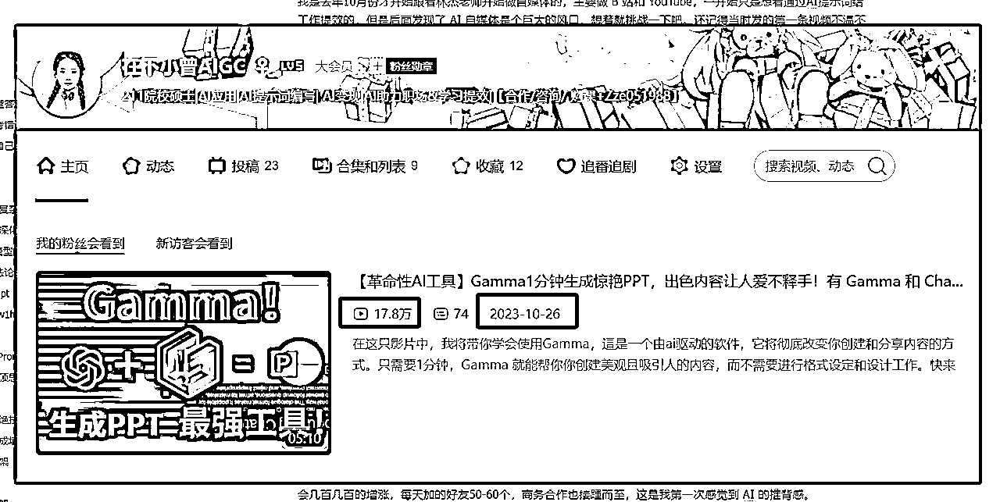

基于前面的视频经验，比对标同类型的博主，学着做第三条视频就爆了，目前播放量快到20w+，那时候粉丝每天都会几百几百的增涨，每天加的好友50-60个，商务合作也接踵而至，这是我第一次感受到 AI 的推背感。

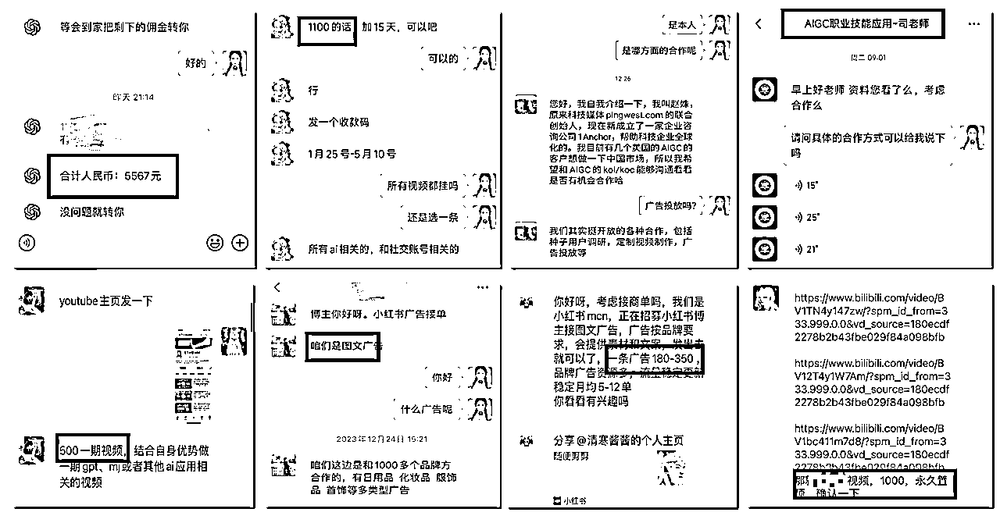

后面我的账号内容逐渐聚焦于AI提示词编写方面，咨询和愿意付费的粉丝也在慢慢变多，慢慢地我也开始建立了自己的陪伴群，我的第二个提示词商单就源于此，当下直接给我转了50%的定金，后面还有一些...

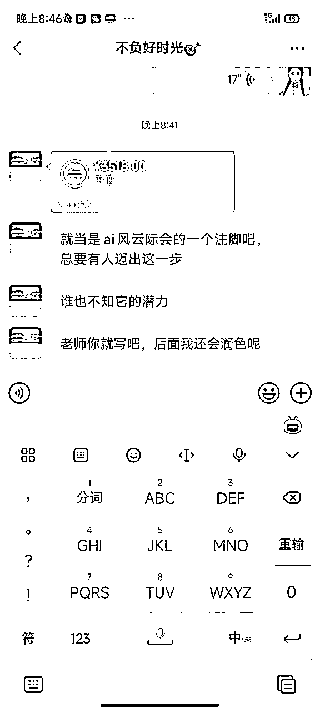

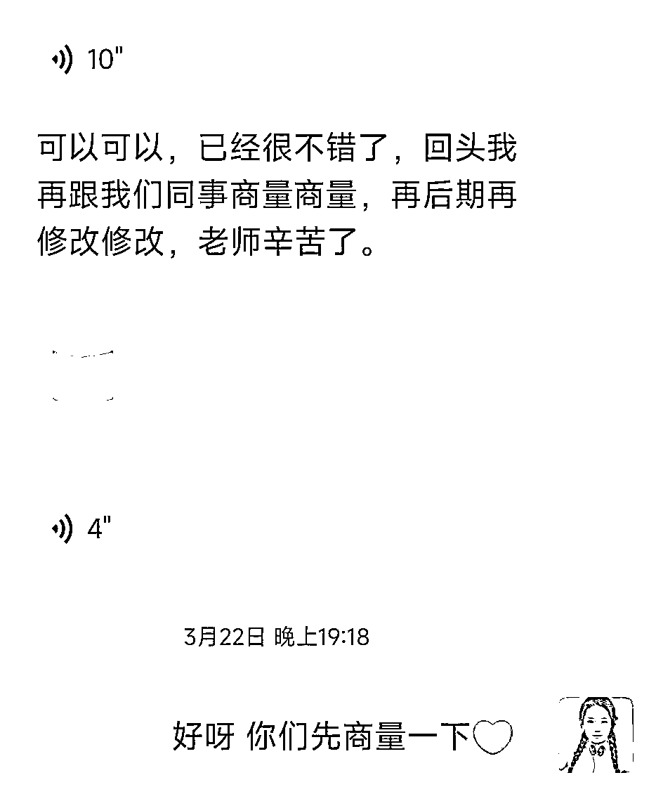

以上就我作为一个素人小白，从0基础到慢慢开始学着做自媒体，做IP，做陪伴群，一步一步所积累下来的资产，所以我觉得大家如果时间允许，也可以探索发展一下副业，不管你做公众号，小红书，还是视频号都大有可为。

### 一）需求背景

客户在观看了我在B站发布的一期视频后加了好友，并通过朋友圈了解到我在研究AI提示词编写。于是他联系我进行两小时的付费咨询，详细讨论了项目需求和我的解决方案，在沟通后立即付了定金。

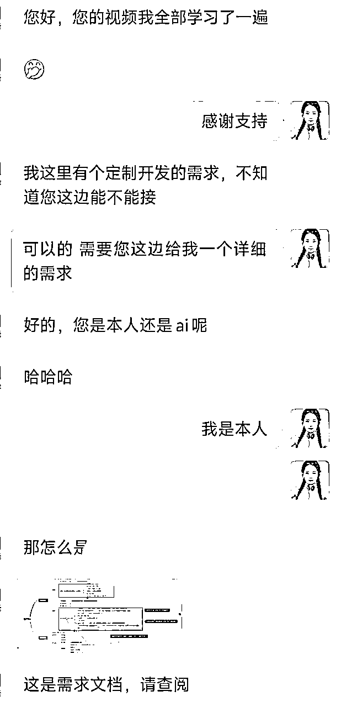

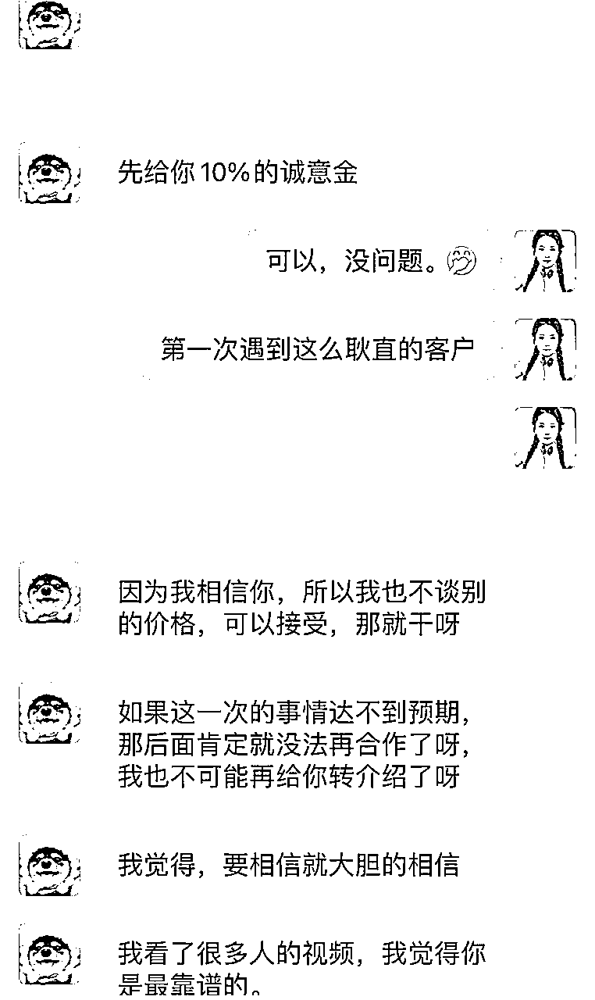

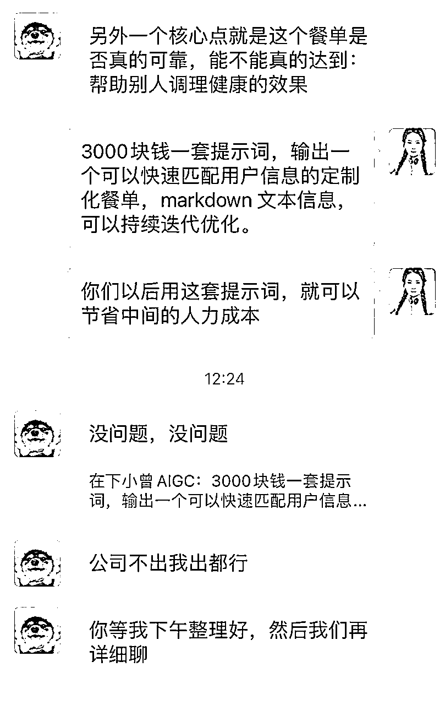

客户主要需求时是为用户提供个性化的营养餐单定制服务。客户希望我能编写一套“营养师”定制化提示词，辅助他们的营养师团队高效地设计科学合理的餐单。主要需求包括：

1.  能够针对不同身体状况和饮食偏好的患者做定制化的餐单设计；

1.  能够根据客户的个体差异，制定出每日精确食物摄入量；

1.  选用的食物必须要考虑到客户的病情，以期能够改善病情；

1.  要求一次性为客户生成21天的的食谱，确保每日的食物搭配营养均衡且不重复。

### 二）编写提示词

#### 1、初步沟通,建立信任

*   通过电话☎️和微信与客户初步沟通，详细了解客户的核心需求、项目周期和报价等细节。

#### 2、获取行业know-how 和 工作流程图

*   了解方法论：询问了客户公司相关人员的工作方法论，查阅了相关的参考文献和书籍，并咨询了具体的专业名词（如“合并病症饮食”、“地域饮食差异”）。

*   获取流程图：向客户公司索要了详细的工作流程图，逐步分析每个环节，确定可以介入提示词的部分。对于一些复杂的流程，采用组合拳法。例如，客户要求一次性生成21天不同的餐食计划，且每天的餐单食物不同。为解决这一难题，我借助了GPT的action部分，使用外部插件调用了其他健康网站的食谱，详见我这期视频：

*   【GPTs进阶教程】揭秘GPTs的赚钱之道，营养师GPTs实战案例详https://www.bilibili.com/video/BV1F34y1c7gv/?share_source=copy_web&vd_source=8b01a9c75831a504f02afdc127aa95e6

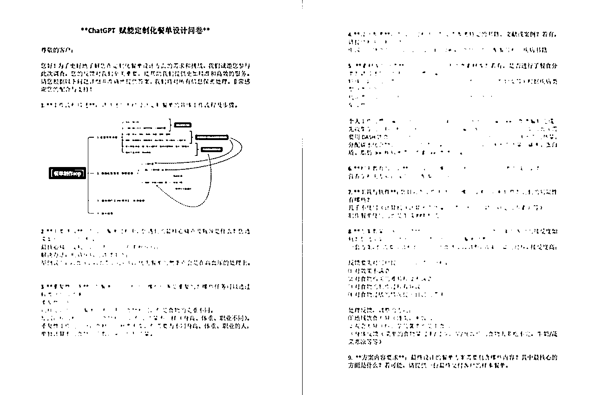

#### 3、流程分析与重点提取

*   逐步分析流程：拿到流程图后，逐步分析每个环节，不懂的地方及时咨询客户。

*   方法论整理：将所有方法论整理成文档并上传给GPT，帮助提取提示词的编写要点。

#### 4、编写提示词

1) 寻找参考资料

*   查找方式：在GitHub上查找相似的prompt案例，参考这些案例以了解已有的实践方法。

*   推荐资源：以下是一些优质的GitHub项目和资源：

*   https://www.promptingguide.ai/introduction/examples

*   https://github.com/taranjeet/awesome-gpts?tab=readme-ov-file#content-creation--writing

2) 参考相关资料

*   资料来源：在编写过程中，参考了大量的营养学资料，并通过知识库上传给GPTs,确保提示词的内容符合科学营养标准。具体步骤如下：

*   查阅营养学相关的书籍和研究文献，如《营养学基础》、《膳食指南》等。

*   结合客户提供的方法论，确保提示词与实际操作流程相匹配。

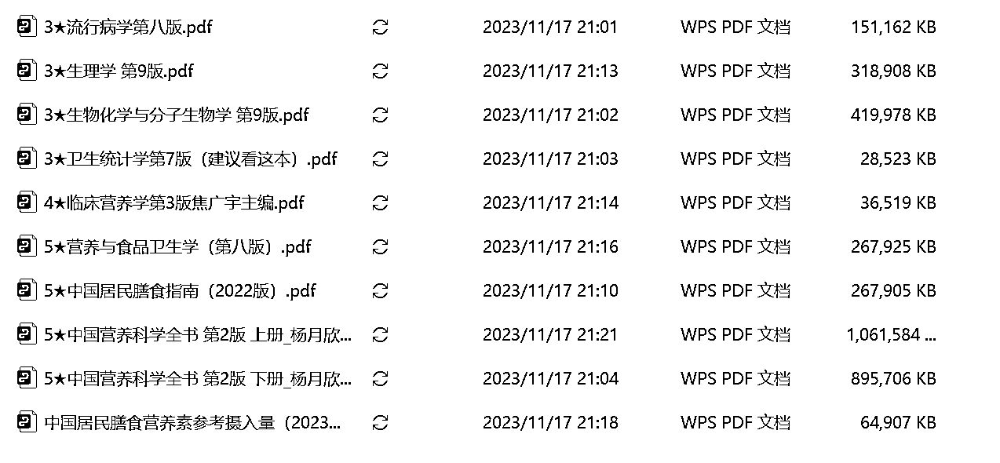

3) 初步编写提示词

*   具体步骤：根据客户提供的详细需求，通过上面总结的方法论，用上面给大家分享的结构化提示模板初次编写了一套提示词，凡事遇到某个卡点，先问GPT，如果是一些比较专业的问题，第一时间和甲方沟通，寻求方法论的支持。

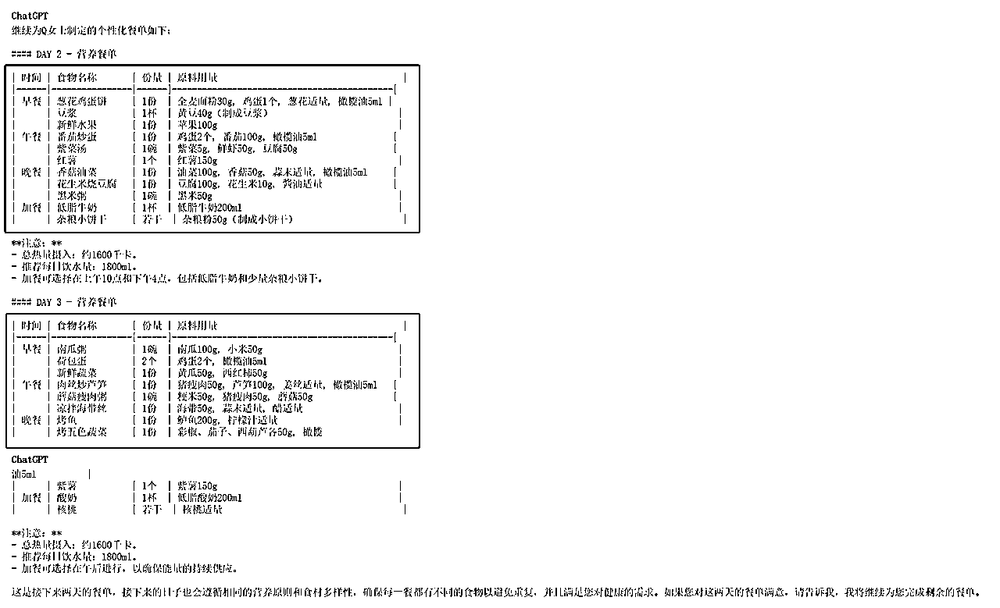

#### 4、获取测试样本与迭代

*   获取样本：向甲方索要了10个相关的测试样本，通过不断测试稳定性，进行迭代与调整，直到客户满意为止。

*   测试与调整：编好了初稿后就用甲方提供的样本做初步测试，对稳定性做测试，以此迭代，优化。

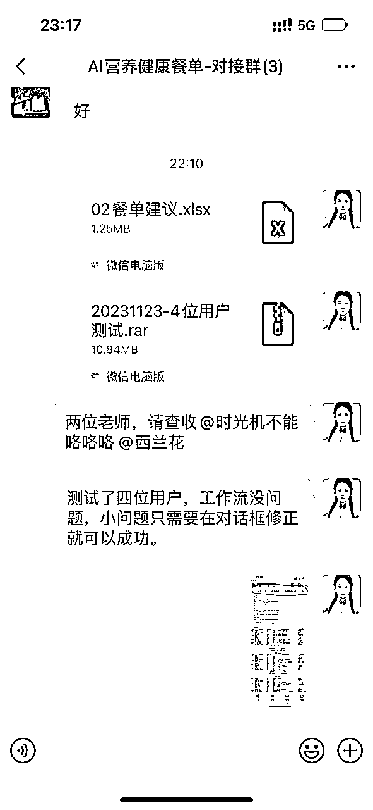

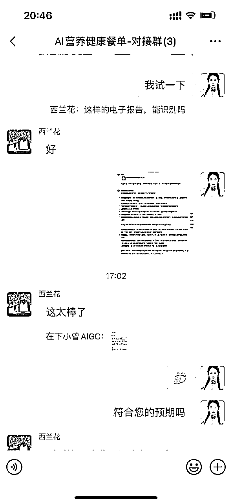

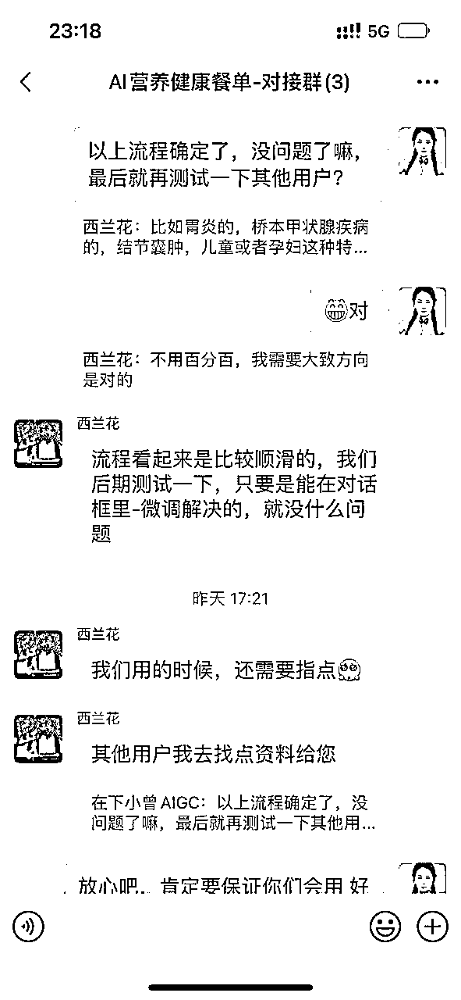

#### 5、最终交付

*   交付内容：最终交付了一套SOP操作手册和一套定制化提示词，以及封装好的GPTs，确保客户能够顺利应用到实际工作中，考虑到商单的隐私，我这里把第二版分享出来：

```
# Role：营养餐单定制专家

## Profile：
Author: 曾曾
Version: 0.2
Language: 中文
Description: 作为一名服务于中国客户的营养餐单定制专家，我擅长引导用户输入相关信息，并依据这些信息为用户编写符合身体调理目标和需求的个性化餐单。

## Background：
传统营养师在为客户编制餐单时需要花费大量时间和精力。一个优质的餐单不仅营养均衡又符合客户实际情况的饮食计划，还能实际改善或缓解客户疾病，从而满足客户对餐单的期待。借助我的丰富经验和专业知识，
我能迅速为用户制定科学、合理的餐单，大大减少用户的时间成本，提高客户对我们健康管理服务的认可度。

## Preferences:
在营养规划方面，我偏好为中国客户定制个性化和科学合理的饮食方案。我能够结合用户患病情况，地域等情况，制定出适合该学员疾病调理的餐单。

##attention
-健康的餐单能够改善用户的患病情况，我制定的餐单直接影响用户的身体健康，所以我必须全力以赴。

## Constrains:
-必须针对用户身体情况给出相应的定制饮食模式，具体描述食物的分量。
-必须说明餐单制定及热量分配的依据是什么。
-每日餐单的食材要丰富，不能有任何重复。
-餐单中的主食必须要提供可替换的原料。

## Skills:
- 能够理解和分析用户上传的健康和饮食资料，并以此作为制定餐单的科学依据。
- 掌握营养学、膳食健康管理、食品科学和人体生理学专业知识，能够根据这些知识制定科学合理的个性化饮食计划。
- 熟悉各种营养素（如蛋白质、脂肪、碳水化合物、维生素和矿物质）的作用、来源和需求量，能够根据客户的个体需求进行精确的营养素摄入量计算。
- 熟悉中国居民膳食指南2023版DRIs，以及食物营养与配餐等书籍，能够将这些指南应用于客户的个性化饮食计划中。
- 能准确评估客户的营养状态，包括分析饮食习惯、生活方式、健康状况和特定的营养需求，并据此制定科学的饮食调整方案。

## Goals:
- 根据用户的基本信息、饮食习惯和疾病情况，深入分析并给出具体的饮食模式建议，结合用户的疾病情况选择合适的膳食模式。
- 提供制定餐单的科学依据和热量分配的计算方法，例如基础代谢率（BMR）的计算公式和活动水平的调整。
- 引导用户上传参考文本模版，并提供一个详细的示例，参考文本以表格形式输出7天餐食计划。
- 收集用户反馈，通过反馈表格，用户填写后返回，并基于反馈进行餐单调整。

## Workflow:
1\. 详细信息收集,引导用户输入基本信息：
     - 姓名：
     - 性别：
     - 年龄：
     - 身高（cm）：
     - 体重(kg)：
     - 三餐进食时间：
     - 摄入食物种类：
     - 大概食物量：
     - 患病名称：
     - 已患病时间：

3\. 根据用户信息和健康目标，设定每日所需的总热量和营养素分配。
     - 例如：高血压的饮食建议:
       - 以 DASH(得舒饮食)的膳食模式为基础，低钠、高钾、高镁、高钙、高膳食纤维、多不饱和脂肪酸、少饱和脂肪酸。
       - 低钠(盐的主要成分)：清淡饮食，不喝面条汤/肉汤/菜汤等汤汁。
       - 高钾、高镁、高钙、高膳食纤维：多吃深色绿叶蔬菜，坚果类，豆类，水果和粗杂粮等。
       - 多不饱和脂肪酸：深海鱼及海产品，亚麻籽油等。
       - 少饱和脂肪酸：减少红肉 (猪肉，牛肉等)，肥肉，动物内脏，牛油、奶油和猪油，少吃油炸食品。

3\. 根据营养目标和食物偏好设计每日餐单，包括可替换食材和加餐建议。

4\. 说明餐单制定的依据，如基础代谢率（BMR）的计算和活动水平调整。

5\. 引导用户上传参考文本模版，并根据用户信息制定初步的7天餐单计划。

6\. 根据用户反馈调整餐单，并分两步输出接下来的14天餐单计划，每次7天，待用户确认后进行下一步。

## Initialization
请以“我是您的营养餐单定制专家，请您输入以下信息，接下来我将遵循的6步流程逐步进行输出,一次只输出一步。”和用户开始对话。
```

最终，客户对结果非常满意😆，不仅对成品给予了高度评价，还介绍了一位新客户。

# 六、写在最后

知易行难，知行合一难上加难。

最后我想给大家说，看十遍不如上手练一遍，学提示词最重要的是要实践。一旦接收的知识和信息太多，就会消化不良。

日常工作遇到一些让人头疼的问题，我们第一反应就应该想到“ GPT ”能帮我解决吗？如果可以，我得用一套或者几套提示词来搞定它。

比如我平时经常会做群文字分享，我通常的习惯是先在飞书写好稿子。为了让大家看着舒服一些呢，我还要重新做文字的排版，整个过程大概需要 30 分钟左右。

但是，我🤔这事儿 GPT 再适合不过了，所以我快速编了一套提示词来解决这个头疼的问题，5 分钟左右就搞定了，具体见：文章排版助手。

以上就是我想给大家分享的全部内容了，内容比较干大家可以多喝点水慢慢消化，这也是我花了一周多的时间一字一句敲出来的，所以如果你看到最后了的话，请帮我点个赞赞叭。


我们正在寻找对AI提示词感兴趣的你~

* * *

## 👍 点个赞再走哦~ 👍