# 小红书月 30wGMV 复盘心得&实战干货分享

> 来源：[https://lnbxqg5dh9.feishu.cn/docx/Sg6MdGUq4oN8K4xV3uhcMtZUnqc](https://lnbxqg5dh9.feishu.cn/docx/Sg6MdGUq4oN8K4xV3uhcMtZUnqc)

哈喽生财圈友们大家好，我是小辉，98 年杭漂，加入生财两年了，一直在默默潜水，看各位大佬的文章学习，最近在实操过程中有了一些心得分享给大家。

我是去年 10 月份从公司出来，开始了自由职业之旅，当时在生财了解到小红书带货很火，自己也有些短视频带货经验，就决定做小红书带货项目了，认真看好几遍小红书航海手册，系统的了解了小红书带货的玩法，向航海教练请教学习，运气比较好，双十一期间累计做了 17wGMV

今年断断续续的做小红书带货项目，近一个月做了 30wGMV，目前还是混剪去重和少部分实拍的玩法。分享下自己的实操方法和心得感悟。（当然做项目过程中并不是那么顺利，遇到了各种各样的问题）

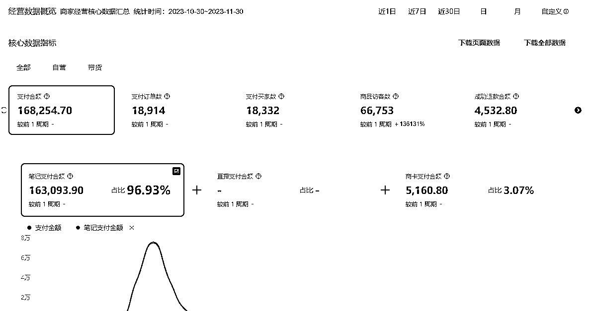

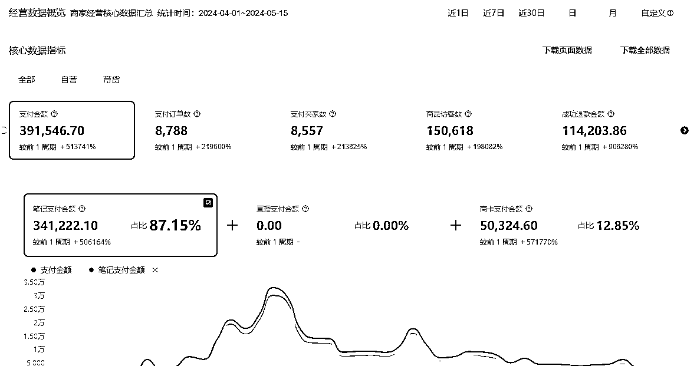

## 目录总览：

项目背景

实操方法

1.  我的5个选品原则

1.  3个选品方法

1.  打造爆款笔记的5个维度

*   封面和标题

*   要正确测品

*   做好内容优化及其他细节优化

心得感悟

# 一、项目背景

2023年3月份，小红书推出【笔记带货】功能，在生财看到很多人陆陆续续在小红书项目上拿到结果，自己也开始关注这个项目了。

从23年10月份到现在实操下来，感觉小红书电商还是处于发展初期，期间看到大部分账号出单形式，主要通过笔记出单。很多0粉号、混剪号单篇或几篇笔记爆了，就卖了几千或几万单，而且投入成本也比较低，主要是时间成本。所以我也就选择了笔记带货的形式，也比较适合新手。

所以总结下来小红书带货就必须要搞定：选品和笔记

# 二、实操方法

小红书平台的用户画像，18-34岁女性用户为主，这部分人群年轻、活力、有活力，对新鲜事物充满好奇，热衷于分享和交流。而 31-40 岁的用户群体也在逐年增加，他们更加注重品质生活，乐于分享自己的购物经验和生活点滴。

基于对平台用户的理解和过往的实践经验和我拿到的结果，我总结了几条选品原则

## 2.1 选品的主要原则

需求-用户量-颜值-性价比-新奇特

1.  需求是不是足够强，是不是足够痛，容易转化

1.  用户量大不大，判断它有没有爆大量的潜力。当然这种品竞争也会相对激烈，要综合分析能不能超过同行

1.  颜值高不高

1.  性价比高不高。用户会不会有种占便宜的，同时自己也要计算下这个品利润够不够

1.  新奇特

这两个运动器械品，就满足了需求足够痛、用户量极大、颜值高、而且产品周期还比较长

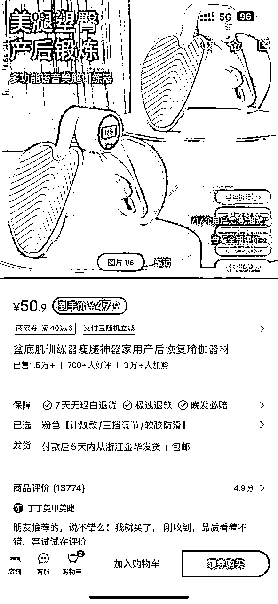

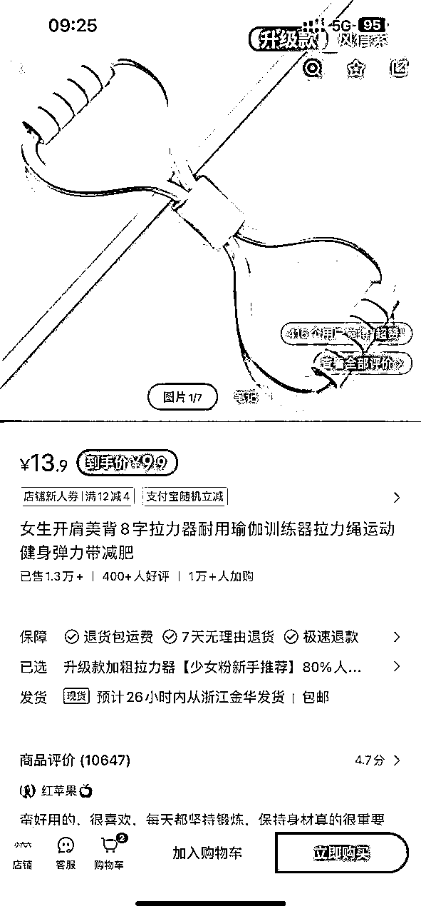

这个陶瓷碗符合高颜值原则，看起来就很精致，符合小红书精致生活的调性。而多功能水果刀符合新奇特的选品原则。

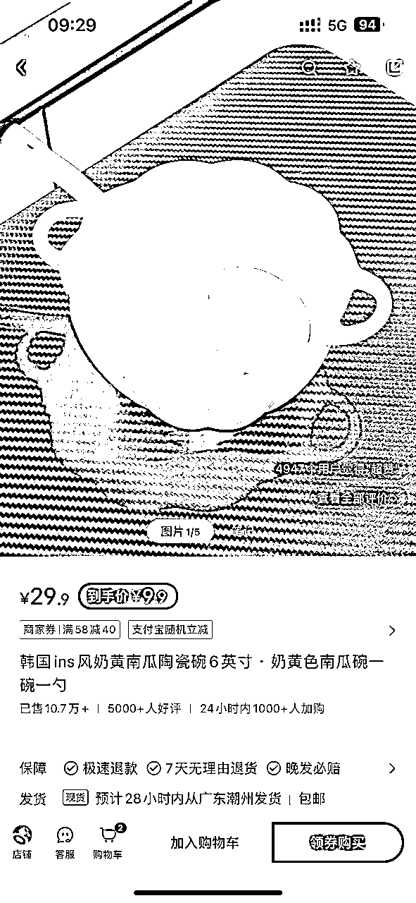

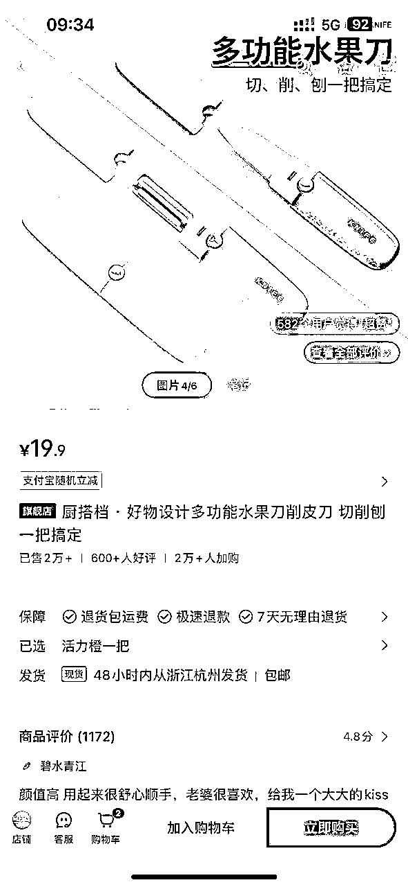

如果一个品满足好几条选品原则的特征，那就要重点关注了，很有可能成为爆品

## 2.2 选品方法：根据数据选品，找近期爆款

### 方法一：考古加平台选品

找视频-电商标签不限-找近 7 天/近 30 天的电商视频。按销量排序看一遍，在按销售额看一遍，对最近比较热卖的品有个认识；然后再看点低份爆款，看看有哪些品卖的比较好，如果找到近期低粉起量的品可以筛选出来重点关注下。

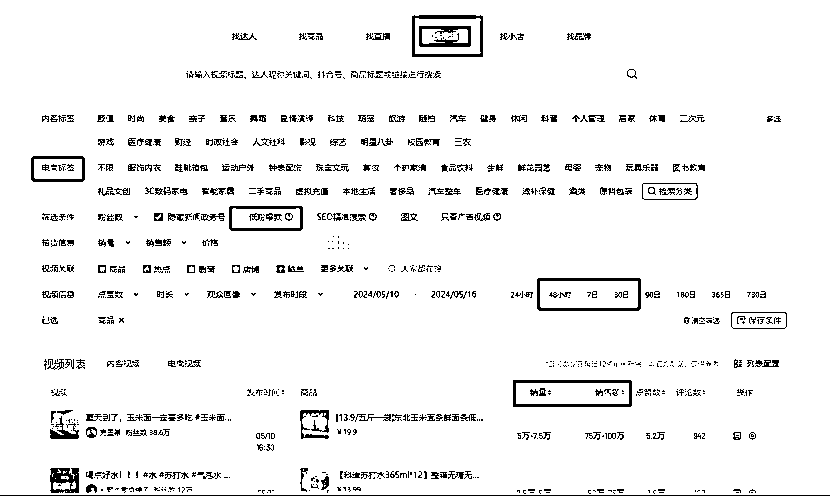

筛选出来一个品后，

1.  要判断这个品的用户画像是否和小红书大体人群画像相符

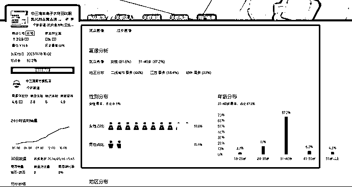

1.  看下近期销量趋势（上升还是下降）

1.  视频素材量多不多（目前主要是混剪去重玩法，素材多的话会好剪很多）

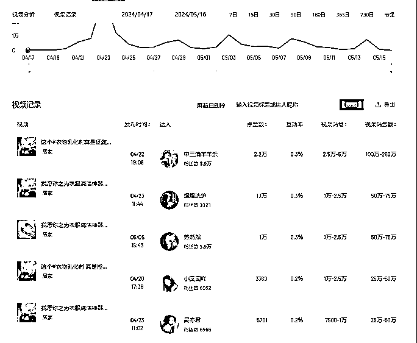

1.  判断下这个品的利润率够不够，建议利润率在 30%以上。（我目前主要从 1688 拿货，看成本要多少）

### 方法二：灰豚数据选品

商品分析——商品搜索——选择做的品类——近 7 天/近 15 天/近 30 天都可以选着看看——看销量/销售额

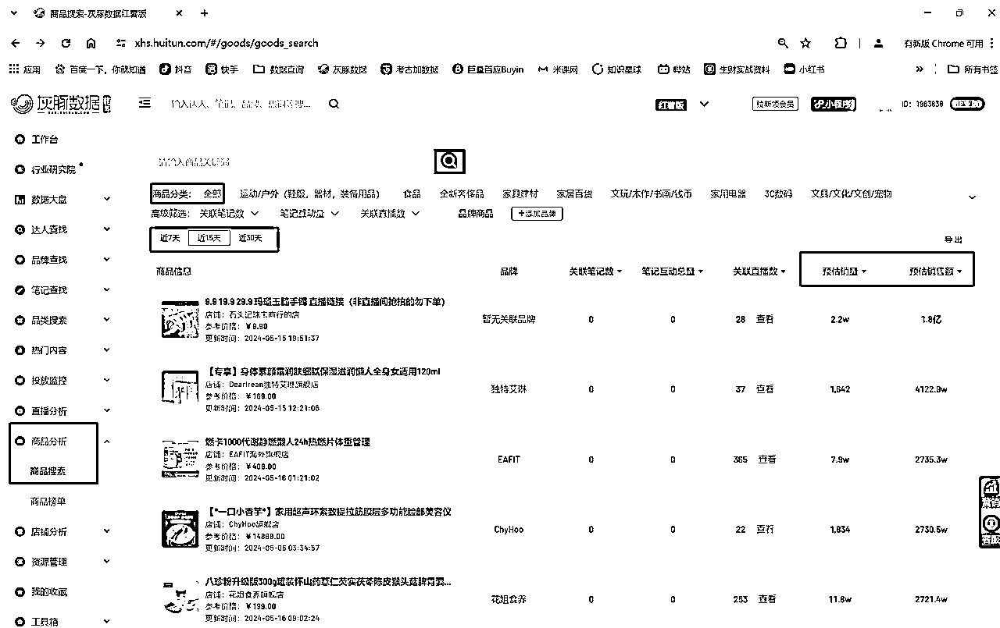

找主要通过笔记带货的品——找到它的账号看是不是符合近期低粉爆款，同时抖音上有没有素材，符合就可以跟进

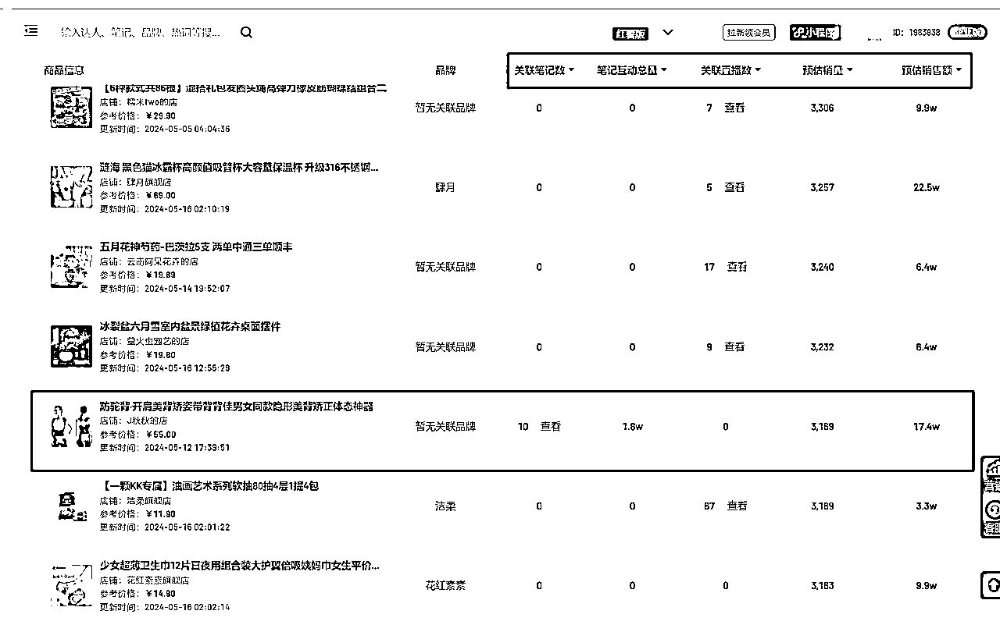

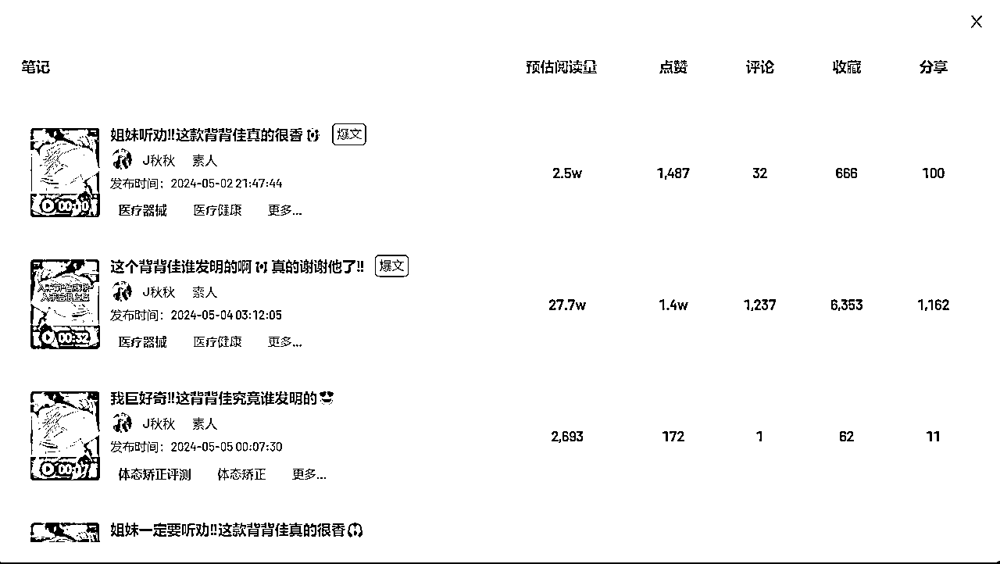

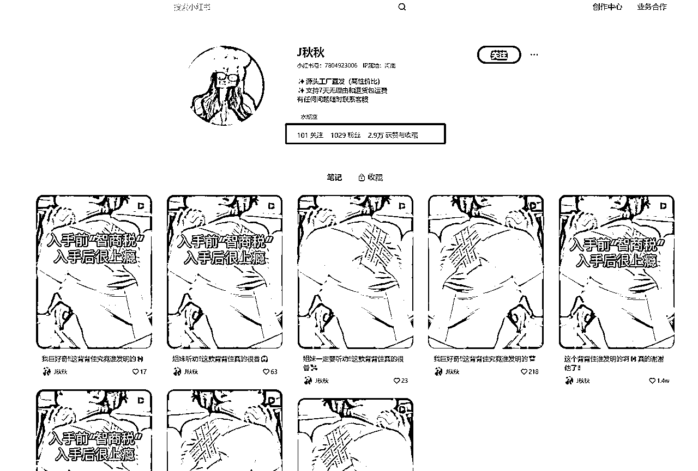

### 方法三：巨量百应选品

创作——创意获取——爆款视频——找自己在做的类目——作者等级越低越好（作者等级低，粉丝量少）——近 24 小时/近 1 小时

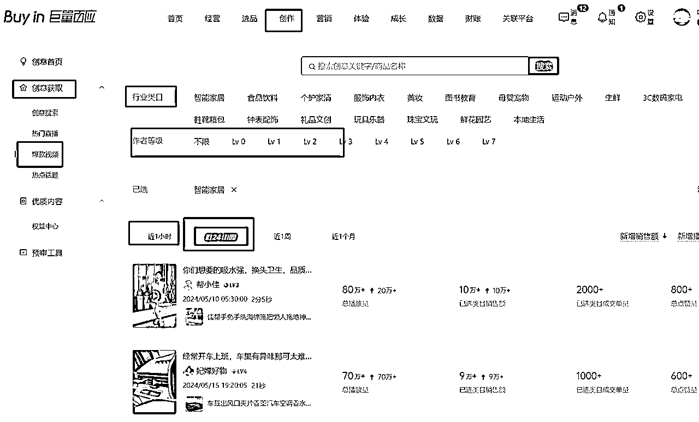

这是我比较常用的选品方法，其实很多大佬之前也分享过，这些方法主要是要勤快，每天或者每 3 天去看下，养成习惯，如果发现有新品出来，符合上边选品逻辑的话，及时跟进，很有可能起量。

勤看数据平台会对大盘品有个了解，更容易做第一批吃螃蟹的人；另外经常看品 也会慢慢对品有更深的理解（了解品的周期，什么时候该布局了）资深电商人理解应该更深刻。

## 2.3 打品策略

思考平台要什么、用户要什么，你就能得到你想要的

*   站在平台角度：平台在发展电商的早期，需要业绩数据、另外平台也缺少相关带货内容，所以平台会对带货笔记的容忍度高一些。

*   用户角度：你的产品或服务能为用户提供什么价值，情绪价值也是价值甚至有时候会更重要。你能解决用户什么痛点。

*   自己的收获可能有物质方面的，也可能有精神层面的，也可能两者都有。

打品策略大致步骤：

1.  了解平台规则

1.  尽量把内容做好

1.  量做到位

1.  细节优化

### 2.3.1 内容方面

因为小红书首屏有很多展示位，各个展示位在相互竞争，所以小红书的封面、标题和笔记内容同样重要

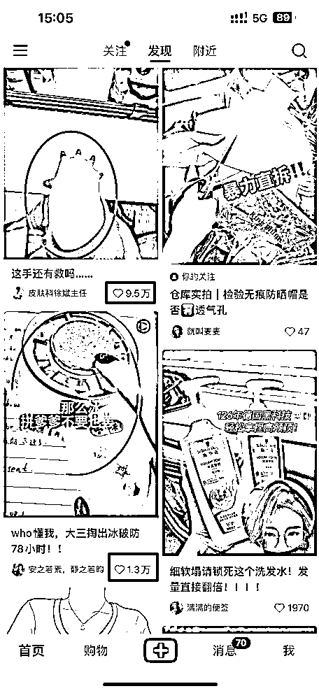

总结：1、封面和标题决定了笔记的生死 2、通过模仿搞定高流量的封面

所以要：重点测试 封面、标题和笔记（因为我主要是视频为主，主要测试脚本内容）

找到最近的爆款封面、标题、脚本进行测试；封面和标题稍微修改下，视频按照脚本进行混剪处理。

方法：小红书搜产品关键词-最热（如果有近期最热最好）有很多爆款封面、标题、笔记可以借鉴学习。

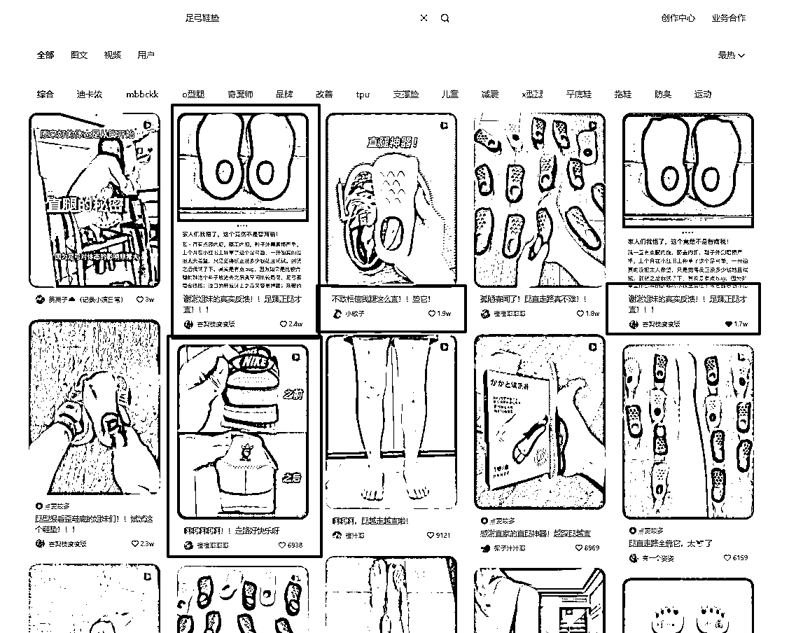

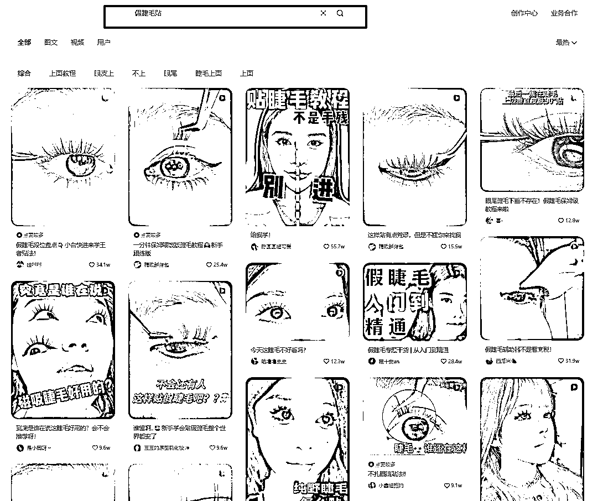

### 2.3.2 平台规则角度

*   基于小红书平台的推送逻辑：尽可能的去诱导观众关注、评论、转发；

*   基于小红书的搜索逻辑，做好关键词布局：在封面、标题、笔记内容、评论区做好产品词、产品功效词、用户群体、用户流行语等关键词布局，增加搜索权重。

### 2.3.3 测品步骤

我目前是单号单品测试（观察大部分同行也是这样测试），把封面-标题-笔记内容进行分组测试，每个号每天测试 3-5 条笔记（时间间隔1小时以上），测试 3-5 天，看下出单、加购数据情况在决定是否继续做这个品。

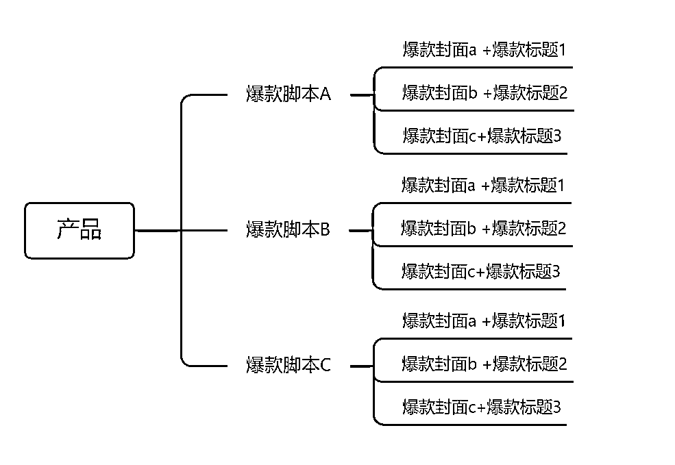

备注：上述是比较理想状态下的测品思路。有时候爆款笔记的封面或标题可能一般，这个时候就可以去掉。

### 2.3.4 优化动作

1.  评论区优化

1）人工互动数据：真人完整观看+点赞、收藏、评论【前提条件】

笔记满足任意一个：

√自然出单了

√超过 500 小眼睛

2）人工互动数据：真人完整观看+点赞、收藏、评论【具体操作】

小眼睛 500 了，就做 2 套

小眼睛 1000 了，就做 3 套

小眼睛 2000 了，就做 5 套

...

小眼睛 10000，做 15 套

一次性不要做超过 10 个，可以慢慢上。前期可以找亲戚朋友做一下评论，后期可以找大学生兼职来做评论

1.  评论区维护

1）诱导用户评论区打惊喜盒子

有助于增加视频权重（惊喜盒子是平台给用户的优惠活动）

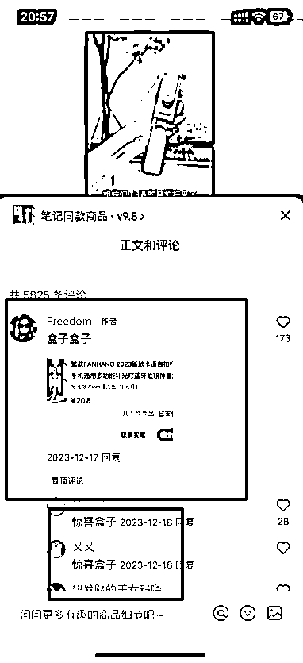

2）引导下单类（下圈套的）

例子： 我买了 过几天反馈 大家蹲我； 另外一个号去蹲；过几天去回评

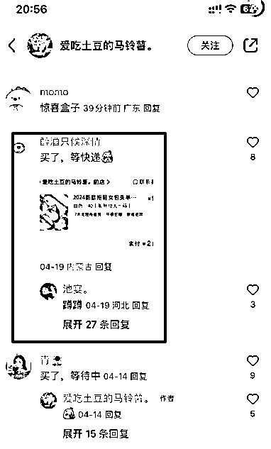

3）反馈类

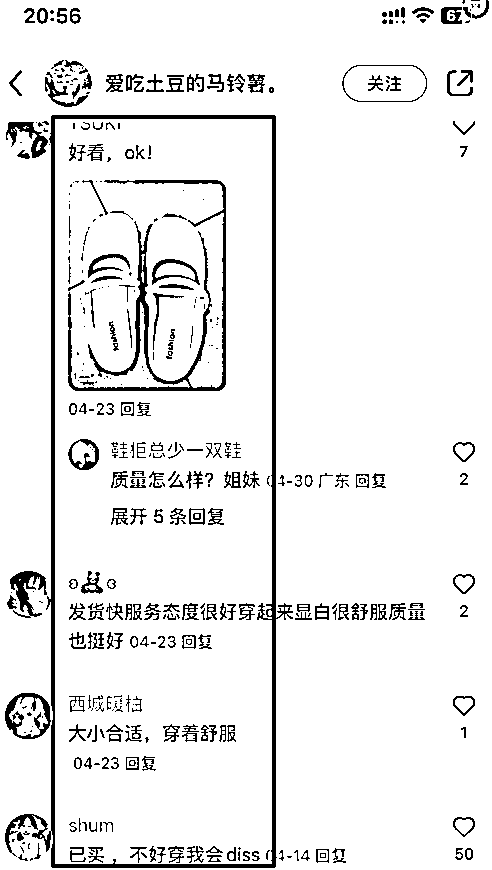

1.  店铺端

做基础销量（比如用小号做个十单八单的）；找朋友做几个晒单好评

1.  数据复盘

*   商品数据分析：通过看商品访客数、加购件数、订单数来判断这个品要不要继续做；最近的笔记内容好不好

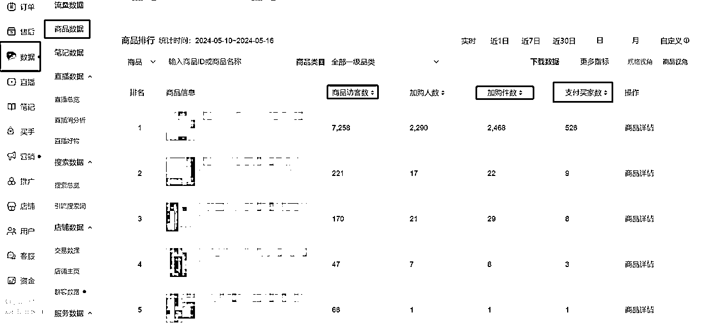

*   笔记数据分析：看哪条笔记数据好，按照那条笔记的思路继续创作

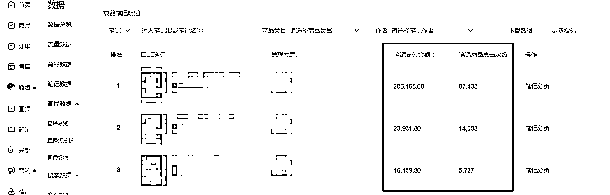

总结：

*   评论区优化的目的主要有两点：1.评论条数多，笔记权重会增加，平台有可能会推更多流量；2.用户角度，基于羊群效应和从众心理，有助于转化率提升。

*   店铺端做基础销量和好评也是为了提高转化率

*   数据复盘可以分析出是品的问题、还是封面、标题或笔记内容的问题。数据好的继续复制，数据不好的及时改正。

### 2.3.5 筛选供应商

我主要是从 1688 下单，目前还没遇到无货源相关违规提醒，也有同行从拼多多下单的

1.  觉得拼多多下单有短信和拼多多面单问题

1.  拼多多下单要去掉面单的话需要中转仓会增加一两天运输时间，用户体验不好，就没有考虑

筛选 1688 供应商的方法

1）判断拿货成本和利润率够不够

2）商品销量、供应商综合服务、响应速度、物流时效、退换货体验、回头率等，有牛标和超级工厂的优先

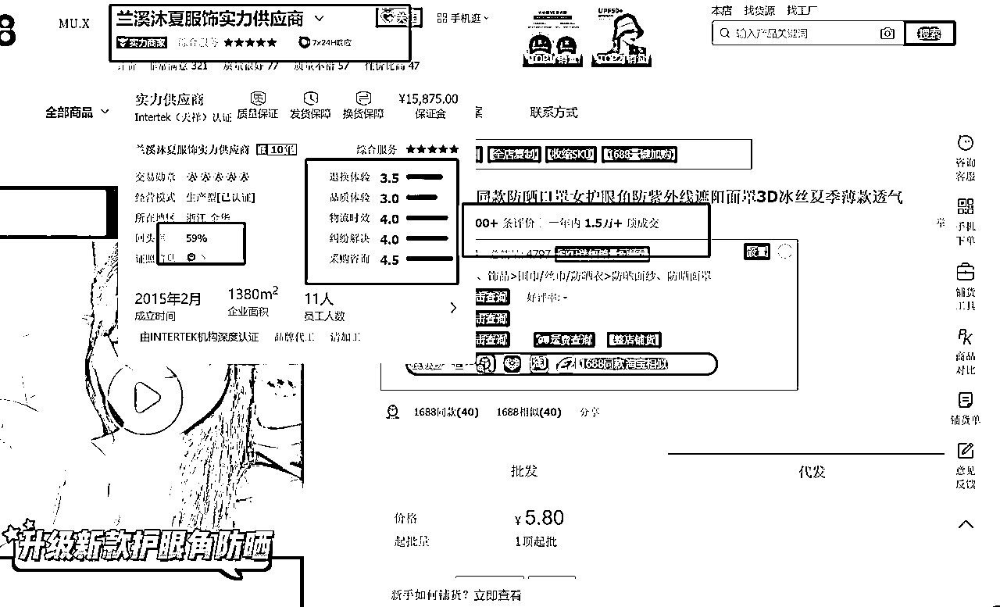

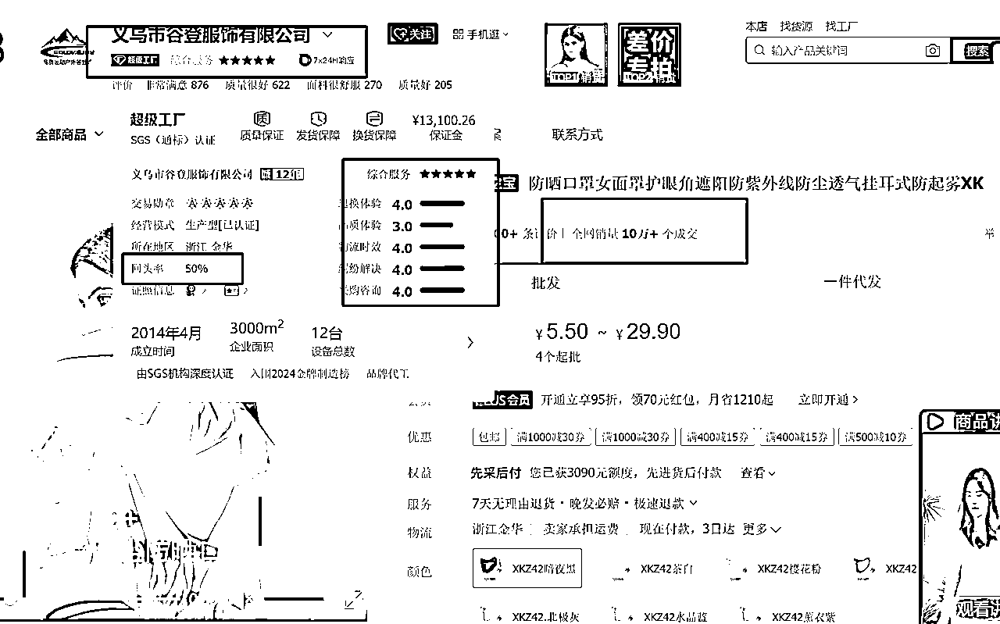

3）询问商家有没有小红书面单

*   部分商家有小红书面单可以直接绑定店管家，商家直接发货；

*   如果没有小红书面单，问他能不能无痕发货，大部分商家都可以无痕发货的；

*   最好加上供应商微信，方便及时联系

# 三、心得感悟

### 项目复盘

#### 路径总结

正确信息——找对方法——快速学习——认真执行，大量实践——复盘反思——改进——循环

23 年 9 月份在生财了解到小红书带货项目处于红利期，再结合自己的工作经历（2 年短视频工作经历），大概率觉得这件事可以做，就学习航海手册、参加航海训练营，找到有结果的前辈请教学习。本以为会很快出单，结果还是眼高手低了，测品不到位，测了五六个品，还是出单效果不好，心态有点受影响。

于是开始空杯心态，反思，重新学习航海手册，认真执行，偶然间刷到一个新起量的品，看到一个同行第一天 200 单，第二天就 1000 单了，第三天又涨到了 2000 多单，我也按照它的脚本形式去跟进，有出单但没有起大量，（我就想既然这个品有需求，且在起量，我就换不同的形式去测）在抖音找了三四个数据还不错的脚本，测了十几条的时候，有一个视频起量了，正好又遇到了周末，流量也很好，销量从 200 直接翻倍，当时也体验了一把日入两三万。后来数据起的太快，没几天就被同行举报了，又遇上平台严查，导致账号被封。

和同行交流，有的同行停更了 暂避锋芒，索性自己也休息两天，后面看无人直播出单不错，去尝试无人直播了，果不其然，白折腾了一段时间。（反思：找到适合自己的道路后，坚持走下去，但信息爆炸的现在能做到也确实挺难的）

后来又决定做回小红书笔记带货，再次向近期有结果的前辈请教学习，了解当下的大致玩法，重振旗鼓，这一次怀着空杯心态，认真执行，终于迎来了第二次大爆。这一次心态平稳了许多，这次总结下来就是把能想到的每个细节都努力做好，剩下的交给天意，一般情况下都会拿到结果。

### 总结复盘

*   小红书带货项目最核心的是选品——封面——标题——内容——执行力

*   只有颗粒度精细化到像素级的过程控制，结果才能复制。

*   创业就是不断认识自己的过程：在写这篇文章时看到了那个傲慢的自己、那个懒散的自己，也看到了努力学习、拼搏的自己和正在反思进步的自己。

*   知识付费就是花钱买信息、买别人的经验方法，其实也是在走捷径，但是也要有自己的判断力、学会甄别。当然弊端容易思维懒惰，产生路径依赖，还是慢慢锻炼自己独立思考的能力、分析调研的能力。

*   创业过程中要保持专注、减少能量损耗。生活中干扰项太多，要努力从源头杜绝干扰，保持好创业的状态。

*   懂得感恩，定期反馈

*   站在用户角度，切身的为顾客着想。为客户提供价值时，自己也会有一种精神层面的收获。

*   认真做好当下 不急 遵循客观规律

### 接下来要做的事

*   基本功练习：做选品表、对标账号表、拆解爆款视频

*   每次都从 0-1 太累了，从运气爆单，到摸索出规律、方法论，增加爆单概率；开始着手一些长期有复利的事

*   从个人创业慢慢拓展成团队创业，加人力杠杆。

## 愿景

向胖东来学习，希望团队的样子能够像胖东来那样，团队一起努力拼搏，为客户着想，为员工着想，舍得分钱，这样做的心安且长久。（有点理想主义了，但朝这个方向努力吧）

## 致谢

感谢生财团队提供的搞钱平台，让我有机会了解更多一线的搞钱信息、学习到很多干货帖子、结识很多优秀的大佬，自己在认知、能力、心态上都有了很大提升。

感谢@晓文哥和@超鹏哥带我入门短视频带货项目，感谢@书豪哥带我入门小红书。

感谢@V小刀 刀姐在我做号过程中耐心辅导。

感谢@梵姐和@叨姐在我创业过程中答疑解惑。