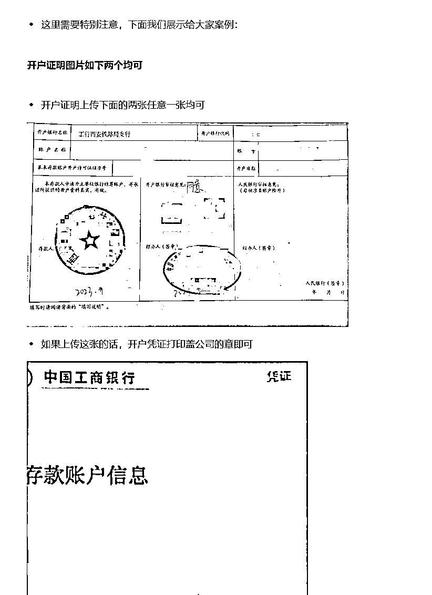

# ♟公众号流量主委托个体户公户收款（保姆级）流程分享，可能帮你多赚几万的收益

> 来源：[https://uxem6iksdzz.feishu.cn/docx/K1dzdPM8ao5vZwxpFr0czc49nFc](https://uxem6iksdzz.feishu.cn/docx/K1dzdPM8ao5vZwxpFr0czc49nFc)

# 什么情况适合公户收款

公户收款主要是为了减少税务支出，由于公众号个人收款扣税相对来说是非常重的，月超过500就开始扣税，月收益在1w扣税大约1900（后面有详细的计算案例），而且是收益越高扣的越多，最高可扣税高达40%。

虽然这部分税，等到每年清算个人所得税的时候，可能会返还部分，但是相比使用公户收款，这笔税仍然是一大笔钱。

但是如果你用公户来收款，只要你的年流水不要超过120万，用核定征收的方式，基本上只用交很少的税就可以了（1%），因为国家对于小规模纳税人有很多税收优惠政策。

个体户可以是小规模纳税人也可以是一般纳税人，如果个体户符合小规模纳税人标准，根据规定：

小规模纳税人发生增值税应税销售行为，合计月销售额未超过10万元（以1个季度为1个纳税期的，季度销售额未超过30万元，下同）的，即一年120万内，免征增值税。

根据《财政部税务总局关于对增值税小规模纳税人免征增值税的公告》规定，该政策适用主体为增值税小规模纳税人。因此，不区分企业或个体工商户。2023年开始增值税小规模纳税人月度10万以下或季度30万以下免征增值税，假使超出也只按1%征收率计税。（注：2023年的小规模免税政策调整为月度未超10万元或季度不超30万，3%征收率减按1%征收率）

2023 年 1 月 1 日至 2027 年 12 月 31 日，对个体工商户年应纳税所得额不超过 200 万元的部分，减半征收个人所得税。个体工商户在享受现行其他个人所得税优惠政策的基础上，可叠加享受本条优惠政策。

使用公户收款的时候，腾讯需要一张增值税专用发票，对于小微企业，一般税点在1%-3%，我开的信息服务费，税点是1%。

要开公户，必须有执照，可以是公司的，也可以是个体户的，另外就是公户每年都有年费，具体每个银行的年费都不一样，我用找的当地银行的，年费是400，问过在地税局的同学，一般四大行的门槛会高一点，管理费也会贵一点，其他的都是一样的。具体可以咨询当地银行。

另外开通公户后，在开发票的时候，需要税务知识，公司的公户话，税务比较复杂，这里一般都是代理记账来搞定的。

我用的是个体户公户收款，就简单一些，自己摸索了一下也搞定开票了，后续也是可以在电子税务局上办理纳税申报，所以这部分的钱也省下了。

粗略估计了一下开支，个体户执照自己注册的，没花钱，可以用自己家的居住地址来办理，我就是用的这种，嫌麻烦可以网上找个当地的代办，大概200-300左右，主要是后面办理公户银行要上门拍照核实，开公户需要刻章，公章，法人章，发票章，一个章80,240块，银行公户的管理费大概是400，电子Ukey16元，每月短信通知2元，大概是1000元以内就能搞定了。

也就是说你的收益起码一年能有个1万以上，开公户收款才有必要去做这个事情。

不过昨天看到曹大的分享，又想到一个点，就是合规性的重要性。

很多时候，你赚到的钱，并不是你的，只是暂时存在你这里，现在金税4期，特别是做业务比较多的，年收入比较高的，一定要合理规划，该用公户收款就用公户收款，做社群的话，也可以用知识星球，找到一些低成本合规的方案。

## 1.先说说流量主结算规则

温馨提示：

*   媒体、政府、企业、其他等非个人类型账号不支持委托个人收款。

*   个体工商户和已注销的企业可委托个人账户收款，个体工商户可由经营者代收，已注销企业可由指定权利义务继受人代收。

*   若不同开户主体的账号委托同一个收款账户，最多支持关联50个账号开户主体。

### 账户变更

若流量主收款账户或邮箱发生变更，可在公众平台自助提交修改申请，提交完成后，后台审核通过即完成修改，结算信息页面也会展示修改完成后的部分信息。

修改流程如下： 登陆微信公众平台，进入流量主模块，在“财务管理”-“收入结算”页面的“结算信息”板块，点击“修改”按钮进入结算信息变更页面。

变更规则

*   个人账户收款：支持只变更银行账号、变更其他个人账户收款、变更其他企业账户收款

*   企业账户收款：支持只变更银行账号、变更其他企业账户收款、变更个人账户收款（仅支持个体工商户和已注销企业-个体工商户可由经营者代收；已注销企业可由指定权利义务继受人代收）

温馨提示：

*   个人主体的账号委托企业账户收款后，不支持改为主体或其他个人账户收款。

*   使用同一结算主体的流量主账号，修改其中一个账号的结算信息后，名下所有账号的结算信息会同步更新，系统会以最新修改完成的信息为准。

*   若委托第三方收款，第三方结算主体已提交过结算信息，新委托的账号需提交与已提交过的结算信息一致的信息。

*   若是委托收款的，当银行账户信息发生变更时，需提交新的委托收款协议。

结算信息要求

使用同一个结算主体的流量主账号，须提交同一个的银行账户（如：账户名、开户行、开户支行、开户省市、银行账号）、营业执照及结算邮箱。

# 怎么扣税：

## 一、个人缴税

1.  个税说明

个人账号无需邮寄发票，个人账户的收入属个人劳动报酬，根据《中华人民共和国税收征收管理法》及其实施细则等税收有关规定，腾讯公司从 2019 年 11 月 1 日起接受税务机关委托，为个人流量主代征增值税和附加税。

1.  增值税及附加税费计算方法

每次劳务收入超过 500 元（包含本数），腾讯代征 3% 的增值税，并按照增值税应纳税额代征附加税费，适用综合税率为 6%（即，按照一般综合税率 12%，实行减半征收）。如因税法或税局征管要求调整，需要更改上述规则的，腾讯公司会另行通知。

*   增值税应纳税额 = 劳务报酬（大于等于500元）/(1+3%) × 3%

*   附加税费应纳税额 = 增值税应纳税额 × 6%

1.  个人所得税计算方法

1）应纳税所得额的计算

劳务报酬所得以个人当月取得的同一项目下的多次收入合并为每次收入所得，定额或定率减除规定费用后的余额为应纳税所得额。

每次收入不超过 4000 元的，定额减除费用 800 元；每次收入在 4000 元以上的，定率减除 20% 的费用。

*   应纳税所得额 = 劳务报酬（少于4000元）- 800 元

*   应纳税所得额 = 劳务报酬（超过4000元）×（1 - 20%）

2）应纳税额的计算

应纳税额 = 应纳所得税额 × 适用税率 - 速算扣除数

劳务报酬所得适用超额累进税率，累进税率分别为 20%、30% 和 40%，即：纳税人每次劳务报酬所得的应纳税所得额不超过 20000 元的部分，适用 20% 的税率；超过 20000 元至 50000 元的部分，适用 30% 的税率；超过 50000 元的部分，适用 40% 的税率。

具体可以参考以下税率表：

案例一：A 流量主当月收入为 400 元，则

该流量主收入少于 500 元，腾讯公司不代征增值税和附加税费。

且该收入扣减 800 后，个税的应纳税所得额为 0，则腾讯公司不代扣代缴个税

案例二：A 流量主当月收入为 800 元，则

增值税应纳税额 = 800 / (1+3%) × 3% = 23.3 元

附加税费应纳税额 = 23.3 × 6% = 1.4 元

流量主在扣除增值税、附加税费以及 800 后，个税的应纳税所得额为 0，则腾讯公司不代扣代缴个税

因此腾讯公司代征增值税 23.3元，代征附加税费 1.4 元，不代扣代缴个税

案例三：B 流量主当月收入为 3090 元，则

增值税应纳税额 = 3090 / (1+3%) × 3% = 90 元

附加税费应纳税额 = 90 × 6% = 5.4 元

个税应纳税所得额=3090 - 90 - 5.4 -800 =2194.6 元

个税应纳税额 = 2194.6 × 20%=438.92 元

因此腾讯公司代征增值税90元，代征附加税费 5.4 元，代扣代缴个税438.92 元

案例四：C 流量主当月收入为 10300 元，则

增值税应纳税额 = 10300 / (1+3%) × 3% = 300 元

附加税费应纳税额 = 300 × 6% = 18元

个税应纳税所得额=（10300-300-18）×（1-20%）= 7985.6元

个税应纳税额 = 7985.6 × 20%=1597.12元

因此腾讯公司代征增值税300元，代征附加税费18元，代扣代缴个税1597.12元

案例五：D 流量主当月收入为 82400 元，则

增值税应纳税额 = 82400 / (1+3%) × 3% = 2400 元

附加税费应纳税额 = 2400 × 6% = 144元

个税应纳税所得额 =（82400-2400-144）×（1-20%）= 63884.8 元

个税应纳税额 = 63884.8 × 40% - 7000 =18553.92 元

因此腾讯公司代征增值税 2400 元，代征附加税费 144 元，代扣代缴个税 18553.92 元

这种情况下，因为腾讯是代扣的，你需自行履行年底个人所得税综合申报义务，以及自行承担个税税款的多退少补。

## 二、企业代收

个体户只要是有对公账号，且后续能开增值税专用发票的话，都可以做代收企业。

根据国家税务政策调整，小规模纳税人增值税纳税义务发生时间在2023年1月1日至2027年12月31日期间的，原适用 3%征收率的应税销售收入，可免征增值税或适用1%征收率。如纳税人选择放弃免税，应适用 3% 征收率。

因此，于2023年1月至2027年12月开具的发票，腾讯接受 1%或3% 税率的增值税专用发票，或免税的增值税普通发票。请流量主收到结算单后及时开票给我司结算。

【温馨提示】

微信广告已支持电子发票上传，无需打印及邮寄，收款更加便捷，详情请见下方内容第2点开票信息。

1.结算单

附件为腾讯微信广告流量主结算单，如有疑问，请关注公众号“微信广告助手（微信id：ad_helper）”，在会话窗口留言，在线客服会及时为你解答（咨询时间：工作日09：00-18：00）。

2.开票信息

①对私：无需开票，等待腾讯公司打款即可

②对公：请按结算单总额开具增值税专用发票，用A4纸打印结算单盖章，连同发票（发票联和抵扣联，加盖发票专用章）邮寄给腾讯公司指定地址，邮寄信息和开票信息请见结算单条码内容页

（这种需要去当地税局代开纸制发票，然后要同步打印结算单，盖企业公章，再邮寄，比较麻烦）

③电子专票

现在微信广告对公合作伙伴可通过电子发票进行系统上传，无需打印结算单和邮寄发票，链接如下：https://mp.weixin.qq.com/s/vPiZtxGVIPkknYzQGiAD1A

4.打款时间

①对私：收到结算单后的15个工作日内，自动将税后金额汇入你的结算银行卡。

②对公：腾讯公司会在收到正确的发票及结算单后的30个工作日内，将广告收入汇入你预留的对公账户；

# 如何才能使用无纸化结算功能？

流量主使用电子专票进行无纸化结算流程及条件如下：

1.  结算主体为对公账户；

1.  在当地税局申请开具电子发票（非纸质发票的电子版）；

1.  开通流量主服务助手；（开通方法见：开通流量主财务助手 ）

4.使用收款企业法人的注册微信号扫码进入微信公众平台即可看到上传入口；

5.电子发票上传步骤：进入电子发票上传页→正确上传电子发票→查询电子发票处理状态→付款审核【无需上传结算单】

6.提现流程：电子发票经审核通过后，请登录微信小程序“流量主服务助手”自助操作提现。

操作申请后，平台将在 10个工作日内完成支付；

# 条件一：结算主体为对公账户

首先你要得是一个对公账户，对公账户可以是企业，也可以是个体户，如果你的收款额不是很大的话，建议用个体户来收，企业收款类型的税务比较麻烦。

## 1.如何注册一个个体户？

1.  最简单的方法是去找一个本地代办的，大概200-300元搞定，为什么是要本地代办？因为开公户，银行的工作人员会上面拍照，核实经营场所，如果你是网上随便办的虚拟地址，开公户这一步可能会卡住。

1.  如果能解决经营地址的问题的话，可以试着自己注册一个个体户，可以问kimi找到网上注册的入口，按照提示注册就行，需要注意的一点就是你营业执照的上面的经营范围的第一个类目是你的主类目，之后工商登记也只显示这一个。

可以参考一下我之前自己注册踩坑的经验：聊聊注册个体户过程中踩过的坑

注册个体户也有一个好处就是可以继续开两个订阅号，注册成公司的话，选择媒体的公司，可以注册最多50个公众号。

## 2.个体户开公户（基本户）

注册好营业执照之后，下一步是开公户了， 一般就是开一个基本户就行了。

个体户基本户开户需提供的资料:

1.营业执照原件

2.法人身份证原件，

3.经办人身份证原件(若有)

4.公章，财务章，法人私章

在注册个体户的时候可以留意一下能不能同步刻章邮寄，不同的地方可能政策都不太一样。

我最初注册个体户只是为了多开两个公众号账号，就没留意刻章的事情，之后还是问kimi找到了线上刻章的入口，然后发现没办法在线申请，就找了一个距离比较近，价格便宜的线下网点去刻章了。

可以参考一下我之前自己刻章的经验：刻公章的经验

有了公众号之后下一步就是找银行的人咨询了，一般来说开个基本户都很好开，四大行的可能审核会严格一点，可以多问几个银行，最好是离家近点的，后续可能还要去银行办业务。

这一步可以参考一下我前两天开公户的经验，以及资费方面相关的：个体工商户办理银行对公账户经验分享

PS：我的经营执照最开始是想做小红书店铺的，所以第一个主经营类目选的是互联网销售，然后把和互联网相关的都选了，这个之后登记核定的时候，系统上只会显示你的主经营范围。贴出来我的，仅供参考

# 条件二：在当地税局申请开具电子发票

办好公户之后，下来还有一步是要去税务登记，这一步我起初是在网上找入口，找到入口但是没办法用企业身份登录，后来问了才知道新注册的个体户没有进行信息确认的话，是没办法直接登录的，然后问了一个在税务局的同学咨询了一下，说是最好去窗口办理，然后我就去窗口办理了。

大概你给他说清楚你的诉求，他会带你去操作，我去了现场，问了工作人员，他说其实也可以自己在线上操作，但是要先用个人身份登录，然后绑定企业，再同步一下信息，再切换成企业登录。（入口是比较难找，找不到的话去窗口问问也很快，基本没啥人）

注意这里不要纠结开双定户（定期定额），因为要开专票，最后我还是改成查账征收了。

5.22重要补充：

之前咱也是摸着石头过河，这两天收到税务的电话，让我报税改报表（之前去税务大厅开户申请的时候，其实工作人员也提醒我了，但是我当时没有完全理解），然后我说了我主要用途是用来开增值税专票的，工作人员告知我其实完全没必要开双定户，而且只要开了专票，双定户一般也会取消，因为系统无法自动申报，你还得改报表。

双定户的话，就是税务局那边给你估一个预计的未到起征点的销售额，你只要设定好了，之后就不用再去改报表了，你可以开那种免税的普票，只要不超限额就行了，比如我的就是给我审核了每月4万（不知道依据是什么，我自己申请的时候报的是1万），这样的话，系统就会自动给你申报，也不用交税的。

当时就是纠结是不是双定户才有那个30万的免税的政策，但是其实只要是个体户都是有那个政策的，我们用这个作为公众号收款的话，主要是用来开电子专票，就不适用这种的，因为电子专票的不是0税率，最低也是有1%的，你到时候要根据你实际产生的销售额补交这部分税的。系统没办法自动扣，所以就不适用。

所以，如果你只是拿来公众号收款用的话，你就不要去申请双定户了，直接是查账征收了，之后你开了多少专票就报多少。

修改报表的路径这里也贴一下，不太好找，打电话问税务小姐姐一步一步改的。

## 电子发票怎么开？

1.首先以企业的身份登录电子税务局，然后点击蓝字发票开具。

2.点开进入之后，就看到这个页面，点立即开票，常用的可以设置一个草稿，信息都填好后，

3.填好开票信息，确认好之后开票就行

发票长这样。

## 个体户后续税务申报

这里其实是分为两部分的。

申报要弄两个报表，一个是自然人电子税务局的个人所得税A表（按季度），次年1-3月还要报B表（年度汇算），另外就是新电子税务局上面的，《增值税及附加税费申报表（小规模纳税人适用）》，这部分就是你开了多少数电票，就填多少，一般是1%的税再加上几块钱的城市维护建设费。

条件三：开通流量主财务助手

第一步是先绑定收款账号，以下流程来自圈友feng精华贴的分享，我就不重复造轮子了。

原贴我也是看了好几遍，这里贴个他的帖子。

PS：这里补充一个点，就是如果是个体户的话，开户名称那里（个体户）的括号要用英文字符的。

审核通过之后呢，接着再去开通一个财务助手。

开通流程：先在流量主—财务管理——财务助手中，注册一个流量主财务助手，大概审核通过几天后，收入结算那里就会出现“上传发票”的按钮了。

步骤一：进入电子发票上传页

流量主可登陆微信公众平台，进入财务管理 - 收入结算页面，点击“上传电子发票”，跳转至电子发票上传页。

步骤二：正确上传电子发票

选择对应结算单后，点击“上传发票”，并在弹出上传电子发票页面后核对结算单详情，完成核对后即可点击“上传”按钮，上传 PDF 或 JPG 格式的电子发票文件。

步骤三：查询电子发票处理状态

上传完成后，可返回电子发票上传页，选择“上传记录”，查询电子发票的处理状态。

步骤四：付款审核

电子发票经审核通过后，系统将提交平台进行付款审核。如审核材料无误，平台将在 10-15 个工作日内完成支付；如审核材料有误，平台将发送修改提示，建议流量主关注审核状态。

以上就是自己的经验分享，希望对你有所帮助，愿大家一起生财有术~

2024.9.4补充：

补充一下这个个体户公户的几个注意点。

1.首先是核定征收不用考虑成本票的事情，他是按预先核定的应税所得率计算缴纳所得税。

2.根据国家税务总局公告2023年第12号，对个体工商户年应纳税所得额不超过200万元的部分，在现行优惠政策基础上，减半征收个人所得税。这里还是要区分一个概念，应纳税所得额不是你开发票的对应金额，而是要通过五级税率表来计算获得的。

同样举个例子说明一下。

核定征收案例：我是一家个体户，批发零部件，税局核定的应税所得率5%，第一季度收入100万元，计算经营所得的个人所得税？

经营所得的应纳税所得额=100万元*5%=50000元（在3-9万的区间内，所以选择第二档税率计算）

应纳税额=50000*10%-1500=3500元

最后声明一下哈，我不是专业的税务会计人员，以上都是我问的我的同学（在当地税局工作）的自己总结的，欢迎专业人士批评指正。贴两个操作指引。