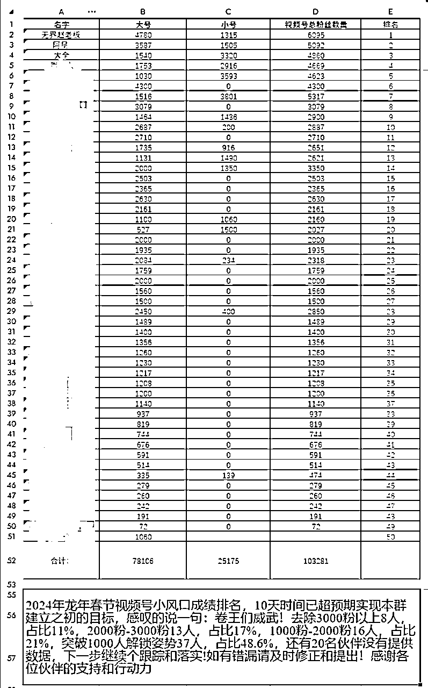

# 大厂 P8 架构师的 AI 破局： 打造 IP半年内变现 40 万+

> 来源：[https://eqsdsj0h4eo.feishu.cn/docx/U30zdNsENof2lFxb4lycT5bEnRd](https://eqsdsj0h4eo.feishu.cn/docx/U30zdNsENof2lFxb4lycT5bEnRd)

我是大全，90 后宝爸， 211 大学法学院出身，自学编程，15 年毕业至今近 10 年的 IT 编程和架构经验，前喜马拉雅架构师。

于 23 年 11 月 4 号正式入局 AI 自媒体，开始副业打造个人 IP，不到 4 个月涨粉 3 万多，迄今全网累计近 500 万阅读量，

全网付费用户 4000+ 人，实现了副业月入 10 万 的成绩，连带着主业也升职，去年还转到研发部门负责人。

先来看看大全自媒体的一些成绩：

公众号累计产出 87 篇文章，总阅读 10 万+， 5000+ 读者。

知乎产出 351 条内容，「总阅读 160 万，2188 个读者」。

B 站产出 301 个内容，「总播放 218 万，629 读者」。

视频号直播春节几天时间关注增长到 5000+，单场直播热度高达 2 万，新增粉丝 1817 人。

在知乎、公众号、视频号、小红书等平台都有不错的成绩，尤其是知乎在 2 个多月的时间内到达 8 级大 V，阅读 150W，引流私域近 5000，四个月累计变现已近 35 万，通过广告等收入也月入过万。

这里在简单说【 AI 入局 4 个多月成绩】：

1.  全网付费用户 4000+ 人，GMV 70 万，变现 35 万，单日最高变现 5 万+。

1.  发售一本 AI 入门付费小册， 发售半个月订阅量 3500+，变现 3 万+。

1.  公众号涨粉 5000+，总阅读 10 万+。

1.  小红书起号 3 天内总阅读 20 万，涨粉 2000+。

1.  视频号 5 天涨粉 5000+， 最热一场热度达 2 万，涨粉 1817 位。

1.  5 天内举办了一场场观近 2000 的大型「知乎 AI+IP 掘金」公开课。

1.  知乎起号 5 天破格开通致知计划， 2 个月到 8 级，涨粉近 3000，总阅读 150万+。

1.  制作了一个订阅 25K+ 的 GPTs 「绘画大师」，上榜 GPT Store 榜单，变现 5 位数。

从一个新疆农村出生的草根，经历 3 次高考考上 211 大学，大学法学又自学编程，工作 5 年做到喜马拉雅架构师，再到现在入局自媒体 4 个月取得如此的成绩，真的非常感慨自己的人生，期间经历了多少艰难，只有自己知道。

我一直非常庆幸小时候吃的苦，才让我现在面对再大的波折都百折不挠，只要是自己坚定的方向，就算再苦也咬牙坚持。

按照社会对程序员 35 岁即失业标准来看，大全其实属于被淘汰的人群。但我却在大环境一蹶不振的情况下，利用 AI 副业开启了人生的第二曲线，大全如何做到的呢？

这里一点点剖析复盘自己的成长轨迹，希望和我当初一样迷茫的你不再迷茫。

接下来进入正文，文章分为八部分，目录如下：

# 一、留级生到 P8 架构师

## 一）留级生到圆满 211

我从小是在新疆的一个小农村长大的，和很多农村的孩子一样，大全从小家境贫困，我看着父母辛勤耕作，深深体会到了苦难中生长的坚韧。

大全其实没有上过幼儿园，发育又显迟滞，父母担忧的让我大两岁上学，小学一年级时还是跟不上班里的进度，老师多次找家人反馈，我成为了唯一一个留级的孩子。

初中受老师影响开始开悟，体会到父母艰辛，思考人生意义，觉悟后奋发图强，仅几个月从倒数到班级前三。

初中毕业后，我沉浸于书籍，探寻生命的意义，给自己取了“孺子牛”的笔名，期望为社会贡献自己的力量。

初中，我才知道原来每个人都有自己的生日呀，我就问妈妈我的生日是哪一天呢？然后我就把我的生日偷偷的刻在木门上，每天都期待着生日的到来。

等呀等，终于到了生日的那天，我问妈妈，“妈妈，今天是我的生日，能不能给我 1 元钱，我想过生日”，然后我就拿着这一元钱去买了一个面包，第一次过生日，心里特别的开心，细细的品味着每一丝的面包丝，对我来说就是山珍海味，现在似乎都还记得那个味道。

但是命运喜欢开玩笑，后来我高考失利，压力过大，休学一年，心中的失落和绝望像是无边的黑暗，将我整个人吞噬。

周围的人都建议我放弃，但内心的某种力量告诉我，我不能这样轻易放弃。我有我自己的理想，有我想要追求的未来。

于是，我决定挥别过去的失败，准备复读，复读两年，终考上 211 一本。大学专业是政治学，我满怀理想，想要成为一个名留青史的人。

但随着时间的推移，接受的专业学习的深入，看过的书越来越多，我开始意识到，我并不适合从政。

在大二，我先是为自己取了新名字——刘幸程，寓意着人生应是一段幸福的旅程。接着花了几个月的时间，自学编程，并旁听理科班编程和数学相关课程。

回顾大学生活，再次探寻到人生方向，发展了多元的爱好真是非常快乐。

比如，学会了游泳，参加了学校瑜伽的选修课，还有民族舞蹈选修课，以及网球选修课。

关于社团，我参加了双节棍社团和拉丁舞社团，还参加了几届拉丁舞大赛，获得了心仪的名次。

## 二）6 年涨薪 10 倍，入职喜马拉雅

毕业后我就从事和计算机相关的工作，而且求职经历从：新疆-上海-北京-杭州-上海-合肥，跑了好几个城市。

2015 年毕业后去了上海做程序员，有些自大了，在一家小公司做管理系统荒废了两年，然后裸辞，奋发图强了几个月，每天起早贪黑开始再一次精进编程。

之后就跑到了北京，顺利的拿到了一个外企的 offer，薪水瞬间涨了 500%。但这种光景只持续了两年，第一次感受到中年危机。

在这家的日子过得还是很充实了，因为是外企，福利政策啥的都比较自由，我那时也是为了锻炼身体，特意买了一辆公路自行车。

每天骑车上下班，来回 40 公里两小时的路程，这样我持续坚持了快半年的时间，就在骑行的那段时间，我听完了人生的第一个几千集的玄幻小说《斗破苍穹》。

大家都知道，计算机编程有很多的工作，大家都很卷，也很拼身体、熬资历、想拿期权和更好的待遇

这一次回到老家，和自己拼了命，抱着破釜沉舟的勇气，告诫自己，这次的目标是成为架构师，否则的话，我就转行用不再做程序员。

2019 开始到杭州找工作，入驻一个 10 人间的青年旅社长达一个月之久，期间入职海康威视等两家公司，因和自己的理想不相匹，此时喜马拉雅投来了橄榄枝，之后顺利入职。

在喜马拉雅的几年中，作为一个小组的负责人，负责了整个电商中台从 0-1 的搭建，以及亿级分销订单的处理。做到了 P8，那几年的互联网盛景里，我终于也可以说自己是大厂 P8 了！

入职喜马拉雅这段经历我省略了很多，其实非常坎坷，有兴趣的朋友，可以看我那段时间约 1.5w 字的追忆。一个“被裁工”到喜马拉雅架构师的逆袭之路

大全从大学开始就培养了运动的爱好，基本每天都会跑 10 圈操场，然后做几百个俯卧撑，或者在操场上练练双节棍。

毕业之后，我加入的每家公司，工作之余我都会强迫自己锻炼，比如我选择了离公司 5 公里以内的住处，这样可以强迫每天跑步上班 ，又或者骑车上班，再者要是坐地铁的话，也会提前一两站下车，然后跑回去。

喜马拉雅，在上海是出了名的没有加班文化的公司之一了，这样我的时间就充裕了很多，在喜马的时候，我每天骑车或者跑步上班，下班比较早就会参加拳击课，拳击课大概坚持了一年多的时间。除此之外，利用下班和周末的时间，我还学会了吉他，并可以弹奏几首简单的曲子。

卷了几年以后，我又停下来思考人生的去向。摆在现实面前很残酷的一点，我要兼顾家庭和事业，而如果一直在大城市卷，也很难有出路，上海户口、上海的房价都是高不可攀的。

## 三）回到合肥，薪资不降反增

2021 年我决定回到合肥，加入了一家初创公司，一切都还挺好，回到二线城市，我不但没有被降薪，还享受一线城市的薪资待遇、还获得了两项国家级技术发明专利、一次 CE0 提名奖，很快我成为了团队的核心人员，公司直接给了十几万的原始股。

起初公司运转似乎一切顺利，但随着外部环境变化，因为我们公司原始资金是美股，大环境的变化，导致公司的融资遇到困难。在经历了两次降薪、封闭开发 3 个月、那阵子住在公司，睁眼就开始工作，经常是直接干到凌晨 1-2 点的节奏。

但最终公司还是没能度过难关，上头不得不关闭合肥分部，也就是，我的公司黄了，我又在明明事业最辉煌的时候，失业了！

因为我的突出贡献，离开时公司给了我两个方案，一个是公司原价回购所有原始股，第二个是公司给我保留的权利，如果上市，可以获得相应的报酬。

我最后毫不犹豫的保留了价值千万原始股，因为我知道公司已经很困难了，这是我最后能为公司所做的事了。

# 二、AI 副业之旅

2023 年对互联网行业来说，无疑是一个最寒冷的冬天。在经历了漫长的两个月求职期后，我终于找到了一份新工作，这家公司即将迎来上市，目前是作为一个部门负责人，正在朝着技术总监的方向发展。

经过过去几次职场遭受的打击，都是在上升期遇到了挫折，我开始对职场心灰意冷，但日子还是要过下去，每个月万元的房贷要背、要给未出生的孩子赚奶粉钱。

所以我重新找到工作后，同时更坚定要探索自媒体创业，就开始寻求人生的第二曲线，我要做自己的“公司”，自己决定去留、拥有更多选择权！

## 一）初遇 AI

去年 AI 风潮席卷而来的时候，我最开始是不屑一顾的，想着又是一个噱头，但随着 GPT 越来越火，我就开始尝试使用 GPT 3.5，使用时确实被惊讶到了，但还是感觉有些智障。

直到我使用 GPT4 的瞬间，完全被震撼到了，但接下来的就是让我陷入到了深深的的反思之中，对人类的未来感到迷茫。感觉未来对我以及整个人类来说，都前途未卜。

然而，在一次尝试中，我向 AI 寻求了建议，虽然起初并不抱有太大希望，但结果令我意外。通过与 AI 的交流，我找到了未来的方向，我的迷茫消散了。

与 AI 的交流，让我知道，AI 只是一个工具，未来淘汰我们的，不是 AI，而是那些会使用 AI 的人，而且虽然 AI 会取代很多的工作，但是也会创造出更多全新的工作机会。

## 二）拥抱 AI

所以从 2023 年 5 月以来，我一直在拥抱变化，拥抱 AI，为的就是在这个 AI 风口，抓住机会，利用 AI，提高自己的产出，然后带领更多的人学会使用 AI。

为了让更多的人学会 AI 这个工具，我也因此决定了，我在未来要带领更多人学会使用 AI，做一个 AI 提示词的布道者。

为此我还和一些志同道合的人，加入了一个 AI 学习交流的知识星球，因为洋哥星球的宗旨，就是极致的利他，让更多人学会 AI，所以几个月的时间，就疯狂快速的涨到了 3W 人，成为中国最大的 AI 社群。

# 三、决定入局 AI 自媒体

## 一）第一笔知识付费

别看大全挺早就接触互联网了，但是关于知识付费，去年 2023 年加入星球才第一次接触，在此之前大全基本上从来没过任何的知识付费，想着都是割韭菜的，所以都是去各种地方白嫖资源。

5 月份的时候付费百元加入了 AI 星球，从此开启了我第一次付费之旅，开始了 AI 学习之旅，但是由于 AI 信息爆炸式扑来，大全看了之后什么都想要，什么都想抓，结果几个月的时间越来越焦虑，再加上工作也忙，就慢慢的没有关注 AI 领域了。

直到去年 9 月份闲下来，再次开始关注 AI 星球，刚好有航海，这次一口气报了 4 条航线，这次航海也是改变我命运的一次契机，让我对之前不屑一顾的提示词，一下子刮目相看，原来提示词比我想的要复杂和重要很多，这次也在心中种下了提示词的种子。

## 二）命运齿轮开始转动

10 月份中旬刚好机缘巧合付费 5 位数加入了一位大佬合伙人 ，这是大全人生以来最大的一笔知识付费，抵得上我半个月的工资了。

但是我当时想，时间就是金钱，我都浪费了几个月的时间，反而越来越焦虑，那这 15 天的工资投入是值得的。

而且面对自己 35 岁的中年危机，巨额的房贷，还有将要出生的小宝，想要给孩子和家人创造更好的生活，我的肩膀上的担子非常重，忐忑了大概一周的时间，最终下定决心再搏击一下，给自己一次机会，毕竟如果自己摸索还会浪费更多的时间。

于是大全的命运齿轮开始转动，也算是真正开启了自己的 AI 破局之旅。

大全经过一个月左右的定位思考，终于在 11 月初确定定位为 AI 提示词领域，然后当天就马不停蹄的在知乎和公众号开始输出 AI 提示词相关的内容了。

那段时间特别的辛苦，因为我之前是程序员，根本没有关注过 AI 自媒体相关的任何东西，而且自己平时连朋友圈，知乎，抖音，微博等任何社交娱乐的产品都不用的社恐，这就对我来说异常的艰难。

我开始疯狂的补课，开始学习公域是什么？

个人 IP 是什么？如何找对标？知乎的底层逻辑是什么？

如何做出优质内容？如何快速升级？如何快速涨粉？

知乎如何变现？如何安全引流？如何制作钩子？

引流私域如何处理？私域如何成交？流量如何闭环？产品如何闭环？

一下子问题铺天盖地的，一时心脏都疼，不过既然坚定了方向，咬咬牙也要坚持，那时因为每天要上班，晚上回来再晚也会坚持知乎的创作，经常每天 1-2 点才入睡。

就这样一直坚持着，2 周到 6 级，1 个多月到 7 级，2 个月到 8 级成为知乎大 V，慢慢的知乎权重越来越高。

那么在知乎取得了成绩以后，我的势能开始起飞了，跟着 AI 航海，从 AI 提示词航线志愿者再到万人 AI +知乎航海的教练，帮助了近千人学习了 AI 知乎。

# 三、小白如何入局 AI 自媒体

在自媒体平台打造个人 IP ，首先需要定位，正所谓定心定位定江山，有了定位，才能找准自己独特的赛道，之后才能持续发力。

首先送给大家一句话：「你很有价值，只是你不知道」

## 一）个人 IP 是什么？

那接下来就是个人 IP 是什么？怎么样去打造个人 IP，尤其是对于我们这些小白来说，定位到底是啥？这个问题让不少人迷茫。

我自己也是从一头雾水到最后找到自己的定位，所以我想把这些经验分享给大家。

首先明白个人 IP 是啥，什么是个人 IP， 我的理解，就是个人品牌，就是当我们提到某个人，就知道在他哪个领域是个高手，是个值得信任的人，他在这个领域，拥有高于常人的认知和价值。

很多人好奇个人 IP 和网红的区别是啥？大家看下这个公式就知道，个人 IP 和网红的区别了，大家可以好好体会一下。

IP 有人格特征的个人品牌，基于信任，一但建立起来，可持续 10 - 20 年。

网红流量来的快，去的也快，最多 2-3 年，变现单一，打赏或者广告。

## 二）为什么打造个人 IP ？

我觉得，最重要的一点，是个人 IP 塑造了价值，增加了信任度，从而提升了转化率。

IP 重在私域变现，公域 10w 粉丝，变现不如私域 100 人

可以知识付费，CPS 带货，可以卖广告

可脱离平台，不受限于平台，粉丝属于自己

如果一个人分享的视频，我看着很喜欢，我就会点赞、关注、收藏，这样我就可以经常看到他的视频，我觉得这个人很有趣、或者分享的东西很有用，

某一天他做完视频分享，下面弹出来一个橱窗，是和这个视频内容相关的东西，我一想，可以用的上呀，于是毫不犹豫的就买了。

现在的视频博主，不就是这样做的吗，他们会经常分享自己所在领域的视频，这个不就是个人 IP 吗。

那么 IP 如何定位呢？这里给大家几个建议：

1）多试错

2）找自己感兴趣的

3）找离钱近的

4）建立独特风格

5）寻找对标，拆解

6）要垂直，一厘米宽，一万米深

接下来我们详细说说：

## 三）个人 IP 定位

定位不仅影响精准的粉丝积累，还决定了你能否满足粉丝的需求、和提供相应服务，并通过满足需求获得商业价值。

### 1、寻找定位

#### 1）多试错

这个真的超重要。我开始也是一头雾水，不知道自己擅长什么，也不知道自己对什么感兴趣。那怎么办呢？试错啊！多参加航海，探索各种航线，免费，看看哪条适合你，大全刚才说的上一条航线就是，参加了 4 条航线，就是在试错，找自己适合的赛道。

#### 2）第二找自己感兴趣的

这一点非常的重要，只有感兴趣的东西，才能持久，这个是自身优势，尽量在自己原有优势的基础上去发力，这样也更容易出成绩，不要太过于纠结自己的弱势，而是重点关注如何放大自己的优势。

比如大全是程序员，而且平时工作就在使用提示词提高工作效率，也对新技术非常感兴趣，所以最开始也是基于自己的兴趣来定位的是提示词。

还有一点就是，提示词其实对程序员比较友好，所以也可以根据自己的优势来定。

#### 3）第三找离钱近的

如果找不到自己感兴趣的，或者着急需要变现，那么就可以找一个离钱近的方向，比如 AI 领域的 AI 数字人，AI 拆书，AI 代写，AI 公众号爆文，AI 视频号等等，这些都是可以直接帮你快速赚钱的途径。

你看咱们航海里有些合伙人，或者是一些群里的老师，人家 AI + RPA 公众号爆文一个月能赚几十万，尤其是那些搞得好的，通过打造自己的内容矩阵账号，收入就更加可观了。

#### 4）建立独特风格

说到建立独特风格，这个真不是说说而已。你得有自己的特色，就比如说，别人都在做小红书普通电商，你来个 AI 小红书，专门做一些 AI 主题的内容，这样就能在众多内容创作者中脱颖而出了。

你的风格可能更直接、更有个性，这就是你的独特之处。别人为什么要关注你，就是因为你提供了别人提供不了的价值和视角。

所以要想在自己定位的赛道上快速超越竞争对手，就要有自己独特的风格，也就是做一些差异化。大家可以看看《定位》这本书，告诉你如何锚定用户心智。

### 3、定位实践

#### 1）寻找对标

找对标，这一步对于打造个人 IP 来说，是指引我们行动的方向。

不管你是想做小红书的达人，还是公众号的内容创作者，核心都在于找到那些已经成功的案例，然后深入分析它们。

对标的主要目的是为了学习和复制他们的成功之处，最后记住，不要害怕模仿。在你找到自己独特风格之前，模仿是快速成长的捷径。

#### 2）一厘米宽，一万米深

为了获取精准的用户，那么定位就要足够垂直，只有足够垂直，大家才会认为你是这个行业的专家，这样也会更加容易获得平台推荐。

所以，我们打造个人 IP，要做的就是定位足够狭窄，但是深度一定要足够深，就是一厘米宽，一万米深，因为每个人精力是有限的，这样才容易单点突破。

定位先明确大方向，比如大全是 AI 赛道的，然后在大方向里找细分领域。比如大全细分领域是 AI 提示词入门，那么目标用户就是不懂 AI 的小白用户。

#### 3）内容输出

定位完成之后，剩下就是输出内容了，这一点也需要注意，输出的内容，一定要和自己的定位相关的内容，最好是一系列的内容。

比如大全，定位 AI 提示词入门，那么就在持续输出 AI 提示词入门的内容，慢慢的用户就会认为大全是这个领域的专家，有需要学习的话，就会来找我。

## 四）小白如何入局公众号

### 1、公众号第一次尝试

早在 20 年的时候，因为经历了一些事情，就突然有想写作的欲望，就开始拾起自己的公众号了，因为好久没写，花了好久的时间写了几篇文章，但是后来阅读都非常惨淡，就没有坚持了。

那个时候不知道为什么失败的原因，现在想想就是，对于一个新事物，没有足够的认知，就开始行动，必然会失败，记得洋哥说要拆解一个系统，包括要素，环境，链接关系，知道底层运作逻辑之后，开始才有可能突破。

所以这次失败，我没有反思总结，现在看来，那次的失败是必然，即使我每天日更，再累也是一样的效果，因为我没有找到公众号的本质。

这里分析下失败原因：

*   首先：失败的原因就是没有冷启动，没有基础读者关注，这样即使文章再好也没人看，

*   其二：是没有找到自己账号的定位，也很难吸引读者关注，

*   其三：没有找到公域引流了到公众号，而且那个时候公众号还没有推荐流。

### 2、 为什么再次尝试公众号？

23 年 10 月份的时候，偶然间看到 AI 星球里面说问一问有机会，有些人几天的上千读者关注，详细看了下教程，非常的激动。大全就抱着试一试的态度答了几个问题，结果没想到果然引了几个读者关注到公众号。

你要知道以前吭哧吭哧写了半年也涨不了几个读者关注，这问一问几个回答就涨粉，那不和白捡的流量一样吗？

这其实只是一个给了大全一个契机，让我公众号冷启动了，但是如果没有下定决定做公众号，这些读者关注也是浪费了。

真正让我坚持的是因为看了 IP 商业课之后，真正的意识到未来真的是个人 IP 和超级个体的时代，那么公众号就一定是我们需要攻克的阵地。是一个连接公域和私域的桥梁，持续打造个人 IP 扩大个人影响力的地方。

### 3、公众号如何冷启动

公众号冷启动还是很重要的，否则没有正反馈很难做起来。大全的冷启动主要是问一问初始流量，

先说问一问，大全主要靠的是问一问冷启动的，因为当时效果不错，我就开始持续铺答案了。果然不到一个星期我就通过问一问就获得了近 700 的读者关注，开通了流量主，获得了第一桶金。

问一问涨粉的逻辑是：点赞后下方会出现你的视频号或公众号，感兴趣的就会随手点个关注。

再分享两点问一问爆款心得：爆款的唯一函数是情感共鸣，受众人群越广爆的上限越高，情绪促动的点越早，被分享的概率越大。但是还要记住一点，前期可以怎么玩，但是后期回答还是要尽量的垂直自己公众号的领域，这样关注的读者更加精准。

问一问大全其实使用 AI 回答问题的，最开始的时候，经常会被微信识别出 AI 的内容，经过训练调试几次，终于可以输出模拟人类的带有一些调侃的回答。所以前期可以非常快的输出答案。

最终看下效果，大全是每天基本上都可以涨粉 100 多，最多的一次新增关注 125，因为这已经算是问一问流量的尾巴了，所以这点成绩应该算不错的了，否则高峰期入局的话，少说也可以获得 5000-10000 的读者关注。

看下大全做一个星期的成绩吧，一个星期后没有高峰关注了，是因为问一问规则改变了：

### 4、公众号如何持续产出内容？

这几个月做自媒体，大全总结出了一套万能公式，不论公众号号、视频号、知乎都是这种玩法，今天分享给大家，这个也是受大全老师的启发：

1）确定好系列，比如基础知识系列

2）从入门开始讲解，比如大全的是 AI 工具的讲解。

3）按照由浅到深持续输出，

当然还有一点需要特地强调的就是，输出前一定要确定好自己的定位，自己的 IP，这样的话，才能持续的输出，才能吸引精准的读者关注。

这里分享一下在小林公众号看到的，说建议把公众号当作一款产品去打磨，从运营、数据、引流等等分析，揣摩自己是用户，怎么样才能更好的服务用户。

### 5、公众号如何快速增粉？

#### 1）找同类型的号互推

比如我是做 AI 入门的，可以找 AI 领域的公众号来互推，推的内容和你的领域相同，也可以尽减少对用户的打扰。

#### 2）找大 V 转发

我当时找洋哥帮忙推，洋哥 20 多万的读者关注，推了我一次，大概涨粉 2-3 百个。

当然主动出击找大 V 推，但是要记住人情世故，发点红包啥的。一来二往就熟悉了。

#### 3）混高端付费圈子

我们有一个合伙人的圈子，里面有很多的大佬，有几次我发的几篇优质的文章，群里的人帮忙点赞转发，不到两天就推爆了，阅读就直接突破 5000 了，这个也给我带来了好几百的读者关注。

当然高端圈子还有一个好处是，里面有很多大 V，首先要保证你的文章优质，有一次被几十万读者关注的军哥看中了，直接说帮忙转载，当时非常的激动，也带了了不少的流量。

#### 4）从公域偷流量

最后一点也是最重要的，大全其实 11 月份开始做知乎，到目前为止引流到公众号的大约达到 1000 个了，虽然知乎的读者关注才 1500 个，这其实是很可怕的数据了。

还是那句话，输出的内容一定是干货，要有价值，用户有收获，用户才会被吸引。

## 五）小白如何入局 AIP 知乎

接着我们来说说最适合小白打造个人 IP 的平台：知乎。

首先公域的特点是什么：

算法机制，平台推荐，穿透力强

主动吸引，精准引流

天花板高，新流量持续不断

大家看到公域的特点了吗？看完之后就知道我们为什么要做公域了吧。

### 1、AI 知乎 3 个月的成绩

大全是在 11 月初定位好做 AI 提示词的个人 IP 后，就开始搞知乎的，短短 3 个多月做出了一些成绩：

1.  知乎累计变现 6 位数字。

1.  知乎起号两周多到 6 级，读者关注涨到 800+，总阅读 55 W+。

1.  知乎单日峰值最高 4.5W，两篇获得 13W 阅读。

1.  知乎起号 1.5 个月到 7 级，涨粉近 1500，总阅读 100W+。

1.  知乎起号 2 个月到 8 级，涨粉近 2000，总阅读 150W+。

1.  知乎小号起号 5 天破格开通致知计划开始变现。

### 2、为什么选择知乎

首先我们为什么要做公域，公域的目的就是未来偷流量到私域，有了自己的私域，才有更多的可能性。

而且公域特别适合做个人影响力，打造个人的 IP，让更多的人看到你。那么自媒体新手来说，第一个问题就是选择合适的公域平台。

当下国内的公域平台这么多，自己的时间精力不多而无法同时在多个自媒体平台发力，那么选择一个适合自己的平台聚焦，然后单点突破。

那么自媒体新手来说，第一个问题就是选择合适的公域平台。

知乎是中文互联网最大的最专业的问答社区，核心就是提问和回答，知乎一直以高密度、高质量的知识生产和优质长图文为主，共产生了 4 亿多条问答内容，那么我们具体看看知乎的特点：

#### 1）流量大

和百度有战略合作，只要好的内容，百度搜索直接推荐你的答案，而且 2023 年第 3 季度知乎平均月活用户高达 1.11 亿人。

大全之前做知乎的时候，有几天每天的流量都快破 10w 的阅读，想想还是很可怕的。

#### 2）容易引流

知乎平台有腾讯的战略投资，可以在一句话介绍，个人简介以及文章中留个人微信，或者公众号，从而引流到自己的私域。

知乎的粉丝没用，导流到私域才有价值，否则你就是在给平台打工，因为平台一旦没了或者限制你了，那你几年的心血就全没了，所有期间我也一直学着如何引流到公众号，到微信，就这样慢慢的私域也起来了。

大全这几个月，从知乎平均每天引流到微信和公众号的都有十几个，到现在公众号快 3000 关注，微信也快 5000 的用户了。

#### 3）能够快速变现

知乎刚起号就可以参加官方打卡活动，偶尔会有盐粒以及超赞包奖励，并且可以提现，而且只要方法对，只需 1 个星期就可以开通致知计划，之后每一个回答都会有收益。

到目前为止大全知乎打卡和致知计划就赚钱好几百了，再加上广告收益已经近万元，但是最主要的变现还是私域。

#### 4）内容专业、读者质量高

先看知乎用户发布，就可以看出知乎读者质量了，知乎 30 岁以下用户占比超过了 78% ，男性用户相比于女性用户更多，占比 56.9% ，居住在一、二线城市的用户占比超过了 73% 。

还有你想想在这浮躁的社会，能静下心来耐心看完图文的读者，都是有一定修养和内涵的，付费意愿更强，所以这也决定了你的图文可以吸引的都是需求高、质量高的精准读者。

#### 5）流量长尾

同样的一个问题一年前火过了，未来某一天可能又突然火了，那这个问题将会再次给你带来一波流量。

这一点可以和大家再说一点，就是流量长尾，大全其实快一个月没有更新知乎了，但是每天知乎阅读还是将近 5000 左右，每天知乎涨关注大概 10 几个，还有引流来微信的还有大概 10 个左右，这个价值其实非常巨大。

### 3、 不专业怎么办？

很多小伙伴担心知乎内容太过专业，自己的知识储备不足胜任。其实这是一个误区，专业其实是相对的，并不是说在某个领域要达到 90 分甚至是 100 分。

当你达到 60 分的水平，能够给小白讲清楚，让他从 0 达到 40 分的水平，那你就是专业的。

## 六）知乎核心玩法

做知乎的核心就是研究知乎底层是如何升级的，升级维度有哪些，如何快速提高对应维度的分值？

还有就是知乎的如何快速产生出高质量的回答，如何吸引读者关注，如何引流到自己的私域？

只要摸清的涨分涨粉密码，之后就是持续输出干货就可以了。那么我们就按照这个逻辑来剖析给大家。

这里呢其实就是拆解平台，知道底层逻辑，才可以更好的做到你要的效果，如何拆解呢？

这里我就帮大家拆解一下知乎，大家以后也可以学着拆解一个系统，比如视频号，公众号等。

### 1、如何快速涨分

#### 1）快速提高内容优质分

记得洋哥说过一句话，就是玩知乎，就像打怪升级，只要了解游戏规则，就可以很快通关，这一点我深有体会，

因为大全就是一个非常爱玩主机游戏的游戏 UP 主，越玩知乎，越上瘾，就越像在玩游戏，搞得我好几个月都对虚拟世界的游戏，提不起任何兴趣了。

大全目前掌握了核心玩法，每天半小时，日更几篇内容的情况下，平均每日的涨分大概在 2000 左右，最高一天达到 2 万分，一周涨分 2 万分，一个月 10 万分，一个月轻松到 7 级。

大全带的学员中，升级最快的知乎起号 23 天就升级到了 7 级，就开始了引流变现。

想要快速提高账号的等级和权重，一个比较好的办法就是提高内容优质分。这也是我玩知乎两周多达到 6 级的原因。

下面大全对优质分进行拆解：

#### 2）什么是优质内容

提升等级的关键就在于优质内容分，优质分数每周一更新一次，只要保证每天持续输出的话，就可以保证优质分数上到千分，只要优质内容足够多，高达万分都有可能的：

那么什么样的内容才可能被知乎评选为优质内容呢？据知乎官方的提示，有以下几部分：

1.  真诚表达，内容专业；

1.  内容丰富，结构清晰完整；

1.  文章字数 1000 字以上；

1.  原创度在 80% 以上；

1.  可读性相对较高，3 张图文最佳；

#### 3）使用 AI 快速产出优质内容

这里推荐我制作好的应用《知乎文案专家》GPTs：https://chat.openai.com/g/g-9eJRg2QVj

这里简单说下使用教程吧：

*   功能介绍

首先你只需要把知乎的问题给到大全制作的 GPTs ，然后《知乎文案专家》就会回答这个问题，回答的特点如下：

*   口语化的内容输出 800 文字左右（为什么要 800 字，这也是优质文章的要求）。

*   在排版使用 markdown 格式输出。

*   文章最后会自动针对文章主题生成 3 张图片（为什么是三张，因为知乎优质文章要求至少三张）

*   使用方法

这里直接先给大家输入需要回答问题的模板如下：

主题：xxx。

背景：xxx（这个有时候别人提的问题，会有补充表述，可以写在这，没有就不用填写。)

参考内容：xxx（这个你可以直接参考内容，这个 gpts 会参考回答，没有也行）

首先主题是需要输入的，但是背景和参考是可选项，没有的话是不需要的。

大家只要坚持使用这个应用每天回答 1-2 个问题，也花不了 10 几分钟，

知乎的赚钱路径大体上，先用我的小应用快速回答垂直类问题， 大概 10 天左右开通致知计划，之后每天回答就会有收入了，然后在持续输出内容，

快速的到达 7 级，之后可以进行好物推荐，带货，放广告，以及自己的课程，一系列的变现手段，但是起号实际上是最开始比较困难的，所以推荐给大家自己一直使用的神器。

#### 4）快速提高亲密度创作分

*   组局互刷

亲密度创作分的权重仅次于优质内容分，而且这个是每个月的月末才进行更新，大家可以找几个小伙伴组局，一起互刷数据，

大全在 12 月和 1 月通过在自己创建的知乎互助陪伴群中和大家互动，总共获得了 3 万分，这是相当可怕的，可以直接把一个 0 级的号直接升到 7 级。

首先需要互相关注，然后进行点赞、收藏、喜欢、评论、转发等动作。

*   找大 V 点赞

起号初期，找知乎大 V 点赞和转发，会让你的单个作品获得更大的曝光，长期下去，知乎就会判定你的账号为优质账号，即使后期没有大 V 点赞，每日的流量也会很多。

而且据我观察发现，大 V 点赞不止是曝光增加，更重要的是，会直接导致你当日的知友认可分数飙升。

目前大全就算大 V 了，有需要也可以找大全，目前大全一个点赞市场价 10 元。

*   完成每日圆环任务

知乎每日都有圆环挑战任务，可以在手机 App 上查看挑战任务。任务奖励非常丰富，经常会奖励盐粒（100 盐粒相当于 1 元钱，可提现）和创作分，而且我发现，只要你坚持打卡一段时间，就一定会获得 18 元的 1000 超赞包。

我就获得过两次，这个可以给你的文章额外的至少 1000 的曝光量，对于觉得自己文章质量不错的文章，使用效果非常明显，可以直接把一篇文章带火也是很有可能的，前提是你的文章足够优质，否则就不要使用。

#### 5）内容自荐

知乎等级到达 4 之后，每月都会有几次机会自荐自己的往期文章内容。其中 4-7 级每月 3 次机会， 8-10 级每月 5 次机会。

这里推荐大家对于快要爆了的文章，以及你觉得质量非常好的文章，可以试一试。

### 2、如何快速涨粉

涨粉的逻辑其实很简单，就是你的内容对别人有帮助，只有内容过硬才能击穿平台，获得推流，留住用户。

#### 1）什么问题容易爆粉？

那就是刚需问题，那什么是刚需问题呢？刚需问题是那些直接解决用户实际困扰、提供必要技巧或触发深层次思考的问题。

它们是用户急切需要解决的，因此具有很高的参与度和转化潜力。

非刚需问题，尽管可能在短时间内引起广泛关注并获得爆炸式的点击量，但这种关注往往难以转化为持续的用户追随或付费行为。

例如，那些仅仅提供娱乐的内容，用户可能只是为了消遣而关注，而非出于长远的需求。

此外，专注于刚需问题能有效地“埋钩子”，那么什么是钩子呢？钩子的本质就是加我领资料，比如职场人士的《360 技术总监. PDF》，程序员的《算法小抄。PDF》，AI 入门的《AI 入门到进阶。PDF》。

#### 2）如何找到爆粉问题？

那如何找刚需问题呢，这里大全整理了几点，但需要注意，在寻找刚需问题时，关键在于选择与自己的 IP 定位紧密相关的问题，而非盲目追随热门话题。

这样做不仅能确保内容的专业性和深度，还能加强与用户的联系。

1.  热搜 / 热榜

大家可以每天早、中、晚固定时间段刷一下知乎热榜，看看有没有符合自己垂直领域的问题。需要特别注意，热搜转瞬即逝，一定要把握时机快速回答。

1.  关键词搜索

要根据自己的垂直领域，准备一些领域关键词，定期搜索相关问题。例如大全的定位，可以用 chatgpt 、提示词、AI 等关键词。

在搜索关键词后，进行内容筛选。选择那些获得最多赞同的内容，因为这样的内容往往能吸引更多流量。

## 七）可复制的引流玩法

这里主要讲解知乎的引流，这块我是比较有经验的。

### 一）知乎引流

我们为什么要引流呢？实际上上面所有关于知乎的起号，知乎的创作，以及知乎的账号升级，都是为了引流来铺垫。

*   你只有起号定位好，才能吸引精准的读者。

*   你只有知乎创作出干货文章，才能吸引读者关注你。

*   你只有到达 7 级，你才可以更加大胆的引流，否则 7 级前很容易违规。

*   所以引流才是我们最终要做的，也是做知乎的目的。

#### 1、引流方式介绍

知乎的引流本质就是加我领资料，引导用户加微信或者公众号。

#### 2、引流方式

1：个人介绍中留个人公众号和微信

2：文章中留福利资料的钩子，引导用户关注。

3：评论引导

但这里需要注意的就是，7 级前和 7 级后的引流操作差异很大的，实操部分分别讲解。

### 二）知乎 7 级前引流

大家都说在 7 级前是不建议引流的，但是经过我多次河边的探索，发现了一个安全引流的方法。期间被两次关到小黑屋，都是血泪的教训。

首先知乎引流通常就是选择私域到公众号和微信。那么下面来进行拆解：

#### 1、一句话介绍

这里可以在一句话介绍中写上自己的公众号和微信，这里的重点是资料在公众号，大多数人就明白需要关注公众获取资料。

这需要注意，就是在前期最好不要这么做，我是在 5 级的时候才开始的，在 4 级的时候尝试过，但是被警告了并且个人信息被重置了。

#### 2、个人介绍

还有为了吸引大家的关注和引流更加成功，在个人简介中可以秀肌肉，可以说下自己的标签，擅长的领域，还有为了让大家感受你是一个有血有肉的人，最后可以加上自己的爱好。

#### 3、在文中引流

其实就是在文章中说关注公众号获取资料。

但是这里有一点一定要注意，那就是内容一定要是干货，有干货，那么才会吸引人关注获取资料，因为毕竟加公众号还会有些麻烦的。

所以大家还是需要制作一些非常有价值的东西，才会获得好的引流效果，这个才是前提条件。

### 三）引流避坑指南

但是这里一定要注意尺度，以下几点一定不要碰：

1.  7 级前后都不能不要说除了公众号之外平台名称，比如小红书什么的。

1.  7 级前后都不能留任何的二维码。

1.  7 级前不要放入任何的网址，包括公众号网址。

# 五、离职 All in AI ，3 个月变现 35 万

今年 2 月中旬，大家都见证了 AI 技术飞速发展的恐怖，尤其是 Sora 文生视频技术的出现，引起了全球关注。

在这样的趋势下，我毅然决定全身投入 AI 领域。离职后，我开始思考在 AI 时代我的下一步行动。同时，家中新成员小龙宝的到来，让我陷入了极度焦虑。

而且发现全职副业，真的比上班还辛苦，上班还有周末，现在副业已经好几个月都没有休息了，即使过年期间也是如此，之前有一次为了准备一场公开课，我居然连续工作了 19 个小时。

大全其实一直不看好私域，也想着好好搞公域然后引流就行，但是有一天突然意识到 IP 的底层应该是私域，是需要触达粉丝，一下子把我惊醒了。

我其实都有些恍惚了，就仅仅刚运营私域 1 个月，就发生太多的事情了，最开始在春节的视频号项目，几天时间我和赵老板变现了 1w 多，带领了一批小伙伴涨粉近 10w。

再之后的三周时间，我就构建了自己的产品矩阵，打通了商业闭环，并且实现私域近 7 万元的收益，这也验证了个人 IP 和流量最终归宿于私域的观点。

到目前为止运营私域的这两个多月里，我实现了近 35 万元的收益，并见证了私域的爆炸性增长。

我认为打造个人 IP 的两个关键是流量闭环和商业闭环，当然还有一个非常重要的点是，遇到贵人。

大全在短短 90 多天内，基本击穿了公域，全网粉丝增长超过 3 万，阅读量达到 500 万，引流私域 1 万，实现了流量闭环。然而，之前忽视私域的我，变现能力十分有限。

关于商业闭环的实现，2 月份我意识到私域的重要性后，开始学习私域运营，首先尝试运营付费陪伴群。

凭借公域几个月积累的大量流量和口碑，陪伴群很快发展到了 200 多人，并在不断增长至近 400 人。

此后，我开始组建自己的陪伴群志愿者体系，私域能量迅速爆发，多个小册打榜前几，并引起了老马的注意，最终被邀请成为合伙人。

老马算是我运营私域的第一个贵人，之后又因为马哥引荐认识了另一位贵人靠谱老师，老马和靠谱对于我的私域放大起到至关重要的影响。

因为大全慢慢打通了公域和私域，就顺势推出了自己的 IP 私教和 AI+IP 知乎训练营，把自己的经验手把手的教给别人，那这两个产品为什么取得了不错的成绩？

首先我的 IP 私教，是因为我自己完全从 0 起步，仅仅几个月就跑通了 IP 闭环，于是想着可以手把手带人，把我的个人 IP 成长的经验传授给别人，当然需要有公域和私域的积累，才会一推出，盲定用户就有 20 多人。

那我为什么会推出知乎训练营呢？有时候 IP 真的是做出来的，我最开始推出的初衷就是想着帮助我的合伙人，让他们按照我的知乎方法快速成长，慢慢的就变成现在训练营的形式了。

但是好的产品，不会营销的话，也怕巷子深，尤其是对于一个流量还不是特别大的我来说，此时我遇到了另一位私域的贵人-靠谱老师，立马约了一次电话，靠谱老师建议搞一次公开课，但是我完全一脸懵，然后自己一点一点学习，推着推着就搞起来了。

这其实算一个小小的奇迹，我对搞大型公开课完全不懂，再加上时间非常紧迫，我们只有 3 天时间准备，正常至少提前一个月左右，最终 2 天灌了 2000 的流量，7 天发售最终成绩 10 万 GMV。

第一次公开课，第一次群发售，第一次视频直播发产品，好多好多的第一次，但坚定了 IP 之路，有些事情必须去做，即使再难，慢慢的我发现，真正的敌人是内心的恐惧和犹豫。

大全其实偷偷问过很多小伙伴为什么愿意跟随我？他们说我的 IP 之路更加接地气，刚跑出来的，可复制性强，还有一点很多都是我直播发售时选择加入我的 IP 私教。

做个人 IP，直播也是非常重要的一个环节，但是一定要真诚的利他，只要你足够真诚而且有能力，直播的时候，大家都是可以感受到的。

大家可以看到大全打怪升级打造个人 IP 的路线了吧，先是定位，然后进行 AI 干货和价值输出，把知乎快速升级到 8 级，之后引流到私域的公众号和微信，秉着利他的精神， 超价值服务和交付大家，最终达到双赢。

大全半年内不仅击穿了公域，而且还打造好了自己的流量闭环以及商业闭环，并建立起了自己低阶，中阶以及高阶的三个层级的产品，基本上算是一个小 IP 了。

# 六、春节 7 天带领小伙伴，视频号涨粉 10W+

## 一）项目复盘

春节期间，两位小伙伴麋鹿和西堂发现了一个令人震惊的漏洞，那就是通过视频号直播，仅仅播放音乐就能快速涨粉！

这可是难得的好机会、稍纵即逝的风口，说没就没了。发现了这个“bug”，我和赵老板就立马行动，仅用了 5 天时间，就实现了粉丝数的飞跃式增长，增加了 5000 多名关注者。

其中一场直播涨粉就近 2000 的关注，而我总共直播的场次也就不到 7 场！

经过这次的小项目涨粉 5 千，我更加知道：任何时候，看到机会和风口，就要全力以赴。

当我发现这个小漏洞的时候，迅速在一天的时间内，我和赵老板就对原有策略进行了十几次的迭代，搭建了一个项目体系，包括项目群，项目 SOP，项目志愿者体系，项目宣传，项目引流，项目交付，这也堪称奇迹了。

要知道在此之前我从来没搞过这种项目，就是摸着石头过河，我们用了短短 10 天，75 个人共同斩获 10W+粉丝，这在视频号涨粉项目上，都是堪称奇迹的结果！

这个小项目对外当时是 499 元，但是我的合伙人都是免费参加，100% 返佣，因此就几天时间我和赵老板这个项目收入过万。

那为什么说春节是最容易能让我们普通人找到机会的呢？

这个时候，很多视频号大 V 会休息，大部分普通人也在家与家人团聚，一方面大家在家和家人团聚，但也会觉得无聊刷手机，我们在视频号直播就有可能被看见；

另一方面，平台上内容量少了，那谁能生产内容、直播时间长，平台就给谁流量扶持。

这一时期，用户的活跃度并未降低，相反，因为假期的原因，用户在平台上的停留时间有所增加，但他们发现，习惯性关注的大 V 更新减少，开始寻找新的内容以填补空缺。

我也正是抓住了这一用户需求的变化，找到了快速吸粉的机会。可是，仅仅靠着播放音乐似乎并不能完全解释我为何能在短时间内吸引大量粉丝。

我会分成 3 点来说说，这个项目实操：

### 1、自己先跑通完整闭环，才能复制给合伙人

我做事的原则是，必须自己有结果、证明路径可行，才会复制给学员和合伙人。

那我是怎么优化直播间涨粉的技巧呢？很简单，就是“福袋”。

我在直播中设置了福袋，这是一种能够吸引用户参与的小游戏，用户通过参与游戏有机会获得小礼品或红包。福袋的设置不仅增加了直播的互动性，还提高了用户的参与度和停留时间。

更重要的是，福袋的数量直接影响了粉丝增长的速度，因为更多的福袋意味着更高的吸引力。

我还巧妙地使用了小号引导互动来刷数据，通过其他账号在直播中发起评论、点赞和分享，人为地制造热闹的直播氛围，这一策略进一步提高了直播的活跃度，使其在平台上的可见度大大提升。

由于算法倾向于推荐活跃和互动性高的内容，这种方法有效地将大全的直播推送给了更多的潜在粉丝。

### 2、团队作战，更有凝聚力

当我跑通了这个闭环，就立刻分享给了合伙人，让更多人参与进来，这是我给合伙人们的规划和承诺，现在看来，真诚待人，价值先行，一直都是我对合伙人的交付心法。

发完这个“召集令”，团队里就有很多“卷王”放弃了春节休息时间，要跟着我们一起在视频号涨粉。我们招募了近 100 人，最后在 10 天时间内，带领着大家实操涨粉，最终整体涨粉 10 万！

这是我们当时统计的表格，实时更新大家的数据，还做了细致的排名。有的合伙人短短时间，跑出 1.2 万粉丝量，其实我们的项目起步相对晚了一些，如果再早 5-10 天知道这个隐藏机会，按照日均 1000 粉的效率，小项目完全能够跑出 20-30W 粉的势能！

3000 粉以上 8 人，占比 11%，2000 粉 -3000 粉 13 人，占比 17%，1000 粉 -2000 粉 16 人，占比 21%，突破 1000 人解锁姿势 37 人，占比 48.6%，其他的伙伴没有提供数据；

大家都知道，现在粉丝流量并不好获取，即使是付费流量也不便宜，但是我们这个项目的获粉成本就在 1 毛钱，到后期攀升到 3 毛以上，怎么看都是很划算的。当然啦，黄金期过了后，获粉的成本就逐步递增了，越早加入那肯定成本越低。

对没有涉及视频号领域的伙伴，以很低的成本，最快的速度，完成视频号基本盘的积累；

### 3、合伙人的团队搭建

这次项目让我很激动的不是我自己涨粉了 5 千，而是我赋能给更多合伙人，让他们也快速在我摸索出来的路径里，找到正反馈。大家都知道，知识付费，如果你不能帮学员拿到成绩，他很容易丧失信心，怀疑自己，再逐渐失去对你的信任。

所以我们在搭建项目团队上，花费了很多心血，可以说是完全没有休息时间，带着大家向前冲！

带领近百人一起做项目，需要有极专注高效的统筹协调能力，当然本身自己还得很专业，懂得怎么带领他们快速涨粉的技巧、避坑指南等等。这对于合伙人和我，都是很大的挑战。

还好我们把表格、干货等等都准备好，及时带着他们，后面也出现后入的伙伴暴发的情况，我们同样组织帮忙，取得了可喜的成绩

有效的组织和团队在这个时候迸发了极大的力量！在这里感恩所有的伙伴！

这次 2 月份搞小项目之前，我没有直播过，也不知道直播说啥？

伙伴们都说我是声优，你们也觉得是的话，我就下来好好练习了，哈哈！

回到正题，当时直播不敢说，不会说，私下也链接伙伴，后面发现大家都不会，

大部分人都有畏难情绪，那怎么办呢？强逼着自己说，做文案，做大纲，找流程，

再找有经验的伙伴取经，不断完善自身；

最后我们都能从镜头后面走到前面，从说话都不利索，变的侃侃而谈，

我们的才华都是生活逼出来，走到一群人里，你拉我一下，我推你一把，慢慢的我们都走出来了；

现在直播对我来说，习以为常，这才 1 个多月啊，欢迎大家都勇敢尝试。

## 二）项目具体策略

### 1、直播间策略和操作

*   大小号策略： 使用大小号进行直播互动，大小号互为粉丝团成员，重要性在于直播开始的前 10 分钟，需要疯狂点赞和刷灯牌以提高热度。

*   灯牌和粉丝团： 讨论了如何设置和利用灯牌粉丝团进行互动，提到灯牌是直播间特有的互动方式，建议分散刷灯牌以增加互动和人气。前 10 分钟每分钟 3-10 个

*   直播间互动： 强调直播间的活跃度对于吸引观众和维持人气的重要性，包括使用小号点赞、刷灯牌和发评论等。

### 2、提升直播间人气的具体操作

*   福袋设置： 讨论了设置福袋领取的时间间隔，前 20 分钟 3 分钟一轮，后调整为 5 分钟一轮，以最大化观众参与和人气。

*   连麦互动： 提到与其他主播连麦可以提高直播间的热度和互动，建议在直播间人气下降时寻找机会连麦。

### 3、平台流量和违规问题处理

*   讨论了如何应对平台的流量分配和限制，提出了在直播间避免引流等可能导致违规的行为。

*   分享了申诉成功的经验，包括如何处理被平台标记为违规的内容。

### 4、直播技巧和建议

*   开播策略： 建议直播间操作包括刷灯牌、点赞和福袋策略，以及如何通过这些操作维护和提升直播间的活跃度。

*   避免违规： 强调在直播内容和互动中避免违规行为，如直接引流到微信或其他平台，以保持账号和直播间的健康

这个视频号涨粉小项目只是我的众多的实操项目尝试之一，未来还会开发更多小项目给我的合伙人。

为什么大全要做合伙人产品，就是因为，我不断在精进自己、想赋能更多对个人 IP、AI 有梦想的人，而合伙人产品就是一个圈子，我们在这个圈子里共同探索、互相学习。

# 七、蜕变总结

看完了我的故事后，其实我想跟大家分享的是：

身为普通人的我们，如何抓住 AI 风口，如何借助自媒体平台打造个人 IP，最终打通流量闭环和商业闭环。

那么有这 3 条法则，最后送给大家。

## 1、找到自己优势，定位后聚焦聚焦再聚焦

做 AI 自媒体 3 个多月，我总结出来的，找定位就是想找到自己的优势，然后再来决定你的定位，定位完成之后，就要给自己定近期，中期，长期三个目标。

有很多人都比大全厉害，有人擅长公域，有人擅长私域，有人擅长产品，有人擅长操盘，有人擅长学习。

而且定位了你的优势之后，聚焦聚焦再聚焦之后，滴水穿石，单点突破，你就成了。在浮躁的社会中会有太多的事情侵蚀我们的注意力，大家一定要注意保护。

要懂得珍惜自己的时间，学会给自己的时间标价，学会从付费的课程中，获得成熟方法论，资源、认知，还有人脉。其实免费的东西才是最贵的，不仅浪费你的时间，而且还会误导你，得不偿失。

## 2、想要成长的更快，先学会模仿

这里就是要勇于尝试，不要低估自己的能力，勇敢的尝试未知的事情，向有结果的人学习，从模仿开始。

大全最开始定位完之后，开始疯狂的补课，开始学习公域是什么？个人 IP 是什么？如何找对标？知乎的底层逻辑是什么？如何做出优质内容？如何快速升级？如何快速涨粉？知乎如何变现？如何安全引流？如何制作钩子？引流私域如何处理？私域如何成交？流量如何闭环？产品如何闭环？

解决遇到的各种卡点问题，那么大家其实会说这些问题如何解决吗？

其实最简单的方法就是模仿，最好是贴身模仿。

具体如何做呢？首先找到需要模仿的对标账号，接着就是拆解、模仿、定标、迭代、复盘、再对标，看看对方是如何解决各种卡点的，当然最快的方式是找到对标用户，直接咨询。

## 3、不要给自己设限，要相信自己

洋哥说过一句话：“世界上没有普通人，只有一直不行动的人；行动起来，你就不是普通人了”

我做 AI 自媒体的时候，遇到一些人来问我：

我纯小白，可以学会 AI，好入门吗？

我不是程序员，能不能学会 AI 提示词。

我没有做过知乎，是不是不能报你的 AI+知乎大航海？

我 0 基础，能不能学 AI 写作呢？

我是某某学历，我有某某困难，只有某某经验，适不适合做 AI 知乎自媒体？

很多人想学习新东西，还没有开始，就给自己设限：

我是小白，我零基础，我不懂编程，我学历低…… 所以，我可能学不会。

与之相反的，应该有强烈的渴望，当你渴望足够强搞出一番大事业的的时候，全世界的人都会来帮你，要相信自己一定能做成这件事情。

不要瞻前顾后，不要怕这怕那，定位好之后，直接行动，边行动边调整，事就成了。

你们要知道，大全是资深程序员，根本没有关注过 AI 自媒体的任何东西，而且自己平时连朋友圈，知乎，抖音，微博等任何社交娱乐的产品都社恐，这就对我来说异常的艰难。

但是就花了几个月的时间就基本上击穿了知乎，就做到如今的成绩。

甚至大全前几天搞的一场公开课，最开始也是靠谱老师给的建议，但是我完全一脸懵，完全不懂，然后慢慢的跟梁靠谱老师、大西老师商量了很多，推着推着就搞起来了，而且没想到最后居然有将近 2000 人围观，真的太激动了。

而且那次分享其实是一个周 6 才打算搞的，到公开课正式分享才过了 5 天，算是一个小奇迹了，正常的这种公开课，至少提前一个月左右准备😂。

真心感谢我的合伙人们，当我说要做一场分享，大家都争先恐后的报名参与，接着就拉群、分配人员、做海报、发圈邀请大家，所以才有幸邀请将近 2000 人。

第一次公开课，第一次群发售，第一次视频直播发产品，好多好多的第一次，但坚定了 IP 之路，有些事情必须去做，即使再难，慢慢的我发现，真正的敌人是内心的恐惧和犹豫。

## 4、成绩总结

其实通过这几个例子想要告诉大家什么呢？

就是在 AI 时代，打造个人 IP 的重要性，先是在公域打造个人 IP，然后大家会对你个人 IP 产生信任，此时再推出自己产品的时候，就会有人追随你。

当然这里还有一点，就是一定要超预期交付，否则你会发现你的 IP 轰然倒塌，这种例子比比皆是。

这里其实大全想要说的是，只要在 AI 风口下，确定了自己的定位，然后持续的深耕，打造个人 IP，在合适的时机下推出自己的产品，之后赚钱就和呼吸一样了。

# 八、展望未来

大全最近流量、读者增长和变现能力都有显著提升，这让我充满了激情，每天都能工作到深夜。这与我之前在缺乏正反馈时的情况形成了鲜明对比，那时我经常感到缺乏动力，难以保持持续产出。

同时，加入一个志同道合的圈子对保持动力也很关键。与处于类似阶段的同行互相鼓励，可以在彼此身上找到前进的动力。

## 1、合理利用时间

记住不为失败找借口，只为成功找方法，不要每天抱怨自己时间不够，每个的时间都只有 24 小时，就看你如何利用了，是将闲余时间用于有意义的事情上，还是沉迷于抖音或者游戏？

大全其实每天上班都要驱车横跨另一个城市，路上每天要花两个多小时，早上 7 点起床， 8 点出发，晚上 8 点才能到家，每天一回来就拼命的忙到晚上 11 ，12 点才入睡。

这里分享一些如何最大化利用时间的小技巧：

1.  聚焦你当下的目标，砍掉所有不相关的事情。这里强调聚焦聚焦再聚焦。

1.  推荐使用《番茄工作法》来提高自己的工作效率，25 分钟内只做一件事情。

1.  充分利用时间，将时间进行组合，学会同时干多件事情，

大全因为每天早上要起来给妻子做早饭和午饭，时间非常的紧，从最开始做这些事情要 1 个多小时完成，到后来慢慢反思总结，把时间进行组合，最终只需要 30 多分钟就可以洗漱好，做好早饭，炒好中午的菜，这让我深深领会到组合时间的魔力。

大全每天开车的两小时也没有闲着，洋哥商业 IP 课程，我听了 7 遍，就是每天开车的时候听的，而且我还听了两本书，一本《刻意练习》，还有一本《定位》，这两本书也推荐给大家。

1.  最后一点就是复盘，每天早上起来第一件事就是复盘昨天的时间，看看哪些地方可以改进，看看时间浪费在哪里了？不仅可以复盘时间，也可以复盘自己学习的方法、收获以及成长。

## 2、大全的 2024 目标规划：

至少读 12 本书，一个月一本，主要集中育儿方面的书籍和一些经典著作，因为我家小宝今年 4 月中旬就要出生了，所有想多看些这方面的书。

原创文章写到 200 篇，大全Prompter 全网订阅要做到 5 万订阅。

持续输入和输出 AI 领域的文章，打造个人 IP，通过写作进一步放大我的影响力。还有保持深度思考，拎清楚主线，输出一些提升自己的文章。

最后一点就是需要保护注意力，在工作的时候切断外界的链接，每天集中时间处理微信信息。

聚焦精力在自己的事业上，做自己就是最快的成长路径。

大全其实开始副业之前，是一个很少被打扰的人，不看朋友圈，不刷抖音，不看新闻，每天用手机的时间主要就是用来看书和学英语，连微信都很少使用。

# 九、 最后再说两句

其实，大全很羡慕 20 岁出头，就懂得用自媒体撬动复利收入的年轻人们。

在我上学的时候，移动互联网刚发展没多久，知识付费都没冒头，别提自媒体、更别说 AI 技术变革了。整体客观环境没有条件，学生思维也重，不懂得付费向牛人学习，一路跌跌撞撞地成长，到了 30 岁以后才参透很多真相。

步入现实社会后，又遭受几次职场打击后，我明白工作不是让你学习的地方，是因为你替公司解决了问题，才给你工资的。所以啊，八小时之内求生存，八小时之外才是你发展的好机会。年纪越大，试错成本越高。

年轻时，多尝试，多吸收新知识，就算失败也不要紧。年长后，向前不得，后退不得，被卡得死死的，不是你不想改变，而是生活捆住你的手脚，让你动弹不得。

我也希望大家想做什么，真的要趁早，早就是优势，不要被生活压得动弹不得，才找出路，成长的过程中，大家一定要多多试错，慢慢的你会开始懂得个人 IP 商业的闭环，你会更深入了解到世界的本质，就是价值交换。

我相信，大家只要持续坚持几个月，借助 AI 在自媒体赛道发力，很快就可以赚到自己的第一桶金。

现在的我，每天都在学习和实践中度过，尽管困难重重，但每当看到有人在我这里有收获的时候，心中的喜悦让我相信，这条路是值得坚持的。

回首过去，每一个选择都让我成为了今天的自己，每一个困境都让我更加坚定。未来，我会继续在 AI 领域探索，努力为社会创造价值，也希望能为自己找到一个全新的世界。

面对未来，我充满期待和希望，愿每一个努力的日子，都能为未来的成功埋下希望的种子。

再送给大家一句话：世界上没有普通人，只有一直不行动的人；行动起来，你就不是普通人了。

我是一个幸运的人，

在职业瓶颈的时候，想突破时，遇到了贵人洋哥，

在我对定位一筹莫展的时候，遇到了，贵人潘达，贵人小林。

击穿公域，想运营私域的时候，遇到了贵人老马，

出了产品，需要发售时，遇到了贵人靠谱，大西，小苗哥，

唯一的遗憾就是小册没有发售，正一筹莫展时，遇到了贵人水龙，

在我最需要帮助支持的时候，遇到了大家，真的谢谢遇到你们。

最后大全愿你生活愉快，副业顺利，路上皆是贵人，人生尽是坦途。