# 新手小白，单打独斗通过公众号爆文赚了18w，我的经历及复盘

> 来源：[https://zndm7xwy6x.feishu.cn/docx/V0rMdOTPiosHvRxzDfjcAau1n0c](https://zndm7xwy6x.feishu.cn/docx/V0rMdOTPiosHvRxzDfjcAau1n0c)

大家好，我是ph。今年4月份刚刚加入生财的新人。

这次发帖，主要是看到了其他圈友分享的公众号项目文章，非常有感触，决定将我这几个月，加入生财之前，操作公众号爆文项目的感悟和思路也一起分享出来。供大家参考。

去年之前，我是一名产品经理，后面公司项目停止，我就一直没有工作赋闲在家，对以后要做什么非常迷茫。

后来，经过朋友的介绍，了解到了公众号爆文这个项目，想着闲着也是闲着，操作试试看。

整个项目经历起起落落，最终也是拿到了一点成绩。

以下是我这几个月操作这个项目的一些亲身经历，希望可以给到大家一些启发。

# 一、项目经历

## 1、2023年8-9月：初尝项目

在朋友那了解到这个项目后，我心想，这项目可以啊。搞公众号，本来就是之前工作的一部分，我可太熟了。然后刚好这几个月在研究GPT，这事我能干。于是当天晚上就开始尝试着拿了一个以前注册的没用的老号，改名发了第一篇文章。

可能我这个号本身是一个比较老的号，又写的是当时比较火的情感领域，所以在日更了10几篇后，出现了第1篇10w+。这让我信心爆棚，赶紧又凑了4个号来写这个领域。可惜的是，除了原有的那个大号，几个小号在更了30、40篇后，仍然全部都没入池。

这让我对这个项目又开始产生了怀疑。不过我很快又调整了心态，在看了情感领域其他的对标账号后，发现其实大家的数据也都呈下滑趋势。这让我心态稳了一点，看来是这个领域出现了问题，太过热门导致的。

不过这两个月，也算终于在这个项目上赚到了几千块钱。

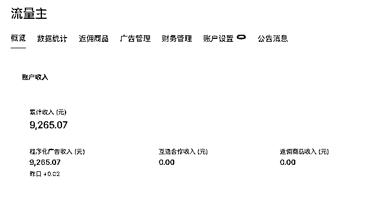

（让我踏上爆文道路的第一个号，在池3个月的总收入）

## 2、2023年10月：开始扩大账号规模，多点尝试

发现问题，那就解决问题。既然这个领域不行，那就多点开花试试。

于是在趁着国庆节回家，把家里的亲戚们的微信都借来注册了公众号，就这样又攒了10个号。（论平时与亲戚好友搞好关系的重要性，笑）

通过刷看一看，我将平时刷到的爆文和对应的领域都收集了起来。收集的方法也很简单，针对不同领域的文章，建立一个微信群，把看一看和更多推荐刷到的文章统统都丢到对应的群里。要写的时候再来里面选文章。

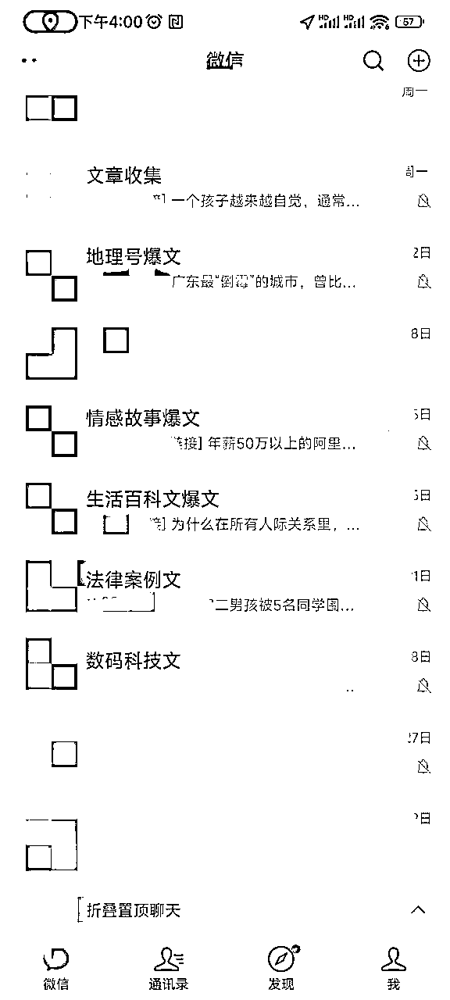

（有段时间，我的微信列表几乎快被各种收集文章的群占满了）

这一次，除了原来的情感领域，我又把这几个新号都分散到不同的领域去进行测试。除了情感领域，又开始尝试地理、民生、养老金、创业、交通、军事、娱乐等。

这期间，因为要写不同领域的文章，于是针对不同领域，开始去尝试不同的prompt，也终于升级了GPT4。升级完GPT4后，我发现了对我写文章帮助最大的一个神器——webpilot。由于新领域很多是科普性质的内容，加上联网功能的GPT，写作这类文章简直是如虎添翼。（不过webpilot现在用不了，可以直接让GPT4或kimi进行搜索写作）

当时在给了GPT人设、写作工作流、写作要求这些基础的设定后，最后写文章时都会这么给GPT下指令。

```
请联网搜索相关资料，并以《xxx》为题，写一篇1500字议论文/叙事议论文/故事。
```

或者先列大纲再进行写作

```
我准备以《xxx》为题，写一篇1500字的议论文/叙事议论文/故事，请联网搜索相关资料，并为我列一个文章大纲。
```

这批新号的尝试，最终有一半的号入池，也终于让我第一次体会到日入过千的感觉。到这一阶段，在公众号上也终于是赚到了接近2w块钱。

不过这阶段也有很多的问题：

1、文章爆了后，没有及时将爆文重复发，榨干流量，导致浪费了很多爆文流量（信息闭塞的缺点，不知道可以这么操作）

2、一个领域入池后，没有及时开更多新号及时进入这个领域。

3、没有一个停更标准，导致在没入池的号上浪费了过多时间。

## 3、2023年11月：发现热门领域，单号爆文

到了11月，10月份的号陆续入池又出池了。但其中10月中旬起的一个新号，让我发现了一个新的领域——职场体制。起初也是跟10月份一样的策略，看到了新的领域，有新的多余的号，就写起来试试。

可是这个号让我发现了不一样的情况——它太爆了。

虽然我也写过不少10w+了，但基本上数据也就停留在20、30w级别。但是这个职场号突然有一篇文章，数据一下跑到了上百万的播放。以至于那几天，我发了文章后，啥事都做不了，一直盯着文章数据刷新，生怕出事。

这个号也有个小插曲，有一篇10w+的爆文，被其他号投诉抄袭了。当时那个慌啊，在网上各种找解决办法。不过好在这篇文章除了标题类似，其实内容并不是洗稿，而是自己写的。

一开始想硬刚到底，最后想想还是以和为贵。于是尝试对方公众号留下的微信，加了对方。并真诚道歉，愿意删文处理，好在这位大哥仁慈，最后放了我一马。谢谢好大哥🙏

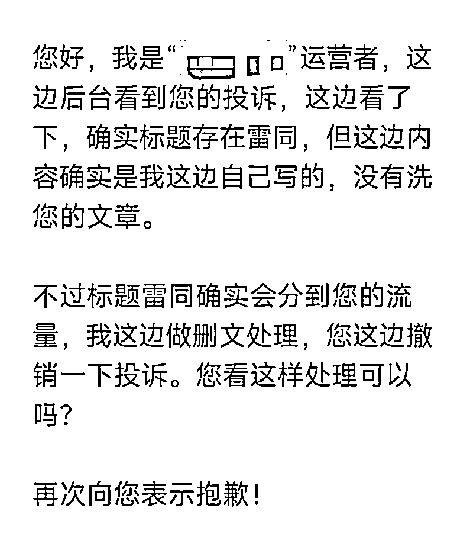

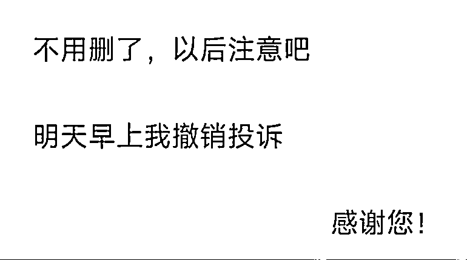

（感谢这位好大哥，您是我贵人😭）

在接连出了多篇文章后，这个号帮助我一天收入破了5000！不过好景不长。11月中旬，这个号突然就出池了，巨大的收入差距一下让我有了心理落差。

不过怎么说也做了2、3个月，开始有了经验和手感，决定继续深耕。能爆第一次，肯定能爆第二次，方法对了，剩下的就是执行了。

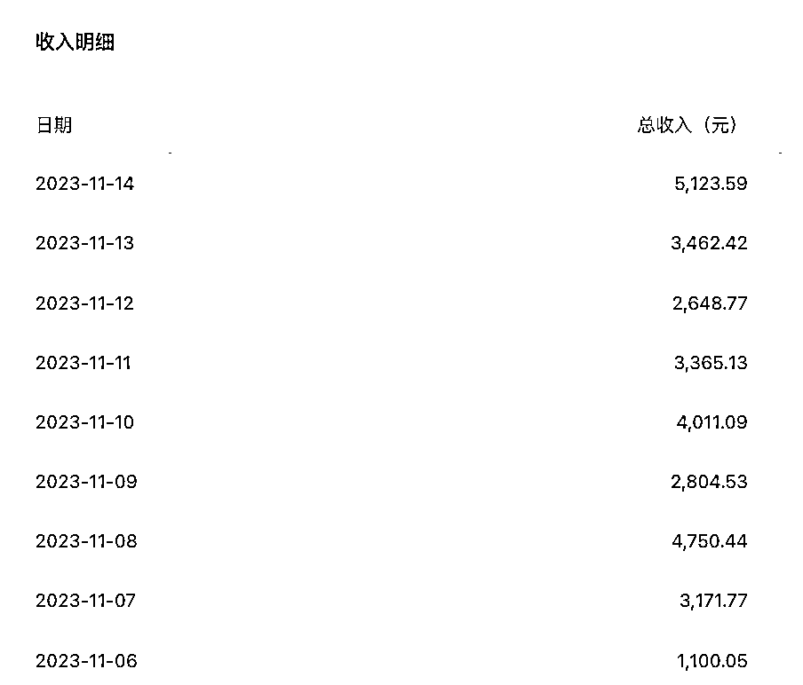

（日入过千的爽感）

## 4、2023年12月-1月：单领域发力，持续爆文

总结了前几个阶段的教训，决定深耕已经爆了的职场体制领域。经过不断的刷对标文章，我发现，虽然都叫职场体制领域，但每个人文章的写法、内容其实都不太一样，各有各的爆法。

总结了上个月爆文的号，我发现，要想写的起来，就需要更垂直。

比如说，一个职场公众号其实还是不太垂直，但是一个写职场里人情事故的公众号就垂直了。一个写剧评的号不垂直，一个专门写《三十而已》的账号就垂直了。

于是我将市面上收集到的队标账号，按不同的细分领域进行了划分。

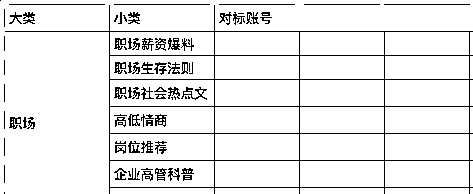

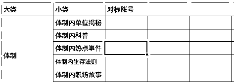

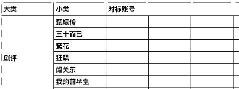

（将大领域进一步细分到小领域）

除了内容垂直，标题也要垂直，最好是垂直到某个别关键词上去。

因为在这一阶段，公众号的推荐算法，很大程度上是依赖标题里的个别关键词的。

这也是为什么，一些火的文章大都是固定的标题形式

“单位里，xxxxx”

“莫言说：xxxx”

“《三十而已》：xxxx”

“xxx退休金，xxxx”

对标账号有了，对标文章也有了，于是我又厚着脸皮，找亲朋好友注册了一堆新号。

（ps：看到好多人怎么凑到那么多个人号，我是没有什么特别的方法，脸皮厚而已）

这一次，我将这批新号都砸到了职场和体制的各个细分领域。

果然，选对了时下的热门领域，这批新号在更新了10～30篇文章后，都陆陆续续入池了。

通过这批号，让我12月一直到过年，都挺滋润。写的细分领域多，每天都有不同的号给我惊喜。

这一阶段也是整个项目里成绩最好的阶段。

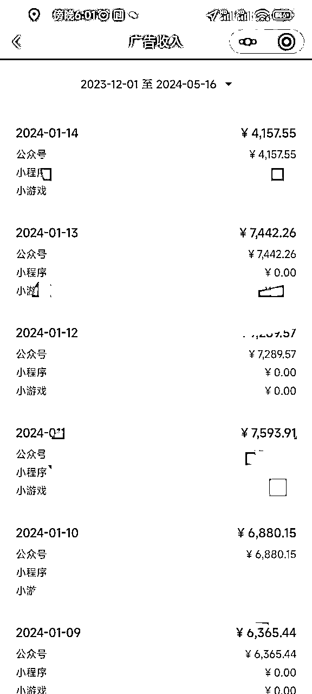

## 5、2023年2月-3月：开始尝试自动化，但入场太晚

在之前的阶段，我很快就发现了瓶颈。由于我是自己使用AI进行写作，原先的收入规模，其实很大程度受限于我的精力和我的脸皮厚度（刷脸刷的差不多了，没有新的账号可以借了）

当时关注了许多这方面的公众号，了解到许多人在用RPA来进行公众号写作。我心想，这东西好呀。于是花了1个星期的时间学习和尝试，终于跑通了流程。

我的一整个自动化工作流的思路包括两种：

1.  改写文章工作流

1.  找到头条上的对标账号

这一步可以通过易攥等平台，找到对标账号。

1.  通过八爪鱼或后裔采集器，采集对标账号的文章

现在的采集器都已经有智能采集功能了，如果只是采集文章标题、链接等，基本不需要过多的操作，将对标账号的账号主页填到采集器里，智能采集就可以了。如果是既要采集标题，又要采集正文，则要多一步点击进入链接，再采集正文内容。之后将采集到的内容放到excel中。

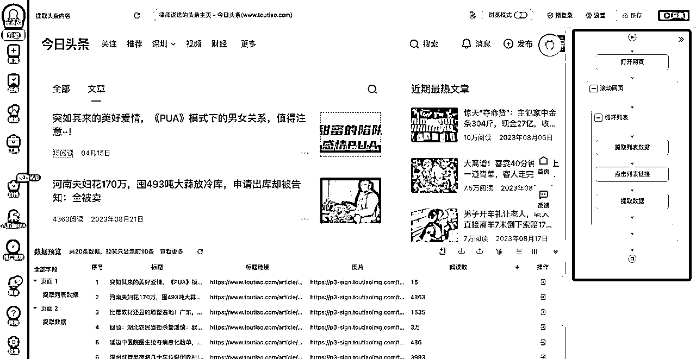

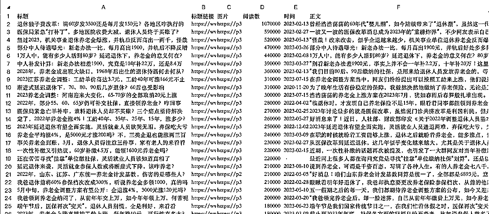

1.  搭建好改写文章的ChatGPT对话，之后使用影刀RPA，批量将表格中的标题及正文部分提交给ChatGPT，并将写好的文章自动复制保存到本地。

1.  原创文写作工作流

1.  收集爆款文章标题

1.  搭建好原创文章的ChatGPT对话，之后使用影刀RPA，批量将表格中的标题提交给ChatGPT，并将写好的文章自动复制保存到本地。

虽然使用RPA解放了生产力，可以做到一晚上输出几十上百篇文章。但是很快也发现了弊端，批量输出的文章，无法跟自己用AI写作一样，对写的不好的地方，让AI进一步修改。因此自动生成的文章质量普遍比较一般。

再加上3、4月份后，公众号推荐不再像以前一样，只看文章标题，而是越来越看重文章内容质量。

使用RPA自动写作的这批账号，入池率远远不足之前。

总的来说，因为入池太晚，我并没有通过RPA在公众号获得太多的收益。

# 二、项目总结

目前，之前入池的老号陆续出池了，再加上新号越来越难入池，目前整体的收入水平已经远远不足前几个月了。

总结这几个月以来，注册加上注销后重新注册的，陆陆续续写过42个号，通过流量主收入总共也赚了18w。

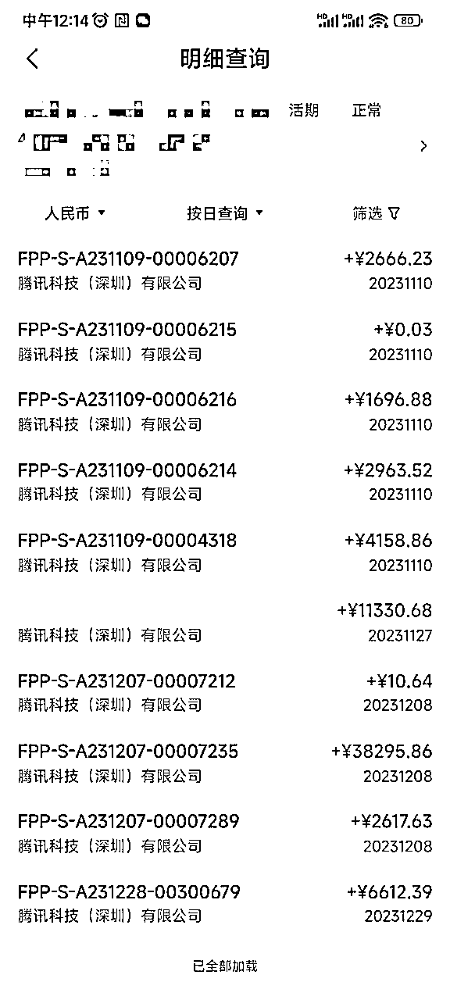

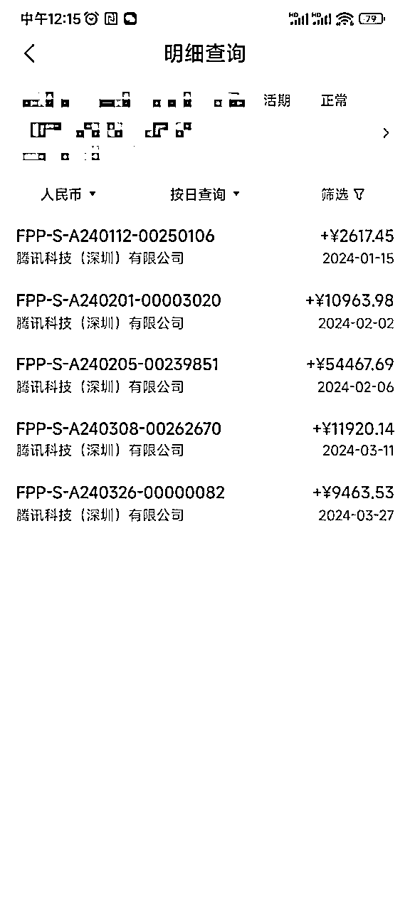

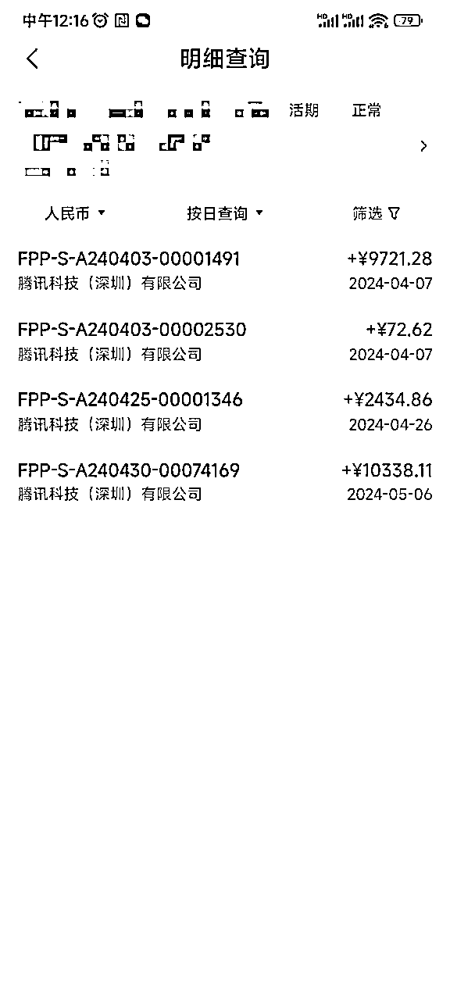

这个成绩，还是远远比不上其他圈友的。

# 三、经验教训

总结这次项目，还是有很多经验教训可以总结。比如说，没有及时在还有红利的时候，用更多方式，去扩大账号规模。也没有趁早去做自动化的事。

其中，最重要的事，在这次项目里，太过闭门造车。

为什么这么说呢？

因为这个项目从头到尾，我都是自己一人琢磨，在网上搜索问题答案。

这样子有一个很大的弊端，就是很容易消息闭塞。

加入生财后，每天翻阅圈友的帖子，都让我叹为观止。

“原来还能这么做”

“为什么我不早点看到”

实话说，如果早点加入生财，多去链接朋友，遇到问题积极主动请教，多去与他人合作，在这个项目上的收益肯定还可以做到更高，不过这都是后话了。

# 四、项目现状

## 1、还能不能做？

现阶段，如果问我这个项目还能不能做，我的答案是：这已经不是一个可以随便写写就能轻松赚钱的项目，但还是很有机会的。

为什么已经不能轻松赚钱了呢？很简单，平台算法是一直优化迭代的。

初期，平台推荐算法还不成熟，因此只要掌握了选题技巧，在比较火的领域，蹭到了比较火的标题，文章很容易就可以爆起来。

而随着算法的迭代优化，平台一定会对标题党内容有所限制，并且肯定会越来越看重内容质量。仅仅靠一个prompt来生成的文章，越来越难拿到流量了。

另外一方面，一个领域火了，越来越多人入场，同质化开始严重，导致每个号分到的推荐量变少了。同时，一些领域如果充斥着太多同质化内容，也会逐渐被平台所限制。

有人问，平台是否会打击限制AI内容，我认为平台是不会专门限制AI内容的。平台真正会限制的，是低质、虚假的内容。只是AI很容易产生这类的内容而已。因此无论是否使用AI，最重要的，还是要产出更高质量的文章。

## 2、后续的机会点

后续项目的机会点，我认为要从选题和文章质量上入手。

从选题上：

有两种思路。

1.  往更细分、更蓝海的领域去尝试；

1.  火过的领域、文章、选题，可以换个方式、换个领域去写，很有机会再火一次（例如下面这个例子）。

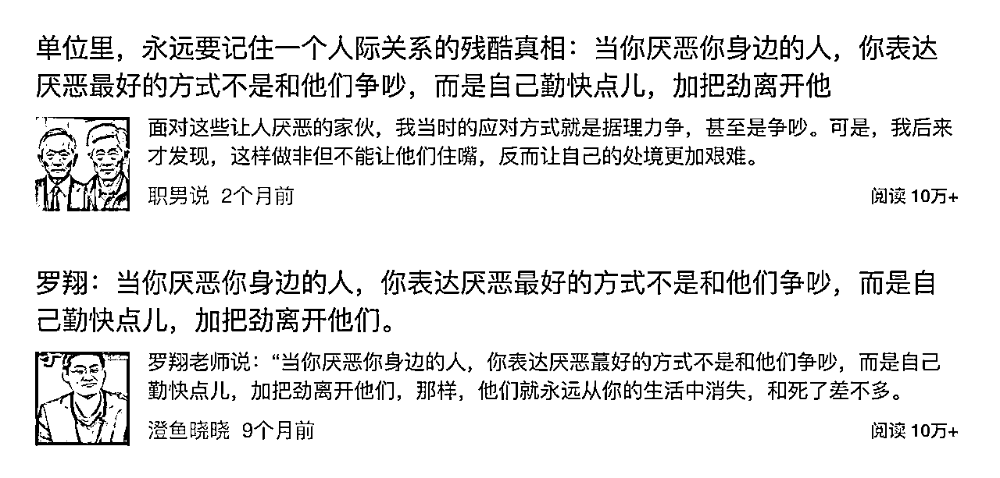

从文章质量上：

1.  有能力原创写出高质量文章的，可以试试原创（不过这不适合矩阵玩家）。观察到的近期很多爆文，原创文章的比例明显占比要更高。

1.  使用AI生成的，应该进一步提升自己的prompt调试能力，不断调试自己的prompt，使得生成的文章不要那么的AI味，质量更高。

# 五、一些技巧分享

1.  AI输出的文章如何减少AI味，提高AI写作的质量？

有几种思路可以参考：

1.  思路一：就是用更智能的大模型，简单来说，更高级的大模型+简单的prompt的效果，要优于普通的大模型+复杂的prompt。

1.  思路二：我们会觉得文章充满AI味，是因为如果我们没有特别限定的话，大模型会倾向于使用概率更高的文字、句式，比如经常出现的“首先、其次、另外、总的来说、想象一下、除此之外”等，所以一个简单的方式是，在prompt里直接限制这些句式，不允许AI使用。另外还可以通过控制temperture参数，来控制输出的多样性。

```
## 写作限制：
1\. 不允许使用首先、接下来、然后、最后这样的连接词
2\. 不允许使用“想象一下”
3\. 不允许使用“总结来说”
4\. 不允许使用“在探索……时”或类似的句式
……
```

1.  思路三：让AI直接学习你想要学习的文章风格，这部分星球里和网上有许多教程，可以参考这个B站UP主的视频。https://www.bilibili.com/video/BV1rt421W7r2/?share_source=copy_web&vd_source=fcec28f89881477399bf778508bb6e89

1.  思路四：最根本的方法，还是提升自己的写作水平，把AI当成辅助。自己总结观点，给出案例，让AI帮你把凌乱的观点总结成大纲，根据大纲再进行写作。要把AI当成一只更快的笔，而不是期待AI能帮你完成一切。

1.  如何从微信中进行选题？

如果是几个月前，常见的方式是去用最新的爆款文章标题，去跟一篇10w+的文章，如果你跟的够快，你可以很有机会获得10w+；跟的晚一点也有机会拿到几万的阅读。

而目前感受到的一个趋势是，微信对重复文章的限制更高了，短期内一模一样或者类似的标题，比较难再获得推荐量。

从内容推荐的思路来考虑，平台当然不希望用户在短期内一直重复看到相似的内容。

因此换个角度，我们可以不选择近期的爆文，而去选择一些几个月前的爆文。找到后可以搜一下这个标题近期的竞争性如何，如果近期很多人都写过了，就pass。如果近期都没人写过，就可以写写试试。

# 六、后话

以上就是这几个月来，操作公众号这个项目的复盘和分享。第一次发帖，写的不好，还请见谅。

如果有其他疑问，欢迎交流。

后续除了公众号，应该也会分出更多精力，去试试其他项目。

最后，特别感谢毛韩、阿泽kk两位圈友，这次分享主要是因为看到了两位优秀圈友最近关于公众号经历的分享，很有感触和启发，因此才下定决心写完这篇文章。

希望这篇文章某一两个点，可以给到你启发。