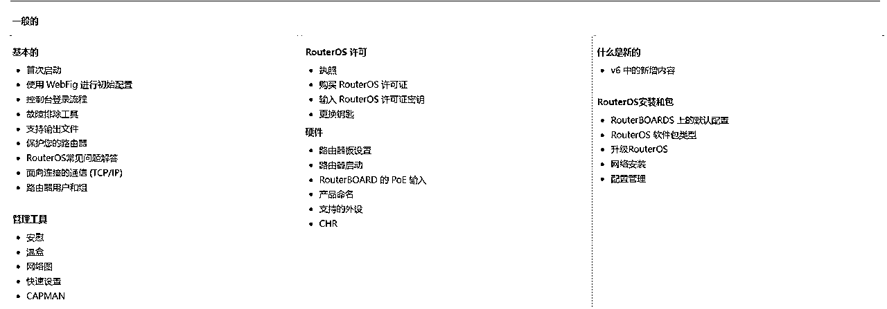

# 小红书矩阵搭建，技术层面的sop，看完可以直接实操的教程

> 来源：[https://dwxxd0xelf9.feishu.cn/docx/VKgsdutvJo9PScxT6DDc2H7Snuc](https://dwxxd0xelf9.feishu.cn/docx/VKgsdutvJo9PScxT6DDc2H7Snuc)

本内容为【搞定小红书流量】社群分享内容，想要了解社群更多干货，可以加V：life210302

# 前言、矩阵搭建三要素

从平台的角度，肯定不希望有人大批量操作账号，所以搭建矩阵本质上也是在对抗平台机制。所以能不能搭建成功，关键在于能不能绕过平台的机制规定，把矩阵下的每个账号都装饰成真人操作使用的假象。

很多人讲矩阵，只是一味说怎么快速做内容，买一堆手机，快速注册账号，听来好像很容易，但是真要做下去的时候，就会发现，手机买回来了，内容也有了，但是发出去，总是没有流量，不知道是什么原因。其实这就是忽视了，底层架构搭建的重要性。

决定矩阵是否有效的关键因素，主要有三个：设备、网络、账号。

新媒体的矩阵就是通过增加账号的手段，放大曝光及流量获取。

这是与平台检测机制对抗的过程，核心就是不让平台知道你是一个工作室批量在运营账号，而是需要把账号分隔成一个个个体。

三要素哪个方面出问题，都有可能被平台限流。

很多人在手机直接多开，有时候量小没有问题，但是有时候怎么做内容都没有流量，那就是很可能被检测到了是单系统多号，被平台限制了。

被限制的最直接表现就是不出恭喜，或者笔记过不了推广，或者直接就建不了群聊，该账号可以注销放弃。反之，出了恭喜或能推广，账号后续的笔记只要质量好，就会有流量（下图为恭喜）

# 一、设备篇

怎么选设备呢？无外乎是安卓或者苹果，如果是一机一号，苹果大概率都是比较好用的，但是如果是矩阵操作，这个就涉及到刷机、成本、以及是否可以使用群控软件等等问题，考虑的就会比较复杂一些。

没有一个型号可以一招鲜的，会不断变化，需要时时跟进系统更新潮流。

## 1、安卓还是苹果？

安卓优点：各种黑科技软件支持丰富，群控工具多，方便刷机，价格实惠

安卓缺点：老机型和低版本系统相对容易风控检测

苹果优点：总体来说设备权重比安卓稍高

苹果缺点：改机不方便，对ios系统有要求，采购麻烦，价格稍高

## 2、采购要点

### 2.1安卓：

（1）选择Adnroid 10及以上操作系统

（2）选择已解BL锁的手机（方便刷机和改机）（不打废号流可忽略）

（3）处理器型号不要选太新的（改机成本高），高通为例：晓龙835~865均可（不打废号流可忽略）

### 2.2苹果：

（1）不要选6s及以下机型（容易风控）

（2）ios系统版本在ios12.0~ios16.6.1之间为佳（如果不需要打废号流则可忽略）

（3）如果后续要涉及改机，则选处理器是A12以下的手机型号

## 3、刷机

如果买的是二手手机，不确定是否为工作室淘汰下来的，最好先清理一遍。

否则平台可能会因为你的设备问题，限制流量。

或者账号违规之后，最好也清理一遍手机。

清理则一般有双清、三清、四清或者重装系统/更换系统的方式。

一般常说的双清是指删掉手机数据和虚拟空间数据，四清及以上的就是把手机系统也删掉重装。

此步骤是在手机解了BL锁的前提下才有用，未解请先解锁。所以买二手手机也有很多门路，不然买回来的可能就是一个砖头，看起来好像可以用，但是怎么做都没有流量。

### 3.1安卓线刷（以小米为例，原理步骤大差不差）：

（1）下载自己手机型号的ROM包【下载渠道：https://onfix.cn/rom】

分清楚自己需要的是线刷包还是卡刷包，线刷包是手机接数据线到电脑上刷机用的包，卡刷包是复制到手机里用的包，可根据实际使用场景来选择。

（2）自行下载对应自己手机品牌的刷机工具，网上一搜一堆。搜索内容如：品牌+刷机工具

（3）手机进入fastboot模式后将数据线接上电脑（各品牌手机不一定一样，以小米为例就是关机状态下，同时按电源键加音量-键。

（4）先选择对应的ROM包路径，接着选择【全部删除】，接着加载设备，最后点击刷机。

### 3.2安卓卡刷（以小米为例，原理步骤都一样）：

（1）准备对应的ROM包【下载渠道：https://onfix.cn/rom】

分清楚自己需要的是线刷包还是卡刷包，线刷包是手机接数据线到电脑上刷机用的包，卡刷包是复制到手机里用的包。

（2）下载TWRP，下载前请查询自己的手机型号代码，可用我发的工具查询或者直接网络搜索。

比如小米9查询到的代号就是cepheus

twrp下载，在上面的下载ROM包的渠道里面也有，如果没有可在开源平台查找：https://sourceforge.net/projects/recovery-for-xiaomi-devices/files/

（每个不同型号的手机和不同的操作系统对应的twrp包都有区别，注意分辨）

前面的name是指对应手机型号的代号，进入自己手机相应代号的目录下来下载文件

注意文件名称的A多少，比如A13，就可用于Android 13或者12系统。A12只用于Android 12，A11就11，A10就10，下载对应系统版本的文件。如果都没有，可试着下载最下方的twrp通用包。

另外只下载twrp的，orangeFox橙狐的此处暂不考虑。

（3）安装TWRP，执行命令 fastboot boot + 下载好的twrp文件路径，之后按回车确定

提示OKAY就是安装好了，接着等手机重启自动进入twrp界面

初次进入如果看不惯英文的，可以把语言设置成中文，接着滑动最下方的滑块进入

如果想要双清，就点击【清除】，如果想要重装系统，就点【安装】（图1）。点进安装后点击对应下载好的系统安装包即可安装。安装完之后先别重启，记得进入清除界面，点击【格式化Data分区】再重启，不然可能导致无法开机。

如果点击清除，正常滑动滑块就是双清（图2），如果要三清或者更多就点进【高级清除】里面（图3），双清是清Cache+Data。你勾选几个就是几清。注意勾选System就是清除系统，清除后必须安装新的系统才能开机。注意最下方的USB-CTG要勾选。不然可能导致你的电脑在相应目录下的文件被清除。清除完后重启手机即可。

注意，如果手机要进行软改，最好也是需要下载twrp的，然后在里面安装面具等软件。

如需硬改，则不用下载twrp，开9008端口即可。

### 3.3 苹果刷机

正常来说还原出厂设置即可，如果想重装系统，则下载爱思助手https://www.i4.cn/，在里面寻找对应型号手机的固件包来安装下载。

注意，如果你原本的手机是ios14~16之间的系统版本，就不要下载新的固件包来安装了，还原手机就好。如果你手机原本就是你这个型号所能够升级到的最新系统，则无所谓，可直接选个可刷机的安装。（固件版本的意思就是ios的系统版本）

# 二、网络篇

## 1、为什么要注意网络？

如果要做矩阵，那肯定不能所有手机都连同一个wifi，因为多了会被检测出异常，从而导致限流。

做矩阵，不连WiFi是基本常识。

如果手机用的是正常手机卡的流量来上网，那最好没事就带着手机走走，更换基站，不要长时间在同一个地方。

但是如果你有几十上百台手机的时候，手机卡模式还是比较容易出问题，就算是一机一卡一号的情况下，基站是同一个，账号还是容易限流。

这时候就有了叫全国跳的物联卡和软路由，两种解决方案，去解决IP的问题。

## 2、网络解决方案

### （1）正常手机卡/流量卡：

遵从一机一卡一号的原则，每台手机只登陆一个账号，配有一张手机卡，用手机卡的流量上网。月租越低越好，能上网就行。如果是专门只为了上网，可以买流量卡或者物联网卡，月租大概10~30，按流量套餐收费。不过需要没事就带着手机走走，更换基站和网络ip。

优点：使用方便

缺点：如果用正常手机卡，月租成本就相对高。而且当你的矩阵有二三十台设备，这样密集的堆积在同一个地方短时间内发帖，容易被限流。

### （2）物联网卡：

有的物联网卡是所谓的全国跳，意思是开关飞行模式之后，你的ip就会变。这样就不用担心在同一个地方堆积有大量的设备短时间内发帖被限流的问题。不过注意区分全国跳的优劣，有的卡跳的地区很少，有的会有限制导致不能跳出省（比如重庆等地区）

优点：一般是小型矩阵是最佳解决方案

缺点：在同一个地点可跳的ip有限。

### （3）软路由：

矩阵网络的终极解决方案。可以通过一个路由器，来发射多个wifi信号，让每台手机都连不同的wifi，来实现ip隔离。（以下为ROS的定制版系统，原版会多很多功能和目录，自由度更高，同时操作要求也更高，且为纯英文界面。下面的Name有许多个wifi，可针对每个wifi信号进行单独管理。也可自定义脚本，一键更换路由器的mac地址和wifi名称等等）

可通过安装路由器的系统或者购买软路由器来配置。

路由器分两种，平常我们使用的是硬路由，及路由器的系统固件已经固定，只能用官方给的路由器操作系统，功能单一。而软路由，它的操作系统没有被固定下来，可以自行安装功能性强很多的路由器操作系统。比较主流的操作系统有，ROS【功能强大，使用门槛高】、iKuai（爱快）【中文界面，操作相对友好】、openWrt【开源系统，免费，多平台支持】、immortalWrt（openWrt的分支版本，功能更多）

优点：功能强大，能满足所有矩阵方面的网络需求，可独享纯净ip。

缺点：不容易上手，ip需要单独购买

## 3、软路由配置

### 3.1 介绍：

其实路由器就是一台电脑，和给电脑安装操作系统和使用是同一个逻辑。路由器操作系统很多，支持的平台也很多，arm的x86架构的都有。意味着除了路由器外，普通的电脑可以当软路由，小主机能当软路由，甚至闲置的安卓手机也能当软路由。由于篇幅有限，在此只挑选ROS系统和openWrt/immortalWrt系统来说明。

### 3.2 ROS安装

首先ROS系统是梯度收费的。不同的权限等级能发射的wifi信号数量也不同（与软路由的硬件配置和系统限制有关）。如果买出厂就带有ROS系统的路由器（比如Mikrotik的入门系列），那一般是3级权限。如果买稍好一些的软路由（上千块的那种），一般就带有4级权限。

如果不是专门购买有ROS系统的路由器，可在此处下载ROS正版操作系统：https://wiki.ros.org/ROS/Installation

（或者搜索“学习版”的操作系统）

如果有直接购买ROS操作系统的路由器，可按照操作手册配置安装：https://wiki.mikrotik.com/wiki/Manual:TOC

可两个手册结合着了解：https://help.mikrotik.com/docs/

完成安装后进入路由器的后台管理界面，在配置的过程中ROS系统一般用l2tp协议即可，后续租赁ip也是要租赁对应协议的ip。之后依次填入服务器地址和密码，启动wifi即可。

ip配置完后查看ip界面

wifi界面同理

线路通畅后，wifi名称最好也随机化，在中间加点标识，能让自己分清连的是哪条wifi即可

### 3.3 immortalWrt/openWrt安装

1、下载

首先进入immortalWrt（添加了一些不一定用的上的功能）/openWrt（系统纯净）的网站，输入自己的路由器型号来查看是否支持自己的设备，及该安装哪个版本的操作系统。如果想用电脑来充当软路由，就直接搜索x86/64

immortalWrt支持和下载版本查询：https://firmware-selector.staging.immortalwrt.org/

openWrt支持和下载版本查询：https://firmware-selector.openwrt.org/

2、安装

如果你的路由器恰好支持刷openWrt/immortalWrt操作系统，那可根据文档直接操作：https://openwrt.org/docs/guide-quick-start/factory_installation

如果是想要在电脑安装路由器操作系统，则可借助虚拟机的方式安装。下载VHDX后缀的文件。如果只有img后缀的，则用 StarWind V2V Converter（https://www.starwindsoftware.com/starwind-v2v-converter#download）工具，将img格式的文件转成VHDX格式。

如果没有虚拟机则先安装VMware虚拟机

VMware虚拟机下载：https://www.123pan.com/s/g520Vv-uIWid.html

2.1 准备工作完成后正式开始安装，新建虚拟机时注意选择【使用桥接网络】，并且充当路由器的电脑需要直接连接网线。（可在原本上网的路由器直接拉一条网线来接电脑）

选择【自定义】，（此步骤未截图的地方按照默认选择安装即可）

不需要安装那么新的虚拟硬件

操作系统选择Linux，版本如图

按照自己喜好取个名字，和设置安装的位置（建议不要放C盘）

接下来的步骤是设置虚拟机的配置，如无特别需求默认即可，若电脑配置较好的，也可给它分配更多的性能。

安装完成后进入系统

进入虚拟机后输入：ip a （查看路由器当前的ip，如果与路由器网关ip重叠，则需要修改ip），一般第一次安装是192.168.1.1，直接修改ip即可。

输入：vim /etc/config/network （接着通过方向键将光标移动到需要更改ip的区域）

修改完后，将光标移动到下方空白处，输入 :wq 保存并退出编辑。

接着输入：/etc/init.d/network restart （重新连接网络）

接着再输入ip a，查询ip是否修改成功。

最后在浏览器，输入刚刚设置好的ip地址，即可进入管理后台。

最后按照手册设置ip即可：https://openwrt.org/docs/guide-user/start

注意，openWrt/immortalWrt 一般支持SOCKS5协议的ip，购买ip时请注意。

# 三、账号篇-账号区别

如果你只是做自己手机的账号，可能就没有那么复杂，注册就好了。

但是你要做的矩阵几十上百个账号，甚至于你打的是废号流，那么你每天的账户注册都非常多，这时候就需要花点时间去研究一下，什么样的账号更有流量，或者说能显得正常一些。

账号背后，其实就是对应注册用的手机卡类型，

一般注册的手机号有三网厅卡、广电卡、虚拟卡（注册卡）、dt号（地推）、lj号、自己的手机卡；（至于怎么找到这些手机卡资源，互联网上一大堆，用心去找，都能找得到的，或者找做矩阵工作室的朋友，问一问应该也都有）

对应不同手机卡的账号权重：自己的手机卡=lj号≥dt号>三网厅卡>广电卡=虚拟卡（注册卡）

按需选择即可，如果设备和网络环境很干净，权重很高，那随便什么手机卡都能出恭喜和过推广。但是做矩阵的，环境不干净，其实也是很常见的事情。

如果对设备或者网络没那么有把握，则尽量选择权重高的手机卡来注册账号。

# 四、软件篇-群控软件

手机多了，账号多了，怎么管理就会是一个问题。

互联网解决方案很多，群控软件就是其中之一，一台电脑管理几十台手机的技术早就都有了。

市面上群控软件很多，针对不同平台的都有，自行寻找即可。

核心：如果是通过wifi群控，则要确认群控软件有没有搭建服务器，如果有，就无需和安装群控软件的电脑保持同一个wifi，手机拿去其他地方用数据流量也能控。

如果只能通过同一wifi群控，则要考虑能否实现ip隔离，如不能，则不要选择这种群控软件。如果是通过数据线群控，则提前买好分线器。

# 咔咔咔咔，不知不觉写着写着就好几千字了，感觉写得已经很仔细了，但是好像也还有不少没有写出来，希望大家看完都有收获哈！

# 虽然说的是小红书，但是其他平台道理也是类似的。

# 欢迎大家多交流（+V：life210302），一起搞流量，一起暴富！